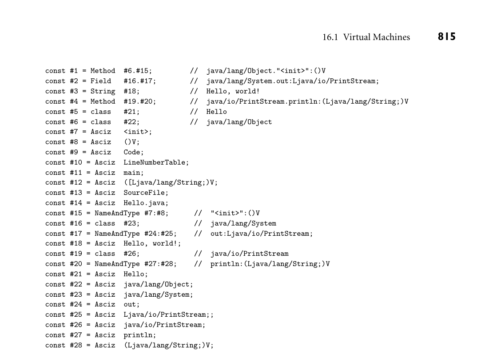
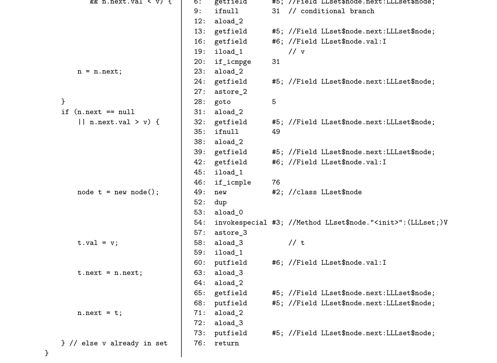

# 16.1 Virtual Machines

810 Chapter 16 Run-Time Program Management

compiler-generated code (e.g., parameter-passing conventions, synchronization mechanisms, and the layout of run-time stacks). The coupling between compiler and runtime runs deeper than this, however: the CLI programming interface is so complete as to fully hide the underlying hardware.1 Such a runtime is known as a virtual machine. Some virtual machines—notably the Java Virtual Machine (JVM)—are language-specific. Others, including the CLI, are explicitly intended for use with multiple languages. In conjunction with developmentof their version of the CLI,2 Microsoft introduced the term managed code to referto programs that run on top of a virtual machine. ■ Virtual machines are part of a growing trend toward run-time management and manipulation of programs using compiler technology. This trend is the sub- ject of this chapter. We consider virtual machines in more detail in Section 16.1. To avoid the overhead of emulating a non-native instruction set, many virtual ma- chines use a just-in-time (JIT) compiler to translate their instruction set to that of the underlying hardware. Some may even invoke the compiler after the program is running, to compile newly discovered components or to optimize code based on dynamically discovered properties of the program, its input, or the underly- ing system. Using related technology, some language implementations perform binary translation to retarget programs compiled for one machine to run on an- other machine, or binary rewriting to instrument or optimize programs that have already been compiled for the current machine. We consider these various forms of late binding of machine code in Section 16.2. Finally, in Section 16.3, we con- sider run-time mechanisms to inspect or modify the state of a running program. Such mechanisms are needed by symbolic debuggers and by profiling and perfor- mance analysis tools. They may also support reflection, which allows a program to inspect and reason about its own state at run time. 16.1 Virtual Machines

A virtual machine (VM) provides a complete programming environment: its ap- plication programming interface (API) includes everything required for correct execution of the programs that run above it. We typically reserve use of the term “VM” to environments whose level of abstraction is comparable to that of a com- puter implemented in hardware. (A Smalltalk or Python interpreter, for example, is usually not described as a virtual machine, because its level of abstraction is too high, but this is a subjective call.) Every virtual machine API includes an instruction set architecture (ISA) in which to express programs. This may be the same as the instruction set of some

1 In particular, the CLI defines the instruction set of compiler’s target language: the Common Intermediate Language (CIL) described in Section C 16.1.2.

2 CLI is an ECMA and ISO standard. CLR—the Common Language Runtime—is Microsoft’s im- plementation of the CLI. It is part of the .NET framework.

16.1 Virtual Machines 811

existing physical machine, or it may be an artificial instruction set designed to be easier to implement in software and to generate with a compiler. Other por- tions of the VM API may support I/O, scheduling, or other services provided by a library or by the operating system (OS) of a physical machine. In practice, virtual machines tend to be characterized as either system VMs or process VMs. A system VM faithfully emulates all the hardware facilities needed to run a standard OS, including both privileged and unprivileged instructions, memory-mapped I/O, virtual memory, and interrupt facilities. By contrast, a process VM provides the environment needed by a single user-level process: the unprivileged subset of the instruction set and a library-level interface to I/O and other services. System VMs are often managed by a virtual machine monitor (VMM) or hyper- visor, which multiplexes a single physical machine among a collection of “guest” operating systems, each of which runs in its own virtual machine. The first widely available VMM was IBM’s CP/CMS, which debuted in 1967. Rather than build an operating system capable of supporting multiple users, IBM used the CP (“con- trol program”) VMM to create a collection of virtual machines, each of which ran a lightweight, single-user operating system (CMS). In recent years, VMMs have played a central role in the rise of cloud computing, by allowing a hosting center to share physical machines among a large number of (mutually isolated) guest OSes. The center can monitor and manage its workload more easily if customer workloads were running on bare hardware—it can even migrate running OSes from one machine to another, to balance load among customers or to clear ma- chines for hardware maintenance. System VMs are also increasingly popular on personal computers, where products like VMware Fusion and Parallels Desktop allow users to run programs on top of more than one OS at once. It is process VMs, however, that have had the greatest impact on program- ming language design and implementation. As with system VMs, the technology is decades old: the P-code VM described in Example 1.15, for example, dates from the early 1970s. Process VMs were originally conceived as a way to increase program portability and to quickly “bootstrap” languages on new hardware. The traditional downside was poor performance due to interpretation of the abstract instruction set. The tradeoff between portability and performance remained valid through the late 1990s, when early versions of Java were typically an order of mag- nitude slower than traditionally compiled languages like Fortran or C. With the introduction of just-in-time compilation, however, modern implementations of the Java Virtual Machine (JVM) and the Common Language Infrastructure (CLI) have come to rival the performance of traditional languages on native hardware. We will consider these systems in Sections 16.1.1 and 16.1.2. Both the JVM and the CLI use a stack-based intermediate form (IF): Java byte- code and CLI Common Intermediate Language (CIL), respectively. As described in Section 15.2.2, the lack of named operands means that stack-based IF can be very compact—a feature of particular importance for code (e.g., applets) dis- tributed over the Internet. At the same time, the need to compute everything in stack order means that intermediate results cannot generally be saved in registers

812 Chapter 16 Run-Time Program Management

and reused. In many cases, stack-based code for an expression will occupy fewer bytes, but specify more instructions, than corresponding code for a register-based machine.

16.1.1 The Java Virtual Machine

Development of the language that eventually became Java began in 1990–1991, when Patrick Naughton, James Gosling, and Mike Sheridan of Sun Microsystems began work on a programming system for embedded devices. An early version of this system was up and running in 1992, at which time the language was known as Oak. In 1994, after unsuccessful attempts to break into the market for cable TV set-top boxes, the project was retargeted to web browsers, and the name was changed to Java. The first public release of Java occurred in 1995. At that time code in the JVM was entirely interpreted. A JIT compiler was added in 1998, with the release of Java 2. Though not standardized by any of the usual agencies (ANSI, ISO, ECMA), Java is sufficiently well defined to admit a wide variety of compilers and JVMs. Oracle’s javac compiler and HotSpot JVM, released as open source in 2006, are by far the most widely used. The Jikes RVM (Research Virtual Machine) is a self-hosting JVM, written in Java itself, and widely used for VM research. Several companies have their own proprietary JVMs and class libraries, designed to provide a competitive edge on particular machines or in particular markets.

Architecture Summary

The interface provided by the JVM was designed to be an attractive target for a Java compiler. It provides direct support for all (and only) the built-in and

DESIGN & IMPLEMENTATION

16.2 Optimizing stack-based IF As we shall see in Section C 16.1.2, code for the CLI was not intended for inter- pretation; it is almost always JIT compiled. As a result, the extra instructions sometimes needed to capture an expression in stack-based form are not a se- rious problem: reasonably straightforward code improvement algorithms (to be discussed in Chapter 17) allow the JIT compiler to transform the left side of Figure 15.4 into good machine code at load time. In the judgment of the CLI designers, the simplicity and compactness of the stack-based code outweigh the cost of the code improvement. For Java, the need for compact mobile code (e.g., browser applets) was a compelling advantage, even in early implementa- tions that were interpreted rather than JIT compiled. The higher level of abstraction of stack-based code also enhances portabil- ity. Three-address instructions might be a good fit for execution on SPARC machines, but not on the x86 (a two-address machine).

16.1 Virtual Machines 813

reference types defined by the Java language. It also enforces both definite as- signment (Section 6.1.3) and type safety. Finally, it includes built-in support for many of Java’s language features and standard library packages, including excep- tions, threads, garbage collection, reflection, dynamic loading, and security. Of course, nothing requires that Java bytecode be produced from Java source. Compilers targeting the JVM exist for many other languages, including Ruby, JavaScript, Python, and Scheme (all of which are traditionally interpreted), as well as C, Ada, Cobol, and others, which are traditionally compiled.3 There are even assemblers that allow programmers to write Java bytecode directly. The princi- pal requirement, for both compilers and assemblers, is that they generate correct class files. These have a special format understood by the JVM, and must satisfy a variety of structural and semantic constraints. At start-up time, a JVM is typically given the name of a class file containing the static method main. It loads this class into memory, verifies that it satisfies a variety of required constraints, allocates any static fields, links it to any preloaded library routines, and invokes any initialization code provided by the programmer for classes or static fields. Finally, it calls main in a single thread. Additional classes (needed by the initial class) may be loaded either immediately or lazily on demand. Additional threads may be created via calls to the (built-in) methods of class Thread. The three following subsections provide additional details on JVM storage management, the format of class files, and the Java bytecode instruction set.

Storage Management

Storage allocation mechanisms in the JVM mirror those of the Java language. There is a global constant pool, a set of registers and a stack for each thread, a method area to hold executable bytecode, and a heap for dynamically allocated objects.

Global data The method area is analogous to the code (“text”) segment of a tra- ditional executable file, as described in Section 15.4. The constant pool contains both program constants and a variety of symbol table information needed by the JVM and other tools. Like the code of methods, the constant pool is read-only to user programs. Each entry begins with a one-byte tag that indicates the kind of information contained in the rest of the entry. Possibilities include the various built-in types; character-string names; and class, method, and field references. Consider, for example, the trivial “Hello, world” program: EXAMPLE 16.2

Constants for “Hello, world”

3 Compilation of type-unsafe code, as in C, is problematic; we will return to this issue in Sec- tion C 16.1.2.

814 Chapter 16 Run-Time Program Management

class Hello { public static void main(String args[]) { System.out.println("Hello, world!"); } };

When compiled with OpenJDK’s javac compiler, the constant pool for this pro- gram has 28 separate entries, shown in Figure 16.1. Entry 18 contains the text of the output string; entry 3 indicates that this text is indeed a Java string. Many of the additional entries (7, 11, 14, 21–24, 26, 27) give the textual names of files, classes, methods, and fields. Others (9, 10, 13) are the names of structures else- where in the class file; by pointing to these entries, the structures can be self- descriptive. Four of the entries (8, 12, 25, 28) are type signatures for methods and fields. In the format shown here, “V” indicates void; “Lname;” is a fully qualified class. For methods, parentheses surround the list of argument types; the return type follows. Most of the remaining entries are references to classes (5, 6, 16, 19), fields (2), and methods (1, 4). The final three entries (15, 17, 20) give name and type for fields and methods. The surprising amount of information for such a tiny program stems from Java’s rich naming structure, the use of library classes, and the deliberate retention of symbol table information to support lazy linking, reflection, and debugging. ■

Per-thread data A program running on the JVM begins with a single thread. Additional threads are created by allocating and initializing a new object of the build-in class Thread, and then calling its start method. Each thread has a small set of base registers, a stack of method call frames, and an optional traditional stack on which to call native (non-Java) methods. Each frame on the method call stack contains an array of local variables, an operand stack for evaluation of the method’s expressions, and a reference into the constant pool that identifies information needed for dynamic linking of called methods. Space for formal parameters is included among the local variables. Variables that are not live at the same time can share a slot in the array; this means that the same slot may be used at different times for data of different types. Because Java bytecode is stack oriented, operands and results of arithmetic and logic instructions are kept in the operand stack of the current method frame, rather than in registers. Implicitly, the JVM instruction set requires four registers per thread, to hold the program counter and references to the current frame, the top of the operand stack, and the base of the local variable array. Slots in the local variable array and the operand stack are always 32 bits wide. Data of smaller types are padded; long and double data take two slots each. The maximum depth required for the operand stack can be determined statically by the compiler, making it easy to preallocate space in the frame.

Heap In keeping with the type system of the Java language, a datum in the local variable array or the operand stack is always either a reference or a value of a built-in scalar type. Structured data (objects and arrays) must always lie in the

*Figure 16.1 Content of the JVM constant pool for the program in Example 16.2. The “Asciz” entries (zero-terminated ASCII) contain null-terminated character-string names. Most other entries pair an indication of the kind of constant with a reference to one or more additional entries. This output was produced by Sun’s javap tool.*

heap. They are allocated, dynamically, using the new and newarray instructions. They are reclaimed automatically via garbage collection. The choice of collection algorithm is left to the implementor of the JVM. To facilitate sharing among threads, the Java language provides the equivalent of monitors with a lock and a single, implicit condition variable per object, as described in Section 13.4.3. The JVM provides direct support for this style of synchronization. Each object in the heap has an associated mutual exclusion lock; in a typical implementation, the lock maintains a set of threads waiting for entry to the monitor. In addition, each object has an associated set of threads that are waiting for the monitor’s condition variable.4 Locks are acquired with the monitorenter instruction and released with the monitorexit instruction. Most

4 To save space, a JIT compiler will typically omit the monitor information for any object it can prove is never used for synchronization.

816 Chapter 16 Run-Time Program Management

JVMs insist that these calls appear in matching nested pairs, and that every lock acquired within a given method be released within the same method (any correct compiler for the Java language will follow these rules). Consistency of access to shared objects is governed by the Java memory model, which we considered briefly in Section 13.3.3. Informally, each thread behaves as if it kept a private cache of the heap. When a thread releases a monitor or writes a volatile variable, the JVM must ensure that all previous updates to the thread’s cache have been written back to memory. When a thread enters a monitor or reads a volatile variable, the JVM must (in effect) clear the thread’s cache so that subsequent reads cause locations to be reloaded from memory. Of course, actual implementations don’t perform explicit write-backs or invalidations; they start with the memory model provided by the hardware’s cache coherence pro- tocol and use memory barrier (fence) instructions where needed to avoid unac- ceptable orderings.

Class Files

Physically, a JVM class file is stored as a stream of bytes. Typically these occupy some real file provided by the operating system, but they could just as easily be a record in a database. On many systems, multiple class files may be combined into a Java archive (.jar) file. Logically, a class file has a well-defined hierarchical structure. It begins with a “magic number” (0x_cafe_babe), as described in Sidebar 14.4. This is followed by

Major and minor version numbers of the JVM for which the file was created The constant pool Indices into the constant pool for the current class and its superclass Tables describing the class’s superinterfaces, fields, and methods

Because the JVM is both cleaner and more abstract than a real machine, the Java class file structure is both cleaner and more abstract than a typical object file (Section 15.4). Conspicuously missing is the extensive relocation informa- tion required to cope with the many ways that addresses are embedded into in- structions on a typical real machine. In place of this, bytecode instructions in a class file contain references to symbolic names in the constant pool. These be- come references into the method area when code is dynamically linked. (Alter- natively, they may become real machine addresses, appropriately encoded, when the code is JIT compiled.) At the same time, class files contain extensive informa- tion not typically found in an executable object file. Examples include access flags for classes, fields, and methods (public, private, protected, static, final, synchronized, native, abstract, strictfp); symbol table information that is built into the structure of the file (rather than an optional add-on); and special instructions for such high-level notions as throwing an exception or entering or leaving a monitor.

16.1 Virtual Machines 817

Bytecode

The bytecode for a method (or for a constructor or a class initializer) appears in an entry in the class file’s method table. It is accompanied by the following:

An indication of the number of local variables, including parameters The maximum depth required in the operand stack A table of exception handler information, each entry of which indicates

– The bytecode range covered by this handler – The address (index in the code) of the handler itself – The type of exception caught (an index into the constant pool)

Optional information for debuggers: specifically, a table mapping bytecode addresses to line numbers in the original source code and/or a table indicat- ing which source code variable(s) occupy which JVM local variables at which points in the bytecode.

Instruction Set Java bytecode was designed to be both simple and compact. Orthogonality was a strictly secondary concern. Every instruction begins with a single-byte opcode. Arguments, if any, occupy subsequent bytes, with values given in big-endian order. With two exceptions, used for switch statements, ar- guments are unaligned, for compactness. Most instructions, however, actually don’t need an argument. Where typical hardware performs arithmetic on val- ues in named registers, bytecode pops arguments from, and pushes result to, the operand stack of the current method frame. Moreover, even loads and stores can often use a single byte. There are, for example, special one-byte integer store in- structions for each of the first four entries in the local variable array. Similarly, there are special instructions to push the values −1, 0, 1, 2, 3, 4, and 5 onto the operand stack. As of Java 8, the JVM defines 205 of the 256 possible opcode values. Five of these serve special purposes (unused, nop, debugger breakpoints, implementa- tion dependent). The remainder can be organized into the following categories:

Load/store: move values back and forth between the operand stack and the local variable array. Arithmetic: perform integer or floating point operations on values in the operand stack. Type conversion: “widen” or “narrow” values among the built-in types (byte, char, short, int, long, float, and double). Narrowing may result in a loss of precision but never an exception. Object management: create or query the properties of objects and arrays; access fields and array elements. Operand stack management: push and pop; duplicate; swap. Control transfer: perform conditional, unconditional, or multiway branches (switch).

818 Chapter 16 Run-Time Program Management

Method calls: call and return from ordinary and static methods (including constructors and initializers) of classes and interfaces. An invokedynamic instruction, introduced in the Java 7 JVM, allows run-time customization of linkage conventions for individual call sites. It is used both for Java 8 lambda expressions and for the implementation of dynamically typed languages on top of the JVM. Exceptions: throw (no instructions required for catch). Monitors: enter and exit (wait, notify, and notifyAll are invoked via method calls).

As a concrete example, consider the following definitions for an integer set, EXAMPLE 16.3

Bytecode for a list insert operation represented as a sorted linked list:

public class LLset { node head; class node { public int val; public node next; } public LLset() { // constructor head = new node(); // head node contains no real data head.next = null; } ... }

An insert method for this class appears in Figure 16.2. Java source is on the left; a symbolic representation of the corresponding bytecode is on the right. The line at the top of the bytecode indicates a maximum depth of 3 for the operand stack and four entries in the local variable array, the first two of which are argu- ments: the this pointer and the integer v. Perusal of the code reveals numerous examples of the special one-byte load and store instructions, and of instructions that operate implicitly on the operand stack. ■

Verification Safety was one of the principal concerns in the definition of the Java language and virtual machine. Many of the things that can “go wrong” while executing machine code compiled from a more traditional language can- not go wrong when executing bytecode compiled from Java. Some aspects of safety are obtained by limiting the expressiveness of the byte-code instruction set or by checking properties at load time. One cannot jump to a nonexistent address, for example, because method calls specify their targets symbolically by name, and branch targets are specified as indices within the code attribute of the current method. Similarly, where hardware allows displacement addressing from the frame pointer to access memory outside the current stack frame, the JVM checks at load time to make sure that references to local variables (specified by constant indices into the local variable array) are within the bounds declared.

16.1 Virtual Machines 819

public void insert(int v) { node n = head;

*Figure 16.2 Java source and bytecode for a list insertion method. Output on the right was produced by Oracle’s javac (compiler) and javap (disassembler) tools, with additional comments inserted by hand.*

820 Chapter 16 Run-Time Program Management

Other aspects of safety are guaranteed by the JVM during execution. Field access and method call instructions throw an exception if given a null reference. Similarly, array load and store instructions throw an exception if the index is not within the bounds of the array. When it first loads a class file, the JVM checks the top-level structure of the file. Among other things, it verifies that the file begins with the appropriate “magic number,” that the specified sizes of the various sections of the file are all within bounds, and that these sizes add up to the size of the overall file. When it links the class file into the rest of the program, the JVM checks additional constraints. It verifies that all items in the constant pool are well formed, and that nothing inherits from a final class. More significantly, it performs a host of checks on the bytecode of the class’s methods. Among other things, the bytecode verifier ensures that every variable is initialized before it is read, that every operation is type-safe, and that the operand stacks of methods never overflow or under- flow. All three of these checks require data flow analysis to determine that desired properties (initialization status, types of slots in the local stack frame, depth of the operand stack) are the same on every possible path to a given point in the program. We will consider data flow in more detail in Section C 17.4.

DESIGN & IMPLEMENTATION

16.3 Verification of class files and bytecode Java compilers are required to generate code that satisfies all the constraints de- fined by the Java class file specification. These include well-formedness of the internal data structures, type safety, definite assignment, and lack of underflow or overflow in the operand stack. A JVM, however, has no way to tell whether a given class file was generated by a correct compiler. To protect itself from potentially incorrect (or even malicious) class files, a JVM must verify that any code it runs follows all the rules. Under normal operation, this means that cer- tain checks (e.g., data flow for definite assignment) are performed twice: once by the Java compiler, to provide compile-time error messages to the program- mer, and again by the JVM, to protect against buggy compilers or alternative sources of bytecode. To improve program start-up times and avoid unnecessary work, most JVMs delay the loading (and verification) of class files until some method in that file is actually called (this is the Java equivalent of the lazy linking described in Section C 15.7.2). In order to effect this delay, the JVM must wait until a call occurs to verify the last few properties of the code at the call site (i.e., that it refers to a method that really exists, and that the caller is allowed to call).

16.1.2 The Common Language Infrastructure

As early as the mid-1980s, Microsoft recognized the need for interoperability among programming languages running on Windows platforms. In a series of

16.1 Virtual Machines 821

product offerings spanning a decade and a half, the company developed increas- ingly sophisticated versions of its Component Object Model (COM), first to com- municate with, then to call, and finally to share data with program components written in multiple languages. With the success of Java, it became clear by the mid to late 1990s that a sys- tem combining a JVM-style run-time system with the language interoperability of COM could have enormous technical and commercial potential. Microsoft’s .NET project set out to realize this potential. It includes a JVM-like virtual machine whose specification—the Common Language Infrastructure (CLI)—is standardized by ECMA and the ISO. While development of the CLI has clearly been driven by Microsoft, other implementations—notablyfrom the open-source Mono project, led by Xamarin, Inc.—are available for non-Windows platforms.

IN MORE DEPTH

We consider the CLI in more detail on the companion site. Among other things, we describe the Common Type System, which governs cross-language interoper- ability; the architecture of the virtual machine, including its support for generics; the Common Intermediate Language (CIL—the CLI analogue of Java bytecode); and Portable Executable (PE) assemblies, the CLI analogue of .jar files.

3CHECK YOUR UNDERSTANDING 1. What is a run-time system? How does it differ from a “mere” library? 2. List some of the major tasks that may be performed by a run-time system.

3. What is a virtual machine? What distinguishes it from interpreters of other sorts?

4. Explain the distinction between system and process VMs. What other terms are sometimes used for system VMs?

5. What is managed code? 6. Why do many virtual machines use a stack-based intermediate form?

7. Give several examples of special-purpose instructions provided by Java byte- code.

8. Summarize the architecture of the Java Virtual Machine. 9. Summarize the content of a Java class file.

10. Explain the validity checks performed on a class file at load time.

