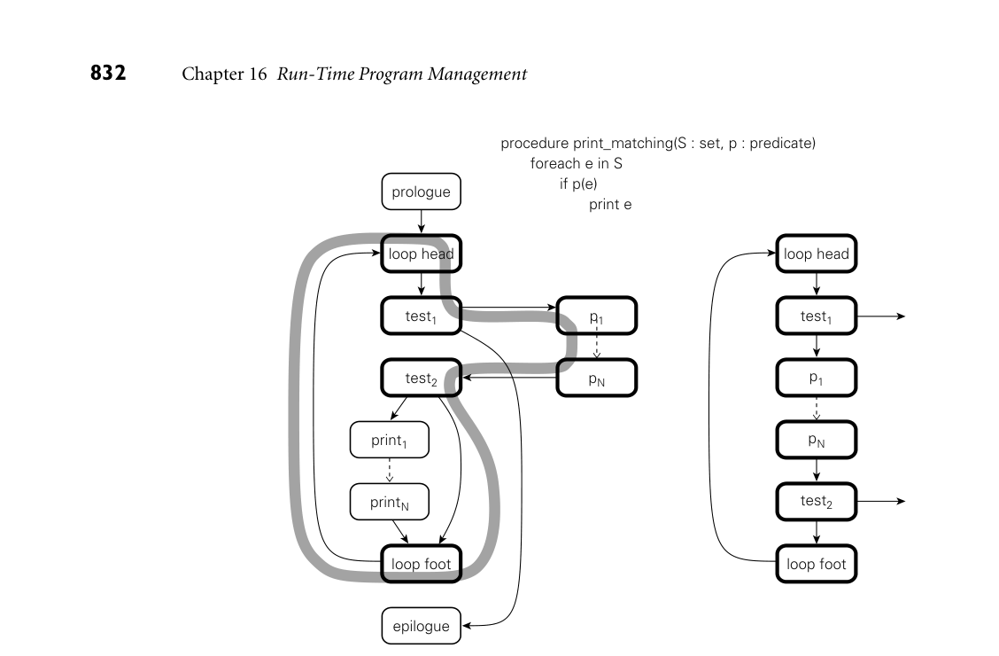

# 16.2 Late Binding of Machine Code

16.2 Late Binding of Machine Code

In the traditional conception (Example 1.7), compilation is a one-time activity, sharply distinguished from program execution. The compiler produces a tar- get program, typically in machine language, which can subsequently be executed many times for many different inputs. In some environments, however, it makes sense to bring compilation and ex- ecution closer together in time. A just-in-time (JIT) compiler translates a pro- gram from source or intermediate form into machine language immediately be- fore each separate run of the program. We consider JIT compilation further in the first subsection below. We also consider language systems that may compile new pieces of a program—or recompile old pieces—after the program begins its exe- cution. In Sections 16.2.2 and 16.2.3, we consider binary translation and binary rewriting systems, which perform compiler-like operations on programs without access to source code. Finally, in Section 16.2.4, we consider systems that may download program components from remote locations. All these systems serve to delay the binding of a program to its machine code.

16.2.1 Just-in-Time and Dynamic Compilation

To promote the Java language and virtual machine, Sun Microsystems coined the slogan “write once, run anywhere”—the idea being that programs distributed as Java bytecode could run on a very wide range of platforms. Source code, of course, is also portable, but byte code is much more compact, and can be inter- preted without additional preprocessing. Unfortunately, interpretation tends to be expensive. Programs running on early Java implementations could be as much as an order of magnitude slower than compiled code in other languages. Just-in- time compilation is, to first approximation, a technique to retain the portability of bytecode while improving execution speed. Like both interpretation and dynamic linking (Section 15.7), JIT compilation also benefits from the delayed discovery of program components: program code is not bloated by copies of widely shared li- braries, and new versions of libraries are obtained automatically when a program that needs them is run. Because a JIT system compiles programs immediately prior to execution, it can add significant delay to program start-up time. Implementors face a difficult tradeoff: to maximize benefits with respect to interpretation, the compiler should produce good code; to minimize start-up time, it should produce that code very quickly. In general, JIT compilers tend to focus on the simpler forms of target code improvement. Specifically, they often limit themselves to the so-called local improvements, which operate within individual control-flow constructs. Im- provements at the global (whole method) and interprocedural (whole program) level may be expensive to consider.

Fortunately, the cost of JIT compilation is typically lessened by the existence of an earlier source-to-byte-code compiler that does much of the “heavy lifting.”5 Scanning is unnecessary in a JIT compiler, since bytecode is not textual. Parsing is trivial, since class files have a simple, self-descriptive structure. Many of the properties that a source-to-byte-code compiler must infer at significant expense (type safety, agreement of actual and formal parameter lists) are embedded di- rectly in the structure of the bytecode (objects are labeled with their type, calls are made through method descriptors); others can be verified with simple data flow analysis. Certain forms of machine-independent code improvement may also be performed by the source-to-byte-code compiler (these are limited to some degree by stack-based expression evaluation). All these factors allow a JIT compiler to be faster—and to produce better code—than one might initially expect. In addition, since we are already com- mitted to invoking the JIT compiler at run time, we can minimize its impact on program start-up latency by running it a bit at a time, rather than all at once:

Like a lazy linker (Section C 15.7.2), a JIT compiler may perform its work in- crementally. It begins by compiling only the class file that contains the program entry point (i.e., main), leaving hooks in the code that call into the run-time system wherever the program is supposed to call a method in another class file. After this small amount of preparation, the program begins execution. When execution falls into the runtime through an unresolved hook, the runtime in- vokes the compiler to load the new class file and to link it into the program. To eliminate the latency of compiling even the original class file, the language implementation may incorporate both an interpreter and a JIT compiler. Exe- cution begins in the interpreter. In parallel, the compiler translates portions of the program into machine code. When the interpreter needs to call a method, it checks to see whether a compiled version is available yet, and if so calls that version instead of interpreting the bytecode. We will return to this technique below, in the context of the HotSpot Java compiler and JVM. When a class file is JIT compiled, the language implementation can cache the resulting machine code for later use. This amounts to guessing, speculatively, that the versions of library routines employed in the current run of the pro- gram will still be current when the program is run again. Because languages like Java and C# require the appearance of late binding of library routines, this guess must be checked in each subsequent run. If the check succeeds, using a cached copy saves almost the entire cost of JIT compilation.

Finally, JIT compilation affords the opportunity to perform certain kinds of code improvement that are usually not feasible in traditional compilers. It is cus- tomary, for example, for software vendors to ship a single compiled version of an

application for a given instruction set architecture, even though implementations of that architecture may differ in important ways, including pipeline width and depth; the number of physical (renaming) registers; and the number, size, and speed of the various levels of cache. A JIT compiler may be able to identify the processor implementation on which it is running, and generate code that is tuned for that specific implementation. More important, a JIT compiler may be able to in-line calls to dynamically linked library routines. This optimization is par- ticularly important in object-oriented programs, which tend to call many small methods. For such programs, dynamic in-lining can have a dramatic impact on performance.

Dynamic Compilation

We have noted that a language implementation may choose to delay JIT compi- lation to reduce the impact on program start-up latency. In some cases, compila- tion must be delayed, either because the source or bytecode was not created or dis- covered until run time, or because we wish to perform optimizations that depend on information gathered during execution. In these cases, we say the language implementation employs dynamic compilation. Common Lisp systems have used dynamic compilation for many years: the language is typically compiled, but a program can extend itself at run time. Optimization based on run-time statistics is a more recent innovation. Most programs spend most of their time in a relatively small fraction of the code. Aggressive code improvement on this fraction can yield disproportion- ately large improvements in program performance. A dynamic compiler can use statistics gathered by run-time profiling to identify hot paths through the code, which it then optimizes in the background. By rearranging the code to make hot paths contiguous in memory, it may also improve the performance of the in- struction cache. Additional run-time statistics may suggest opportunities to un- roll loops (Exercise C 5.21), assign frequently used expressions to registers (Sec- tions C 5.5.2 and C 17.8), and schedule instructions to minimize pipeline stalls (Sections C 5.5.1 and C 17.6). In some situations, a dynamic compiler may even be able to perform opti- mizations that would be unsafe if implemented statically. Consider, for example, EXAMPLE 16.4

When is in-lining safe? the in-lining of methods from dynamically linked libraries. If foo is a static method of class C, then calls to C.foo can safely be in-lined. Similarly, if bar is a final method of class C (one that cannot be overridden), and o is an ob- ject of class C, then calls to o.bar can safely be in-lined. But what if bar is not final? The compiler can still in-line calls to o.bar if it can prove that o will never refer to an instance of a class derived from C (which might have a different implementation of bar). Sometimes this is easy:

C o = new C( args ); o.bar(); // no question what type this is

static void f(C o) { o.bar(); }

Here the compiler can in-line the call only if it knows that f will never be passed an instance of a class derived from C. A dynamic compiler can perform the op- timization if it verifies that there exists no class derived from C anywhere in the (current version of the) program. It must keep notes of what it has done, how- ever: if dynamic linking subsequently extends the program with code that defines a new class D derived from C, the in-line optimization may need to be undone. ■

In some cases, a dynamic compiler may choose to perform optimizations that may be unsafe even in the current program, provided that profiling suggests they will be profitable and run-time checks can determine whether they are safe. Suppose, in the previous example, there already exists a class D derived from C, EXAMPLE 16.5

Speculative optimization but profiling indicates that every call to f so far has passed an instance of class C. Suppose further that f makes many calls to methods of parameter o, not just the one shown in the example. The compiler might choose to generate code along the following lines:

static void f(C o) { if (o.getClass() == C.class) { ... // code with in-lined calls -- much faster } else { ... // code without in-lined calls } } ■

An Example System: the HotSpot Java Compiler

HotSpot is Oracle’s principal JVM and JIT compiler for desktop and server sys- tems. It was first released in 1999, and is available as open source. HotSpot takes its name from its use of dynamic compilation to improve the performance of hot code paths. Newly loaded class files are initially interpreted. Methods that are executed frequently are selected by the JVM for compilation and are subsequently patched into the program on the fly. The compiler is aggressive about in-lining small routines, and will do so in a deep, iterative fashion, repeat- edly in-lining routines that are called from the code it just finished in-lining. As described in the preceding discussion of dynamic compilation, the compiler will also in-line routines that are safe only for the current set of class files, and will dynamically “deoptimize” in-lined calls that have been rendered unsafe by the loading of new derived classes. The HotSpot compiler can be configured to operate in either “client” or “server” mode. Client mode is optimized for lower start-up latency. It is ap- propriate for systems in which a human user frequently starts new programs. It translates Java bytecode to static single assignment (SSA) form (a medium-level IF described in Section C 17.4.1) and performs a few straightforward machine- independent optimizations. It then translates to a low-level IF, on which it per-

forms instruction scheduling and register allocation. Finally, it translates this IF to machine code. Server mode is optimized to generate faster code. It is appropriate for systems that need maximum throughput and can tolerate slower start-up. It applies most classic global and interprocedural code improvement techniques to the SSA ver- sion of the program (many of these are described in Chapter 17), as well as other improvements specific to Java. Many of these improvements make use of profiling statistics. Particularly when running in server mode, HotSpot can rival the performance of traditional compilers for C and C++. In effect, aggressive in-lining and profile- driven optimization serve to “buy back” both the start-up latency of JIT compi- lation and the overhead of Java’s run-time semantic checks.

Other Example Systems

Like HotSpot, Microsoft’s CIL-to-machine-code compiler performs dynamic op- EXAMPLE 16.6

Dynamic compilation in the CLR timization of hot code paths. The .NET source-to-CIL compilers are also ex- plicitly available to programs through the System.CodeDom.Compiler API. A program running on the CLR can directly invoke the compiler to translate C# (or Visual Basic, or other .NET languages) into CIL PE assemblies. These can then be loaded into the running program. As they are loaded, the CLR JIT compiler translates them to machine code. As noted in Sections 3.6.4 and 11.2, C# includes lambda expressions reminiscent of those in functional languages:

Func<int, int> square_func = x => x * x;

Here square_func is a function from integers to integers that multiplies its pa- rameter (x) by itself, and returns the product. It is analogous to the following in Scheme:

(let ((square-func (lambda (x) (* x x)))) ...

Given the C# declaration, we can write

y = square_func(3); // 9

But just as Lisp allows a function to be represented as a list, so too does C# allow a lambda expression to be represented as a syntax tree:

Expression<Func<int, int>> square_tree = x => x * x;

Various methods of library class Expression can now be used to explore and manipulate the tree. When desired, the tree can be converted to CIL code:

square_func = square_tree.Compile();

(let* ((square-tree '(lambda (x) (* x x))) ; note the quote mark (square-func (eval square-tree (scheme-report-environment 5)))) ...

The difference in practice is that while Scheme’s eval checks the syntactic valid- ity of the lambda expression and creates the metadata needed for dynamic type checking, the typical implementation leaves the function in list (tree) form, and interprets it when called. C#’s Compile is expected to produce CIL code; when called it will be JIT compiled and directly executed. ■ Many Lisp dialects and implementations have employed an explicit mix of in- terpretation and compilation. Common Lisp includes a compile function that EXAMPLE 16.7

Dynamic compilation in CMU Common Lisp takes the name of an existing (interpretable) function as argument. As a side ef- fect, it invokes the compiler on that function, after which the function will (pre- sumably) run much faster:

(defun square (x) (* x x)) ; outermost level function declaration (square 3) ; 9 (compile 'square) (square 3) ; also 9 (but faster :-)

CMU Common Lisp, a widely used open-source implementation of the lan- guage, incorporates two interpreters and a compiler with two back ends. The so- called “baby” interpreter understands a subset of the language, but works stand- alone. It handles simple expressions at the read-eval-print loop, and is used to bootstrap the system. The “grown-up” interpreter understands the whole lan- guage, but needs access to the front end of the compiler. The bytecode compiler translates source code to an intermediate form reminiscent of Java bytecode or CIL. The native code compiler translates to machine code. In general, programs are run by the “grown-up” interpreter unless the programmer invokes the com- piler explicitly from the command line or from within a Common Lisp program (with compile). The compiler, when invoked, produces native code unless other- wise instructed. Documentation indicates that the bytecode version of the com- piler runs twice as fast as the native code version. Bytecode is portable and 6× denser than native code. It runs 50× slower than native code, but 10× faster than the interpreter. ■ Like most scripting languages, Perl 5 compiles its input to an internal syntax EXAMPLE 16.8

Compilation of Perl tree format, which it then interprets. In several cases, the interpreter may need to call back into the compiler during execution. Features that force such dynamic compilation include eval, which compiles and then interprets a string; require, which loads a library package; and the ee version of the substitution command, which performs expression evaluation on the replacement string:

$foo = "abc"; $foo =~ s/b/2 + 3/ee; # replace b with the value of 2 + 3 print "$foo\n"; # prints a5c

Perl can also be directed, via library calls or the perlcc command-line script (itself written in Perl), to translate source code to either bytecode or machine code. In the former case, the output is an “executable” file beginning with #! /usr/bin/perl (see the Sidebar 14.4 for a discussion of the #! convention). If invoked from the shell, this file will feed itself back into Perl 5, which will notice that the rest of the file contains bytecode instead of source, and will perform a quick reconstruction of the syntax tree, ready for interpretation. If directed to produce machine code, perlcc generates a C program, which it then runs through the C compiler. The C program builds an appropriate syntax tree and passes it directly to the Perl interpreter, bypassing both the compiler and the byte-code-to-syntax-tree reconstruction. Both the bytecode and machine code back ends are considered experimental; they do not work for all programs. Perl 6, still under development as of 2015, is intended to be JIT compiled. Its virtual machine, called Parrot, is unusual in providing a large register set, rather than a stack, for expression evaluation. Like Perl itself—but unlike the JVM and CLR—Parrot allows variables to be treated as different types in different contexts. Work is underway to target other scripting languages to Parrot, with the eventual goal or providing interoperability similar to that of the .NET languages. ■

3CHECK YOUR UNDERSTANDING 11. What is a just-in-time (JIT) compiler? What are its potential advantages over interpretation or conventional compilation? 12. Why might one prefer bytecode over source code as the input to a JIT com- piler?

13. What distinguishes dynamic compilation from just-in-time compilation? 14. What is a hot path? Why is it significant? 15. Underwhat circumstances can a JIT compiler expand virtual methods in-line?

16. What is deoptimization? When and why is it needed? 17. Explain the distinction between the function and expression tree representa- tions of a lambda expression in C#. 18. Summarize the relationship between compilation and interpretation in Perl.

16.2.2 Binary Translation

Just-in-time and dynamic compilers assume the availability of source code or of bytecode that retains all of the semantic information of the source. There are times, however, when it can be useful to recompile object code. This process is known as binary translation. It allows already-compiled programs to be run on a machine with a different instruction set architecture. Some readers may recall

Apple’s Rosetta system, which allowed programs compiled for older PowerPC- based Macintosh computers to run on newer x86-based Macs. Rosetta built on experience with a long line of similar translators. The principal challenge for binary translation is the loss of information in the original source-to-object-code translation. Object code typically lacks both type information and the clearly delineated subroutines and control-flow constructs of source code and bytecode. While most of this information appears in the com- piler’s symbol table, and may sometimes be included in the object file for debug- ging purposes, vendors usually delete it before shipping commercial products, and a binary translator cannot assume it will be present. The typical binary translator reads an object file and reconstructs a control flow graph of the sort described in Section 15.1.1. This task is complicated by the lack of explicit information about basic blocks. While branches (the ends of basic blocks) are easy to identify, beginnings are more difficult: since branch targets are sometimes computed at run time or looked up in dispatch tables or virtual function tables, the binary translator must consider the possibility that control may sometimes jump into the middle of a “probably basic” block. Since translated code will generally not lie at the same address as the original code, computed branches must be translated into code that performs some sort of table lookup, or falls back on interpretation. Static binary translation is not always possible for arbitrary object code. In ad- dition to computed branches, problems include self-modifying code (programs that write to their own instruction space), dynamically generated code (e.g., for single-pointer closures, as described in Example C 9.61), and various forms of in- trospection, in which a program examines and reasons about its own state (we will consider this more fully in Section 16.3). Fortunately, many common id- ioms can be identified and treated as special cases, and for the (comparatively rare) cases that can’t be handled statically, a binary translator can always delay some translation until run time, fall back on interpretation, or simply inform the user that translation is not possible. In practice, binary translation has proved remarkably successful.

Where and When to Translate

Most binary translators operate in user space, and limit themselves to the non- privileged subset of the machine’s instruction set. A few are built at a lower level. When Apple converted from the Motorola 680x0 processor to the PowerPC in EXAMPLE 16.9

The Mac 68K emulator 1994, they built a 68K interpreter into the operating system. A subsequent re- lease the following year augmented the interpreter with a rudimentary binary translator that would cache frequently executed instruction sequences in a small (256KB) buffer. By placing the interpreter (emulator) in the lowest levels of the operating system, Apple was able to significantly reduce its time to market: only the most performance-critical portions of the OS were rewritten for the PowerPC, leaving the rest as 68K code. Additional portions were rewritten over time. ■ In the late 1990s, Transmeta Corp. developed an unusual system capable of EXAMPLE 16.10

translation. Their Crusoe and Efficeon processors, sold from 2000 to 2005, ran proprietary “Code Morphing” software directly on top of a wide-instruction- word ISA (distantly related to the Itanium). This software, designed in conjunc- tion with the hardware, translated x86 code to native code on the fly, and was entirely invisible to systems running above it. ■ Binary translators display even more diversity in their choice of what and when to translate. In the simplest case, translation is a one-time, off-line activity akin to conventional compilation. In the late 1980s, for example, Hewlett Packard Corp. EXAMPLE 16.11

Static binary translation developed a binary translator to retarget programs from their “Classic” HP 3000 line to the PA-RISC processor. The translator depended on the lack of dynamic linking in the operating system: all pieces of the to-be-translated program could be found in a single executable. ■ In a somewhat more ambitious vein, Digital Equipment Corp. (DEC) in the EXAMPLE 16.12

Dynamic binary translation early 1990s constructed a pair of translators for their newly developed Alpha pro- cessor: one (mx) to translate Unix programs originally compiled for MIPS-based workstations, the other (VEST) to translate VMS programs originally compiled for the VAX. Because VMS supported an early form of shared libraries, it was not generally possible to statically identify all the pieces of a program. VEST and mx were therefore designed as “open-ended” systems that could intervene, at run time, to translate newly loaded libraries. Like the HP system, DEC’s transla- tors saved new, translated versions of their applications to disk, for use in future runs. ■ In a subsequent project in the mid-1990s, DEC developed a system to execute EXAMPLE 16.13

Mixed interpretation and translation shrink-wrapped Windows software on Alpha processors. (Early versions of Mi- crosoft’s Windows NT operating system were available for both the x86 and the

DESIGN & IMPLEMENTATION

16.4 Emulation and interpretation While the terms interpretation and emulation are often used together, the con- cepts are distinct. Interpretation, as we have seen, is a language implemen- tation technique: an interpreter is a program capable of executing programs written in the to-be-implemented language. Emulation is an end goal: faith- fully imitating the behavior of some existing system (typically a processor or processor/OS pair) on some other sort of system. An emulator may use an in- terpreter to execute the emulated processor’s instruction set. Alternatively, it may use binary translation, special hardware (e.g., a field-programmable gate array—FPGA), or some combination of these. Emulation and interpretation are also distinct from simulation. A simulator models some complex system by capturing “important” behavior and ignor- ing “unimportant” detail. Meteorologists, for example, simulate the Earth’s weather systems, but they do not emulate them. An emulator is generally con- sidered correct if it does exactly what the original system does. For a simulator, one needs some notion of accuracy: how close is close enough?

Alpha, but most commercial software came in x86-only versions.) DEC’s FX!32 included both a binary translator and a highly optimized interpreter. When the user tried to run an x86 executable, FX!32 would first interpret it, collecting usage statistics. Later, in the background, it would translate hot code paths to native code, and store them in a database. Once translated code was available (later in the same execution or during future runs), the interpreter would run it in lieu of the original. ■ Modern emulation systems typically take an intermediate approach. A fast, EXAMPLE 16.14

Transparent dynamic translation simple translator creates native versions of basic blocks or subroutines on de- mand, and caches them for repeated use within a given execution. For the sake of transparency (to avoid modification of programs on disk), and to accommodate dynamic linking, translated code is usually not retained from one execution to the next. Systems in this style include Apple’s Rosetta; HP’s Aries, which retar- gets PA-RISC code to the Itanium; and Intel’s IA-32 EL, which retargets x86 code to the Itanium. ■ Among the most widely used emulators today is the open-source QEMU EXAMPLE 16.15

Translation and virtualization (quick emulation) system. In the language of Section 16.1, QEMU is a system virtual machine. Like other system VMs, it runs as a user-level process that emu- lates bare hardware on which to run a guest operating system (and that system’s workload). Unlike most system VMs, QEMU can emulate hardware very different from that of the underlying physical machine. For the sake of good performance, it makes heavy use of binary translation, converting large blocks of guest system instructions into equivalent blocks of native instructions. ■

Dynamic Optimization

In a long-running program, a dynamic translator may revisit hot paths and opti- mize them more aggressively. A similar strategy can also be applied to programs that don’t need translation—that is, to programs that already exist as machine code for the underlying architecture. This sort of dynamic optimization has been reported to improve performance by as much as 20% over already-optimized code, by exploiting run-time profiling information. Much of the technology of dynamic optimization was pioneered by the Dy- EXAMPLE 16.16

The Dynamo dynamic optimizer namo project at HP Labs in the late 1990s. Dynamo was designed to transparently enhance the performance of applications for the PA-RISC instruction set. A sub- sequent version, DynamoRIO, was written for the x86. Dynamo’s key innovation was the concept of a partial execution trace: a hot path whose basic blocks can be reorganized, optimized, and cached as a linear sequence. An example of such a trace appears in Figure 16.3. Procedure print matching takes a set and a predicate as argument, and prints all elements of the set that match the predicate. At run time, Dynamo may discover that the procedure is frequently called with a particular predicate p that is almost never true. The hot path through the flow graph (left side of the figure) can then be turned into the trace at the right. If print matching is sometimes called with a different predi- cate p, it will use a separate copy of the code. Branches out of the trace (in the

*Figure 16.3 Creation of a partial execution trace. Procedure print matching (shown at top) is often called with a particular predicate, p, which is usually false. The control flow graph (left, with hot blocks in bold and the hot path in grey) can be reorganized at run time to improve instruction-cache locality and to optimize across abstraction boundaries (right).*

loop-termination and predicate-checking tests) jump either to other traces or, if appropriate ones have not yet been created, back into Dynamo. By identifying and optimizing traces, Dynamo is able to significantly improve locality in the instruction cache, and to apply standard code improvement tech- niques across the boundaries between separately compiled modules and dynam- ically loaded libraries. In Figure 16.3, for example, it will perform register allo- cation jointly across print matchings and the predicate p. It can even perform instruction scheduling across basic blocks if it inserts appropriate compensating code on branches out of the trace. An instruction in block test2, for example, can be moved into the loop footer if a copy is placed on the branch to the right. Traces have proved to be a very powerful technique. They are used not only by dy- namic optimizers, but by dynamic translators like Rosetta as well, and by binary instrumentation tools like Pin (to be discussed in Section 16.2.3). ■

16.2.3 Binary Rewriting

While the goal of a binary optimizer is to improve the performance of a program without altering its behavior, one can also imagine tools designed to change that behavior. Binary rewriting is a general technique to modify existing executable programs, typically to insert instrumentation of some kind. The most common form of instrumentation collects profiling information. One might count the number of times that each subroutine is called, for example, or the number of times that each loop iterates (Exercise 16.5). Such counts can be stored in a buffer in memory, and dumped at the end of execution. Alternatively, one might log all memory references. Such a log will generally need to be sent to a file as the program runs—it will be too long to fit in memory. In addition to profiling, binary rewriting can be used to

Simulate new architectures: operations of interest to the simulator are replaced with code that jumps into a special run-time library (other code runs at native speed). Evaluate the coverage of test suites, by identifying paths through the code that are not explored by a series of tests. Implement model checking for parallel programs, a process that exposes race conditions (Example 13.2) by forcing a program through different interleav- ings of operations in different threads. “Audit” the quality of a compiler’s optimizations. For example, one might check whether the value loaded into a register is always the same as the value that was already there (such loads suggest that the compiler may have failed to realize that the load was redundant). Insert dynamic semantic checks into a program that lacks them. Binary rewrit- ing can be used not only for simple checks like null-pointer dereference and arithmetic overflow, but for a wide variety of memory access errors as well, including uninitialized variables, dangling references, memory leaks, “double deletes” (attempts to deallocate an already deallocated block of memory), and access off the ends of dynamically allocated arrays.

More ambitiously, as described in Sidebar 16.5, binary rewriting can be used to “sandbox” untrusted code so that it can safely be executed in the same address space as the rest of the application. Many of the techniques used by rewriting tools were pioneered by the ATOM EXAMPLE 16.17

The ATOM binary rewriter binary rewriter for the Alpha processor. Developed by researchers at DEC’s West- ern Research Lab in the early 1990s, ATOM was a static tool that modified a pro- gram for subsequent execution. To use ATOM, a programmer would write instrumentation and analysis sub- routines in C. Instrumentation routines would be called by ATOM during the rewriting process. By calling back into ATOM, these routines could arrange for the rewritten application to call analysis routines at instructions, basic blocks, subroutines, or control flow edges of the programmer’s choosing. To make room

for inserted calls, ATOM would move original instructions of the instrumented program; to facilitate such movement, the program had to be provided as a set of relocatable modules. No other changes were made to the instrumented program; in particular, data addresses were always left unchanged. ■

An Example System: the Pin Binary Rewriter

For modern processors, ATOM has been supplanted by Pin, a binary rewriter de- veloped by researchers at Intel in the early 2000s, and distributed as open source. Designed to be largely machine independent, Pin is available not only for the x86, x86-64, and Itanium, but also for ARM. Pin was directly inspired by ATOM, and has a similar programming interface. In particular, it retains the notions of instrumentation and analysis routines. It also borrows ideas from Dynamo and other dynamic translation tools. Most sig- nificantly, it uses an extended version of Dynamo’s trace mechanism to instru- ment previously unmodified programs at run time; the on-disk representation of the program never changes. Pin can even be attached to an already-running application, much like the symbolic debuggers we will study in Section 16.3.2. Like Dynamo, Pin begins by writing an initial trace of basic blocks into a run- time trace cache. It ends the trace when it reaches an unconditional branch, a predefined maximum number of conditional branches, or a predefined maxi- mum number of instructions. As it writes, it inserts calls to analysis routines (or in-line versions of short routines) at appropriate places in the code. It also main- tains a mapping between original program addresses and addresses in the trace, so it can modify address-specific instructions accordingly. Once it has finished creating a trace, Pin simply jumps to its first instruction. Conditional branches that exit the trace are set to link to other traces, or to jump back into Pin. Indirect branches are handled with particular care. Based on run-time pro- filing, Pin maintains a set of predictions for the targets of such branches, sorted most likely first. Each prediction consists of an address in the original program (which serves as a key) and an address to jump to in the trace cache. If none of the predictions match, Pin falls back to table lookup in its mapping between original and trace cache addresses. If match is still not found, Pin falls back on an instruction set interpreter, allowing it to handle even dynamically generated code. To reduce the need to save registers when calling analysis routines, and to facil- itate in-line expansion of those routines, Pin performs its own register allocation for the instructions of each trace, using similar allocations whenever possible for traces that link to one another. In multithreaded programs, one register is stat- ically reserved to point to a thread-specific buffer, where registers can be spilled when necessary. Condition codes are not saved across calls to analysis routines unless their values are needed afterward. For routines that can be called any- where within a basic block, Pin hunts for a location where the cost of saving and restoring is minimized.

16.2.4 Mobile Code and Sandboxing

Portability is one of the principal motivations for late binding of machine code. Code that has been compiled for one machine architecture or operating system cannot generally be run on another. Code in a byte code (Java bytecode, CIL) or scripting language (JavaScript, Visual Basic), however, is compact and machine independent: it can easily be moved over the Internet and run on almost any platform. Such mobile code is increasingly common. Every major browser sup- ports JavaScript; most enable the execution of Java applets as well. Visual Basic macros are commonly embedded not only in pages meant for viewing with In- ternet Explorer, but also in Excel, Word, and Outlook documents distributed via email. Cell phone apps may use mobile code to distribute games, productivity tools, and interactive media that run within an existing process. In some sense, mobile code is nothing new: almost all our software comes from other sources; we download it over the Internet or perhaps install it from a DVD. Historically, this usage model has relied on trust (we assume that software from a well-known company will be safe) and on the very explicit and occasional nature of installation. What has changed in recent years is the desire to download code frequently, from potentially untrusted sources, and often without the conscious awareness of the user. Mobile code carries a variety of risks. It may access and reveal confidential information (spyware). It may interfere with normal use of the computer in an- noying ways (adware). It may damage existing programs or data, or save copies of itself that run without the user’s intent (malware of various kinds). In particular

DESIGN & IMPLEMENTATION

16.5 Creating a sandbox via binary rewriting Binary rewriting provides an attractive means to implement a sandbox. While there is in general no way to ensure that code does what it is supposed to do (one is seldom sure of that even with one’s own code), a binary rewriter can

Verify the address of every load and store, to make sure untrusted code ac- cesses only its own data, and to avoid alignment faults Similarly verify every branch and call, to prevent control from leaving the sandbox by any means other than returning Verify all opcodes, to prevent illegal instruction faults Double-check the parameters to any arithmetic instruction that may gener- ate a fault Audit (or forbid) all system calls Instrument backward jumps to limit the amount of time that untrusted code can run (and in particular to preclude any infinite loops)

egregious cases, it may use the host machine as a “zombie” from which to launch attacks on other users. To protect against unwanted behavior, both accidental and malicious, mobile code must be executed in some sort of sandbox, as described in Sidebar 14.6. Sandbox creation is difficult because of the variety of resources that must be pro- tected. At a minimum, one needs to monitor or limit access to processor cycles, memory outside the code’s own instructions and data, the file system, network interfaces, other devices (passwords, for example, may be stolen by snooping the keyboard), the window system (e.g., to disable pop-up ads), and any other poten- tially dangerous services provided by the operating system. Sandboxing mechanisms lie at the boundary between language implementa- tion and operating systems. Traditionally, OS-provided virtual memory tech- niques might be used to limit access to memory, but this is generally too expensive for many forms of mobile code. The two most common techniques today—both of which rely on technology discussed in this chapter—are binary rewriting and execution in an untrusting interpreter. Both cases are complicated by an inherent tension between safety and utility: the less we allow untrusted code to do, the less useful it can be. No single policy is likely to work in all cases. Applets may be entirely safe if all they can do is manipulate the image in a window, but macros embedded in a spreadsheet may not be able to do their job without changing the user’s data. A major challenge for future work is to find a way to help users— who cannot be expected to understand the technical details—to make informed decisions about what and what not to allow in mobile code.

3CHECK YOUR UNDERSTANDING 19. What is binary translation? When and why is it needed?

20. Explain the tradeoffs between static and dynamic binary translation. 21. What is emulation? How is it related to interpretation and simulation? 22. What is dynamic optimization? How can it improve on static optimization?

23. What is binary rewriting? How does it differ from binary translation and dy- namic optimization? 24. Describe the notion of a partial execution trace. Why is it important to dy- namic optimization and rewriting? 25. What is mobile code? 26. What is sandboxing? When and why is it needed? How can it be implemented?

