# Part IV: A Closer Look at Implementation

IV A Closer Look at Implementation

In this, the fnal and shortest of the major parts of the text, we return our focus to implemen­ tation issues.

Chapter 15 considers the work that must be done, in the wake of semantic analysis, to  generate a runnable program. The frst half of the chapter describes, in general terms, the  structure of the back end of the typical compiler, surveys intermediate program representations,  and uses the attribute grammar framework of Chapter 4 to describe how a compiler produces  assembly-level code. The second half of the chapter describes the structure of the typical process  address space, and explains how the assembler and linker transform the output of the compiler  into executable code.

In any nontrivial language implementation, the compiler assumes the existence of a large  body of preexisting code for storage management, exception handling, dynamic linking, and  the like. A more sophisticated language may require events, threads, and messages as well.  When the libraries that implement these features depend on knowledge of the compiler or of  the structure of the running program, they are said to constitute a run-time system. We  consider   such systems in Chapter 16. We focus in particular on virtual machines; run-time manipulation  of machine code; and reflection mechanisms, which allow a program to reason about its run­ time structure and types.

The back-end compiler description in Chapter 15 is by necessity simplistic. Entire books  and courses are devoted to the fuller story, most of which focuses on the code improvement or  optimization techniques used to produce effcient code. Chapter 17 of the current text, con­ tained entirely on the companion site, provides an overview of code improvement. Since most  programmers will never write the back end of a compiler, the goal of Chapter 17 is more to  convey a sense of what the compiler does than exactly how it does it. Programmers who un­ derstand this material will be in a better position to “work with” the compiler, knowing what  is possible, what to expect in common cases, and how to avoid programming idioms that are  hard to optimize. Topics include local and “global” (procedure-level) redundancy elimination,  data fow analysis, loop optimization, and register allocation.

15 Building a Runnable Program

As noted in Section 1.6, the various phases of compilation are commonly  grouped into a front end responsible for the analysis of source code, a back end  responsible for the synthesis of target code, and often a “middle end” responsible  for language- and machine-independent code improvement. Chapters 2 and 4  discussed the work of the front end, culminating in the construction of a syntax  tree. The current chapter turns to the work of the back end, and specifcally to  code generation, assembly, and linking. We will continue with code improvement  in Chapter 17.

In Chapters 6 through 10, we often discussed the code that a compiler would  generate to implement various language features. Now we will look at how the  compiler produces that code from a syntax tree, and how it combines the out­ put of multiple compilations to produce a runnable program. We begin in Sec­ tion 15.1 with a more detailed overview of the work of program synthesis than  was possible in Chapter 1. We focus in particular on one of several plausible ways  of dividing that work into phases. In Section 15.2 we then consider the many  possible forms of intermediate code passed between these phases. On the com­ panion site we provide a bit more detail on two concrete examples—the GIMPLE  and RTL formats used by the GNU compilers. We will consider two additional  intermediate forms in Chapter 16: Java bytecode and the Common Intermedi­ ate Language (CIL) used by Microsoft and other implementors of the Common  Language Infrastructure.

In Section 15.3 we discuss the generation of assembly code from an abstract  syntax tree, using attribute grammars as a formal framework. In Section 15.4 we  discuss the internal organization of binary object fles and the layout of programs  in memory. Section 15.5 describes assembly. Section 15.6 considers linking.

## 15.1  Back-End Compiler Structure

As we noted in Chapter 4, there is less uniformity in back-end compiler structure  than there is in front-end structure. Even such unconventional compilers as text

processors, source-to-source translators, and VLSI layout tools must scan, parse,  and analyze the semantics of their input. When it comes to the back end, however,  even compilers for the same language on the same machine can have very different  internal structure.

As we shall see in Section 15.2, different compilers may use different interme­ diate forms to represent a program internally. They may also differ dramatically  in the forms of code improvement they perform. A simple compiler, or one de­ signed for speed of compilation rather than speed of target code execution (e.g.,  a “just-in-time” compiler) may not do much improvement at all. A just-in-time  or “load-and-go” compiler (one that compiles and then executes a program as a  single high-level operation, without writing the target code to a fle) may not use  a separate linker. In some compilers, much or all of the code generator may be  written automatically by a tool (a “code generator generator”) that takes a formal  description of the target machine as input.

15.1.1 A Plausible Set of Phases

EXAMPLE 15.1  Figure 15.1 illustrates a plausible seven-phase structure for a conventional com- Phases of compilation  piler. The frst three phases (scanning, parsing, and semantic analysis) are lan­ guage dependent; the last two (target code generation and machine-specifc code  improvement) are machine dependent, and the middle two (intermediate code  generation and machine-independent code improvement) are (to frst approxi­ mation) dependent on neither the language nor the machine. The scanner and  parser drive a set of action routines that build a syntax tree. The semantic analyzer  traverses the tree, performing all static semantic checks and initializing various at­ tributes (mainly symbol table pointers and indications of the need for dynamic  checks) of use to the back end.  ■  While certain code improvements can be performed on syntax trees, a less hi­ erarchical representation of the program makes most code improvement easier.  Our example compiler therefore includes an explicit phase for intermediate code  generation. The code generator begins by grouping the nodes of the tree into  basic blocks, each of which consists of a maximal-length set of operations that  should execute sequentially at run time, with no branches in or out. It then cre­ ates a control flow graph in which the nodes are basic blocks and the arcs represent  interblock control fow. Within each basic block, operations are represented as  instructions for an idealized machine with an unlimited number of registers. We  will call these virtual registers. By allocating a new one for every computed value,  the compiler can avoid creating artifcial connections between otherwise inde­ pendent computations too early in the compilation process.

EXAMPLE 15.2  In Example 1.20 we used a simple greatest common divisor (GCD) program  GCD program abstract  to illustrate the phases of compilation. The syntax tree for this program appeared  syntax tree (reprise)  in Figure 1.6; it is reproduced here (in slightly altered form) as Figure 15.2. A cor­ responding control fow graph appears in Figure 15.3. We will discuss techniques  to generate this graph in Section 15.3 and Exercise 15.6. Additional examples of  control fow graphs will appear in Chapter 17.  ■

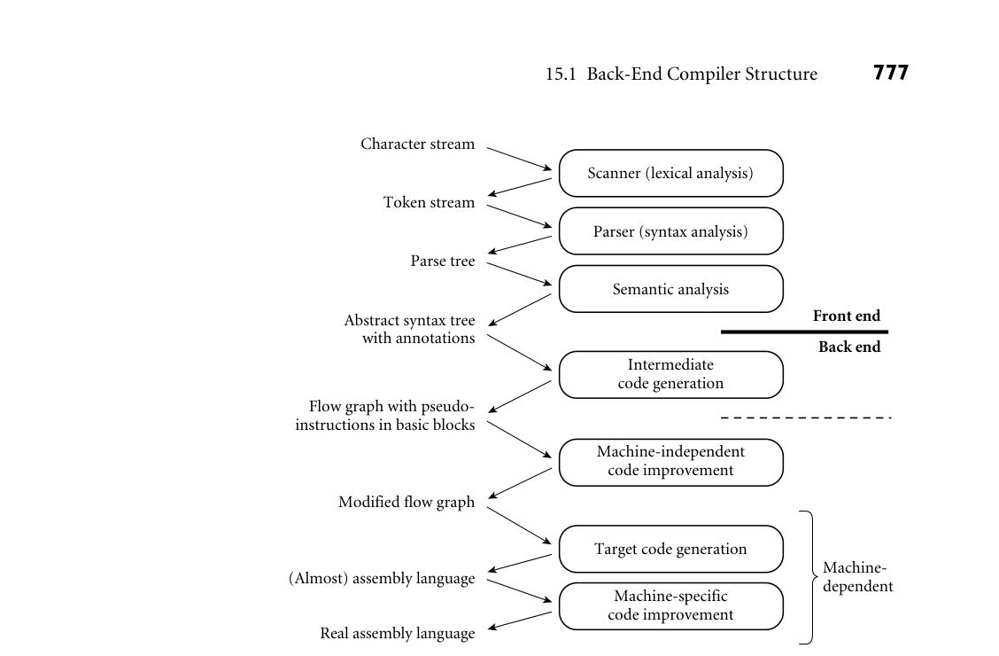
*Figure 15.1  A plausible set of compiler phases. Here we have shown a sharper separation  between semantic analysis and intermediate code generation than we considered in Chapter 1  (see Figure 1.3). Machine-independent code improvement employs an intermediate form that  resembles the assembly language for an idealized machine with an unlimited number of reg­ isters.  Machine-specifc code improvement—register allocation and instruction scheduling in  particular—employs the assembly language of the target machine. The dashed line shows a  common “break point” between the front end and back end of a two-pass compiler. In some  implementations, machine-independent code improvement may be located in a separate “middle  end” pass.*

The machine-independent code improvement phase of compilation performs  a variety of transformations on the control fow graph. It modifes the instruction  sequence within each basic block to eliminate redundant loads, stores, and arith­ metic computations; this is local code improvement. It also identifes and removes  a variety of redundancies across the boundaries between basic blocks within a  subroutine; this is global code improvement. As an example of the latter, an ex­ pression whose value is computed immediately before an if statement need not  be recomputed within the code that follows the else. Likewise an expression that  appears within the body of a loop need only be evaluated once if its value will not  change in subsequent iterations. Some global improvements change the number  of basic blocks and/or the arcs among them.

*Figure 15.2  Syntax tree and symbol table for the GCD program. The only difference from Figure 1.6 is the addition of  explicit null nodes to indicate empty argument lists and to terminate statement lists.*

It is worth noting that “global” code improvement typically considers only the  current subroutine, not the program as a whole. Much recent research in com­ piler technology has been aimed at “truly global” techniques, known as inter- procedural code improvement. Since programmers are generally unwilling to give  up separate compilation (recompiling hundreds of thousands of lines of code is a  very time-consuming operation), a practical interprocedural code improver must  do much of its work at link time. One of the (many) challenges to be overcome  is to develop a division of labor and an intermediate representation that allow the  compiler to do as much work as possible during (separate) compilation, but leave  enough of the details undecided that the link-time code improver is able to do its  job.

Following machine-independent code improvement, the next phase of com­ pilation is target code generation. This phase strings the basic blocks together  into a linear program, translating each block into the instruction set of the target  machine and generating branch instructions (or “fall-throughs”) that correspond  to the arcs of the control fow graph. The output of this phase differs from real  assembly language primarily in its continued reliance on virtual registers. So long  as the pseudoinstructions of the intermediate form are reasonably close to those  of the target machine, this phase of compilation, though tedious, is more or less  straightforward.

*Figure 15.3  Control flow graph for the GCD program. Code within basic blocks is shown  in the pseudo-assembly notation introduced in Sidebar 5.1, with a different virtual register (here  named v1. . . v13) for every computed value. Registers a1 and rv are used to pass values to and  from subroutines.*

To reduce programmer effort and increase the ease with which a compiler can  be ported to a new target machine, target code generators are sometimes gen­ erated automatically from a formal description of the machine. Automatically  generated code generators all rely on some sort of pattern-matching algorithm to  replace sequences of intermediate code instructions with equivalent sequences of  target machine instructions. References to several such algorithms can be found  in the Bibliographic Notes at the end of this chapter; details are beyond the scope  of this book.

The fnal phase of our example compiler structure consists of register alloca­ tion and instruction scheduling, both of which can be thought of as machine- specifc code improvement. Register allocation requires that we map the unlim­ ited virtual registers employed in earlier phases onto the bounded set of architec­ tural registers available in the target machine. If there aren’t enough architectural  registers to go around, we may need to generate additional loads and stores to  multiplex a given architectural register among two or more virtual registers. In­ struction scheduling (described in Sections C 5.5 and C 17.6) consists of reorder­ ing the instructions of each basic block in an attempt to fll the pipeline(s) of the  target machine.

15.1.2 Phases and Passes

In Section 1.6 we defned a pass of compilation as a phase or sequence of phases  that is serialized with respect to the rest of compilation: it does not start until  previous phases have completed, and it fnishes before any subsequent phases  start. If desired, a pass may be written as a separate program, reading its input  from a fle and writing its output to a fle. Two-pass compilers are particularly  common. They may be divided between semantic analysis and intermediate code  generation or between intermediate code generation and machine-independent  code improvement. In either case, the frst pass is commonly referred to as the  “front end” and the second pass as the “back end.”

Like most compilers, our example generates symbolic assembly language as  its output (a few compilers, including those written by IBM for the Power family,  generate binary machine code directly). The assembler (not shown in Figure 15.1)  behaves as an extra pass, assigning addresses to fragments of data and code, and  translating symbolic operations into their binary encodings. In most cases, the  input to the compiler will have consisted of source code for a single compilation  unit. After assembly, the output will need to be linked to other fragments of the  application, and to various preexisting subroutine libraries. Some of the work of  linking may be delayed until load time (immediately prior to program execution)  or even until run time (during program execution). We will discuss assembly and  linking in Sections 15.5 through 15.7.

## 15.2  Intermediate Forms

An intermediate form (IF) provides the connection between phases of machine- independent code improvement, and continues to represent the program during  the various back-end phases.

IFs can be classifed in terms of their level, or degree of machine dependence.  High-level IFs are often based on trees or directed acyclic graphs (DAGs) that  directly capture the hierarchical structure of modern programming languages.

A high-level IF facilitates certain kinds of machine-independent code improve­ ment, incremental program updates (e.g., in a language-based editor), and direct  interpretation (most interpreters employ a tree-based internal IF). Because the  permissible structure of a tree can be described formally by a set of productions  (as described in Section 4.6), manipulations of tree-based forms can be written as  attribute grammars.

The most common medium-level IFs employ three-address instructions for a  simple idealized machine, typically one with an unlimited number of registers.  Often the instructions are embedded in a control fow graph. Since the typical  instruction specifes two operands, an operator, and a destination, three-address  instructions are sometimes called quadruples. Low-level IFs usually resemble the  assembly language of some particular target machine, most often the physical  machine on which the target code will execute.

Different compilers use different IFs. Many compilers use more than one IF  internally, though in the common two-pass organization one of these is distin­ guished as “the” intermediate form by virtue of being the externally visible con-

EXAMPLE 15.3  nection between the front end and the back end. In the example of Section 15.1.1,  Intermediate forms in  the syntax trees passed from semantic analysis to intermediate code generation  Figure 15.1  constitute a high-level IF. Control fow graphs containing pseudo-assembly lan­ guage (passed in and out of machine-independent code improvement) are a  medium-level IF. The assembly language of the target machine (initially with  virtual registers; later with architectural registers) serves as a low-level IF.

The distinction between “high-,” “medium-,” and “low-level” IFs is of course  somewhat arbitrary: the plausible design space is very large, with a nearly contin­ uous spectrum from abstract to machine-dependent.  ■  Compilers that have back ends for several different target architectures tend to  do as much work as possible on a high- or medium-level IF, so that the machine- independent parts of the code improver can be shared by different back ends. By  contrast, some (but not all) compilers that generate code for a single architecture  perform most code improvement on a comparatively low-level IF, closely mod­ eled after the assembly language of the target machine.

In a multilanguage compiler family, an IF that is independent of both source  language and target machine allows a software vendor who wishes to sell compil­ ers for n languages on m machines to build just n front ends and m back ends,  rather than n × m integrated compilers. Even in a single-language compiler fam­ ily, a common, possibly language-dependent IF simplifes the task of porting to  a new machine by isolating the code that needs to be changed. In a rich pro­ gram development environment, there may be a variety of tools in addition to the  passes of the compiler that understand and operate on the IF. Examples include  editors, assemblers, linkers, debuggers, pretty-printers, and version-management  software. In a language system capable of interprocedural (whole-program) code  improvement, separately compiled modules and libraries may be compiled only  to the IF, rather than the target language, leaving the fnal stages of compilation  to the linker.

To be stored in a fle, an IF requires a linear representation. Sequences of three- address instructions are naturally linear. Tree-based IFs can be linearized via or­ dered traversal. Structures like control fow graphs can be linearized by replacing  pointers with indices relative to the beginning of the fle.

15.2.1 GIMPLE and RTL

Many readers will be familiar with the gcc compilers. Distributed as open source  by the Free Software Foundation, gcc is used very widely in both academia and  industry. The standard distribution includes front ends for C, C++, Objective- C, Ada, Fortran, Go, and Java. Front ends for additional languages, including  Cobol, Modula-2 and 3, Pascal and PL/I, are separately available. The C compiler  is the original, and the one most widely used (gcc originally stood for “GNU C  compiler”). There are back ends for dozens of processor architectures, including  all commercially signifcant options. There are also GNU implementations, not  based on gcc, for some two dozen additional languages.

IN MORE DEPTH

Gcc has three main IFs. Most of the (language-specifc) front ends employ, in­ ternally, some variant of a high-level syntax tree form known as GENERIC. Early  phases of machine-independent code improvement use a somewhat lower-level  tree form known as GIMPLE (still a high-level IF). Later phases use a linear form  known as RTL (register transfer language). RTL is a medium-level IF, but a bit  higher level than most: it overlays a control fow graph on of a sequence of pseu­ doinstructions. RTL was, for many years, the principal IF for gcc. GIMPLE  was   introduced in 2005 as a more suitable form for machine-independent code im­ provement. We consider GIMPLE and RTL in more detail on the companion  site.

## 15.2.2 Stack-Based Intermediate Forms

In situations where simplicity and brevity are paramount, designers often turn to  stack-based languages. Operations in a such a language pop arguments from—  and push results to—a common implicit stack. The lack of named operands  means that a stack-based language can be very compact. In certain HP calcu­ lators (Exercise 4.7), stack-based expression evaluation serves to minimize the  number of keystrokes required to enter equations. For embedded devices and  printers, stack-based evaluation in Forth and Postscript serves to reduce memory  and bandwidth requirements, respectively (see Sidebar 15.1).

Medium-level stack-based intermediate languages are similarly attractive when  passing code from a compiler to an interpreter or virtual machine. Forty years

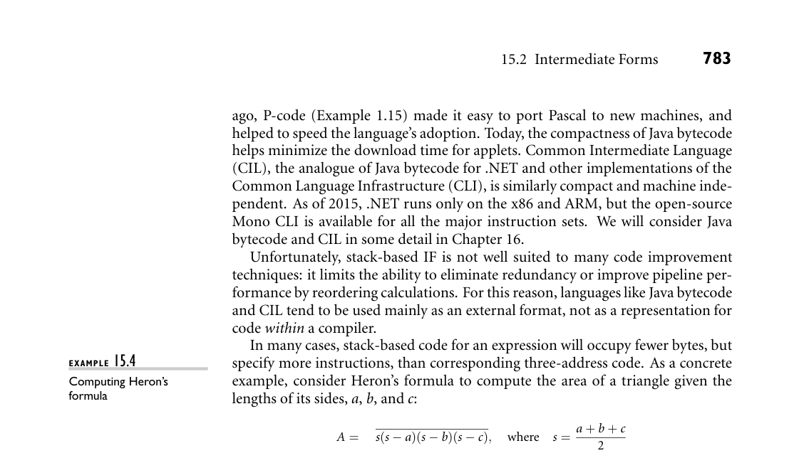
*Figure 15.4 compares bytecode and three-address versions of this formula. Each  line represents a single instruction. If we assume that a, b, c, and  s are all among  the frst few local variables of the current subroutine, both the Java Virtual Ma­ chine  (JVM)  and the  CLI will  be able to  move them  to  or from  the  stack with   single-byte instructions. Consequently, the second-to-last instruction in the left  column is the only one that needs more than a single byte (it takes three: one for*

DESIGN & IMPLEMENTATION

15.1 Postscript  One of the most pervasive uses of stack-based languages today occurs in doc­ ument preparation. Many document compilers (TEX, Microsoft Word, etc.)  generate Postscript or the related Portable Document Format (PDF) as their  target language. (Most document compilers employ some special-purpose in­ termediate language as well, and have multiple back ends, so they can generate  multiple target languages.)

Postscript is stack-based. It is portable, compact, and easy to generate. It  is also written in ASCII, so it can be read (albeit with some diffculty) by hu­ man beings. Postscript interpreters are embedded in most professional-quality  printers. Issues of code improvement are relatively unimportant: most of the  time required for printing is consumed by network delays, mechanical paper  transport, and data manipulations embedded in (optimized) library routines;  interpretation time is seldom a bottleneck. Compactness on the other hand is  crucial, because it contributes to network delays.

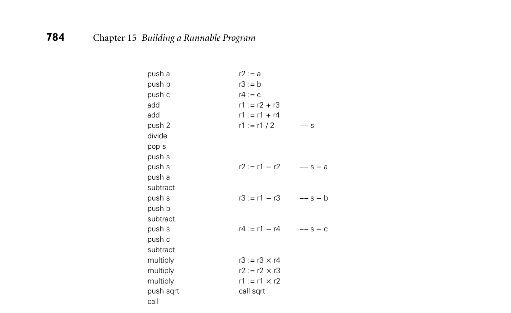
*Figure 15.4  Stack-based versus three-address IF. Shown are two versions of code to compute  the area of a triangle using Heron’s formula. At left is a stylized version of Java bytecode or CLI  Common Intermediate Language. At right is corresponding pseudo-assembler for a machine  with three-address instructions. The bytecode requires a larger number of instructions, but  occupies less space.*

the push operation  and two to specify  the  sqrt routine). This gives us a total of  23 instructions in 25 bytes.

By contrast, three-address code for the same formula keeps a, b, c, and  s in  registers, and requires only 13 instructions. Unfortunately, in typical notation  each instruction but the last will be four bytes in length (the last will be eight),  and our 13 instructions will occupy 56 bytes.  ■

## 15.3  Code Generation

EXAMPLE 15.5  The back-end structure of Figure 15.1 is too complex to present in any detail in a  Simpler compiler structure  single chapter. To limit the scope of our discussion, we will content ourselves in  this chapter with producing correct but naive code. This choice will allow us to  consider a signifcantly simpler middle and back end. Starting with the structure  of Figure 15.1, we drop the machine-independent code improver and then merge  intermediate and target code generation into a single phase. This merged phase

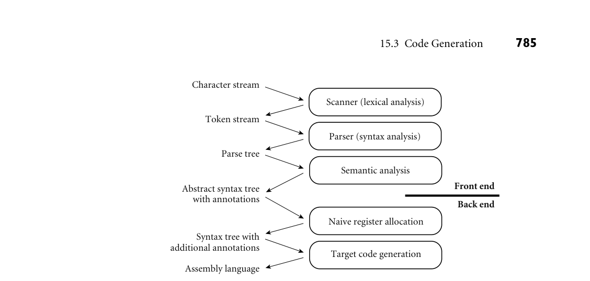
*Figure 15.5  A simpler, nonoptimizing compiler structure, assumed in Section 15.3. The target  code generation phase closely resembles the intermediate code generation phase of Figure 15.1.*

generates pure, linear assembly language; because we are not performing code  improvements that alter the program’s control fow, there is no need to represent  that fow explicitly in a control fow graph. We also adopt a much simpler register  allocation algorithm, which can operate directly on the syntax tree prior to code  generation, eliminating the need for virtual registers and the subsequent mapping  onto architectural registers. Finally, we drop instruction scheduling. The result­ ing compiler structure appears in Figure 15.5. Its code generation phase closely  resembles the intermediate code generation of Figure 15.1.  ■

15.3.1 An Attribute Grammar Example

Like semantic analysis, intermediate code generation can be formalized in terms  of an attribute grammar, though it is most commonly implemented via hand­ written ad hoc traversal of a syntax tree. We present an attribute grammar here  for the sake of clarity.

In Figure 1.7, we presented naive x86 assembly language for the GCD pro­ gram. We will use our attribute grammar example to generate a similar version  here, but for a RISC-like machine, and in pseudo-assembly notation. Because this  notation is now meant to represent target code, rather than medium- or low-level  intermediate code, we will assume a fxed, limited register set reminiscent of real  machines. We will reserve several registers (a1, a2, sp, rv) for special purposes;  others (r1  . . rk) will be available for temporary values and expression evaluation.

EXAMPLE 15.6  Figure 15.6 contains a fragment of our attribute grammar. To save space, we  An attribute grammar for  have shown only those productions that actually appear in Figure 15.2. As in  code generation

reg names : array [0..k− 1] of register name := [“r1”, “r2”,  . . . ,  “rk”]  –– ordered set of temporaries

program −→ stmt

 stmt.next free reg := 0   program.code := [“main:”] + stmt.code + [“goto exit”]

while : stmt1 −→ expr stmt2 stmt3

 expr.next free reg := stmt2.next free reg := stmt3.next free reg := stmt1.next free reg   L1 := new label(); L2 := new label()

stmt1.code := [“goto” L1] + [L2 “:”] + stmt2.code + [L1 “:”] + expr.code

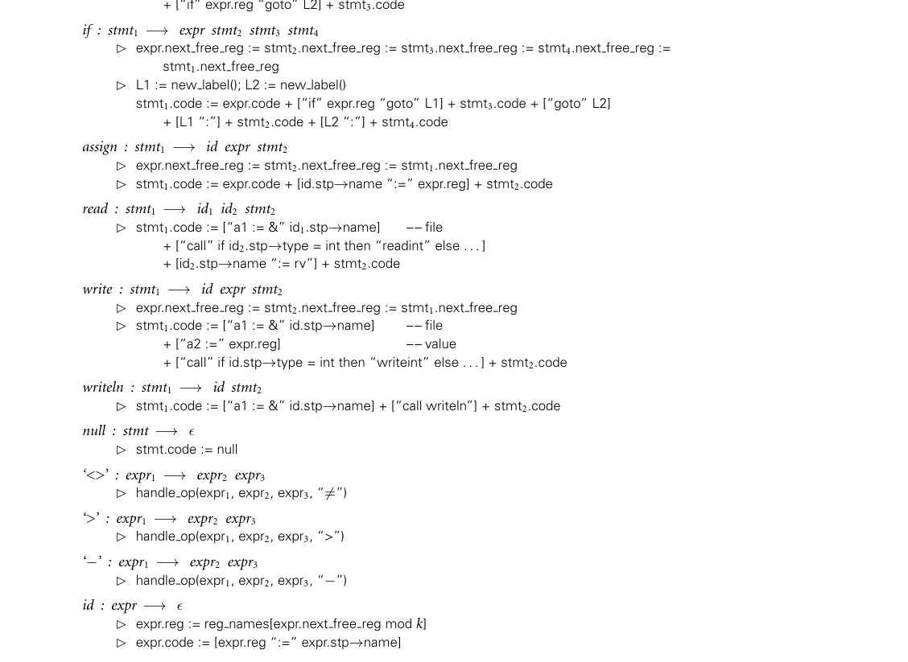
*Figure 15.6  Attribute grammar to generate code from a syntax tree. Square brackets delimit individual target instructions.  Juxtaposition indicates concatenation within instructions; the ‘+’ operator indicates concatenation of instruction lists. The  handle op macro is used in three of the attribute rules. (continued)*

*Figure 15.6  (continued)*

Chapter 4, notation like while : stmt on the left-hand side of a production in­ dicates that a while node in the syntax tree is one of several kinds of stmt node;  it may serve as the stmt in the right-hand side of its parent production. In our  attribute grammar fragment, program, expr, and  stmt all have a synthesized at­ tribute code that contains a sequence of instructions. Program has an inherited  attribute name of type string, obtained from the compiler command line. Id has  a synthesized attribute stp that points to the symbol table entry for the identi­ fer. Expr has a synthesized attribute reg that indicates the register that will hold  the value of the computed expression at run time. Expr and stmt have an inher­ ited attribute next free reg that indicates the next register (in an ordered set of  temporaries) that is available for use (i.e., that will hold no useful value at run  time) immediately before evaluation of a given expression or statement. (For  simplicity, we will be managing registers as if they were a stack; more on this in  Section 15.3.2.)  ■  Because we use a symbol table in our example, and because symbol tables lie  outside the formal attribute grammar framework, we must augment our attribute  grammar with some extra code for storage management. Specifcally, prior to  evaluating the attribute rules of Figure 15.6, we must traverse the symbol table in  order to calculate stack-frame offsets for local variables and parameters (two of  which—i and j—occur in the GCD program) and in order to generate assembler  directives to allocate space for global variables (of which our program has none).  Storage allocation and other assembler directives will be discussed in more detail  in Section 15.5.

15.3.2 Register Allocation

Evaluation of the rules of the attribute grammar itself consists of two main tasks.  In each subtree we frst determine the registers that will be used to hold various

EXAMPLE 15.7  quantities at run time; then we generate code. Our naive register allocation strat­ Stack-based register  allocation

egy uses the next free reg inherited attribute to manage registers r1. . . rk as an  expression evaluation stack. To calculate the value of (a + b) × (c − (d / e)), for   example, we would generate the following:

r1 := a  –– push a  r2 := b  –– push b  r1 := r1 + r2  –– add  r2 := c  –– push c  r3 := d  –– push d  r4 := e  –– push e  r3 := r3 / r4  –– divide  r2 := r2 − r3  –– subtract  r1 := r1 × r2  –– multiply

Allocation of the next register on the “stack” occurs in the production id :  expr −→ , where  we  use  expr.next free reg to index into reg names, the  ar­ ray of temporary register names, and in macro handle op, where we increment  next free reg to make this register unavailable during evaluation of the right- hand operand. There is no need to “pop” the “register stack” explicitly; this hap­ pens automatically when the attribute evaluator returns to a parent node and uses  the parent’s (unmodifed) next free reg attribute. In our example grammar, left- hand operands are the only constructs that tie up a register during the evaluation  of anything else. In a more complete grammar, other long-term uses of registers  would probably occur in constructs like for loops (for the step size, index, and  bound).

ϵ

In a particularly complicated fragment of code it is possible to run out of ar­ chitectural registers. In this case we must spill one or more registers to memory.  Our naive register allocator pushes a register onto the program’s subroutine call  stack, reuses the register for another purpose, and then pops the saved value back  into the register before it is needed again. In effect, architectural registers hold the  top k elements of an expression evaluation stack of effectively unlimited size.  ■  It should be emphasized that our register allocation algorithm, while correct,  makes very poor use of machine resources. We have made no attempt to reor­ ganize expressions to minimize the number of registers used, or to keep com­ monly used variables in registers over extended periods of time (avoiding loads  and stores). If we were generating medium-level intermediate code, instead of tar­ get code, we would employ virtual registers, rather than architectural ones, and  would allocate a new one every time we needed it, never reusing one to hold a dif­ ferent value. Mapping of virtual registers to architectural registers would occur  much later in the compilation process.

EXAMPLE 15.8  Target code for the GCD program appears in Figure 15.7. The frst few lines are  GCD program target code  generated during symbol table traversal, prior to attribute evaluation. Attribute  program.name might be passed to the assembler, to tell it the name of the fle  into which to place the runnable program. A real compiler would probably also  generate assembler directives to embed symbol-table information in the target  program. As in Figure 1.7, the quality of our code is very poor. We will investigate

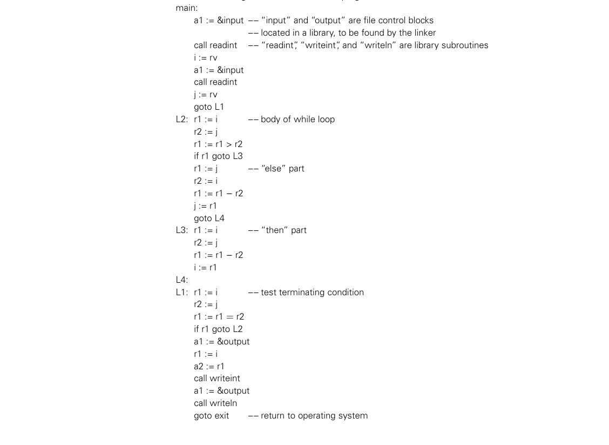
*Figure 15.7  Target code for the GCD program, generated from the syntax tree of Figure 15.2,  using the attribute grammar of Figure 15.6.*

techniques to improve it in Chapter 17. In the remaining sections of the current  chapter we will consider assembly and linking.  ■

3CHECK YOUR UNDERSTANDING  1. What  is  a  code generator generator? Why  might  it  be  useful?   2. What  is  a  basic block? A  control flow graph?

  3.
  What
  are
  virtual registers? What purpose do they serve?
  4.
  What is the difference between local and global code improvement?

  5.
  What
  is
  register spilling?
  6.
  Explain what is meant by the “level” of an intermediate form (IF). What are
  the comparative advantages and disadvantages of high-, medium-, and low-
  level IFs?

  7.
  What is the IF most commonly used in Ada compilers?
  8.
  Name two advantages of a stack-based IF. Name one disadvantage.

  9.
  Explain the rationale for basing a family of compilers (several languages, sev­
  eral target machines) on a single IF.

* Why might a compiler employ more than one IF?
* Outline some of the major design alternatives for back-end compiler organi­

zation and structure.  12. What is sometimes called the “middle end” of a compiler?

* Why is management of a limited set of physical registers usually deferred until
  late in the compilation process?

## 15.4  Address Space Organization

Assemblers, linkers, and loaders typically operate on a pair of related fle formats:  relocatable object code and executable object code. Relocatable object code is ac­ ceptable as input to a linker; multiple fles in this format can be combined to  create an executable program. Executable object code is acceptable as input to a  loader: it can be brought into memory and run. A relocatable object fle includes  the following descriptive information:

Import table: Identifes instructions that refer to named locations whose ad­

dresses are unknown, but are presumed to lie in other fles yet to be linked  to this one.

Relocation table: Identifes instructions that refer to locations within the current

fle, but that must be modifed at link time to refect the offset of the current  fle within the fnal, executable program.  Export table: Lists the names and addresses of locations in the current fle that  may be referred to in other fles.

Imported and exported names are known as external symbols.

An executable object fle is distinguished by the fact that it contains no refer­ ences to external symbols (at least if statically linked—more on this below). It  also defnes a starting address for execution. An executable fle may or may not  be relocatable, depending on whether it contains the tables above.

Details of object fle structure vary from one operating system to another. Typ­ ically, however, an object fle is divided into several sections, each of which is  handled differently by the linker, loader, or operating system. The frst section  includes the import, export, and relocation tables, together with an indication of  how much space will be required by the program for noninitialized static data.  Other sections commonly include code (instructions), read-only data (constants,  jump tables for case statements, etc.), initialized but writable static data, and  symbol table and layout information saved by the compiler. The initial descrip­ tive section is used by the linker and loader. The symbol table section is used  by debuggers and performance proflers (Sections 16.3.2 and 16.3.3). Neither  of these tables is usually brought into memory at run time; neither is needed by  most running programs (an exception occurs in the case of programs that employ  reflection mechanisms [Section 16.3.1] to examine their own type structure).

In its runnable (loaded) form, a program is typically organized into several  segments. On some machines (e.g., the 80286 or PA-RISC), segments were visible  to the assembly language programmer, and could be named explicitly in instruc­ tions. More commonly on modern machines, segments are simply subsets of  the address space that the operating system manages in different ways. Some of  them—code, constants, and initialized data in particular—correspond to sections  of the object fle. Code and constants are usually read-only, and are often com­ bined in a single segment; the operating system arranges to receive an interrupt  if the program attempts to modify them. (In response to such an interrupt it will  most likely print an error message and terminate the program.) Initialized data  are writable. At load time, the operating system either reads code, constants, and  initialized data from disk, or arranges to read them in at run time, in response to  “invalid access” (page fault) interrupts or dynamic linking requests.

In addition to code, constants, and initialized data, the typical running pro­ gram has several additional segments:

Uninitialized data: May  be  allocated at  load time  or  on  demand  in  response  to   page faults. Usually zero-flled, both to provide repeatable symptoms for pro­ grams that erroneously read data they have not yet written, and to enhance  security on multiuser systems, by preventing a program from reading the con­ tents of pages written by previous users.

Stack: May be allocated in some fxed amount at load time. More commonly, is  given a small initial size, and is then extended automatically by the operating  system in response to (faulting) accesses beyond the current segment end.  Heap: Like stack, may be allocated in some fxed amount at load time. More  commonly, is given a small initial size, and is then extended in response to  explicit requests (via system call) from heap-management library routines.  Files: In many systems, library routines allow a program to map a fle into mem­

ory. The map routine interacts with the operating system to create a new seg­ ment for the fle, and returns the address of the beginning of the segment. The  contents of the segment are usually fetched from disk on demand, in response  to page faults.  Dynamic libraries: Modern operating systems typically arrange for most pro­

grams to share a single copy of the code for popular libraries (Section C 15.7).  From the point of view of an individual process, each such library tends to oc­ cupy a pair of segments: one for the shared code, one for linkage information  and for a private copy of any writable data the library may need.

EXAMPLE 15.9  The layout of these segments for a contemporary 32-bit Linux system on the  Linux address space layout  x86 appears in Figure 15.8. Relative placements and addresses may be different  for other operating systems and machines.  ■

## 15.5  Assembly

Some compilers translate source fles directly into object fles acceptable to the  linker. More commonly, they generate assembly language that must subsequently  be processed by an assembler to create an object fle.

In our examples we have consistently employed a symbolic (textual) notation  for code. Within a compiler, the representation would not be textual, but it would  still be symbolic, most likely consisting of records and linked lists. To translate this  symbolic representation into executable code, we must

* Replace opcodes and operands with their machine language encodings.
* Replace uses of symbolic names with actual addresses.

These are the principal tasks of an assembler.

In the early days of computing, most programmers wrote in assembly lan­ guage. To simplify the more tedious and repetitive aspects of assembly program­ ming, assemblers often provided extensive macro expansion facilities. With the  ubiquity of modern high-level languages, such programmer-centric features have  largely disappeared. Almost all assembly language programs today are written by  compilers.

EXAMPLE 15.10  When passing assembly language directly from the compiler to the assembler, it  Assembly as a final  makes sense to use some internal (records and linked lists) representation. At the  compiler pass

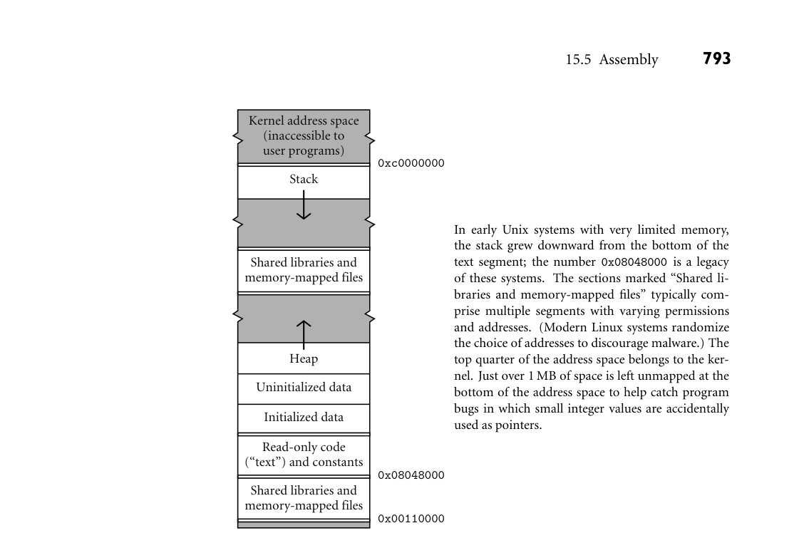
*Figure 15.8  Layout of 32-bit process address space in x86 Linux (not to scale). Double lines  separate regions with potentially different access permissions.*

same time, we must provide a textual front end to accommodate the occasional  need for human input:

Source program

Assembler source  Assembler source  Compiler

Internal data structures

Assembler front end

Assembler back end

Object code

The assembler front end simply translates textual source into internal symbolic  form. By sharing the assembler back end, the compiler and assembler front end  avoid duplication of effort. For debugging purposes, the compiler will generally  have an option to dump a textual representation of the code it passes to the as­ sembler.  ■

EXAMPLE 15.11  An alternative organization has the compiler generate object code directly:  Direct generation of object code

Source program

Assembler source

Compiler

Assembler  Disassembler

Object code

Assembler source

This organization gives the compiler a bit more fexibility: operations nor­ mally performed by an assembler (e.g., assignment of addresses to variables) can  be performed earlier if desired. Because there is no separate assembly pass, the  overall translation to object code may be slightly faster. The stand-alone assem­ bler can be relatively simple. If it is used only for small, special-purpose code  fragments, it probably doesn’t need to perform instruction scheduling or other  machine-specifc code improvement. Using a disassembler instead of an assem­ bly language dump from the compiler ensures that what the programmer sees  corresponds precisely to what is in the object fle. If the compiler uses a fancier  assembler as a back end, then any program modifcations effected by the assem­ bler will not be visible in the assembly language dumped by the compiler.  ■

15.5.1 Emitting Instructions

The most basic task of the assembler is to translate symbolic representations of  instructions into binary form. In some assemblers this is an entirely straight­ forward task, because there is a one-to-one correspondence between mnemonic  operations and instruction op-codes. Many assemblers, however, make minor  changes to their input in order to improve performance or to extend the instruc­ tion set in ways that make the assembly language easier for human beings to read.  The GNU assembler, gas,  is  among  the more conservative,  but  even  it  takes  a few

EXAMPLE 15.12  liberties. For example, some compilers generate nop instructions to cache-align  Compressing nops  certain basic blocks (e.g., function prologues). To reduce the number of cycles  these consume, gas will combine multiple consecutive nops into  multibyte  in­ structions that have no effect. (On the x86, there are 2-, 4-, and 7-byte variants of  the lea instruction that can be used to move a register into itself.)  ■

For jumps to nearby addresses, gas uses an instruction variant that specifes  an offset from the pc. For jumps to distant addresses (or to addresses not known  until link time), it uses a longer variant that specifes an absolute address. A few  x86 instructions (not typically generated by modern compilers) don’t have the  longer variant. For these, some assemblers will reverse the sense of the conditional  test to hop over an unconditional jump. Gas simply fails to handle them.  ■  At the more aggressive end of the spectrum, SGI’s assembler for the MIPS  instruction set provides a large number of pseudoinstructions that translate into  different real instructions depending on their arguments, or that correspond to  multi-instruction sequences. For example, there are two integer add instructions  on the MIPS: one of them adds two registers; the other adds a register and a con­ stant. The assembler provides a single pseudoinstruction, which it translates into  the appropriate variant. In a similar vein, the assembler provides a pseudoinstruc­ tion to load an arbitrary constant into a register. Since all instructions are 32 bits  long, this pseudoinstruction must be translated into a pair of real instructions  when the constant won’t ft in 16 bits. Some pseudoinstructions may generate  even longer sequences. Integer division can take as many as 11 real instructions,  to check for errors and to move the quotient from a temporary location into the  desired register.  ■  In effect, the SGI assembler implements a “cleaned-up” variant of the real ma­ chine. In addition to providing pseudoinstructions, it reorganizes instructions to  hide the existence of delayed branches (Section C 5.5.1) and to improve the ex­ pected performance of the processor pipeline. This reorganization constitutes a  fnal pass of instruction scheduling (Sections C 5.5.1 and C 17.6). Though the job  could be handled  by  the compiler,  the existence of pseudoinstructions like the in­ teger division example argues strongly for doing it in the assembler. In addition  to having two branch delays that might be flled by neighboring instructions, the  expanded division sequence can be used as a source of instructions to fll nearby  branch, load, or functional unit delays.

EXAMPLE 15.13

Relative and absolute  branches

EXAMPLE 15.14

Pseudoinstructions

EXAMPLE 15.15

In addition to translating from symbolic to binary instruction representations,  most assemblers respond to a variety of directives. Gas provides more than 100 of  these. A few examples follow.

Assembler directives

Segment switching: The .text directive indicates that subsequent instructions  and data should be placed in the code (text) segment. The .data directive  indicates that subsequent instructions and data should be placed in the initial­ ized data segment. (It is possible, though uncommon, to put instructions in  the data segment, or data in the code segment.) The .space n directive indi­ cates that n bytes of space should be reserved in the uninitialized data segment.  (This latter directive is usually preceded by a label.)  Data generation: The .byte, .hword, .word, .float, and  .double directives  each take a sequence of arguments, which they place in successive locations  in the current segment of the output program. They differ in the types of  operands. The related.ascii directive takes a single character string as argu­ ment, which it places in consecutive bytes.

Symbol identification: The.globl name directive indicates that name should be  entered into the table of exported symbols.  Alignment: The.align n directive causes the subsequent output to be aligned at  an address evenly divisible by 2n .  ■

15.5.2 Assigning Addresses to Names

Like compilers, assemblers commonly work in several phases. If the input is tex­ tual, an initial phase scans and parses the input, and builds an internal represen­ tation. In the most common organization there are two additional phases. The  frst identifes all internal and external (imported) symbols, assigning locations to  the internal ones. This phase is complicated by the fact that the length of some in­ structions (on a CISC machine) or the number of real instructions produced by a  pseudoinstruction (on a RISC machine) may depend on the number of signifcant  bits in an address. Given values for symbols, the fnal phase produces object code.

Within the object fle, any symbol mentioned in a .globl directive must ap­ pear in the table of exported symbols, with an entry that indicates the symbol’s  address. Any symbol referred to in a directive or an instruction, but not defned  in the input program, must appear in the table of imported symbols, with an en­ try that identifes all places in the code at which such references occur. Finally,  any instruction or datum whose value depends on the placement of the current  fle within the address space of a running program must be listed in the relocation  table.

EXAMPLE 15.16  Historically, assemblers distinguished between absolute and relocatable words  Encoding of addresses in  in an object fle. Absolute words were known at assembly time; they did not need  object files  to be changed by the linker. Examples include constants and register–register  instructions. A relocatable word, in contrast, needed to be modifed by adding to  it the address within the fnal program of the code or data segment of the object  fle in which it appeared. A CISC jump instruction, for example, might consist  of a 1-byte jmp opcode followed by a 4-byte target address. For a local target,  the address bytes in the object fle would contain the symbol’s offset within the  fle.  The linker would  fnalize  the address by adding the address of the fle’s code  segment in the fnal version of the program.

On modern machines, this single form of relocation no longer suffces. Ad­ dresses are encoded into instructions in many different ways, and these encodings  must be refected in the relocation table and the import table. On a 32-bit ARM  processor, for example, an unconditional branch (b) instruction has a 24-bit off­ set feld. The processor left-shifts this feld by two bits, sign-extends it, and then  adds it to the address of the branch instruction itself to obtain the target address.1

1  The size of the offset implies that branches on ARM are limited to jumps of ≤ 32 MB in either  direction. If the linker discovers that a target is farther away than that, it must generate “veneer”  code that loads the target address into r12 (which is reserved for this purpose) and then performs  and indirect branch.

To relocate such an instruction, the linker must add the address of the target code  segment and the offset within it of the target instruction, subtract the address  of the current code segment and the offset within it of the branch instruction,  perform a two-bit right arithmetic shift, and truncate the result to 24 bits. In a  similar vein, a 32-bit load on ARM requires a two-instruction sequence analogous  to that of Example 15.14; if the loaded quantity is relocatable, the linker must re­ calculate the 16-bit operands of both instructions. Modern assemblers and object  fle formats refect this diversity of relocation modes.  ■

## 15.6  Linking

Most language implementations—certainly all that are intended for the construc­ tion of large programs—support separate compilation: fragments of the program  can be compiled and assembled more or less independently. After compilation,  these fragments (known as compilation units) are “glued together” by a linker.  In many languages and environments, the programmer explicitly divides the pro­ gram into modules or fles, each of which is separately compiled. More integrated  environments may abandon the notion of a fle in favor of a database of subrou­ tines, each of which is separately compiled.

The task of a linker is to join together compilation units. A static linker does  its work prior to program execution, producing an executable object fle. A dy­ namic linker (described in Section C 15.7) does its work after the (frst part of the)  program has been brought into memory for execution.

Each to-be-linked compilation unit must be a relocatable object fle. Typically,  some fles will have been produced by compiling fragments of the application  being constructed, while others will be preexisting library packages needed by  the application. Since most programs make use of libraries, even a “one-fle”  application typically needs to be linked.

Linking involves two subtasks: relocation and the resolution of external ref­ erences. Some authors refer to relocation as loading, and call the entire “joining  together” process “link-loading.” Other authors (including the current one) use  “loading” to refer to the process of bringing an executable object fle into memory  for execution. On very simple machines, or on machines with very simple oper­ ating systems, loading entails relocation. More commonly, the operating system  uses virtual memory to give every program the impression that it starts at some  standard address. In many systems loading also entails a certain amount of link­ ing (Section C 15.7).

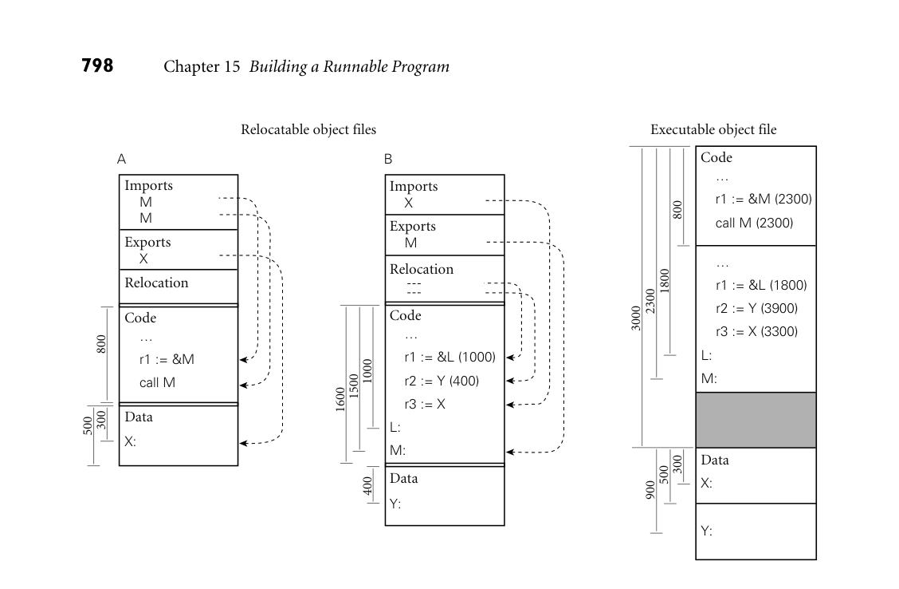
*Figure 15.9  Linking relocatable object files A and B to make an executable object file. For simplicity of presentation, A’s  code section has been placed at offset 0, with B’s code section immediately after, at offset 800 (addresses increase down the  page). To allow the operating system to establish different protections for the code and data segments, A’s data section has  been placed at the next page boundary (offset 3000), with B’s data section immediately after (offset 3500). External references  to M and X have been set to use the appropriate addresses. Internal references to L and Y have been updated by adding in  the starting addresses of B’s code and data sections, respectively.*

15.6.1 Relocation and Name Resolution

Each relocatable object fle contains the information required for linking: the  import, export, and relocation tables. A static linker uses this information in a  two-phase process analogous to that described for assemblers in Section 15.5. In  the frst phase, the linker gathers all of the compilation units together, chooses an  order for them in memory, and notes the address at which each will consequently  lie. In the second phase, the linker processes each unit, replacing unresolved exter­ nal references with appropriate addresses, and modifying instructions that need

EXAMPLE 15.17  to be relocated to refect the addresses of their units. These phases are illustrated  Static linking  pictorially in Figure 15.9. Addresses and offsets are assumed to be written in hex­ adecimal notation, with a page size of 4K (100016) bytes.   ■  Libraries present a bit of a challenge. Many consist of hundreds of separately  compiled program fragments, most of which will not be needed by any particular

application. Rather than link the entire library into every application, the linker  needs to search the library to identify the fragments that are referenced from the  main program. If these refer to additional fragments, then those must be included  also, recursively. Many systems support a special library format for relocatable  object fles. A library in this format may contain an arbitrary number of code and  data sections, together with an index that maps symbol names to the sections in  which they appear.

15.6.2 Type Checking

Within a compilation unit, the compiler enforces static semantic rules. Across the  boundaries between units, it uses module headers to enforce the rules pertaining  to external references. In effect, the header for module M makes a set of promises  regarding M’s interface to its users. When compiling the body of M, the  compiler   ensures that those promises are kept. Imagine what could happen, however, if  we compiled the body of M, and then changed the numbers and types of param­ eters for some of the subroutines in its header fle before compiling some user  module U. If both compilations succeed, then M and U will have very differ­ ent notions of how to interpret the parameters passed between them; while they  may still link together, chaos is likely to ensue at run time. To prevent this sort of  problem, we must ensure whenever M and U are linked together that both were  compiled using the same version of M’s header.

In most module-based languages, the following technique suffces.  When  compiling the body of module M we create a dummy symbol whose name  uniquely characterizes the contents of M’s header. When compiling the body  of U we create a reference to the dummy symbol. An attempt to link M and U  together will succeed only if they agree on the name of the symbol.

EXAMPLE 15.18  One way to create the symbol name that characterizes M is to use a textual  Checksumming headers  representation of the time of the most recent modifcation of M’s header. Because  for consistency  fles may be moved across machines, however (e.g., to deliver source fles to geo­ graphically distributed customers), modifcation times are problematic: clocks  on different machines may be poorly synchronized, and fle copy operations often

DESIGN & IMPLEMENTATION

15.2 Type checking for separate compilation  The encoding of type information in symbol names works well in C++, but is  too strict for use in C: it would outlaw programming tricks that, while ques­ tionable, are permitted by the language defnition. Symbol-name encoding is  facilitated in C++ by the use of structural equivalence for types. In princi­ ple, one could use it in a language with name equivalence, but given that such  languages generally have well-structured modules, it is simpler just to use a  checksum of the header.

change the modifcation time. A better candidate is a checksum of the header fle:  essentially the output of a hash function that uses the entire text of the fle as key.  It  is  possible in theory  for  two  different  but valid  fles  to  have  the same checksum,   but with a good choice of hash function the odds of this error are exceedingly  small.  ■  The checksum strategy does require that we know when we’re using a mod­ ule header. Unfortunately, as described in Section C 3.8, we don’t know this in C  and C++: headers in these languages are simply a programming convention, sup­ ported by the textual inclusion mechanism of the language’s preprocessor. Most  implementations of C do not enforce consistency of interfaces at link time; in­ stead, programmers rely on confguration management tools (e.g., Unix’s make)  to recompile fles when necessary. Such tools are typically driven by fle modif­ cation times.

Most implementations of C++ adopt a different approach, sometimes called  name mangling. The name of each imported or exported symbol in an object  fle is created by concatenating the corresponding name from the program source  with a representation of its type. For an object, the type consists of the class name  and a terse encoding of its structure. For a function, it consists of an encoding  of the types of the arguments and the return value. For complicated objects or  functions of many arguments, the resulting names can be very long. If the linker  limits symbols to some too-small maximum length, the type information can be  compressed by hashing, at some small loss in security [SF88].

One problem with any technique based on fle modifcation times or check­ sums is that a trivial change to a header fle (e.g., modifcation of a comment,  or defnition of a new constant not needed by existing users of the interface) can  prevent fles from linking correctly. A similar problem occurs with confguration  management tools: a trivial change may cause the tool to recompile fles unnec­ essarily. A few programming environments address this issue by tracking changes  at a granularity smaller than the compilation unit [Tic86]. Most just live with the  need to recompile.

## 15.7  Dynamic Linking

On a multiuser system, it is common for several instances of a program (e.g.,  an editor or web browser) to be executing simultaneously. It would be highly  wasteful to allocate space in memory for a separate, identical copy of the code of  such a program for every running instance. Many operating systems therefore  keep track of the programs that are running, and set up memory mapping tables  so that all instances of the same program share the same read-only copy of the  program’s code segment. Each instance receives its own writable copy of the data  segment. Code segment sharing can save enormous amounts of space. It does not  work, however, for instances of programs that are similar but not identical.

Many sets of programs, while not identical, have large amounts of library code  in common—for example to manage a graphical user interface. If every appli­

cation has its own copy of the library, then large amounts of memory may be  wasted. Moreover, if programs are statically linked, then much larger amounts  of disk space may be wasted on nearly identical copies of the library in separate  executable object fles.

IN MORE DEPTH

In the early 1990s, most operating system vendors adopted dynamic linking in or­ der to save space in memory and on disk. We consider this option in more detail  on the companion site. Each dynamically linked library resides in its own code  and data segments. Every program instance that uses a given library has a pri­ vate copy of the library’s data segment, but shares a single system-wide read-only  copy of the library’s code segment. These segments may be linked to the remain­ der of the code when the program is loaded into memory, or they may be linked  incrementally on demand, during execution. In addition to saving space, dy­ namic linking allows a programmer or system administrator to install backward- compatible updates to a library without rebuilding all existing executable object  fles: the next time it runs, each program will obtain the new version of the library  automatically.

3CHECK YOUR UNDERSTANDING  14. What are the distinguishing characteristics of a relocatable object fle? An ex­

ecutable object fle?  15. Why do operating systems typically zero-fill pages used for uninitialized data?

* List four tasks commonly performed by an assembler.
* Summarize the comparative advantages of assembly language and object code
  as the output of a compiler.
* Give three examples of pseudoinstructions and three examples of directives that
  an assembler might be likely to provide.
* Why might an assembler perform its own fnal pass of instruction scheduling?

* Explain the distinction between absolute and relocatable words in an object
  fle. Why is the notion of “relocatability” more complicated than it used to
  be?
* What is the difference between linking and loading?

* What are the principal tasks of a linker?
* How can a linker enforce type checking across compilation units?

* What is the motivation for dynamic linking?

## 15.8  Summary and Concluding Remarks

In this chapter we focused our attention on the back end of the compiler, and on  code generation, assembly, and  linking in particular.

Compiler middle and back ends vary greatly in internal structure. We dis­ cussed one plausible structure, in which semantic analysis is followed by, in order,  intermediate code generation, machine-independent code improvement, target  code generation, and machine-specifc code improvement (including register al­ location and instruction scheduling). The semantic analyzer passes a syntax tree  to the intermediate code generator, which in turn passes a control flow graph to the  machine-independent code improver. Within the nodes of the control fow graph,  we suggested that code be represented by instructions in a pseudo-assembly lan­ guage with an unlimited number of virtual registers. In order to delay discussion  of code improvement to Chapter 17, we also presented a simpler back-end struc­ ture in which code improvement is dropped, naive register allocation happens  early, and intermediate and target code generation are merged into a single phase.  This simpler structure provided the context for our discussion of code generation.

We also discussed intermediate forms (IFs). These can be categorized in terms  of their level, or degree of machine independence. On the companion site we con­ sidered GIMPLE and RTL, the IFs of the Free Software Foundation GNU com­ pilers. A well-defned IF facilitates the construction of compiler families, in  which   front ends for one or more languages can be paired with back ends for many ma­ chines. In many systems that compile for a virtual machine (to be discussed at  greater length in Chapter 16), the compiler produces a stack-based medium-level  IF. While not generally suitable for use inside the compiler, such an IF can be  simple and very compact.

Intermediate code generation is typically performed via ad hoc traversal of a  syntax tree. Like semantic analysis, the process can be formalized in terms of  attribute grammars. We presented part of a small example grammar and used  it to generate code for the GCD program introduced in Chapter 1. We noted  in passing that target code generation is often automated, in whole or in part,  using a code generator generator that takes as input a formal description of the  target machine and produces code that performs pattern matching on instruction  sequences or trees.

In our discussion of assembly and linking we described the format of relo­ catable and executable object fles, and discussed the notions of name resolution  and relocation. We noted that while not all compilers include an explicit assem­ bly phase, all compilation systems must make it possible to generate assembly  code for debugging purposes, and must allow the programmer to write special- purpose routines in assembler. In compilers that use an assembler, the assembly  phase is sometimes responsible for instruction scheduling and other low-level  code improvement. The linker, for its part, supports separate compilation, by  “gluing” together object fles produced by multiple compilations. In many mod­ ern systems, signifcant portions of the linking task are delayed until load time

or even run time, to allow programs to share the code segments of large, popu­ lar libraries. For many languages the linker must perform a certain amount of  semantic checking, to guarantee type consistency. In more aggressive optimiz­ ing compilation systems (not discussed in this text), the linker may also perform  interprocedural code improvement.

As noted in Section 1.5, the typical programming environment includes a host  of additional tools, including debuggers, performance proflers, confguration  and version managers, style checkers, preprocessors, pretty-printers, testing sys­ tems, and perusal and cross-referencing utilities. Many of these tools, particularly  in well-integrated environments, are directly supported by the compiler. Many  make use, for example, of symbol-table information embedded in object fles.  Performance proflers and testing systems often rely on special instrumentation  code inserted by the compiler at subroutine calls, loop boundaries, and other key  points in the code. Perusal, style-checking, and pretty-printing programs may  share the compiler’s scanner and parser. Confguration tools often rely on lists of  interfle dependences, again generated by the compiler, to tell when a change to  one part  of a  large  system may  require that  other  parts  be recompiled.

## 15.9  Exercises

15.1  If you were writing a two-pass compiler, why might you choose a high- level IF as the link between the front end and the back end? Why might  you choose a medium-level IF?

15.2  Consider a language like Ada or Modula-2, in which a module M can be  divided into a specifcation (header) fle and an implementation (body)  fle for the purpose of separate compilation (Section 10.2.1). Should M’s  specifcation itself be separately compiled, or should the compiler simply  read it in the process of compiling M’s body and the bodies of other mod­ ules that use abstractions defned in M? If the specifcation is compiled,  what should the output consist of?

15.3  Many research compilers (e.g., for SR [AO93], Cedar [SZBH86], Lynx  [Sco91], and Modula-3 [Har92]) have used C as their IF. C is well doc­ umented and mostly machine independent, and C compilers are much  more widely available than alternative back ends. What are the disadvan­ tages of generating C, and how might they be overcome?

15.4  List as many ways as you can think of in which the back end of a just- in-time compiler might differ from that of a more conventional compiler.  What design goals dictate the differences?

15.5  Suppose that k (the number of temporary registers) in Figure 15.6 is 4 (this  is an artifcially small number for modern machines). Give an example of  an expression that will lead to register spilling under our naive register  allocation algorithm.

*Figure 15.10  Syntax tree and symbol table for a program that computes the average of N real numbers. The children of  the for node are the index variable, the lower bound, the upper bound, and the body.*

15.6  Modify the attribute grammar of Figure 15.6 in such a way that it will gen­ erate the control fow graph of Figure 15.3 instead of the linear assembly  code of Figure 15.7.

15.7  Add productions and attribute rules to the grammar of Figure 15.6 to han­ dle Ada-style for loops (described in Section 6.5.1). Using your modi­ fed grammar,  hand-translate  the syntax tree of Figure 15.10  into  pseudo- assembly notation. Keep the index variable and the upper loop bound in  registers.

15.8  One problem (of many) with the code we generated in Section 15.3 is that  it computes at run time the value of expressions that could have been com­ puted at compile time. Modify the grammar of Figure 15.6 to perform a  simple form of constant folding: whenever both operands of an operator  are compile-time constants, we should compute the value at compile time  and then generate code that uses the value directly. Be sure to consider  how to handle overfow.

15.9  Modify the grammar of Figure 15.6 to generate jump code for Boolean  expressions, as described in Section 6.4.1. You should assume short-circuit  evaluation (Section 6.1.5).

15.10  Our GCD program did not employ subroutines. Extend the grammar of  Figure 15.6 to handle procedures without parameters (feel free to adopt  any reasonable conventions on the structure of the syntax tree). Be sure to  generate appropriate prologue and epilogue code for each subroutine, and  to save and restore any needed temporary registers.

15.11  The grammar of Figure 15.6 assumes that all variables are global. In the  presence of subroutines, we should need to generate different code (with  fp-relative displacement mode addressing) to access local variables and  parameters. In a language with nested scopes we should need to derefer­ ence the static chain (or index into the display) to access objects that are  neither local nor global. Suppose that we are compiling a language with  nested subroutines, and are using a static chain. Modify the grammar of  Figure 15.6 to generate code to access objects correctly, regardless of scope.  You may fnd it useful to defne a to register subroutine that generates the  code to load a given object. Be sure to consider both l-values and r-values,  and parameters passed by both value and result.

15.12–15.15 In More Depth.

## 15.10  Explorations

15.16  Investigate and describe the IF of the compiler you use most often. Can  you instruct the compiler to dump it to a fle which you can then inspect?  Are there tools other than the compiler phases that operate on the IF (e.g.,  debuggers, code improvers, confguration managers, etc.)? Is the same IF  used by compilers for other languages or machines?

15.17  Implement Figure 15.6 in your favorite programming language. Defne  appropriate data structures to represent a syntax tree; then generate code  for some sample trees via ad hoc tree traversal.

15.18  Augment your solution to the previous exercise to handle various other  language features. Several interesting options have been mentioned in ear­ lier exercises. Others include functions, frst-class subroutines, case state­ ments, records, arrays (particularly those of dynamic size), and iterators.

15.19  Find out what tools are available on your favorite system to inspect the  content of object fles (on a Unix system, use nm or objdump). Consider  some program consisting of a modest number (three to six, say) of com­ pilation units. Using the appropriate tool, list the imported and exported  symbols in each compilation unit. Then link the fles together. Draw an  address map showing the locations at which the various code and data  segments have been placed. Which instructions within the code segments  have been changed by relocation?

15.20  In your favorite C++ compiler, investigate the encoding of type informa­ tion in the names of external symbols. Are there strange strings of char­

acters at the end of every name? If so, can you “reverse engineer” the  algorithm used to generate them? For hints, type “C++ name mangling”  into your favorite search engine.

15.21–15.25 In More Depth.

## 15.11  Bibliographic Notes

Standard compiler textbooks (e.g., those by Aho et al. [ALSU07], Cooper and Tor­ czon [CT04], Grune et al. [GBJ+12], Appel [App97], or Fischer et al. [FCL10])  are an accessible source of information on back-end compiler technology. More  detailed information can be found in the text of Muchnick [Muc97]. Fraser and  Hanson provide a wealth of detail on code generation and (simple) code improve­ ment in their lcc compiler [FH95].

RTL and GIMPLE are documented in the gcc Internals Manual, available from  www.gnu.org/onlinedocs. Java bytecode is documented by Lindholm and Yellin  [LYBB14]. The Common Intermediate Language is described by Miller and Rags- dale [MR04].

Ganapathi, Fischer, and Hennessy [GFH82] and Henry and Damron [HD89]  provide early surveys of automatic code generator generators. The most widely  used technique from that era was based on LR parsing, and was due to Glanville  and Graham [GG78]. Fraser et al. [FHP92] describe a simpler approach based on  dynamic programming. Documentation for the LLVM Target-Independent Code  Generator can be found at llvm.org/docs/CodeGenerator.html.

Beck [Bec97] provides a good turn-of-the-century introduction to assemblers,  linkers, and software development tools. Gingell et al. describe the implemen­ tation of shared libraries for the SPARC architecture and the SunOS variant of  Unix [GLDW87].  Ho and Olsson describe a particularly ambitious dynamic  linker for Unix [HO91]. Tichy presents a compilation system that avoids un­ necessary recompilations by tracking dependences at a granularity fner than the  source fle [Tic86].

16 Run-Time Program Management

Every nontrivial implementation of a high-level programming language makes  extensive use of libraries. Some library routines are very simple: they may copy  memory from one place to another, or perform arithmetic functions not directly  supported by the hardware. Others are more sophisticated. Heap management  routines, for example, maintain signifcant amounts of internal state, as do li­ braries for buffered or graphical I/O.

In general, we use the term run-time system (or sometimes just runtime, with­ out the hyphen) to refer to the set of libraries on which the language implemen­ tation depends for correct operation. Some parts of the runtime, like heap man­ agement, obtain all the information they need from subroutine arguments, and  can easily be replaced with alternative implementations. Others, however, require  more extensive knowledge of the compiler or the generated program. In simpler  cases, this knowledge is really just a set of conventions (e.g., for the subroutine  calling sequence) that the compiler and runtime both respect. In more complex  cases, the compiler generates program-specifc metadata that the runtime must  inspect to do its job. A tracing garbage collector (Section 8.5.3), for example, de­ pends on metadata identifying all the “root pointers” in the program (all global,  static, and stack-based pointer or reference variables), together with the type of  every reference and of every allocated block.

Many examples of compiler/runtime integration have been discussed in previ­ ous chapters; we review these in Sidebar 16.1. The length and complexity of the  list generally means that the compiler and the run-time system must be developed  together.

Some languages (notably C) have very small run-time systems: most of the  user-level code required to execute a given source program is either generated  directly by the compiler or contained in language-independent libraries. Other  languages have extensive run-time systems. C#, for example, is heavily dependent  on a run-time system defned by the Common Language Infrastructure (CLI)  standard [Int12a].

EXAMPLE 16.1  Like any run-time system, the CLI depends on data generated by the com- The CLI I as a run-time  piler (e.g., type descriptors, lists of exception handlers, and certain content from  system and virtual machine  the symbol table). It also makes extensive assumptions about the structure of

DESIGN & IMPLEMENTATION

16.1 Run-time systems

Many of the most interesting topics in language implementation revolve  around the run-time system, and have been covered in previous chapters. To  set the stage for virtual machines, we review those topics here.

Garbage Collection (Section 8.5.3). As noted in the chapter introduction,  a tracing garbage collector must be able to fnd all the “root pointers” in the  program, and to identify the type of every reference and every allocated block.  A compacting collector must be able to modify every pointer in the program.  A generational collector must have access to a list of old-to-new pointer ref­ erences, maintained by write barriers in the main program. A collector for a  language like Java must call appropriate finalize methods. And in imple­ mentations that support concurrent or incremental collection, the main pro­ gram and the collector must agree on some sort of locking protocol to preserve  the consistency of the heap.

Variable Numbers of Arguments (Section 9.3.3). Several languages allow the  programmer to declare functions that take an arbitrary number of arguments,  of arbitrary type. In C, a call to va_arg(my_args, arg_type) must return the  next argument in the previously identifed list my_args. To fnd the argument,  va_arg must understand which arguments are passed in which registers, and  which arguments are passed on the stack (with what alignment, padding, and  offset). If the code for va_arg is generated entirely in-line, this knowledge may  be embedded entirely in the compiler. If any of the code is in library routines,  however, those routines are compiler-specifc, and thus a (simple) part of the  run-time system.

Exception Handling (Section 9.4). Exception propagation requires that we  “unwind” the stack whenever control escapes the current subroutine. Code  to deallocate the current frame may be generated by the compiler on a  subroutine-by-subroutine basis. Alternatively, a general-purpose routine to  deallocate any given frame may be part of the run-time system. In a similar  vein, the closest exception handler around a given point in the program may  be found by compiler-generated code that maintains a stack of active handlers,  or by a general-purpose run-time routine that inspects a table of program- counter-to-handler mappings generated at compile time. The latter approach  avoids any run-time cost when entering and leaving a protected region (try  block).

Event Handling (Section 9.6). Events are commonly implemented as “spon­ taneous” subroutine calls in a single-threaded program, or as “callbacks” in  a separate, dedicated thread of a concurrent program. Depending on imple­ mentation strategy, they may be able to exploit knowledge of the compiler’s

subroutine calling conventions. They also require synchronization between  the main program and the event handler, to protect the consistency of shared  data structures. A truly asynchronous call—one that may interrupt execution  of the main program at any point—may need to save the entire register set of  the machine. Calls that occur only at well-defned “safe points” in the program  (implemented via polling) may be able to save a smaller amount of state. In  either case, calls to any handler not at the outermost level of lexical nesting may  need to interpret a closure to establish the proper referencing environment.

Coroutine and Thread Implementation (Sections 9.5 and 13.2.4). Code to  create a coroutine or thread must allocate and initialize a stack, establish a  referencing environment, perform any set-up needed to handle future excep­ tions, and invoke a specifed start-up routine. Routines like transfer, yield,  reschedule, and  sleep on (as well as any scheduler-based  synchronization   mechanisms) must likewise understand a wealth of details about the imple­ mentation of concurrency.

Remote Procedure Call (Section C 13.5.4). Remote procedure call (RPC)  merges aspects of events and threads: from the server’s point of view, an RPC  is an event executed by a separate thread in response to a request from a client.  Whether built into the language or implementedvia a stub compiler, it requires  a run-time system (dispatcher) with detailed knowledge of calling conventions,  concurrency, and storage management.

Transactional Memory (Section 13.4.4). A software implementation of trans­ actional memory must buffer speculative updates, track speculative reads, de­ tect conficts with other transactions, and validate its view of memory before  performing any operation that might be compromised by inconsistency. It  must also be prepared to roll back its updates if aborted, or to make them per­ manent if committed. These operations typically require library calls at the  beginning and end of every transaction, and at most read and write instruc­ tions in between. Among other things, these calls must understand the layout  of objects in memory, the meaning of metadata associated with objects and  transactions, and the policy for arbitrating between conficting transactions.

15.7). In any system with separate compilation,  the compiler generates symbol table information that the linker uses to resolve  external references. In a system with fully dynamic (lazy) linking, external ref­ erences are (temporarily) flled with pointers to the linker, which must then  be  part  of  the run-time system.  When  the program  tries to  call  a  routine that   has not yet been linked, it actually calls the linker, which resolves the refer­ ence dynamically. Specifcally, the linker looks up symbol table information  describing the routine to be called. It then patches, in a manner consistent  with the language’s subroutine calling conventions, the linkage tables that will  govern future calls.

## Dynamic Linking (Section C

compiler-generated code (e.g., parameter-passing conventions, synchronization  mechanisms, and the layout of run-time stacks). The coupling between compiler  and runtime runs deeper than this, however: the CLI programming interface is  so complete as to fully hide the underlying hardware.1 Such a runtime is known  as a virtual machine. Some virtual machines—notably the Java Virtual Machine  (JVM)—are language-specifc. Others, including the CLI, are explicitly intended  for use with multiple languages. In conjunction with developmentof their version  of the CLI,2 Microsoft introduced the term managed code to refer to programs that  run on top of a virtual machine.  ■  Virtual machines are part of a growing trend toward run-time management  and manipulation of programs using compiler technology. This trend is the sub­ ject of this chapter. We consider virtual machines in more detail in Section 16.1.  To avoid the overhead of emulating a non-native instruction set, many virtual ma­ chines use a just-in-time (JIT) compiler to translate their instruction set to that of  the underlying hardware. Some may even invoke the compiler after the program  is running, to compile newly discovered components or to optimize code based  on dynamically discovered properties of the program, its input, or the underly­ ing system. Using related technology, some language implementations perform  binary translation to retarget programs compiled for one machine to run on an­ other machine, or binary rewriting to instrument or optimize programs that have  already been compiled for the current machine. We consider these various forms  of late binding of machine code in Section 16.2. Finally, in Section 16.3, we con­ sider run-time mechanisms to inspect or modify the state of a running program.  Such mechanisms are needed by symbolic debuggers and by profling and perfor­ mance analysis tools. They may also support reflection, which allows a program  to inspect and reason about its own state at run time.

## 16.1  Virtual Machines

A virtual machine (VM) provides a complete programming environment: its ap­ plication programming interface (API) includes everything required for correct  execution of the programs that run above it. We typically reserve use of the term  “VM” to environments whose level of abstraction is comparable to that of a com­ puter implemented in hardware. (A Smalltalk or Python interpreter, for example,  is usually not described as a virtual machine, because its level of abstraction is too  high, but this is a subjective call.)

Every virtual machine API includes an instruction set architecture (ISA) in  which to express programs. This may be the same as the instruction set of some

1  In particular, the CLI defnes the instruction set of compiler’s target language: the Common  Intermediate Language (CIL) described in Section C 16.1.2.

2  CLI is an ECMA and ISO standard. CLR—the Common Language Runtime—is Microsoft’s im­ plementation of the CLI. It is part of the .NET framework.

existing physical machine, or it may be an artifcial instruction set designed to  be easier to implement in software and to generate with a compiler. Other por­ tions of the VM API may support I/O, scheduling, or other services provided by  a library or by the operating system (OS) of a physical machine.

In practice, virtual machines tend to be characterized as either system VMs or  process VMs. A system VM faithfully emulates all the hardware facilities needed  to run a standard OS, including both privileged and unprivileged instructions,  memory-mapped I/O, virtual memory, and interrupt facilities. By contrast, a  process VM provides the environment needed by a single user-level process: the  unprivileged subset of the instruction set and a library-level interface to I/O and  other services.

System VMs are often managed by a virtual machine monitor (VMM) or hyper- visor, which multiplexes a single physical machine among a collection of “guest”  operating systems, each of which runs in its own virtual machine. The frst widely  available VMM was IBM’s CP/CMS, which debuted in 1967. Rather than build an  operating system capable of supporting multiple users, IBM used the CP (“con­ trol program”) VMM to create a collection of virtual machines, each of which ran  a lightweight, single-user operating system (CMS). In recent years, VMMs have  played a central role in the rise of cloud computing, by allowing a hosting center  to share physical machines among a large number of (mutually isolated) guest  OSes. The center can monitor and manage its workload more easily if customer  workloads were running on bare hardware—it can even migrate running OSes  from one machine to another, to balance load among customers or to clear ma­ chines for hardware maintenance. System VMs are also increasingly popular on  personal  computers,  where products  like VMware Fusion  and  Parallels  Desktop   allow users to run programs on top of more than one OS at once.

It is process VMs, however, that have had the greatest impact on program­ ming language design and implementation. As with system VMs, the technology  is decades old: the P-code VM described in Example 1.15, for example, dates  from the early 1970s. Process VMs were originally conceived as a way to increase  program portability and to quickly “bootstrap” languages on new hardware. The  traditional downside was poor performance due to interpretation of the abstract  instruction set. The tradeoff between portability and performance remained valid  through the late 1990s, when early versions of Java were typically an order of mag­ nitude slower than traditionally compiled languages like Fortran or C. With the  introduction of just-in-time compilation, however, modern implementations of  the Java Virtual Machine (JVM) and the Common Language Infrastructure (CLI)  have come to rival the performance of traditional languages on native hardware.  We will consider these systems in Sections 16.1.1 and 16.1.2.

Both the JVM and the CLI use a stack-based intermediate form (IF): Java byte- code and CLI Common Intermediate Language (CIL), respectively. As described  in Section 15.2.2, the lack of named operands means that stack-based IF can be  very compact—a feature of particular importance for code (e.g., applets) dis­ tributed over the Internet. At the same time, the need to compute everything in  stack order means that intermediate results cannot generally be saved in registers

and reused. In many cases, stack-based code for an expression will occupy fewer  bytes, but specify more instructions, than corresponding code for a register-based  machine.

16.1.1 The Java Virtual Machine

Development of the language that eventually became Java began in 1990–1991,  when Patrick Naughton, James Gosling, and Mike Sheridan of Sun Microsystems  began work on a programming system for embedded devices. An early version of  this system was up and running in 1992, at which time the language was known  as Oak. In 1994, after unsuccessful attempts to break into the market for cable  TV set-top boxes, the project was retargeted to web browsers, and the name was  changed to Java.

The frst public release of Java occurred in 1995. At that time code in the  JVM was entirely interpreted. A JIT compiler was added in 1998, with the release  of Java 2. Though not standardized by any of the usual agencies (ANSI, ISO,  ECMA), Java is suffciently well defned to admit a wide variety of compilers and  JVMs. Oracle’s javac compiler and HotSpot JVM, released as open source in  2006, are by far the most widely used. The Jikes RVM (Research Virtual Machine)  is a self-hosting JVM, written in Java itself, and widely used for VM research.  Several companies have their own proprietary JVMs and class libraries, designed  to provide a competitive edge on particular machines or in particular markets.

Architecture Summary

The interface provided by the JVM was designed to be an attractive target for  a Java compiler. It provides direct support for all (and only) the built-in and

DESIGN & IMPLEMENTATION

16.2 Optimizing stack-based IF  As we shall see in Section C 16.1.2, code for the CLI was not intended for inter­ pretation; it is almost always JIT compiled. As a result, the extra instructions  sometimes needed to capture an expression in stack-based form are not a se­ rious problem: reasonably straightforward code improvement algorithms (to  be discussed in Chapter 17) allow the JIT compiler to transform the left side of  Figure 15.4 into good machine code at load time. In the judgment of the CLI  designers, the simplicity and compactness of the stack-based code outweigh  the cost of the code improvement. For Java, the need for compact mobile code  (e.g., browser applets) was a compelling advantage, even in early implementa­ tions that were interpreted rather than JIT compiled.

The higher level of abstraction of stack-based code also enhances portabil­ ity. Three-address instructions might be a good ft for execution on SPARC  machines, but not on the x86 (a two-address machine).

reference types defned by the Java language. It also enforces both defnite as­ signment (Section 6.1.3) and type safety. Finally, it includes built-in support for  many of Java’s language features and standard library packages, including excep­ tions, threads, garbage collection, refection, dynamic loading, and security.

Of course, nothing requires that Java bytecode be produced from Java source.  Compilers targeting the JVM exist for many other languages, including Ruby,  JavaScript, Python, and Scheme (all of which are traditionally interpreted), as well  as C, Ada, Cobol, and others, which are traditionally compiled.3 There are even  assemblers that allow programmers to write Java bytecode directly. The princi­ pal requirement, for both compilers and assemblers, is that they generate correct  class files. These have a special format understood by the JVM, and must satisfy a  variety of structural and semantic constraints.

At start-up time, a JVM is typically given the name of a class fle containing  the static method main. It loads this class into memory, verifes that it satisfes a  variety of required constraints, allocates any static felds, links it to any preloaded  library routines, and invokes any initialization code provided by the programmer  for classes or static felds. Finally, it calls main in a single thread. Additional  classes (needed by the initial class) may be loaded either immediately or lazily on  demand. Additional threads may be created via calls to the (built-in) methods of  class Thread. The three following subsections provide additional details on JVM  storage management, the format of class fles, and the Java bytecode instruction  set.

Storage Management

Storage allocation mechanisms in the JVM mirror those of the Java language.  There is a global constant pool, a set of registers and a stack for each thread, a  method area to hold executable bytecode, and a heap for dynamically allocated  objects.

Global data  The method area is analogous to the code (“text”) segment of a tra­ ditional executable fle, as described in Section 15.4. The constant pool contains  both program constants and a variety of symbol table information needed by the  JVM and other tools. Like the code of methods, the constant pool is read-only  to user programs. Each entry begins with a one-byte tag that indicates the kind  of information contained in the rest of the entry. Possibilities include the various  built-in types; character-string names; and class, method, and feld references.

EXAMPLE 16.2  Consider, for example, the trivial “Hello, world” program:  Constants for “Hello,  world”

3  Compilation of type-unsafe code, as in C, is problematic; we will return to this issue in Sec­ tion C 16.1.2.

class Hello {  public static void main(String args[]) {  System.out.println("Hello, world!");  }  };

When compiled with OpenJDK’s javac compiler, the constant pool for this pro­ gram has 28 separate entries, shown in Figure 16.1. Entry 18 contains the text  of  the output string; entry  3  indicates  that this  text is indeed  a Java string.  Many   of the additional entries (7, 11, 14, 21–24, 26, 27) give the textual names of fles,  classes, methods, and felds. Others (9, 10, 13) are the names of structures else­ where in the class fle; by pointing to these entries, the structures can be self- descriptive. Four of the entries (8, 12, 25, 28) are type signatures for methods  and felds. In the format shown here, “V” indicates  void; “Lname;” is a fully  qualifed class. For methods, parentheses surround the list of argument types; the  return type follows. Most of the remaining entries are references to classes (5, 6,  16, 19), felds (2), and methods (1, 4). The fnal three entries (15, 17, 20) give  name and type for felds and methods. The surprising amount of information for  such a tiny program stems from Java’s rich naming structure, the use of library  classes, and the deliberate retention of symbol table information to support lazy  linking, refection, and debugging.  ■

Per-thread data  A program running on the JVM begins with a single thread.  Additional threads are created by allocating and initializing a new object of the  build-in class Thread, and then calling its start method. Each thread has a small  set of base registers, a stack of method call frames, and an optional traditional  stack on which to call native (non-Java) methods.

Each frame on the method call stack contains an array of local variables, an  operand stack for evaluation of the method’s expressions, and a reference into the  constant pool that identifes information needed for dynamic linking of called  methods. Space for formal parameters is included among the local variables.  Variables that are not live at the same time can share a slot in the array; this means  that the same slot may be used at different times for data of different types.

Because Java bytecode is stack oriented, operands and results of arithmetic  and logic instructions are kept in the operand stack of the current method frame,  rather than in registers. Implicitly, the JVM instruction set requires four registers  per thread, to hold the program counter and references to the current frame, the  top of the operand stack, and the base of the local variable array.

Slots in the local variable array and the operand stack are always 32 bits wide.  Data of smaller types are padded; long and double data take two slots each. The  maximum depth required for the operand stack can be determined statically by  the compiler, making it easy to preallocate space in the frame.

Heap  In keeping with the type system of the Java language, a datum in the local  variable array or the operand stack is always either a reference or a value of a  built-in scalar type. Structured data (objects and arrays) must always lie in the

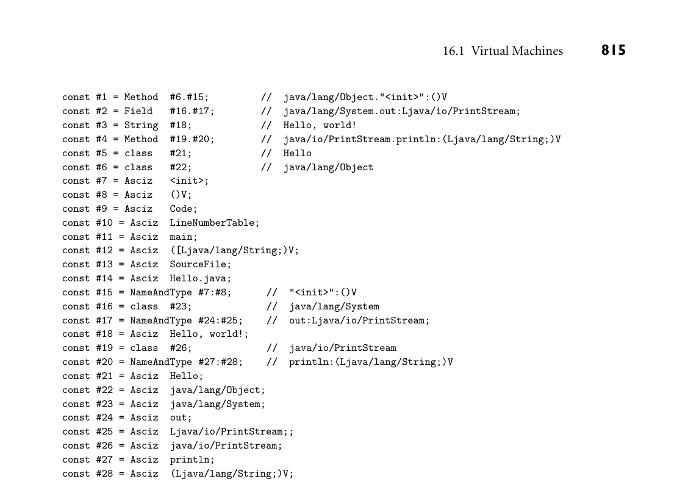
*Figure 16.1  Content of the JVM constant pool for the program in Example 16.2. The “Asciz” entries (zero-terminated  ASCII) contain null-terminated character-string names. Most other entries pair an indication of the kind of constant with a  reference to one or more additional entries. This output was produced by Sun’s javap tool.*

heap. They are allocated, dynamically, using the new and newarray instructions.  They are reclaimed automatically via garbage collection. The choice of collection  algorithm is left to the implementor of the JVM.

To facilitate sharing among threads, the Java language provides the equivalent  of monitors with a lock and a single, implicit condition variable per object, as  described in Section 13.4.3. The JVM provides direct support for this style of  synchronization. Each object in the heap has an associated mutual exclusion lock;  in a typical implementation, the lock maintains a set of threads waiting for entry  to the monitor. In addition, each object has an associated set of threads that  are waiting for the monitor’s condition variable.4 Locks are acquired with the  monitorenter instruction and released with the monitorexit instruction. Most

4  To save space, a JIT compiler will typically omit the monitor information for any object it can  prove is never used for synchronization.

JVMs insist that these calls appear in matching nested pairs, and that every lock  acquired within a given method be released within the same method (any correct  compiler for the Java language will follow these rules).

Consistency of access to shared objects is governed by the Java memory model,  which we considered briefy in Section 13.3.3. Informally, each thread behaves as  if it kept a private cache of the heap. When a thread releases a monitor or writes a  volatile variable, the JVM must ensure that all previous updates to the thread’s  cache have been written back to memory. When a thread enters a monitor or  reads a volatile variable, the JVM must (in effect) clear the thread’s cache so  that subsequent reads cause locations to be reloaded from memory. Of course,  actual implementations don’t perform explicit write-backs or invalidations; they  start with the memory model provided by the hardware’s cache coherence pro­ tocol and use memory barrier (fence) instructions where needed to avoid unac­ ceptable orderings.

Class Files

Physically, a JVM class fle is stored as a stream of bytes. Typically these occupy  some real fle provided by the operating system, but they could just as easily be a  record in a database. On many systems, multiple class fles may be combined into  a Java archive  (.jar) fle.

Logically, a class fle has a well-defned hierarchical structure. It begins with a  “magic number” (0x_cafe_babe), as described in Sidebar 14.4. This is followed  by

Major and minor version numbers of the JVM for which the fle was created  The constant pool  Indices into the constant pool for the current class and its superclass  Tables describing the class’s superinterfaces, felds, and methods

Because the JVM is both cleaner and more abstract than a real machine, the  Java class fle structure is both cleaner and more abstract than a typical object  fle (Section 15.4). Conspicuously missing is the extensive relocation informa­ tion required to cope with the many ways that addresses are embedded into in­ structions on a typical real machine. In place of this, bytecode instructions in a  class fle contain references to symbolic names in the constant pool. These be­ come references into the method area when code is dynamically linked. (Alter­ natively, they may become real machine addresses, appropriately encoded, when  the code is JIT  compiled.)  At  the same  time,  class  fles contain  extensive  informa­ tion not typically found in an executable object fle. Examples include access fags  for classes, felds, and methods (public, private, protected, static, final,  synchronized, native, abstract, strictfp); symbol table information that  is built into the structure of the fle (rather than an optional add-on); and special  instructions for such high-level notions as throwing an exception or entering or  leaving a monitor.

Bytecode

The bytecode for a method (or for a constructor or a class initializer) appears in  an entry in the class fle’s method table. It is accompanied by the following:

An indication of the number of local variables, including parameters  The maximum depth required in the operand stack  A table of exception handler information, each entry of which indicates

– The bytecode range covered by this handler  – The address (index in the code) of the handler itself  – The type of exception caught (an index into the constant pool)

Optional information for debuggers: specifcally, a table mapping bytecode  addresses to line numbers in the original source code and/or a table indicat­ ing which source code variable(s) occupy which JVM local variables at which  points in the bytecode.

Instruction Set  Java bytecode was designed to be both simple and compact.  Orthogonality was a strictly secondary concern. Every instruction begins with  a single-byte  opcode. Arguments, if any, occupy subsequent bytes, with values  given in big-endian order. With two exceptions, used for switch statements, ar­ guments are unaligned, for compactness. Most instructions, however, actually  don’t need an argument. Where typical hardware performs arithmetic on val­ ues in named registers, bytecode pops arguments from, and pushes result to, the  operand stack of the current method frame. Moreover, even loads and stores can  often use a single byte. There are, for example, special one-byte integer store in­ structions for each of the frst four entries in the local variable array. Similarly,  there are special instructions to push the values −1, 0, 1, 2, 3, 4, and 5 onto the  operand stack.

As of Java 8, the JVM defnes 205 of the 256 possible opcode values. Five of  these serve special purposes (unused, nop, debugger breakpoints, implementa­ tion dependent). The remainder can be organized into the following categories:

Load/store: move values back and forth between the operand stack and the local  variable array.  Arithmetic: perform integer or foating point operations on values in the  operand stack.  Type conversion: “widen” or  “narrow” values among the  built-in types  (byte,  char, short, int, long, float, and  double). Narrowing may result in a loss  of precision but never an exception.  Object management: create or query the properties of objects and arrays; access  felds and array elements.  Operand stack management: push and pop; duplicate; swap.  Control transfer: perform conditional, unconditional, or multiway branches  (switch).

Method calls: call and return from ordinary and static methods (including  constructors and initializers) of classes and interfaces. An invokedynamic  instruction, introduced in the Java 7 JVM, allows run-time customization of  linkage conventions for individual call sites. It is used both for Java 8 lambda  expressions and for the implementation of dynamically typed languages on top  of the JVM.  Exceptions: throw (no instructions required for catch).  Monitors: enter and exit (wait, notify, and  notifyAll are invoked via method  calls).

EXAMPLE 16.3  As a concrete example, consider the following defnitions for an integer set,  Bytecode for a list insert  represented as a sorted linked list:  operation

public class LLset {

node head;  class node {

public int val;  public node next;  }  public LLset() {  // constructor  head = new node();  // head node contains no real data  head.next = null;  }  ...  }

An insert method for this class appears in Figure 16.2. Java source is on the  left; a symbolic representation of the corresponding bytecode is on the right. The  line at the top of the bytecode indicates a maximum depth of 3 for the operand  stack and four entries in the local variable array, the frst two of which are argu­ ments: the this pointer and the integer v. Perusal of the code reveals numerous  examples of the special one-byte load and store instructions, and of instructions  that operate implicitly on the operand stack.  ■

Verification  Safety was one of the principal concerns in the defnition of the  Java language and virtual machine. Many of the things that can “go wrong”  while executing machine code compiled from a more traditional language can­ not go wrong when executing bytecode compiled from Java. Some aspects of  safety are obtained by limiting the expressiveness of the byte-code instruction  set or by checking properties at load time. One cannot jump to a nonexistent  address, for example, because method calls specify their targets symbolically by  name, and branch targets are specifed as indices within the code attribute of the  current method. Similarly, where hardware allows displacement addressing from  the frame pointer to access memory outside the current stack frame, the JVM  checks at load time to make sure that references to local variables (specifed by  constant indices into the local variable array) are within the bounds declared.

public void insert(int v) {  node n = head;

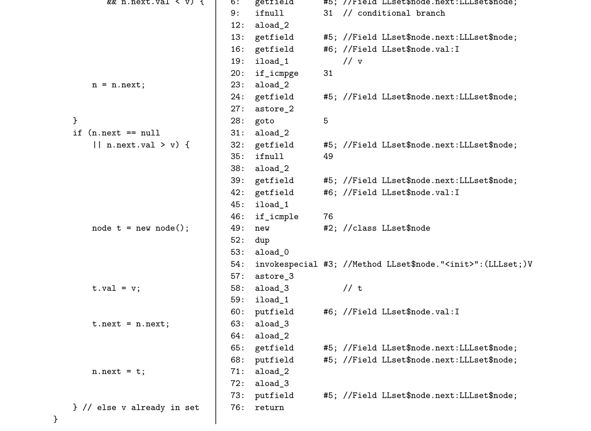
*Figure 16.2  Java source and bytecode for a list insertion method. Output on the right was produced by Oracle’s javac  (compiler) and javap (disassembler) tools, with additional comments inserted by hand.*

Other aspects of safety are guaranteed by the JVM during execution. Field  access and method call instructions throw an exception if given a null reference.  Similarly, array load and store instructions throw an exception if the index is not  within the bounds of the array.

When it frst loads a class fle, the JVM checks the top-level structure of the fle.  Among other things, it verifes that the fle begins with the appropriate “magic  number,” that the specifed sizes of the various sections of the fle are all within  bounds, and that these sizes add up to the size of the overall fle. When it links  the class fle into the rest of the program, the JVM checks additional constraints.  It verifes that all items in the constant pool are well formed, and that nothing  inherits from a final class. More signifcantly, it performs a host of checks on  the bytecode of the class’s methods. Among other things, the bytecode verifer  ensures that every variable is initialized before it is read, that every operation  is type-safe, and that the operand stacks of methods never overfow or under­ fow. All three of these checks require data flow analysis to determine that desired  properties (initialization status, types of slots in the local stack frame, depth of  the operand stack) are the same on every possible path to a given point in the  program. We will consider data fow in more detail in Section C 17.4.

DESIGN & IMPLEMENTATION

16.3 Verifcation of class fles and bytecode  Java compilers are required to generate code that satisfes all the constraints de­ fned by the Java class fle specifcation. These include well-formedness of the  internal data structures, type safety, defnite assignment, and lack of underfow  or overfow in the operand stack. A JVM, however, has no way to tell whether  a given class fle was generated by a correct compiler. To protect itself from  potentially incorrect (or even malicious) class fles, a JVM must verify that any  code it runs follows all the rules. Under normal operation, this means that cer­ tain checks (e.g., data fow for defnite assignment) are performed twice: once  by the Java compiler, to provide compile-time error messages to the program­ mer, and again by the JVM, to protect against buggy compilers or alternative  sources of bytecode.

To improve program start-up times and avoid unnecessary work, most  JVMs delay the loading (and verifcation) of class fles until some method in  that fle is actually called (this is the Java equivalent of the lazy linking described  in Section C 15.7.2). In order to effect this delay, the JVM must wait until a call  occurs to verify the last few properties of the code at the call site (i.e., that it  refers to a method that really exists, and that the caller is allowed to call).

16.1.2 The Common Language Infrastructure

As early as the mid-1980s, Microsoft recognized the need for interoperability  among programming languages running on Windows platforms. In a series of

product offerings spanning a decade and a half, the company developed increas­ ingly sophisticated versions of its Component Object Model (COM), frst to com­ municate with, then to call, and fnally to share data with program components  written in multiple languages.

With the success of Java, it became clear by the mid to late 1990s that a sys­ tem combining a JVM-style run-time system with the language interoperability  of COM could have enormous technical and commercial potential. Microsoft’s  .NET project set out to realize this potential.  It includes a JVM-like virtual  machine whose specifcation—the Common Language Infrastructure (CLI)—is  standardized by ECMA and the ISO. While development of the CLI has clearly  been driven by Microsoft, other implementations—notablyfrom the open-source  Mono project, led by Xamarin, Inc.—are available for non-Windows platforms.

IN MORE DEPTH

We consider the CLI in more detail on the companion site. Among other things,  we describe the Common Type System, which governs cross-language interoper­ ability; the architecture of the virtual machine, including its support for generics;  the Common Intermediate Language (CIL—the CLI analogue of Java bytecode);  and Portable Executable (PE) assemblies, the  CLI  analogue  of  .jar fles.

3CHECK YOUR UNDERSTANDING  1. What  is  a  run-time system? How does it differ from a “mere” library?  2.  List  some of the  major  tasks  that  may  be performed  by  a  run-time system.

  3.
  What
  is
  a
  virtual machine? What distinguishes it from interpreters of other
  sorts?

  4.
  Explain the distinction between system and process VMs. What other terms
  are sometimes used for system VMs?

  5.
  What
  is
  managed code?
  6.
  Why do many virtual machines use a stack-based intermediate form?

  7.
  Give several examples of special-purpose instructions provided by Java byte-
  code.

  8.
  Summarize the architecture of the Java Virtual Machine.
  9.
  Summarize the content of a Java class fle.

* Explain the validity checks performed on a class fle at load time.

## 16.2  Late Binding of Machine Code

In the traditional conception (Example 1.7), compilation is a one-time activity,  sharply distinguished from program execution. The compiler produces a tar­ get program, typically in machine language, which can subsequently be executed  many times for many different inputs.

In some environments, however, it makes sense to bring compilation and ex­ ecution closer together in time. A just-in-time (JIT) compiler translates a pro­ gram from source or intermediate form into machine language immediately be­ fore each separate run of the program. We consider JIT compilation further in the  frst subsection below. We also consider language systems that may compile new  pieces of a program—or recompile old pieces—after the program begins its exe­ cution. In Sections 16.2.2 and 16.2.3, we consider binary translation and binary  rewriting systems, which perform compiler-like operations on programs without  access to source code. Finally, in Section 16.2.4, we consider systems that may  download program components from remote locations. All these systems serve  to delay the binding of a program to its machine code.

16.2.1 Just-in-Time and Dynamic Compilation

To promote the Java language and virtual machine, Sun Microsystems coined the  slogan “write once, run anywhere”—the idea being that programs distributed  as Java bytecode could run on a very wide range of platforms. Source code, of  course, is also portable, but byte code is much more compact, and can be inter­ preted without additional preprocessing. Unfortunately, interpretation tends to  be expensive. Programs running on early Java implementations could be as much  as an order of magnitude slower than compiled code in other languages. Just-in­ time compilation is, to frst approximation, a technique to retain the portability of  bytecode while improving execution speed. Like both interpretation and dynamic  linking (Section 15.7), JIT compilation also benefts from the delayed discovery of  program components: program code is not bloated by copies of widely shared li­ braries, and new versions of libraries are obtained automatically when a program  that needs them is run.

Because a JIT system compiles programs immediately prior to execution, it  can add signifcant delay to program start-up time. Implementors face a diffcult  tradeoff: to maximize benefts with respect to interpretation, the compiler should  produce good code; to minimize start-up time, it should produce that code very  quickly. In general, JIT compilers tend to focus on the simpler forms of target  code improvement. Specifcally, they often limit themselves to the so-called local  improvements, which operate within individual control-fow constructs. Im­ provements at the global (whole method) and interprocedural (whole program)  level may be expensive to consider.

Fortunately, the cost of JIT compilation is typically lessened by the existence  of an earlier source-to-byte-code compiler that does much of the “heavy lifting.”5  Scanning is unnecessary in a JIT compiler, since bytecode is not textual. Parsing  is trivial, since class fles have a simple, self-descriptive structure. Many of the  properties that a source-to-byte-code compiler must infer at signifcant expense  (type safety, agreement of actual and formal parameter lists) are embedded di­ rectly in the structure of the bytecode (objects are labeled with their type, calls are  made through method descriptors); others can be verifed with simple data fow  analysis. Certain forms of machine-independent code improvement may also be  performed by the source-to-byte-code compiler (these are limited to some degree  by stack-based expression evaluation).

All these factors allow a JIT compiler to be faster—and to produce better  code—than one might initially expect. In addition, since we are already com­ mitted to invoking the JIT compiler at run time, we can minimize its impact on  program start-up latency by running it a bit at a time, rather than all at once:

Like a lazy linker (Section C 15.7.2), a JIT compiler may perform its work in­ crementally. It begins by compiling only the class fle that contains the program  entry point (i.e., main), leaving hooks in the code that call into the run-time  system wherever the program is supposed to call a method in another class fle.  After this small amount of preparation, the program begins execution. When  execution falls into the runtime through an unresolved hook, the runtime in­ vokes the compiler to load the new class fle and to link it into the program.  To eliminate the latency of compiling even the original class fle, the language  implementation may incorporate both an interpreter and a JIT compiler. Exe­ cution begins in the interpreter. In parallel, the compiler translates portions of  the program into machine code. When the interpreter needs to call a method,  it checks to see whether a compiled version is available yet, and if so calls that  version instead of interpreting the bytecode. We will return to this technique  below, in the context of the HotSpot Java compiler and JVM.  When a class fle is JIT compiled, the language implementation can cache the  resulting machine code for later use. This amounts to guessing, speculatively,  that the versions of library routines employed in the current run of the pro­ gram will still be current when the program is run again. Because languages  like Java and C# require the appearance of late binding of library routines, this  guess must be checked in each subsequent run. If the check succeeds, using a  cached copy saves almost the entire cost of JIT compilation.

Finally, JIT compilation affords the opportunity to perform certain kinds of  code improvement that are usually not feasible in traditional compilers. It is cus­ tomary, for example, for software vendors to ship a single compiled version of an

5  While a JIT compiler could, in principle, operate on source code, we assume throughout this  discussion that it works on a medium-level IF like Java bytecode or CIL.

application for a given instruction set architecture, even though implementations  of that architecture may differ in important ways, including pipeline width and  depth; the number of physical (renaming) registers; and the number, size, and  speed of the various levels of cache. A JIT compiler may be able to identify the  processor implementation on which it is running, and generate code that is tuned  for that specifc implementation. More important, a JIT compiler may be able  to in-line calls to dynamically linked library routines. This optimization is par­ ticularly important in object-oriented programs, which tend to call many small  methods. For such programs, dynamic in-lining can have a dramatic impact on  performance.

Dynamic Compilation

We have noted that a language implementation may choose to delay JIT compi­ lation to reduce the impact on program start-up latency. In some cases, compila­ tion must be delayed, either because the source or bytecode was not created or dis­ covered until run time, or because we wish to perform optimizations that depend  on information gathered during execution. In these cases, we say the language  implementation employs dynamic compilation. Common Lisp systems have used  dynamic compilation for many years: the language is typically compiled, but a  program can extend itself at run time. Optimization based on run-time statistics  is a more recent innovation.

Most programs spend most of their time in a relatively small fraction of the  code. Aggressive code improvement on this fraction can yield disproportion­ ately large improvements in program performance. A dynamic compiler can use  statistics gathered by run-time profiling to identify hot paths through the code,  which it then optimizes in the background. By rearranging the code to make  hot paths contiguous in memory, it may also improve the performance of the in­ struction cache. Additional run-time statistics may suggest opportunities to un­ roll loops (Exercise C 5.21), assign frequently used expressions to registers (Sec­ tions C 5.5.2 and C 17.8), and schedule instructions to minimize pipeline stalls  (Sections C 5.5.1 and C 17.6).

In some situations, a dynamic compiler may even be able to perform opti-

EXAMPLE 16.4  mizations that would be unsafe if implemented statically. Consider, for example,  When is in-lining safe?  the in-lining of methods from dynamically linked libraries. If foo is a static  method of class C, then calls to C.foo can safely be in-lined. Similarly, if bar  is a final method of class C (one that cannot be overridden), and o is an ob­ ject of class C, then calls to o.bar can safely be in-lined. But what if bar is not  final? The compiler can still in-line calls to o.bar if it can prove that o will  never refer to an instance of a class derived from C (which might have a different  implementation of bar). Sometimes this is easy:

C o = new C( args );  o.bar();  // no question what type this is

Other times it is not:

static void f(C o) {  o.bar();  }

Here the compiler can in-line the call only if it knows that f will never be passed  an instance of a class derived from C. A dynamic compiler can perform the op­ timization if it verifes that there exists no class derived from C anywhere in the  (current version of the) program. It must keep notes of what it has done, how­ ever: if dynamic linking subsequently extends the program with code that defnes  a new  class  D derived from C, the in-line optimization may need to be undone. ■

In some cases, a dynamic compiler may choose to perform optimizations that  may be unsafe even in the current program, provided that profling suggests  they will be proftable and run-time checks can determine whether they are safe.

EXAMPLE 16.5  Suppose, in the previous example, there already exists a class D derived from C,  Speculative optimization  but profling indicates that every call to f so far has passed an instance of class C.  Suppose further that f makes many calls to methods of parameter o, not  just  the   one shown in the example. The compiler might choose to generate code along  the following lines:

static void f(C o) {  if (o.getClass() == C.class) {  ... // code with in-lined calls -- much faster  } else  {   ... // code without in-lined calls  }  }  ■

An Example System: the HotSpot Java Compiler

HotSpot  is Oracle’s principal  JVM and  JIT compiler for desktop and server sys­ tems. It was frst released in 1999, and is available as open source.

HotSpot takes its name from its use of dynamic compilation to improve the  performance of hot code paths. Newly loaded class fles are initially interpreted.  Methods that are executed frequently are selected by the JVM for compilation and  are subsequently patched into the program on the fy. The compiler is aggressive  about in-lining small routines, and will do so in a deep, iterative fashion, repeat­ edly in-lining routines that are called from the code it just fnished in-lining. As  described in the preceding discussion of dynamic compilation, the compiler will  also in-line routines that are safe only for the current set of class fles, and will  dynamically “deoptimize” in-lined calls that have been rendered unsafe by the  loading of new derived classes.

The HotSpot compiler can be confgured to operate in either “client” or  “server” mode. Client mode is optimized for lower start-up latency. It is ap­ propriate for systems in which a human user frequently starts new programs. It  translates Java bytecode to static single assignment (SSA) form (a medium-level  IF described in Section C 17.4.1) and performs a few straightforward machine- independent optimizations. It then translates to a low-level IF, on which it per­

forms instruction scheduling and register allocation. Finally, it translates this IF  to machine code.

Server mode is optimized to generate faster code. It is appropriate for systems  that need maximum throughput and can tolerate slower start-up. It applies most  classic global and interprocedural code improvement techniques to the SSA ver­ sion of the program (many of these are described in Chapter 17), as well as other  improvements specifc to Java. Many of these improvements make use of profling  statistics.

Particularly when running in server mode, HotSpot can rival the performance  of traditional compilers for C and C++. In effect, aggressive in-lining and profle- driven optimization serve to “buy back” both the start-up latency of JIT compi­ lation and the overhead of Java’s run-time semantic checks.

Other Example Systems

EXAMPLE 16.6  Like HotSpot, Microsoft’s CIL-to-machine-code compiler performs dynamic op- Dynamic compilation in  timization of hot code paths. The .NET source-to-CIL compilers are also ex- the CLR  plicitly available to programs through the System.CodeDom.Compiler API. A  program running on the CLR can directly invoke the compiler to translate C# (or  Visual Basic, or other .NET languages) into CIL PE assemblies. These can then  be loaded into the running program. As they are loaded, the CLR JIT compiler  translates them to machine code. As noted in Sections 3.6.4 and 11.2, C# includes  lambda expressions reminiscent of those in functional languages:

Func<int, int> square_func = x => x * x;

Here square_func is a function from integers to integers that multiplies its pa­ rameter (x) by itself, and returns the product. It is analogous to the following in  Scheme:

(let ((square-func (lambda (x) (* x x)))) ...

Given the C# declaration, we can write

y = square_func(3);  // 9

But just as Lisp allows a function to be represented as a list, so too does C# allow  a lambda expression to be represented as a syntax tree:

Expression<Func<int, int>> square_tree = x => x * x;

Various methods of library class Expression can now be used to explore and  manipulate the tree. When desired, the tree can be converted to CIL code:

square_func = square_tree.Compile();

These operations are roughly analogous to the following in Scheme:

(let* ((square-tree '(lambda (x) (* x x)))  ; note the quote mark  (square-func (eval square-tree (scheme-report-environment 5))))  ...

The difference in practice is that while Scheme’s eval checks the syntactic valid­ ity of the lambda expression and creates the metadata needed for dynamic type  checking, the typical implementation leaves the function in list (tree) form, and  interprets it when called. C#’s Compile is expected to produce CIL code; when  called it will be JIT compiled and directly executed.  ■  Many Lisp dialects and implementations have employed an explicit mix of in-

EXAMPLE 16.7  terpretation and compilation. Common Lisp includes a compile function that  Dynamic compilation in  takes the name of an existing (interpretable) function as argument. As a side ef- CMU Common Lisp  fect, it invokes the compiler on that function, after which the function will (pre­ sumably) run much faster:

(defun square (x) (* x x))  ; outermost level function declaration  (square 3)  ; 9  (compile 'square)  (square 3)  ; also 9 (but faster :-)

CMU Common Lisp, a widely used open-source implementation of the lan­ guage, incorporates two interpreters and a compiler with two back ends. The so- called “baby” interpreter understands a subset of the language, but works stand­ alone. It handles simple expressions at the read-eval-print loop, and is used to  bootstrap the system. The “grown-up” interpreter understands the whole lan­ guage, but needs access to the front end of the compiler. The bytecode compiler  translates source code to an intermediate form reminiscent of Java bytecode or  CIL. The native code compiler translates to machine code. In general, programs  are run by the “grown-up” interpreter unless the programmer invokes the com­ piler explicitly from the command line or from within a Common Lisp program  (with compile). The compiler, when invoked, produces native code unless other­ wise instructed. Documentation indicates that the bytecode version of the com­ piler runs twice as fast as the native code version. Bytecode is portable and 6×  denser than native code. It runs 50× slower than native code, but 10× faster than  the interpreter.  ■

EXAMPLE 16.8  Like most scripting languages, Perl 5 compiles its input to an internal syntax  Compilation of Perl  tree format, which it then interprets. In several cases, the interpreter may need  to call back into the compiler during execution. Features that force such dynamic  compilation include eval, which compiles and then interprets a string; require,  which loads a library package; and the ee version of the substitution command,  which performs expression evaluation on the replacement string:

$foo = "abc";  $foo =~ s/b/2 + 3/ee;  # replace b with the value of 2 + 3  print "$foo\n";  # prints a5c

Perl can also be directed, via library calls or the perlcc command-line script  (itself written in Perl), to translate source code to either bytecode or machine  code.  In the former case, the output is an “executable” fle beginning with  #! /usr/bin/perl (see the Sidebar 14.4 for a discussion of the #! convention).  If invoked from the shell, this fle will feed itself back into Perl 5, which will notice  that the rest of the fle contains bytecode instead of source, and will perform a  quick reconstruction of the syntax tree, ready for interpretation.

If directed to produce machine code, perlcc generates a C program, which it  then runs through the C compiler. The C program builds an appropriate syntax  tree and passes it directly to the Perl interpreter, bypassing both the compiler  and the byte-code-to-syntax-tree reconstruction. Both the bytecode and machine  code back ends are considered experimental; they do not work for all programs.

Perl 6, still under development as of 2015, is intended to be JIT compiled. Its  virtual machine, called Parrot, is unusual in providing a large register set, rather  than a stack, for expression evaluation. Like Perl itself—but unlike the JVM and  CLR—Parrot allows variables to be treated as different types in different contexts.  Work is underway to target other scripting languages to Parrot, with the eventual  goal or providing interoperability similar to that of the .NET languages.  ■

3CHECK YOUR UNDERSTANDING  11. What  is  a  just-in-time (JIT) compiler? What are its potential advantages over  interpretation or conventional compilation?  12. Why might one prefer bytecode over source code as the input to a JIT com­

piler?

* What  distinguishes  dynamic compilation from just-in-time compilation?
* What  is  a  hot path? Why is it signifcant?
* Under what circumstances can a JIT compiler expand virtual methods in-line?

* What  is  deoptimization? When and why is it needed?
* Explain the distinction between the function and expression tree representa­

tions of a lambda expression in C#.  18. Summarize the relationship between compilation and interpretation in Perl.

16.2.2 Binary Translation

Just-in-time and dynamic compilers assume the availability of source code or of  bytecode that retains all of the semantic information of the source. There are  times, however, when it can be useful to recompile object code. This process is  known as binary translation. It allows already-compiled programs to be run on  a machine with a different instruction set architecture. Some readers may recall

Apple’s Rosetta system, which allowed programs compiled for older PowerPC- based Macintosh computers to run on newer x86-based Macs. Rosetta built on  experience with a long line of similar translators.

The principal challenge for binary translation is the loss of information in the  original source-to-object-code translation. Object code typically lacks both type  information and the clearly delineated subroutines and control-fow constructs  of source code and bytecode. While most of this information appears in the com­ piler’s symbol table, and may sometimes be included in the object fle for debug­ ging purposes, vendors usually delete it before shipping commercial products,  and a binary translator cannot assume it will be present.

The typical binary translator reads an object fle and reconstructs a control  fow graph of the sort described in Section 15.1.1. This task is complicated by  the lack of explicit information about basic blocks. While branches (the ends  of basic blocks) are easy to identify, beginnings are more diffcult: since branch  targets are sometimes computed at run time or looked up in dispatch tables or  virtual function tables, the binary translator must consider the possibility that  control may sometimes jump into the middle of a “probably basic” block. Since  translated code will generally not lie at the same address as the original code,  computed branches must be translated into code that performs some sort of table  lookup, or falls back on interpretation.

Static binary translation is not always possible for arbitrary object code. In ad­ dition to computed branches, problems include self-modifying code (programs  that write to their own instruction space), dynamically generated code (e.g., for  single-pointer closures, as described in Example C 9.61), and various forms of in­ trospection, in which a program examines and reasons about its own state (we  will consider this more fully in Section 16.3). Fortunately, many common id­ ioms can be identifed and treated as special cases, and for the (comparatively  rare) cases that can’t be handled statically, a binary translator can always delay  some translation until run time, fall back on interpretation, or simply inform the  user that translation is not possible. In practice, binary translation has proved  remarkably successful.

Where and When to Translate

Most binary translators operate in user space, and limit themselves to the non- privileged subset of the machine’s instruction set. A few are built at a lower level.

EXAMPLE 16.9  When Apple converted from the Motorola 680x0 processor to the PowerPC in  The Mac 68K emulator  1994, they built a 68K interpreter into the operating system. A subsequent re­ lease the following year augmented the interpreter with a rudimentary binary  translator that would cache frequently executed instruction sequences in a small  (256KB) buffer. By placing the interpreter (emulator) in the lowest levels of the  operating system, Apple was able to signifcantly reduce its time to market: only  the most performance-critical portions of the OS were rewritten for the PowerPC,  leaving the rest as 68K code. Additional portions were rewritten over time.  ■

EXAMPLE 16.10  In the late 1990s, Transmeta Corp. developed an unusual system capable of  The Transmeta Crusoe  running unmodifed x86 operating systems and applications by means of binary  processor

translation. Their Crusoe and Effceon processors, sold from 2000 to 2005, ran  proprietary “Code Morphing” software directly on top of a wide-instruction­ word ISA (distantly related to the Itanium). This software, designed in conjunc­ tion with the hardware, translated x86 code to native code on the fy, and was  entirely invisible to systems running above it.  ■  Binary translators display even more diversity in their choice of what and when  to translate. In the simplest case, translation is a one-time, off-line activity akin to

EXAMPLE 16.11  conventional compilation. In the late 1980s, for example, Hewlett Packard Corp.  Static binary translation  developed a binary translator to retarget programs from their “Classic” HP 3000  line to the PA-RISC processor. The translator depended on the lack of dynamic  linking in the operating system: all pieces of the to-be-translated program could  be found in a single executable.  ■

EXAMPLE 16.12  In a somewhat more ambitious vein, Digital Equipment Corp. (DEC) in the  Dynamic binary translation  early 1990s constructed a pair of translators for their newly developed Alpha pro­ cessor: one (mx) to translate Unix programs originally compiled for MIPS-based  workstations, the other (VEST) to translate VMS programs originally compiled  for the VAX. Because VMS supported an early form of shared libraries, it was  not generally possible to statically identify all the pieces of a program. VEST  and mx were therefore designed as “open-ended” systems that could intervene, at  run time, to translate newly loaded libraries. Like the HP system, DEC’s transla­ tors saved new, translated versions of their applications to disk, for use in future  runs.  ■

EXAMPLE 16.13  In a subsequent project in the mid-1990s, DEC developed a system to execute  Mixed interpretation and  shrink-wrapped Windows software on Alpha processors. (Early versions of Mi- translation  crosoft’s Windows NT operating system were available for both the x86 and the

DESIGN & IMPLEMENTATION

16.4 Emulation and interpretation  While the terms interpretation and emulation are often used together, the con­ cepts are distinct. Interpretation, as we have seen, is a language implemen­ tation technique: an interpreter is a program capable of executing programs  written in the to-be-implemented language. Emulation is an end goal: faith­ fully imitating the behavior of some existing system (typically a processor or  processor/OS pair) on some other sort of system. An emulator may use an in­ terpreter to execute the emulated processor’s instruction set. Alternatively, it  may use binary translation, special hardware (e.g., a feld-programmable gate  array—FPGA), or some combination of these.

Emulation and interpretation are also distinct from simulation. A  simulator   models some complex system by capturing “important” behavior and ignor­ ing “unimportant” detail. Meteorologists, for example, simulate the Earth’s  weather systems, but they do not emulate them. An emulator is generally con­ sidered correct if it does exactly what the original system does. For a simulator,  one needs some notion of accuracy: how close is close enough?

Alpha, but most commercial software came in x86-only versions.) DEC’s FX!32  included both a binary translator and a highly optimized interpreter. When the  user tried to run an x86 executable, FX!32 would frst interpret it, collecting usage  statistics. Later, in the background, it would translate hot code paths to native  code, and store them in a database. Once translated code was available (later in  the same execution or during future runs), the interpreter would run it in lieu of  the original.  ■

EXAMPLE 16.14  Modern emulation systems typically take an intermediate approach. A fast,  Transparent dynamic  simple translator creates native versions of basic blocks or subroutines on de­ translation  mand, and caches them for repeated use within a given execution. For the sake of  transparency (to avoid modifcation of programs on disk), and to accommodate  dynamic linking, translated code is usually not retained from one execution to  the next. Systems in this style include Apple’s Rosetta; HP’s Aries, which retar­ gets PA-RISC code to the Itanium; and Intel’s IA-32 EL, which retargets x86 code  to the Itanium.  ■

EXAMPLE 16.15  Among the most widely used emulators today is the open-source QEMU  Translation and  (quick emulation) system. In the language of Section 16.1, QEMU is a system  virtualization  virtual machine. Like other system VMs, it runs as a user-level process that emu­ lates bare hardware on which to run a guest operating system (and that system’s  workload). Unlike most system VMs, QEMU can emulate hardware very different  from that of the underlying physical machine. For the sake of good performance,  it makes heavy use of binary translation, converting large blocks of guest system  instructions into equivalent blocks of native instructions.  ■

Dynamic Optimization

In a long-running program, a dynamic translator may revisit hot paths and opti­ mize them more aggressively. A similar strategy can also be applied to programs  that don’t need translation—that is, to programs that already exist as machine  code for the underlying architecture. This sort of dynamic optimization has been  reported to improve performance by as much as 20% over already-optimized  code, by exploiting run-time profling information.

EXAMPLE 16.16  Much of the technology of dynamic optimization was pioneered by the Dy- The Dynamo dynamic  namo project at HP Labs in the late 1990s. Dynamo was designed to transparently  optimizer  enhance the performance of applications for the PA-RISC instruction set. A sub­ sequent version, DynamoRIO, was written for the x86. Dynamo’s key innovation  was the concept of a partial execution trace: a hot path whose basic blocks can be  reorganized, optimized, and cached as a linear sequence.

An example of such a trace appears in Figure 16.3. Procedure print matching  takes a set and a predicate as argument, and prints all elements of the set that  match the predicate. At run time, Dynamo may discover that the procedure is  frequently called with a particular predicate p that is almost never true. The hot  path through the fow graph (left side of the fgure) can then be turned into the  trace at the right. If print matching is sometimes called with a different predi­ cate p, it will use a separate copy of the code. Branches out of the trace (in the

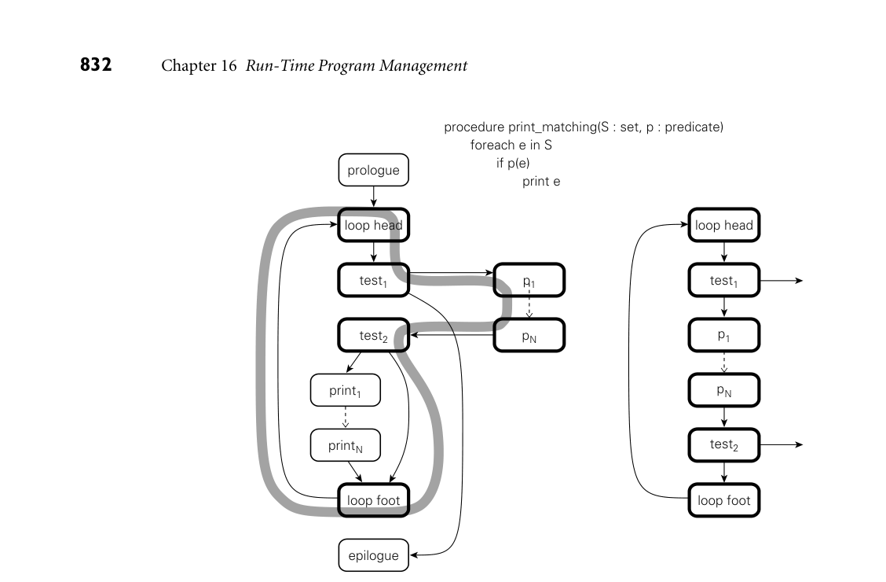
*Figure 16.3  Creation of a partial execution trace. Procedure print matching (shown at top)  is often called with a particular predicate, p, which is usually false. The control fow graph (left,  with hot blocks in bold and the hot path in grey) can be reorganized at run time to improve  instruction-cache locality and to optimize across abstraction boundaries (right).*

loop-termination and predicate-checking tests) jump either to other traces or, if  appropriate ones have not yet been created, back into Dynamo.

By identifying and optimizing traces, Dynamo is able to signifcantly improve  locality in the instruction cache, and to apply standard code improvement tech­ niques across the boundaries between separately compiled modules and dynam­ ically loaded libraries. In Figure 16.3, for example, it will perform register allo­ cation jointly across print matchings and the predicate p. It  can  even  perform   instruction scheduling across basic blocks if it inserts appropriate compensating  code on branches out of the trace. An instruction in block test2, for  example,   can be moved into the loop footer if a copy is placed on the branch to the right.  Traces have proved to be a very powerful technique. They are used not only by dy­ namic optimizers, but by dynamic translators like Rosetta as well, and by binary  instrumentation tools like Pin (to be discussed in Section 16.2.3).  ■

16.2.3 Binary Rewriting

While the goal of a binary optimizer is to improve the performance of a program  without altering its behavior, one can also imagine tools designed to change that  behavior. Binary rewriting is a general technique to modify existing executable  programs, typically to insert instrumentation of some kind. The most common  form of instrumentation collects profling information. One might count the  number of times that each subroutine is called, for example, or the number of  times that each loop iterates (Exercise 16.5). Such counts can be stored in a buffer  in memory, and dumped at the end of execution. Alternatively, one might log  all memory references. Such a log will generally need to be sent to a fle as the  program runs—it will be too long to ft in memory.

In addition to profling, binary rewriting can be used to

Simulate new architectures: operations of interest to the simulator are replaced  with code that jumps into a special run-time library (other code runs at native  speed).  Evaluate the coverage of test suites, by identifying paths through the code that  are not explored by a series of tests.  Implement model checking for parallel programs, a process that exposes race  conditions (Example 13.2) by forcing a program through different interleav­ ings of operations in different threads.  “Audit” the quality of a compiler’s optimizations. For example, one might  check whether the value loaded into a register is always the same as the value  that was already there (such loads suggest that the compiler may have failed to  realize that the load was redundant).  Insert dynamic semantic checks into a program that lacks them. Binary rewrit­ ing can be used not only for simple checks like null-pointer dereference and  arithmetic overfow, but for a wide variety of memory access errors as well,  including uninitialized variables, dangling references, memory leaks, “double  deletes” (attempts to deallocate an already deallocated block of memory), and  access off the ends of dynamically allocated arrays.

More ambitiously, as described in Sidebar 16.5, binary rewriting can be used to  “sandbox” untrusted code so that it can safely be executed in the same address  space as the rest of the application.

EXAMPLE 16.17

Many of the techniques used by rewriting tools were pioneered by the ATOM  binary rewriter for the Alpha processor. Developed by researchers at DEC’s West­ ern Research Lab in the early 1990s, ATOM was a static tool that modifed a pro­ gram for subsequent execution.

The ATOM binary rewriter

To use ATOM, a programmer would write instrumentation and analysis sub­ routines in C. Instrumentation routines would be called by ATOM during the  rewriting process. By calling back into ATOM, these routines could arrange for  the rewritten application to call analysis routines at instructions, basic blocks,  subroutines, or control fow edges of the programmer’s choosing. To make room

for inserted calls, ATOM would move original instructions of the instrumented  program; to facilitate such movement, the program had to be provided as a set of  relocatable modules. No other changes were made to the instrumented program;  in particular, data addresses were always left unchanged.  ■

An Example System: the Pin Binary Rewriter

For modern processors, ATOM has been supplanted by Pin, a binary rewriter de­ veloped by researchers at Intel in the early 2000s, and distributed as open source.  Designed to be largely machine independent, Pin is available not only for the x86,  x86-64, and Itanium, but also for ARM.

Pin was directly inspired by ATOM, and has a similar programming interface.  In particular, it retains the notions of instrumentation and analysis routines. It  also borrows ideas from Dynamo and other dynamic translation tools. Most sig­ nifcantly, it uses an extended version of Dynamo’s trace mechanism to instru­ ment previously unmodifed programs at run time; the on-disk representation  of the program never changes. Pin can even be attached to an already-running  application, much like the symbolic debuggers we will study in Section 16.3.2.

Like Dynamo, Pin begins by writing an initial trace of basic blocks into a run­ time trace cache. It ends the trace when it reaches an unconditional branch, a  predefned maximum number of conditional branches, or a predefned maxi­ mum number of instructions. As it writes, it inserts calls to analysis routines (or  in-line versions of short routines) at appropriate places in the code. It also main­ tains a mapping between original program addresses and addresses in the trace,  so it can modify address-specifc instructions accordingly. Once it has fnished  creating a trace, Pin simply jumps to its frst instruction. Conditional branches  that exit the trace are set to link to other traces, or to jump back into Pin.

Indirect branches are handled with particular care. Based on run-time pro­ fling, Pin maintains a set of predictions for the targets of such branches, sorted  most likely frst. Each prediction consists of an address in the original program  (which serves as a key) and an address to jump to in the trace cache. If none  of the predictions match, Pin falls back to table lookup in its mapping between  original and trace cache addresses. If match is still not found, Pin falls back on an  instruction set interpreter, allowing it to handle even dynamically generated code.

To reduce the need to save registers when calling analysis routines, and to facil­ itate in-line expansion of those routines, Pin performs its own register allocation  for the instructions of each trace, using similar allocations whenever possible for  traces that link to one another. In multithreaded programs, one register is stat­ ically reserved to point to a thread-specifc buffer, where registers can be spilled  when necessary. Condition codes are not saved across calls to analysis routines  unless their values are needed afterward. For routines that can be called any­ where within a basic block, Pin hunts for a location where the cost of saving and  restoring is minimized.

16.2.4 Mobile Code and Sandboxing

Portability is one of the principal motivations for late binding of machine code.  Code that has been compiled for one machine architecture or operating system  cannot generally be run on another. Code in a byte code (Java bytecode, CIL) or  scripting language (JavaScript, Visual Basic), however, is compact and machine  independent: it can easily be moved over the Internet and run on almost any  platform. Such mobile code is increasingly common. Every major browser sup­ ports JavaScript; most enable the execution of Java applets as well. Visual Basic  macros are commonly embedded not only in pages meant for viewing with In­ ternet Explorer, but also in Excel, Word, and Outlook documents distributed via  email. Cell phone apps may use mobile code to distribute games, productivity  tools, and interactive media that run within an existing process.

In some sense, mobile code is nothing new: almost all our software comes from  other sources; we download it over the Internet or perhaps install it from a DVD.  Historically, this usage model has relied on trust (we assume that software from a  well-known company will be safe) and on the very explicit and occasional nature  of installation. What has changed in recent years is the desire to download code  frequently, from potentially untrusted sources, and often without the conscious  awareness of the user.

Mobile code carries a variety of risks. It may access and reveal confdential  information (spyware). It may interfere with normal use of the computer in an­ noying ways (adware). It may damage existing programs or data, or save copies of  itself that run without the user’s intent (malware of various kinds). In particular

DESIGN & IMPLEMENTATION

16.5 Creating a sandbox via binary rewriting  Binary rewriting provides an attractive means to implement a sandbox. While  there is in general no way to ensure that code does what it is supposed to do  (one is seldom sure of that even with one’s own code), a binary rewriter can

Verify the address of every load and store, to make sure untrusted code ac­ cesses only its own data, and to avoid alignment faults  Similarly verify every branch and call, to prevent control from leaving the  sandbox by any means other than returning  Verify all opcodes, to prevent illegal instruction faults  Double-check the parameters to any arithmetic instruction that may gener­ ate a fault  Audit (or forbid) all system calls  Instrument backward jumps to limit the amount of time that untrusted  code can run (and in particular to preclude any infnite loops)

egregious cases, it may use the host machine as a “zombie” from which to launch  attacks on other users.

To protect against unwanted behavior, both accidental and malicious, mobile  code must be executed in some sort of sandbox, as described in Sidebar 14.6.  Sandbox creation is diffcult because of the variety of resources that must be pro­ tected. At a minimum, one needs to monitor or limit access to processor cycles,  memory outside the code’s own instructions and data, the fle system, network  interfaces, other devices (passwords, for example, may be stolen by snooping the  keyboard), the window system (e.g., to disable pop-up ads), and any other poten­ tially dangerous services provided by the operating system.

Sandboxing mechanisms lie at the boundary between language implementa­ tion and operating systems. Traditionally, OS-provided virtual memory tech­ niques might be used to limit access to memory, but this is generally too expensive  for many forms of mobile code. The two most common techniques today—both  of which rely on technology discussed in this chapter—are binary rewriting and  execution in an untrusting interpreter. Both cases are complicated by an inherent  tension between safety and utility: the less we allow untrusted code to do, the less  useful it can be. No single policy is likely to work in all cases. Applets may be  entirely safe if all they can do is manipulate the image in a window, but macros  embedded in a spreadsheet may not be able to do their job without changing the  user’s data. A major challenge for future work is to fnd a way to help users—  who cannot be expected to understand the technical details—to make informed  decisions about what and what not to allow in mobile code.

3CHECK YOUR UNDERSTANDING  19. What  is  binary translation? When and why is it needed?

* Explain the tradeoffs between static and dynamic binary translation.
* What  is  emulation? How is it related to interpretation and simulation?
* What  is  dynamic optimization? How can it improve on static optimization?

* What  is  binary rewriting? How does it differ from binary translation and dy­

namic optimization?  24. Describe the notion of a partial execution trace. Why is it important to dy­

namic optimization and rewriting?  25. What  is  mobile code?  26. What  is  sandboxing? When and why is it needed? How can it be implemented?

## 16.3  Inspection/Introspection

Symbol table metadata makes it easy for utility programs—just-in-time and dy­ namic compilers, optimizers, debuggers, proflers, and binary rewriters—to in­ spect a program and reason about its structure and types. We consider debuggers  and proflers in particular in Sections 16.3.2 and 16.3.3. There is no reason, how­ ever, why the use of metadata should be limited to outside tools, and indeed it is  not: Lisp has long allowed a program to reason about its own internal structure  and types (this sort of reasoning is sometimes called introspection). Java and C#  provide similar functionality through a reflection API that allows a program to  peruse its own metadata. Refection appears in several other languages as well,  including Prolog (Sidebar 12.2) and all the major scripting languages. In a dy­ namically typed language such as Lisp, refection is essential: it allows a library  or application function to type check its own arguments. In a statically typed  language, refection supports a variety of programming idioms that were not tra­ ditionally feasible.

16.3.1 Reflection

EXAMPLE 16.18  Trivially, refection can be useful when printing diagnostics. Suppose we are try- Finding the concrete type  ing to debug an old-style (nongeneric) queue in Java, and we want to trace the  of a reference variable  objects that move through it. In the dequeue method, just before returning an  object rtn of type Object, we might write

System.out.println("Dequeued a " + rtn.getClass().getName());

If the dequeued object is a boxed int, we  will  see

Dequeued a java.lang.Integer  ■

More signifcantly, refection is useful in programs that manipulate other pro­ grams. Most program development environments, for example, have mecha­ nisms to organize and “pretty-print” the classes, methods, and variables of a pro­ gram. In a language with refection, these tools have no need to examine source  code: if they load the already-compiled program into their own address space,  they can use the refection API to query the symbol table information created by  the compiler. Interpreters, debuggers, and proflers can work in a similar fashion.  In a distributed system, a program can use refection to create a general-purpose  serialization mechanism, capable of transforming an almost arbitrary structure  into a linear stream of bytes that can be sent over a network and reassembled at  the other end. (Both Java and C# include such mechanisms in their standard li­ brary, implemented on top of the basic language.) In the increasingly dynamic

world of Internet applications, one can even create conventions by which a pro­ gram can “query” a newly discovered object to see what methods it implements,  and then choose which of these to call.

There are dangers, of course, associated with the undisciplined use of refec­ tion. Because it allows an application to peek inside the implementation of a class  (e.g., to list its private members), refection violates the normal rules of abstrac­ tion and information hiding. It may be disabled by some security policies (e.g., in  sandboxed environments). By limiting the extent to which target code can differ  from the source, it may preclude certain forms of code improvement.

EXAMPLE 16.19  Perhaps the most common pitfall of refection, at least for object-oriented lan- What not to do with  guages, is the temptation to write case (switch) statements driven by type in- reflection  formation:

procedure rotate(s : shape)

case shape.type of  –– don’t do this in Java!  square: rotate square(s)  triangle: rotate triangle(s)  circle:  –– no-op  . . .

While this kind of code is common (and appropriate) in Lisp, in an object- oriented language it is much better written with subtype polymorphism:

s.rotate()  –– virtual method call  ■

Java Reflection

Java’s root class, Object, supports a getClass method that returns an instance  of java.lang.Class. Objects of this class in turn support a large number of re­ fection operations, among them the getName method we used in Example 16.18.

EXAMPLE 16.20  A call to  getName returns the fully qualified name of the class, as it is embedded  Java class-naming  in the package hierarchy. For array types, naming conventions are taken from the  conventions  JVM:

int[] A = new int[10];  System.out.println(A.getClass().getName());  // prints "[I"  String[] C = new String[10];  System.out.println(C.getClass().getName());  // "[Ljava.lang.String;"  Foo[][] D = new Foo[10][10];  System.out.println(D.getClass().getName());  // "[[LFoo;"

Here Foo is assumed to be a user-defned class in the default (outermost) package.  A left square bracket indicates an array type; it is followed by the array’s element  type. The built-in types (e.g., int) are represented in this context by single-letter  names (e.g., I). User-defned types are indicated by an L, followed by the fully  qualifed class name and terminated by a semicolon. Notice the similarity of the  second example (C) to entry #12 in the constant pool of Figure 16.1: that entry

gives the parameter types (in parentheses) and return type (V means void) of   main. As every Java programmer knows, main expects an array of strings.  ■  A call  to  o.getClass() returns information on the concrete type of the object  referred to by o, not on the abstract type of the reference o. If  we  want  a  Class  object for a particular type, we can create a dummy object of that type:

EXAMPLE 16.21

Getting information on a  particular class

Object o = new Object();  System.out.println(o.getClass().getName());  // "java.lang.Object"

EXAMPLE 16.22

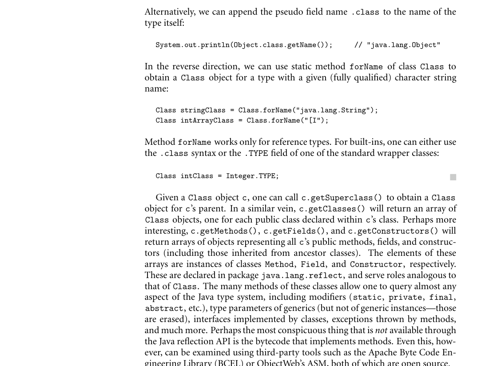
*Figure 16.4 shows Java code to list the methods declared in (but not inherited  by) a given class. Also shown is output for AccessibleObject, the  parent  class   of Method, Field, and  Constructor. (The primary purpose of this class is to*

Listing the methods of a  Java class

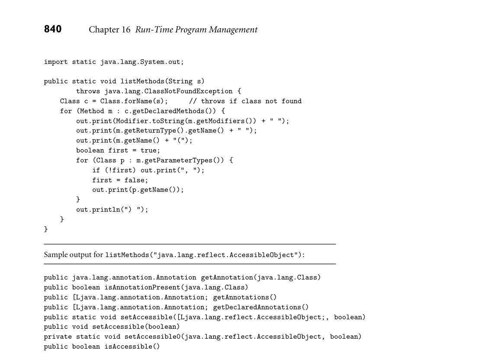
*Figure 16.4  Java reflection code to list the methods of a given class. Sample output is shown below below the code.*

control whether the refection interface can be used to override access control  [private, protected] for the given object.)  ■

EXAMPLE 16.23  One can even use refection to call a method of an object whose class is not  Calling a method with  known at compile time. Suppose that someone has created a stack containing a  reflection  single integer:

Stack s = new Stack();  s.push(new Integer(3));

Now suppose we are passed this stack as a parameter u of Object type. We can  use refection to explore the concrete type of u. In the process we will discover  that its second method, named pop, takes no arguments and returns an Object  result. We can call this method using Method.invoke:

Method uMethods[] = u.getClass().getMethods();  Method method1 = uMethods[1];  Object rtn = method1.invoke(u);  // u.pop()

A call  to  rtn.getClass().getName() will return java.lang.Integer. A  call   to ((Integer) rtn).intValue() will return the value 3 that was originally  pushed into s.  ■

Other Languages

C#’s refection API is similar to that of Java: System.Type is analogous to  java.lang.Class; System.Reflection is analogous to java.lang.reflect.  The pseudo function typeof plays the role of Java’s pseudo feld .class. More   substantive differences stem from the fact that PE assemblies contain a bit more  information than is found in Java class fles.  We can ask for names of for­ mal parameters in C#, for example, not just their types.  More signifcantly,  the use of reifcation instead of erasure for generics means that we can re­ trieve precise information on the type parameters used to instantiate a given  object. Perhaps the biggest difference is that  .NET  provides a standard  library,   System.Reflection.Emit, to create PE assemblies and to populate them with  CIL. The functionality of Reflection.Emit is roughly comparable to that of the  BCEL and ASM tools mentioned in the previous subsection. Because it is part of  the standard library, however, it is available to any program running on the CLI.

All of the major scripting languages (Perl, PHP, Tcl, Python, Ruby, JavaScript)  provide extensive refection mechanisms. The precise set of capabilities varies  some from language to language, and the syntax varies quite a bit, but all allow  a program to explore its own structure and types. From the programmer’s point  of view, the principal difference between refection in Java and C# on the one  hand, and in scripting languages on the other, is that the scripting languages—  like Lisp—are dynamically typed. In Ruby, for example, we can discover the class  of an object, the methods of a class or object, and the number of parameters  expected by each method, but the parameters themselves are untyped until the  method is called. In the following code, method p prints its argument to standard  output, followed by a newline:

EXAMPLE 16.24

Reflection facilities in Ruby

squares = {2=>4, 3=>9}  p squares.class  p Hash.public_instance_methods.lengt p squares.public_methods.length  m = Hash.public_instance_methods[12]  p m  p squares.method(m).arity

# Hash  # 146 -­ Hashes have many methods  # 146 -­ those same methods

h

# ":store"  # 2 -­ key and value to be stored

As in Java and C#, we can also invoke a method whose name was not known  at compile time:

squares.store(1, 1)  # static invocation  p squares  # {2=>4, 3=>9, 1=>1}  squares.send(m, 0, 0)  # dynamic invocation  p squares  # {2=>4, 3=>9, 1=>1, 0=>0}  ■

As suggested at the beginning of this section, refection is in some sense more  “natural” in scripting languages (and in Lisp and Prolog) than it is in Java or  C#: detailed symbol table information is needed at run time to perform dynamic  type checks; in an interpreted implementation, it is also readily available. Lisp  programmers have known for decades that refection was useful for many ad­ ditional purposes. The designers of Java and C# clearly felt these purposes were  valuable enough to justify adding refection (with considerably higher implemen­ tation complexity) to a compiled language with static typing.

Annotations and Attributes

Both Java and C# allow the programmer to extend the metadata saved by the  compiler. In Java, these extensions take the form of annotations attached to decla­ rations. Several annotations are built into the programming language. These play  the role of pragmas. In Example C 7.65, for example, we noted that the Java com­ piler will generate warnings when a generic class is assigned into a variable of the  equivalent nongeneric class. The warning indicates that the code is not statically  type-safe, and that an error message is possible at run time. If the programmer  is certain that the error cannot arise, the compile-time warning can be disabled  by prefxing the method in which the assignment appears with the annotation  @SuppressWarnings("unchecked").

In general, a Java annotation resembles an interface whose methods take no  parameters, throw no exceptions, and return values of one of a limited number

EXAMPLE 16.25  of predefned types. An example of a user-defned annotation appears in Fig­ User-defined annotations  ure 16.5. If we run the program it will print  in Java

author:  Michael Scott  date:  July, 2015  revision:

0.1  docString: Illustrates the use of annotations  ■

EXAMPLE 16.26  The C# equivalent of Figure 16.5 appears in Figure 16.6. Here user-defned  User-defined annotations  annotations (known as attributes in C#) are classes, not interfaces, and the syntax  in C#  for attaching an attribute to a declaration uses square brackets instead of an @  sign.  ■  In effect, annotations (attributes) serve as compiler-supported comments,  with well-defned structure and an API that makes them accessible to automated  perusal. As we have seen, they may be read by the compiler (as pragmas) or by  refective programs. They may also be read by independent tools. Such tools can  be surprisingly versatile.

EXAMPLE 16.27  An obvious use is the automated creation of documentation. Java annotations  javadoc  (frst introduced in Java 5) were inspired at least in part by experience with the

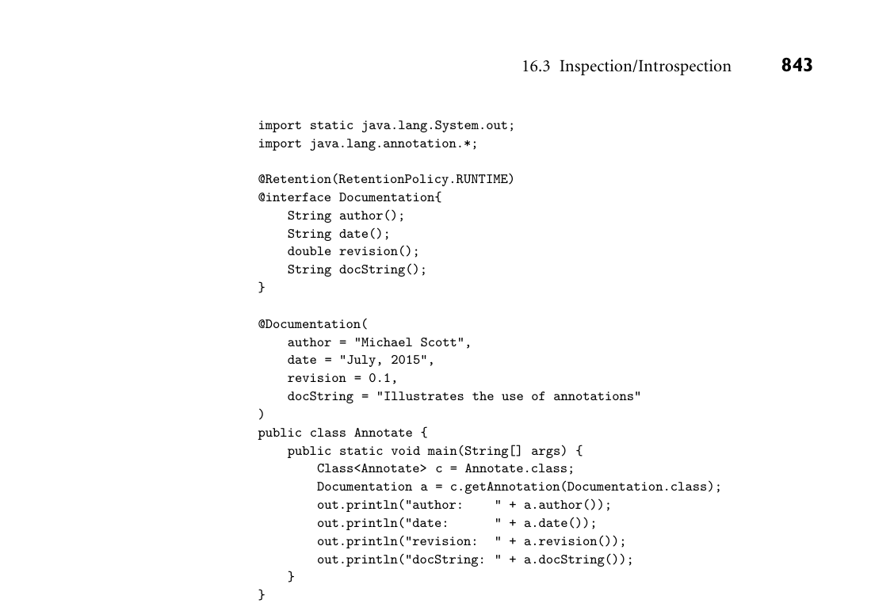
*Figure 16.5  User-defined annotations in Java. Retention is a built-in annotation for annota­ tions. It indicates here that Documentation annotations should be saved in the class fle pro­ duced by the Java compiler, where they will be available to run-time refection.*

earlier javadoc tool, which produces HTML-formatted documentation based on  structured comments in Java source code. The @Documented annotation, when  attached to the declaration of a user-defned annotation, indicates that javadoc  should include the annotation when creating its reports. One can easily imagine  more sophisticated documentation systems that tracked the version history and  bug reports for a program over time.  ■

EXAMPLE 16.28  The various communication technologies in .NET make extensive use of at- Intercomponent  tributes to indicate which methods should be available for remote execution, how  communication  their parameters should be marshalled into messages, which classes need serial­ ization code, and so forth. Automatic tools use these attributes to create appro­ priate stubs for remote communication, as described (in language-neutral terms)  in Section C 13.5.4.  ■

EXAMPLE 16.29  In a similar vein, the .NET LINQ mechanism uses attributes to defne the map- Attributes for LINQ  ping between classes in a user program and tables in a relational database, allow­

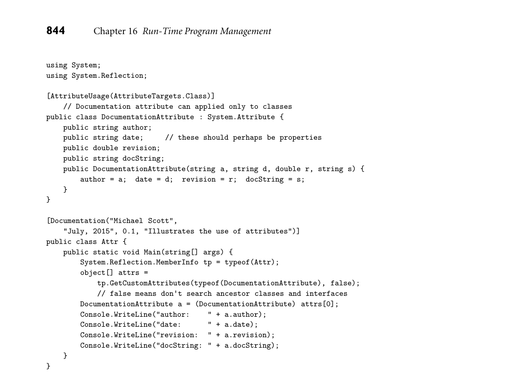
*Figure 16.6  User-defined attributes in C#. This code is roughly equivalent to the Java version in Figure 16.5. AttributeUsage  is a predefned attribute indicating properties of the attribute to whose declaration it is attached.*

ing an automatic tool to generate SQL queries that implement iterators and other  language-level operations.  ■  In an even more ambitious vein, independent tools can be used to modify or  analyze programs based on annotations. One could imagine inserting logging  code into certain annotated methods, or building a testing harness that called  annotated methods with specifed arguments and checked for expected results

EXAMPLE 16.30  (Exercise 16.11). JML, the Java Modeling Language, allows the programmer to  The Java Modeling  specify preconditions, post-conditions, and invariants for classes, methods, and  Language  statements, much like those we considered under “Assertions” in Section 4.1.  JML builds on experience with an earlier multilanguage, multi-institution project  known as Larch. Like javadoc, JML uses structured comments rather than the  newer compiler-supported annotations to express its specifcations, so they are  not automatically included in class fles. A variety of tools can be used, however,

to verify that a program conforms to its specifcations, either statically (where  possible) or at run time (via insertion of semantic checks).  ■  Java 5 introduced a program called apt designed to facilitate the construction  of annotation processing tools. The functionality of this tool was subsequently  integrated into Sun’s Java 6 compiler. Its key enabling feature is a set of APIs  (in javax.annotation.processing) that allow an annotation processor class to  be added to a program in such a way that the compiler will run it at compile  time. Using refection, the class can peruse the static structure of the program  (including annotations and full information on generics) in much the same way  that traditional refection mechanisms allow a running program to peruse its own  types and structure.  ■

EXAMPLE 16.31

Java annotation processors

16.3.2 Symbolic Debugging

Most programmers are familiar with symbolic debuggers: they are built into most  programming language interpreters, virtual machines, and integrated program  development environments. They are also available as stand-alone tools, of which  the best known is probably GNU’s gdb. The  adjective  symbolic refers to a debug­ ger’s understanding of high-level language syntax—the symbols in the original  program. Early debuggers understood assembly language only.

In a typical debugging session, the user starts a program under the control of  the debugger, or attaches the debugger to an already running program. The de­ bugger then allows the user to perform two main kinds of operations. One kind  inspects or modifes program data; the other controls execution: starting, stop­ ping, stepping, and establishing breakpoints and watchpoints. A  breakpoint  speci­ fes that execution should stop if it reaches a particular location in the source code.  A watchpoint specifes that execution should stop if a particular variable is read  or written. Both breakpoints and watchpoints can typically be made conditional,  so that execution stops only if a particular Boolean predicate evaluates to true.

Both data and control operations depend critically on symbolic information. A  symbolic debugger needs to be able both to parse source language expressions and  to relate them to symbols in the original program. In gdb, for example, the com­ mand print a.b[i] needs to parse the to-be-printed expression; it also needs to  recognize that a and i are in scope at the point where the program is currently  stopped, and that b is an array-typed feld whose index range includes the current  value of i. Similarly, the command break 123 if i+j == 3 needs to parse the  expression i+j; it also needs to recognize that there is an executable statement at  line 123 in the current source fle, and that i and j are in scope at that line.

Both data and control operations also depend on the ability to manipulate a  program  from outside:  to stop and  start  it,  and to read and  write its  data.  This   control can be implemented in at least three ways. The easiest occurs in inter­ preters. Since an interpreter has direct access to the program’s symbol table and  is “in the loop” for the execution of every statement, it is a straightforward matter  to move back and forth between the program and the debugger, and to give the  latter access to the former’s data.

The technology of dynamic binary rewriting (as in Dynamo and Pin) can also  be used to implement debugger control [ZRA+08]. This technology is relatively  new, however, and is not widely employed in production debugging tools.

For compiled programs, the third implementation of debugger control is by far  the most common. It depends on support from the operating system. In Unix,  it employs a kernel service known as ptrace. The  ptrace kernel call allows a  debugger to “grab” (attach to) an existing process or to start a process under its  control. The tracing process (the debugger) can intercept any signals sent to the  traced process by the operating system and can read and write its registers and  memory. If the traced process is currently running, the debugger can stop it by  sending it a signal. If it is currently stopped, the debugger can specify the address  at which it should resume execution, and can ask the kernel to run it for a single  instruction (a process known as single stepping) or until it receives another signal.

Perhaps the most mysterious parts of debugging from the user’s perspective are  the mechanisms used to implement breakpoints, watchpoints, and single step­ ping. The default implementation, which works on any modern processor, relies

DESIGN & IMPLEMENTATION

16.6 DWARF  To enable symbolic debugging, the compiler must include symbol table in­ formation in each object fle, in a format the debugger can understand. The  DWARF format, used by many systems (Linux among them) is among the  most versatile available [DWA10, Eag12]. Originally developed by Brian Rus­ sell of Bell Labs in the late 1980s, DWARF is now maintained by the inde­ pendent DWARF Committee, led by Michael Eager. Version 5 is expected to  appear in late 2015.

Unlike many proprietary formats, DWARF is designed to accommodate a  very wide range of (statically typed) programming languages and an equally  wide variety of machine architectures. Among other things, it encodes the  representation of all program types, the names, types, and scopes of all pro­ gram objects (in the broad sense of the term), the layout of all stack frames,  and the mapping from source fles and line numbers to instruction addresses.

Much emphasis has been placed on terse encoding. Program objects are  described hierarchically, in a manner reminiscent of an AST. Character string  names and other repeated elements are captured exactly once, and then ref­ erenced indirectly. Integer constants and references employ a variable-length  encoding, so small values take fewer bits. Perhaps most important, stack lay­ outs and source-to-address mappings are encoded not as explicit tables, but as  fnite automata that generate the tables, line by line. For the tiny gcd program  of Example 1.20, a human-readable representation of the DWARF debugging  information (as produced by Linux’s readelf tool) would fll more than four  full pages of this book. The binary encoding in the object fle takes only 571  bytes.

on the ability to modify the memory space of the traced process—in particular,

EXAMPLE 16.32  the portion containing the program’s code. As an example, suppose the traced  Setting a breakpoint  process is currently stopped, and that before resuming it the debugger wishes to  set a breakpoint at the beginning of function foo. It  does  so  by  replacing  the  frst   instruction of the function’s prologue with a special kind of trap.

Trap instructions are the normal way a process requests a service from the op­ erating system. In this particular case, the kernel interprets the trap as a request to  stop the currently running process and return control to the debugger. To resume  the traced process in the wake of the breakpoint, the debugger puts back the orig­ inal instruction, asks the kernel to single-step the traced process, replaces the in­ struction yet again with a trap (to reenable the breakpoint), and fnally resumes  the process. For a conditional breakpoint, the debugger evaluates the condition’s  predicate when the breakpoint occurs. If the breakpoint is unconditional, or if  the condition is true, the debugger jumps to its command loop and waits for user  input. If the predicate is false, it resumes the traced process automatically and  transparently. If the breakpoint is set in an inner loop, where control will reach it  frequently, but the condition is seldom true, the overhead of switching back and  forth between the traced process and the debugger can be very high.  ■  Some processors provide hardware support to make breakpoints a bit faster.

EXAMPLE 16.33  The x86, for example, has four debugging registers that  can be set  (in kernel  mode)   Hardware breakpoints  to contain an instruction address. If execution reaches that address, the processor  simulates a trap instruction, saving the debugger the need to modify the address  space of the traced process and eliminating the extra kernel calls (and the extra  round trip between the traced process and the debugger) needed to restore the  original instruction, single-step the process, and put the trap back in place. In a  similar vein, many processors, including the x86, can be placed in single-stepping  mode, which simulates a trap after every user-mode instruction. Without such  support, the debugger (or the kernel) must implement single-stepping by repeat­ edly placing a (temporary) breakpoint at the next instruction.  ■  Watchpoints are a bit trickier. By far the easiest implementation depends on

hardware support. Suppose we want to drop into the debugger whenever the  program modifes some variable x. The debugging registers of the x86 and other  Setting a watchpoint  modern processors can be set to simulate a trap whenever the program writes to

EXAMPLE 16.34

x’s address. When the processor lacks such hardware support, or when the user  asks the debugger to set more breakpoints or watchpoints than the hardware can  support, there are several alternatives, none of them attractive. Perhaps the most  obvious is to single step the process repeatedly, checking after each instruction to  see whether x has been modifed. If the processor also lacks a single-step mode,  the debugger will want to place its temporary breakpoints at successive store in­ structions rather than at every instruction (it may be able to skip some of the store  instructions if it can prove they cannot possibly reach the address of x). Alterna­ tively, the debugger can modify the address space of the traced process to make

x’s page unwritable. The process will then take a segmentation fault on every  write to that page, allowing the debugger to intervene. If the write is actually to

x, the debugger jumps to its command loop. Otherwise it performs the write on  the process’s behalf and asks the kernel to resume it.  ■  Unfortunately, the overhead of repeated context switches between the traced  process and the debugger dramatically impacts the performance of software  watchpoints: slowdowns of 1000× are not uncommon. Debuggers based on dy­ namic binary rewriting have the potential to support arbitrary numbers of watch­ points at speeds close to those admitted by hardware watchpoint registers. The  idea is straightforward: the traced program runs as partial execution traces in a  trace cache managed by the debugger. As it generates each trace, the debugger  adds instructions at every store, in-line, to check whether it writes to x’s address  and, if so, to jump back to the command loop.

16.3.3 Performance Analysis

Before placing a debugged program into production use, one often wants to  understand—and if possible improve—its performance. Tools to profle and an­ alyze programs are both numerous and varied—far too much so to even survey  them here. We focus therefore on the run-time technologies, described in this  chapter, that feature prominently in many analysis tools.

EXAMPLE 16.35  Perhaps the simplest way to measure, at least approximately, the amount of  Statistical sampling  time spent in each part of the code is to sample the program counter (PC) pe­ riodically. This approach was exemplifed by the classic prof tool in Unix. By  linking with a special prof library, a program could arrange to receive a periodic  timer signal—once a millisecond, say—in response to which it would increment a  counter associated with the current PC. After execution, the prof post-processor  would correlate the counters with an address map of the program’s code and pro­ duce a statistical summary of the percentage of time spent in each subroutine and  loop.  ■  While simple, prof had some serious limitations. Its results were only approx­ imate, and could not capture fne-grain costs. It also failed to distinguish among

EXAMPLE 16.36  calls to a given routine from multiple locations. If we want to know which of A, B,  Call graph profiling  and C is the biggest contributor to program run time, it is not particularly helpful  to learn that all three of them call D, where most of the time is actually spent. If  we want to know whether it is A’s Ds, B’s Ds, or C’s Ds that  are  so  expensive,  we   can use the (slightly) more recent gprof tool, which relies on compiler support to  instrument procedure prologues. As the instrumented program runs, it logs the  number of times that D is called from each location. The gprof post-processor  then assumes that the total time spent in D can accurately be apportioned among  the call sites according to the relative number of calls. More sophisticated tools  log not only the caller and callee but also the stack backtrace (the contents of the  dynamic chain), allowing them to cope with the case in which D consumes twice  as much time when called from A as it does when called from B or C (see Exer­ cise 16.13).  ■  If our program is underperforming for algorithmic reasons, it may be enough  to know where it is spending the bulk of its time. We can focus our attention on

improving the source code in the places it will matter most. If the program is  underperforming for other reasons, however, we generally need to know why. Is   it cache misses due to poor locality, perhaps? Branch mispredictions? Poor use  of the processor pipeline? Tools to address these and similar questions generally  rely on more extensive instrumentation of the code or on some sort of hardware  support.

EXAMPLE 16.37  As an example of instrumentation, consider the task of identifying basic blocks  Finding basic blocks with  that execute an unusually small number of instructions per cycle. To fnd such  low IPC  blocks we can combine (1) the aggregate time spent in each block (obtained by  statistical sampling), (2) a count of the number of times each block executes (ob­ tained via instrumentation), and (3) static knowledge of the number of instruc­ tions in each block. If basic block i contains ki instructions and executes ni times  during a run of a program, it contributes kini dynamic instructions to that run.   Let N =  be the total number of instructions in the run. If statistical i kini  sampling indicates that block i accounts for xi% of the time in the run and xi is  signifcantly larger than (kini)/N, then something strange is going on—probably  an unusually large number of cache misses.  ■  Most modern processors provide a set of performance counters that can be used

EXAMPLE 16.38  to good effect by performance analysis tools. The Intel Haswell processor, for ex- Haswell performance  ample, has built-in counters for clock ticks (both total and when running) and  counters  instructions executed. It also has four general-purpose counters, which can be  confgured by the kernel to count any of more than 250 different kinds of events,  including branch mispredictions; TLB (address translation) misses; and various  kinds of cache misses, interrupts, executed instructions, and pipeline stalls. Fi­ nally, it has counters for the number of Joules of energy consumed by the pro­ cessor cores, caches, and memory. Unfortunately, performance counters are gen­ erally a scarce resource (one might often wish for many more of them). Their  number, type, and mode of operation varies greatly from processor to processor;  direct access to them is usually available only in kernel mode; and operating sys­ tems do not always export that access to user-level programs with a convenient or  uniform interface. Tools to access the counters and interpret their values are avail­ able from most manufacturers—Intel among them. Portable tools are an active  topic of research.  ■

3CHECK YOUR UNDERSTANDING  27. What  is  reflection? What purposes does it serve?

* Describe an inappropriate use of refection.
* Name an aspect of refection supported by the CLI but not by the JVM.

* Why is refection more diffcult to implement in Java or C# than it is in Perl
  or Ruby?

* What  are  annotations (Java) or attributes (C#)? What are they used for?

* What  are  javadoc, apt, JML, and  LINQ, and what do they have to do with
  annotation?
* Briefy describe three different implementation strategies for a symbolic de­

bugger.

* Explain the difference between breakpoints and watchpoints. Why are watch­

points potentially much more expensive?

* Summarize the capabilities provided by the Unix ptrace mechanism.
* What is the principal difference between the Unix prof and gprof tools?
* For the purposes of performance analysis, summarize the relative strengths
  and limitations of statistical sampling, instrumentation, and hardware perfor­
  mance counters. Explain why statistical sampling and instrumentation might
  proftably be used together.

## 16.4  Summary and Concluding Remarks

We began this chapter by defning a run-time system as the set of libraries, es­ sential to many language implementations, that depend on knowledge of the  compiler or the programs it produces. We distinguished these from “ordinary”  libraries, which require only the arguments they are passed.

We noted that several topics covered elsewhere in the book, including garbage  collection, variable-length argument lists, exception and event handling, corou­ tines and threads, remote procedure calls, transactional memory, and dynamic  linking are often considered the purview of the run-time system. We then turned  to virtual machines, focusing in particular on the Java Virtual Machine (JVM)  and the Common Language Infrastructure (CLI). Under the general heading of  late binding of machine code, we considered just-in-time and dynamic compila­ tion, binary translation and rewriting, and mobile code and sandboxing. Finally,  under the general heading of inspection and introspection, we considered refec­ tion mechanisms, symbolic debugging, and performance analysis.

Through all these topics we have seen a steady increase in complexity over  time. Early Basic interpreters parsed and executed one source statement at a time.  Modern interpreters frst translate their source into a syntax tree. Early Java im­ plementations, while still interpreter-based, relied on a separate source-to-byte­ code compiler. Modern Java implementations, as well as implementations of the  CLI, enhance performance with a just-in-time compiler. For programs that ex­ tend themselves at run time, the CLI allows the source-to-byte-code compiler to  be invoked dynamically as well, as it is in Common Lisp. Recent systems may pro­ fle and reoptimize already-running programs. Similar technology may allow sep­ arate tools to translate from one machine language to another, or to instrument  code for testing, debugging, security, performance analysis, model checking, or

architectural simulation. The CLI provides extensive support for cross-language  interoperability.

Many of these developments have served to blur the line between the compiler  and the run-time system, and between compile-time and run-time operations. It  seems safe to predict that these trends will continue. More and more, programs  will come to be seen not as static artifacts, but as dynamic collections of mal­ leable components, with rich semantic structure amenable to formal analysis and  reconfguration.

## 16.5  Exercises

16.1  Write the formula of Example 15.4 as an expression tree (a syntax tree in  which each operator is represented by an internal node whose children  are its operands). Convert your tree to an expression DAG by merging  identical nodes. Comment on the redundancy in the tree and how it relates  to Figure 15.4.

16.2  We assumed in Example 15.4 and Figure 15.4 that a, b, c, and  s were  all among the frst few local variables of the current method, and could  be pushed onto or popped from the operand stack with a single one-byte  instruction. Suppose that this is not the case: that is, that the push and  pop instructions require three bytes each. How many bytes will now be  required for the code on the left side of Figure 15.4?

Most stack-based languages, Java bytecode and CIL among them, pro­ vide a swap instruction that reverses the order of the top two values on the  stack, and a duplicate instruction that pushes a second copy of the value  currently at top of stack. Show how to use swap and duplicate to elimi­ nate the pop and the pushes of s in the left side of Figure 15.4. Feel free to  exploit the associativity of multiplication. How many instructions is your  new sequence? How many bytes?

16.3  The speculative optimization of Example 16.5 could in principle be stati­ cally performed. Explain why a dynamic compiler might be able to do it  more effectively.

16.4  Perhaps the most common form of run-time instrumentation counts the  the number of times that each basic block is executed. Since basic blocks  are short, adding a load-increment-store instruction sequence to each  block can have a signifcant impact on run time.

We can improve performance by noting that certain blocks imply the  execution of other blocks. In an if... then ... else construct, for example,  execution of either the then part or the else part implies execution of the  conditional test. If we’re smart, we won’t actually have to instrument the  test.

Describe a general technique to minimize the number of blocks that  must be instrumented to allow a post-processor to obtain an accurate

count for each block. (This is a diffcult problem. For hints, see the paper  by Larus and Ball [BL92].)

16.5  Visit software.intel.com/en-us/articles/pintool-downloads and download a  copy of Pin. Use it to create a tool to profle loops. When given a (machine  code) program and its input, the output of the tool should list the number  of times that each loop was encountered when running the program. It  should also give a histogram, for each loop, of the number of iterations  executed.

16.6  Outline mechanisms that might be used by a binary rewriter, without  access to source code, to catch uses of uninitialized variables, “double  deletes,” and uses of deallocated memory (e.g., dangling pointers). Under  what circumstances might you be able to catch memory leaks and out-of­ bounds array accesses?

16.7  Extend the code of Figure 16.4 to print information about  (a) felds  (b) constructors  (c)  nested classes  (d) implemented interfaces  (e)  ancestor classes, and their methods, felds, and constructors  (f)  exceptions thrown by methods  (g) generic type parameters

16.8  Repeat the previous exercise in C#. Add information about parameter  names and generic instances.

16.9  Write an interactive tool that accepts keyboard commands to load speci­ fed class fles, create instances of their classes, invoke their methods, and  read and write their felds. Feel free to limit keyboard input to values of  built-in types, and to work only in the global scope. Based on your expe­ rience, comment on the feasibility of writing a command-line interpreter  for Java, similar to those commonly used for Lisp, Prolog, or the various  scripting languages.

16.10  In Java, if the concrete type of p is Foo, p.getClass() and Foo.class  will return the same thing. Explain why a similar equivalence could not  be guaranteed to hold in Ruby, Python, or JavaScript. For hints, see Sec­ tion 14.4.4.

16.11  Design a “test harness” system based on Java annotations. The user should  be able to attach to a method an annotation that specifes parameters  to be passed to a test run of the method, and values expected to be re­ turned. For simplicity, you may assume that parameters and return val­ ues will all be strings or instances of built-in types. Using the annota­ tion processing facility of Java 6, you should automatically generate a new  method, test() in any class that has methods with @Test annotations.

This method should call the annotated methods with the specifed param­ eters, test the return values, and report any discrepancies. It should also  call the test methods of any nested classes. Be sure to include a mech­ anism to invoke the test method of every top-level class. For an extra  challenge, devise a way to specify multiple tests of a single method, and a  way to test exceptions thrown, in addition to values returned.

16.12  C++ provides a typeid operator that can be used to query the concrete  type of a pointer or reference variable:

if (typeid(*p) == typeid(my_derived_type)) ...

Values returned by typeid can be compared for equality but not assigned.  They also support a name() method that returns an (implementation­ dependent) character string name for the type. Give an example of a pro­ gram fragment in which these mechanisms might reasonably be used.

Unlike more extensive refection mechanisms, typeid can be applied  only to (instances of) classes with at least one virtual method. Give a plau­ sible explanation for this restriction.

16.13  Suppose we wish, as described at the end of Example 16.36, to accurately  attribute sampled time to the various contexts in which a subroutine is  called. Perhaps the most straightforward approach would be to log not  only the current PC but also the stack backtrace—the contents of the dy­ namic chain—on every timer interrupt. Unfortunately, this can dramat­ ically increase profling overhead. Suggest an equivalent but cheaper im­ plementation.

16.14–16.17 In More Depth.

## 16.6  Explorations

16.18  Learn about the Java security policy mechanism. What aspects of program  behavior can the programmer enable/proscribe? How are such policies  enforced? What is the relationship (if any) between security policies and  the verifcation process described in Sidebar 16.3?

16.19  Learn about taint mode in Perl and Ruby. How does it compare to sand­ box creation via binary rewriting, as described in Sidebar 16.5? What sorts  of security problems does it catch? What sorts of problems does it not  catch?

16.20  Learn about proof-carrying code, a technique in which the supplier of mo­ bile code includes a proof of its safety, and the user simply verifes the  proof, rather than regenerating it (start with the work of Necula [Nec97]).  How does this technique compare to other forms of sandboxing? What  properties can it guarantee?

16.21  Investigate the MetaObject Protocol (MOP), which underlies the Common  Lisp Object System. How does it compare to the refection mechanisms of  Java and C#? What does it allow you to do that these other languages do  not?

16.22  When using a symbolic debugger and moving through a program with  breakpoints, one often discovers that one has gone “too far,” and must start  the program over from the beginning. This may mean losing all the effort  that had been put into reaching a particular point. Consider what it would  take to be able to run the program not only forward but backward as well.  Such a reverse execution facility might allow the user to narrow in on the  source of bugs much as one narrows the range in binary search. Consider  both the loss of information that happens when data is overridden and the  nondeterminism that arises in parallel and event-driven programs.

16.23  Download and experiment with one of the several available packages  for performance counter sampling in Linux (try sourceforge.net/projects/  perfctr/, perfmon2.sourceforge.net/, or  www.intel.com/software/pcm). What  do these packages allow you to measure? How might you use the informa­ tion? (Note: you may need to install a kernel patch to make the program  counters available to user-level code.)

16.24–16.25 In More Depth.

## 16.7  Bibliographic Notes

Aycock [Ayc03] surveys the history of just-in-time compilation. Documentation  on the HotSpot compiler and JVM can be found at Oracle’s web site: www.oracle.  com/technetwork/articles/javase/index-jsp-136373.html. The  JVM  specifcation  is   by Lindholm et al. [LYBB14]. Sources of information on the CLI include the  ECMA standard [Int12a, MR04] and the .NET pages at msdn.microsoft.com.

Arnold et al. [AFG+05] provide an extensive survey of adaptive optimization  techniques for programs on virtual machines. Deutsch and Schiffman [DS84]  describe the ParcPlace Smalltalk virtual machine, which pioneered such mecha­ nisms as just-in-time compilation and the caching of JIT-compiled machine code.  Various articles discuss the binary translation technology of Apple’s 68K emula­ tor [Tho95], DEC’s FX!32 [HH97b], and its earlier VEST and mx [SCK+93].

Probably the best source of information on binary rewriting is the text by  Hazelwood [Haz11]. The original papers on Dynamo, Atom, Pin, and QEMU  are by Bala et al. [BDB00], Srivastava and Eustace [SE94], Luk et al. [LCM+05],  and Bellard [Bel05], respectively. Duesterwald [Due05] surveys issues in the de­ sign of a dynamic binary optimizer, drawing on her experience with the Dynamo  project. Early work on sandboxing via binary rewriting is reported by Wahbe et  al. [WLAG93].

The DWARF standard is available from dwarfstd.org [DWA10]; Eager pro­ vides a gentler introduction [Eag12]. Ball and Larus [BL92] describe the min­ imal instrumentation required to profle the execution of basic blocks. Zhao  et al. [ZRA+08] describe the use of dynamic instrumentation (based on Dy­ namoRIO) to implement watchpoints effciently.  Martonosi et al. [MGA92]  describe a performance analysis tool that builds on the idea outlined in Exam­ ple 16.37.

17 Code Improvement

In Chapter 15 we discussed the generation, assembly, and linking of target  code in the back end of a compiler. The techniques we presented led to correct  but highly suboptimal code: there were many redundant computations, and in­ effcient use of the registers, multiple functional units, and cache of a modern  microprocessor. This chapter takes a look at code improvement: the  phases  of   compilation devoted to generating good (fast) code. As noted in Section 1.6.4,  code improvement is often referred to as optimization, though it seldom makes  anything optimal in any absolute sense.

Our study will consider simple peephole optimization, which “cleans up” gen­ erated target code within a very small instruction window; local optimization,  which generates near-optimal code for individual basic blocks; and global opti­ mization, which performs more aggressive code improvement at the level of entire  subroutines. We will not cover interprocedural improvement; interested readers  are referred to other texts (see the Bibliographic Notes at the end of the chapter).  Moreover, even for the subjects we cover, our intent will be more to “demystify”  code improvement than to describe the process in detail. Much of the discussion  will revolve around the successive refnement of code for a single subroutine. This  extended example will allow us to illustrate the effect of several key forms of code  improvement without dwelling on the details of how they are achieved.

IN MORE DEPTH

Chapter 17 can be found in its entirety on the companion site.

