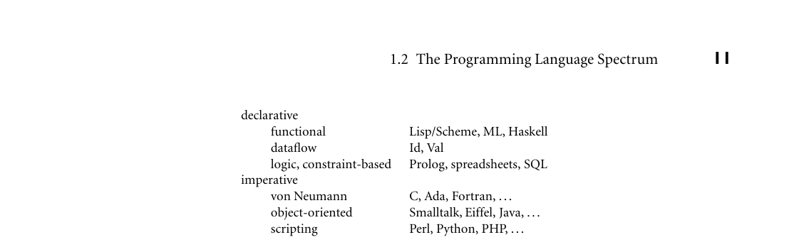
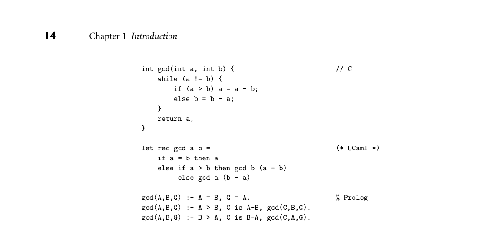
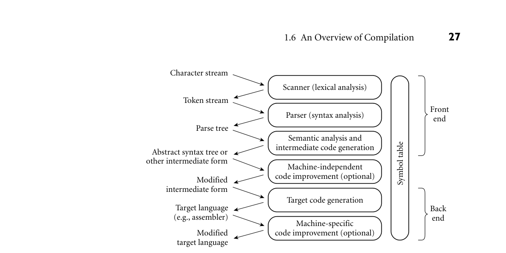
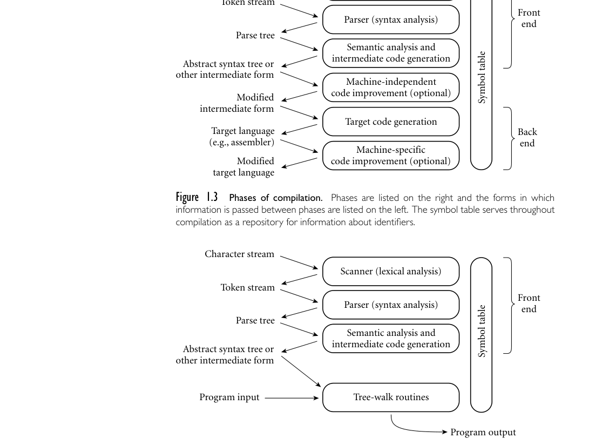
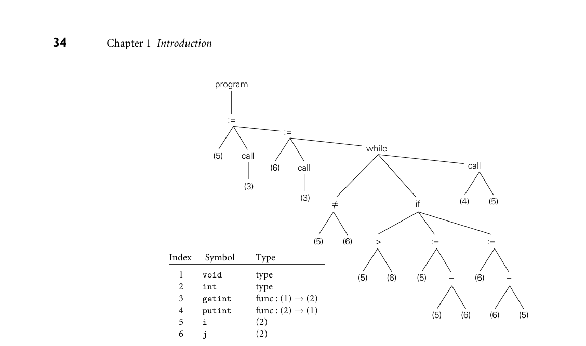
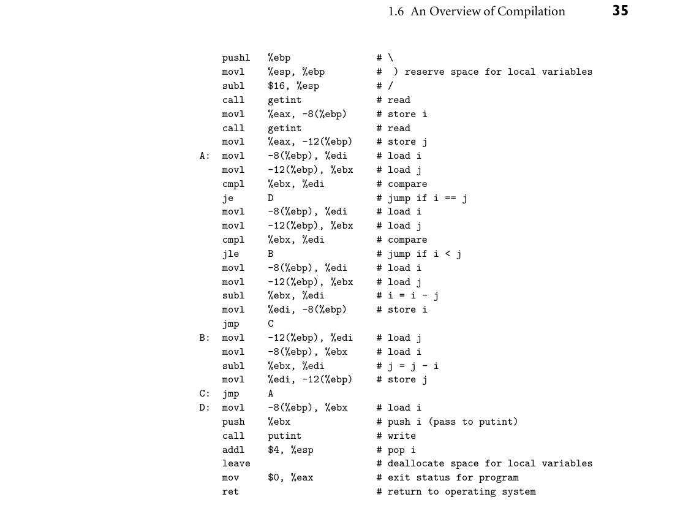

# Chapter 1: Introduction

1 Introduction

The first electronic computers were monstrous contraptions, filling several rooms, consuming as much electricity as a good-size factory, and costing millions of 1940s dollars (but with much less computing power than even the sim- plest modern cell phone). The programmers who used these machines believed that the computer’s time was more valuable than theirs. They programmed in machine language. Machine language is the sequence of bits that directly controls a processor, causing it to add, compare, move data from one place to another, and so forth at appropriate times. Specifying programs at this level of detail is an enormously tedious task. The following program calculates the greatest common EXAMPLE 1.1

GCD program in x86 machine language divisor (GCD) of two integers, using Euclid’s algorithm. It is written in machine language, expressed here as hexadecimal (base 16) numbers, for the x86 instruc- tion set.

55 89 e5 53 83 ec 04 83 e4 f0 e8 31 00 00 00 89 c3 e8 2a 00 00 00 39 c3 74 10 8d b6 00 00 00 00 39 c3 7e 13 29 c3 39 c3 75 f6 89 1c 24 e8 6e 00 00 00 8b 5d fc c9 c3 29 d8 eb eb 90 ■

As people began to write larger programs, it quickly became apparent that a less error-prone notation was required. Assembly languages were invented to al- low operations to be expressed with mnemonic abbreviations. Our GCD program EXAMPLE 1.2

GCD program in x86 assembler looks like this in x86 assembly language:

jle D subl %eax, %ebx B: cmpl %eax, %ebx jne A C: movl %ebx, (%esp) call putint movl -4(%ebp), %ebx leave ret D: subl %ebx, %eax jmp B ■

```
pushl
%ebp
movl
%esp, %ebp
pushl
%ebx
subl
$4, %esp
andl
$-16, %esp
call
getint
movl
%eax, %ebx
call
getint
cmpl
%eax, %ebx
je
C
A:
cmpl
%eax, %ebx
```

Assembly languages were originally designed with a one-to-one correspon- dence between mnemonics and machine language instructions, as shown in this example.1 Translating from mnemonics to machine language became the job of a systems program known as an assembler. Assemblers were eventually aug- mented with elaborate “macro expansion” facilities to permit programmers to define parameterized abbreviations for common sequences of instructions. The correspondence between assembly language and machine language remained ob- vious and explicit, however. Programming continued to be a machine-centered enterprise: each different kind of computer had to be programmed in its own as- sembly language, and programmers thought in terms of the instructions that the machine would actually execute. As computers evolved, and as competing designs developed, it became increas- ingly frustrating to have to rewrite programs for every new machine. It also be- came increasingly difficult for human beings to keep track of the wealth of de- tail in large assembly language programs. People began to wish for a machine- independent language, particularly one in which numerical computations (the most common type of program in those days) could be expressed in something more closely resembling mathematical formulae. These wishes led in the mid- 1950s to the development of the original dialect of Fortran, the first arguably high-level programming language. Other high-level languages soon followed, no- tably Lisp and Algol. Translating from a high-level language to assembly or machine language is the job of a systems program known as a compiler.2 Compilers are substantially more complicated than assemblers because the one-to-one correspondence between source and target operations no longer exists when the source is a high-level language. Fortran was slow to catch on at first, because human programmers, with some effort, could almost always write assembly language programs that would run faster than what a compiler could produce. Over time, however, the performance gap has narrowed, and eventually reversed. Increases in hardware complexity (due to pipelining, multiple functional units, etc.) and continuing improvements in compiler technology have led to a situation in which a state- of-the-art compiler will usually generate better code than a human being will. Even in cases in which human beings can do better, increases in computer speed and program size have made it increasingly important to economize on program- mer effort, not only in the original construction of programs, but in subsequent

1 The 22 lines of assembly code in the example are encoded in varying numbers of bytes in ma- chine language. The three cmp (compare) instructions, for example, all happen to have the same register operands, and are encoded in the two-byte sequence (39 c3). The four mov (move) in- structions have different operands and lengths, and begin with 89 or 8b. The chosen syntax is that of the GNU gcc compiler suite, in which results overwrite the last operand, not the first.

2 High-level languages may also be interpreted directly, without the translation step. We will return to this option in Section 1.4. It is the principal way in which scripting languages like Python and JavaScript are implemented.

program maintenance—enhancement and correction. Labor costs now heavily outweigh the cost of computing hardware.

## 1.1 The Art of Language Design

Today there are thousands of high-level programming languages, and new ones continue to emerge. Why are there so many? There are several possible answers:

Evolution. Computer science is a young discipline; we’re constantly finding bet- ter ways to do things. The late 1960s and early 1970s saw a revolution in “structured programming,” in which the goto-based control flow of languages like Fortran, Cobol, and Basic3 gave way to while loops, case (switch) statements, and similar higher-level constructs. In the late 1980s the nested block structure of languages like Algol, Pascal, and Ada began to give way to the object-oriented structure of languages like Smalltalk, C++, Eiffel, and—a decade later—Java and C#. More recently, scripting languages like Python and Ruby have begun to displace more traditional compiled languages, at least for rapid development. Special Purposes. Some languages were designed for a specific problem domain. The various Lisp dialects are good for manipulating symbolic data and com- plex data structures. Icon and Awk are good for manipulating character strings. C is good for low-level systems programming. Prolog is good for rea- soning about logical relationships among data. Each of these languages can be used successfully for a wider range of tasks, but the emphasis is clearly on the specialty. Personal Preference. Different people like different things. Much of the parochi- alism of programming is simply a matter of taste. Some people love the terse- ness of C; some hate it. Some people find it natural to think recursively; others prefer iteration. Some people like to work with pointers; others prefer the im- plicit dereferencing of Lisp, Java, and ML. The strength and variety of personal preference make it unlikely that anyone will ever develop a universally accept- able programming language.

Of course, some languages are more successful than others. Of the many that have been designed, only a few dozen are widely used. What makes a language successful? Again there are several answers:

Expressive Power. One commonly hears arguments that one language is more “powerful” than another, though in a formal mathematical sense they are all

3 The names of these languages are sometimes written entirely in uppercase letters and sometimes in mixed case. For consistency’s sake, I adopt the convention in this book of using mixed case for languages whose names are pronounced as words (e.g., Fortran, Cobol, Basic), and uppercase for those pronounced as a series of letters (e.g., APL, PL/I, ML).

Turing complete—each can be used, if awkwardly, to implement arbitrary algo- rithms. Still, language features clearly have a huge impact on the programmer’s ability to write clear, concise, and maintainable code, especially for very large systems. There is no comparison, for example, between early versions of Basic on the one hand, and C++ on the other. The factors that contribute to ex- pressive power—abstraction facilities in particular—are a major focus of this book. Ease of Use for the Novice. While it is easy to pick on Basic, one cannot deny its success. Part of that success was due to its very low “learning curve.” Pascal was taught for many years in introductory programming language courses because, at least in comparison to other “serious” languages, it was compact and easy to learn. Shortly after the turn of the century, Java came to play a similar role; though substantially more complex than Pascal, it is simpler than, say, C++. In a renewed quest for simplicity, some introductory courses in recent years have turned to scripting languages like Python. Ease of Implementation. In addition to its low learning curve, Basic was success- ful because it could be implemented easily on tiny machines, with limited re- sources. Forth had a small but dedicated following for similar reasons. Ar- guably the single most important factor in the success of Pascal was that its de- signer, Niklaus Wirth, developed a simple, portable implementation of the lan- guage, and shipped it free to universities all over the world (see Example 1.15).4 The Java and Python designers took similar steps to make their language avail- able for free to almost anyone who wants it. Standardization. Almost every widely used language has an official international standard or (in the case of several scripting languages) a single canonical im- plementation; and in the latter case the canonical implementation is almost invariably written in a language that has a standard. Standardization—of both the language and a broad set of libraries—is the only truly effective way to ensure the portability of code across platforms. The relatively impover- ished standard for Pascal, which was missing several features considered essen- tial by many programmers (separate compilation, strings, static initialization, random-access I/O), was at least partially responsible for the language’s drop from favor in the 1980s. Many of these features were implemented in different ways by different vendors. Open Source. Most programming languages today have at least one open-source compiler or interpreter, but some languages—C in particular—are much more closely associated than others with freely distributed, peer-reviewed, community-supported computing. C was originally developed in the early

4 Niklaus Wirth (1934–), Professor Emeritus of Informatics at ETH in Zürich, Switzerland, is responsible for a long line of influential languages, including Euler, Algol W, Pascal, Modula, Modula-2, and Oberon. Among other things, his languages introduced the notions of enumera- tion, subrange, and set types, and unified the concepts of records (structs) and variants (unions). He received the annual ACM Turing Award, computing’s highest honor, in 1984.

1970s by Dennis Ritchie and Ken Thompson at Bell Labs,5 in conjunction with the design of the original Unix operating system. Over the years Unix evolved into the world’s most portable operating system—the OS of choice for academic computer science—and C was closely associated with it. With the standardization of C, the language became available on an enormous variety of additional platforms. Linux, the leading open-source operating system, is written in C. As of June 2015, C and its descendants account for well over half of a variety of language-related on-line content, including web page references, book sales, employment listings, and open-source repository updates. Excellent Compilers. Fortran owes much of its success to extremely good com- pilers. In part this is a matter of historical accident. Fortran has been around longer than anything else, and companies have invested huge amounts of time and money in making compilers that generate very fast code. It is also a matter of language design, however: Fortran dialects prior to Fortran 90 lacked recur- sion and pointers, features that greatly complicate the task of generating fast code (at least for programs that can be written in a reasonable fashion with- out them!). In a similar vein, some languages (e.g., Common Lisp) have been successful in part because they have compilers and supporting tools that do an unusually good job of helping the programmer manage very large projects. Economics, Patronage, and Inertia. Finally, there are factors other than technical merit that greatly influence success. The backing of a powerful sponsor is one. PL/I, at least to first approximation, owed its life to IBM. Cobol and Ada owe their life to the U. S. Department of Defense. C# owes its life to Microsoft. In recent years, Objective-C has enjoyed an enormous surge in popularity as the official language for iPhone and iPad apps. At the other end of the life cycle, some languages remain widely used long after “better” alternatives are avail- able, because of a huge base of installed software and programmer expertise, which would cost too much to replace. Much of the world’s financial infras- tructure, for example, still functions primarily in Cobol.

Clearly no single factor determines whether a language is “good.” As we study programming languages, we shall need to consider issues from several points of view. In particular, we shall need to consider the viewpoints of both the pro- grammer and the language implementor. Sometimes these points of view will be in harmony, as in the desire for execution speed. Often, however, there will be conflicts and tradeoffs, as the conceptual appeal of a feature is balanced against the cost of its implementation. The tradeoff becomes particularly thorny when the implementation imposes costs not only on programs that use the feature, but also on programs that do not.

5 Ken Thompson (1943–) led the team that developed Unix. He also designed the B programming language, a child of BCPL and the parent of C. Dennis Ritchie (1941–2011) was the principal force behind the development of C itself. Thompson and Ritchie together formed the core of an incredibly productive and influential group. They shared the ACM Turing Award in 1983.

In the early days of computing the implementor’s viewpoint was predominant. Programming languages evolved as a means of telling a computer what to do. For programmers, however, a language is more aptly defined as a means of expressing algorithms. Just as natural languages constrain exposition and discourse, so pro- gramming languages constrain what can and cannot easily be expressed, and have both profound and subtle influence over what the programmer can think. Donald Knuth has suggested that programming be regarded as the art of telling another human being what one wants the computer to do [Knu84].6 This definition per- haps strikes the best sort of compromise. It acknowledges that both conceptual clarity and implementation efficiency are fundamental concerns. This book at- tempts to capture this spirit of compromise, by simultaneously considering the conceptual and implementation aspects of each of the topics it covers.

DESIGN & IMPLEMENTATION

## 1.1 Introduction Throughout the book, sidebars like this one will highlight the interplay of language design and language implementation. Among other things, we will consider

Cases (such as those mentioned in this section) in which ease or difficulty of implementation significantly affected the success of a language Language features that many designers now believe were mistakes, at least in part because of implementation difficulties Potentially useful features omitted from some languages because of concern that they might be too difficult or slow to implement Language features introduced at least in part to facilitate efficient or elegant implementations Cases in which a machine architecture makes reasonable features unreason- ably expensive Various other tradeoffs in which implementation plays a significant role

A complete list of sidebars appears in Appendix B.

6 Donald E. Knuth (1938–), Professor Emeritus at Stanford University and one of the foremost figures in the design and analysis of algorithms, is also widely known as the inventor of the TEX typesetting system (with which this book was produced) and of the literate programming method- ology with which TEX was constructed. His multivolume The Art of Computer Programming has an honored place on the shelf of most professional computer scientists. He received the ACM Turing Award in 1974.


*Figure 1.1 Classification of programming languages. Note that the categories are fuzzy, and open to debate. In particular, it is possible for a functional language to be object-oriented, and many authors do not consider functional programming to be declarative. 1.2 The Programming Language Spectrum*

The many existing languages can be classified into families based on their model EXAMPLE 1.3

Classification of programming languages of computation. Figure 1.1 shows a common set of families. The top-level di- vision distinguishes between the declarative languages, in which the focus is on what the computer is to do, and the imperative languages, in which the focus is on how the computer should do it. ■ Declarative languages are in some sense “higher level”; they are more in tune with the programmer’s point of view, and less with the implementor’s point of view. Imperative languages predominate, however, mainly for performance rea- sons. There is a tension in the design of declarative languages between the desire to get away from “irrelevant” implementation details and the need to remain close enough to the details to at least control the outline of an algorithm. The design of efficient algorithms, after all, is what much of computer science is about. It is not yet clear to what extent, and in what problem domains, we can expect compilers to discover good algorithms for problems stated at a very high level of abstrac- tion. In any domain in which the compiler cannot find a good algorithm, the programmer needs to be able to specify one explicitly. Within the declarative and imperative families, there are several important subfamilies:

Functional languages employ a computational model based on the recursive definition of functions. They take their inspiration from the lambda calculus, a formal computational model developed by Alonzo Church in the 1930s. In essence, a program is considered a function from inputs to outputs, defined in terms of simpler functions through a process of refinement. Languages in this category include Lisp, ML, and Haskell. Dataflow languages model computation as the flow of information (tokens) among primitive functional nodes. They provide an inherently parallel model: nodes are triggered by the arrival of input tokens, and can operate concur- rently. Id and Val are examples of dataflow languages. Sisal, a descendant of Val, is more often described as a functional language.

Logic or constraint-based languages take their inspiration from predicate logic. They model computation as an attempt to find values that satisfy certain spec- ified relationships, using goal-directed search through a list of logical rules. Prolog is the best-known logic language. The term is also sometimes applied to the SQL database language, the XSLT scripting language, and programmable aspects of spreadsheets such as Excel and its predecessors. The von Neumann languages are probably the most familiar and widely used. They include Fortran, Ada, C, and all of the others in which the basic means of computation is the modification of variables.7 Whereas functional languages are based on expressions that have values, von Neumann languages are based on statements (assignments in particular) that influence subsequent computa- tion via the side effect of changing the value of memory. Object-oriented languages trace their roots to Simula 67. Most are closely related to the von Neumann languages, but have a much more structured and distributed model of both memory and computation. Rather than pic- ture computation as the operation of a monolithic processor on a monolithic memory, object-oriented languages picture it as interactions among semi- independent objects, each of which has both its own internal state and sub- routines to manage that state. Smalltalk is the purest of the object-oriented languages; C++ and Java are probably the most widely used. It is also possi- ble to devise object-oriented functional languages (the best known of these are CLOS [Kee89] and OCaml), but they tend to have a strong imperative flavor. Scripting languages are distinguished by their emphasis on coordinating or “gluing together” components drawn from some surrounding context. Sev- eral scripting languages were originally developed for specific purposes: csh and bash are the input languages of job control (shell) programs; PHP and JavaScript are primarily intended for the generation of dynamic web content; Lua is widely used to control computer games. Other languages, including Perl, Python, and Ruby, are more deliberately general purpose. Most place an emphasis on rapid prototyping, with a bias toward ease of expression over speed of execution.

One might suspect that concurrent (parallel) languages would form a separate family (and indeed this book devotes a chapter to such languages), but the dis- tinction between concurrent and sequential execution is mostly independent of the classifications above. Most concurrent programs are currently written using special library packages or compilers in conjunction with a sequential language such as Fortran or C. A few widely used languages, including Java, C#, and Ada, have explicitly concurrent features. Researchers are investigating concurrency in each of the language families mentioned here.

7 John von Neumann (1903–1957) was a mathematician and computer pioneer who helped to develop the concept of stored program computing, which underlies most computer hardware. In a stored program computer, both programs and data are represented as bits in memory, which the processor repeatedly fetches, interprets, and updates.

As a simple example of the contrast among language families, consider the greatest common divisor (GCD) problem introduced at the beginning of this chapter. The choice among, say, von Neumann, functional, or logic program- ming for this problem influences not only the appearance of the code, but how the programmer thinks. The von Neumann algorithm version of the algorithm is EXAMPLE 1.4

GCD function in C very imperative:

To compute the gcd of a and b, check to see if a and b are equal. If so, print one of them and stop. Otherwise, replace the larger one by their difference and repeat.

C code for this algorithm appears at the top of Figure 1.2. ■ In a functional language, the emphasis is on the mathematical relationship of EXAMPLE 1.5

GCD function in OCaml outputs to inputs:

The gcd of a and b is defined to be (1) a when a and b are equal, (2) the gcd of b and a - b when a > b, and (3) the gcd of a and b - a when b > a. To compute the gcd of a given pair of numbers, expand and simplify this definition until it terminates.

An OCaml version of this algorithm appears in the middle of Figure 1.2. The key- word let introduces a definition; rec indicates that it is permitted to be recursive (self-referential); arguments for a function come between the name (in this case, gcd) and the equals sign. ■ In a logic language, the programmer specifies a set of axioms and proof rules EXAMPLE 1.6

GCD rules in Prolog that allows the system to find desired values:

The proposition gcd(a, b, g) is true if (1) a, b, and g are all equal; (2) a is greater than b and there exists a number c such that c is a - b and gcd(c, b, g) is true; or (3) a is less than b and there exists a number c such that c is b - a and gcd(c, a, g) is true. To compute the gcd of a given pair of numbers, search for a number g (and various numbers c) for which these rules allow one to prove that gcd(a, b, g) is true.

A Prolog version of this algorithm appears at the bottom of Figure 1.2. It may be easier to understand if one reads “if” for :- and “and” for commas. ■ It should be emphasized that the distinctions among language families are not clear-cut. The division between the von Neumann and object-oriented languages, for example, is often very fuzzy, and many scripting languages are also object- oriented. Most of the functional and logic languages include some imperative features, and several recent imperative languages have added functional features. The descriptions above are meant to capture the general flavor of the families, without providing formal definitions. Imperative languages—von Neumann and object-oriented—receive the bulk of the attention in this book. Many issues cut across family lines, however, and the interested reader will discover much that is applicable to alternative compu- tational models in most chapters of the book. Chapters 11 through 14 contain additional material on functional, logic, concurrent, and scripting languages.


*Figure 1.2 The GCD algorithm in C (top), OCaml (middle), and Prolog (bottom). All three versions assume (without checking) that their inputs are positive integers. 1.3 Why Study Programming Languages?*

Programming languages are central to computer science, and to the typical com- puter science curriculum. Like most car owners, students who have become fa- miliar with one or more high-level languages are generally curious to learn about other languages, and to know what is going on “under the hood.” Learning about languages is interesting. It’s also practical. For one thing, a good understanding of language design and implementation can help one choose the most appropriate language for any given task. Most lan- guages are better for some things than for others. Few programmers are likely to choose Fortran for symbolic computing or string processing, but other choices are not nearly so clear-cut. Should one choose C, C++, or C# for systems pro- gramming? Fortran or C for scientific computations? PHP or Ruby for a web- based application? Ada or C for embedded systems? Visual Basic or Java for a graphical user interface? This book should help equip you to make such deci- sions. Similarly, this book should make it easier to learn new languages. Many lan- guages are closely related. Java and C# are easier to learn if you already know C++; Common Lisp if you already know Scheme; Haskell if you already know ML. More importantly, there are basic concepts that underlie all programming languages. Most of these concepts are the subject of chapters in this book: types, control (iteration, selection, recursion, nondeterminacy, concurrency), abstrac- tion, and naming. Thinking in terms of these concepts makes it easier to assim- ilate the syntax (form) and semantics (meaning) of new languages, compared to picking them up in a vacuum. The situation is analogous to what happens in nat-

ural languages: a good knowledge of grammatical forms makes it easier to learn a foreign language. Whatever language you learn, understanding the decisions that went into its design and implementation will help you use it better. This book should help you:

Understand obscure features. The typical C++ programmer rarely uses unions, multiple inheritance, variable numbers of arguments, or the .* operator. (If you don’t know what these are, don’t worry!) Just as it simplifies the assimi- lation of new languages, an understanding of basic concepts makes it easier to understand these features when you look up the details in the manual. Choose among alternative ways to express things, based on a knowledge of imple- mentation costs. In C++, for example, programmers may need to avoid un- necessary temporary variables, and use copy constructors whenever possible, to minimize the cost of initialization. In Java they may wish to use Executor objects rather than explicit thread creation. With certain (poor) compilers, they may need to adopt special programming idioms to get the fastest code: pointers for array traversal; x*x instead of x**2. In any language, they need to be able to evaluate the tradeoffs among alternative implementations of ab- stractions—for example between computation and table lookup for functions like bit set cardinality, which can be implemented either way. Make good use of debuggers, assemblers, linkers, and related tools. In general, the high-level language programmer should not need to bother with implementa- tion details. There are times, however, when an understanding of those details is virtually essential. The tenacious bug or unusual system-building problem may be dramatically easier to handle if one is willing to peek at the bits. Simulate useful features in languages that lack them. Certain very useful features are missing in older languages, but can be emulated by following a deliberate (if unenforced) programming style. In older dialects of Fortran, for exam- ple, programmers familiar with modern control constructs can use comments and self-discipline to write well-structured code. Similarly, in languages with poor abstraction facilities, comments and naming conventions can help imi- tate modular structure, and the extremely useful iterators of Clu, C#, Python, and Ruby (which we will study in Section 6.5.3) can be imitated with subrou- tines and static variables. Make better use of language technology wherever it appears. Most programmers will never design or implement a conventional programming language, but most will need language technology for other programming tasks. The typ- ical personal computer contains files in dozens of structured formats, en- compassing word processing, spreadsheets, presentations, raster and vector graphics, music, video, databases, and a wide variety of other application do- mains. Web content is increasingly represented in XML, a text-based format designed for easy manipulation in the XSLT scripting language (discussed in Section C 14.3.5). Code to parse, analyze, generate, optimize, and otherwise

manipulate structured data can thus be found in almost any sophisticated pro- gram, and all of this code is based on language technology. Programmers with a strong grasp of this technology will be in a better position to write well- structured, maintainable tools. In a similar vein, most tools themselves can be customized, via start-up con- figuration files, command-line arguments, input commands, or built-in exten- sion languages (considered in more detail in Chapter 14). My home directory holds more than 250 separate configuration (“preference”) files. My personal configuration files for the emacs text editor comprise more than 1200 lines of Lisp code. The user of almost any sophisticated program today will need to make good use of configuration or extension languages. The designers of such a program will need either to adopt (and adapt) some existing extension language, or to invent new notation of their own. Programmers with a strong grasp of language theory will be in a better position to design elegant, well- structured notation that meets the needs of current users and facilitates future development.

Finally, this book should help prepare you for further study in language de- sign or implementation, should you be so inclined. It will also equip you to un- derstand the interactions of languages with operating systems and architectures, should those areas draw your interest.

3CHECK YOUR UNDERSTANDING 1. What is the difference between machine language and assembly language? 2. In what way(s) are high-level languages an improvement on assembly lan- guage? Are there circumstances in which it still make sense to program in assembler? 3. Why are there so many programming languages?

  4.
  What makes a programming language successful?
  5.
  Name three languages in each of the following categories: von Neumann,
  functional, object-oriented. Name two logic languages. Name two widely
  used concurrent languages.

  6.
  What distinguishes declarative languages from imperative languages?
  7.
  What organization spearheaded the development of Ada?

  8.
  What is generally considered the first high-level programming language?
  9.
  What was the first functional language?
* Why aren’t concurrent languages listed as a separate family in Figure 1.1?

## 1.4 Compilation and Interpretation

At the highest level of abstraction, the compilation and execution of a program in EXAMPLE 1.7

Pure compilation a high-level language look something like this:

Source program

Compiler

Input Target program Output

The compiler translates the high-level source program into an equivalent target program (typically in machine language), and then goes away. At some arbitrary later time, the user tells the operating system to run the target program. The com- piler is the locus of control during compilation; the target program is the locus of control during its own execution. The compiler is itself a machine language pro- gram, presumably created by compiling some other high-level program. When written to a file in a format understood by the operating system, machine lan- guage is commonly known as object code. ■ An alternative style of implementation for high-level languages is known as EXAMPLE 1.8

Pure interpretation interpretation:

Interpreter Source program

Output

Input

Unlike a compiler, an interpreter stays around for the execution of the appli- cation. In fact, the interpreter is the locus of control during that execution. In effect, the interpreter implements a virtual machine whose “machine language” is the high-level programming language. The interpreter reads statements in that language more or less one at a time, executing them as it goes along. ■ In general, interpretation leads to greater flexibility and better diagnostics (er- ror messages) than does compilation. Because the source code is being executed directly, the interpreter can include an excellent source-level debugger. It can also cope with languages in which fundamental characteristics of the program, such as the sizes and types of variables, or even which names refer to which variables, can depend on the input data. Some language features are almost impossible to im- plement without interpretation: in Lisp and Prolog, for example, a program can write new pieces of itself and execute them on the fly. (Several scripting languages also provide this capability.) Delaying decisions about program implementation until run time is known as late binding; we will discuss it at greater length in Section 3.1.

Compilation, by contrast, generally leads to better performance. In general, a decision made at compile time is a decision that does not need to be made at run time. For example, if the compiler can guarantee that variable x will always lie at location 49378, it can generate machine language instructions that access this location whenever the source program refers to x. By contrast, an interpreter may need to look x up in a table every time it is accessed, in order to find its loca- tion. Since the (final version of a) program is compiled only once, but generally executed many times, the savings can be substantial, particularly if the interpreter is doing unnecessary work in every iteration of a loop. While the conceptual difference between compilation and interpretation is EXAMPLE 1.9

Mixing compilation and interpretation clear, most language implementations include a mixture of both. They typically look like this:

Source program

Translator

Intermediate program

Input Output Virtual machine

We generally say that a language is “interpreted” when the initial translator is simple. If the translator is complicated, we say that the language is “compiled.” The distinction can be confusing because “simple” and “complicated” are sub- jective terms, and because it is possible for a compiler (complicated translator) to produce code that is then executed by a complicated virtual machine (inter- preter); this is in fact precisely what happens by default in Java. We still say that a language is compiled if the translator analyzes it thoroughly (rather than effecting some “mechanical” transformation), and if the intermediate program does not bear a strong resemblance to the source. These two characteristics—thorough analysis and nontrivial transformation—are the hallmarks of compilation. ■

DESIGN & IMPLEMENTATION

1.2 Compiled and interpreted languages Certain languages (e.g., Smalltalk and Python) are sometimes referred to as “interpreted languages” because most of their semantic error checking must be performed at run time. Certain other languages (e.g., Fortran and C) are sometimes referred to as “compiled languages” because almost all of their semantic error checking can be performed statically. This terminology isn’t strictly correct: interpreters for C and Fortran can be built easily, and a com- piler can generate code to perform even the most extensive dynamic semantic checks. That said, language design has a profound effect on “compilability.”

In practice one sees a broad spectrum of implementation strategies:

Most interpreted languages employ an initial translator (a preprocessor) that re- EXAMPLE 1.10

Preprocessing moves comments and white space, and groups characters together into tokens such as keywords, identifiers, numbers, and symbols. The translator may also expand abbreviations in the style of a macro assembler. Finally, it may identify higher-level syntactic structures, such as loops and subroutines. The goal is to produce an intermediate form that mirrors the structure of the source, but can be interpreted more efficiently. ■ In some very early implementations of Basic, the manual actually suggested removing comments from a program in order to improve its performance. These implementations were pure interpreters; they would re-read (and then ignore) the comments every time they executed a given part of the program. They had no initial translator. The typical Fortran implementation comes close to pure compilation. The EXAMPLE 1.11

Library routines and linking compiler translates Fortran source into machine language. Usually, however, it counts on the existence of a library of subroutines that are not part of the original program. Examples include mathematical functions (sin, cos, log, etc.) and I/O. The compiler relies on a separate program, known as a linker, to merge the appropriate library routines into the final program:

Fortran program

Compiler

Incomplete machine language Library routines

Linker

Machine language program

In some sense, one may think of the library routines as extensions to the hardware instruction set. The compiler can then be thought of as generating code for a virtual machine that includes the capabilities of both the hardware and the library. In a more literal sense, one can find interpretation in the Fortran routines for formatted output. Fortran permits the use of format statements that con- trol the alignment of output in columns, the number of significant digits and type of scientific notation for floating-point numbers, inclusion/suppression of leading zeros, and so on. Programs can compute their own formats on the fly. The output library routines include a format interpreter. A similar inter- preter can be found in the printf routine of C and its descendants. ■

Many compilers generate assembly language instead of machine language. This EXAMPLE 1.12

Post-compilation assembly convention facilitates debugging, since assembly language is easier for people to read, and isolates the compiler from changes in the format of machine lan- guage files that may be mandated by new releases of the operating system (only the assembler must be changed, and it is shared by many compilers):

Source program

Compiler

Assembly language

Assembler

Machine language

■

Compilers for C (and for many other languages running under Unix) begin EXAMPLE 1.13

The C preprocessor with a preprocessor that removes comments and expands macros. The pre- processor can also be instructed to delete portions of the code itself, providing a conditional compilation facility that allows several versions of a program to be built from the same source:

Source program

Preprocessor

Modified source program

Compiler

Assembly language

■

A surprising number of compilers generate output in some high-level EXAMPLE 1.14

Source-to-source translation language—commonly C or some simplified version of the input language. Such source-to-source translation is particularly common in research languages and during the early stages of language development. One famous example was AT&T’s original compiler for C++. This was indeed a true compiler, though it generated C instead of assembler: it performed a complete analysis of the syntax and semantics of the C++ source program, and with very few excep-

tions generated all of the error messages that a programmer would see prior to running the program. In fact, programmers were generally unaware that the C compiler was being used behind the scenes. The C++ compiler did not invoke the C compiler unless it had generated C code that would pass through the second round of compilation without producing any error messages:

Source program

Compiler 1

Alternative source program (e.g., in C)

Compiler 2

Assembly language

■

Occasionally one would hear the C++ compiler referred to as a preproces- sor, presumably because it generated high-level output that was in turn com- piled. I consider this a misuse of the term: compilers attempt to “understand” their source; preprocessors do not. Preprocessors perform transformations based on simple pattern matching, and may well produce output that will gen- erate error messages when run through a subsequent stage of translation. Many compilers are self-hosting: they are written in the language they EXAMPLE 1.15

Bootstrapping compile—Ada compilers in Ada, C compilers in C. This raises an obvious question: how does one compile the compiler in the first place? The answer is to use a technique known as bootstrapping, a term derived from the inten- tionally ridiculous notion of lifting oneself off the ground by pulling on one’s bootstraps. In a nutshell, one starts with a simple implementation—often an interpreter—and uses it to build progressively more sophisticated versions. We can illustrate the idea with an historical example. Many early Pascal compilers were built around a set of tools distributed by Niklaus Wirth. These included the following:

– A Pascal compiler, written in Pascal, that would generate output in P-code, a stack-based language similar to the bytecode of modern Java compilers – The same compiler, already translated into P-code – A P-code interpreter, written in Pascal

To get Pascal up and running on a local machine, the user of the tool set needed only to translate the P-code interpreter (by hand) into some locally available language. This translation was not a difficult task; the interpreter was small. By running the P-code version of the compiler on top of the P-code

interpreter, one could then compile arbitrary Pascal programs into P-code, which could in turn be run on the interpreter. To get a faster implementa- tion, one could modify the Pascal version of the Pascal compiler to generate a locally available variety of assembly or machine language, instead of gen- erating P-code (a somewhat more difficult task). This compiler could then be bootstrapped—run through itself—to yield a machine-code version of the compiler:

Pascal to machine language compiler, in Pascal

Pascal to P-code compiler, in P-code

Pascal to machine language compiler, in P-code

Pascal to machine language compiler, in machine language

In a more general context, suppose we were building one of the first compil- ers for a new programming language. Assuming we have a C compiler on our target system, we might start by writing, in a simple subset of C, a compiler for an equally simple subset of our new programming language. Once this compiler was working, we could hand-translate the C code into (the subset of) our new language, and then run the new source through the compiler itself. After that, we could repeatedly extend the compiler to accept a larger subset

DESIGN & IMPLEMENTATION

1.3 The early success of Pascal The P-code-based implementation of Pascal, and its use of bootstrapping, are largely responsible for the language’s remarkable success in academic circles in the 1970s. No single hardware platform or operating system of that era dominated the computer landscape the way the x86, Linux, and Windows do today.8 Wirth’s toolkit made it possible to get an implementation of Pascal up and running on almost any platform in a week or so. It was one of the first great successes in system portability.

8 Throughout this book we will use the term “x86” to refer to the instruction set architecture of the Intel 8086 and its descendants, including the various Pentium, “Core,” and Xeon processors. Intel calls this architecture the IA-32, but x86 is a more generic term that encompasses the offerings of competitors such as AMD as well.

of the new programming language, bootstrap it again, and use the extended language to implement an even larger subset. “Self-hosting” implementations of this sort are actually quite common. ■ One will sometimes find compilers for languages (e.g., Lisp, Prolog, Smalltalk) EXAMPLE 1.16

Compiling interpreted languages that permit a lot of late binding, and are traditionally interpreted. These com- pilers must be prepared, in the general case, to generate code that performs much of the work of an interpreter, or that makes calls into a library that does that work instead. In important special cases, however, the compiler can gen- erate code that makes reasonable assumptions about decisions that won’t be finalized until run time. If these assumptions prove to be valid the code will run very fast. If the assumptions are not correct, a dynamic check will discover the inconsistency, and revert to the interpreter. ■ In some cases a programming system may deliberately delay compilation until EXAMPLE 1.17

Dynamic and just-in-time compilation the last possible moment. One example occurs in language implementations (e.g., for Lisp or Prolog) that invoke the compiler on the fly, to translate newly created source into machine language, or to optimize the code for a particu- lar input set. Another example occurs in implementations of Java. The Java language definition defines a machine-independent intermediate form known as Java bytecode. Bytecode is the standard format for distribution of Java pro- grams; it allows programs to be transferred easily over the Internet, and then run on any platform. The first Java implementations were based on byte-code interpreters, but modern implementations obtain significantly better perfor- mance with a just-in-time compiler that translates bytecode into machine lan- guage immediately before each execution of the program:

Java program

Java compiler

Input

Java byte code

Bytecode interpreter

JIT compiler

Output

Input Machine language Output

C#, similarly, is intended for just-in-time translation. The main C# com- piler produces Common Intermediate Language (CIL), which is then translated into machine language immediately prior to execution. CIL is deliberately lan- guage independent, so it can be used for code produced by a variety of front- end compilers. We will explore the Java and C# implementations in detail in Section 16.1. ■

On some machines (particularly those designed before the mid-1980s), the EXAMPLE 1.18

Microcode (firmware) assembly-level instruction set is not actually implemented in hardware, but in fact runs on an interpreter. The interpreter is written in low-level instructions called microcode (or firmware), which is stored in read-only memory and ex- ecuted by the hardware. Microcode and microprogramming are considered further in Section C 5.4.1. ■

As some of these examples make clear, a compiler does not necessarily translate from a high-level programming language into machine language. Some compil- ers, in fact, accept inputs that we might not immediately think of as programs at all. Text formatters like TEX, for example, compile high-level document descrip- tions into commands for a laser printer or phototypesetter. (Many laser printers themselves contain pre-installed interpreters for the Postscript page-description language.) Query language processors for database systems translate languages like SQL into primitive operations on files. There are even compilers that trans- late logic-level circuit specifications into photographic masks for computer chips. Though the focus in this book is on imperative programming languages, the term “compilation” applies whenever we translate automatically from one nontrivial language to another, with full analysis of the meaning of the input.

## 1.5 Programming Environments

Compilers and interpreters do not exist in isolation. Programmers are assisted in their work by a host of other tools. Assemblers, debuggers, preprocessors, and linkers were mentioned earlier. Editors are familiar to every programmer. They may be augmented with cross-referencing facilities that allow the programmer to find the point at which an object is defined, given a point at which it is used. Pretty printers help enforce formatting conventions. Style checkers enforce syntactic or semantic conventions that may be tighter than those enforced by the compiler (see Exploration 1.14). Configuration management tools help keep track of de- pendences among the (many versions of) separately compiled modules in a large software system. Perusal tools exist not only for text but also for intermediate languages that may be stored in binary. Profilers and other performance analysis tools often work in conjunction with debuggers to help identify the pieces of a program that consume the bulk of its computation time. In older programming environments, tools may be executed individually, at the explicit request of the user. If a running program terminates abnormally with a “bus error” (invalid address) message, for example, the user may choose to in- voke a debugger to examine the “core” file dumped by the operating system. He or she may then attempt to identify the program bug by setting breakpoints, en- abling tracing and so on, and running the program again under the control of the debugger. Once the bug is found, the user will invoke the editor to make an ap- propriate change. He or she will then recompile the modified program, possibly with the help of a configuration manager.

Modern environments provide more integrated tools. When an invalid address error occurs in an integrated development environment (IDE), a new window is likely to appear on the user’s screen, with the line of source code at which the error occurred highlighted. Breakpoints and tracing can then be set in this win- dow without explicitly invoking a debugger. Changes to the source can be made without explicitly invoking an editor. If the user asks to rerun the program af- ter making changes, a new version may be built without explicitly invoking the compiler or configuration manager. The editor for an IDE may incorporate knowledge of language syntax, provid- ing templates for all the standard control structures, and checking syntax as it is typed in. Internally, the IDE is likely to maintain not only a program’s source and object code, but also a partially compiled internal representation. When the source is edited, the internal representation will be updated automatically—often incrementally (without reparsing large portions of the source). In some cases, structural changes to the program may be implemented first in the internal rep- resentation, and then automatically reflected in the source. IDEs are fundamental to Smalltalk—it is nearly impossible to separate the lan- guage from its graphical environment—and have been routinely used for Com- mon Lisp since the 1980s. With the ubiquity of graphical interfaces, integrated environments have largely displaced command-line tools for many languages and systems. Popular open-source IDEs include Eclipse and NetBeans. Commercial systems include the Visual Studio environment from Microsoft and the XCode environment from Apple. Much of the appearance of integration can also be achieved within sophisticated editors such as emacs.

3CHECK YOUR UNDERSTANDING 11. Explain the distinction between interpretation and compilation. What are the comparative advantages and disadvantages of the two approaches?

* Is Java compiled or interpreted (or both)? How do you know?
* What is the difference between a compiler and a preprocessor?

* What was the intermediate form employed by the original AT&T C++ com-
  piler?

DESIGN & IMPLEMENTATION

1.4 Powerful development environments Sophisticated development environments can be a two-edged sword. The quality of the Common Lisp environment has arguably contributed to its widespread acceptance. On the other hand, the particularity of the graphi- cal environment for Smalltalk (with its insistence on specific fonts, window styles, etc.) made it difficult to port the language to systems accessed through a textual interface, or to graphical systems with a different “look and feel.”

* What is P-code?

* What is bootstrapping?
* What is a just-in-time compiler?

* Name two languages in which a program can write new pieces of itself “on
  the fly.”

* Briefly describe three “unconventional” compilers—compilers whose pur-
  pose is not to prepare a high-level program for execution on a general-
  purpose processor.
* List six kinds of tools that commonly support the work of a compiler within
  a larger programming environment.
* Explain how an integrated development environment (IDE) differs from a
  collection of command-line tools.

## 1.6 An Overview of Compilation

Compilers are among the most well-studied computer programs. We will con- sider them repeatedly throughout the rest of the book, and in chapters 2, 4, 15, and 17 in particular. The remainder of this section provides an introductory overview. In a typical compiler, compilation proceeds through a series of well-defined EXAMPLE 1.19

Phases of compilation and interpretation phases, shown in Figure 1.3. Each phase discovers information of use to later phases, or transforms the program into a form that is more useful to the subse- quent phase. The first few phases (up through semantic analysis) serve to figure out the meaning of the source program. They are sometimes called the front end of the compiler. The last few phases serve to construct an equivalent target program. They are sometimes called the back end of the compiler. An interpreter (Figure 1.4) shares the compiler’s front-end structure, but “executes” (interprets) the intermediate form directly, rather than translating it into machine language. The execution typically takes the form of a set of mutually recursive subroutines that traverse (“walk”) the syntax tree, “execut- ing” its nodes in program order. Many compiler and interpreter phases can be created automatically from a formal description of the source and/or target languages. ■ One will sometimes hear compilation described as a series of passes. A pass is a phase or set of phases that is serialized with respect to the rest of compila- tion: it does not start until previous phases have completed, and it finishes before any subsequent phases start. If desired, a pass may be written as a separate pro- gram, reading its input from a file and writing its output to a file. Compilers are commonly divided into passes so that the front end may be shared by compilers


*Figure 1.3 Phases of compilation. Phases are listed on the right and the forms in which information is passed between phases are listed on the left. The symbol table serves throughout compilation as a repository for information about identifiers.*


*Figure 1.4 Phases of interpretation. The front end is essentially the same as that of a compiler. The final phase “executes” the intermediate form, typically using a set of mutually recursive subroutines that walk the syntax tree.*

for more than one machine (target language), and so that the back end may be shared by compilers for more than one source language. In some implementa- tions the front end and the back end may be separated by a “middle end” that is responsible for language- and machine-independent code improvement. Prior

to the dramatic increases in memory sizes of the mid to late 1980s, compilers were also sometimes divided into passes to minimize memory usage: as each pass completed, the next could reuse its code space.

## 1.6.1 Lexical and Syntax Analysis

Consider the greatest common divisor (GCD) problem introduced at the begin- EXAMPLE 1.20

GCD program in C ning of this chapter, and shown as a function in Figure 1.2. Hypothesizing trivial I/O routines and recasting the function as a stand-alone program, our code might look like this in C:

int main() { int i = getint(), j = getint(); while (i != j) { if (i > j) i = i - j; else j = j - i; } putint(i); } ■

Scanning and parsing serve to recognize the structure of the program, without EXAMPLE 1.21

GCD program tokens regard to its meaning. The scanner reads characters (‘i’, ‘n’, ‘t’, ‘ ’, ‘m’, ‘a’, ‘i’, ‘n’, ‘(’, ‘)’, etc.) and groups them into tokens, which are the smallest meaningful units of the program. In our example, the tokens are

int main ( ) { int i = getint ( ) , j = getint ( ) ; while ( i != j ) { if ( i > j ) i = i - j ; else j = j - i ; } putint ( i ) ; } ■

Scanning is also known as lexical analysis. The principal purpose of the scanner is to simplify the task of the parser, by reducing the size of the input (there are many more characters than tokens) and by removing extraneous characters like white space. The scanner also typically removes comments and tags tokens with line and column numbers, to make it easier to generate good diagnostics in later phases. One could design a parser to take characters instead of tokens as input— dispensing with the scanner—but the result would be awkward and slow. Parsing organizes tokens into a parse tree that represents higher-level con- EXAMPLE 1.22

Context-free grammar and parsing structs (statements, expressions, subroutines, and so on) in terms of their con- stituents. Each construct is a node in the tree; its constituents are its children. The root of the tree is simply “program”; the leaves, from left to right, are the tokens received from the scanner. Taken as a whole, the tree shows how the tokens fit

together to make a valid program. The structure relies on a set of potentially re- cursive rules known as a context-free grammar. Each rule has an arrow sign (−→) with the construct name on the left and a possible expansion on the right.9 In C, for example, a while loop consists of the keyword while followed by a parenthe- sized Boolean expression and a statement:

iteration-statement −→while ( expression ) statement

The statement, in turn, is often a list enclosed in braces:

statement −→compound-statement

compound-statement −→{ block-item-list opt }

where

block-item-list opt −→block-item-list

or

block-item-list opt −→ϵ

and

block-item-list −→block-item

block-item-list −→block-item-list block-item

block-item −→declaration

block-item −→statement

Here ϵ represents the empty string; it indicates that block-item-list opt can simply be deleted. Many more grammar rules are needed, of course, to explain the full structure of a program. ■ A context-free grammar is said to define the syntax of the language; parsing is therefore known as syntax analysis. There are many possible grammars for C (an infinite number, in fact); the fragment shown above is taken from the sam- ple grammar contained in the official language definition [Int99]. A full parse EXAMPLE 1.23

GCD program parse tree tree for our GCD program (based on a full grammar not shown here) appears in Figure 1.5. While the size of the tree may seem daunting, its details aren’t par- ticularly important at this point in the text. What is important is that (1) each individual branching point represents the application of a single grammar rule, and (2) the resulting complexity is more a reflection of the grammar than it is of the input program. Much of the bulk stems from (a) the use of such artificial “constructs” as block item-list and block item-list opt to generate lists of arbitrary

9 Theorists also study context-sensitive grammars, in which the allowable expansions of a construct (the applicable rules) depend on the context in which the construct appears (i.e., on constructs to the left and right). Context sensitivity is important for natural languages like English, but it is almost never used in programming language design.

argument-expression-list_opt 1 ident(getint)

) ( postfix-expression

ϵ

declarator = initializer assignment-expression

ident(j) postfix-expression 13

B

declarator = initializer

block-item

A

} { block-item-list_opt

compound-statement

block-item-list

block-item-list

direct-declarator

block-item

, init-declarator-list init-declarator

declaration-specifiers ;

init-declarator-list_opt

) (

argument-expression-list_opt 1 ident(getint)

init-declarator-list

pointer_opt

block-item-list

declaration

identifier-list_opt

declaration-list_opt

ϵ

1

) ( postfix-expression

ϵ

ϵ

ϵ

function-definition

assignment-expression

translation-unit

direct-declarator

postfix-expression 13

declaration-specifiers_opt

init-declarator

1

ident(main)

direct-declarator

declarator

ϵ

pointer_opt

declaration-specifiers_opt

direct-declarator

ident(i)

ϵ

type-specifier

int

declaration-specifiers

ϵ

pointer_opt

ϵ

type-specifier

int


*Figure 1.5 Parse tree for the GCD program. The symbol ϵ represents the empty string. Dotted lines indicate a chain of one-for-one replacements, elided to save space; the adjacent number indicates the number of omitted nodes. While the details of the tree aren’t important to the current chapter, the sheer amount of detail is: it comes from having to fit the (much simpler) source code into the hierarchical structure of a context-free grammar.*

  -
  multiplicative-expression
  additive-expression

argument-expression-list_opt

ident(j) ident(i) 5 4

assignment-expression unary-expression assignment-operator

additive-expression =

ident(i)

17

) ( postfix-expression

expression-statement iteration-statement

ident(j) 2 10

;

statement statement

postfix-expression

A B

expression_opt

15

ident(putint)

1

;

assignment-expression

expression-statement

expression_opt

) ( if expression statement else statement

1 1

} { block-item-list_opt

  -
  multiplicative-expression
  additive-expression

compound-statement

selection-statement

) ( while expression statement

ident(i) ident(j) 5 4

;

assignment-expression unary-expression assignment-operator

assignment-expression

3

expression-statement

additive-expression

expression_opt

10

relational-expression

relational-expression

ident(i) 8 ident(j) 7

shift-expression

ident(j) 6

8

=

equality-expression

7

equality-expression !=

relational-expression >

ident(i) 7

ident(i) 2

length, and (b) the use of the equally artificial assignment-expression, additive- expression, multiplicative-expression, and so on, to capture precedence and asso- ciativity in arithmetic expressions. We shall see in the following subsection that much of this complexity can be discarded once parsing is complete. ■ In the process of scanning and parsing, the compiler or interpreter checks to see that all of the program’s tokens are well formed, and that the sequence of tokens conforms to the syntax defined by the context-free grammar. Any mal- formed tokens (e.g., 123abc or $@foo in C) should cause the scanner to produce an error message. Any syntactically invalid token sequence (e.g., A = X Y Z in C) should lead to an error message from the parser.

## 1.6.2 Semantic Analysis and Intermediate Code Generation

Semantic analysis is the discovery of meaning in a program. Among other things, the semantic analyzer recognizes when multiple occurrences of the same identi- fier are meant to refer to the same program entity, and ensures that the uses are consistent. In most languages it also tracks the types of both identifiers and ex- pressions, both to verify consistent usage and to guide the generation of code in the back end of a compiler. To assist in its work, the semantic analyzer typically builds and maintains a symbol table data structure that maps each identifier to the information known about it. Among other things, this information includes the identifier’s type, in- ternal structure (if any), and scope (the portion of the program in which it is valid). Using the symbol table, the semantic analyzer enforces a large variety of rules that are not captured by the hierarchical structure of the context-free grammar and the parse tree. In C, for example, it checks to make sure that

Every identifier is declared before it is used. No identifier is used in an inappropriate context (calling an integer as a sub- routine, adding a string to an integer, referencing a field of the wrong type of struct, etc.). Subroutine calls provide the correct number and types of arguments. Labels on the arms of a switch statement are distinct constants. Any function with a non-void return type returns a value explicitly.

In many front ends, the work of the semantic analyzer takes the form of semantic action routines, invoked by the parser when it realizes that it has reached a partic- ular point within a grammar rule. Of course, not all semantic rules can be checked at compile time (or in the front end of an interpreter). Those that can are referred to as the static semantics of the language. Those that must be checked at run time (or in the later phases of an interpreter) are referred to as the dynamic semantics of the language. C has very little in the way of dynamic checks (its designers opted for performance over safety). Examples of rules that other languages enforce at run time include:

Variables are never used in an expression unless they have been given a value.10

Pointers are never dereferenced unless they refer to a valid object. Array subscript expressions lie within the bounds of the array. Arithmetic operations do not overflow.

When it cannot enforce rules statically, a compiler will often produce code to perform appropriate checks at run time, aborting the program or generating an exception if one of the checks then fails. (Exceptions will be discussed in Sec- tion 9.4.) Some rules, unfortunately, may be unacceptably expensive or impossi- ble to enforce, and the language implementation may simply fail to check them. In Ada, a program that breaks such a rule is said to be erroneous; in C its behavior is said to be undefined. A parse tree is sometimes known as a concrete syntax tree, because it demon- strates, completely and concretely, how a particular sequence of tokens can be derived under the rules of the context-free grammar. Once we know that a token sequence is valid, however, much of the information in the parse tree is irrele- vant to further phases of compilation. In the process of checking static semantic EXAMPLE 1.24

GCD program abstract syntax tree rules, the semantic analyzer typically transforms the parse tree into an abstract syntax tree (otherwise known as an AST, or simply a syntax tree) by removing most of the “artificial” nodes in the tree’s interior. The semantic analyzer also annotates the remaining nodes with useful information, such as pointers from identifiers to their symbol table entries. The annotations attached to a particular node are known as its attributes. A syntax tree for our GCD program is shown in Figure 1.6. ■ Many interpreters use an annotated syntax tree to represent the running pro- gram: “execution” then amounts to tree traversal. In our GCD program, an inter- EXAMPLE 1.25

Interpreting the syntax tree preter would start at the root of Figure 1.6 and visit, in order, the statements on the main spine of the tree. At the first “:=” node, the interpreter would notice that the right child is a call: it would therefore call the getint routine (found in slot 3 of the symbol table) and assign the result into i (found in slot 5 of the symbol table). At the second “:=” node the interpreter would similarly assign the result of getint into j. At the while node it would repeatedly evaluate the left (“̸=”) child and, if the result was true, recursively walk the tree under the right (if) child. Finally, once the while node’s left child evaluated to false, the interpreter would move on to the final call node, and output its result. ■ In many compilers, the annotated syntax tree constitutes the intermediate form that is passed from the front end to the back end. In other compilers, se- mantic analysis ends with a traversal of the tree (typically single pass) that gener- ates some other intermediate form. One common such form consists of a control flow graph whose nodes resemble fragments of assembly language for a simple

10 As we shall see in Section 6.1.3, Java and C# actually do enforce initialization at compile time, but only by adopting a conservative set of rules for “definite assignment,” outlawing programs for which correctness is difficult or impossible to verify at compile time.


*Figure 1.6 Syntax tree and symbol table for the GCD program. Note the contrast to Fig- ure 1.5: the syntax tree retains just the essential structure of the program, omitting details that were needed only to drive the parsing algorithm.*

idealized machine. We will consider this option further in Chapter 15, where a control flow graph for our GCD program appears in Figure 15.3. In a suite of re- lated compilers, the front ends for several languages and the back ends for several machines would share a common intermediate form.

## 1.6.3 Target Code Generation

The code generation phase of a compiler translates the intermediate form into the target language. Given the information contained in the syntax tree, gener- ating correct code is usually not a difficult task (generating good code is harder, as we shall see in Section 1.6.4). To generate assembly or machine language, the EXAMPLE 1.26

GCD program assembly code code generator traverses the symbol table to assign locations to variables, and then traverses the intermediate representation of the program, generating loads and stores for variable references, interspersed with appropriate arithmetic opera- tions, tests, and branches. Naive code for our GCD example appears in Figure 1.7, in x86 assembly language. It was generated automatically by a simple pedagogical compiler. The assembly language mnemonics may appear a bit cryptic, but the com- ments on each line (not generated by the compiler!) should make the correspon-


*Figure 1.7 Naive x86 assembly language for the GCD program.*

dence between Figures 1.6 and 1.7 generally apparent. A few hints: esp, ebp, eax, ebx, and edi are registers (special storage locations, limited in number, that can be accessed very quickly). -8(%ebp) refers to the memory location 8 bytes before the location whose address is in register ebp; in this program, ebp serves as a base from which we can find variables i and j. The argument to a subroutine call instruction is passed by pushing it onto a stack, for which esp is the top-of- stack pointer. The return value comes back in register eax. Arithmetic operations overwrite their second argument with the result of the operation.11 ■

11 As noted in footnote 1, these are GNU assembler conventions; Microsoft and Intel assemblers specify arguments in the opposite order.

Often a code generator will save the symbol table for later use by a symbolic debugger, by including it in a nonexecutable part of the target code.

## 1.6.4 Code Improvement

Code improvement is often referred to as optimization, though it seldom makes anything optimal in any absolute sense. It is an optional phase of compilation whose goal is to transform a program into a new version that computes the same result more efficiently—more quickly or using less memory, or both. Some improvements are machine independent. These can be performed as transformations on the intermediate form. Other improvements require an un- derstanding of the target machine (or of whatever will execute the program in the target language). These must be performed as transformations on the target pro- gram. Thus code improvement often appears twice in the list of compiler phases: once immediately after semantic analysis and intermediate code generation, and again immediately after target code generation. Applying a good code improver to the code in Figure 1.7 produces the code EXAMPLE 1.27

GCD program optimization shown in Example 1.2. Comparing the two programs, we can see that the im- proved version is quite a lot shorter. Conspicuously absent are most of the loads and stores. The machine-independent code improver is able to verify that i and j can be kept in registers throughout the execution of the main loop. (This would not have been the case if, for example, the loop contained a call to a subrou- tine that might reuse those registers, or that might try to modify i or j.) The machine-specific code improver is then able to assign i and j to actual regis- ters of the target machine. For modern microprocessors, with complex internal behavior, compilers can usually generate better code than can human assembly language programmers. ■

3CHECK YOUR UNDERSTANDING 22. List the principal phases of compilation, and describe the work performed by each. 23. List the phases that are also executed as part of interpretation.

* Describe the form in which a program is passed from the scanner to the
  parser; from the parser to the semantic analyzer; from the semantic analyzer
  to the intermediate code generator.
* What distinguishes the front end of a compiler from the back end?

* What is the difference between a phase and a pass of compilation? Underwhat
  circumstances does it make sense for a compiler to have multiple passes?
* What is the purpose of the compiler’s symbol table?
* What is the difference between static and dynamic semantics?

* On modern machines, do assembly language programmers still tend to write
  better code than a good compiler can? Why or why not?

## 1.7 Summary and Concluding Remarks

In this chapter we introduced the study of programming language design and implementation. We considered why there are so many languages, what makes them successful or unsuccessful, how they may be categorized for study, and what benefits the reader is likely to gain from that study. We noted that language design and language implementation are intimately tied to one another. Obviously an implementation must conform to the rules of the language. At the same time, a language designer must consider how easy or difficult it will be to implement various features, and what sort of performance is likely to result. Language implementations are commonly differentiated into those based on interpretation and those based on compilation. We noted, however, that the dif- ference between these approaches is fuzzy, and that most implementations in- clude a bit of each. As a general rule, we say that a language is compiled if exe- cution is preceded by a translation step that (1) fully analyzes both the structure (syntax) and meaning (semantics) of the program, and (2) produces an equiva- lent program in a significantly different form. The bulk of the implementation material in this book pertains to compilation. Compilers are generally structured as a series of phases. The first few phases— scanning, parsing, and semantic analysis—serve to analyze the source program. Collectively these phases are known as the compiler’s front end. The final few phases—target code generation and machine-specific code improvement—are known as the back end. They serve to build a target program—preferably a fast one—whose semantics match those of the source. Between the front end and the back end, a good compiler performs extensive machine-independent code im- provement; the phases of this “middle end” typically comprise the bulk of the code of the compiler, and account for most of its execution time. Chapters 3, 6, 7, 8, 9, and 10 form the core of the rest of this book. They cover fundamental issues of language design, both from the point of view of the pro- grammer and from the point of view of the language implementor. To support the discussion of implementations, Chapters 2 and 4 describe compiler front ends in more detail than has been possible in this introduction. Chapter 5 provides an overview of assembly-level architecture. Chapters 15 through 17 discuss com- piler back ends, including assemblers and linkers, run-time systems, and code improvement techniques. Additional language paradigms are covered in Chap- ters 11 through 14. Appendix A lists the principal programming languages men- tioned in the text, together with a genealogical chart and bibliographic references. Appendix B contains a list of “Design & Implementation” sidebars; Appendix C contains a list of numbered examples.

## 1.8 Exercises

1.1 Errors in a computer program can be classified according to when they are detected and, if they are detected at compile time, what part of the compiler detects them. Using your favorite imperative language, give an example of each of the following. (a) A lexical error, detected by the scanner (b) A syntax error, detected by the parser (c) A static semantic error, detected by semantic analysis (d) A dynamic semantic error, detected by code generated by the compiler (e) An error that the compiler can neither catch nor easily generate code to catch (this should be a violation of the language definition, not just a program bug)

1.2 Consider again the Pascal tool set distributed by Niklaus Wirth (Exam- ple 1.15). After successfully building a machine language version of the Pascal compiler, one could in principle discard the P-code interpreter and the P-code version of the compiler. Why might one choose not to do so?

1.3 Imperative languages like Fortran and C are typically compiled, while scripting languages, in which many issues cannot be settled until run time, are typically interpreted. Is interpretation simply what one “has to do” when compilation is infeasible, or are there actually some advantages to interpret- ing a language, even when a compiler is available?

## 1.4 The gcd program of Example 1.20 might also be written

```
int main() {
int i = getint(), j = getint();
while (i != j) {
if (i > j) i = i % j;
else j = j % i;
}
putint(i);
}
```

Does this program compute the same result? If not, can you fix it? Under what circumstances would you expect one or the other to be faster?

## 1.5 Expanding on Example 1.25, trace an interpretation of the gcd program on the inputs 12 and 8. Which syntax tree nodes are visited, in which order?

## 1.6 Both interpretation and code generation can be performed by traversal of a syntax tree. Compare these two kinds of traversals. In what ways are they similar/different?

## 1.7 In your local implementation of C, what is the limit on the size of inte- gers? What happens in the event of arithmetic overflow? What are the

implications of size limits on the portability of programs from one ma- chine/compiler to another? How do the answers to these questions differ for Java? For Ada? For Pascal? For Scheme? (You may need to find a man- ual.)

1.8 The Unix make utility allows the programmer to specify dependences among the separately compiled pieces of a program. If file A depends on file B and file B is modified, make deduces that A must be recompiled, in case any of the changes to B would affect the code produced for A. How accurate is this sort of dependence management? Under what circumstances will it lead to unnecessary work? Under what circumstances will it fail to recompile something that needs to be recompiled?

1.9 Why is it difficult to tell whether a program is correct? How do you go about finding bugs in your code? What kinds of bugs are revealed by testing? What kinds of bugs are not? (For more formal notions of program correctness, see the bibliographic notes at the end of Chapter 4.)

## 1.9 Explorations

1.10 (a) What was the first programming language you learned? If you chose it, why did you do so? If it was chosen for you by others, why do you think they chose it? What parts of the language did you find the most difficult to learn? (b) For the language with which you are most familiar (this may or may not be the first one you learned), list three things you wish had been differently designed. Why do you think they were designed the way they were? How would you fix them if you had the chance to do it over? Would there be any negative consequences, for example in terms of compiler complexity or program execution speed?

1.11 Get together with a classmate whose principal programming experience is with a language in a different category of Figure 1.1. (If your experience is mostly in C, for example, you might search out someone with experience in Lisp.) Compare notes. What are the easiest and most difficult aspects of programming, in each of your experiences? Pick a simple problem (e.g., sorting, or identification of connected components in a graph) and solve it using each of your favorite languages. Which solution is more elegant (do the two of you agree)? Which is faster? Why? 1.12 (a) If you have access to a Unix system, compile a simple program with the -S command-line flag. Add comments to the resulting assembly language file to explain the purpose of each instruction. (b) Now use the -o command-line flag to generate a relocatable object file. Using appropriate local tools (look in particular for nm, objdump, or

a symbolic debugger like gdb or dbx), identify the machine language corresponding to each line of assembler. (c) Using nm, objdump, or a similar tool, identify the undefined external symbols in your object file. Now run the compiler to completion, to produce an executable file. Finally, run nm or objdump again to see what has happened to the symbols in part (b). Where did they come from—how did the linker resolve them? (d) Run the compiler to completion one more time, using the -v command- line flag. You should see messages describing the various subprograms invoked during the compilation process (some compilers use a dif- ferent letter for this option; check the man page). The subprograms may include a preprocessor, separate passes of the compiler itself (of- ten two), probably an assembler, and the linker. If possible, run these subprograms yourself, individually. Which of them produce the files described in the previous subquestions? Explain the purpose of the various command-line flags with which the subprograms were invoked.

1.13 Write a program that commits a dynamic semantic error (e.g., division by zero, access off the end of an array, dereference of a null pointer). What happens when you run this program? Does the compiler give you options to control what happens? Devise an experiment to evaluate the cost of run- time semantic checks. If possible, try this exercise with more than one lan- guage or compiler.

1.14 C has a reputation for being a relatively “unsafe” high-level language. For example: it allows the programmer to mix operands of different sizes and types in many more ways than its “safer” cousins. The Unix lint utility can be used to search for potentially unsafe constructs in C programs. In effect, many of the rules that are enforced by the compiler in other languages are optional in C, and are enforced (if desired) by a separate program. What do you think of this approach? Is it a good idea? Why or why not?

1.15 Using an Internet search engine or magazine indexing service, read up on the history of Java and C#, including the conflict between Sun and Microsoft over Java standardization. Some have claimed that C# was, at least in part, an attempt by Microsoft to undermine the spread of Java. Others point to philosophical and practical differences between the languages, and argue that C# more than stands on its merits. In hindsight, how would you char- acterize Microsoft’s decision to pursue an alternative to Java?

## 1.10 Bibliographic Notes

The compiler-oriented chapters of this book attempt to convey a sense of what the compiler does, rather than explaining how to build one. A much greater level of detail can be found in other texts. Leading options include the work of Aho

et al. [ALSU07], Cooper and Torczon [CT04], and Fischer et al. [FCL10]. Other excellent, though less current texts include those of Appel [App97] and Grune et al. [GBJ+12]. Popular texts on programming language design include those of Louden [LL12], Sebesta [Seb15], and Sethi [Set96]. Some of the best information on the history of programming languages can be found in the proceedings of conferences sponsored by the Association for Com- puting Machinery in 1978, 1993, and 2007 [Wex78, Ass93, Ass07]. Another excel- lent referenceis Horowitz’s 1987 text [Hor87]. A broader range of historical mate- rial can be found in the quarterly IEEE Annals of the History of Computing. Given the importance of personal taste in programming language design, it is inevitable that some language comparisons should be marked by strongly worded opin- ions. Early examples include the writings of Dijkstra [Dij82], Hoare [Hoa81], Kernighan [Ker81], and Wirth [Wir85a]. Much modern software development takes place in integrated programming environments. Influential precursors to these environments include the Genera Common Lisp environment from Symbolics Corp. [WMWM87] and the Small- talk [Gol84], Interlisp [TM81], and Cedar [SZBH86] environments at the Xerox Palo Alto Research Center.

