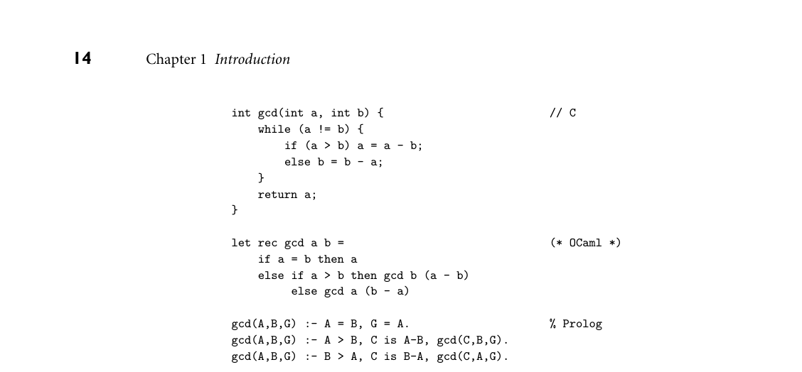

# 1.3 Why Study Programming Languages?

*Figure 1.2 The GCD algorithm in C (top), OCaml (middle), and Prolog (bottom). All three versions assume (without checking) that their inputs are positive integers. 1.3 Why Study Programming Languages?*

Programming languages are central to computer science, and to the typical com- puter science curriculum. Like most car owners, students who have become fa- miliar with one or more high-level languages are generally curious to learn about other languages, and to know what is going on “under the hood.” Learning about languages is interesting. It’s also practical. For one thing, a good understanding of language design and implementation can help one choose the most appropriate language for any given task. Most lan- guages are better for some things than for others. Few programmers are likely to choose Fortran for symbolic computing or string processing, but other choices are not nearly so clear-cut. Should one choose C, C++, or C# for systems pro- gramming? Fortran or C for scientific computations? PHP or Ruby for a web- based application? Ada or C for embedded systems? Visual Basic or Java for a graphical user interface? This book should help equip you to make such deci- sions. Similarly, this book should make it easier to learn new languages. Many lan- guages are closely related. Java and C# are easier to learn if you already know C++; Common Lisp if you already know Scheme; Haskell if you already know ML. More importantly, there are basic concepts that underlie all programming languages. Most of these concepts are the subject of chapters in this book: types, control (iteration, selection, recursion, nondeterminacy, concurrency), abstrac- tion, and naming. Thinking in terms of these concepts makes it easier to assim- ilate the syntax (form) and semantics (meaning) of new languages, compared to picking them up in a vacuum. The situation is analogous to what happens in nat-

ural languages: a good knowledge of grammatical forms makes it easier to learn a foreign language. Whatever language you learn, understanding the decisions that went into its design and implementation will help you use it better. This book should help you:

Understand obscure features. The typical C++ programmer rarely uses unions, multiple inheritance, variable numbers of arguments, or the .* operator. (If you don’t know what these are, don’t worry!) Just as it simplifies the assimi- lation of new languages, an understanding of basic concepts makes it easier to understand these features when you look up the details in the manual. Choose among alternative ways to express things, based on a knowledge of imple- mentation costs. In C++, for example, programmers may need to avoid un- necessary temporary variables, and use copy constructors whenever possible, to minimize the cost of initialization. In Java they may wish to use Executor objects rather than explicit thread creation. With certain (poor) compilers, they may need to adopt special programming idioms to get the fastest code: pointers for array traversal; x*x instead of x**2. In any language, they need to be able to evaluate the tradeoffs among alternative implementations of ab- stractions—for example between computation and table lookup for functions like bit set cardinality, which can be implemented either way. Make good use of debuggers, assemblers, linkers, and related tools. In general, the high-level language programmer should not need to bother with implementa- tion details. There are times, however, when an understanding of those details is virtually essential. The tenacious bug or unusual system-building problem may be dramatically easier to handle if one is willing to peek at the bits. Simulate useful features in languages that lack them. Certain very useful features are missing in older languages, but can be emulated by following a deliberate (if unenforced) programming style. In older dialects of Fortran, for exam- ple, programmers familiar with modern control constructs can use comments and self-discipline to write well-structured code. Similarly, in languages with poor abstraction facilities, comments and naming conventions can help imi- tate modular structure, and the extremely useful iterators of Clu, C#, Python, and Ruby (which we will study in Section 6.5.3) can be imitated with subrou- tines and static variables. Make better use of language technology wherever it appears. Most programmers will never design or implement a conventional programming language, but most will need language technology for other programming tasks. The typ- ical personal computer contains files in dozens of structured formats, en- compassing word processing, spreadsheets, presentations, raster and vector graphics, music, video, databases, and a wide variety of other application do- mains. Web content is increasingly represented in XML, a text-based format designed for easy manipulation in the XSLT scripting language (discussed in Section C 14.3.5). Code to parse, analyze, generate, optimize, and otherwise

manipulate structured data can thus be found in almost any sophisticated pro- gram, and all of this code is based on language technology. Programmers with a strong grasp of this technology will be in a better position to write well- structured, maintainable tools. In a similar vein, most tools themselves can be customized, via start-up con- figuration files, command-line arguments, input commands, or built-in exten- sion languages (considered in more detail in Chapter 14). My home directory holds more than 250 separate configuration (“preference”) files. My personal configuration files for the emacs text editor comprise more than 1200 lines of Lisp code. The user of almost any sophisticated program today will need to make good use of configuration or extension languages. The designers of such a program will need either to adopt (and adapt) some existing extension language, or to invent new notation of their own. Programmers with a strong grasp of language theory will be in a better position to design elegant, well- structured notation that meets the needs of current users and facilitates future development.

Finally, this book should help prepare you for further study in language de- sign or implementation, should you be so inclined. It will also equip you to un- derstand the interactions of languages with operating systems and architectures, should those areas draw your interest.

3CHECK YOUR UNDERSTANDING 1. What is the difference between machine language and assembly language? 2. In what way(s) are high-level languages an improvement on assembly lan- guage? Are there circumstances in which it still make sense to program in assembler? 3. Why are there so many programming languages?

4. What makes a programming language successful? 5. Name three languages in each of the following categories: von Neumann, functional, object-oriented. Name two logic languages. Name two widely used concurrent languages.

6. What distinguishes declarative languages from imperative languages? 7. What organization spearheaded the development of Ada?

8. What is generally considered the first high-level programming language? 9. What was the first functional language? 10. Why aren’t concurrent languages listed as a separate family in Figure 1.1?

