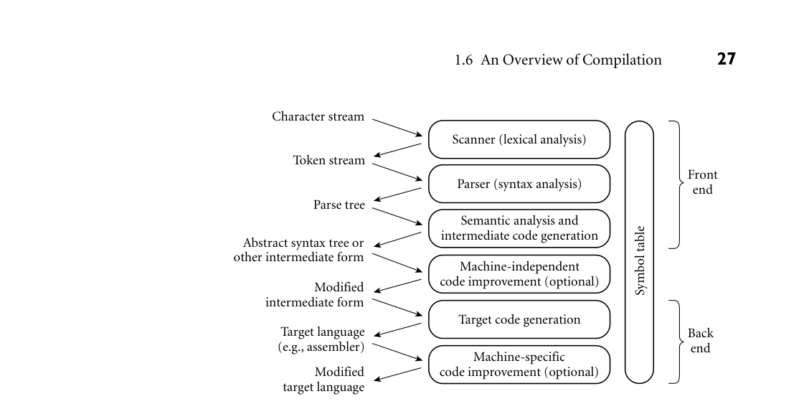
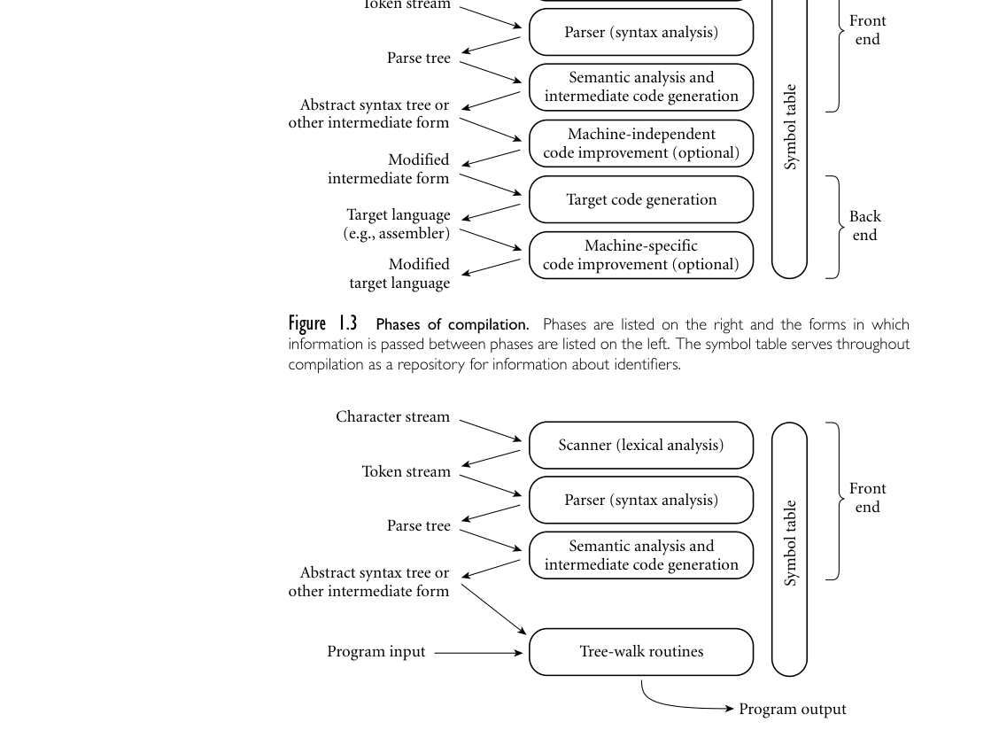
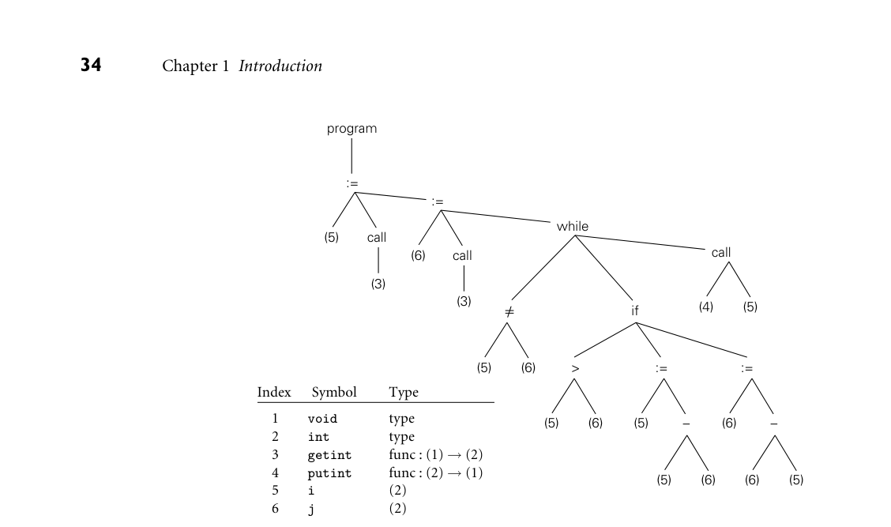
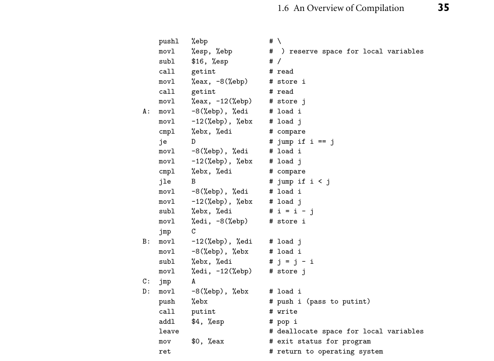

# 1.6 An Overview of Compilation

26 Chapter 1 Introduction

15. What is P-code?

16. What is bootstrapping? 17. What is a just-in-time compiler?

18. Name two languages in which a program can write new pieces of itself “on the fly.”

19. Briefly describe three “unconventional” compilers—compilers whose pur- pose is not to prepare a high-level program for execution on a general- purpose processor. 20. List six kinds of tools that commonly support the work of a compiler within a larger programming environment. 21. Explain how an integrated development environment (IDE) differs from a collection of command-line tools.

1.6 An Overview of Compilation

Compilers are among the most well-studied computer programs. We will con- sider them repeatedly throughout the rest of the book, and in chapters 2, 4, 15, and 17 in particular. The remainder of this section provides an introductory overview. In a typical compiler, compilation proceeds through a series of well-defined EXAMPLE 1.19

Phases of compilation and interpretation phases, shown in Figure 1.3. Each phase discovers information of use to later phases, or transforms the program into a form that is more useful to the subse- quent phase. The first few phases (up through semantic analysis) serve to figure out the meaning of the source program. They are sometimes called the front end of the compiler. The last few phases serve to construct an equivalent target program. They are sometimes called the back end of the compiler. An interpreter (Figure 1.4) shares the compiler’s front-end structure, but “executes” (interprets) the intermediate form directly, rather than translating it into machine language. The execution typically takes the form of a set of mutually recursive subroutines that traverse (“walk”) the syntax tree, “execut- ing” its nodes in program order. Many compiler and interpreter phases can be created automatically from a formal description of the source and/or target languages. ■ One will sometimes hear compilation described as a series of passes. A pass is a phase or set of phases that is serialized with respect to the rest of compila- tion: it does not start until previous phases have completed, and it finishes before any subsequent phases start. If desired, a pass may be written as a separate pro- gram, reading its input from a file and writing its output to a file. Compilers are commonly divided into passes so that the front end may be shared by compilers

*Figure 1.3 Phases of compilation. Phases are listed on the right and the forms in which information is passed between phases are listed on the left. The symbol table serves throughout compilation as a repository for information about identifiers.*

*Figure 1.4 Phases of interpretation. The front end is essentially the same as that of a compiler. The final phase “executes” the intermediate form, typically using a set of mutually recursive subroutines that walk the syntax tree.*

1.6 An Overview of Compilation 27

Character stream

Scanner (lexical analysis)

Token stream

Front end

Parser (syntax analysis)

Parse tree

Semantic analysis and intermediate code generation

Symbol table

Abstract syntax tree or other intermediate form

Machine-independent code improvement (optional)

Modified intermediate form

Target code generation

Target language (e.g., assembler)

Back end

Machine-specific code improvement (optional)

Modified target language

Character stream

Scanner (lexical analysis)

Token stream

Front end

Parser (syntax analysis)

Symbol table

Parse tree

Semantic analysis and intermediate code generation

Abstract syntax tree or other intermediate form

Tree-walk routines

Program input

Program output

for more than one machine (target language), and so that the back end may be shared by compilers for more than one source language. In some implementa- tions the front end and the back end may be separated by a “middle end” that is responsible for language- and machine-independent code improvement. Prior

28 Chapter 1 Introduction

to the dramatic increases in memory sizes of the mid to late 1980s, compilers were also sometimes divided into passes to minimize memory usage: as each pass completed, the next could reuse its code space.

1.6.1 Lexical and Syntax Analysis

Consider the greatest common divisor (GCD) problem introduced at the begin- EXAMPLE 1.20

GCD program in C ning of this chapter, and shown as a function in Figure 1.2. Hypothesizing trivial I/O routines and recasting the function as a stand-alone program, our code might look like this in C:

int main() { int i = getint(), j = getint(); while (i != j) { if (i > j) i = i - j; else j = j - i; } putint(i); } ■

Scanning and parsing serve to recognize the structure of the program, without EXAMPLE 1.21

GCD program tokens regard to its meaning. The scanner reads characters (‘i’, ‘n’, ‘t’, ‘ ’, ‘m’, ‘a’, ‘i’, ‘n’, ‘(’, ‘)’, etc.) and groups them into tokens, which are the smallest meaningful units of the program. In our example, the tokens are

int main ( ) { int i = getint ( ) , j = getint ( ) ; while ( i != j ) { if ( i > j ) i = i - j ; else j = j - i ; } putint ( i ) ; } ■

Scanning is also known as lexical analysis. The principal purpose of the scanner is to simplify the task of the parser, by reducing the size of the input (there are many more characters than tokens) and by removing extraneous characters like white space. The scanner also typically removes comments and tags tokens with line and column numbers, to make it easier to generate good diagnostics in later phases. One could design a parser to take characters instead of tokens as input— dispensing with the scanner—but the result would be awkward and slow. Parsing organizes tokens into a parse tree that represents higher-level con- EXAMPLE 1.22

Context-free grammar and parsing structs (statements, expressions, subroutines, and so on) in terms of their con- stituents. Each construct is a node in the tree; its constituents are its children. The root of the tree is simply “program”; the leaves, from left to right, are the tokens received from the scanner. Taken as a whole, the tree shows how the tokens fit

1.6 An Overview of Compilation 29

together to make a valid program. The structure relies on a set of potentially re- cursive rules known as a context-free grammar. Each rule has an arrow sign (−→) with the construct name on the left and a possible expansion on the right.9 In C, for example, a while loop consists of the keyword while followed by a parenthe- sized Boolean expression and a statement:

iteration-statement −→while ( expression ) statement

The statement, in turn, is often a list enclosed in braces:

statement −→compound-statement

compound-statement −→{ block-item-list opt }

where

block-item-list opt −→block-item-list

or

block-item-list opt −→ϵ

and

block-item-list −→block-item

block-item-list −→block-item-list block-item

block-item −→declaration

block-item −→statement

Here ϵ represents the empty string; it indicates that block-item-list opt can simply be deleted. Many more grammar rules are needed, of course, to explain the full structure of a program. ■ A context-free grammar is said to define the syntax of the language; parsing is therefore known as syntax analysis. There are many possible grammars for C (an infinite number, in fact); the fragment shown above is taken from the sam- ple grammar contained in the official language definition [Int99]. A full parse EXAMPLE 1.23

GCD program parse tree tree for our GCD program (based on a full grammar not shown here) appears in Figure 1.5. While the size of the tree may seem daunting, its details aren’t par- ticularly important at this point in the text. What is important is that (1) each individual branching point represents the application of a single grammar rule, and (2) the resulting complexity is more a reflection of the grammar than it is of the input program. Much of the bulk stems from (a) the use of such artificial “constructs” as block item-list and block item-list opt to generate lists of arbitrary

9 Theorists also study context-sensitive grammars, in which the allowable expansions of a construct (the applicable rules) depend on the context in which the construct appears (i.e., on constructs to the left and right). Context sensitivity is important for natural languages like English, but it is almost never used in programming language design.

30 Chapter 1 Introduction

argument-expression-list_opt 1 ident(getint)

) ( postfix-expression

ϵ

declarator = initializer assignment-expression

ident(j) postfix-expression 13

B

declarator = initializer

block-item

A

} { block-item-list_opt

compound-statement

block-item-list

block-item-list

direct-declarator

block-item

, init-declarator-list init-declarator

declaration-specifiers ;

init-declarator-list_opt

) (

argument-expression-list_opt 1 ident(getint)

init-declarator-list

pointer_opt

block-item-list

declaration

identifier-list_opt

declaration-list_opt

ϵ

1

) ( postfix-expression

ϵ

ϵ

ϵ

function-definition

assignment-expression

translation-unit

direct-declarator

postfix-expression 13

declaration-specifiers_opt

init-declarator

1

ident(main)

direct-declarator

declarator

ϵ

pointer_opt

declaration-specifiers_opt

direct-declarator

ident(i)

ϵ

type-specifier

int

declaration-specifiers

ϵ

pointer_opt

ϵ

type-specifier

int

*Figure 1.5 Parse tree for the GCD program. The symbol ϵ represents the empty string. Dotted lines indicate a chain of one-for-one replacements, elided to save space; the adjacent number indicates the number of omitted nodes. While the details of the tree aren’t important to the current chapter, the sheer amount of detail is: it comes from having to fit the (much simpler) source code into the hierarchical structure of a context-free grammar.*

1.6 An Overview of Compilation 31

- multiplicative-expression additive-expression

argument-expression-list_opt

ident(j) ident(i) 5 4

assignment-expression unary-expression assignment-operator

additive-expression =

ident(i)

17

) ( postfix-expression

expression-statement iteration-statement

ident(j) 2 10

;

statement statement

postfix-expression

A B

expression_opt

15

ident(putint)

1

;

assignment-expression

expression-statement

expression_opt

) ( if expression statement else statement

1 1

} { block-item-list_opt

- multiplicative-expression additive-expression

compound-statement

selection-statement

) ( while expression statement

ident(i) ident(j) 5 4

;

assignment-expression unary-expression assignment-operator

assignment-expression

3

expression-statement

additive-expression

expression_opt

10

relational-expression

relational-expression

ident(i) 8 ident(j) 7

shift-expression

ident(j) 6

8

=

equality-expression

7

equality-expression !=

relational-expression >

ident(i) 7

ident(i) 2

32 Chapter 1 Introduction

length, and (b) the use of the equally artificial assignment-expression, additive- expression, multiplicative-expression, and so on, to capture precedence and asso- ciativity in arithmetic expressions. We shall see in the following subsection that much of this complexity can be discarded once parsing is complete. ■ In the process of scanning and parsing, the compiler or interpreter checks to see that all of the program’s tokens are well formed, and that the sequence of tokens conforms to the syntax defined by the context-free grammar. Any mal- formed tokens (e.g., 123abc or $@foo in C) should cause the scanner to produce an error message. Any syntactically invalid token sequence (e.g., A = X Y Z in C) should lead to an error message from the parser.

1.6.2 Semantic Analysis and Intermediate Code Generation

Semantic analysis is the discovery of meaning in a program. Among other things, the semantic analyzer recognizes when multiple occurrences of the same identi- fier are meant to refer to the same program entity, and ensures that the uses are consistent. In most languages it also tracks the types of both identifiers and ex- pressions, both to verify consistent usage and to guide the generation of code in the back end of a compiler. To assist in its work, the semantic analyzer typically builds and maintains a symbol table data structure that maps each identifier to the information known about it. Among other things, this information includes the identifier’s type, in- ternal structure (if any), and scope (the portion of the program in which it is valid). Using the symbol table, the semantic analyzer enforces a large variety of rules that are not captured by the hierarchical structure of the context-free grammar and the parse tree. In C, for example, it checks to make sure that

Every identifier is declared before it is used. No identifier is used in an inappropriate context (calling an integer as a sub- routine, adding a string to an integer, referencing a field of the wrong type of struct, etc.). Subroutine calls provide the correct number and types of arguments. Labels on the arms of a switch statement are distinct constants. Any function with a non-void return type returns a value explicitly.

In many front ends, the work of the semantic analyzer takes the form of semantic action routines, invoked by the parser when it realizes that it has reached a partic- ular point within a grammar rule. Of course, not all semantic rules can be checked at compile time (or in the front end of an interpreter). Those that can are referred to as the static semantics of the language. Those that must be checked at run time (or in the later phases of an interpreter) are referred to as the dynamic semantics of the language. C has very little in the way of dynamic checks (its designers opted for performance over safety). Examples of rules that other languages enforce at run time include:

1.6 An Overview of Compilation 33

Variables are never used in an expression unless they have been given a value.10

Pointers are never dereferenced unless they refer to a valid object. Array subscript expressions lie within the bounds of the array. Arithmetic operations do not overflow.

When it cannot enforce rules statically, a compiler will often produce code to perform appropriate checks at run time, aborting the program or generating an exception if one of the checks then fails. (Exceptions will be discussed in Sec- tion 9.4.) Some rules, unfortunately, may be unacceptably expensive or impossi- ble to enforce, and the language implementation may simply fail to check them. In Ada, a program that breaks such a rule is said to be erroneous; in C its behavior is said to be undefined. A parse tree is sometimes known as a concrete syntax tree, because it demon- strates, completely and concretely, how a particular sequence of tokens can be derived under the rules of the context-free grammar. Once we know that a token sequence is valid, however, much of the information in the parse tree is irrele- vant to further phases of compilation. In the process of checking static semantic EXAMPLE 1.24

GCD program abstract syntax tree rules, the semantic analyzer typically transforms the parse tree into an abstract syntax tree (otherwise known as an AST, or simply a syntax tree) by removing most of the “artificial” nodes in the tree’s interior. The semantic analyzer also annotates the remaining nodes with useful information, such as pointers from identifiers to their symbol table entries. The annotations attached to a particular node are known as its attributes. A syntax tree for our GCD program is shown in Figure 1.6. ■ Many interpreters use an annotated syntax tree to represent the running pro- gram: “execution” then amounts to tree traversal. In our GCD program, an inter- EXAMPLE 1.25

Interpreting the syntax tree preter would start at the root of Figure 1.6 and visit, in order, the statements on the main spine of the tree. At the first “:=” node, the interpreter would notice that the right child is a call: it would therefore call the getint routine (found in slot 3 of the symbol table) and assign the result into i (found in slot 5 of the symbol table). At the second “:=” node the interpreter would similarly assign the result of getint into j. At the while node it would repeatedly evaluate the left (“̸=”) child and, if the result was true, recursively walk the tree under the right (if) child. Finally, once the while node’s left child evaluated to false, the interpreter would move on to the final call node, and output its result. ■ In many compilers, the annotated syntax tree constitutes the intermediate form that is passed from the front end to the back end. In other compilers, se- mantic analysis ends with a traversal of the tree (typically single pass) that gener- ates some other intermediate form. One common such form consists of a control flow graph whose nodes resemble fragments of assembly language for a simple

10 As we shall see in Section 6.1.3, Java and C# actually do enforce initialization at compile time, but only by adopting a conservative set of rules for “definite assignment,” outlawing programs for which correctness is difficult or impossible to verify at compile time.

*Figure 1.6 Syntax tree and symbol table for the GCD program. Note the contrast to Fig- ure 1.5: the syntax tree retains just the essential structure of the program, omitting details that were needed only to drive the parsing algorithm.*

34 Chapter 1 Introduction

program

:= :=

while

call (5) call (6) call

(3)

(3)

if (4) (5)

=/

(5) (6)

> := :=

Index Symbol Type

type type func : (1) → (2) func : (2) → (1) (2) (2)

1 2 3 4 5 6

void int getint putint i j

(5) (6) (5)

(6)

− −

(5) (6) (6) (5)

idealized machine. We will consider this option further in Chapter 15, where a control flow graph for our GCD program appears in Figure 15.3. In a suite of re- lated compilers, the front ends for several languages and the back ends for several machines would share a common intermediate form.

1.6.3 Target Code Generation

The code generation phase of a compiler translates the intermediate form into the target language. Given the information contained in the syntax tree, gener- ating correct code is usually not a difficult task (generating good code is harder, as we shall see in Section 1.6.4). To generate assembly or machine language, the EXAMPLE 1.26

GCD program assembly code code generator traverses the symbol table to assign locations to variables, and then traverses the intermediate representation of the program, generating loads and stores for variable references, interspersed with appropriate arithmetic opera- tions, tests, and branches. Naive code for our GCD example appears in Figure 1.7, in x86 assembly language. It was generated automatically by a simple pedagogical compiler. The assembly language mnemonics may appear a bit cryptic, but the com- ments on each line (not generated by the compiler!) should make the correspon-

*Figure 1.7 Naive x86 assembly language for the GCD program.*

1.6 An Overview of Compilation 35

pushl %ebp # \ movl %esp, %ebp # ) reserve space for local variables subl $16, %esp # / call getint # read movl %eax, -8(%ebp) # store i call getint # read movl %eax, -12(%ebp) # store j A: movl -8(%ebp), %edi # load i movl -12(%ebp), %ebx # load j cmpl %ebx, %edi # compare je D # jump if i == j movl -8(%ebp), %edi # load i movl -12(%ebp), %ebx # load j cmpl %ebx, %edi # compare jle B # jump if i < j movl -8(%ebp), %edi # load i movl -12(%ebp), %ebx # load j subl %ebx, %edi # i = i - j movl %edi, -8(%ebp) # store i jmp C B: movl -12(%ebp), %edi # load j movl -8(%ebp), %ebx # load i subl %ebx, %edi # j = j - i movl %edi, -12(%ebp) # store j C: jmp A D: movl -8(%ebp), %ebx # load i push %ebx # push i (pass to putint) call putint # write addl $4, %esp # pop i leave # deallocate space for local variables mov $0, %eax # exit status for program ret # return to operating system

dence between Figures 1.6 and 1.7 generally apparent. A few hints: esp, ebp, eax, ebx, and edi are registers (special storage locations, limited in number, that can be accessed very quickly). -8(%ebp) refers to the memory location 8 bytes before the location whose address is in register ebp; in this program, ebp serves as a base from which we can find variables i and j. The argument to a subroutine call instruction is passed by pushing it onto a stack, for which esp is the top-of- stack pointer. The return value comes back in register eax. Arithmetic operations overwrite their second argument with the result of the operation.11 ■

11 As noted in footnote 1, these are GNU assembler conventions; Microsoft and Intel assemblers specify arguments in the opposite order.

36 Chapter 1 Introduction

Often a code generator will save the symbol table for later use by a symbolic debugger, by including it in a nonexecutable part of the target code.

1.6.4 Code Improvement

Code improvement is often referred to as optimization, though it seldom makes anything optimal in any absolute sense. It is an optional phase of compilation whose goal is to transform a program into a new version that computes the same result more efficiently—more quickly or using less memory, or both. Some improvements are machine independent. These can be performed as transformations on the intermediate form. Other improvements require an un- derstanding of the target machine (or of whatever will execute the program in the target language). These must be performed as transformations on the target pro- gram. Thus code improvement often appears twice in the list of compiler phases: once immediately after semantic analysis and intermediate code generation, and again immediately after target code generation. Applying a good code improver to the code in Figure 1.7 produces the code EXAMPLE 1.27

GCD program optimization shown in Example 1.2. Comparing the two programs, we can see that the im- proved version is quite a lot shorter. Conspicuously absent are most of the loads and stores. The machine-independent code improver is able to verify that i and j can be kept in registers throughout the execution of the main loop. (This would not have been the case if, for example, the loop contained a call to a subrou- tine that might reuse those registers, or that might try to modify i or j.) The machine-specific code improver is then able to assign i and j to actual regis- ters of the target machine. For modern microprocessors, with complex internal behavior, compilers can usually generate better code than can human assembly language programmers. ■

3CHECK YOUR UNDERSTANDING 22. List the principal phases of compilation, and describe the work performed by each. 23. List the phases that are also executed as part of interpretation.

24. Describe the form in which a program is passed from the scanner to the parser; from the parser to the semantic analyzer; from the semantic analyzer to the intermediate code generator. 25. What distinguishes the front end of a compiler from the back end?

26. What is the difference between a phase and a pass of compilation? Underwhat circumstances does it make sense for a compiler to have multiple passes? 27. What is the purpose of the compiler’s symbol table? 28. What is the difference between static and dynamic semantics?

