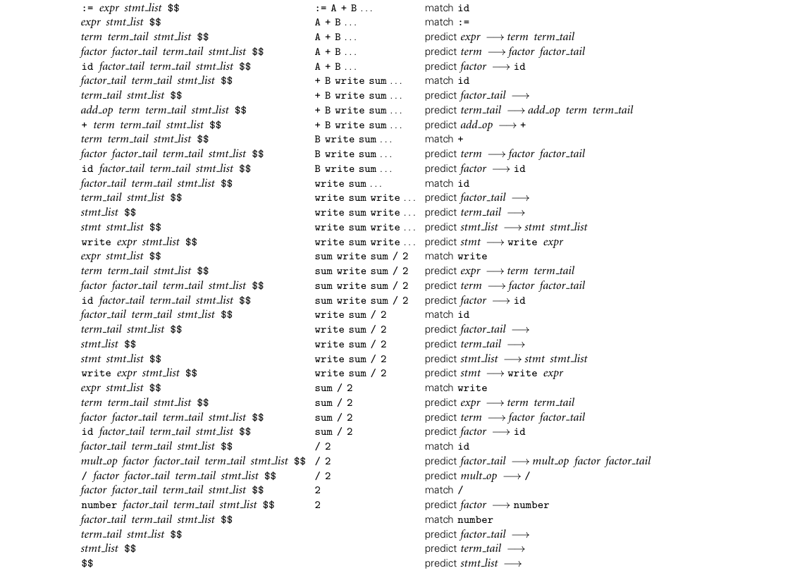
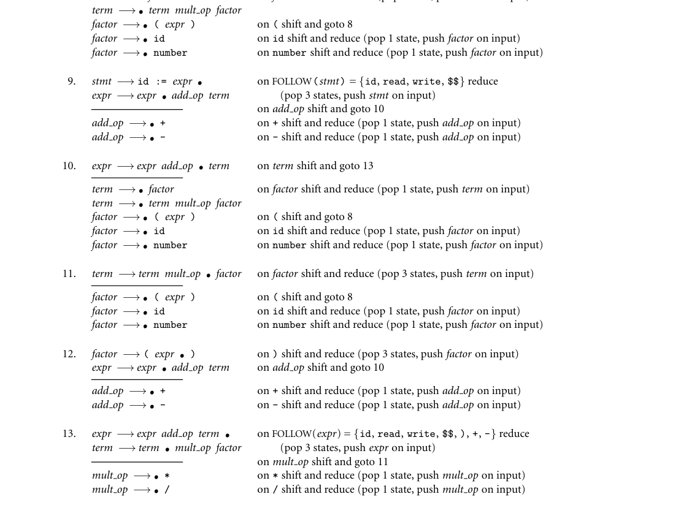

# Chapter 2: Programming Language Syntax

2 Programming Language Syntax

Unlike natural languages such as English or Chinese, computer languages must be precise. Both their form (syntax) and meaning (semantics) must be spec- ified without ambiguity, so that both programmers and computers can tell what a program is supposed to do. To provide the needed degree of precision, lan- guage designers and implementors use formal syntactic and semantic notation. To facilitate the discussion of language features in later chapters, we will cover this notation first: syntax in the current chapter and semantics in Chapter 4. As a motivating example, consider the Arabic numerals with which we repre- EXAMPLE 2.1

Syntax of Arabic numerals sent numbers. These numerals are composed of digits, which we can enumerate as follows (‘ | ’ means “or”):

digit −→0 | 1 | 2 | 3 | 4 | 5 | 6 | 7 | 8 | 9

Digits are the syntactic building blocks for numbers. In the usual notation, we say that a natural number is represented by an arbitrary-length (nonempty) string of digits, beginning with a nonzero digit:

non zero digit −→1 | 2 | 3 | 4 | 5 | 6 | 7 | 8 | 9

natural number −→non zero digit digit *

Here the “Kleene1 star” metasymbol (*) is used to indicate zero or more repeti- tions of the symbol to its left. ■ Of course, digits are only symbols: ink blobs on paper or pixels on a screen. They carry no meaning in and of themselves. We add semantics to digits when we say that they represent the natural numbers from zero to nine, as defined by mathematicians. Alternatively, we could say that they represent colors, or the days of the week in a decimal calendar. These would constitute alternative se- mantics for the same syntax. In a similar fashion, we define the semantics of natural numbers by associating a base-10, place-value interpretation with each

1 Stephen Kleene (1909–1994), a mathematician at the University of Wisconsin, was responsible for much of the early development of the theory of computation, including much of the material in Section C 2.4.

string of digits. Similar syntax rules and semantic interpretations can be devised for rational numbers, (limited-precision) real numbers, arithmetic, assignments, control flow, declarations, and indeed all of programming languages. Distinguishing between syntax and semantics is useful for at least two reasons. First, different programming languages often provide features with very similar semantics but very different syntax. It is generally much easier to learn a new lan- guage if one is able to identify the common (and presumably familiar) semantic ideas beneath the unfamiliar syntax. Second, there are some very efficient and elegant algorithms that a compiler or interpreter can use to discover the syntactic structure (but not the semantics!) of a computer program, and these algorithms can be used to drive the rest of the compilation or interpretation process. In the current chapter we focus on syntax: how we specify the structural rules of a programming language, and how a compiler identifies the structure of a given input program. These two tasks—specifying syntax rules and figuring out how (and whether) a given program was built according to those rules—are dis- tinct. The first is of interest mainly to programmers, who want to write valid programs. The second is of interest mainly to compilers, which need to analyze those programs. The first task relies on regular expressions and context-free gram- mars, which specify how to generate valid programs. The second task relies on scanners and parsers, which recognize program structure. We address the first of these tasks in Section 2.1, the second in Sections 2.2 and 2.3. In Section 2.4 (largely on the companion site) we take a deeper look at the for- mal theory underlying scanning and parsing. In theoretical parlance, a scanner is a deterministic finite automaton (DFA) that recognizes the tokens of a program- ming language. A parser is a deterministic push-down automaton (PDA) that recognizes the language’s context-free syntax. It turns out that one can gener- ate scanners and parsers automatically from regular expressions and context-free grammars. This task is performed by tools like Unix’s lex and yacc,2 among oth- ers. Possibly nowhere else in computer science is the connection between theory and practice so clear and so compelling.

## 2.1 Specifying Syntax: Regular Expressions and Context-Free Grammars

Formal specification of syntax requires a set of rules. How complicated (expres- sive) the syntax can be depends on the kinds of rules we are allowed to use. It turns out that what we intuitively think of as tokens can be constructed from individual characters using just three kinds of formal rules: concatenation, alter- nation (choice among a finite set of alternatives), and so-called “Kleene closure”

2 At many sites, lex and yacc have been superseded by the GNU flex and bison tools, which provide a superset of the original functionality.

(repetition an arbitrary number of times). Specifying most of the rest of what we intuitively think of as syntax requires one additional kind of rule: recursion (creation of a construct from simpler instances of the same construct). Any set of strings that can be defined in terms of the first three rules is called a regular set, or sometimes a regular language. Regular sets are generated by regular expressions and recognized by scanners. Any set of strings that can be defined if we add recur- sion is called a context-free language (CFL). Context-free languages are generated by context-free grammars (CFGs) and recognized by parsers. (Terminology can be confusing here. The meaning of the word “language” varies greatly, depending on whether we’re talking about “formal” languages [e.g., regular or context-free], or programming languages. A formal language is just a set of strings, with no accompanying semantics.)

## 2.1.1 Tokens and Regular Expressions

Tokens are the basic building blocks of programs—the shortest strings of char- acters with individual meaning. Tokens come in many kinds, including key- words, identifiers, symbols, and constants of various types. Some kinds of token (e.g., the increment operator) correspond to only one string of characters. Oth- ers (e.g., identifier) correspond to a set of strings that share some common form. (In most languages, keywords are special strings of characters that have the right form to be identifiers, but are reserved for special purposes.) We will use the word “token” informally to refer to both the generic kind (an identifier, the increment operator) and the specific string (foo, ++); the distinction between these should be clear from context. Some languages have only a few kinds of token, of fairly simple form. Other languages are more complex. C, for example, has more than 100 kinds of EXAMPLE 2.2

Lexical structure of C11 tokens, including 44 keywords (double, if, return, struct, etc.); identifiers (my_variable, your_type, sizeof, printf, etc.); integer (0765, 0x1f5, 501), floating-point (6.022e23), and character (‚x‚, ‚\‚‚, ‚\0170‚) constants; string literals ("snerk", "say \"hi\"\n"); 54 “punctuators” (+, ], ->, *=, :, ||, etc.), and two different forms of comments. There are provisions for international character sets, string literals that span multiple lines of source code, constants of varying precision (width), alternative “spellings” for symbols that are missing on certain input devices, and preprocessor macros that build tokens from smaller pieces. Other large, modern languages (Java, Ada) are similarly complex. ■ To specify tokens, we use the notation of regular expressions. A regular expres- sion is one of the following:

* A character
* The empty string, denoted ϵ
* Two regular expressions next to each other, meaning any string generated by
  the first one followed by (concatenated with) any string generated by the sec-
  ond one

* Two regular expressions separated by a vertical bar (|), meaning any string
  generated by the first one or any string generated by the second one
* A regular expression followed by a Kleene star, meaning the concatenation of
  zero or more strings generated by the expression in front of the star

Parentheses are used to avoid ambiguity about where the various subexpres- sions start and end.3 Consider, for example, the syntax of numeric constants accepted by a simple EXAMPLE 2.3

Syntax of numeric constants hand-held calculator:

number −→integer | real

integer −→digit digit *

real −→integer exponent | decimal ( exponent | ϵ )

decimal −→digit * ( . digit | digit . ) digit *

exponent −→( e | E ) ( + | - | ϵ ) integer

digit −→0 | 1 | 2 | 3 | 4 | 5 | 6 | 7 | 8 | 9

The symbols to the left of the −→signs provide names for the regular expres- sions. One of these (number) will serve as a token name; the others are simply

DESIGN & IMPLEMENTATION

2.1 Contextual keywords In addition to distinguishing between keywords and identifiers, some lan- guages define so-called contextual keywords, which function as keywords in certain specific places in a program, but as identifiers elsewhere. In C#, for ex- ample, the word yield can appear immediately before return or break—a place where an identifier can never appear. In this context, it is interpreted as a keyword; anywhere else it is an identifier. It is therefore perfectly acceptable to have a local variable named yield: the compiler can distinguish it from the keyword by where it appears in the program. C++11 has a small handful of contextual keywords. C# 4.0 has 26. Most were introduced in the course of revising the language to create a new stan- dard version. Given a large user community, any short, intuitively appealing word is likely to have been used as an identifier by someone, in some existing program. Making that word a contextual keyword in the new version of the language, rather than a full keyword, reduces the risk that existing programs will suddenly fail to compile.

3 Some authors use λ to represent the empty string. Some use a period (.), rather than juxtaposi- tion, to indicate concatenation. Some use a plus sign (+), rather than a vertical bar, to indicate alternation.

for convenience in building larger expressions.4 Note that while we have allowed definitions to build on one another, nothing is ever defined in terms of itself, even indirectly. Such recursive definitions are the distinguishing characteristic of context-free grammars, described in Section 2.1.2. To generate a valid number, we expand out the sub-definitions and then scan the resulting expression from left to right, choosing among alternatives at each vertical bar, and choosing a number of repetitions at each Kleene star. Within each repetition we may make different choices at vertical bars, generating different substrings. ■

Character Sets and Formatting Issues

Upper- and lowercase letters in identifiers and keywords are considered distinct in some languages (e.g., Perl, Python, and Ruby; C and its descendants), and identi- cal in others (e.g., Ada, Common Lisp, and Fortran). Thus foo, Foo, and FOO all represent the same identifier in Ada, but different identifiers in C. Modula-2 and Modula-3 require keywords and predefined (built-in) identifiers to be written in uppercase; C and its descendants require them to be written in lowercase. A few languages allow only letters and digits in identifiers. Most allow underscores. A few (notably Lisp) allow a variety of additional characters. Some languages (e.g., Java and C#) have standard (but optional) conventions on the use of upper- and lowercase letters in names.5 With the globalization of computing, non-Latin character sets have become increasingly important. Many modern languages, including C, C++, Ada 95, Java, C#, and Fortran 2003 have introduced explicit support for multibyte char- acter sets, generally based on the Unicode and ISO/IEC 10646 international stan- dards. Most modern programming languages allow non-Latin characters to ap- pear within comments and character strings; an increasing number allow them in identifiers as well. Conventions for portability across character sets and for lo- calization to a given character set can be surprisingly complex, particularly when various forms of backward compatibility are required (the C99 Rationale devotes five full pages to this subject [Int03a, pp. 19–23]); for the most part we ignore such issues here. Some language implementations impose limits on the maximum length of identifiers, but most avoid such unnecessary restrictions. Most modern languages are also more or less free format, meaning that a program is simply a sequence of tokens: what matters is their order with respect to one another, not their physical position within a printed line or page. “White space” (blanks, tabs, carriage re- turns, and line and page feed characters) between tokens is usually ignored, except to the extent that it is needed to separate one token from the next.

4 We have assumed here that all numeric constants are simply “numbers.” In many programming languages, integer and real constants are separate kinds of token. Their syntax may also be more complex than indicated here, to support such features are multiple lengths or nondecimal bases. 5 For the sake of consistency we do not always obey such conventions in this book: most examples follow the common practice of C programmers, in which underscores, rather than capital letters, separate the “subwords” of names.

There are a few noteworthy exceptions to these rules. Some language imple- mentations limit the maximum length of a line, to allow the compiler to store the current line in a fixed-length buffer. Dialects of Fortran prior to Fortran 90 use a fixed format, with 72 characters per line (the width of a paper punch card, on which programs were once stored), and with different columns within the line re- served for different purposes. Line breaks serve to separate statements in several other languages, including Go, Haskell, Python, and Swift. Haskell and Python also give special significance to indentation. The body of a loop, for example, con- sists of precisely those subsequent lines that are indented farther than the header of the loop.

Other Uses of Regular Expressions

Many readers will be familiar with regular expressions from the grep family of tools in Unix, the search facilities of various text editors, or such scripting lan- guages and tools as Perl, Python, Ruby, awk, and sed. Most of these provide a rich set of extensions to the notation of regular expressions. Some extensions, such as shorthand for “zero or one occurrences” or “anything other than white space,” do not change the power of the notation. Others, such as the ability to require a second occurrence, later in the input string, of the same character sequence that matched an earlier part of the expression, increase the power of the notation, so that it is no longer restricted to generating regular sets. Still other extensions are designed not to increase the expressiveness of the notation but rather to tie it to other language facilities. In many tools, for example, one can bracket portions of a regular expression in such a way that when a string is matched against it the con- tents of the corresponding substrings are assigned into named local variables. We will return to these issues in Section 14.4.2, in the context of scripting languages.

## 2.1.2 Context-Free Grammars

Regular expressions work well for defining tokens. They are unable, however, to specify nested constructs, which are central to programming languages. Consider EXAMPLE 2.4

Syntactic nesting in expressions for example the structure of an arithmetic expression:

DESIGN & IMPLEMENTATION

2.2 Formatting restrictions Formatting limitations inspired by implementation concerns—as in the punch-card-oriented rules of Fortran 77 and its predecessors—have a ten- dency to become unwanted anachronisms as implementation techniques im- prove. Given the tendency of certain word processors to “fill” or auto-format text, the line break and indentation rules of languages like Haskell, Occam, and Python are somewhat controversial.

expr −→id | number | - expr | ( expr ) | expr op expr op −→+ | - | * | /

Here the ability to define a construct in terms of itself is crucial. Among other things, it allows us to ensure that left and right parentheses are matched, some- thing that cannot be accomplished with regular expressions (see Section C 2.4.3 for more details). The arrow symbol (−→) means “can have the form”; for brevity it is sometimes pronounced “goes to.” ■ Each of the rules in a context-free grammar is known as a production. The symbols on the left-hand sides of the productions are known as variables, or non- terminals. There may be any number of productions with the same left-hand side. Symbols that are to make up the strings derived from the grammar are known as terminals (shown here in typewriter font). They cannot appear on the left-hand side of any production. In a programming language, the terminals of the context- free grammar are the language’s tokens. One of the nonterminals, usually the one on the left-hand side of the first production, is called the start symbol. It names the construct defined by the overall grammar. The notation for context-free grammars is sometimes called Backus-Naur Form (BNF), in honor of John Backus and Peter Naur, who devised it for the definition of the Algol-60 programming language [NBB+63].6 Strictly speaking, the Kleene star and meta-level parentheses of regular expressions are not allowed in BNF, but they do not change the expressive power of the notation, and are commonly included for convenience. Sometimes one sees a “Kleene plus” (+) as well; it indicates one or more instances of the symbol or group of symbols in front of it.7 When augmented with these extra operators, the notation is often called extended BNF (EBNF). The construct EXAMPLE 2.5

Extended BNF (EBNF) id list −→id ( , id )*

is shorthand for

id list −→id id list −→id list , id

“Kleene plus” is analogous. Note that the parentheses here are metasymbols. In Example 2.4 they were part of the language being defined, and were written in fixed-width font.8

6 John Backus (1924–2007) was also the inventor of Fortran. He spent most of his professional career at IBM Corporation, and was named an IBM Fellow in 1987. He received the ACM Turing Award in 1977.

7 Some authors use curly braces ({ }) to indicate zero or more instances of the symbols inside. Some use square brackets ([ ]) to indicate zero or one instances of the symbols inside—that is, to indicate that those symbols are optional.

8 To avoid confusion, some authors place quote marks around any single character that is part of the language being defined: id list −→id ( ‘,’ id )* ; expr −→‘(’ expr ‘ )’. In both regular and extended BNF, many authors use ::= instead of −→.

Like the Kleene star and parentheses, the vertical bar is in some sense superflu- ous, though it was provided in the original BNF. The construct

op −→+ | - | * | /

can be considered shorthand for

op −→+

op −→-

op −→*

op −→/

which is also sometimes written

op −→+

−→-

−→*

−→/ ■

Many tokens, such as id and number above, have many possible spellings (i.e., may be represented by many possible strings of characters). The parser is obliv- ious to these; it does not distinguish one identifier from another. The semantic analyzer does distinguish them, however; the scanner must save the spelling of each such “interesting” token for later use.

## 2.1.3 Derivations and Parse Trees

A context-free grammar shows us how to generate a syntactically valid string of terminals: Begin with the start symbol. Choose a production with the start sym- bol on the left-hand side; replace the start symbol with the right-hand side of that production. Now choose a nonterminal A in the resulting string, choose a pro- duction P with A on its left-hand side, and replace A with the right-hand side of

## P. Repeat this process until no nonterminals remain. As an example, we can use our grammar for expressions to generate the string EXAMPLE 2.6

Derivation of slope * x + intercept “slope * x + intercept”:

expr =⇒expr op expr

=⇒expr op id

=⇒expr + id

=⇒expr op expr + id

=⇒expr op id + id

=⇒expr * id + id

=⇒ id (slope) * id (x) + id (intercept)


*Figure 2.1 Parse tree for slope * x + intercept (grammar in Example 2.4).*


*Figure 2.2 Alternative (less desirable) parse tree for slope * x + intercept (grammar in Example 2.4). The fact that more than one tree exists implies that our grammar is ambiguous.*

The =⇒metasymbol is often pronounced “derives.” It indicates that the right- hand side was obtained by using a production to replace some nonterminal in the left-hand side. At each line we have underlined the symbol A that is replaced in the following line. ■ A series of replacement operations that shows how to derive a string of termi- nals from the start symbol is called a derivation. Each string of symbols along the way is called a sentential form. The final sentential form, consisting of only ter- minals, is called the yield of the derivation. We sometimes elide the intermediate steps and write expr =⇒∗slope * x + intercept, where the metasymbol =⇒∗ means “derives after zero or more replacements.” In this particular derivation, we have chosen at each step to replace the right-most nonterminal with the right- hand side of some production. This replacement strategy leads to a right-most derivation. There are many other possible derivations, including left-most and options in-between. We saw in Chapter 1 that we can represent a derivation graphically as a parse tree. The root of the parse tree is the start symbol of the grammar. The leaves of the tree are its yield. Each internal node, together with its children, represents the use of a production. A parse tree for our example expression appears in Figure 2.1. This tree is EXAMPLE 2.7

Parse trees for slope * x + intercept not unique. At the second level of the tree, we could have chosen to turn the operator into a * instead of a +, and to further expand the expression on the right, rather than the one on the left (see Figure 2.2). A grammar that allows the

construction of more than one parse tree for some string of terminals is said to be ambiguous. Ambiguity turns out to be a problem when trying to build a parser: it requires some extra mechanism to drive a choice between equally acceptable alternatives. ■ A moment’s reflection will reveal that there are infinitely many context-free grammars for any given context-free language.9 Some grammars, however, are much more useful than others. In this text we will avoid the use of ambiguous grammars (though most parser generators allow them, by means of disambiguat- ing rules). We will also avoid the use of so-called useless symbols: nonterminals that cannot generate any string of terminals, or terminals that cannot appear in the yield of any derivation. When designing the grammar for a programming language, we generally try to find one that reflects the internal structure of programs in a way that is useful to the rest of the compiler. (We shall see in Section 2.3.2 that we also try to find one that can be parsed efficiently, which can be a bit of a challenge.) One place in which structure is particularly important is in arithmetic expressions, where we can use productions to capture the associativity and precedence of the various operators. Associativity tells us that the operators in most languages group left to right, so that 10 - 4 - 3 means (10 - 4) - 3 rather than 10 - (4 - 3). Precedence tells us that multiplication and division in most languages group more tightly than addition and subtraction, so that 3 + 4 * 5 means 3 + (4 * 5) rather than (3 + 4) * 5. (These rules are not universal; we will consider them again in Section 6.1.1.) Here is a better version of our expression grammar: EXAMPLE 2.8

Expression grammar with precedence and associativity 1. expr −→term | expr add op term

  2.
  term −→factor | term mult op factor

  3.
  factor −→id | number | - factor | ( expr )

  4.
  add op −→+ | -

  5.
  mult op −→* | /

This grammar is unambiguous. It captures precedence in the way factor, term, and expr build on one another, with different operators appearing at each level. It captures associativity in the second halves of lines 1 and 2, which build subexprs and subterms to the left of the operator, rather than to the right. In Figure 2.3, we can see how building the notion of precedence into the grammar makes it clear that multiplication groups more tightly than addition in 3 + 4 * 5, even without parentheses. In Figure 2.4, we can see that subtraction groups more tightly to the left, so that 10 - 4 - 3 would evaluate to 3, rather than to 9. ■

9 Given a specific grammar, there are many ways to create other equivalent grammars. We could, for example, replace A with some new symbol B everywhere it appears in the right-hand side of a production, and then create a new production B −→A.


*Figure 2.3 Parse tree for 3 + 4 * 5, with precedence (grammar in Example 2.8).*


*Figure 2.4 Parse tree for 10 – 4 – 3, with left associativity (grammar in Example 2.8).*

3CHECK YOUR UNDERSTANDING 1. What is the difference between syntax and semantics? 2. What are the three basic operations that can be used to build complex regular expressions from simpler regular expressions? 3. What additional operation (beyond the three of regular expressions) is pro- vided in context-free grammars? 4. What is Backus-Naur form? When and why was it devised?

  5.
  Name a language in which indentation affects program syntax.
  6.
  When discussing context-free languages, what is a derivation? What is a sen-
  tential form?
  7.
  What is the difference between a right-most derivation and a left-most deriva-
  tion?

  8.
  What does it mean for a context-free grammar to be ambiguous?
  9.
  What are associativity and precedence? Why are they significant in parse trees?

## 2.2 Scanning

Together, the scanner and parser for a programming language are responsible for discovering the syntactic structure of a program. This process of discovery, or syntax analysis, is a necessary first step toward translating the program into an equivalent program in the target language. (It’s also the first step toward inter- preting the program directly. In general, we will focus on compilation, rather than interpretation, for the remainder of the book. Most of what we shall dis- cuss either has an obvious application to interpretation, or is obviously irrelevant to it.) By grouping input characters into tokens, the scanner dramatically reduces the number of individual items that must be inspected by the more computationally intensive parser. In addition, the scanner typically removes comments (so the parser doesn’t have to worry about them appearing throughout the context-free grammar—see Exercise 2.20); saves the text of “interesting” tokens like identifiers, strings, and numeric literals; and tags tokens with line and column numbers, to make it easier to generate high-quality error messages in subsequent phases. In Examples 2.4 and 2.8 we considered a simple language for arithmetic expres- EXAMPLE 2.9

Tokens for a calculator language sions. In Section 2.3.1 we will extend this to create a simple “calculator language” with input, output, variables, and assignment. For this language we will use the following set of tokens:

assign −→:=

plus −→+

minus −→-

times −→*

div −→/

lparen −→(

rparen −→)

id −→letter ( letter | digit )* except for read and write

number −→digit digit * | digit * ( . digit | digit . ) digit *

In keeping with Algol and its descendants (and in contrast to the C-family lan- guages), we have used := rather than = for assignment. For simplicity, we have omitted the exponential notation found in Example 2.3. We have also listed the tokens read and write as exceptions to the rule for id (more on this in Sec- tion 2.2.2). To make the task of the scanner a little more realistic, we borrow the two styles of comment from C:

comment −→/* ( non-* | * non-/ )* *+ / | // ( non-newline )* newline

Here we have used non-*, non-/, and non-newline as shorthand for the alterna- tion of all characters other than *, /, and newline, respectively. ■

How might we go about recognizing the tokens of our calculator language? The EXAMPLE 2.10

An ad hoc scanner for calculator tokens simplest approach is entirely ad hoc. Pseudocode appears in Figure 2.5. We can structure the code however we like, but it seems reasonable to check the simpler and more common cases first, to peek ahead when we need to, and to embed loops for comments and for long tokens such as identifiers and numbers. After finding a token the scanner returns to the parser. When invoked again it repeats the algorithm from the beginning, using the next available characters of input (including any that were peeked at but not consumed the last time). ■ As a rule, we accept the longest possible token in each invocation of the scan- ner. Thus foobar is always foobar and never f or foo or foob. More to the point, in a language like C, 3.14159 is a real number and never 3, ., and 14159. White space (blanks, tabs, newlines, comments) is generally ignored, except to the extent that it separates tokens (e.g., foo bar is different from foobar). Figure 2.5 could be extended fairly easily to outline a scanner for some larger programming language. The result could then be fleshed out, by hand, to create code in some implementation language. Production compilers often use such ad hoc scanners; the code is fast and compact. During language development, however, it is usually preferable to build a scanner in a more structured way, as an explicit representation of a finite automaton. Finite automata can be generated automatically from a set of regular expressions, making it easy to regenerate a scanner when token definitions change. An automaton for the tokens of our calculator language appears in pictorial EXAMPLE 2.11

Finite automaton for a calculator scanner form in Figure 2.6. The automaton starts in a distinguished initial state. It then moves from state to state based on the next available character of input. When it reaches one of a designated set of final states it recognizes the token associated with that state. The “longest possible token” rule means that the scanner returns to the parser only when the next character cannot be used to continue the current token. ■

DESIGN & IMPLEMENTATION

2.3 Nested comments Nested comments can be handy for the programmer (e.g., for temporarily “commenting out” large blocks of code). Scanners normally deal only with nonrecursive constructs, however, so nested comments require special treat- ment. Some languages disallow them. Others require the language implemen- tor to augment the scanner with special-purpose comment-handling code. C and C++ strike a compromise: /* ... */ style comments are not allowed to nest, but /* ... */ and //... style comments can appear inside each other. The programmer can thus use one style for “normal” comments and the other for “commenting out.” (The C99 designers note, however, that conditional compilation (#if) is preferable [Int03a, p. 58].)


*Figure 2.5 Outline of an ad hoc scanner for tokens in our calculator language.*

## 2.2.1 Generating a Finite Automaton

While a finite automaton can in principle be written by hand, it is more com- mon to build one automatically from a set of regular expressions, using a scanner generator tool. For our calculator language, we should like to covert the regular expressions of Example 2.9 into the automaton of Figure 2.6. That automaton has the desirable property that its actions are deterministic: in any given state with a given input character there is never more than one possible outgoing transition (arrow) labeled by that character. As it turns out, however, there is no obvious one-step algorithm to convert a set of regular expressions into an equivalent de- terministic finite automaton (DFA). The typical scanner generator implements the conversion as a series of three separate steps. The first step converts the regular expressions into a nondeterministic finite automaton (NFA). An NFA is like a DFA except that (1) there may be more than one transition out of a given state labeled by a given character, and (2) there may be so-called epsilon transitions: arrows labeled by the empty string symbol, ϵ. The NFA is said to accept an input string (token) if there exists a path from the start


*Figure 2.6 Pictorial representation of a scanner for calculator tokens, in the form of a finite automaton. This figure roughly parallels the code in Figure 2.5. States are numbered for reference in Figure 2.12. Scanning for each token begins in the state marked “Start.” The final states, in which a token is recognized, are indicated by double circles. Comments, when recognized, send the scanner back to its start state, rather than a final state.*

state to a final state whose non-epsilon transitions are labeled, in order, by the characters of the token. To avoid the need to search all possible paths for one that “works,” the second step of a scanner generatortranslates the NFA into an equivalentDFA: an automa- ton that accepts the same language, but in which there are no epsilon transitions, and no states with more than one outgoing transition labeled by the same char- acter. The third step is a space optimization that generates a final DFA with the minimum possible number of states.


*Figure 2.7 Construction of an NFA equivalent to a given regular expression. Part (a) shows the base case: the automaton for the single letter c. Parts (b), (c), and (d), respectively, show the constructions for concatenation, alternation, and Kleene closure. Each construction retains a unique start state and a single final state. Internal detail is hidden in the diamond-shaped center regions.*

From a Regular Expression to an NFA

A trivial regular expression consisting of a single character c is equivalent to a EXAMPLE 2.12

Constructing an NFA for a given regular expression simple two-state NFA (in fact, a DFA), illustrated in part (a) of Figure 2.7. Simi- larly, the regular expression ϵ is equivalent to a two-state NFA whose arc is labeled by ϵ. Starting with this base we can use three subconstructions, illustrated in parts (b) through (d) of the same figure, to build larger NFAs to represent the concate- nation, alternation, or Kleene closure of the regular expressions represented by smaller NFAs. Each step preserves three invariants: there are no transitions into the initial state, there is a single final state, and there are no transitions out of the final state. These invariants allow smaller automata to be joined into larger


*Figure 2.8 Construction of an NFA equivalent to the regular expression d*( .d | d. ) d*. In the top row are the primitive automata for . and d, and the Kleene closure construction for d*. In the second and third rows we have used the concatenation and alternation constructions to build .d, d., and ( .d | d. ) . The fourth row uses concatenation again to complete the NFA. We have labeled the states in the final automaton for reference in subsequent figures.*

ones without any ambiguity about where to create the connections, and without creating any unexpected paths. ■ To make these constructions concrete, we consider a small but nontrivial EXAMPLE 2.13

NFA for d*( .d | d. ) d* example—the decimal strings of Example 2.3. These consist of a string of decimal digits containing a single decimal point. With only one digit, the point can come at the beginning or the end: ( .d | d. ), where for brevity we use d to represent any decimal digit. Arbitrary numbers of digits can then be added at the beginning or the end: d*( .d | d. ) d*. Starting with this regular expression and using the constructions of Figure 2.7, we illustrate the construction of an equivalent NFA in Figure 2.8. ■

From an NFA to a DFA

With no way to “guess” the right transition to take from any given state, any prac- EXAMPLE 2.14

DFA for d*( .d | d. ) d* tical implementation of an NFA would need to explore all possible transitions, concurrently or via backtracking. To avoid such a complex and time-consuming strategy, we can use a “set of subsets” construction to transform the NFA into an equivalent DFA. The key idea is for the state of the DFA after reading a given input to represent the set of states that the NFA might have reached on the same input. We illustrate the construction in Figure 2.9 using the NFA from Figure 2.8. Initially, before it consumes any input, the NFA may be in State 1, or it may make epsilon transitions to States 2, 4, 5, or 8. We thus create an initial State A for our DFA to represent this set. On an input of d, our NFA may move from State 2 to State 3, or from State 8 to State 9. It has no other transitions on this input from any of the states in A. From State 3, however, the NFA may make epsilon transitions to any of States 2, 4, 5, or 8. We therefore create DFA State B as shown. On a ., our NFA may move from State 5 to State 6. There are no other transi- tions on this input from any of the states in A, and there are no epsilon transitions out of State 6. We therefore create the singleton DFA State C as shown. None of States A, B, or C is marked as final, because none contains a final state of the original NFA. Returning to State B of the growing DFA, we note that on an input of d the original NFA may move from State 2 to State 3, or from State 8 to State 9. From State 3, in turn, it may move to States 2, 4, 5, or 8 via epsilon transitions. As these are exactly the states already in B, we create a self-loop in the DFA. Given a ., on the other hand, the original NFA may move from State 5 to State 6, or from State 9 to State 10. From State 10, in turn, it may move to States 11, 12, or 14 via epsilon transitions. We therefore create DFA State D as shown, with a transition on . from B to D. State D is marked as final because it contains state 14 of the original NFA. That is, given input d., there exists a path from the start state to the end state of the original NFA. Continuing our enumeration of state sets, we end up creating three more, labeled E, F, and G in Figure 2.9. Like State D, these all contain State 14 of the original NFA, and thus are marked as final. ■ In our example, the DFA ends up being smaller than the NFA, but this is only because our regular language is so simple. In theory, the number of states in the DFA may be exponential in the number of states in the NFA, but this extreme is also uncommon in practice. For a programming language scanner, the DFA tends to be larger than the NFA, but not outlandishly so. We consider space complexity in more detail in Section C 2.4.1.

Minimizing the DFA

Starting from a regular expression, we have now constructed an equivalent DFA. Though this DFA has seven states, a bit of thought suggests that a smaller one EXAMPLE 2.15

Minimal DFA for d*( .d | d. ) d* should exist. In particular, once we have seen both a d and a ., the only valid transitions are on d, and we ought to be able to make do with a single final state.


*Figure 2.9 A DFA equivalent to the NFA at the bottom of Figure 2.8. Each state of the DFA represents the set of states that the NFA could be in after seeing the same input.*

We can formalize this intuition, allowing us to apply it to any DFA, via the fol- lowing inductive construction. Initially we place the states of the (not necessarily minimal) DFA into two equivalence classes: final states and nonfinal states. We then repeatedly search for an equivalence class X and an input symbol c such that when given c as input, the states in X make transitions to states in k > 1 different equivalence classes. We then partition X into k classes in such a way that all states in a given new class would move to a member of the same old class on c. When we are unable to find a class to partition in this fashion we are done. In our example, the original placement puts States D, E, F, and G in one class (final states) and States A, B, and C in another, as shown in the upper left of Figure 2.10. Unfortunately, the start state has ambiguous transitions on both d and .. To address the d ambiguity, we split ABC into AB and C, as shown in the upper right. New State AB has a self-loop on d; new State C moves to State DEFG. State AB still has an ambiguity on ., however, which we resolve by splitting it into States A and B, as shown at the bottom of the figure. At this point there are no further ambiguities, and we are left with a four-state minimal DFA. ■

## 2.2.2 Scanner Code

We can implement a scanner that explicitly captures the “circles-and-arrows” structure of a DFA in either of two main ways. One embeds the automaton in the control flow of the program using gotos or nested case (switch) statements; the other, described in the following subsection, uses a table and a driver. As a general rule, handwritten automata tend to use nested case statements, while


*Figure 2.10 Minimization of the DFA of Figure 2.9. In each step we split a set of states to eliminate a transition ambiguity.*

most automatically generated automata use tables. Tables are hard to create by hand, but easier than code to create from within a program. Likewise, nested case statements are easier to write and to debug than the ad hoc approach of Fig- ure 2.5, if not quite as efficient. Unix’s lex/flex tool produces C language output containing tables and a customized driver. The nested case statement style of automaton has the following general struc- EXAMPLE 2.16

Nested case statement automaton ture:

state := 1 –– start state loop read cur char case state of 1 : case cur char of ‘ ’, ‘\t’, ‘\n’ : . . . ‘a’. . . ‘z’ : . . . ‘0’. . . ‘9’ : . . . ‘>’ : . . . . . . 2 : case cur char of . . . . . . n: case cur char of . . .

The outer case statement covers the states of the finite automaton. The inner case statements cover the transitions out of each state. Most of the inner clauses simply set a new state. Some return from the scanner with the current token. (If

the current character should not be part of that token, it is pushed back onto the input stream before returning.) ■ Two aspects of the code typically deviate from the strict form of a formal finite automaton. One is the handling of keywords. The other is the need to peek ahead when a token can validly be extended by two or more additional characters, but not by only one. As noted at the beginning of Section 2.1.1, keywords in most languages look just like identifiers, but are reserved for a special purpose (some authors use the term reserved word instead of keyword). It is possible to write a finite automaton that distinguishes between keywords and identifiers, but it requires a lot of states (see Exercise 2.3). Most scanners, both handwritten and automatically generated, therefore treat keywords as “exceptions” to the rule for identifiers. Before return-

DESIGN & IMPLEMENTATION

2.4 Recognizing multiple kinds of token One of the chief ways in which a scanner differs from a formal DFA is that it identifies tokens in addition to recognizing them. That is, it not only deter- mines whether characters constitute a valid token; it also indicates which one. In practice, this means that it must have separate final states for every kind of token. We glossed over this issue in our RE-to-DFA constructions. To build a scanner for a language with n different kinds of tokens, we begin with an NFA of the sort suggested in the figure here. Given NFAs Mi, 1 ≤i ≤n (one au- tomaton for each kind of token), we cre- ate a new start state with epsilon transi- tions to the start states of the Mis. In con- trast to the alternation construction of Fig- ure 2.7(c), however, we do not create a single final state; we keep the existing ones, each labeled by the token for which it is final.

M1

ϵ

Start

M2

ϵ

Mn ...

ϵ

We then apply the NFA-to-DFA construction as before. (If final states for dif- ferent tokens in the NFA ever end up in the same state of the DFA, then we have ambiguous token definitions. These may be resolved by changing the reg- ular expressions from which the NFAs were derived, or by wrapping additional logic around the DFA.) In the DFA minimization construction, instead of starting with two equiv- alence classes (final and nonfinal states), we begin with n + 1, including a sep- arate class for final states for each of the kinds of token. Exercise 2.5 explores this construction for a scanner that recognizes both the integer and decimal types of Example 2.3.

ing an identifier to the parser, the scanner looks it up in a hash table or trie (a tree of branching paths) to make sure it isn’t really a keyword.10 Whenever one legitimate token is a prefix of another, the “longest possible to- ken” rule says that we should continue scanning. If some of the intermediate strings are not valid tokens, however, we can’t tell whether a longer token is pos- sible without looking more than one character ahead. This problem arises with EXAMPLE 2.17

The nontrivial prefix problem dot characters (periods) in C. Suppose the scanner has just seen a 3 and has a dot coming up in the input. It needs to peek at characters beyond the dot in order to distinguish between 3.14 (a single token designating a real number), 3 . foo (three tokens that the scanner should accept, even though the parser will object to seeing them in that order), and 3 ... foo (again not syntactically valid, but three separate tokens nonetheless). In general, upcoming characters that a scan- ner must examine in order to make a decision are known as its look-ahead. In Section 2.3 we will see a similar notion of look-ahead tokens in parsing. ■ In messier languages, a scanner may need to look an arbitrary distance ahead. In Fortran IV, for example, DO 5 I = 1,25 is the header of a loop (it executes the EXAMPLE 2.18

Look-ahead in Fortran scanning statements up to the one labeled 5 for values of I from 1 to 25), while DO 5 I = 1.25 is an assignment statement that places the value 1.25 into the variable DO5I. Spaces are ignored in (pre-Fortran 90) Fortran input, even in the middle of variable names. Moreover, variables need not be declared, and the terminator for a DO loop is simply a label, which the parser can ignore. After seeing DO, the scanner cannot tell whether the 5 is part of the current token until it reaches the comma or dot. It has been widely (but apparently incorrectly) claimed that NASA’s Mariner 1 space probe was lost due to accidental replacement of a comma with a dot in a case similar to this one in flight control software.11 Dialects of Fortran starting with Fortran 77 allow (in fact encourage) the use of alternative

DESIGN & IMPLEMENTATION

2.5 Longest possible tokens A little care in syntax design—avoiding tokens that are nontrivial prefixes of other tokens—can dramatically simplify scanning. In straightforward cases of prefix ambiguity, the scanner can enforce the “longest possible token” rule automatically. In Fortran, however, the rules are sufficiently complex that no purely lexical solution suffices. Some of the problems, and a possible solution, are discussed in an article by Dyadkin [Dya95].

10 Many languages include predefined identifiers (e.g., for standard library functions), but these are not keywords. The programmer can redefine them, so the scanner must treat them the same as other identifiers. Contextual keywords, similarly, must be treated by the scanner as identifiers.

11 In actuality, the faulty software for Mariner 1 appears to have stemmed from a missing “bar” punctuation mark (indicating an average) in handwritten notes from which the software was derived [Cer89, pp. 202–203]. The Fortran DO loop error does appear to have occurred in at least one piece of NASA software, but no serious harm resulted [Web89].

syntax for loop headers, in which an extra comma makes misinterpretation less likely: DO 5,I = 1,25. ■ In C, the dot character problem can easily be handled as a special case. In languages requiring larger amounts of look-ahead, the scanner can take a more general approach. In any case of ambiguity, it assumes that a longer token will be possible, but remembers that a shorter token could have been recognized at some point in the past. It also buffers all characters read beyond the end of the shorter token. If the optimistic assumption leads the scanner into an error state, it “unreads” the buffered characters so that they will be seen again later, and returns the shorter token.

## 2.2.3 Table-Driven Scanning

In the preceding subsection we sketched how control flow—a loop and nested case statements—can be used to represent a finite automaton. An alternative ap- EXAMPLE 2.19

Table-driven scanning proach representsthe automaton as a data structure: a two-dimensional transition table. A driver program (Figure 2.11) uses the current state and input character to index into the table. Each entry in the table specifies whether to move to a new state (and if so, which one), return a token, or announce an error. A second table indicates, for each state, whether we might be at the end of a token (and if so, which one). Separating this second table from the first allows us to notice when we pass a state that might have been the end of a token, so we can back up if we hit an error state. Example tables for our calculator tokens appear in Figure 2.12. Like a handwritten scanner, the table-driven code of Figure 2.11 looks tokens up in a table of keywords immediately before returning. An outer loop serves to filter out comments and “white space”—spaces, tabs, and newlines. ■

## 2.2.4 Lexical Errors

The code in Figure 2.11 explicitly recognizes the possibility of lexical errors. In some cases the next character of input may be neither an acceptable continuation of the current token nor the start of another token. In such cases the scanner must print an error message and perform some sort of recovery so that compilation can continue, if only to look for additional errors. Fortunately, lexical errors are rel- atively rare—most character sequences do correspond to token sequences—and relatively easy to handle. The most common approach is simply to (1) throw away the current, invalid token; (2) skip forward until a character is found that can le- gitimately begin a new token; (3) restart the scanning algorithm; and (4) count on the error-recovery mechanism of the parser to cope with any cases in which the resulting sequence of tokens is not syntactically valid. Of course the need for error recovery is not unique to table-driven scanners; any scanner must cope with errors. We did not show the code in Figure 2.5, but it would have to be there in practice.


*Figure 2.11 Driver for a table-driven scanner, with code to handle the ambiguous case in which one valid token is a prefix of another, but some intermediate string is not.*


*Figure 2.12 Scanner tables for the calculator language. These could be used by the code of Figure 2.11. States are numbered as in Figure 2.6, except for the addition of two states—17 and 18—to “recognize” white space and comments. The right-hand column represents table token tab; the rest of the figure is scan tab. Numbers in the table indicate an entry for which the corresponding action is move. Dashes appear where there is no way to extend the current token: if the corresponding entry in token tab is nonempty, then action is recognize; otherwise, action is error. Table keyword tab (not shown) contains the strings read and write.*

The code in Figure 2.11 also shows that the scanner must return both the kind of token found and its character-string image (spelling); again this requirement applies to all types of scanners. For some tokens the character-string image is redundant: all semicolons look the same, after all, as do all while keywords. For other tokens, however (e.g., identifiers, character strings, and numeric constants), the image is needed for semantic analysis. It is also useful for error messages: “undeclared identifier” is not as nice as “foo has not been declared.”

## 2.2.5 Pragmas

Some languages and language implementations allow a program to contain con- structs called pragmas that provide directives or hints to the compiler. Prag- mas that do not change program semantics—only the compilation process—are sometimes called significant comments. In some languages the name is also ap- propriate because, like comments, pragmas can appear anywhere in the source program. In this case they are usually processed by the scanner: allowing them anywhere in the grammar would greatly complicate the parser. In most languages,

however, pragmas are permitted only at certain well-defined places in the gram- mar. In this case they are best processed by the parser or semantic analyzer. Pragmas that serve as directives may

Turn various kinds of run-time checks (e.g., pointer or subscript checking) on or off Turn certain code improvements on or off (e.g., on in inner loops to improve performance; off otherwise to improve compilation speed) Enable or disable performance profiling (statistics gathering to identify pro- gram bottlenecks)

Some directives “cross the line” and change program semantics. In Ada, for ex- ample, the unchecked pragma can be used to disable type checking. In OpenMP, which we will consider in Chapter 13, pragmas specify significant parallel exten- sions to Fortran, C and C++: creating, scheduling, and synchronizing threads. In this case the principal rationale for expressing the extensions as pragmas rather than more deeply integrated changes is to sharply delineate the boundary between the core language and the extensions, and to share a common set of extensions across languages. Pragmas that serve (merely) as hints provide the compiler with information about the source program that may allow it to do a better job:

Variable x is very heavily used (it may be a good idea to keep it in a register). Subroutine F is a pure function: its only effect on the rest of the program is the value it returns. Subroutine S is not (indirectly) recursive (its storage may be statically allo- cated). 32 bits of precision (instead of 64) suffice for floating-point variable x.

The compiler may ignore these in the interest of simplicity, or in the face of con- tradictory information. Standard syntax for pragmas was introduced in C++11 (where they are known as “attributes”). A function that prints an error message and terminates execu- tion, for example, can be labeled [[noreturn]], to allow the compiler to opti- mize code around calls, or to issue more helpful error or warning messages. As of this writing, the set of supported attributes can be extended by vendors (by modifying the compiler), but not by ordinary programmers. The extent to which these attributes should be limited to hints (rather than directives) has been some- what controversial. New pragmas in Java (which calls them “annotations”) and C# (which calls them “attributes”) can be defined by the programmer; we will return to these in Section 16.3.1.

3CHECK YOUR UNDERSTANDING 10. List the tasks performed by the typical scanner. 11. What are the advantages of an automatically generated scanner, in compari- son to a handwritten one? Why do many commercial compilers use a hand- written scanner anyway?

* Explain the difference between deterministic and nondeterministic finite au-
  tomata. Why do we prefer the deterministic variety for scanning?

* Outline the constructions used to turn a set of regular expressions into a min-
  imal DFA.
* What is the “longest possible token” rule?
* Why must a scanner sometimes “peek” at upcoming characters?

* What is the difference between a keyword and an identifier?
* Why must a scanner save the text of tokens?

* How does a scanner identify lexical errors? How does it respond?
* What is a pragma?

## 2.3 Parsing

The parser is the heart of a typical compiler. It calls the scanner to obtain the tokens of the input program, assembles the tokens together into a syntax tree, and passes the tree (perhaps one subroutine at a time) to the later phases of the compiler, which perform semantic analysis and code generation and improve- ment. In effect, the parser is “in charge” of the entire compilation process; this style of compilation is sometimes referred to as syntax-directed translation. As noted in the introduction to this chapter, a context-free grammar (CFG) is a generator for a CF language. A parser is a language recognizer. It can be shown that for any CFG we can create a parser that runs in O(n3) time, where n is the length of the input program.12 There are two well-known parsing algorithms that achieve this bound: Earley’s algorithm [Ear70] and the Cocke-Younger-Kasami (CYK) algorithm [Kas65, You67]. Cubic time is much too slow for parsing siz- able programs, but fortunately not all grammars require such a general and slow parsing algorithm. There are large classes of grammars for which we can build parsers that run in linear time. The two most important of these classes are called LL and LR (Figure 2.13).

12 In general, an algorithm is said to run in time O(f (n)), where n is the length of the input, if its running time t(n) is proportional to f (n) in the worst case. More precisely, we say t(n) = O(f (n)) ⇐⇒∃c, m [n > m −→t(n) < c f (n)].


*Figure 2.13 Principal classes of linear-time parsing algorithms.*

LL stands for “Left-to-right, Left-most derivation.” LR stands for “Left-to- right, Right-most derivation.” In both classes the input is read left-to-right, and the parser attempts to discover (construct) a derivation of that input. For LL parsers, the derivation will be left-most; for LR parsers, right-most. We will cover LL parsers first. They are generally considered to be simpler and easier to under- stand. They can be written by hand or generated automatically from an appropri- ate grammar by a parser-generating tool. The class of LR grammars is larger (i.e., more grammars are LR than LL), and some people find the structure of the LR grammars more intuitive, especially in the handling of arithmetic expressions. LR parsers are almost always constructed by a parser-generating tool. Both classes of parsers are used in production compilers, though LR parsers are more common. LL parsers are also called “top-down,” or “predictive” parsers. They construct a parse tree from the root down, predicting at each step which production will be used to expand the current node, based on the next available token of input. LR parsers are also called “bottom-up” parsers. They construct a parse tree from the leaves up, recognizing when a collection of leaves or other nodes can be joined together as the children of a single parent. We can illustrate the difference between top-down and bottom-up parsing EXAMPLE 2.20

Top-down and bottom-up parsing by means of a simple example. Consider the following grammar for a comma- separated list of identifiers, terminated by a semicolon:

id list −→id id list tail

id list tail −→, id id list tail

id list tail −→;

These are the productions that would normally be used for an identifier list in a top-down parser. They can also be parsed bottom-up (most top-down grammars can be). In practice they would not be used in a bottom-up parser, for reasons that will become clear in a moment, but the ability to handle them either way makes them good for this example. Progressive stages in the top-down and bottom-up construction of a parse tree for the string A, B, C; appear in Figure 2.14. The top-down parser begins by predicting that the root of the tree (id list) will expand to id id list tail. It then matches the id against a token obtained from the scanner. (If the scanner pro- duced something different, the parser would announce a syntax error.) The parser then moves down into the first (in this case only) nonterminal child and predicts that id list tail will expand to , id id list tail. To make this prediction it needs

id(A)

id_list

id(A) ,


*Figure 2.14 Top-down (left) and bottom-up parsing (right) of the input string A, B, C;. Grammar appears at lower left.*

to peek at the upcoming token (a comma), which allows it to choose between the two possible expansions for id list tail. It then matches the comma and the id and moves down into the next id list tail. In a similar, recursive fashion, the top- down parser works down the tree, left-to-right, predicting and expanding nodes and tracing out a left-most derivation of the fringe of the tree.

The bottom-up parser, by contrast, begins by noting that the left-most leaf of the tree is an id. The next leaf is a comma and the one after that is another id. The parser continues in this fashion, shifting new leaves from the scanner into a forest of partially completed parse tree fragments, until it realizes that some of those fragments constitute a complete right-hand side. In this grammar, that doesn’t occur until the parser has seen the semicolon—the right-hand side of id list tail −→;. With this right-hand side in hand, the parser reduces the semi- colon to an id list tail. It then reduces , id id list tail into another id list tail. After doing this one more time it is able to reduce id id list tail into the root of the parse tree, id list. At no point does the bottom-up parser predict what it will see next. Rather, it shifts tokens into its forest until it recognizes a right-hand side, which it then reduces to a left-hand side. Because of this behavior, bottom-up parsers are some- times called shift-reduce parsers. Moving up the figure, from bottom to top, we can see that the shift-reduce parser traces out a right-most derivation, in reverse. Because bottom-up parsers were the first to receive careful formal study, right- most derivations are sometimes called canonical. ■ There are several important subclasses of LR parsers, including SLR, LALR, and “full LR.” SLR and LALR are important for their ease of implementation, full LR for its generality. LL parsers can also be grouped into SLL and “full LL” subclasses. We will cover the differences among them only briefly here; for fur- ther information see any of the standard compiler-construction or parsing theory textbooks [App97, ALSU07, AU72, CT04, FCL10, GBJ+12]. One commonly sees LL or LR (or whatever) written with a number in paren- theses after it: LL(2) or LALR(1), for example. This number indicates how many tokens of look-ahead are required in order to parse. Most real compilers use just one token of look-ahead, though more can sometimes be helpful. The open- source ANTLR tool, in particular, uses multitoken look-ahead to enlarge the class of languages amenable to top-down parsing [PQ95]. In Section 2.3.1 we will look at LL(1) grammars and handwritten parsers in more detail. In Sections

## 2.3.3 and 2.3.4 we will consider automatically generated LL(1) and LR(1) (ac- tually SLR(1)) parsers. The problem with our example grammar, for the purposes of bottom-up pars- EXAMPLE 2.21

Bounding space with a bottom-up grammar ing, is that it forces the compiler to shift all the tokens of an id list into its forest before it can reduce any of them. In a very large program we might run out of space. Sometimes there is nothing that can be done to avoid a lot of shifting. In this case, however, we can use an alternative grammar that allows the parser to reduce prefixes of the id list into nonterminals as it goes along:

id list −→id list prefix ;

id list prefix −→id list prefix , id

−→id

This grammar cannot be parsed top-down, because when we see an id on the input and we’re expecting an id list prefix, we have no way to tell which of the two


*Figure 2.15 Bottom-up parse of A, B, C; using a grammar (lower left) that allows lists to be collapsed incrementally.*

possible productions we should predict (more on this dilemma in Section 2.3.2). As shown in Figure 2.15, however, the grammar works well bottom-up. ■

## 2.3.1 Recursive Descent

To illustrate top-down (predictive) parsing, let us consider the grammar for a sim- EXAMPLE 2.22

Top-down grammar for a calculator language ple “calculator” language, shown in Figure 2.16. The calculator allows values to be read into named variables, which may then be used in expressions. Expressions in turn may be written to the output. Control flow is strictly linear (no loops, if statements, or other jumps). In a pattern that will repeat in many of our examples, we have included an initial augmenting production, program −→stmt list $$,


*Figure 2.16 LL(1) grammar for a simple calculator language.*

which arranges for the “real” body of the program (stmt list) to be followed by a special end marker token, $$. The end marker is produced by the scanner at the end of the input. Its presence allows the parser to terminate cleanly once it has seen the entire program, and to decline to accept programs with extra garbage tokens at the end. As in regular expressions, we use the symbol ϵ to denote the empty string. A production with ϵ on the right-hand side is sometimes called an epsilon production. It may be helpful to compare the expr portion of Figure 2.16 to the expression grammar of Example 2.8. Most people find that previous, LR grammar to be significantly more intuitive. It suffers, however, from a problem similar to that of the id list grammar of Example 2.21: if we see an id on the input when expecting an expr, we have no way to tell which of the two possible productions to predict. The grammar of Figure 2.16 avoids this problem by merging the common prefixes of right-hand sides into a single production, and by using new symbols (term tail and factor tail) to generate additional operators and operands as required. The transformation has the unfortunate side effect of placing the operands of a given operator in separate right-hand sides. In effect, we have sacrificed grammatical elegance in order to be able to parse predictively. ■ So how do we parse a string with our calculator grammar? We saw the basic idea in Figure 2.14. We start at the top of the tree and predict needed productions on the basis of the current left-most nonterminal in the tree and the current in- put token. We can formalize this process in one of two ways. The first, described in the remainder of this subsection, is to build a recursive descent parser whose subroutines correspond, one-one, to the nonterminals of the grammar. Recur- sive descent parsers are typically constructed by hand, though the ANTLR parser generator constructs them automatically from an input grammar. The second approach, described in Section 2.3.3, is to build an LL parse table which is then read by a driver program. Table-driven parsers are almost always constructed automatically by a parser generator. These two options—recursive descent and table-driven—are reminiscent of the nested case statements and table-driven ap-

proaches to building a scanner that we saw in Sections 2.2.2 and 2.2.3. It should be emphasized that they implement the same basic parsing algorithm. Handwritten recursive descent parsers are most often used when the language to be parsed is relatively simple, or when a parser-generator tool is not available. There are exceptions, however. In particular, recursive descent appears in recent versions of the GNU compiler collection (gcc). Earlier versions used bison to create a bottom-up parser automatically. The change was made in part for perfor- mance reasons and in part to enable the generation of higher-quality syntax error messages. (The bison code was easier to write, and arguably easier to maintain.) Pseudocode for a recursive descent parser for our calculator language appears EXAMPLE 2.23

Recursive descent parser for the calculator language in Figure 2.17. It has a subroutine for every nonterminal in the grammar. It also has a mechanism input token to inspect the next token available from the scanner and a subroutine (match) to consume and update this token, and in the process verify that it is the one that was expected (as specified by an argument). If match or any of the other subroutines sees an unexpected token, then a syntax error has occurred. For the time being let us assume that the parse error subroutine simply prints a message and terminates the parse. In Section 2.3.5 we will consider how to recover from such errors and continue to parse the remainder of the input. ■

Suppose now that we are to parse a simple program to read two numbers and EXAMPLE 2.24

print their sum and average:

Recursive descent parse of a “sum and average” program

```
read A
read B
sum := A + B
write sum
write sum / 2
```

The parse tree for this program appears in Figure 2.18. The parser begins by calling the subroutine program. After noting that the initial token is a read, program calls stmt list and then attempts to match the end-of-file pseudoto- ken. (In the parse tree, the root, program, has two children, stmt list and $$.) Procedure stmt list again notes that the upcoming token is a read. This ob- servation allows it to determine that the current node (stmt list) generates stmt stmt list (rather than ϵ). It therefore calls stmt and stmt list before returning. Continuing in this fashion, the execution path of the parser traces out a left-to- right depth-first traversal of the parse tree. This correspondence between the dy- namic execution trace and the structure of the parse tree is the distinguishing characteristic of recursive descent parsing. Note that because the stmt list non- terminal appears in the right-hand side of a stmt list production, the stmt list subroutine must call itself. This recursion accounts for the name of the parsing technique. ■ Without additional code (not shown in Figure 2.17), the parser merely ver- ifies that the program is syntactically correct (i.e., that none of the otherwise parse error clauses in the case statements are executed and that match always sees what it expects to see). To be of use to the rest of the compiler—which must produce an equivalent target program in some other language—the parser must

procedure match(expected) if input token = expected then consume input token() else parse error


*Figure 2.17 Recursive descent parser for the calculator language. Execution begins in proce- dure program. The recursive calls trace out a traversal of the parse tree. Not shown is code to save this tree (or some similar structure) for use by later phases of the compiler. (continued)*


*Figure 2.17 (continued)*

save the parse tree or some other representation of program fragments as an ex- plicit data structure. To save the parse tree itself, we can allocate and link together records to represent the children of a node immediately before executing the re- cursive subroutines and match invocations that represent those children. We shall need to pass each recursive routine an argument that points to the record that is to be expanded (i.e., whose children are to be discovered). Procedure match will also need to save information about certain tokens (e.g., character-string repre- sentations of identifiers and literals) in the leaves of the tree. As we saw in Chapter 1, the parse tree contains a great deal of irrelevant detail that need not be saved for the rest of the compiler. It is therefore rare for a parser to construct a full parse tree explicitly. More often it produces an abstract syntax tree or some other more terse representation. In a recursive descent compiler, a syntax tree can be created by allocating and linking together records in only a subset of the recursive calls. The trickiest part of writing a recursive descent parser is figuring out which tokens should label the arms of the case statements. Each arm represents one production: one possible expansion of the symbol for which the subroutine was named. The tokens that label a given arm are those that predict the production. A token X may predict a production for either of two reasons: (1) the right-hand


*Figure 2.18 Parse tree for the sum-and-average program of Example 2.24, using the grammar of Figure 2.16.*

side of the production, when recursively expanded, may yield a string beginning with X, or (2) the right-hand side may yield nothing (i.e., it is ϵ, or a string of nonterminals that may recursively yield ϵ), and X may begin the yield of what comes next. We will formalize this notion of prediction in Section 2.3.3, using sets called FIRST and FOLLOW, and show how to derive them automatically from an LL(1) CFG.

3CHECK YOUR UNDERSTANDING 20. What is the inherent “big-O” complexity of parsing? What is the complexity of parsers used in real compilers?

* Summarize the difference between LL and LR parsing. Which one of them is
  also called “bottom-up”? “Top-down”? Which one is also called “predictive”?
  “Shift-reduce”? What do “LL” and “LR” stand for?

* What kind of parser (top-down or bottom-up) is most common in produc-
  tion compilers?
* Why are right-most derivations sometimes called canonical?

* What is the significance of the “1” in LR(1)?
* Why might we want (or need) different grammars for different parsing algo-
  rithms?
* What is an epsilon production?

* What are recursive descent parsers? Why are they used mostly for small lan-
  guages?

* How might a parser construct an explicit parse tree or syntax tree?

## 2.3.2 Writing an LL(1) Grammar

When designing a recursive-descent parser, one has to acquire a certain facility in writing and modifying LL(1) grammars. The two most common obstacles to “LL(1)-ness” are left recursion and common prefixes. A grammar is said to be left recursive if there is a nonterminal A such that A EXAMPLE 2.25

Left recursion =⇒+ A α for some α.13 The trivial case occurs when the first symbol on the right- hand side of a production is the same as the symbol on the left-hand side. Here again is the grammar from Example 2.21, which cannot be parsed top-down:

id list −→id list prefix ;

id list prefix −→id list prefix , id

−→id

The problem is in the second and third productions; in the id list prefix pars- ing routine, with id on the input, a predictive parser cannot tell which of the productions it should use. (Recall that left recursion is desirable in bottom-up grammars, because it allows recursive constructs to be discovered incrementally, as in Figure 2.15.) ■ Common prefixes occur when two different productions with the same left- EXAMPLE 2.26

Common prefixes hand side begin with the same symbol or symbols. Here is an example that com- monly appears in languages descended from Algol:

13 Following conventional notation, we use uppercase Roman letters near the beginning of the al- phabet to represent nonterminals, uppercase Roman letters near the end of the alphabet to rep- resent arbitrary grammar symbols (terminals or nonterminals), lowercase Roman letters near the beginning of the alphabet to represent terminals (tokens), lowercase Roman letters near the end of the alphabet to represent token strings, and lowercase Greek letters to represent strings of arbitrary symbols.

stmt −→id := expr

−→id ( argument list ) –– procedure call

With id at the beginning of both right-hand sides, we cannot choose between them on the basis of the upcoming token. ■ Both left recursion and common prefixes can be removed from a grammar me- chanically. The general case is a little tricky (Exercise 2.25), because the prediction problem may be an indirect one (e.g., S −→A α and A −→S β, or S −→A α, S −→B β, A =⇒∗c γ, and B =⇒∗c δ). We can see the general idea in the examples above, however. Our left-recursive definition of id list can be replaced by the right-recursive EXAMPLE 2.27

Eliminating left recursion variant we saw in Example 2.20:

id list −→id id list tail

id list tail −→, id id list tail

id list tail −→; ■

Our common-prefix definition of stmt can be made LL(1) by a technique called EXAMPLE 2.28

Left factoring left factoring:

stmt −→id stmt list tail

stmt list tail −→:= expr | ( argument list ) ■

Of course, simply eliminating left recursion and common prefixes is not guar- anteed to make a grammar LL(1). There are infinitely many non-LL languages— languages for which no LL grammar exists—and the mechanical transformations to eliminate left recursion and common prefixes work on their grammars just fine. Fortunately, the few non-LL languages that arise in practice can generally be handled by augmenting the parsing algorithm with one or two simple heuristics. The best known example of a “not quite LL” construct arises in languages like EXAMPLE 2.29

Parsing a “dangling else” Pascal, in which the else part of an if statement is optional. The natural gram- mar fragment

stmt −→if condition then clause else clause | other stmt

then clause −→then stmt

else clause −→else stmt | ϵ

is ambiguous (and thus neither LL nor LR); it allows the else in if C1 then if C2 then S1 else S2 to be paired with either then. The less natural grammar fragment

stmt −→balanced stmt | unbalanced stmt

balanced stmt −→if condition then balanced stmt else balanced stmt | other stmt

unbalanced stmt −→if condition then stmt | if condition then balanced stmt else unbalanced stmt

can be parsed bottom-up but not top-down (there is no pure top-down grammar for Pascal else statements). A balanced stmt is one with the same number of thens and elses. An unbalanced stmt has more thens. ■ The usual approach, whether parsing top-down or bottom-up, is to use the ambiguous grammar together with a “disambiguating rule,” which says that in the case of a conflict between two possible productions, the one to use is the one that occurs first, textually, in the grammar. In the ambiguous fragment above, the fact that else clause −→else stmt comes before else clause −→ϵ ends up pairing the else with the nearest then. Better yet, a language designer can avoid this sort of problem by choosing dif- ferent syntax. The ambiguity of the dangling else problem in Pascal leads to prob- EXAMPLE 2.30

“Dangling else” program bug lems not only in parsing, but in writing and maintaining correct programs. Most Pascal programmers at one time or another ended up writing a program like this one:

```
if P <> nil then
if P^.val = goal then
foundIt := true
else
endOfList := true
```

Indentation notwithstanding, the Pascal manual states that an else clause matches the closest unmatched then—in this case the inner one—which is clearly not what the programmer intended. To get the desired effect, the Pascal program- mer needed to write

if P <> nil then begin if P^.val = goal then foundIt := true end else endOfList := true ■

Many other Algol-family languages (including Modula, Modula-2, and Oberon, all more recent inventions of Pascal’s designer, Niklaus Wirth) require explicit end markers on all structured statements. The grammar fragment for if statements EXAMPLE 2.31

End markers for structured statements in Modula-2 looks something like this:

DESIGN & IMPLEMENTATION

2.6 The dangling else A simple change in language syntax—eliminating the dangling else—not only reduces the chance of programming errors, but also significantly sim- plifies parsing. For more on the dangling else problem, see Exercise 2.24 and Section 6.4.

stmt −→IF condition then clause else clause END | other stmt then clause −→THEN stmt list else clause −→ELSE stmt list | ϵ

The addition of the END eliminates the ambiguity. ■ Modula-2 uses END to terminate all its structured statements. Ada and For- tran 77 end an if with end if (and a while with end while, etc.). Al- gol 68 creates its terminators by spelling the initial keyword backward (if... fi, case... esac, do... od, etc.). One problem with end markers is that they tend to bunch up. In Pascal one EXAMPLE 2.32

The need for elsif could write

```
if A = B then ...
else if A = C then ...
else if A = D then ...
else if A = E then ...
else ...
```

With end markers this becomes

```
if A = B then ...
else if A = C then ...
else if A = D then ...
else if A = E then ...
else ...
end end end end
```

To avoid this awkwardness, languages with end markers generally provide an elsif keyword (sometimes spelled elif):

if A = B then ... elsif A = C then ... elsif A = D then ... elsif A = E then ... else ... end ■

## 2.3.3 Table-Driven Top-Down Parsing

In a recursive descent parser, each arm of a case statement corresponds to a EXAMPLE 2.33

Driver and table for top-down parsing production, and contains parsing routine and match calls corresponding to the symbols on the right-hand side of that production. At any given point in the parse, if we consider the calls beyond the program counter (the ones that have yet to occur) in the parsing routine invocations currently in the call stack, we obtain a list of the symbols that the parser expects to see between here and the end of the program. A table-driven top-down parser maintains an explicit stack containing this same list of symbols.


*Figure 2.19 Driver for a table-driven LL(1) parser.*

Pseudocode for such a parser appears in Figure 2.19. The code is language independent. It requires a language-dependent parsing table, generally produced by an automatic tool. For the calculator grammar of Figure 2.16, the table appears in Figure 2.20. ■ To illustrate the algorithm, Figure 2.21 shows a trace of the stack and the input EXAMPLE 2.34

over time, for the sum-and-average program of Example 2.24. The parser iter- ates around a loop in which it pops the top symbol off the stack and performs the following actions: If the popped symbol is a terminal, the parser attempts to match it against an incoming token from the scanner. If the match fails, the parser announces a syntax error and initiates some sort of error recovery (see Sec- tion 2.3.5). If the popped symbol is a nonterminal, the parser uses that nontermi- nal together with the next available input token to index into a two-dimensional table that tells it which production to predict (or whether to announce a syntax error and initiate recovery). Initially, the parse stack contains the start symbol of the grammar (in our case, program). When it predicts a production, the parser pushes the right-hand-side symbols onto the parse stack in reverse order, so the first of those symbols ends up at top-of-stack. The parse completes successfully when we match the end marker

Table-driven parse of the “sum and average” program


*Figure 2.20 LL(1) parse table for the calculator language. Table entries indicate the production to predict (as numbered in Figure 2.23). A dash indicates an error. When the top-of-stack symbol is a terminal, the appropriate action is always to match it against an incoming token from the scanner. An auxiliary table, not shown here, gives the right-hand-side symbols for each production.*

token, $$. Assuming that $$ appears only once in the grammar, at the end of the first production, and that the scanner returns this token only at end-of-file, any syntax error is guaranteed to manifest itself either as a failed match or as an error entry in the table. ■ As we hinted at the end of Section 2.3.1, predict sets are defined in terms of simpler sets called FIRST and FOLLOW, where FIRST(A) is the set of all tokens that could be the start of an A and FOLLOW(A) is the set of all tokens that could come after an A in some valid program. If we extend the domain of FIRST in the obvious way to include strings of symbols, we then say that the predict set of a production A −→β is FIRST(β), plus FOLLOW(A) if β =⇒∗ϵ. For notational convenience, we define the predicate EPS such that EPS(β) ≡β =⇒∗ϵ. We can illustrate the algorithm to construct these sets using our calculator EXAMPLE 2.35

Predict sets for the calculator language grammar (Figure 2.16). We begin with “obvious” facts about the grammar and build on them inductively. If we recast the grammar in plain BNF (no EBNF ‘ | ’ constructs), then it has 19 productions. The “obvious” facts arise from ad- jacent pairs of symbols in right-hand sides. In the first production, we can see that $$ ∈FOLLOW(stmt list). In the third (stmt list −→ϵ), EPS(stmt list) = true. In the fourth production (stmt −→id := expr), id ∈FIRST(stmt) (also := ∈FOLLOW(id), but it turns out we don’t need FOLLOW sets for nontermi- nals). In the fifth and sixth productions (stmt −→read id | write expr), {read, write} ⊂FIRST(stmt). The complete set of “obvious” facts appears in Figure 2.22. From the “obvious” facts we can deduce a larger set of facts during a second pass over the grammar. For example, in the second production (stmt list −→ stmt stmt list) we can deduce that {id, read, write} ⊂FIRST(stmt list), be- cause we already know that {id, read, write} ⊂FIRST(stmt), and a stmt list can

Parse stack Input stream Comment


*Figure 2.21 Trace of a table-driven LL(1) parse of the sum-and-average program of Example 2.24.*


*Figure 2.22 “Obvious” facts (right) about the LL(1) calculator grammar (left).*

DESIGN & IMPLEMENTATION

2.7 Recursive descent and table-driven LL parsing When trying to understand the connection between recursive descent and table-driven LL parsing, it is tempting to imagine that the explicit stack of the table-driven parser mirrors the implicit call stack of the recursive descent parser, but this is not the case. A better way to visualize the two implementa- tions of top-down parsing is to remember that both are discovering a parse tree via depth-first left-to- right traversal. When we are at a given point in the parse—say the circled node in the tree shown here—the implicit call stack of a recursive descent parser holds a frame for each of the nodes on the path back to the root, created when the routine cor- responding to that node was called. (This path is shown in grey.)

But these nodes are immaterial. What matters for the rest of the parse—as shown on the white path here—are the upcoming calls on the case statement arms of the recursive descent routines. Those calls—those parse tree nodes— are precisely the contents of the explicit stack of a table-driven LL parser.


*Figure 2.23 FIRST, FOLLOW, and PREDICT sets for the calculator language. FIRST(c) = {c} ∀tokens c. EPS(A) is true iff A ∈{stmt list, term tail, factor tail}.*

begin with a stmt. Similarly, in the first production, we can deduce that $$ ∈ FIRST(program), because we already know that EPS(stmt list) = true. In the eleventh production (factor tail −→mult op factor factor tail), we can deduce that {(, id, number} ⊂FOLLOW(mult op), because we already know that {(, id, number} ⊂FIRST(factor), and factor follows mult op in the right- hand side. In the production expr −→term term tail, we can deduce that ) ∈FOLLOW(term tail), because we already know that ) ∈FOLLOW(expr), and a term tail can be the last part of an expr. In this same production, we can also de- duce that ) ∈FOLLOW(term), because the term tail can generate ϵ (EPS(term tail) = true), allowing a term to be the last part of an expr. There is more that we can learn from our second pass through the grammar, but the examples above cover all the different kinds of cases. To complete our calculation, we continue with additional passes over the grammar until we don’t learn any more (i.e., we don’t add anything to any of the FIRST and FOLLOW sets). We then construct the PREDICT sets. Final versions of all three sets appear in Figure 2.23. The parse table of Figure 2.20 follows directly from PREDICT. ■ The algorithm to compute EPS, FIRST, FOLLOW, and PREDICT sets appears, a bit more formally, in Figure 2.24. It relies on the following definitions:


*Figure 2.24 Algorithm to calculate FIRST, FOLLOW, and PREDICT sets. The grammar is LL(1) if and only if all PREDICT sets for productions with the same left-hand side are disjoint.*

EPS(α) ≡if α =⇒∗ϵ then true else false

FIRST(α) ≡{c : α =⇒∗c β }

FOLLOW(A) ≡{c : S =⇒+ α A c β }

PREDICT(A −→α) ≡FIRST(α) ∪( if EPS(α) then FOLLOW(A) else ∅)

The definition of PREDICT assumes that the language has been augmented with an end marker—that is, that FOLLOW(S) = {$$}. Note that FIRST sets and EPS values for strings of length greater than one are calculated on demand; they are

not stored explicitly. The algorithm is guaranteed to terminate (i.e., converge on a solution), because the sizes of the FIRST and FOLLOW sets are bounded by the number of terminals in the grammar. If in the process of calculating PREDICT sets we find that some token belongs to the PREDICT set of more than one production with the same left-hand side, then the grammar is not LL(1), because we will not be able to choose which of the productions to employ when the left-hand side is at the top of the parse stack (or we are in the left-hand side’s subroutine in a recursive descent parser) and we see the token coming up in the input. This sort of ambiguity is known as a predict- predict conflict; it can arise either because the same token can begin more than one right-hand side, or because it can begin one right-hand side and can also appear after the left-hand side in some valid program, and one possible right-hand side can generate ϵ.

3CHECK YOUR UNDERSTANDING 29. Describe two common idioms in context-free grammars that cannot be parsed top-down. 30. What is the “dangling else” problem? How is it avoided in modern lan- guages? 31. Discuss the similarities and differences between recursive descent and table- driven top-down parsing. 32. What are FIRST and FOLLOW sets? What are they used for?

* Under what circumstances does a top-down parser predict the production
  A −→α?

* What sorts of “obvious” facts form the basis of FIRST set and FOLLOW set
  construction?

* Outline the algorithm used to complete the construction of FIRST and
  FOLLOW sets. How do we know when we are done?

* How do we know when a grammar is not LL(1)?

## 2.3.4 Bottom-Up Parsing

Conceptually, as we saw at the beginning of Section 2.3, a bottom-up parser works by maintaining a forest of partially completed subtrees of the parse tree, which it joins together whenever it recognizes the symbols on the right-hand side of some production used in the right-most derivation of the input string. It creates a new internal node and makes the roots of the joined-together trees the children of that node. In practice, a bottom-up parser is almost always table-driven. It keeps the roots of its partially completed subtrees on a stack. When it accepts a new token from

the scanner, it shifts the token into the stack. When it recognizes that the top few symbols on the stack constitute a right-hand side, it reduces those symbols to their left-hand side by popping them off the stack and pushing the left-hand side in their place. The role of the stack is the first important difference between top-down and bottom-up parsing: a top-down parser’s stack contains a list of what the parser expects to see in the future; a bottom-up parser’s stack contains a record of what the parser has already seen in the past.

Canonical Derivations

We also noted earlier that the actions of a bottom-up parser trace out a right- most (canonical) derivation in reverse. The roots of the partial subtrees, left- to-right, together with the remaining input, constitute a sentential form of the right-most derivation. On the right-hand side of Figure 2.14, for example, we EXAMPLE 2.36

Derivation of an id list have the following series of steps:

Stack contents (roots of partial trees) Remaining input

ϵ A, B, C; id (A) , B, C; id (A) , B, C; id (A) , id (B) , C; id (A) , id (B) , C; id (A) , id (B) , id (C) ; id (A) , id (B) , id (C) ; id (A) , id (B) , id (C) id list tail id (A) , id (B) id list tail id (A) id list tail id list

The last four lines (the ones that don’t just shift tokens into the forest) correspond to the right-most derivation:

id list =⇒id id list tail

=⇒id , id id list tail

=⇒id , id , id id list tail

=⇒id , id , id ;

The symbols that need to be joined together at each step of the parse to represent the next step of the backward derivation are called the handle of the sentential form. In the parse trace above, the handles are underlined. ■ In our id list example, no handles were found until the entire input had been EXAMPLE 2.37

Bottom-up grammar for the calculator language shifted onto the stack. In general this will not be the case. We can obtain a more realistic example by examining an LR version of our calculator language, shown in Figure 2.25. While the LL grammar of Figure 2.16 can be parsed bottom- up, the version in Figure 2.25 is preferable for two reasons. First, it uses a left- recursive production for stmt list. Left recursion allows the parser to collapse long statement lists as it goes along, rather than waiting until the entire list is


*Figure 2.25 LR(1) grammar for the calculator language. Productions have been numbered for reference in future figures.*

on the stack and then collapsing it from the end. Second, it uses left-recursive productions for expr and term. These productions capture left associativity while still keeping an operator and its operands together in the same right-hand side, something we were unable to do in a top-down grammar. ■

Modeling a Parse with LR Items

Suppose we are to parse the sum-and-average program from Example 2.24: EXAMPLE 2.38

Bottom-up parse of the “sum and average” program read A read B sum := A + B write sum write sum / 2

The key to success will be to figure out when we have reached the end of a right- hand side—that is, when we have a handle at the top of the parse stack. The trick is to keep track of the set of productions we might be “in the middle of” at any particular time, together with an indication of where in those productions we might be. When we begin execution, the parse stack is empty and we are at the begin- ning of the production for program. (In general, we can assume that there is only one production with the start symbol on the left-hand side; it is easy to modify

any grammar to make this the case.) We can represent our location—more spe- cifically, the location represented by the top of the parse stack—with a. in the right-hand side of the production:

program −→. stmt list $$

When augmented with a., a production is called an LR item. Since the. in this item is immediately in front of a nonterminal—namely stmt list—we may be about to see the yield of that nonterminalcoming up on the input. This possibility implies that we may be at the beginning of some production with stmt list on the left-hand side:

program −→. stmt list $$

stmt list −→. stmt list stmt

stmt list −→. stmt

And, since stmt is a nonterminal, we may also be at the beginning of any produc- tion whose left-hand side is stmt:

program −→. stmt list $$ (State 0)

stmt list −→. stmt list stmt

stmt list −→. stmt

stmt −→. id := expr

stmt −→. read id

stmt −→. write expr

Since all of these last productions begin with a terminal, no additional items need to be added to our list. The original item (program −→. stmt list $$) is called the basis of the list. The additional items are its closure. The list represents the ini- tial state of the parser. As we shift and reduce, the set of items will change, always indicating which productions may be the right one to use next in the derivation of the input string. If we reach a state in which some item has the. at the end of the right-hand side, we can reduce by that production. Otherwise, as in the current situation, we must shift. Note that if we need to shift, but the incoming token cannot follow the. in any item of the current state, then a syntax error has occurred. We will consider error recovery in more detail in Section C 2.3.5. Our upcoming token is a read. Once we shift it onto the stack, we know we are in the following state:

stmt −→read . id (State 1)

This state has a single basis item and an empty closure—the. precedes a terminal. After shifting the A, we have

stmt −→read id . (State 1′)

We now know that read id is the handle, and we must reduce. The reduction pops two symbols off the parse stack and pushes a stmt in their place, but what should the new state be? We can see the answer if we imagine moving back in time to the point at which we shifted the read—the first symbol of the right-hand side. At that time we were in the state labeled “State 0” above, and the upcoming tokens on the input (though we didn’t look at them at the time) were read id. We have now consumed these tokens, and we know that they constituted a stmt. By pushing a stmt onto the stack, we have in essence replaced read id with stmt on the input stream, and have then “shifted” the nonterminal, rather than its yield, into the stack. Since one of the items in State 0 was

stmt list −→. stmt

we now have

stmt list −→stmt . (State 0′)

Again we must reduce. We remove the stmt from the stack and push a stmt list in its place. Again we can see this as “shifting” a stmt list when in State 0. Since two of the items in State 0 have a stmt list after the., we don’t know (without looking ahead) which of the productions will be the next to be used in the derivation, but we don’t have to know. The key advantage of bottom-up parsing over top-down parsing is that we don’t need to predict ahead of time which production we shall be expanding. Our new state is as follows:

program −→stmt list . $$ (State 2)

stmt list −→stmt list . stmt

stmt −→. id := expr

stmt −→. read id

stmt −→. write expr

The first two productions are the basis; the others are the closure. Since no item has a. at the end, we shift the next token, which happens again to be a read, taking us back to State 1. Shifting the B takes us to State 1′ again, at which point we reduce. This time however, we go back to State 2 rather than State 0 before shifting the left-hand-side stmt. Why? Because we were in State 2 when we began to read the right-hand side. ■

The Characteristic Finite-State Machine and LR Parsing Variants

An LR-family parser keeps track of the states it has traversedby pushing them into the parse stack, along with the grammar symbols. It is in fact the states (rather than the symbols) that drive the parsing algorithm: they tell us what state we were in at the beginning of a right-hand side. Specifically, when the combina- tion of state and input tells us we need to reduce using production A −→α, we pop length(α) symbols off the stack, together with the record of states we moved

through while shifting those symbols. These pops expose the state we were in im- mediately prior to the shifts, allowing us to return to that state and proceed as if we had seen A in the first place. We can think of the shift rules of an LR-family parser as the transition function of a finite automaton, much like the automata we used to model scanners. Each state of the automaton corresponds to a list of items that indicate where the parser might be at some specific point in the parse. The transition for input symbol X (which may be either a terminal or a nonterminal) moves to a state whose basis consists of items in which the. has been moved across an X in the right-hand side, plus whatever items need to be added as closure. The lists are constructed by a bottom-up parser generator in order to build the automaton, but are not needed during parsing. It turns out that the simpler members of the LR family of parsers—LR(0), SLR(1), and LALR(1)—all use the same automaton, called the characteristic finite- state machine, or CFSM. Full LR parsers use a machine with (for most grammars) a much larger number of states. The differences between the algorithms lie in how they deal with states that contain a shift-reduce conflict—one item with the. in front of a terminal (suggesting the need for a shift) and another with the. at the end of the right-hand side (suggesting the need for a reduction). An LR(0) parser works only when there are no such states. It can be proven that with the addition of an end-marker (i.e., $$), any language that can be deterministically parsed bottom-up has an LR(0) grammar. Unfortunately, the LR(0) grammars for real programming languages tend to be prohibitively large and unintuitive. SLR (simple LR) parsers peek at upcoming input and use FOLLOW sets to re- solve conflicts. An SLR parser will call for a reduction via A −→α only if the upcoming token(s) are in FOLLOW(α). It will still see a conflict, however, if the tokens are also in the FIRST set of any of the symbols that follow a. in other items of the state. As it turns out, there are important cases in which a token may follow a given nonterminal somewhere in a valid program, but never in a context described by the current state. For these cases global FOLLOW sets are too crude. LALR (look-ahead LR) parsers improve on SLR by using local (state- specific) look-ahead instead. Conflicts can still arise in an LALR parser when the same set of items can occur on two different paths through the CFSM. Both paths will end up in the same state, at which point state-specific look-ahead can no longer distinguish between them. A full LR parser duplicates states in order to keep paths disjoint when their local look-aheads are different. LALR parsers are the most common bottom-up parsers in practice. They are the same size and speed as SLR parsers, but are able to resolve more conflicts. Full LR parsers for real programming languages tend to be very large. Several researchers have developed techniques to reduce the size of full-LR tables, but LALR works sufficiently well in practice that the extra complexity of full LR is usually not required. Yacc/bison produces C code for an LALR parser.

Bottom-Up Parsing Tables

Like a table-driven LL(1) parser, an SLR(1), LALR(1), or LR(1) parser executes a loop in which it repeatedly inspects a two-dimensional table to find out what action to take. However, instead of using the current input token and top-of- stack nonterminal to index into the table, an LR-family parser uses the current input token and the current parser state (which can be found at the top of the stack). “Shift” table entries indicate the state that should be pushed. “Reduce” table entries indicate the number of states that should be popped and the non- terminal that should be pushed back onto the input stream, to be shifted by the state uncovered by the pops. There is always one popped state for every symbol on the right-hand side of the reducing production. The state to be pushed next can be found by indexing into the table using the uncovered state and the newly recognized nonterminal. The CFSM for our bottom-up version of the calculator grammar appears in EXAMPLE 2.39

CFSM for the bottom-up calculator grammar Figure 2.26. States 6, 7, 9, and 13 contain potential shift-reduce conflicts, but all of these can be resolved with global FOLLOW sets. SLR parsing therefore suffices. In State 6, for example, FIRST(add op) ∩FOLLOW(stmt) = ∅. In addition to shift and reduce rules, we allow the parse table as an optimization to contain rules of the form “shift and then reduce.” This optimization serves to eliminate trivial states such as 1′ and 0′ in Example 2.38, which had only a single item, with the. at the end. A pictorial representation of the CFSM appears in Figure 2.27. A tabular rep- resentation, suitable for use in a table-driven parser, appears in Figure 2.28. Pseu- docode for the (language-independent) parser driver appears in Figure 2.29. A trace of the parser’s actions on the sum-and-average program appears in Fig- ure 2.30. ■

Handling Epsilon Productions

The careful reader may have noticed that the grammar of Figure 2.25, in addition EXAMPLE 2.40

to using left-recursive rules for stmt list, expr, and term, differsfrom the grammar of Figure 2.16 in one other way: it defines a stmt list to be a sequence of one or more stmts, rather than zero or more. (This means, of course, that it defines a different language.) To capture the same language as Figure 2.16, production 3 in Figure 2.25,

Epsilon productions in the bottom-up calculator grammar

stmt list −→stmt

would need to be replaced with

stmt list −→ϵ ■

Note that it does in general make sense to have an empty statement list. In the cal- culator language it simply permits an empty program, which is admittedly silly. In real languages, however, it allows the body of a structured statement to be empty, which can be very useful. One frequently wants one arm of a case or multi- way if... then ... else statement to be empty, and an empty while loop allows

State Transitions

  0.
  program −→. stmt list $$
  on stmt list shift and goto 2

stmt list −→. stmt list stmt stmt list −→. stmt on stmt shift and reduce (pop 1 state, push stmt list on input) stmt −→. id := expr on id shift and goto 3 stmt −→. read id on read shift and goto 1 stmt −→. write expr on write shift and goto 4


*Figure 2.26 CFSM for the calculator grammar (Figure 2.25). Basis and closure items in each state are separated by a horizontal rule. Trivial reduce-only states have been eliminated by use of “shift and reduce” transitions. (continued)*

State Transitions

  7.
  expr −→term .
  on FOLLOW(expr) = {id, read, write, $$, ), +, -} reduce
  term −→term . mult op factor
  (pop 1 state, push expr on input)
  on mult op shift and goto 11
  mult op −→. *
  on * shift and reduce (pop 1 state, push mult op on input)
  mult op −→. /
  on / shift and reduce (pop 1 state, push mult op on input)

  8.
  factor −→( . expr )
  on expr shift and goto 12


*Figure 2.26 (continued)*


*Figure 2.27 Pictorial representation of the CFSM of Figure 2.26. Reduce actions are not shown.*


*Figure 2.28 SLR(1) parse table for the calculator language. Table entries indicate whether to shift (s), reduce (r), or shift and then reduce (b). The accompanying number is the new state when shifting, or the production that has been recognized when (shifting and) reducing. Production numbers are given in Figure 2.25. Symbol names have been abbreviated for the sake of formatting. A dash indicates an error. An auxiliary table, not shown here, gives the left-hand-side symbol and right-hand-side length for each production.*


*Figure 2.29 Driver for a table-driven SLR(1) parser. We call the scanner directly, rather than using the global input token of Figures 2.17 and 2.19, so that we can set cur sym to be an arbitrary symbol. We pass to the pop() routine a parameter that indicates the number of symbols to remove from the stack.*

Parse stack Input stream Comment


*Figure 2.30 Trace of a table-driven SLR(1) parse of the sum-and-average program. States in the parse stack are shown in boldface type. Symbols in the parse stack are for clarity only; they are not needed by the parsing algorithm. Parsing begins with the initial state of the CFSM (State 0) in the stack. It ends when we reduce by program −→stmt list $$, uncovering State 0 again and pushing program onto the input stream.*

a parallel program (or the operating system) to wait for a signal from another process or an I/O device. If we look at the CFSM for the calculator language, we discover that State 0 is EXAMPLE 2.41

CFSM with epsilon productions the only state that needs to be changed in order to allow empty statement lists. The item

stmt list −→. stmt

becomes

stmt list −→. ϵ

which is equivalent to

stmt list −→ϵ.

or simply

stmt list −→.

The entire state is then

program −→. stmt list $$ on stmt list shift and goto 2

stmt list −→. stmt list stmt stmt list −→. on $$ reduce (pop 0 states, push stmt list on input) stmt −→. id := expr on id shift and goto 3 stmt −→. read id on read shift and goto 1 stmt −→. write expr on write shift and goto 4

The look-ahead for item

stmt list −→.

is FOLLOW(stmt list), which is the end-marker, $$. Since $$ does not appear in the look-aheads for any other item in this state, our grammar is still SLR(1). It is worth noting that epsilon productions commonly prevent a grammar from being LR(0): if such a production shares a state with an item in which the dot precedes a terminal, we won’t be able to tell whether to “recognize” ϵ without peeking ahead. ■

3CHECK YOUR UNDERSTANDING 37. What is the handle of a right sentential form? 38. Explain the significance of the characteristic finite-state machine in LR pars- ing. 39. What is the significance of the dot (.) in an LR item?

* What distinguishes the basis from the closure of an LR state?
* What is a shift-reduce conflict? How is it resolved in the various kinds of LR-
  family parsers?

* Outline the steps performed by the driver of a bottom-up parser.

* What kind of parser is produced by yacc/bison? By ANTLR?
* Why are there never any epsilon productions in an LR(0) grammar?

## 2.3.5 Syntax Errors

Suppose we are parsing a C program and see the following code fragment in a EXAMPLE 2.42

A syntax error in C context where a statement is expected:

A = B : C + D;

We will detect a syntax error immediately after the B, when the colon appears from the scanner. At this point the simplest thing to do is just to print an error message and halt. This naive approach is generally not acceptable, however: it would mean that every run of the compiler reveals no more than one syntax er- ror. Since most programs, at least at first, contain numerous such errors, we really need to find as many as possible now (we’d also like to continue looking for se- mantic errors). To do so, we must modify the state of the parser and/or the input stream so that the upcoming token(s) are acceptable. We shall probably want to turn off code generation, disabling the back end of the compiler: since the input is not a valid program, the code will not be of use, and there’s no point in spending time creating it. ■ In general, the term syntax error recovery is applied to any technique that al- lows the compiler, in the face of a syntax error, to continue looking for other errors later in the program. High-quality syntax error recovery is essential in any production-quality compiler. The better the recovery technique, the more likely the compiler will be to recognize additional errors (especially nearby errors) cor- rectly, and the less likely it will be to become confused and announce spurious cascading errors later in the program.

IN MORE DEPTH

On the companion site we explore several possible approaches to syntax error re- covery. In panic mode, the compiler writer defines a small set of “safe symbols” that delimit clean points in the input. Semicolons, which typically end a state- ment, are a good choice in many languages. When an error occurs, the compiler deletes input tokens until it finds a safe symbol, and then “backs the parser out” (e.g., returns from recursive descent subroutines) until it finds a context in which that symbol might appear. Phrase-level recovery improves on this technique by employing different sets of “safe” symbols in different productions of the gram- mar (right parentheses when in an expression; semicolons when in a declara- tion). Context-specific look-ahead obtains additional improvements by differenti- ating among the various contexts in which a given production might appear in a

syntax tree. To respond gracefully to certain common programming errors, the compiler writer may augment the grammar with error productions that capture language-specific idioms that are incorrect but are often written by mistake. Niklaus Wirth published an elegant implementation of phrase-level and context-specific recovery for recursive descent parsers in 1976 [Wir76, Sec. 5.9]. Exceptions (to be discussed further in Section 9.4) provide a simpler alternative if supported by the language in which the compiler is written. For table-driven top-down parsers, Fischer, Milton, and Quiring published an algorithm in 1980 that automatically implements a well-defined notion of locally least-cost syntax repair. Locally least-cost repair is also possible in bottom-up parsers, but it is sig- nificantly more difficult. Most bottom-up parsers rely on more straightforward phrase-level recovery; a typical example can be found in yacc/bison.

## 2.4 Theoretical Foundations

Our understanding of the relative roles and computational power of scanners, parsers, regular expressions, and context-free grammars is based on the formal- isms of automata theory. In automata theory, a formal language is a set of strings of symbols drawn from a finite alphabet. A formal language can be specified ei- ther by a set of rules (such as regular expressions or a context-free grammar) that generates the language, or by a formal machine that accepts (recognizes) the lan- guage. A formal machine takes strings of symbols as input and outputs either “yes” or “no.” A machine is said to accept a language if it says “yes” to all and only those strings that are in the language. Alternatively, a language can be defined as the set of strings for which a particular machine says “yes.” Formal languages can be grouped into a series of successively larger classes known as the Chomsky hierarchy.14 Most of the classes can be characterized in two ways: by the types of rules that can be used to generate the set of strings, or by the type of formal machine that is capable of recognizing the language. As we have seen, regular languages are defined by using concatenation, alternation, and Kleene closure, and are recognized by a scanner. Context-free languages are a proper superset of the regular languages. They are defined by using concatena- tion, alternation, and recursion (which subsumes Kleene closure), and are recog- nized by a parser. A scanner is a concrete realization of a finite automaton, a type of formal machine. A parser is a concrete realization of a push-down automaton. Just as context-free grammars add recursion to regular expressions, push-down automata add a stack to the memory of a finite automaton. There are additional levels in the Chomsky hierarchy, but they are less directly applicable to compiler construction, and are not covered here.

14 Noam Chomsky (1928–), a linguist and social philosopher at the Massachusetts Institute of Tech- nology, developed much of the early theory of formal languages.

It can be proven, constructively, that regular expressions and finite automata are equivalent: one can construct a finite automaton that accepts the language defined by a given regular expression, and vice versa. Similarly, it is possible to construct a push-down automaton that accepts the language defined by a given context-free grammar, and vice versa. The grammar-to-automaton constructions are in fact performed by scanner and parser generators such as lex and yacc. Of course, a real scanner does not accept just one token; it is called in a loop so that it keeps accepting tokens repeatedly. As noted in Sidebar 2.4, this detail is accommodated by having the scanner accept the alternation of all the tokens in the language (with distinguished final states), and by having it continue to consume characters until no longer token can be constructed.

IN MORE DEPTH

On the companion site we consider finite and pushdown automata in more detail. We give an algorithm to convert a DFA into an equivalent regular expression. Combined with the constructions in Section 2.2.1, this algorithm demonstrates the equivalence of regular expressions and finite automata. We also consider the sets of grammars and languages that can and cannot be parsed by the various linear-time parsing algorithms.

## 2.5 Summary and Concluding Remarks

In this chapter we have introduced the formalisms of regular expressions and context-free grammars, and the algorithms that underlie scanning and parsing in practical compilers. We also mentioned syntax error recovery, and presented a quick overview of relevant parts of automata theory. Regular expressions and context-free grammars are language generators: they specify how to construct valid strings of characters or tokens. Scanners and parsers are language recogniz- ers: they indicate whether a given string is valid. The principal job of the scanner is to reduce the quantity of information that must be processed by the parser, by grouping characters together into tokens, and by removing comments and white space. Scanner and parser generators automatically translate regular expressions and context-free grammars into scanners and parsers. Practical parsers for programming languages (parsers that run in linear time) fall into two principal groups: top-down (also called LL or predictive) and bottom-up (also called LR or shift-reduce). A top-down parser constructs a parse tree starting from the root and proceeding in a left-to-right depth-first traversal. A bottom-up parser constructs a parse tree starting from the leaves, again working left-to-right, and combining partial trees together when it recognizes the children of an internal node. The stack of a top-down parser contains a prediction of what will be seen in the future; the stack of a bottom-up parser contains a record of what has been seen in the past.

Top-down parsers tend to be simple, both in the parsing of valid strings and in the recovery from errors in invalid strings. Bottom-up parsers are more power- ful, and in some cases lend themselves to more intuitively structured grammars, though they suffer from the inability to embed action routines at arbitrary points in a right-hand side (we discuss this point in more detail in Section C 4.5.1). Both varieties of parser are used in real compilers, though bottom-up parsers are more common. Top-down parsers tend to be smaller in terms of code and data size, but modern machines provide ample memory for either. Both scanners and parsers can be built by hand if an automatic tool is not available. Handbuilt scanners are simple enough to be relatively common. Hand- built parsers are generally limited to top-down recursive descent, and are most commonly used for comparatively simple languages. Automatic generation of the scanner and parser has the advantage of increased reliability, reduced devel- opment time, and easy modification and enhancement. Various features of language design can have a major impact on the complex- ity of syntax analysis. In many cases, features that make it difficult for a compiler to scan or parse also make it difficult for a human being to write correct, main- tainable code. Examples include the lexical structure of Fortran and the if... then ... else statement of languages like Pascal. This interplay among language design, implementation, and use will be a recurring theme throughout the re- mainder of the book.

## 2.6 Exercises

2.1 Write regular expressions to capture the following. (a) Strings in C. These are delimited by double quotes ("), and may not contain newline characters. They may contain double-quote or back- slash characters if and only if those characters are “escaped” by a pre- ceding backslash. You may find it helpful to introduce shorthand nota- tion to represent any character that is not a member of a small specified set. (b) Comments in Pascal. These are delimited by (* and *) or by { and }. They are not permitted to nest. (c) Numeric constants in C. These are octal, decimal, or hexadecimal inte- gers, or decimal or hexadecimal floating-point values. An octal integer begins with 0, and may contain only the digits 0–7. A hexadecimal integer begins with 0x or 0X, and may contain the digits 0–9 and a/A– f/F. A decimal floating-point value has a fractional portion (beginning with a dot) or an exponent (beginning with E or e). Unlike a decimal integer, it is allowed to start with 0. A hexadecimal floating-point value has an optional fractional portion and a mandatory exponent (begin- ning with P or p). In either decimal or hexadecimal, there may be digits

to the left of the dot, the right of the dot, or both, and the exponent it- self is given in decimal, with an optional leading + or - sign. An integer may end with an optional U or u (indicating “unsigned”), and/or L or l (indicating “long”) or LL or ll (indicating “long long”). A floating- point value may end with an optional F or f (indicating “float”—single precision) or L or l (indicating “long”—double precision). (d) Floating-point constants in Ada. These match the definition of real in Example 2.3, except that (1) a digit is required on both sides of the dec- imal point, (2) an underscore is permitted between digits, and (3) an alternative numeric base may be specified by surrounding the nonex- ponent part of the number with pound signs, preceded by a base in decimal (e.g., 16#6.a7#e+2). In this latter case, the letters a . . f (both upper- and lowercase) are permitted as digits. Use of these letters in an inappropriate (e.g., decimal) number is an error, but need not be caught by the scanner. (e) Inexact constants in Scheme. Scheme allows real numbers to be ex- plicitly inexact (imprecise). A programmer who wants to express all constants using the same number of characters can use sharp signs (#) in place of any lower-significance digits whose values are not known. A base-10 constant without exponent consists of one or more digits fol- lowed by zero of more sharp signs. An optional decimal point can be placed at the beginning, the end, or anywhere in-between. (For the record, numbers in Scheme are actually a good bit more complicated than this. For the purposes of this exercise, please ignore anything you may know about sign, exponent, radix, exactness and length specifiers, and complex or rational values.) (f) Financial quantities in American notation. These have a leading dollar sign ($), an optional string of asterisks (*—used on checks to discour- age fraud), a string of decimal digits, and an optional fractional part consisting of a decimal point (.) and two decimal digits. The string of digits to the left of the decimal point may consist of a single zero (0). Otherwise it must not start with a zero. If there are more than three digits to the left of the decimal point, groups of three (counting from the right) must be separated by commas (,). Example: $**2,345.67. (Feel free to use “productions” to define abbreviations, so long as the language remains regular.)

## 2.2 Show (as “circles-and-arrows” diagrams) the finite automata for Exer- cise 2.1.

2.3 Build a regular expression that captures all nonempty sequences of letters other than file, for, and from. For notational convenience, you may assume the existence of a not operator that takes a set of letters as argument and matches any other letter. Comment on the practicality of constructing a regular expression for all sequences of letters other than the keywords of a large programming language.

2.4 (a) Show the NFA that results from applying the construction of Figure 2.7 to the regular expression letter ( letter | digit )*. (b) Apply the transformation illustrated by Example 2.14 to create an equivalent DFA. (c) Apply the transformation illustrated by Example 2.15 to minimize the DFA.

2.5 Starting with the regular expressions for integer and decimal in Exam- ple 2.3, construct an equivalent NFA, the set-of-subsets DFA, and the min- imal equivalent DFA. Be sure to keep separate the final states for the two different kinds of token (see Sidebar 2.4). You may find the exercise easier if you undertake it by modifying the machines in Examples 2.13 through 2.15.

## 2.6 Build an ad hoc scanner for the calculator language. As output, have it print a list, in order, of the input tokens. For simplicity, feel free to simply halt in the event of a lexical error.

## 2.7 Write a program in your favorite scripting language to remove comments from programs in the calculator language (Example 2.9).

2.8 Build a nested-case-statements finite automaton that converts all letters in its input to lower case, except within Pascal-style comments and strings. A Pascal comment is delimited by { and }, or by (* and *). Comments do not nest. A Pascal string is delimited by single quotes (‚ ... ‚). A quote character can be placed in a string by doubling it (‚Madam, I‚‚m Adam.‚). This upper-to-lower mapping can be useful if feeding a program written in standard Pascal (which ignores case) to a compiler that considers upper- and lowercase letters to be distinct. 2.9 (a) Describe in English the language defined by the regular expression a* ( b a* b a* )*. Your description should be a high-level characteriza- tion—one that would still make sense if we were using a different regu- lar expression for the same language. (b) Write an unambiguous context-free grammar that generates the same language. (c) Using your grammar from part (b), give a canonical (right-most) derivation of the string b a a b a a a b b.

## 2.10 Give an example of a grammar that captures right associativity for an expo- nentiation operator (e.g., ** in Fortran).

## 2.11 Prove that the following grammar is LL(1):

decl −→ID decl tail

decl tail −→, decl

−→: ID ;

(The final ID is meant to be a type name.)

## 2.12 Consider the following grammar:

G −→S $$

S −→A M

M −→S | ϵ

A −→a E | b A A

E −→a B | b A | ϵ

B −→b E | a B B

(a) Describe in English the language that the grammar generates. (b) Show a parse tree for the string a b a a. (c) Is the grammar LL(1)? If so, show the parse table; if not, identify a prediction conflict.

## 2.13 Consider the following grammar:

stmt −→assignment

−→subr call

assignment −→id := expr

subr call −→id ( arg list )

expr −→primary expr tail

expr tail −→op expr

−→ϵ

primary −→id

−→subr call

−→( expr )

op −→+ | - | * | /

arg list −→expr args tail

args tail −→, arg list

−→ϵ

(a) Construct a parse tree for the input string foo(a, b). (b) Give a canonical (right-most) derivation of this same string. (c) Prove that the grammar is not LL(1). (d) Modify the grammar so that it is LL(1).

2.14 Consider the language consisting of all strings of properly balanced paren- theses and brackets. (a) Give LL(1) and SLR(1) grammars for this language. (b) Give the corresponding LL(1) and SLR(1) parsing tables. (c) For each grammar, show the parse tree for ([]([]))[](()). (d) Give a trace of the actions of the parsers in constructing these trees.

## 2.15 Consider the following context-free grammar.

G −→G B

−→G N

−→ϵ

B −→( E )

E −→E ( E )

−→ϵ

N −→( L ]

L −→L E

−→L (

−→ϵ

(a) Describe, in English, the language generated by this grammar. (Hint: B stands for “balanced”; N stands for “nonbalanced”.) (Your descrip- tion should be a high-level characterization of the language—one that is independent of the particular grammar chosen.) (b) Give a parse tree for the string (( ]( ). (c) Give a canonical (right-most) derivation of this same string. (d) What is FIRST(E) in our grammar? What is FOLLOW(E)? (Recall that FIRST and FOLLOW sets are defined for symbols in an arbitrary CFG, regardless of parsing algorithm.) (e) Given its use of left recursion, our grammar is clearly not LL(1). Does this language have an LL(1) grammar? Explain.

2.16 Give a grammar that captures all levels of precedence for arithmetic expres- sions in C, as shown in Figure 6.1. (Hint: This exercise is somewhat tedious. You’ll probably want to attack it with a text editor rather than a pencil.)

## 2.17 Extend the grammar of Figure 2.25 to include if statements and while loops, along the lines suggested by the following examples:

```
abs := n
if n < 0 then abs := 0 - abs fi
```

```
sum := 0
read count
while count > 0 do
read n
sum := sum + n
count := count - 1
od
write sum
```

Your grammar should support the six standard comparison operations in conditions, with arbitrary expressions as operands. It should also allow an arbitrary number of statements in the body of an if or while statement.

## 2.18 Consider the following LL(1) grammar for a simplified subset of Lisp:

P −→E $$

E −→atom

−→’ E

−→( E Es )

Es −→E Es

−→

(a) What is FIRST(Es)? FOLLOW(E)? PREDICT(Es −→ϵ)? (b) Give a parse tree for the string (cdr ‚(a b c)) $$. (c) Show the left-most derivation of (cdr ‚(a b c)) $$. (d) Show a trace, in the style of Figure 2.21, of a table-driven top-down parse of this same input. (e) Now consider a recursive descent parser running on the same input. At the point where the quote token (’) is matched, which recursive descent routines will be active (i.e., what routines will have a frame on the parser’s run-time stack)?

2.19 Write top-down and bottom-up grammars for the language consisting of all well-formed regular expressions. Arrange for all operators to be left- associative. Give Kleene closure the highest precedence and alternation the lowest precedence.

2.20 Suppose that the expression grammar in Example 2.8 were to be used in conjunction with a scanner that did not remove comments from the input, but rather returned them as tokens. How would the grammar need to be modified to allow comments to appear at arbitrary places in the input?

## 2.21 Build a complete recursive descent parser for the calculator language. As output, have it print a trace of its matches and predictions.

## 2.22 Extend your solution to Exercise 2.21 to build an explicit parse tree.

## 2.23 Extend your solution to Exercise 2.21 to build an abstract syntax tree di- rectly, without constructing a parse tree first.

2.24 The dangling else problem of Pascal was not shared by its predecessor Al- gol 60. To avoid ambiguity regarding which then is matched by an else, Algol 60 prohibited if statements immediately inside a then clause. The Pascal fragment

if C1 then if C2 then S1 else S2

had to be written as either

if C1 then begin if C2 then S1 end else S2

or

if C1 then begin if C2 then S1 else S2 end

in Algol 60. Show how to write a grammar for conditional statements that enforces this rule. (Hint: You will want to distinguish in your grammar between conditional statements and nonconditional statements; some con- texts will accept either, some only the latter.)

## 2.25 Flesh out the details of an algorithm to eliminate left recursion and common prefixes in an arbitrary context-free grammar.

2.26 In some languages an assignment can appear in any context in which an expression is expected: the value of the expression is the right-hand side of the assignment, which is placed into the left-hand side as a side effect. Consider the following grammar fragment for such a language. Explain why it is not LL(1), and discuss what might be done to make it so.

expr −→id := expr

−→term term tail

term tail −→+ term term tail | ϵ

term −→factor factor tail

factor tail −→* factor factor tail | ϵ

factor −→( expr ) | id

## 2.27 Construct the CFSM for the id list grammar in Example 2.20 and verify that it can be parsed bottom-up with zero tokens of look-ahead.

## 2.28 Modify the grammar in Exercise 2.27 to allow an id list to be empty. Is the grammar still LR(0)?

## 2.29 Repeat Example 2.36 using the grammar of Figure 2.15.

## 2.30 Consider the following grammar for a declaration list:

decl list −→decl list decl ; | decl ;

decl −→id : type

type −→int | real | char

−→array const .. const of type

−→record decl list end

Construct the CFSM for this grammar. Use it to trace out a parse (as in Figure 2.30) for the following input program:

```
foo : record
a : char;
b : array 1 .. 2 of real;
end;
```

2.31–2.37 In More Depth.

## 2.7 Explorations

## 2.38 Some languages (e.g., C) distinguish between upper- and lowercase letters in identifiers. Others (e.g., Ada) do not. Which convention do you prefer? Why?

2.39 The syntax for type casts in C and its descendants introduces potential am- biguity: is (x)-y a subtraction, or the unary negation of y, cast to type x? Find out how C, C++, Java, and C# answer this question. Discuss how you would implement the answer(s).

2.40 What do you think of Haskell, Occam, and Python’s use of indentation to delimit control constructs (Section 2.1.1)? Would you expect this con- vention to make program construction and maintenance easier or harder? Why?

2.41 Skip ahead to Section 14.4.2 and learn about the “regular expressions” used in scripting languages, editors, search tools, and so on. Are these really regular? What can they express that cannot be expressed in the notation introduced in Section 2.1.1?

## 2.42 Rebuild the automaton of Exercise 2.8 using lex/flex.

2.43 Find a manual for yacc/bison, or consult a compiler textbook [ALSU07, Secs. 4.8.1 and 4.9.2] to learn about operator precedence parsing. Explain how it could be used to simplify the grammar of Exercise 2.16.

## 2.44 Use lex/flex and yacc/bison to construct a parser for the calculator lan- guage. Have it output a trace of its shifts and reductions.

## 2.45 Repeat the previous exercise using ANTLR.

2.46–2.47 In More Depth.

## 2.8 Bibliographic Notes

Our coverage of scanning and parsing in this chapter has of necessity been brief. Considerably more detail can be found in texts on parsing theory [AU72] and compiler construction [ALSU07, FCL10, App97, GBJ+12, CT04]. Many compilers of the early 1960s employed recursive descent parsers. Lewis and Stearns [LS68] and Rosenkrantz and Stearns [RS70] published early formal stud- ies of LL grammars and parsing. The original formulation of LR parsing is due to Knuth [Knu65]. Bottom-up parsing became practical with DeRemer’s discovery of the SLR and LALR algorithms [DeR71]. W. L. Johnson et al. [JPAR68] describe an early scanner generator. The Unix lex tool is due to Lesk [Les75]. Yacc is due to S. C. Johnson [Joh75]. Further details on formal language theory can be found in a variety of textbooks, including those of Hopcroft, Motwani, and Ullman [HMU07] and

Sipser [Sip13]. Kleene [Kle56] and Rabin and Scott [RS59] proved the equiva- lence of regular expressions and finite automata.15 The proof that finite automata are unable to recognize nested constructs is based on a theorem known as the pumping lemma, due to Bar-Hillel, Perles, and Shamir [BHPS61]. Context-free grammars were first explored by Chomsky [Cho56] in the context of natural lan- guage. Independently, Backus and Naur developed BNF for the syntactic descrip- tion of Algol 60 [NBB+63]. Ginsburg and Rice [GR62] recognized the equiva- lence of the two notations. Chomsky [Cho62] and Evey [Eve63] demonstrated the equivalence of context-free grammars and push-down automata. Fischer et al.’s text [FCL10] contains an excellent survey of error recovery and repair techniques, with references to other work. The phrase-level recov- ery mechanism for recursive descent parsers described in Section C 2.3.5 is due to Wirth [Wir76, Sec. 5.9]. The locally least-cost recovery mechanism for table- driven LL parsers described in Section C 2.3.5 is due to Fischer, Milton, and Quir- ing [FMQ80]. Dion published a locally least-cost bottom-up repair algorithm in 1978 [Dio78]. It is quite complex, and requires very large precomputed tables. McKenzie, Yeatman, and De Vere subsequently showed how to effect the same repairs without the precomputed tables, at a higher but still acceptable cost in time [MYD95].

15 Dana Scott (1932–), Professor Emeritus at Carnegie Mellon University, is known principally for inventing domain theory and launching the field of denotational semantics, which provides a mathematically rigorous way to formalize the meaning of programming languages. Michael Ra- bin (1931–), of Harvard University, has made seminal contributions to the concepts of nondeter- minism and randomization in computer science. Scott and Rabin shared the ACM Turing Award in 1976.

