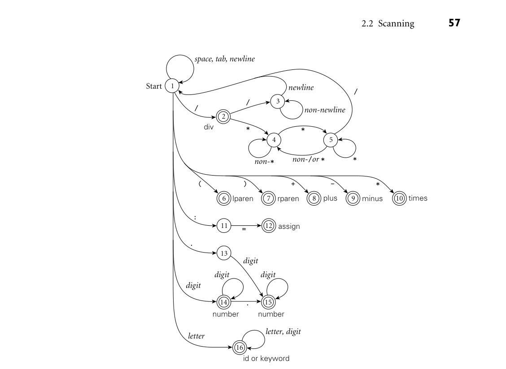
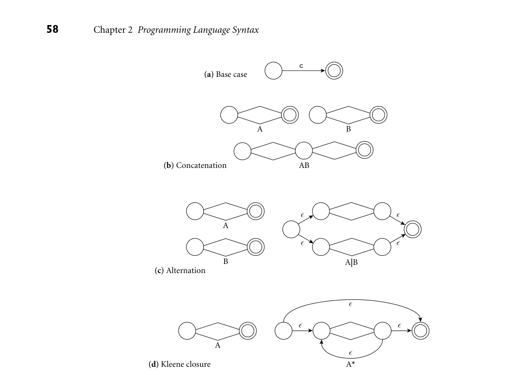
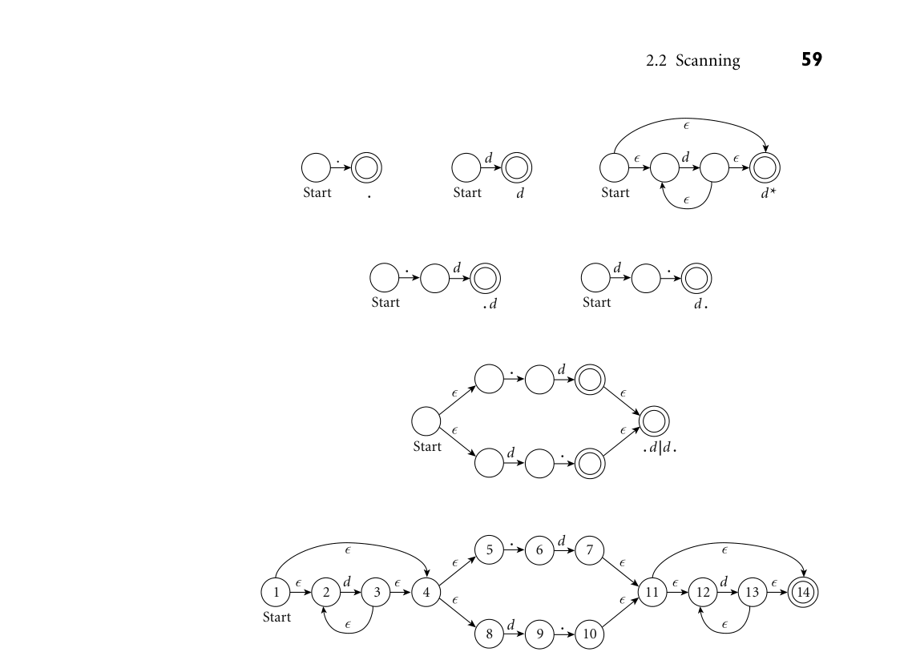
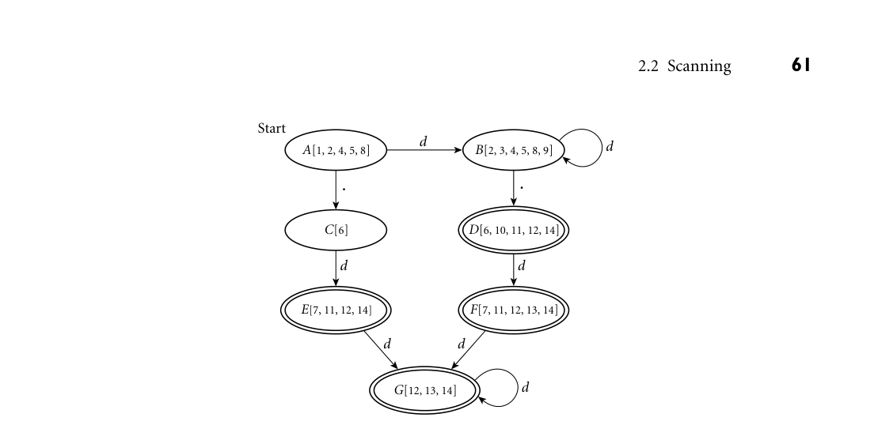
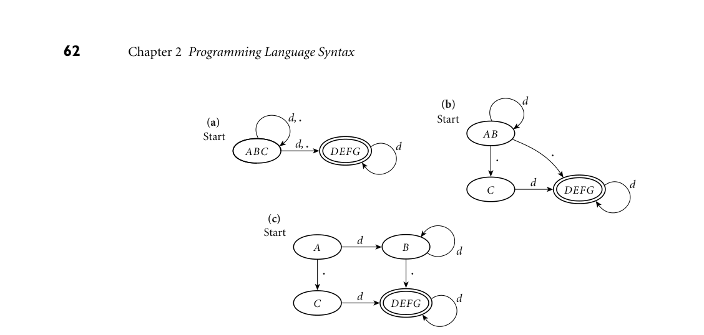
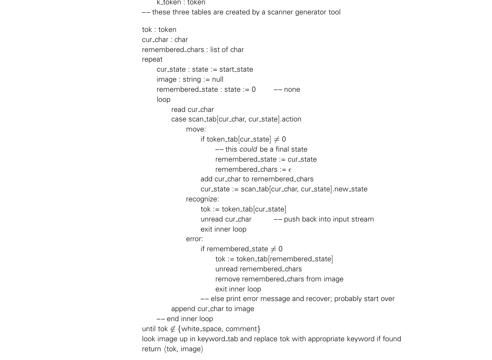
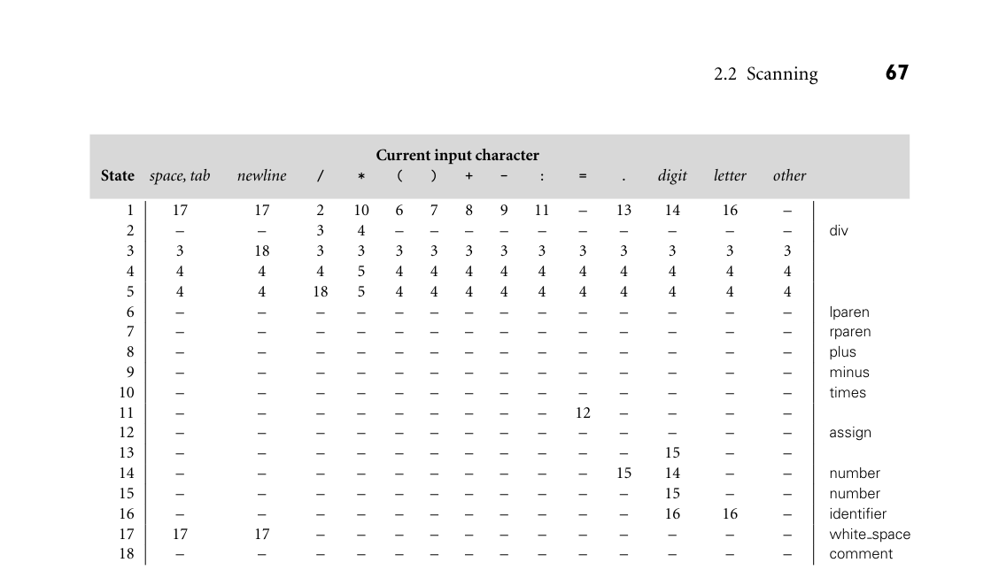

# 2.2 Scanning

54 Chapter 2 Programming Language Syntax

2.2 Scanning

Together, the scanner and parser for a programming language are responsible for discovering the syntactic structure of a program. This process of discovery, or syntax analysis, is a necessary first step toward translating the program into an equivalent program in the target language. (It’s also the first step toward inter- preting the program directly. In general, we will focus on compilation, rather than interpretation, for the remainder of the book. Most of what we shall dis- cuss either has an obvious application to interpretation, or is obviously irrelevant to it.) By grouping input characters into tokens, the scanner dramatically reduces the number of individual items that must be inspected by the more computationally intensive parser. In addition, the scanner typically removes comments (so the parser doesn’t have to worry about them appearing throughout the context-free grammar—see Exercise 2.20); saves the text of “interesting” tokens like identifiers, strings, and numeric literals; and tags tokens with line and column numbers, to make it easier to generate high-quality error messages in subsequent phases. In Examples 2.4 and 2.8 we considered a simple language for arithmetic expres- EXAMPLE 2.9

Tokens for a calculator language sions. In Section 2.3.1 we will extend this to create a simple “calculator language” with input, output, variables, and assignment. For this language we will use the following set of tokens:

assign −→:=

plus −→+

minus −→-

times −→*

div −→/

lparen −→(

rparen −→)

id −→letter ( letter | digit )* except for read and write

number −→digit digit * | digit * ( . digit | digit . ) digit *

In keeping with Algol and its descendants (and in contrast to the C-family lan- guages), we have used := rather than = for assignment. For simplicity, we have omitted the exponential notation found in Example 2.3. We have also listed the tokens read and write as exceptions to the rule for id (more on this in Sec- tion 2.2.2). To make the task of the scanner a little more realistic, we borrow the two styles of comment from C:

comment −→/* ( non-* | * non-/ )* *+ / | // ( non-newline )* newline

Here we have used non-*, non-/, and non-newline as shorthand for the alterna- tion of all characters other than *, /, and newline, respectively. ■

2.2 Scanning 55

How might we go about recognizing the tokens of our calculator language? The EXAMPLE 2.10

An ad hoc scanner for calculator tokens simplest approach is entirely ad hoc. Pseudocode appears in Figure 2.5. We can structure the code however we like, but it seems reasonable to check the simpler and more common cases first, to peek ahead when we need to, and to embed loops for comments and for long tokens such as identifiers and numbers. After finding a token the scanner returns to the parser. When invoked again it repeats the algorithm from the beginning, using the next available characters of input (including any that were peeked at but not consumed the last time). ■ As a rule, we accept the longest possible token in each invocation of the scan- ner. Thus foobar is always foobar and never f or foo or foob. More to the point, in a language like C, 3.14159 is a real number and never 3, ., and 14159. White space (blanks, tabs, newlines, comments) is generally ignored, except to the extent that it separates tokens (e.g., foo bar is different from foobar). Figure 2.5 could be extended fairly easily to outline a scanner for some larger programming language. The result could then be fleshed out, by hand, to create code in some implementation language. Production compilers often use such ad hoc scanners; the code is fast and compact. During language development, however, it is usually preferable to build a scanner in a more structured way, as an explicit representation of a finite automaton. Finite automata can be generated automatically from a set of regular expressions, making it easy to regenerate a scanner when token definitions change. An automaton for the tokens of our calculator language appears in pictorial EXAMPLE 2.11

Finite automaton for a calculator scanner form in Figure 2.6. The automaton starts in a distinguished initial state. It then moves from state to state based on the next available character of input. When it reaches one of a designated set of final states it recognizes the token associated with that state. The “longest possible token” rule means that the scanner returns to the parser only when the next character cannot be used to continue the current token. ■

DESIGN & IMPLEMENTATION

2.3 Nested comments Nested comments can be handy for the programmer (e.g., for temporarily “commenting out” large blocks of code). Scanners normally deal only with nonrecursive constructs, however, so nested comments require special treat- ment. Some languages disallow them. Others require the language implemen- tor to augment the scanner with special-purpose comment-handling code. C and C++ strike a compromise: /* ... */ style comments are not allowed to nest, but /* ... */ and //... style comments can appear inside each other. The programmer can thus use one style for “normal” comments and the other for “commenting out.” (The C99 designers note, however, that conditional compilation (#if) is preferable [Int03a, p. 58].)

*Figure 2.5 Outline of an ad hoc scanner for tokens in our calculator language.*

2.2.1 Generating a Finite Automaton

While a finite automaton can in principle be written by hand, it is more com- mon to build one automatically from a set of regular expressions, using a scanner generator tool. For our calculator language, we should like to covert the regular expressions of Example 2.9 into the automaton of Figure 2.6. That automaton has the desirable property that its actions are deterministic: in any given state with a given input character there is never more than one possible outgoing transition (arrow) labeled by that character. As it turns out, however, there is no obvious one-step algorithm to convert a set of regular expressions into an equivalent de- terministic finite automaton (DFA). The typical scanner generator implements the conversion as a series of three separate steps. The first step converts the regular expressions into a nondeterministic finite automaton (NFA). An NFA is like a DFA except that (1) there may be more than one transition out of a given state labeled by a given character, and (2) there may be so-called epsilon transitions: arrows labeled by the empty string symbol, ϵ. The NFA is said to accept an input string (token) if there exists a path from the start

*Figure 2.6 Pictorial representation of a scanner for calculator tokens, in the form of a finite automaton. This figure roughly parallels the code in Figure 2.5. States are numbered for reference in Figure 2.12. Scanning for each token begins in the state marked “Start.” The final states, in which a token is recognized, are indicated by double circles. Comments, when recognized, send the scanner back to its start state, rather than a final state.*

state to a final state whose non-epsilon transitions are labeled, in order, by the characters of the token. To avoid the need to search all possible paths for one that “works,” the second step of a scanner generatortranslates the NFA into an equivalentDFA: an automa- ton that accepts the same language, but in which there are no epsilon transitions, and no states with more than one outgoing transition labeled by the same char- acter. The third step is a space optimization that generates a final DFA with the minimum possible number of states.

*Figure 2.7 Construction of an NFA equivalent to a given regular expression. Part (a) shows the base case: the automaton for the single letter c. Parts (b), (c), and (d), respectively, show the constructions for concatenation, alternation, and Kleene closure. Each construction retains a unique start state and a single final state. Internal detail is hidden in the diamond-shaped center regions.*

From a Regular Expression to an NFA

A trivial regular expression consisting of a single character c is equivalent to a EXAMPLE 2.12

Constructing an NFA for a given regular expression simple two-state NFA (in fact, a DFA), illustrated in part (a) of Figure 2.7. Simi- larly, the regular expression ϵ is equivalent to a two-state NFA whose arc is labeled by ϵ. Starting with this base we can use three subconstructions, illustrated in parts (b) through (d) of the same figure, to build larger NFAs to represent the concate- nation, alternation, or Kleene closure of the regular expressions represented by smaller NFAs. Each step preserves three invariants: there are no transitions into the initial state, there is a single final state, and there are no transitions out of the final state. These invariants allow smaller automata to be joined into larger

*Figure 2.8 Construction of an NFA equivalent to the regular expression d*( .d | d. ) d*. In the top row are the primitive automata for . and d, and the Kleene closure construction for d*. In the second and third rows we have used the concatenation and alternation constructions to build .d, d., and ( .d | d. ) . The fourth row uses concatenation again to complete the NFA. We have labeled the states in the final automaton for reference in subsequent figures.*

ones without any ambiguity about where to create the connections, and without creating any unexpected paths. ■ To make these constructions concrete, we consider a small but nontrivial EXAMPLE 2.13

NFA for d*( .d | d. ) d* example—the decimal strings of Example 2.3. These consist of a string of decimal digits containing a single decimal point. With only one digit, the point can come at the beginning or the end: ( .d | d. ), where for brevity we use d to represent any decimal digit. Arbitrary numbers of digits can then be added at the beginning or the end: d*( .d | d. ) d*. Starting with this regular expression and using the constructions of Figure 2.7, we illustrate the construction of an equivalent NFA in Figure 2.8. ■

60 Chapter 2 Programming Language Syntax

From an NFA to a DFA

With no way to “guess” the right transition to take from any given state, any prac- EXAMPLE 2.14

DFA for d*( .d | d. ) d* tical implementation of an NFA would need to explore all possible transitions, concurrently or via backtracking. To avoid such a complex and time-consuming strategy, we can use a “set of subsets” construction to transform the NFA into an equivalent DFA. The key idea is for the state of the DFA after reading a given input to represent the set of states that the NFA might have reached on the same input. We illustrate the construction in Figure 2.9 using the NFA from Figure 2.8. Initially, before it consumes any input, the NFA may be in State 1, or it may make epsilon transitions to States 2, 4, 5, or 8. We thus create an initial State A for our DFA to represent this set. On an input of d, our NFA may move from State 2 to State 3, or from State 8 to State 9. It has no other transitions on this input from any of the states in A. From State 3, however, the NFA may make epsilon transitions to any of States 2, 4, 5, or 8. We therefore create DFA State B as shown. On a ., our NFA may move from State 5 to State 6. There are no other transi- tions on this input from any of the states in A, and there are no epsilon transitions out of State 6. We therefore create the singleton DFA State C as shown. None of States A, B, or C is marked as final, because none contains a final state of the original NFA. Returning to State B of the growing DFA, we note that on an input of d the original NFA may move from State 2 to State 3, or from State 8 to State 9. From State 3, in turn, it may move to States 2, 4, 5, or 8 via epsilon transitions. As these are exactly the states already in B, we create a self-loop in the DFA. Given a ., on the other hand, the original NFA may move from State 5 to State 6, or from State 9 to State 10. From State 10, in turn, it may move to States 11, 12, or 14 via epsilon transitions. We therefore create DFA State D as shown, with a transition on . from B to D. State D is marked as final because it contains state 14 of the original NFA. That is, given input d., there exists a path from the start state to the end state of the original NFA. Continuing our enumeration of state sets, we end up creating three more, labeled E, F, and G in Figure 2.9. Like State D, these all contain State 14 of the original NFA, and thus are marked as final. ■ In our example, the DFA ends up being smaller than the NFA, but this is only because our regular language is so simple. In theory, the number of states in the DFA may be exponential in the number of states in the NFA, but this extreme is also uncommon in practice. For a programming language scanner, the DFA tends to be larger than the NFA, but not outlandishly so. We consider space complexity in more detail in Section C 2.4.1.

Minimizing the DFA

Starting from a regular expression, we have now constructed an equivalent DFA. Though this DFA has seven states, a bit of thought suggests that a smaller one EXAMPLE 2.15

Minimal DFA for d*( .d | d. ) d* should exist. In particular, once we have seen both a d and a ., the only valid transitions are on d, and we ought to be able to make do with a single final state.

*Figure 2.9 A DFA equivalent to the NFA at the bottom of Figure 2.8. Each state of the DFA represents the set of states that the NFA could be in after seeing the same input.*

We can formalize this intuition, allowing us to apply it to any DFA, via the fol- lowing inductive construction. Initially we place the states of the (not necessarily minimal) DFA into two equivalence classes: final states and nonfinal states. We then repeatedly search for an equivalence class X and an input symbol c such that when given c as input, the states in X make transitions to states in k > 1 different equivalence classes. We then partition X into k classes in such a way that all states in a given new class would move to a member of the same old class on c. When we are unable to find a class to partition in this fashion we are done. In our example, the original placement puts States D, E, F, and G in one class (final states) and States A, B, and C in another, as shown in the upper left of Figure 2.10. Unfortunately, the start state has ambiguous transitions on both d and .. To address the d ambiguity, we split ABC into AB and C, as shown in the upper right. New State AB has a self-loop on d; new State C moves to State DEFG. State AB still has an ambiguity on ., however, which we resolve by splitting it into States A and B, as shown at the bottom of the figure. At this point there are no further ambiguities, and we are left with a four-state minimal DFA. ■

2.2.2 Scanner Code

We can implement a scanner that explicitly captures the “circles-and-arrows” structure of a DFA in either of two main ways. One embeds the automaton in the control flow of the program using gotos or nested case (switch) statements; the other, described in the following subsection, uses a table and a driver. As a general rule, handwritten automata tend to use nested case statements, while

*Figure 2.10 Minimization of the DFA of Figure 2.9. In each step we split a set of states to eliminate a transition ambiguity.*

most automatically generated automata use tables. Tables are hard to create by hand, but easier than code to create from within a program. Likewise, nested case statements are easier to write and to debug than the ad hoc approach of Fig- ure 2.5, if not quite as efficient. Unix’s lex/flex tool produces C language output containing tables and a customized driver. The nested case statement style of automaton has the following general struc- EXAMPLE 2.16

Nested case statement automaton ture:

state := 1 –– start state loop read cur char case state of 1 : case cur char of ‘ ’, ‘\t’, ‘\n’ : . . . ‘a’. . . ‘z’ : . . . ‘0’. . . ‘9’ : . . . ‘>’ : . . . . . . 2 : case cur char of . . . . . . n: case cur char of . . .

The outer case statement covers the states of the finite automaton. The inner case statements cover the transitions out of each state. Most of the inner clauses simply set a new state. Some return from the scanner with the current token. (If

2.2 Scanning 63

the current character should not be part of that token, it is pushed back onto the input stream before returning.) ■ Two aspects of the code typically deviate from the strict form of a formal finite automaton. One is the handling of keywords. The other is the need to peek ahead when a token can validly be extended by two or more additional characters, but not by only one. As noted at the beginning of Section 2.1.1, keywords in most languages look just like identifiers, but are reserved for a special purpose (some authors use the term reserved word instead of keyword). It is possible to write a finite automaton that distinguishes between keywords and identifiers, but it requires a lot of states (see Exercise 2.3). Most scanners, both handwritten and automatically generated, therefore treat keywords as “exceptions” to the rule for identifiers. Before return-

DESIGN & IMPLEMENTATION

2.4 Recognizing multiple kinds of token One of the chief ways in which a scanner differs from a formal DFA is that it identifies tokens in addition to recognizing them. That is, it not only deter- mines whether characters constitute a valid token; it also indicates which one. In practice, this means that it must have separate final states for every kind of token. We glossed over this issue in our RE-to-DFA constructions. To build a scanner for a language with n different kinds of tokens, we begin with an NFA of the sort suggested in the figure here. Given NFAs Mi, 1 ≤i ≤n (one au- tomaton for each kind of token), we cre- ate a new start state with epsilon transi- tions to the start states of the Mis. In con- trast to the alternation construction of Fig- ure 2.7(c), however, we do not create a single final state; we keep the existing ones, each labeled by the token for which it is final.

M1

ϵ

Start

M2

ϵ

Mn ...

ϵ

We then apply the NFA-to-DFA construction as before. (If final states for dif- ferent tokens in the NFA ever end up in the same state of the DFA, then we have ambiguous token definitions. These may be resolved by changing the reg- ular expressions from which the NFAs were derived, or by wrapping additional logic around the DFA.) In the DFA minimization construction, instead of starting with two equiv- alence classes (final and nonfinal states), we begin with n + 1, including a sep- arate class for final states for each of the kinds of token. Exercise 2.5 explores this construction for a scanner that recognizes both the integer and decimal types of Example 2.3.

64 Chapter 2 Programming Language Syntax

ing an identifier to the parser, the scanner looks it up in a hash table or trie (a tree of branching paths) to make sure it isn’t really a keyword.10 Whenever one legitimate token is a prefix of another, the “longest possible to- ken” rule says that we should continue scanning. If some of the intermediate strings are not valid tokens, however, we can’t tell whether a longer token is pos- sible without looking more than one character ahead. This problem arises with EXAMPLE 2.17

The nontrivial prefix problem dot characters (periods) in C. Suppose the scanner has just seen a 3 and has a dot coming up in the input. It needs to peek at characters beyond the dot in order to distinguish between 3.14 (a single token designating a real number), 3 . foo (three tokens that the scanner should accept, even though the parser will object to seeing them in that order), and 3 ... foo (again not syntactically valid, but three separate tokens nonetheless). In general, upcoming characters that a scan- ner must examine in order to make a decision are known as its look-ahead. In Section 2.3 we will see a similar notion of look-ahead tokens in parsing. ■ In messier languages, a scanner may need to look an arbitrary distance ahead. In Fortran IV, for example, DO 5 I = 1,25 is the header of a loop (it executes the EXAMPLE 2.18

Look-ahead in Fortran scanning statements up to the one labeled 5 for values of I from 1 to 25), while DO 5 I = 1.25 is an assignment statement that places the value 1.25 into the variable DO5I. Spaces are ignored in (pre-Fortran 90) Fortran input, even in the middle of variable names. Moreover, variables need not be declared, and the terminator for a DO loop is simply a label, which the parser can ignore. After seeing DO, the scanner cannot tell whether the 5 is part of the current token until it reaches the comma or dot. It has been widely (but apparently incorrectly) claimed that NASA’s Mariner 1 space probe was lost due to accidental replacement of a comma with a dot in a case similar to this one in flight control software.11 Dialects of Fortran starting with Fortran 77 allow (in fact encourage) the use of alternative

DESIGN & IMPLEMENTATION

2.5 Longest possible tokens A little care in syntax design—avoiding tokens that are nontrivial prefixes of other tokens—can dramatically simplify scanning. In straightforward cases of prefix ambiguity, the scanner can enforce the “longest possible token” rule automatically. In Fortran, however, the rules are sufficiently complex that no purely lexical solution suffices. Some of the problems, and a possible solution, are discussed in an article by Dyadkin [Dya95].

10 Many languages include predefined identifiers (e.g., for standard library functions), but these are not keywords. The programmer can redefine them, so the scanner must treat them the same as other identifiers. Contextual keywords, similarly, must be treated by the scanner as identifiers.

11 In actuality, the faulty software for Mariner 1 appears to have stemmed from a missing “bar” punctuation mark (indicating an average) in handwritten notes from which the software was derived [Cer89, pp. 202–203]. The Fortran DO loop error does appear to have occurred in at least one piece of NASA software, but no serious harm resulted [Web89].

2.2 Scanning 65

syntax for loop headers, in which an extra comma makes misinterpretation less likely: DO 5,I = 1,25. ■ In C, the dot character problem can easily be handled as a special case. In languages requiring larger amounts of look-ahead, the scanner can take a more general approach. In any case of ambiguity, it assumes that a longer token will be possible, but remembers that a shorter token could have been recognized at some point in the past. It also buffers all characters read beyond the end of the shorter token. If the optimistic assumption leads the scanner into an error state, it “unreads” the buffered characters so that they will be seen again later, and returns the shorter token.

2.2.3 Table-Driven Scanning

In the preceding subsection we sketched how control flow—a loop and nested case statements—can be used to represent a finite automaton. An alternative ap- EXAMPLE 2.19

Table-driven scanning proach representsthe automaton as a data structure: a two-dimensional transition table. A driver program (Figure 2.11) uses the current state and input character to index into the table. Each entry in the table specifies whether to move to a new state (and if so, which one), return a token, or announce an error. A second table indicates, for each state, whether we might be at the end of a token (and if so, which one). Separating this second table from the first allows us to notice when we pass a state that might have been the end of a token, so we can back up if we hit an error state. Example tables for our calculator tokens appear in Figure 2.12. Like a handwritten scanner, the table-driven code of Figure 2.11 looks tokens up in a table of keywords immediately before returning. An outer loop serves to filter out comments and “white space”—spaces, tabs, and newlines. ■

2.2.4 Lexical Errors

The code in Figure 2.11 explicitly recognizes the possibility of lexical errors. In some cases the next character of input may be neither an acceptable continuation of the current token nor the start of another token. In such cases the scanner must print an error message and perform some sort of recovery so that compilation can continue, if only to look for additional errors. Fortunately, lexical errors are rel- atively rare—most character sequences do correspond to token sequences—and relatively easy to handle. The most common approach is simply to (1) throw away the current, invalid token; (2) skip forward until a character is found that can le- gitimately begin a new token; (3) restart the scanning algorithm; and (4) count on the error-recovery mechanism of the parser to cope with any cases in which the resulting sequence of tokens is not syntactically valid. Of course the need for error recovery is not unique to table-driven scanners; any scanner must cope with errors. We did not show the code in Figure 2.5, but it would have to be there in practice.

66 Chapter 2 Programming Language Syntax

*Figure 2.11 Driver for a table-driven scanner, with code to handle the ambiguous case in which one valid token is a prefix of another, but some intermediate string is not.*

*Figure 2.12 Scanner tables for the calculator language. These could be used by the code of Figure 2.11. States are numbered as in Figure 2.6, except for the addition of two states—17 and 18—to “recognize” white space and comments. The right-hand column represents table token tab; the rest of the figure is scan tab. Numbers in the table indicate an entry for which the corresponding action is move. Dashes appear where there is no way to extend the current token: if the corresponding entry in token tab is nonempty, then action is recognize; otherwise, action is error. Table keyword tab (not shown) contains the strings read and write.*

The code in Figure 2.11 also shows that the scanner must return both the kind of token found and its character-string image (spelling); again this requirement applies to all types of scanners. For some tokens the character-string image is redundant: all semicolons look the same, after all, as do all while keywords. For other tokens, however (e.g., identifiers, character strings, and numeric constants), the image is needed for semantic analysis. It is also useful for error messages: “undeclared identifier” is not as nice as “foo has not been declared.”

2.2.5 Pragmas

Some languages and language implementations allow a program to contain con- structs called pragmas that provide directives or hints to the compiler. Prag- mas that do not change program semantics—only the compilation process—are sometimes called significant comments. In some languages the name is also ap- propriate because, like comments, pragmas can appear anywhere in the source program. In this case they are usually processed by the scanner: allowing them anywhere in the grammar would greatly complicate the parser. In most languages,

68 Chapter 2 Programming Language Syntax

however, pragmas are permitted only at certain well-defined places in the gram- mar. In this case they are best processed by the parser or semantic analyzer. Pragmas that serve as directives may

Turn various kinds of run-time checks (e.g., pointer or subscript checking) on or off Turn certain code improvements on or off (e.g., on in inner loops to improve performance; off otherwise to improve compilation speed) Enable or disable performance profiling (statistics gathering to identify pro- gram bottlenecks)

Some directives “cross the line” and change program semantics. In Ada, for ex- ample, the unchecked pragma can be used to disable type checking. In OpenMP, which we will consider in Chapter 13, pragmas specify significant parallel exten- sions to Fortran, C and C++: creating, scheduling, and synchronizing threads. In this case the principal rationale for expressing the extensions as pragmas rather than more deeply integrated changes is to sharply delineate the boundary between the core language and the extensions, and to share a common set of extensions across languages. Pragmas that serve (merely) as hints provide the compiler with information about the source program that may allow it to do a better job:

Variable x is very heavily used (it may be a good idea to keep it in a register). Subroutine F is a pure function: its only effect on the rest of the program is the value it returns. Subroutine S is not (indirectly) recursive (its storage may be statically allo- cated). 32 bits of precision (instead of 64) suffice for floating-point variable x.

The compiler may ignore these in the interest of simplicity, or in the face of con- tradictory information. Standard syntax for pragmas was introduced in C++11 (where they are known as “attributes”). A function that prints an error message and terminates execu- tion, for example, can be labeled [[noreturn]], to allow the compiler to opti- mize code around calls, or to issue more helpful error or warning messages. As of this writing, the set of supported attributes can be extended by vendors (by modifying the compiler), but not by ordinary programmers. The extent to which these attributes should be limited to hints (rather than directives) has been some- what controversial. New pragmas in Java (which calls them “annotations”) and C# (which calls them “attributes”) can be defined by the programmer; we will return to these in Section 16.3.1.

