# 2.3 Parsing

3CHECK YOUR UNDERSTANDING 10. List the tasks performed by the typical scanner. 11. What are the advantages of an automatically generated scanner, in compari- son to a handwritten one? Why do many commercial compilers use a hand- written scanner anyway?

12. Explain the difference between deterministic and nondeterministic finite au- tomata. Why do we prefer the deterministic variety for scanning?

13. Outline the constructions used to turn a set of regular expressions into a min- imal DFA. 14. What is the “longest possible token” rule? 15. Why must a scanner sometimes “peek” at upcoming characters?

16. What is the difference between a keyword and an identifier? 17. Why must a scanner save the text of tokens?

18. How does a scanner identify lexical errors? How does it respond? 19. What is a pragma?

2.3 Parsing

The parser is the heart of a typical compiler. It calls the scanner to obtain the tokens of the input program, assembles the tokens together into a syntax tree, and passes the tree (perhaps one subroutine at a time) to the later phases of the compiler, which perform semantic analysis and code generation and improve- ment. In effect, the parser is “in charge” of the entire compilation process; this style of compilation is sometimes referred to as syntax-directed translation. As noted in the introduction to this chapter, a context-free grammar (CFG) is a generator for a CF language. A parser is a language recognizer. It can be shown that for any CFG we can create a parser that runs in O(n3) time, where n is the length of the input program.12 There are two well-known parsing algorithms that achieve this bound: Earley’s algorithm [Ear70] and the Cocke-Younger-Kasami (CYK) algorithm [Kas65, You67]. Cubic time is much too slow for parsing siz- able programs, but fortunately not all grammars require such a general and slow parsing algorithm. There are large classes of grammars for which we can build parsers that run in linear time. The two most important of these classes are called LL and LR (Figure 2.13).

12 In general, an algorithm is said to run in time O(f (n)), where n is the length of the input, if its running time t(n) is proportional to f (n) in the worst case. More precisely, we say t(n) = O(f (n)) ⇐⇒∃c, m [n > m −→t(n) < c f (n)].

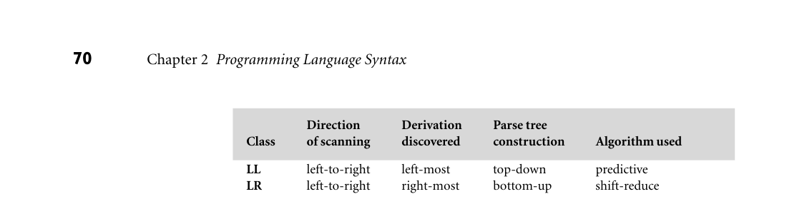
*Figure 2.13 Principal classes of linear-time parsing algorithms.*

LL stands for “Left-to-right, Left-most derivation.” LR stands for “Left-to- right, Right-most derivation.” In both classes the input is read left-to-right, and the parser attempts to discover (construct) a derivation of that input. For LL parsers, the derivation will be left-most; for LR parsers, right-most. We will cover LL parsers first. They are generally considered to be simpler and easier to under- stand. They can be written by hand or generated automatically from an appropri- ate grammar by a parser-generating tool. The class of LR grammars is larger (i.e., more grammars are LR than LL), and some people find the structure of the LR grammars more intuitive, especially in the handling of arithmetic expressions. LR parsers are almost always constructed by a parser-generating tool. Both classes of parsers are used in production compilers, though LR parsers are more common. LL parsers are also called “top-down,” or “predictive” parsers. They construct a parse tree from the root down, predicting at each step which production will be used to expand the current node, based on the next available token of input. LR parsers are also called “bottom-up” parsers. They construct a parse tree from the leaves up, recognizing when a collection of leaves or other nodes can be joined together as the children of a single parent. We can illustrate the difference between top-down and bottom-up parsing EXAMPLE 2.20

Top-down and bottom-up parsing by means of a simple example. Consider the following grammar for a comma- separated list of identifiers, terminated by a semicolon:

id list −→id id list tail

id list tail −→, id id list tail

id list tail −→;

These are the productions that would normally be used for an identifier list in a top-down parser. They can also be parsed bottom-up (most top-down grammars can be). In practice they would not be used in a bottom-up parser, for reasons that will become clear in a moment, but the ability to handle them either way makes them good for this example. Progressive stages in the top-down and bottom-up construction of a parse tree for the string A, B, C; appear in Figure 2.14. The top-down parser begins by predicting that the root of the tree (id list) will expand to id id list tail. It then matches the id against a token obtained from the scanner. (If the scanner pro- duced something different, the parser would announce a syntax error.) The parser then moves down into the first (in this case only) nonterminal child and predicts that id list tail will expand to , id id list tail. To make this prediction it needs

id(A)

id_list

id(A) ,

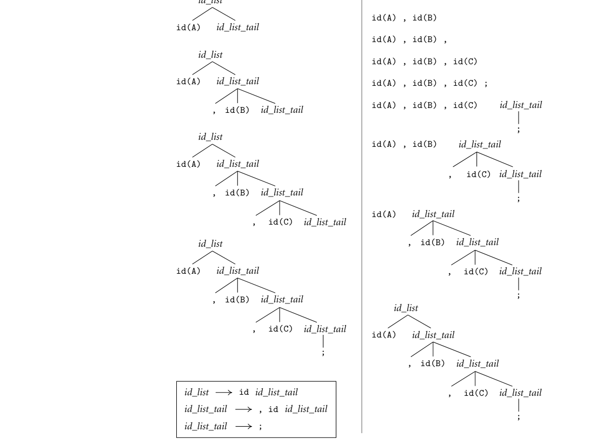
*Figure 2.14 Top-down (left) and bottom-up parsing (right) of the input string A, B, C;. Grammar appears at lower left.*

to peek at the upcoming token (a comma), which allows it to choose between the two possible expansions for id list tail. It then matches the comma and the id and moves down into the next id list tail. In a similar, recursive fashion, the top- down parser works down the tree, left-to-right, predicting and expanding nodes and tracing out a left-most derivation of the fringe of the tree.

The bottom-up parser, by contrast, begins by noting that the left-most leaf of the tree is an id. The next leaf is a comma and the one after that is another id. The parser continues in this fashion, shifting new leaves from the scanner into a forest of partially completed parse tree fragments, until it realizes that some of those fragments constitute a complete right-hand side. In this grammar, that doesn’t occur until the parser has seen the semicolon—the right-hand side of id list tail −→;. With this right-hand side in hand, the parser reduces the semi- colon to an id list tail. It then reduces , id id list tail into another id list tail. After doing this one more time it is able to reduce id id list tail into the root of the parse tree, id list. At no point does the bottom-up parser predict what it will see next. Rather, it shifts tokens into its forest until it recognizes a right-hand side, which it then reduces to a left-hand side. Because of this behavior, bottom-up parsers are some- times called shift-reduce parsers. Moving up the figure, from bottom to top, we can see that the shift-reduce parser traces out a right-most derivation, in reverse. Because bottom-up parsers were the first to receive careful formal study, right- most derivations are sometimes called canonical. ■ There are several important subclasses of LR parsers, including SLR, LALR, and “full LR.” SLR and LALR are important for their ease of implementation, full LR for its generality. LL parsers can also be grouped into SLL and “full LL” subclasses. We will cover the differences among them only briefly here; for fur- ther information see any of the standard compiler-construction or parsing theory textbooks [App97, ALSU07, AU72, CT04, FCL10, GBJ+12]. One commonly sees LL or LR (or whatever) written with a number in paren- theses after it: LL(2) or LALR(1), for example. This number indicates how many tokens of look-ahead are required in order to parse. Most real compilers use just one token of look-ahead, though more can sometimes be helpful. The open- source ANTLR tool, in particular, uses multitoken look-ahead to enlarge the class of languages amenable to top-down parsing [PQ95]. In Section 2.3.1 we will look at LL(1) grammars and handwritten parsers in more detail. In Sections 2.3.3 and 2.3.4 we will consider automatically generated LL(1) and LR(1) (ac- tually SLR(1)) parsers. The problem with our example grammar, for the purposes of bottom-up pars- EXAMPLE 2.21

Bounding space with a bottom-up grammar ing, is that it forces the compiler to shift all the tokens of an id list into its forest before it can reduce any of them. In a very large program we might run out of space. Sometimes there is nothing that can be done to avoid a lot of shifting. In this case, however, we can use an alternative grammar that allows the parser to reduce prefixes of the id list into nonterminals as it goes along:

id list −→id list prefix ;

id list prefix −→id list prefix , id

−→id

This grammar cannot be parsed top-down, because when we see an id on the input and we’re expecting an id list prefix, we have no way to tell which of the two

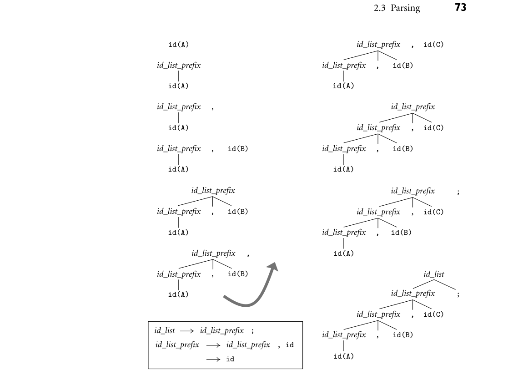
*Figure 2.15 Bottom-up parse of A, B, C; using a grammar (lower left) that allows lists to be collapsed incrementally.*

possible productions we should predict (more on this dilemma in Section 2.3.2). As shown in Figure 2.15, however, the grammar works well bottom-up. ■

2.3.1 Recursive Descent

To illustrate top-down (predictive) parsing, let us consider the grammar for a sim- EXAMPLE 2.22

Top-down grammar for a calculator language ple “calculator” language, shown in Figure 2.16. The calculator allows values to be read into named variables, which may then be used in expressions. Expressions in turn may be written to the output. Control flow is strictly linear (no loops, if statements, or other jumps). In a pattern that will repeat in many of our examples, we have included an initial augmenting production, program −→stmt list $$,

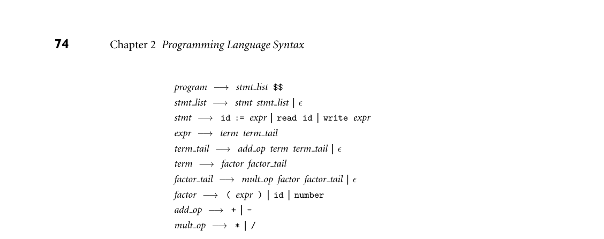
*Figure 2.16 LL(1) grammar for a simple calculator language.*

which arranges for the “real” body of the program (stmt list) to be followed by a special end marker token, $$. The end marker is produced by the scanner at the end of the input. Its presence allows the parser to terminate cleanly once it has seen the entire program, and to decline to accept programs with extra garbage tokens at the end. As in regular expressions, we use the symbol ϵ to denote the empty string. A production with ϵ on the right-hand side is sometimes called an epsilon production. It may be helpful to compare the expr portion of Figure 2.16 to the expression grammar of Example 2.8. Most people find that previous, LR grammar to be significantly more intuitive. It suffers, however, from a problem similar to that of the id list grammar of Example 2.21: if we see an id on the input when expecting an expr, we have no way to tell which of the two possible productions to predict. The grammar of Figure 2.16 avoids this problem by merging the common prefixes of right-hand sides into a single production, and by using new symbols (term tail and factor tail) to generate additional operators and operands as required. The transformation has the unfortunate side effect of placing the operands of a given operator in separate right-hand sides. In effect, we have sacrificed grammatical elegance in order to be able to parse predictively. ■ So how do we parse a string with our calculator grammar? We saw the basic idea in Figure 2.14. We start at the top of the tree and predict needed productions on the basis of the current left-most nonterminal in the tree and the current in- put token. We can formalize this process in one of two ways. The first, described in the remainder of this subsection, is to build a recursive descent parser whose subroutines correspond, one-one, to the nonterminals of the grammar. Recur- sive descent parsers are typically constructed by hand, though the ANTLR parser generator constructs them automatically from an input grammar. The second approach, described in Section 2.3.3, is to build an LL parse table which is then read by a driver program. Table-driven parsers are almost always constructed automatically by a parser generator. These two options—recursive descent and table-driven—are reminiscent of the nested case statements and table-driven ap-

proaches to building a scanner that we saw in Sections 2.2.2 and 2.2.3. It should be emphasized that they implement the same basic parsing algorithm. Handwritten recursive descent parsers are most often used when the language to be parsed is relatively simple, or when a parser-generator tool is not available. There are exceptions, however. In particular, recursive descent appears in recent versions of the GNU compiler collection (gcc). Earlier versions used bison to create a bottom-up parser automatically. The change was made in part for perfor- mance reasons and in part to enable the generation of higher-quality syntax error messages. (The bison code was easier to write, and arguably easier to maintain.) Pseudocode for a recursive descent parser for our calculator language appears EXAMPLE 2.23

Recursive descent parser for the calculator language in Figure 2.17. It has a subroutine for every nonterminal in the grammar. It also has a mechanism input token to inspect the next token available from the scanner and a subroutine (match) to consume and update this token, and in the process verify that it is the one that was expected (as specified by an argument). If match or any of the other subroutines sees an unexpected token, then a syntax error has occurred. For the time being let us assume that the parse error subroutine simply prints a message and terminates the parse. In Section 2.3.5 we will consider how to recover from such errors and continue to parse the remainder of the input. ■

Suppose now that we are to parse a simple program to read two numbers and EXAMPLE 2.24

print their sum and average:

Recursive descent parse of a “sum and average” program

read A read B sum := A + B write sum write sum / 2

The parse tree for this program appears in Figure 2.18. The parser begins by calling the subroutine program. After noting that the initial token is a read, program calls stmt list and then attempts to match the end-of-file pseudoto- ken. (In the parse tree, the root, program, has two children, stmt list and $$.) Procedure stmt list again notes that the upcoming token is a read. This ob- servation allows it to determine that the current node (stmt list) generates stmt stmt list (rather than ϵ). It therefore calls stmt and stmt list before returning. Continuing in this fashion, the execution path of the parser traces out a left-to- right depth-first traversal of the parse tree. This correspondence between the dy- namic execution trace and the structure of the parse tree is the distinguishing characteristic of recursive descent parsing. Note that because the stmt list non- terminal appears in the right-hand side of a stmt list production, the stmt list subroutine must call itself. This recursion accounts for the name of the parsing technique. ■ Without additional code (not shown in Figure 2.17), the parser merely ver- ifies that the program is syntactically correct (i.e., that none of the otherwise parse error clauses in the case statements are executed and that match always sees what it expects to see). To be of use to the rest of the compiler—which must produce an equivalent target program in some other language—the parser must

procedure match(expected) if input token = expected then consume input token() else parse error

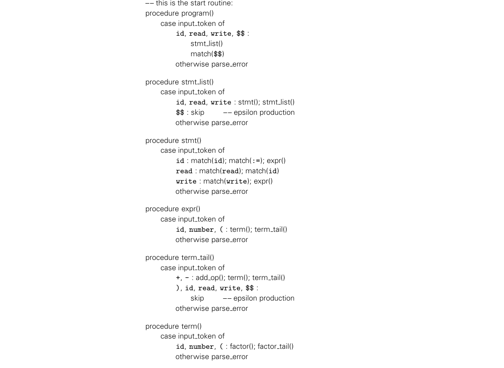
*Figure 2.17 Recursive descent parser for the calculator language. Execution begins in proce- dure program. The recursive calls trace out a traversal of the parse tree. Not shown is code to save this tree (or some similar structure) for use by later phases of the compiler. (continued)*

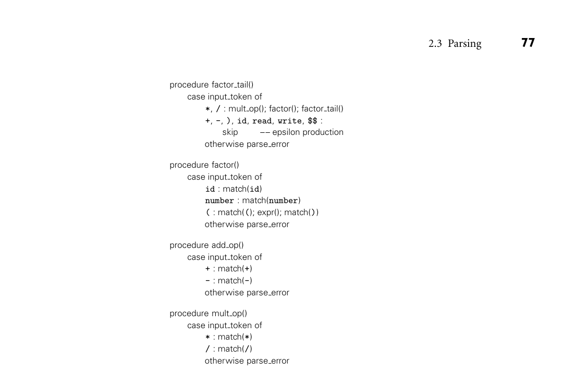
*Figure 2.17 (continued)*

save the parse tree or some other representation of program fragments as an ex- plicit data structure. To save the parse tree itself, we can allocate and link together records to represent the children of a node immediately before executing the re- cursive subroutines and match invocations that represent those children. We shall need to pass each recursive routine an argument that points to the record that is to be expanded (i.e., whose children are to be discovered). Procedure match will also need to save information about certain tokens (e.g., character-string repre- sentations of identifiers and literals) in the leaves of the tree. As we saw in Chapter 1, the parse tree contains a great deal of irrelevant detail that need not be saved for the rest of the compiler. It is therefore rare for a parser to construct a full parse tree explicitly. More often it produces an abstract syntax tree or some other more terse representation. In a recursive descent compiler, a syntax tree can be created by allocating and linking together records in only a subset of the recursive calls. The trickiest part of writing a recursive descent parser is figuring out which tokens should label the arms of the case statements. Each arm represents one production: one possible expansion of the symbol for which the subroutine was named. The tokens that label a given arm are those that predict the production. A token X may predict a production for either of two reasons: (1) the right-hand

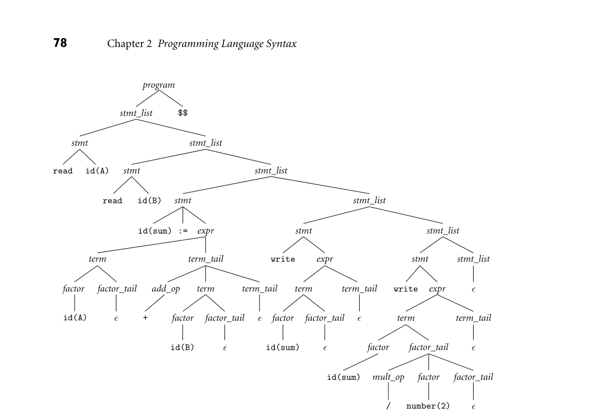
*Figure 2.18 Parse tree for the sum-and-average program of Example 2.24, using the grammar of Figure 2.16.*

side of the production, when recursively expanded, may yield a string beginning with X, or (2) the right-hand side may yield nothing (i.e., it is ϵ, or a string of nonterminals that may recursively yield ϵ), and X may begin the yield of what comes next. We will formalize this notion of prediction in Section 2.3.3, using sets called FIRST and FOLLOW, and show how to derive them automatically from an LL(1) CFG.

3CHECK YOUR UNDERSTANDING 20. What is the inherent “big-O” complexity of parsing? What is the complexity of parsers used in real compilers?

21. Summarize the difference between LL and LR parsing. Which one of them is also called “bottom-up”? “Top-down”? Which one is also called “predictive”? “Shift-reduce”? What do “LL” and “LR” stand for?

22. What kind of parser (top-down or bottom-up) is most common in produc- tion compilers? 23. Why are right-most derivations sometimes called canonical?

24. What is the significance of the “1” in LR(1)? 25. Why might we want (or need) different grammars for different parsing algo- rithms? 26. What is an epsilon production?

27. What are recursive descent parsers? Why are they used mostly for small lan- guages?

28. How might a parser construct an explicit parse tree or syntax tree?

2.3.2 Writing an LL(1) Grammar

When designing a recursive-descent parser, one has to acquire a certain facility in writing and modifying LL(1) grammars. The two most common obstacles to “LL(1)-ness” are left recursion and common prefixes. A grammar is said to be left recursive if there is a nonterminal A such that A EXAMPLE 2.25

Left recursion =⇒+ A α for some α.13 The trivial case occurs when the first symbol on the right- hand side of a production is the same as the symbol on the left-hand side. Here again is the grammar from Example 2.21, which cannot be parsed top-down:

id list −→id list prefix ;

id list prefix −→id list prefix , id

−→id

The problem is in the second and third productions; in the id list prefix pars- ing routine, with id on the input, a predictive parser cannot tell which of the productions it should use. (Recall that left recursion is desirable in bottom-up grammars, because it allows recursive constructs to be discovered incrementally, as in Figure 2.15.) ■ Common prefixes occur when two different productions with the same left- EXAMPLE 2.26

Common prefixes hand side begin with the same symbol or symbols. Here is an example that com- monly appears in languages descended from Algol:

13 Following conventional notation, we use uppercase Roman letters near the beginning of the al- phabet to represent nonterminals, uppercase Roman letters near the end of the alphabet to rep- resent arbitrary grammar symbols (terminals or nonterminals), lowercase Roman letters near the beginning of the alphabet to represent terminals (tokens), lowercase Roman letters near the end of the alphabet to represent token strings, and lowercase Greek letters to represent strings of arbitrary symbols.

stmt −→id := expr

−→id ( argument list ) –– procedure call

With id at the beginning of both right-hand sides, we cannot choose between them on the basis of the upcoming token. ■ Both left recursion and common prefixes can be removed from a grammar me- chanically. The general case is a little tricky (Exercise 2.25), because the prediction problem may be an indirect one (e.g., S −→A α and A −→S β, or S −→A α, S −→B β, A =⇒∗c γ, and B =⇒∗c δ). We can see the general idea in the examples above, however. Our left-recursive definition of id list can be replaced by the right-recursive EXAMPLE 2.27

Eliminating left recursion variant we saw in Example 2.20:

id list −→id id list tail

id list tail −→, id id list tail

id list tail −→; ■

Our common-prefix definition of stmt can be made LL(1) by a technique called EXAMPLE 2.28

Left factoring left factoring:

stmt −→id stmt list tail

stmt list tail −→:= expr | ( argument list ) ■

Of course, simply eliminating left recursion and common prefixes is not guar- anteed to make a grammar LL(1). There are infinitely many non-LL languages— languages for which no LL grammar exists—and the mechanical transformations to eliminate left recursion and common prefixes work on their grammars just fine. Fortunately, the few non-LL languages that arise in practice can generally be handled by augmenting the parsing algorithm with one or two simple heuristics. The best known example of a “not quite LL” construct arises in languages like EXAMPLE 2.29

Parsing a “dangling else” Pascal, in which the else part of an if statement is optional. The natural gram- mar fragment

stmt −→if condition then clause else clause | other stmt

then clause −→then stmt

else clause −→else stmt | ϵ

is ambiguous (and thus neither LL nor LR); it allows the else in if C1 then if C2 then S1 else S2 to be paired with either then. The less natural grammar fragment

stmt −→balanced stmt | unbalanced stmt

balanced stmt −→if condition then balanced stmt else balanced stmt | other stmt

unbalanced stmt −→if condition then stmt | if condition then balanced stmt else unbalanced stmt

can be parsed bottom-up but not top-down (there is no pure top-down grammar for Pascal else statements). A balanced stmt is one with the same number of thens and elses. An unbalanced stmt has more thens. ■ The usual approach, whether parsing top-down or bottom-up, is to use the ambiguous grammar together with a “disambiguating rule,” which says that in the case of a conflict between two possible productions, the one to use is the one that occurs first, textually, in the grammar. In the ambiguous fragment above, the fact that else clause −→else stmt comes before else clause −→ϵ ends up pairing the else with the nearest then. Better yet, a language designer can avoid this sort of problem by choosing dif- ferent syntax. The ambiguity of the dangling else problem in Pascal leads to prob- EXAMPLE 2.30

“Dangling else” program bug lems not only in parsing, but in writing and maintaining correct programs. Most Pascal programmers at one time or another ended up writing a program like this one:

if P <> nil then if P^.val = goal then foundIt := true else endOfList := true

Indentation notwithstanding, the Pascal manual states that an else clause matches the closest unmatched then—in this case the inner one—which is clearly not what the programmer intended. To get the desired effect, the Pascal program- mer needed to write

if P <> nil then begin if P^.val = goal then foundIt := true end else endOfList := true ■

Many other Algol-family languages (including Modula, Modula-2, and Oberon, all more recent inventions of Pascal’s designer, Niklaus Wirth) require explicit end markers on all structured statements. The grammar fragment for if statements EXAMPLE 2.31

End markers for structured statements in Modula-2 looks something like this:

DESIGN & IMPLEMENTATION

2.6 The dangling else A simple change in language syntax—eliminating the dangling else—not only reduces the chance of programming errors, but also significantly sim- plifies parsing. For more on the dangling else problem, see Exercise 2.24 and Section 6.4.

stmt −→IF condition then clause else clause END | other stmt then clause −→THEN stmt list else clause −→ELSE stmt list | ϵ

The addition of the END eliminates the ambiguity. ■ Modula-2 uses END to terminate all its structured statements. Ada and For- tran 77 end an if with end if (and a while with end while, etc.). Al- gol 68 creates its terminators by spelling the initial keyword backward (if... fi, case... esac, do... od, etc.). One problem with end markers is that they tend to bunch up. In Pascal one EXAMPLE 2.32

The need for elsif could write

if A = B then ... else if A = C then ... else if A = D then ... else if A = E then ... else ...

With end markers this becomes

if A = B then ... else if A = C then ... else if A = D then ... else if A = E then ... else ... end end end end

To avoid this awkwardness, languages with end markers generally provide an elsif keyword (sometimes spelled elif):

if A = B then ... elsif A = C then ... elsif A = D then ... elsif A = E then ... else ... end ■

2.3.3 Table-Driven Top-Down Parsing

In a recursive descent parser, each arm of a case statement corresponds to a EXAMPLE 2.33

Driver and table for top-down parsing production, and contains parsing routine and match calls corresponding to the symbols on the right-hand side of that production. At any given point in the parse, if we consider the calls beyond the program counter (the ones that have yet to occur) in the parsing routine invocations currently in the call stack, we obtain a list of the symbols that the parser expects to see between here and the end of the program. A table-driven top-down parser maintains an explicit stack containing this same list of symbols.

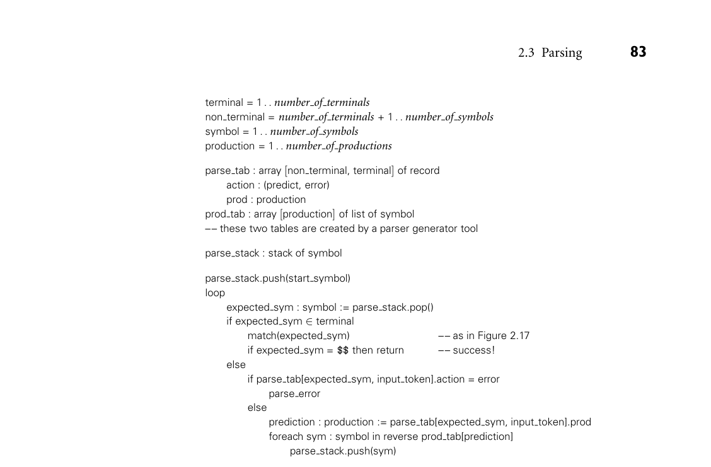
*Figure 2.19 Driver for a table-driven LL(1) parser.*

Pseudocode for such a parser appears in Figure 2.19. The code is language independent. It requires a language-dependent parsing table, generally produced by an automatic tool. For the calculator grammar of Figure 2.16, the table appears in Figure 2.20. ■ To illustrate the algorithm, Figure 2.21 shows a trace of the stack and the input EXAMPLE 2.34

over time, for the sum-and-average program of Example 2.24. The parser iter- ates around a loop in which it pops the top symbol off the stack and performs the following actions: If the popped symbol is a terminal, the parser attempts to match it against an incoming token from the scanner. If the match fails, the parser announces a syntax error and initiates some sort of error recovery (see Sec- tion 2.3.5). If the popped symbol is a nonterminal, the parser uses that nontermi- nal together with the next available input token to index into a two-dimensional table that tells it which production to predict (or whether to announce a syntax error and initiate recovery). Initially, the parse stack contains the start symbol of the grammar (in our case, program). When it predicts a production, the parser pushes the right-hand-side symbols onto the parse stack in reverse order, so the first of those symbols ends up at top-of-stack. The parse completes successfully when we match the end marker

Table-driven parse of the “sum and average” program

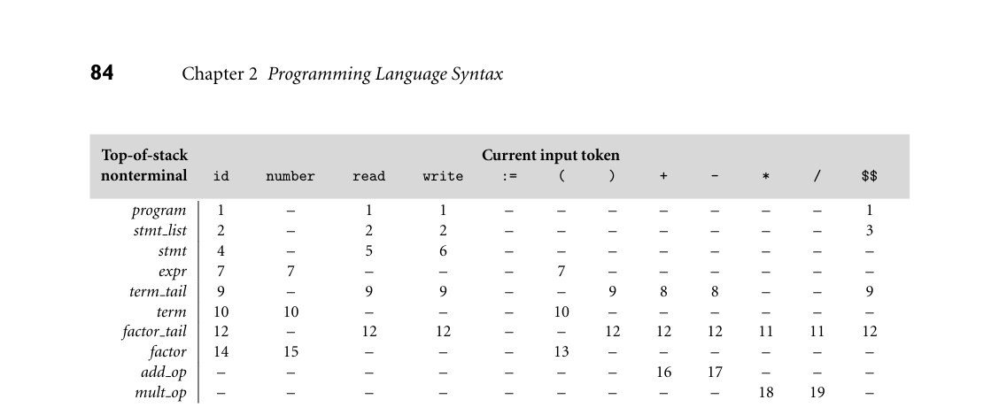
*Figure 2.20 LL(1) parse table for the calculator language. Table entries indicate the production to predict (as numbered in Figure 2.23). A dash indicates an error. When the top-of-stack symbol is a terminal, the appropriate action is always to match it against an incoming token from the scanner. An auxiliary table, not shown here, gives the right-hand-side symbols for each production.*

token, $$. Assuming that $$ appears only once in the grammar, at the end of the first production, and that the scanner returns this token only at end-of-file, any syntax error is guaranteed to manifest itself either as a failed match or as an error entry in the table. ■ As we hinted at the end of Section 2.3.1, predict sets are defined in terms of simpler sets called FIRST and FOLLOW, where FIRST(A) is the set of all tokens that could be the start of an A and FOLLOW(A) is the set of all tokens that could come after an A in some valid program. If we extend the domain of FIRST in the obvious way to include strings of symbols, we then say that the predict set of a production A −→β is FIRST(β), plus FOLLOW(A) if β =⇒∗ϵ. For notational convenience, we define the predicate EPS such that EPS(β) ≡β =⇒∗ϵ. We can illustrate the algorithm to construct these sets using our calculator EXAMPLE 2.35

Predict sets for the calculator language grammar (Figure 2.16). We begin with “obvious” facts about the grammar and build on them inductively. If we recast the grammar in plain BNF (no EBNF ‘ | ’ constructs), then it has 19 productions. The “obvious” facts arise from ad- jacent pairs of symbols in right-hand sides. In the first production, we can see that $$ ∈FOLLOW(stmt list). In the third (stmt list −→ϵ), EPS(stmt list) = true. In the fourth production (stmt −→id := expr), id ∈FIRST(stmt) (also := ∈FOLLOW(id), but it turns out we don’t need FOLLOW sets for nontermi- nals). In the fifth and sixth productions (stmt −→read id | write expr), {read, write} ⊂FIRST(stmt). The complete set of “obvious” facts appears in Figure 2.22. From the “obvious” facts we can deduce a larger set of facts during a second pass over the grammar. For example, in the second production (stmt list −→ stmt stmt list) we can deduce that {id, read, write} ⊂FIRST(stmt list), be- cause we already know that {id, read, write} ⊂FIRST(stmt), and a stmt list can

Parse stack Input stream Comment

*Figure 2.21 Trace of a table-driven LL(1) parse of the sum-and-average program of Example 2.24.*

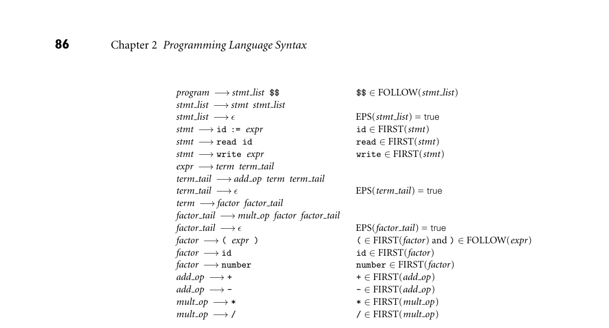
*Figure 2.22 “Obvious” facts (right) about the LL(1) calculator grammar (left).*

DESIGN & IMPLEMENTATION

2.7 Recursive descent and table-driven LL parsing When trying to understand the connection between recursive descent and table-driven LL parsing, it is tempting to imagine that the explicit stack of the table-driven parser mirrors the implicit call stack of the recursive descent parser, but this is not the case. A better way to visualize the two implementa- tions of top-down parsing is to remember that both are discovering a parse tree via depth-first left-to- right traversal. When we are at a given point in the parse—say the circled node in the tree shown here—the implicit call stack of a recursive descent parser holds a frame for each of the nodes on the path back to the root, created when the routine cor- responding to that node was called. (This path is shown in grey.)

But these nodes are immaterial. What matters for the rest of the parse—as shown on the white path here—are the upcoming calls on the case statement arms of the recursive descent routines. Those calls—those parse tree nodes— are precisely the contents of the explicit stack of a table-driven LL parser.

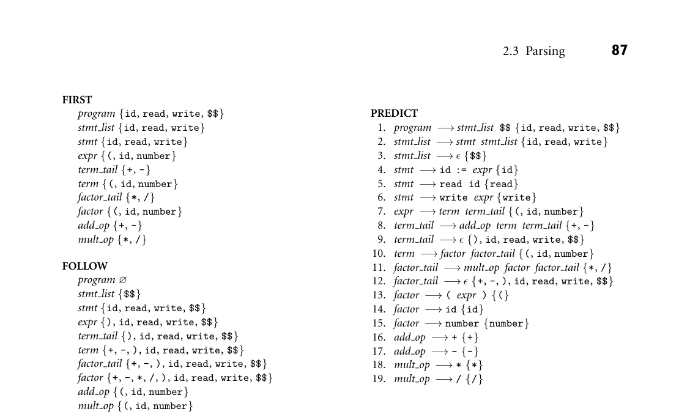
*Figure 2.23 FIRST, FOLLOW, and PREDICT sets for the calculator language. FIRST(c) = {c} ∀tokens c. EPS(A) is true iff A ∈{stmt list, term tail, factor tail}.*

begin with a stmt. Similarly, in the first production, we can deduce that $$ ∈ FIRST(program), because we already know that EPS(stmt list) = true. In the eleventh production (factor tail −→mult op factor factor tail), we can deduce that {(, id, number} ⊂FOLLOW(mult op), because we already know that {(, id, number} ⊂FIRST(factor), and factor follows mult op in the right- hand side. In the production expr −→term term tail, we can deduce that ) ∈FOLLOW(term tail), because we already know that ) ∈FOLLOW(expr), and a term tail can be the last part of an expr. In this same production, we can also de- duce that ) ∈FOLLOW(term), because the term tail can generate ϵ (EPS(term tail) = true), allowing a term to be the last part of an expr. There is more that we can learn from our second pass through the grammar, but the examples above cover all the different kinds of cases. To complete our calculation, we continue with additional passes over the grammar until we don’t learn any more (i.e., we don’t add anything to any of the FIRST and FOLLOW sets). We then construct the PREDICT sets. Final versions of all three sets appear in Figure 2.23. The parse table of Figure 2.20 follows directly from PREDICT. ■ The algorithm to compute EPS, FIRST, FOLLOW, and PREDICT sets appears, a bit more formally, in Figure 2.24. It relies on the following definitions:

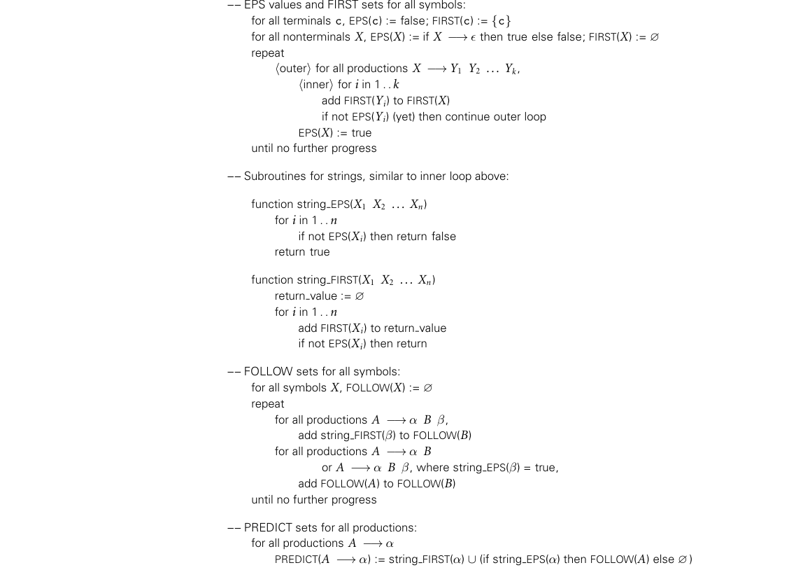
*Figure 2.24 Algorithm to calculate FIRST, FOLLOW, and PREDICT sets. The grammar is LL(1) if and only if all PREDICT sets for productions with the same left-hand side are disjoint.*

EPS(α) ≡if α =⇒∗ϵ then true else false

FIRST(α) ≡{c : α =⇒∗c β }

FOLLOW(A) ≡{c : S =⇒+ α A c β }

PREDICT(A −→α) ≡FIRST(α) ∪( if EPS(α) then FOLLOW(A) else ∅)

The definition of PREDICT assumes that the language has been augmented with an end marker—that is, that FOLLOW(S) = {$$}. Note that FIRST sets and EPS values for strings of length greater than one are calculated on demand; they are

not stored explicitly. The algorithm is guaranteed to terminate (i.e., converge on a solution), because the sizes of the FIRST and FOLLOW sets are bounded by the number of terminals in the grammar. If in the process of calculating PREDICT sets we find that some token belongs to the PREDICT set of more than one production with the same left-hand side, then the grammar is not LL(1), because we will not be able to choose which of the productions to employ when the left-hand side is at the top of the parse stack (or we are in the left-hand side’s subroutine in a recursive descent parser) and we see the token coming up in the input. This sort of ambiguity is known as a predict- predict conflict; it can arise either because the same token can begin more than one right-hand side, or because it can begin one right-hand side and can also appear after the left-hand side in some valid program, and one possible right-hand side can generate ϵ.

3CHECK YOUR UNDERSTANDING 29. Describe two common idioms in context-free grammars that cannot be parsed top-down. 30. What is the “dangling else” problem? How is it avoided in modern lan- guages? 31. Discuss the similarities and differences between recursive descent and table- driven top-down parsing. 32. What are FIRST and FOLLOW sets? What are they used for?

33. Under what circumstances does a top-down parser predict the production A −→α?

34. What sorts of “obvious” facts form the basis of FIRST set and FOLLOW set construction?

35. Outline the algorithm used to complete the construction of FIRST and FOLLOW sets. How do we know when we are done?

36. How do we know when a grammar is not LL(1)?

2.3.4 Bottom-Up Parsing

Conceptually, as we saw at the beginning of Section 2.3, a bottom-up parser works by maintaining a forest of partially completed subtrees of the parse tree, which it joins together whenever it recognizes the symbols on the right-hand side of some production used in the right-most derivation of the input string. It creates a new internal node and makes the roots of the joined-together trees the children of that node. In practice, a bottom-up parser is almost always table-driven. It keeps the roots of its partially completed subtrees on a stack. When it accepts a new token from

the scanner, it shifts the token into the stack. When it recognizes that the top few symbols on the stack constitute a right-hand side, it reduces those symbols to their left-hand side by popping them off the stack and pushing the left-hand side in their place. The role of the stack is the first important difference between top-down and bottom-up parsing: a top-down parser’s stack contains a list of what the parser expects to see in the future; a bottom-up parser’s stack contains a record of what the parser has already seen in the past.

Canonical Derivations

We also noted earlier that the actions of a bottom-up parser trace out a right- most (canonical) derivation in reverse. The roots of the partial subtrees, left- to-right, together with the remaining input, constitute a sentential form of the right-most derivation. On the right-hand side of Figure 2.14, for example, we EXAMPLE 2.36

Derivation of an id list have the following series of steps:

Stack contents (roots of partial trees) Remaining input

ϵ A, B, C; id (A) , B, C; id (A) , B, C; id (A) , id (B) , C; id (A) , id (B) , C; id (A) , id (B) , id (C) ; id (A) , id (B) , id (C) ; id (A) , id (B) , id (C) id list tail id (A) , id (B) id list tail id (A) id list tail id list

The last four lines (the ones that don’t just shift tokens into the forest) correspond to the right-most derivation:

id list =⇒id id list tail

=⇒id , id id list tail

=⇒id , id , id id list tail

=⇒id , id , id ;

The symbols that need to be joined together at each step of the parse to represent the next step of the backward derivation are called the handle of the sentential form. In the parse trace above, the handles are underlined. ■ In our id list example, no handles were found until the entire input had been EXAMPLE 2.37

Bottom-up grammar for the calculator language shifted onto the stack. In general this will not be the case. We can obtain a more realistic example by examining an LR version of our calculator language, shown in Figure 2.25. While the LL grammar of Figure 2.16 can be parsed bottom- up, the version in Figure 2.25 is preferable for two reasons. First, it uses a left- recursive production for stmt list. Left recursion allows the parser to collapse long statement lists as it goes along, rather than waiting until the entire list is

*Figure 2.25 LR(1) grammar for the calculator language. Productions have been numbered for reference in future figures.*

on the stack and then collapsing it from the end. Second, it uses left-recursive productions for expr and term. These productions capture left associativity while still keeping an operator and its operands together in the same right-hand side, something we were unable to do in a top-down grammar. ■

Modeling a Parse with LR Items

Suppose we are to parse the sum-and-average program from Example 2.24: EXAMPLE 2.38

Bottom-up parse of the “sum and average” program read A read B sum := A + B write sum write sum / 2

The key to success will be to figure out when we have reached the end of a right- hand side—that is, when we have a handle at the top of the parse stack. The trick is to keep track of the set of productions we might be “in the middle of” at any particular time, together with an indication of where in those productions we might be. When we begin execution, the parse stack is empty and we are at the begin- ning of the production for program. (In general, we can assume that there is only one production with the start symbol on the left-hand side; it is easy to modify

any grammar to make this the case.) We can represent our location—more spe- cifically, the location represented by the top of the parse stack—with a. in the right-hand side of the production:

program −→. stmt list $$

When augmented with a., a production is called an LR item. Since the. in this item is immediately in front of a nonterminal—namely stmt list—we may be about to see the yield of that nonterminalcoming up on the input. This possibility implies that we may be at the beginning of some production with stmt list on the left-hand side:

program −→. stmt list $$

stmt list −→. stmt list stmt

stmt list −→. stmt

And, since stmt is a nonterminal, we may also be at the beginning of any produc- tion whose left-hand side is stmt:

program −→. stmt list $$ (State 0)

stmt list −→. stmt list stmt

stmt list −→. stmt

stmt −→. id := expr

stmt −→. read id

stmt −→. write expr

Since all of these last productions begin with a terminal, no additional items need to be added to our list. The original item (program −→. stmt list $$) is called the basis of the list. The additional items are its closure. The list represents the ini- tial state of the parser. As we shift and reduce, the set of items will change, always indicating which productions may be the right one to use next in the derivation of the input string. If we reach a state in which some item has the. at the end of the right-hand side, we can reduce by that production. Otherwise, as in the current situation, we must shift. Note that if we need to shift, but the incoming token cannot follow the. in any item of the current state, then a syntax error has occurred. We will consider error recovery in more detail in Section C 2.3.5. Our upcoming token is a read. Once we shift it onto the stack, we know we are in the following state:

stmt −→read . id (State 1)

This state has a single basis item and an empty closure—the. precedes a terminal. After shifting the A, we have

stmt −→read id . (State 1′)

We now know that read id is the handle, and we must reduce. The reduction pops two symbols off the parse stack and pushes a stmt in their place, but what should the new state be? We can see the answer if we imagine moving back in time to the point at which we shifted the read—the first symbol of the right-hand side. At that time we were in the state labeled “State 0” above, and the upcoming tokens on the input (though we didn’t look at them at the time) were read id. We have now consumed these tokens, and we know that they constituted a stmt. By pushing a stmt onto the stack, we have in essence replaced read id with stmt on the input stream, and have then “shifted” the nonterminal, rather than its yield, into the stack. Since one of the items in State 0 was

stmt list −→. stmt

we now have

stmt list −→stmt . (State 0′)

Again we must reduce. We remove the stmt from the stack and push a stmt list in its place. Again we can see this as “shifting” a stmt list when in State 0. Since two of the items in State 0 have a stmt list after the., we don’t know (without looking ahead) which of the productions will be the next to be used in the derivation, but we don’t have to know. The key advantage of bottom-up parsing over top-down parsing is that we don’t need to predict ahead of time which production we shall be expanding. Our new state is as follows:

program −→stmt list . $$ (State 2)

stmt list −→stmt list . stmt

stmt −→. id := expr

stmt −→. read id

stmt −→. write expr

The first two productions are the basis; the others are the closure. Since no item has a. at the end, we shift the next token, which happens again to be a read, taking us back to State 1. Shifting the B takes us to State 1′ again, at which point we reduce. This time however, we go back to State 2 rather than State 0 before shifting the left-hand-side stmt. Why? Because we were in State 2 when we began to read the right-hand side. ■

The Characteristic Finite-State Machine and LR Parsing Variants

An LR-family parser keeps track of the states it has traversedby pushing them into the parse stack, along with the grammar symbols. It is in fact the states (rather than the symbols) that drive the parsing algorithm: they tell us what state we were in at the beginning of a right-hand side. Specifically, when the combina- tion of state and input tells us we need to reduce using production A −→α, we pop length(α) symbols off the stack, together with the record of states we moved

through while shifting those symbols. These pops expose the state we were in im- mediately prior to the shifts, allowing us to return to that state and proceed as if we had seen A in the first place. We can think of the shift rules of an LR-family parser as the transition function of a finite automaton, much like the automata we used to model scanners. Each state of the automaton corresponds to a list of items that indicate where the parser might be at some specific point in the parse. The transition for input symbol X (which may be either a terminal or a nonterminal) moves to a state whose basis consists of items in which the. has been moved across an X in the right-hand side, plus whatever items need to be added as closure. The lists are constructed by a bottom-up parser generator in order to build the automaton, but are not needed during parsing. It turns out that the simpler members of the LR family of parsers—LR(0), SLR(1), and LALR(1)—all use the same automaton, called the characteristic finite- state machine, or CFSM. Full LR parsers use a machine with (for most grammars) a much larger number of states. The differences between the algorithms lie in how they deal with states that contain a shift-reduce conflict—one item with the. in front of a terminal (suggesting the need for a shift) and another with the. at the end of the right-hand side (suggesting the need for a reduction). An LR(0) parser works only when there are no such states. It can be proven that with the addition of an end-marker (i.e., $$), any language that can be deterministically parsed bottom-up has an LR(0) grammar. Unfortunately, the LR(0) grammars for real programming languages tend to be prohibitively large and unintuitive. SLR (simple LR) parsers peek at upcoming input and use FOLLOW sets to re- solve conflicts. An SLR parser will call for a reduction via A −→α only if the upcoming token(s) are in FOLLOW(α). It will still see a conflict, however, if the tokens are also in the FIRST set of any of the symbols that follow a. in other items of the state. As it turns out, there are important cases in which a token may follow a given nonterminal somewhere in a valid program, but never in a context described by the current state. For these cases global FOLLOW sets are too crude. LALR (look-ahead LR) parsers improve on SLR by using local (state- specific) look-ahead instead. Conflicts can still arise in an LALR parser when the same set of items can occur on two different paths through the CFSM. Both paths will end up in the same state, at which point state-specific look-ahead can no longer distinguish between them. A full LR parser duplicates states in order to keep paths disjoint when their local look-aheads are different. LALR parsers are the most common bottom-up parsers in practice. They are the same size and speed as SLR parsers, but are able to resolve more conflicts. Full LR parsers for real programming languages tend to be very large. Several researchers have developed techniques to reduce the size of full-LR tables, but LALR works sufficiently well in practice that the extra complexity of full LR is usually not required. Yacc/bison produces C code for an LALR parser.

Bottom-Up Parsing Tables

Like a table-driven LL(1) parser, an SLR(1), LALR(1), or LR(1) parser executes a loop in which it repeatedly inspects a two-dimensional table to find out what action to take. However, instead of using the current input token and top-of- stack nonterminal to index into the table, an LR-family parser uses the current input token and the current parser state (which can be found at the top of the stack). “Shift” table entries indicate the state that should be pushed. “Reduce” table entries indicate the number of states that should be popped and the non- terminal that should be pushed back onto the input stream, to be shifted by the state uncovered by the pops. There is always one popped state for every symbol on the right-hand side of the reducing production. The state to be pushed next can be found by indexing into the table using the uncovered state and the newly recognized nonterminal. The CFSM for our bottom-up version of the calculator grammar appears in EXAMPLE 2.39

CFSM for the bottom-up calculator grammar Figure 2.26. States 6, 7, 9, and 13 contain potential shift-reduce conflicts, but all of these can be resolved with global FOLLOW sets. SLR parsing therefore suffices. In State 6, for example, FIRST(add op) ∩FOLLOW(stmt) = ∅. In addition to shift and reduce rules, we allow the parse table as an optimization to contain rules of the form “shift and then reduce.” This optimization serves to eliminate trivial states such as 1′ and 0′ in Example 2.38, which had only a single item, with the. at the end. A pictorial representation of the CFSM appears in Figure 2.27. A tabular rep- resentation, suitable for use in a table-driven parser, appears in Figure 2.28. Pseu- docode for the (language-independent) parser driver appears in Figure 2.29. A trace of the parser’s actions on the sum-and-average program appears in Fig- ure 2.30. ■

Handling Epsilon Productions

The careful reader may have noticed that the grammar of Figure 2.25, in addition EXAMPLE 2.40

to using left-recursive rules for stmt list, expr, and term, differsfrom the grammar of Figure 2.16 in one other way: it defines a stmt list to be a sequence of one or more stmts, rather than zero or more. (This means, of course, that it defines a different language.) To capture the same language as Figure 2.16, production 3 in Figure 2.25,

Epsilon productions in the bottom-up calculator grammar

stmt list −→stmt

would need to be replaced with

stmt list −→ϵ ■

Note that it does in general make sense to have an empty statement list. In the cal- culator language it simply permits an empty program, which is admittedly silly. In real languages, however, it allows the body of a structured statement to be empty, which can be very useful. One frequently wants one arm of a case or multi- way if... then ... else statement to be empty, and an empty while loop allows

State Transitions

0. program −→. stmt list $$ on stmt list shift and goto 2

stmt list −→. stmt list stmt stmt list −→. stmt on stmt shift and reduce (pop 1 state, push stmt list on input) stmt −→. id := expr on id shift and goto 3 stmt −→. read id on read shift and goto 1 stmt −→. write expr on write shift and goto 4

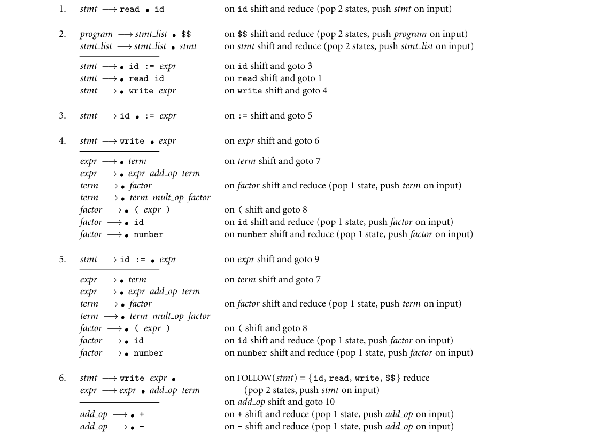
*Figure 2.26 CFSM for the calculator grammar (Figure 2.25). Basis and closure items in each state are separated by a horizontal rule. Trivial reduce-only states have been eliminated by use of “shift and reduce” transitions. (continued)*

State Transitions

7. expr −→term . on FOLLOW(expr) = {id, read, write, $$, ), +, -} reduce term −→term . mult op factor (pop 1 state, push expr on input) on mult op shift and goto 11 mult op −→. * on * shift and reduce (pop 1 state, push mult op on input) mult op −→. / on / shift and reduce (pop 1 state, push mult op on input)

8. factor −→( . expr ) on expr shift and goto 12

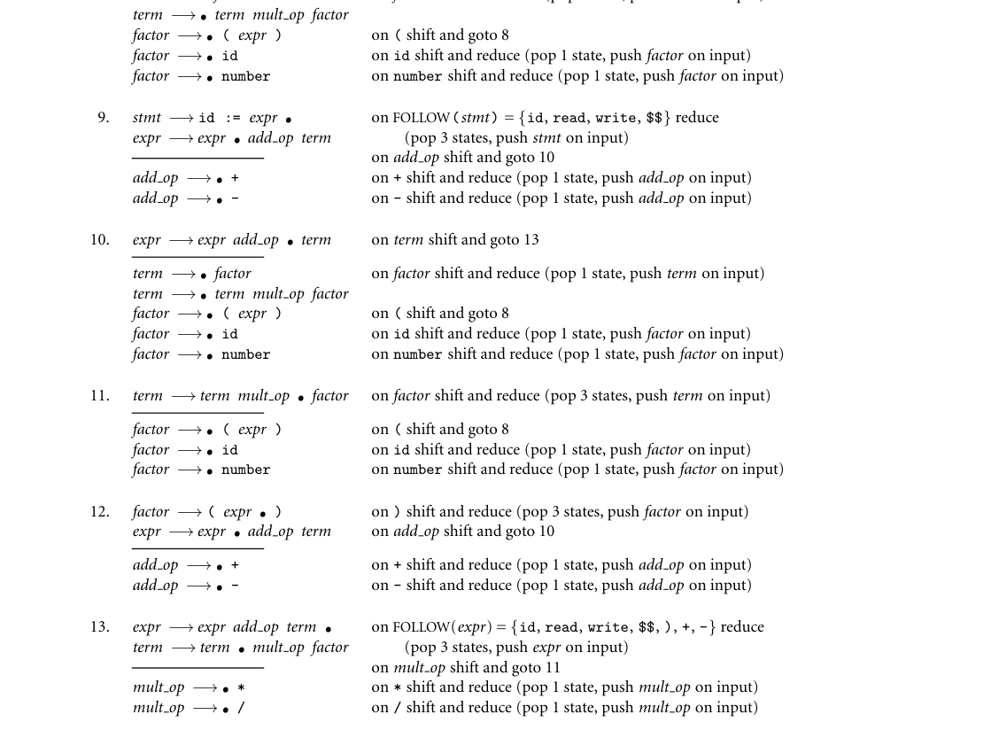
*Figure 2.26 (continued)*

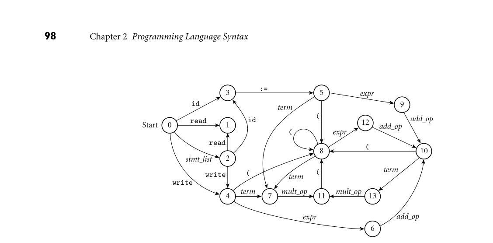
*Figure 2.27 Pictorial representation of the CFSM of Figure 2.26. Reduce actions are not shown.*

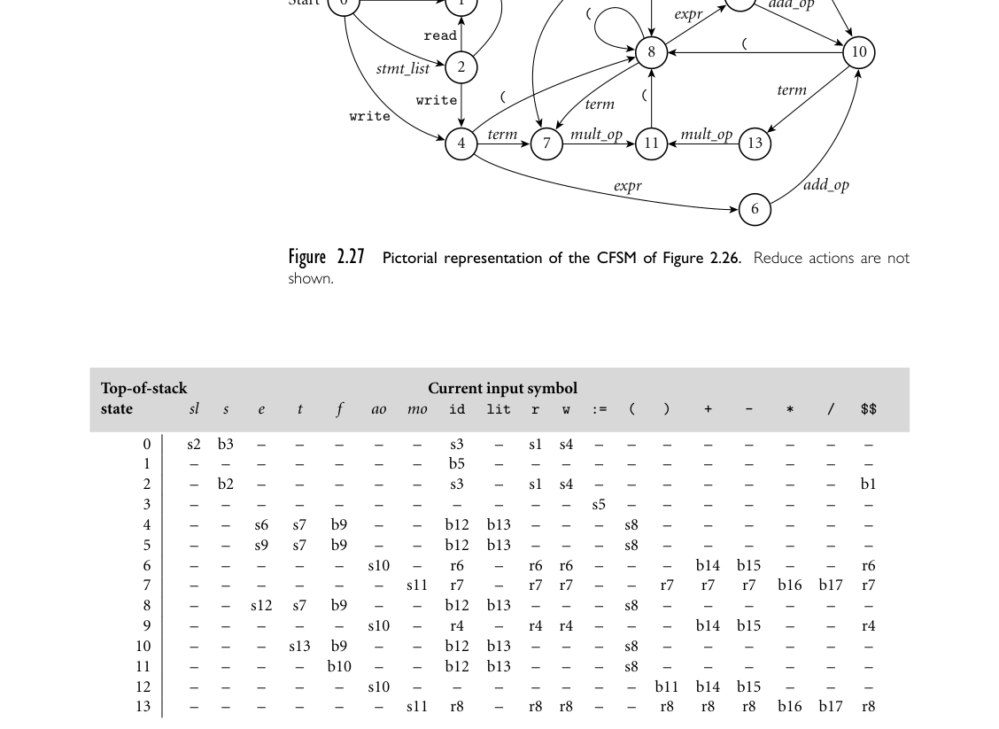
*Figure 2.28 SLR(1) parse table for the calculator language. Table entries indicate whether to shift (s), reduce (r), or shift and then reduce (b). The accompanying number is the new state when shifting, or the production that has been recognized when (shifting and) reducing. Production numbers are given in Figure 2.25. Symbol names have been abbreviated for the sake of formatting. A dash indicates an error. An auxiliary table, not shown here, gives the left-hand-side symbol and right-hand-side length for each production.*

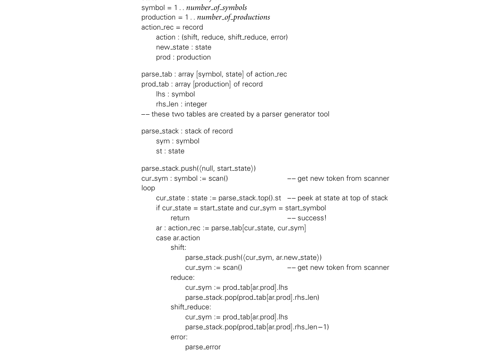
*Figure 2.29 Driver for a table-driven SLR(1) parser. We call the scanner directly, rather than using the global input token of Figures 2.17 and 2.19, so that we can set cur sym to be an arbitrary symbol. We pass to the pop() routine a parameter that indicates the number of symbols to remove from the stack.*

Parse stack Input stream Comment

*Figure 2.30 Trace of a table-driven SLR(1) parse of the sum-and-average program. States in the parse stack are shown in boldface type. Symbols in the parse stack are for clarity only; they are not needed by the parsing algorithm. Parsing begins with the initial state of the CFSM (State 0) in the stack. It ends when we reduce by program −→stmt list $$, uncovering State 0 again and pushing program onto the input stream.*

a parallel program (or the operating system) to wait for a signal from another process or an I/O device. If we look at the CFSM for the calculator language, we discover that State 0 is EXAMPLE 2.41

CFSM with epsilon productions the only state that needs to be changed in order to allow empty statement lists. The item

stmt list −→. stmt

becomes

stmt list −→. ϵ

which is equivalent to

stmt list −→ϵ.

or simply

stmt list −→.

The entire state is then

program −→. stmt list $$ on stmt list shift and goto 2

stmt list −→. stmt list stmt stmt list −→. on $$ reduce (pop 0 states, push stmt list on input) stmt −→. id := expr on id shift and goto 3 stmt −→. read id on read shift and goto 1 stmt −→. write expr on write shift and goto 4

The look-ahead for item

stmt list −→.

is FOLLOW(stmt list), which is the end-marker, $$. Since $$ does not appear in the look-aheads for any other item in this state, our grammar is still SLR(1). It is worth noting that epsilon productions commonly prevent a grammar from being LR(0): if such a production shares a state with an item in which the dot precedes a terminal, we won’t be able to tell whether to “recognize” ϵ without peeking ahead. ■

3CHECK YOUR UNDERSTANDING 37. What is the handle of a right sentential form? 38. Explain the significance of the characteristic finite-state machine in LR pars- ing. 39. What is the significance of the dot (.) in an LR item?

40. What distinguishes the basis from the closure of an LR state? 41. What is a shift-reduce conflict? How is it resolved in the various kinds of LR- family parsers?

42. Outline the steps performed by the driver of a bottom-up parser.

43. What kind of parser is produced by yacc/bison? By ANTLR? 44. Why are there never any epsilon productions in an LR(0) grammar?

2.3.5 Syntax Errors

Suppose we are parsing a C program and see the following code fragment in a EXAMPLE 2.42

A syntax error in C context where a statement is expected:

A = B : C + D;

We will detect a syntax error immediately after the B, when the colon appears from the scanner. At this point the simplest thing to do is just to print an error message and halt. This naive approach is generally not acceptable, however: it would mean that every run of the compiler reveals no more than one syntax er- ror. Since most programs, at least at first, contain numerous such errors, we really need to find as many as possible now (we’d also like to continue looking for se- mantic errors). To do so, we must modify the state of the parser and/or the input stream so that the upcoming token(s) are acceptable. We shall probably want to turn off code generation, disabling the back end of the compiler: since the input is not a valid program, the code will not be of use, and there’s no point in spending time creating it. ■ In general, the term syntax error recovery is applied to any technique that al- lows the compiler, in the face of a syntax error, to continue looking for other errors later in the program. High-quality syntax error recovery is essential in any production-quality compiler. The better the recovery technique, the more likely the compiler will be to recognize additional errors (especially nearby errors) cor- rectly, and the less likely it will be to become confused and announce spurious cascading errors later in the program.

IN MORE DEPTH

On the companion site we explore several possible approaches to syntax error re- covery. In panic mode, the compiler writer defines a small set of “safe symbols” that delimit clean points in the input. Semicolons, which typically end a state- ment, are a good choice in many languages. When an error occurs, the compiler deletes input tokens until it finds a safe symbol, and then “backs the parser out” (e.g., returns from recursive descent subroutines) until it finds a context in which that symbol might appear. Phrase-level recovery improves on this technique by employing different sets of “safe” symbols in different productions of the gram- mar (right parentheses when in an expression; semicolons when in a declara- tion). Context-specific look-ahead obtains additional improvements by differenti- ating among the various contexts in which a given production might appear in a

