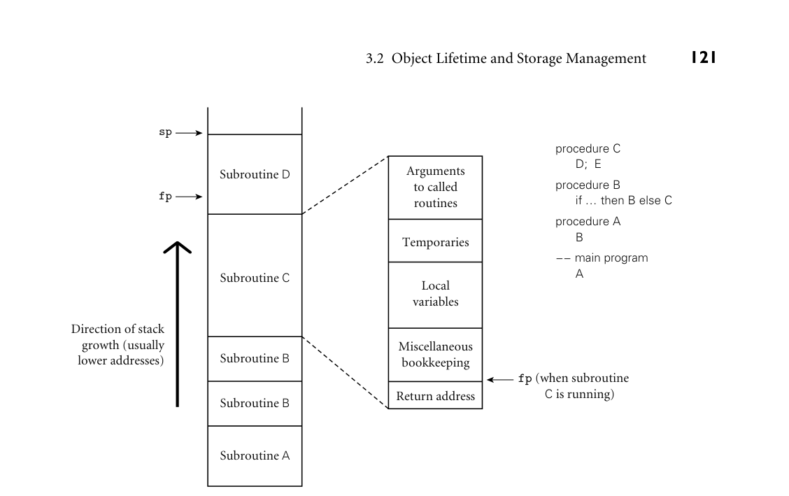

# Chapter 3: Names, Scopes, and Bindings

## **3**

## **Names, Scopes, and Bindings**

```
Early languages such as Fortran, Algol, and Lisp were termed “high level”
because their syntax and semantics were significantly more abstract—farther
from the hardware—than those of the assembly languages they were intended
to supplant. Abstraction made it possible to write programs that would run well
on a wide variety of machines. It also made programs significantly easier for hu-
man beings to understand. While machine independence remains important, it
is primarily ease of programming that continues to drive the design of modern
languages. This chapter is the first of six to address core issues in language de-
sign. (The others are Chapters 6 through 10.) Much of the current discussion will
revolve around the notion of names.
A name is a mnemonic character string used to represent something else.
Names in most languages are identifiers (alphanumeric tokens), though certain
other symbols, such as + or :=, can also be names. Names allow us to refer to
variables, constants, operations, types, and so on using symbolic identifiers rather
than low-level concepts like addresses. Names are also essential in the context of
a second meaning of the word abstraction. In this second meaning, abstraction is
a process by which the programmer associates a name with a potentially compli-
cated program fragment, which can then be thought of in terms of its purpose or
function, rather than in terms of how that function is achieved. By hiding irrel-
evant details, abstraction reduces conceptual complexity, making it possible for
the programmer to focus on a manageable subset of the program text at any par-
ticular time. Subroutines are control abstractions: they allow the programmer to
hide arbitrarily complicated code behind a simple interface. Classes are data ab-
stractions: they allow the programmer to hide data representation details behind
a (comparatively) simple set of operations.
We will look at severalmajor issues related to names. Section 3.1 introduces the
notion of binding time, which refers not only to the binding of a name to the thing
it represents, but also in general to the notion of resolving any design decision in
a language implementation. Section 3.2 outlines the various mechanisms used
to allocate and deallocate storage space for objects, and distinguishes between
```

**115**

*Language design time:* In most languages, the control-flow constructs, the set of
fundamental (primitive) types, the available* constructors* for creating complex
types, and many other aspects of language semantics are chosen when the lan-
guage is designed.
*Language implementation time:* Most language manuals leave a variety of issues
to the discretion of the language implementor. Typical (though by no means
universal) examples include the precision (number of bits) of the fundamental
types, the coupling of I/O to the operating system’s notion of files, and the
organization and maximum sizes of the stack and heap.
*Program writing time:* Programmers, of course, choose algorithms, data struc-
tures, and names.
*Compile time:* Compilers choose the mapping of high-level constructs to ma-
chine code, including the layout of statically defined data in memory.

**1**
For want of a better term, we will use the term “object” throughout Chapters 3–9 to refer to
anything that might have a name: variables, constants, types, subroutines, modules, and oth-
ers. In many modern languages “object” has a more formal meaning, which we will consider in
Chapter 10.

**1.*** Static* objects are given an absolute address that is retained throughout the
program’s execution.

3.2 Recursion in Fortran
The lack of recursion in (pre-Fortran 90) Fortran is generally attributed to the
expense of stack manipulation on the IBM 704, on which the language was
first implemented. Many (perhaps most) Fortran implementations choose to
use a stack for local variables, but because the language definition permits the
use of static allocation instead, Fortran programmers were denied the benefits
of language-supported recursion for over 30 years.

Miscellaneous
bookkeeping

Return address

Arguments
to called
routines

sp

fp

fp (when subroutine
        C is running) 
Subroutine B

procedure C
      D;  E

procedure B
      if ... then B else C

procedure A
      B

−− main program
      A



*Figure 3.1 Stack-based allocation of space for subroutines. We assume here that subroutines have been called as shown in the upper right. In particular, B has called itself once, recursively, before calling C. If D returns and C calls E, E’s frame (activation record) will occupy the same space previously used for D’s frame. At any given time, the stack pointer (sp) register points to the first unused location on the stack (or the last used location on some machines), and the frame pointer (fp) register points to a known location within the frame of the current subroutine. The relative order of fields within a frame may vary from machine to machine and compiler to compiler.*

```
can do so by adding a predetermined offset to the value in the frame pointer.
As we discuss in Section C 5.3.1, almost every processor provides a displacement
addressing mechanism that allows this addition to be specified implicitly as part
of an ordinary load or store instruction. The stack grows “downward” toward
lower addresses in most language implementations. Some machines provide spe-
cial push and pop instructions that assume this direction of growth. Local vari-
ables, temporaries, and bookkeeping information typically have negative offsets
from the frame pointer. Arguments and returns typically have positive offsets;
they reside in the caller’s frame.
Even in a language without recursion, it can be advantageous to use a stack for
local variables, rather than allocating them statically. In most programs the pat-
tern of potential calls among subroutines does not permit all of those subroutines
to be active at the same time. As a result, the total space needed for local vari-
ables of currently active subroutines is seldom as large as the total space across all
```

