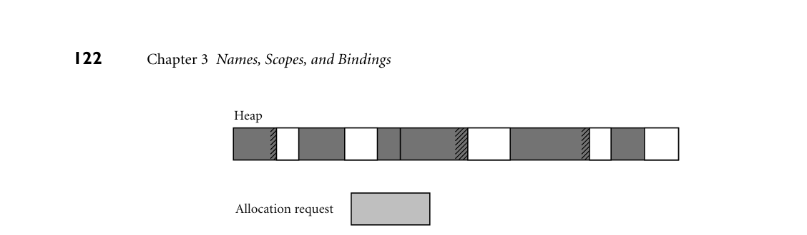

# 3.2 Object Lifetime and Storage Management

118 Chapter 3 Names, Scopes, and Bindings

the following section, a compiler will not usually be able to predict the address of a local variable at compile time, since space for the variable will be allocated dy- namically on a stack, but it can arrange for the variable to appear at a fixed offset from the location pointed to by a certain register at run time. Some languages are difficult to compile because their semantics require funda- mental decisions to be postponed until run time, generally in order to increase the flexibility or expressiveness of the language. Most scripting languages, for exam- ple, delay all type checking until run time. References to objects of arbitrary types (classes) can be assigned into arbitrary named variables, as long as the program never ends up applying an operator to (invoking a method of) an object that is not prepared to handle it. This form of polymorphism—applicability to objects or expressions of multiple types—allows the programmer to write unusually flexi- ble and general-purpose code. We will mention polymorphism again in several future sections, including 7.1.2, 7.3, 10.1.1, and 14.4.4. 3.2 Object Lifetime and Storage Management

In any discussion of names and bindings, it is important to distinguish between names and the objects to which they refer, and to identify several key events:

Creation and destruction of objects Creation and destruction of bindings Deactivation and reactivation of bindings that may be temporarily unusable References to variables, subroutines, types, and so on, all of which use bindings

The period of time between the creation and the destruction of a name-to- object binding is called the binding’s lifetime. Similarly, the time between the creation and destruction of an object is the object’s lifetime. These lifetimes need not necessarily coincide. In particular, an object may retain its value and the po- tential to be accessed even when a given name can no longer be used to access it. When a variable is passed to a subroutine by reference, for example (as it typically is in Fortran or with ‘&’ parameters in C++), the binding between the parame- ter name and the variable that was passed has a lifetime shorter than that of the variable itself. It is also possible, though generally a sign of a program bug, for a name-to-object binding to have a lifetime longer than that of the object. This can happen, for example, if an object created via the C++ new operator is passed as a & parameter and then deallocated (delete-ed) before the subroutine returns. A binding to an object that is no longer live is called a dangling reference. Dangling references will be discussed further in Sections 3.6 and 8.5.2. Object lifetimes generally correspond to one of three principal storage alloca- tion mechanisms, used to manage the object’s space:

1. Static objects are given an absolute address that is retained throughout the program’s execution.

3.2 Object Lifetime and Storage Management 119

2. Stack objects are allocated and deallocated in last-in, first-out order, usually in conjunction with subroutine calls and returns. 3. Heap objects may be allocated and deallocated at arbitrary times. They require a more general (and expensive) storage management algorithm.

3.2.1 Static Allocation

Global variables are the obvious example of static objects, but not the only one. The instructions that constitute a program’s machine code can also be thought of as statically allocated objects. We shall see examples in Section 3.3.1 of vari- ables that are local to a single subroutine, but retain their values from one invo- cation to the next; their space is statically allocated. Numeric and string-valued constant literals are also statically allocated, for statements such as A = B/14.7 or printf("hello, world\n"). (Small constants are often stored within the instruction itself; larger ones are assigned a separate location.) Finally, most compilers produce a variety of tables that are used by run-time support routines for debugging, dynamic type checking, garbage collection, exception handling, and other purposes; these are also statically allocated. Statically allocated ob- jects whose value should not change during program execution (e.g., instructions, constants, and certain run-time tables) are often allocated in protected, read-only memory, so that any inadvertent attempt to write to them will cause a processor interrupt, allowing the operating system to announce a run-time error. Logically speaking, local variables are created when their subroutine is called, and destroyed when it returns. If the subroutine is called repeatedly, each invo- cation is said to create and destroy a separate instance of each local variable. It is not always the case, however, that a language implementation must perform work at run time corresponding to these create and destroy operations. Recursion was EXAMPLE 3.1

Static allocation of local variables not originally supported in Fortran (it was added in Fortran 90). As a result, there can never be more than one invocation of a subroutine active in an older Fortran program at any given time, and a compiler may choose to use static allocation for local variables, effectively arranging for the variables of different invocations to share the same locations, and thereby avoiding any run-time overhead for cre- ation and destruction. ■

DESIGN & IMPLEMENTATION

3.2 Recursion in Fortran The lack of recursion in (pre-Fortran 90) Fortran is generally attributed to the expense of stack manipulation on the IBM 704, on which the language was first implemented. Many (perhaps most) Fortran implementations choose to use a stack for local variables, but because the language definition permits the use of static allocation instead, Fortran programmers were denied the benefits of language-supported recursion for over 30 years.

120 Chapter 3 Names, Scopes, and Bindings

In many languages a named constant is required to have a value that can be determined at compile time. Usually the expression that specifies the constant’s value is permitted to include only other known constants and built-in functions and arithmetic operators. Named constants of this sort, together with constant literals, are sometimes called manifest constants or compile-time constants. Mani- fest constants can always be allocated statically, even if they are local to a recursive subroutine: multiple instances can share the same location. In other languages (e.g., C and Ada), constants are simply variables that cannot be changed after elaboration (initialization) time. Their values, though unchang- ing, can sometimes depend on other values that are not known until run time. Such elaboration-time constants, when local to a recursive subroutine, must be allocated on the stack. C# distinguishes between compile-time and elaboration- time constants using the const and readonly keywords, respectively.

3.2.2 Stack-Based Allocation

If a language permits recursion, static allocation of local variables is no longer an option, since the number of instances of a variable that may need to exist at the same time is conceptually unbounded. Fortunately, the natural nesting of sub- routine calls makes it easy to allocate space for locals on a stack. A simplified EXAMPLE 3.2

Layout of the run-time stack picture of a typical stack appears in Figure 3.1. Each instance of a subroutine at run time has its own frame (also called an activation record) on the stack, contain- ing arguments and return values, local variables, temporaries, and bookkeeping information. Temporaries are typically intermediate values produced in complex calculations. Bookkeeping information typically includes the subroutine’s return address, a reference to the stack frame of the caller (also called the dynamic link), saved values of registers needed by both the caller and the callee, and various other values that we will study later. Arguments to be passed to subsequent routines lie at the top of the frame, where the callee can easily find them. The organization of the remaining information is implementation-dependent: it varies from one language, machine, and compiler to another. ■ Maintenance of the stack is the responsibility of the subroutine calling se- quence—the code executed by the caller immediately before and after the call— and of the prologue (code executed at the beginning) and epilogue (code executed at the end) of the subroutine itself. Sometimes the term “calling sequence” is used to refer to the combined operations of the caller, the prologue, and the epilogue. We will study calling sequences in more detail in Section 9.2. While the location of a stack frame cannot be predicted at compile time (the compiler cannot in general tell what other frames may already be on the stack), the offsets of objects within a frame usually can be statically determined. More- over, the compiler can arrange (in the calling sequence or prologue) for a par- ticular register, known as the frame pointer to always point to a known location within the frame of the current subroutine. Code that needs to access a local vari- able within the current frame, or an argument near the top of the calling frame,

*Figure 3.1 Stack-based allocation of space for subroutines. We assume here that subroutines have been called as shown in the upper right. In particular, B has called itself once, recursively, before calling C. If D returns and C calls E, E’s frame (activation record) will occupy the same space previously used for D’s frame. At any given time, the stack pointer (sp) register points to the first unused location on the stack (or the last used location on some machines), and the frame pointer (fp) register points to a known location within the frame of the current subroutine. The relative order of fields within a frame may vary from machine to machine and compiler to compiler.*

3.2 Object Lifetime and Storage Management 121

sp

procedure C       D;  E

Arguments to called routines

Subroutine D

procedure B       if ... then B else C

fp

procedure A       B

Temporaries

−− main program       A

Subroutine C

Local variables

Direction of stack growth (usually lower addresses) Subroutine B

Miscellaneous bookkeeping

fp (when subroutine         C is running)  Subroutine B

Return address

Subroutine A

can do so by adding a predetermined offset to the value in the frame pointer. As we discuss in Section C 5.3.1, almost every processor provides a displacement addressing mechanism that allows this addition to be specified implicitly as part of an ordinary load or store instruction. The stack grows “downward” toward lower addresses in most language implementations. Some machines provide spe- cial push and pop instructions that assume this direction of growth. Local vari- ables, temporaries, and bookkeeping information typically have negative offsets from the frame pointer. Arguments and returns typically have positive offsets; they reside in the caller’s frame. Even in a language without recursion, it can be advantageous to use a stack for local variables, rather than allocating them statically. In most programs the pat- tern of potential calls among subroutines does not permit all of those subroutines to be active at the same time. As a result, the total space needed for local vari- ables of currently active subroutines is seldom as large as the total space across all

*Figure 3.2 Fragmentation. The shaded blocks are in use; the clear blocks are free. Cross- hatched space at the ends of in-use blocks represents internal fragmentation. The discontiguous free blocks indicate external fragmentation. While there is more than enough total free space remaining to satisfy an allocation request of the illustrated size, no single remaining block is large enough.*

122 Chapter 3 Names, Scopes, and Bindings

Heap

Allocation request

subroutines, active or not. A stack may therefore require substantially less mem- ory at run time than would be required for static allocation.

3.2.3 Heap-Based Allocation

A heap is a region of storage in which subblocks can be allocated and deallocated at arbitrary times.2 Heaps are required for the dynamically allocated pieces of linked data structures, and for objects such as fully general character strings, lists, and sets, whose size may change as a result of an assignment statement or other update operation. There are many possible strategies to manage space in a heap. We review the major alternatives here; details can be found in any data-structures textbook. The principal concerns are speed and space, and as usual there are tradeoffs between them. Space concerns can be further subdivided into issues of internal and ex- ternal fragmentation. Internal fragmentation occurs when a storage-management algorithm allocates a block that is larger than required to hold a given object; the extra space is then unused. External fragmentation occurs when the blocks that EXAMPLE 3.3

External fragmentation in the heap have been assigned to active objects are scattered through the heap in such a way that the remaining, unused space is composed of multiple blocks: there may be quite a lot of free space, but no one piece of it may be large enough to satisfy some future request (see Figure 3.2). ■ Many storage-management algorithms maintain a single linked list—the free list—of heap blocks not currently in use. Initially the list consists of a single block comprising the entire heap. At each allocation request the algorithm searches the list for a block of appropriate size. With a first fit algorithm we select the first block on the list that is large enough to satisfy the request. With a best fit algorithm we search the entire list to find the smallest block that is large enough to satisfy the

2 Unfortunately, the term “heap” is also used for the common tree-based implementation of a priority queue. These two uses of the term have nothing to do with one another.

3.2 Object Lifetime and Storage Management 123

request. In either case, if the chosen block is significantly larger than required, then we divide it into two and return the unneeded portion to the free list as a smaller block. (If the unneeded portion is below some minimum threshold in size, we may leave it in the allocated block as internal fragmentation.) When a block is deallocated and returned to the free list, we check to see whether either or both of the physically adjacent blocks are free; if so, we coalesce them. Intuitively, one would expect a best fit algorithm to do a better job of reserving large blocks for large requests. At the same time, it has higher allocation cost than a first fit algorithm, because it must always search the entire list, and it tends to result in a larger number of very small “left-over” blocks. Which approach—first fit or best fit—results in lower external fragmentation depends on the distribution of size requests. In any algorithm that maintains a single free list, the cost of allocation is lin- ear in the number of free blocks. To reduce this cost to a constant, some stor- age management algorithms maintain separate free lists for blocks of different sizes. Each request is rounded up to the next standard size (at the cost of inter- nal fragmentation) and allocated from the appropriate list. In effect, the heap is divided into “pools,” one for each standard size. The division may be static or dynamic. Two common mechanisms for dynamic pool adjustment are known as the buddy system and the Fibonacci heap. In the buddy system, the standard block sizes are powers of two. If a block of size 2k is needed, but none is available, a block of size 2k+1 is split in two. One of the halves is used to satisfy the request; the other is placed on the kth free list. When a block is deallocated, it is coa- lesced with its “buddy”—the other half of the split that created it—if that buddy is free. Fibonacci heaps are similar, but use Fibonacci numbers for the standard sizes, instead of powers of two. The algorithm is slightly more complex, but leads to slightly lower internal fragmentation, because the Fibonacci sequence grows more slowly than 2k. The problem with external fragmentation is that the ability of the heap to sat- isfy requests may degrade over time. Multiple free lists may help, by clustering small blocks in relatively close physical proximity, but they do not eliminate the problem. It is always possible to devise a sequence of requests that cannot be satisfied, even though the total space required is less than the size of the heap. If memory is partitioned among size pools statically, one need only exceed the maxi- mum number of requests of a given size. If pools are dynamically readjusted, one can “checkerboard” the heap by allocating a large number of small blocks and then deallocating every other one, in order of physical address, leaving an alter- nating pattern of small free and allocated blocks. To eliminate external fragmen- tation, we must be prepared to compact the heap, by moving already-allocated blocks. This task is complicated by the need to find and update all outstanding references to a block that is being moved. We will discuss compaction further in Section 8.5.3.

124 Chapter 3 Names, Scopes, and Bindings

3.2.4 Garbage Collection

Allocation of heap-based objects is always triggered by some specific operation in a program: instantiating an object, appending to the end of a list, assigning a long value into a previously short string, and so on. Deallocation is also explicit in some languages (e.g., C, C++, and Rust). As we shall see in Section 8.5, however, many languages specify that objects are to be deallocated implicitly when it is no longer possible to reach them from any program variable. The run-time library for such a language must then provide a garbage collection mechanism to identify and reclaim unreachable objects. Most functional and scripting languages require garbage collection, as do many more recent imperative languages, including Java and C#. The traditional arguments in favor of explicit deallocation are implementa- tion simplicity and execution speed. Even naive implementations of automatic garbage collection add significant complexity to the implementation of a lan- guage with a rich type system, and even the most sophisticated garbage collector can consume nontrivial amounts of time in certain programs. If the programmer can correctly identify the end of an object’s lifetime, without too much run-time bookkeeping, the result is likely to be faster execution. The argument in favor of automatic garbage collection, however, is compel- ling: manual deallocation errors are among the most common and costly bugs in real-world programs. If an object is deallocated too soon, the program may follow a dangling reference, accessing memory now used by another object. If an object is not deallocated at the end of its lifetime, then the program may “leak memory,” eventually running out of heap space. Deallocation errors are notoriously diffi- cult to identify and fix. Over time, many language designers and programmers have come to consider automatic garbage collection an essential language feature. Garbage-collection algorithms have improved, reducing their run-time overhead; language implementations have become more complex in general, reducing the marginal complexity of automatic collection; and leading-edge applications have become larger and more complex, making the benefits of automatic collection ever more compelling.

3CHECK YOUR UNDERSTANDING 1. What is binding time? 2. Explain the distinction between decisions that are bound statically and those that are bound dynamically. 3. What is the advantage of binding things as early as possible? What is the advantage of delaying bindings? 4. Explain the distinction between the lifetime of a name-to-object binding and its visibility.

