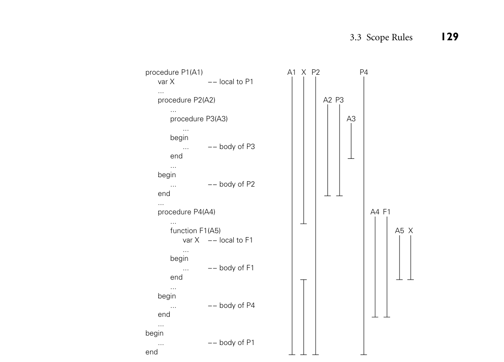
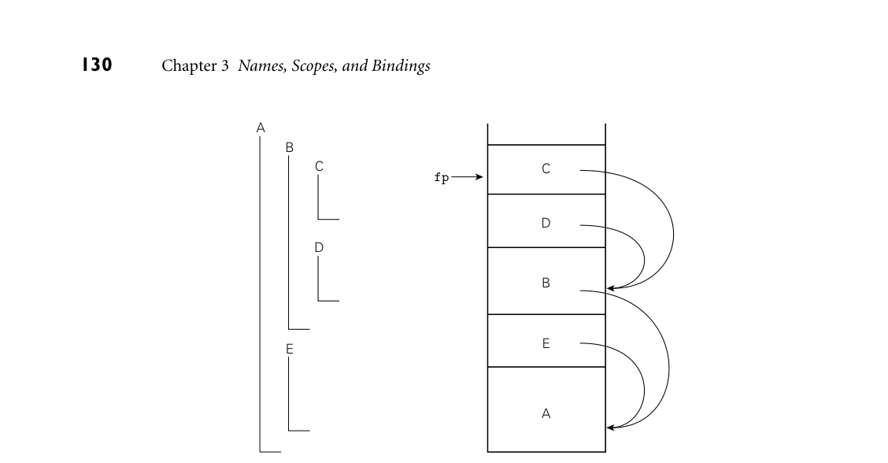

# 3.3 Scope Rules

3.3 Scope Rules
**125**

5.
What determines whether an object is allocated statically, on the stack, or in
the heap?
6.
List the objects and information commonly found in a stack frame.

7.
What is a* frame pointer*? What is it used for?
8.
What is a* calling sequence*?

9.
What are internal and external* fragmentation*?
10. What is* garbage collection*?

11. What is a* dangling reference*?

## 3.3

**Scope Rules**
```
The textual region of the program in which a binding is active is its scope. In
most modern languages, the scope of a binding is determined statically, that is,
at compile time. In C, for example, we introduce a new scope upon entry to a
subroutine. We create bindings for local objects and deactivate bindings for global
objects that are hidden (made invisible) by local objects of the same name. On
subroutine exit, we destroy bindings for local variables and reactivate bindings for
any global objects that were hidden. These manipulations of bindings may at first
glance appear to be run-time operations, but they do not require the execution of
any code: the portions of the program in which a binding is active are completely
determined at compile time. We can look at a C program and know which names
refer to which objects at which points in the program based on purely textual
rules. For this reason, C is said to be statically scoped (some authors say lexically
scoped 3). Other languages, including APL, Snobol, Tcl, and early dialects of Lisp,
are dynamically scoped: their bindings depend on the flow of execution at run
time. We will examine static and dynamic scoping in more detail in Sections 3.3.1
and 3.3.6.
In addition to talking about the “scope of a binding,” we sometimes use the
word “scope” as a noun all by itself, without a specific binding in mind. Infor-
mally, a scope is a program region of maximal size in which no bindings change
(or at least none are destroyed—more on this in Section 3.3.3). Typically, a scope
is the body of a module, class, subroutine, or structured control-flow statement,
sometimes called a block. In C family languages it would be delimited with {...}
braces.
```

**3**
*Lexical scope* is actually a better term than* static scope*, because scope rules based on nesting can
be enforced at run time instead of compile time if desired. In fact, in Common Lisp and Scheme
it is possible to pass the unevaluated text of a subroutine declaration into some other subroutine
as a parameter, and then use the text to create a lexically nested declaration at run time.



*Figure 3.4 Example of nested subroutines, shown in pseudocode. Vertical bars indicate the scope of each name, for a language in which declarations are visible throughout their subroutine. Note the hole in the scope of the outer X.*

### time. Using this register as a base for* displacement* (register plus offset) address-

### ing, target code can access objects within the current subroutine. But what about

### objects in lexically surrounding subroutines? To find these we need a way to find

### the frames corresponding to those scopes at run time. Since a nested subroutine

### may call a routine in an outer scope, the order of stack frames at run time may not

### necessarily correspond to the order of lexical nesting. Nonetheless, we can be sure

### that there* is* some frame for the surrounding scope already in the stack, since the

### current subroutine could not have been called unless it was visible, and it could

### not have been visible unless the surrounding scope was active. (It is actually pos-

### sible in some languages to save a reference to a nested subroutine, and then call

### it when the surrounding scope is no longer active. We defer this possibility to

### Section 3.6.2.)

### The simplest way in which to find the frames of surrounding scopes is to main-

### tain a* static link* in each frame that points to the “parent” frame: the frame of the



*Figure 3.5 Static chains. Subroutines A, B, C, D, and E are nested as shown on the left. If the sequence of nested calls at run time is A, E, B, D, and C, then the static links in the stack will look as shown on the right. The code for subroutine C can find local objects at known offsets from the frame pointer. It can find local objects of the surrounding scope, B, by dereferencing its static chain once and then applying an offset. It can find local objects in B’s surrounding scope, A, by dereferencing its static chain twice and then applying an offset.*

most recent invocation of the lexically surrounding subroutine. If a subroutine is
declared at the outermost nesting level of the program, then its frame will have a
null static link at run time. If a subroutine is nested* k* levels deep, then its frame’s
static link, and those of its parent, grandparent, and so on, will form a* static chain*
of length* k* at run time. To find a variable or parameter declared* j* subroutine
scopes outward, target code at run time can dereference the static chain* j* times,
and then add the appropriate offset. Static chains are illustrated in Figure 3.5. We
**EXAMPLE** 3.6

Static chains
will discuss the code required to maintain them in Section 9.2.
■

3.3.3** Declaration Order**

```
In our discussion so far we have glossed over an important subtlety: suppose an
object x is declared somewhere within block B. Does the scope of x include the
portion of B before the declaration, and if so can x actually be used in that portion
of the code? Put another way, can an expression E refer to any name declared in
the current scope, or only to names that are declared before E in the scope?
Several early languages, including Algol 60 and Lisp, required that all declara-
tions appear at the beginning of their scope. One might at first think that this rule
```

