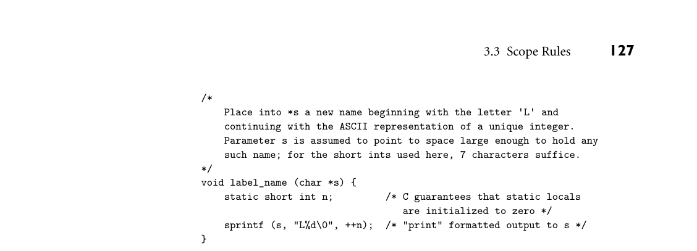
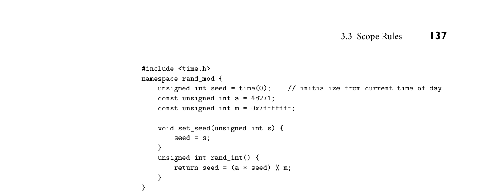
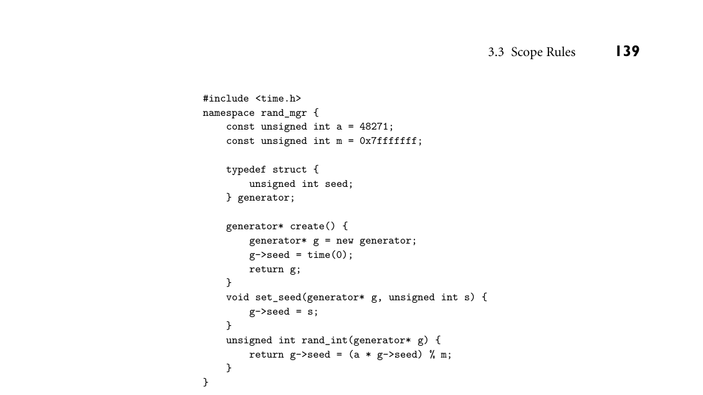
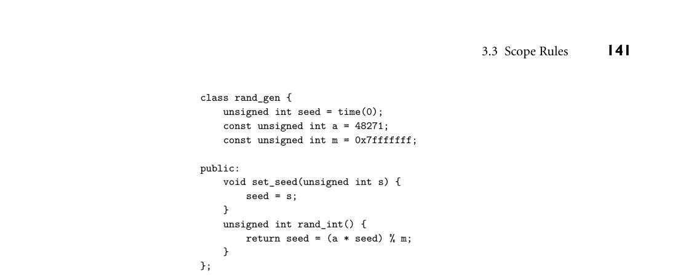
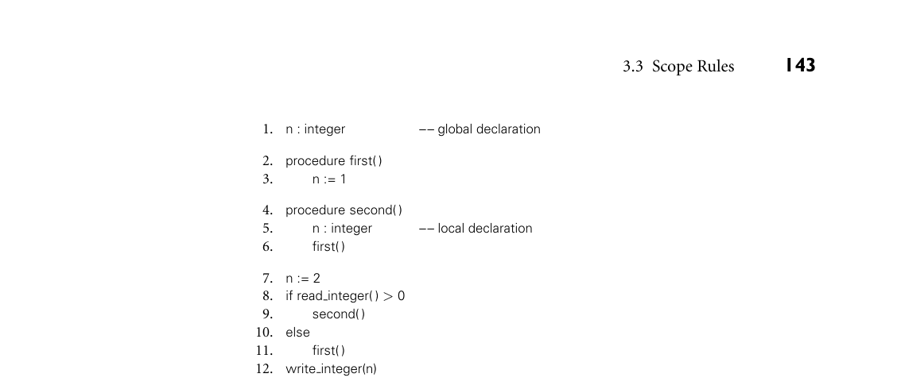

# 3.3 Scope Rules

3.3 Scope Rules 125

5. What determines whether an object is allocated statically, on the stack, or in the heap? 6. List the objects and information commonly found in a stack frame.

7. What is a frame pointer? What is it used for? 8. What is a calling sequence?

9. What are internal and external fragmentation? 10. What is garbage collection?

11. What is a dangling reference?

3.3 Scope Rules

The textual region of the program in which a binding is active is its scope. In most modern languages, the scope of a binding is determined statically, that is, at compile time. In C, for example, we introduce a new scope upon entry to a subroutine. We create bindings for local objects and deactivate bindings for global objects that are hidden (made invisible) by local objects of the same name. On subroutine exit, we destroy bindings for local variables and reactivate bindings for any global objects that were hidden. These manipulations of bindings may at first glance appear to be run-time operations, but they do not require the execution of any code: the portions of the program in which a binding is active are completely determined at compile time. We can look at a C program and know which names refer to which objects at which points in the program based on purely textual rules. For this reason, C is said to be statically scoped (some authors say lexically scoped 3). Other languages, including APL, Snobol, Tcl, and early dialects of Lisp, are dynamically scoped: their bindings depend on the flow of execution at run time. We will examine static and dynamic scoping in more detail in Sections 3.3.1 and 3.3.6. In addition to talking about the “scope of a binding,” we sometimes use the word “scope” as a noun all by itself, without a specific binding in mind. Infor- mally, a scope is a program region of maximal size in which no bindings change (or at least none are destroyed—more on this in Section 3.3.3). Typically, a scope is the body of a module, class, subroutine, or structured control-flow statement, sometimes called a block. In C family languages it would be delimited with {...} braces.

3 Lexical scope is actually a better term than static scope, because scope rules based on nesting can be enforced at run time instead of compile time if desired. In fact, in Common Lisp and Scheme it is possible to pass the unevaluated text of a subroutine declaration into some other subroutine as a parameter, and then use the text to create a lexically nested declaration at run time.

126 Chapter 3 Names, Scopes, and Bindings

Algol 68 and Ada use the term elaboration to refer to the process by which declarations become active when control first enters a scope. Elaboration entails the creation of bindings. In many languages, it also entails the allocation of stack space for local objects, and possibly the assignment of initial values. In Ada it can entail a host of other things, including the execution of error-checking or heap-space-allocating code, the propagation of exceptions, and the creation of concurrently executing tasks (to be discussed in Chapter 13). At any given point in a program’s execution, the set of active bindings is called the current referencing environment. The set is principally determined by static or dynamic scope rules. We shall see that a referencing environment generally corresponds to a sequence of scopes that can be examined (in order) to find the current binding for a given name. In some cases, referencing environments also depend on what are (in a con- fusing use of terminology) called binding rules. Specifically, when a reference to a subroutine S is stored in a variable, passed as a parameter to another subroutine, or returned as a function value, one needs to determine when the referencing en- vironment for S is chosen—that is, when the binding between the reference to S and the referencing environment of S is made. The two principal options are deep binding, in which the choice is made when the reference is first created, and shallow binding, in which the choice is made when the reference is finally used. We will examine these options in more detail in Section 3.6.

3.3.1 Static Scoping

In a language with static (lexical) scoping, the bindings between names and ob- jects can be determined at compile time by examining the text of the program, without consideration of the flow of control at run time. Typically, the “current” binding for a given name is found in the matching declaration whose block most closely surrounds a given point in the program, though as we shall see there are many variants on this basic theme. The simplest static scope rule is probably that of early versions of Basic, in which there was only a single, global scope. In fact, there were only a few hundred possible names, each of which consisted of a letter optionally followed by a digit. There were no explicit declarations; variables were declared implicitly by virtue of being used. Scope rules are somewhat more complex in (pre-Fortran 90) Fortran, though not much more. Fortran distinguishes between global and local variables. The scope of a local variable is limited to the subroutine in which it appears; it is not visible elsewhere. Variable declarations are optional. If a variable is not declared, it is assumed to be local to the current subroutine and to be of type integer if its name begins with the letters I–N, or real otherwise. (Different conventions for implicit declarations can be specified by the programmer. In Fortran 90 and its successors, the programmer can also turn off implicit declarations, so that use of an undeclared variable becomes a compile-time error.)

*Figure 3.3 C code to illustrate the use of static variables.*

3.3 Scope Rules 127

/* Place into *s a new name beginning with the letter 'L' and continuing with the ASCII representation of a unique integer. Parameter s is assumed to point to space large enough to hold any such name; for the short ints used here, 7 characters suffice. */ void label_name (char *s) { static short int n; /* C guarantees that static locals are initialized to zero */ sprintf (s, "L%d\0", ++n); /* "print" formatted output to s */ }

Semantically, the lifetime of a local Fortran variable (both the object itself and the name-to-object binding) encompasses a single execution of the variable’s sub- routine. Programmers can override this rule by using an explicit save statement. (Similar mechanisms appear in many other languages: in C one declares the vari- able static; in Algol one declares it own.) A save-ed (static, own) variable has a lifetime that encompasses the entire execution of the program. Instead of a log- ically separate object for every invocation of the subroutine, the compiler creates a single object that retains its value from one invocation of the subroutine to the next. (The name-to-variable binding, of course, is inactive when the subroutine is not executing, because the name is out of scope.) As an example of the use of static variables, consider the code in Figure 3.3. EXAMPLE 3.4

Static variables in C The subroutine label_name can be used to generate a series of distinct character- string names: L1, L2, .... A compiler might use these names in its assembly language output. ■

3.3.2 Nested Subroutines

The ability to nest subroutines inside each other, introduced in Algol 60, is a fea- ture of many subsequent languages, including Ada, ML, Common Lisp, Python, Scheme, Swift, and (to a limited extent) Fortran 90. Other languages, including C and its descendants, allow classes or other scopes to nest. Just as the local variables of a Fortran subroutine are not visible to other subroutines, any constants, types, variables, or subroutines declared within a scope are not visible outside that scope in Algol-family languages. More formally, Algol-style nesting gives rise to the clos- est nested scope rule for bindings from names to objects: a name that is introduced in a declaration is known in the scope in which it is declared, and in each inter- nally nested scope, unless it is hidden by another declaration of the same name in one or more nested scopes. To find the object corresponding to a given use of a name, we look for a declaration with that name in the current, innermost scope. If there is one, it defines the active binding for the name. Otherwise, we look for a declaration in the immediately surrounding scope. We continue outward,

128 Chapter 3 Names, Scopes, and Bindings

examining successively surrounding scopes, until we reach the outer nesting level of the program, where global objects are declared. If no declaration is found at any level, then the program is in error. Many languages provide a collection of built-in, or predefined objects, such as I/O routines, mathematical functions, and in some cases types such as integer and char. It is common to consider these to be declared in an extra, invisible, outermost scope, which surrounds the scope in which global objects are declared. The search for bindings described in the previous paragraph terminates at this ex- tra, outermost scope, if it exists, rather than at the scope in which global objects are declared. This outermost scope convention makes it possible for a program- mer to define a global object whose name is the same as that of some predefined object (whose “declaration” is thereby hidden, making it invisible). An example of nested scopes appears in Figure 3.4.4 In this example, procedure EXAMPLE 3.5

Nested scopes P2 is called only by P1, and need not be visible outside. It is therefore declared inside P1, limiting its scope (its region of visibility) to the portion of the program shown here. In a similar fashion, P4 is visible only within P1, P3 is visible only within P2, and F1 is visible only within P4. Under the standard rules for nested scopes, F1 could call P2 and P4 could call F1, but P2 could not call F1. Though they are hidden from the rest of the program, nested subroutines are able to access the parameters and local variables (and other local objects) of the surrounding scope(s). In our example, P3 can name (and modify) A1, X, and A2, in addition to A3. Because P1 and F1 both declare local variables named X, the inner declaration hides the outer one within a portion of its scope. Uses of X in F1 refer to the inner X; uses of X in other regions of the code refer to the outer X. ■

A name-to-object binding that is hidden by a nested declaration of the same name is said to have a hole in its scope. In some languages, the object whose name is hidden is simply inaccessible in the nested scope (unless it has more than one name). In others, the programmer can access the outer meaning of a name by applying a qualifier or scope resolution operator. In Ada, for example, a name may be prefixed by the name of the scope in which it is declared, using syntax that resembles the specification of fields in a record. My_proc.X, for example, refers to the declaration of X in subroutine My_proc, regardless of whether some other X has been declared in a lexically closer scope. In C++, which does not allow subroutines to nest, ::X refers to a global declaration of X, regardless of whether the current subroutine also has an X.5

Access to Nonlocal Objects

We have already seen (Section 3.2.2) that the compiler can arrange for a frame pointer register to point to the frame of the currently executing subroutine at run

4 This code is not contrived; it was extracted from an implementation (originally in Pascal) of the FMQ error repair algorithm described in Section C 2.3.5.

5 The C++ :: operator is also used to name members (fields or methods) of a base class that are hidden by members of a derived class; we will consider this use in Section 10.2.2.

*Figure 3.4 Example of nested subroutines, shown in pseudocode. Vertical bars indicate the scope of each name, for a language in which declarations are visible throughout their subroutine. Note the hole in the scope of the outer X.*

3.3 Scope Rules 129

procedure P1(A1)       var X                −− local to P1       ...       procedure P2(A2)             ...             procedure P3(A3)                   ...             begin                   ...         −− body of P3             end             ...       begin             ...               −− body of P2       end       ...       procedure P4(A4)             ...             function F1(A5)                   var X    −− local to F1                   ...             begin                   ...         −− body of F1             end             ...       begin             ...               −− body of P4       end       ... begin       ...                     −− body of P1 end

A1 X P2

P4

A2 P3

A3

A4 F1

A5 X

time. Using this register as a base for displacement (register plus offset) address- ing, target code can access objects within the current subroutine. But what about objects in lexically surrounding subroutines? To find these we need a way to find the frames corresponding to those scopes at run time. Since a nested subroutine may call a routine in an outer scope, the order of stack frames at run time may not necessarily correspond to the order of lexical nesting. Nonetheless, we can be sure that there is some frame for the surrounding scope already in the stack, since the current subroutine could not have been called unless it was visible, and it could not have been visible unless the surrounding scope was active. (It is actually pos- sible in some languages to save a reference to a nested subroutine, and then call it when the surrounding scope is no longer active. We defer this possibility to Section 3.6.2.) The simplest way in which to find the frames of surrounding scopes is to main- tain a static link in each frame that points to the “parent” frame: the frame of the

*Figure 3.5 Static chains. Subroutines A, B, C, D, and E are nested as shown on the left. If the sequence of nested calls at run time is A, E, B, D, and C, then the static links in the stack will look as shown on the right. The code for subroutine C can find local objects at known offsets from the frame pointer. It can find local objects of the surrounding scope, B, by dereferencing its static chain once and then applying an offset. It can find local objects in B’s surrounding scope, A, by dereferencing its static chain twice and then applying an offset.*

130 Chapter 3 Names, Scopes, and Bindings

B A

C

fp C

D

D

B

E

E

A

most recent invocation of the lexically surrounding subroutine. If a subroutine is declared at the outermost nesting level of the program, then its frame will have a null static link at run time. If a subroutine is nested k levels deep, then its frame’s static link, and those of its parent, grandparent, and so on, will form a static chain of length k at run time. To find a variable or parameter declared j subroutine scopes outward, target code at run time can dereference the static chain j times, and then add the appropriate offset. Static chains are illustrated in Figure 3.5. We EXAMPLE 3.6

Static chains will discuss the code required to maintain them in Section 9.2. ■

3.3.3 Declaration Order

In our discussion so far we have glossed over an important subtlety: suppose an object x is declared somewhere within block B. Does the scope of x include the portion of B before the declaration, and if so can x actually be used in that portion of the code? Put another way, can an expression E refer to any name declared in the current scope, or only to names that are declared before E in the scope? Several early languages, including Algol 60 and Lisp, required that all declara- tions appear at the beginning of their scope. One might at first think that this rule

3.3 Scope Rules 131

would avoid the questions in the preceding paragraph, but it does not, because declarations may refer to one another.6 In an apparent attempt to simplify the implementation of the compiler, Pas- EXAMPLE 3.7

A “gotcha” in declare-before-use cal modified the requirement to say that names must be declared before they are used. There are special mechanisms to accommodate recursive types and sub- routines, but in general, a forward reference (an attempt to use a name before its declaration) is a static semantic error. At the same time, however, Pascal retained the notion that the scope of a declaration is the entire surrounding block. Taken together, whole-block scope and declare-before-use rules can interact in surpris- ing ways:

1. const N = 10; 2. ... 3. procedure foo; 4. const 5. M = N; (* static semantic error! *) 6. ... 7. N = 20; (* local constant declaration; hides the outer N *)

Pascal says that the second declaration of N covers all of foo, so the semantic analyzer should complain on line 5 that N is being used before its declaration. The error has the potential to be highly confusing, particularly if the programmer meant to use the outer N:

const N = 10; ... procedure foo; const M = N; (* static semantic error! *) var A : array [1..M] of integer; N : real; (* hiding declaration *)

Here the pair of messages “N used before declaration” and “N is not a constant” are almost certainly not helpful.

DESIGN & IMPLEMENTATION

3.3 Mutual recursion Some Algol 60 compilers were known to process the declarations of a scope in program order. This strategy had the unfortunate effect of implicitly outlawing mutually recursive subroutines and types, something the language designers clearly did not intend [Atk73].

6 We saw an example of mutually recursive subroutines in the recursive descent parsing of Sec- tion 2.3.1. Mutually recursive types frequently arise in linked data structures, where nodes of two types may need to point to each other.

132 Chapter 3 Names, Scopes, and Bindings

In order to determine the validity of any declaration that appears to use a name from a surrounding scope, a Pascal compiler must scan the remainder of the scope’s declarations to see if the name is hidden. To avoid this complication, most Pascal successors (and some dialects of Pascal itself) specify that the scope of an identifier is not the entire block in which it is declared (excluding holes), but rather the portion of that block from the declaration to the end (again excluding holes). If our program fragment had been written in Ada, for example, or in C, C++, or Java, no semantic errors would be reported. The declaration of M would refer to the first (outer) declaration of N. ■ C++ and Java further relax the rules by dispensing with the define-before-use requirement in many cases. In both languages, members of a class (including those that are not defined until later in the program text) are visible inside all of the class’s methods. In Java, classes themselves can be declared in any order. Interestingly, while C# echos Java in requiring declaration before use for local EXAMPLE 3.8

Whole-block scope in C# variables (but not for classes and members), it returns to the Pascal notion of whole-block scope. Thus the following is invalid in C#:

class A { const int N = 10; void foo() { const int M = N; // uses inner N before it is declared const int N = 20; ■

Perhaps the simplest approach to declaration order, from a conceptual point of view, is that of Modula-3, which says that the scope of a declaration is the en- tire block in which it appears (minus any holes created by nested declarations), and that the order of declarations doesn’t matter. The principal objection to this approach is that programmers may find it counterintuitive to use a local variable before it is declared. Python takes the “whole block” scope rule one step further EXAMPLE 3.9

“Local if written” in Python by dispensing with variable declarations altogether. In their place it adopts the unusual convention that the local variables of subroutine S are precisely those variables that are written by some statement in the (static) body of S. If S is nested inside of T, and the name x appears on the left-hand side of assignment statements in both S and T, then the x’s are distinct: there is one in S and one in T. Non-local variables are read-only unless explicitly imported (using Python’s global statement). We will consider these conventions in more detail in Sec- tion 14.4.1, as part of a general discussion of scoping in scripting languages. ■ In the interest of flexibility, modern Lisp dialects tend to provide several op- EXAMPLE 3.10

Declaration order in Scheme tions for declaration order. In Scheme, for example, the letrec and let* con- structs define scopes with, respectively, whole-block and declaration-to-end-of- block semantics. The most frequently used construct, let, provides yet another option:

(let ((A 1)) ; outer scope, with A defined to be 1 (let ((A 2) ; inner scope, with A defined to be 2 (B A)) ; and B defined to be A B)) ; return the value of B

3.3 Scope Rules 133

Here the nested declarations of A and B don’t take effect until after the end of the declaration list. Thus when B is defined, the redefinition of A has not yet taken effect. B is defined to be the outer A, and the code as a whole returns 1. ■

Declarations and Definitions

Recursive types and subroutines introduce a problem for languages that require names to be declared before they can be used: how can two declarations each appear before the other? C and C++ handle the problem by distinguishing be- tween the declaration of an object and its definition. A declaration introduces a name and indicates its scope, but may omit certain implementation details. A definition describes the object in sufficient detail for the compiler to determine its implementation. If a declaration is not complete enough to be a definition, then a separate definition must appear somewhere else in the scope. In C we can EXAMPLE 3.11

Declarations vs definitions in C write

struct manager; /* declaration only */ struct employee { struct manager *boss; struct employee *next_employee; ... }; struct manager { /* definition */ struct employee *first_employee; ... };

and

void list_tail(follow_set fs); /* declaration only */ void list(follow_set fs) { switch (input_token) { case id : match(id); list_tail(fs); ... } void list_tail(follow_set fs) /* definition */ { switch (input_token) { case comma : match(comma); list(fs); ... }

The initial declaration of manager needed only to introduce a name: since point- ers are generally all the same size, the compiler can determine the implementa- tion of employee without knowing any manager details. The initial declaration of list_tail, however, must include the return type and parameter list, so the compiler can tell that the call in list is correct. ■

134 Chapter 3 Names, Scopes, and Bindings

Nested Blocks

In many languages, including Algol 60, C89, and Ada, local variables can be de- clared not only at the beginning of any subroutine, but also at the top of any begin... end ({...}) block. Other languages, including Algol 68, C, and all of C’s descendants, are even more flexible, allowing declarations wherever a state- ment may appear. In most languages a nested declaration hides any outer dec- laration with the same name (Java and C# make it a static semantic error if the outer declaration is local to the current subroutine).

DESIGN & IMPLEMENTATION

3.4 Redeclarations Some languages, particularly those that are intended for interactive use, permit the programmer to redeclare an object: to create a new binding for a given name in a given scope. Interactive programmers commonly use redeclarations to experiment with alternative implementations or to fix bugs during early development. In most interactive languages, the new meaning of the name replaces the old in all contexts. In ML dialects, however, the old meaning of the name may remain accessible to functions that were elaborated before the name was redeclared. This design choice can sometimes be counterintuitive. Here’s an example in OCaml (the lines beginning with # are user input; the others are printed by the interpreter):

# let x = 1;; val x : int = 1 # let f y = x + y;; val f : int -> int = <fun> # let x = 2;; val x : int = 2 # f 3;; - : int = 4

The second line of user input defines f to be a function of one argument (y) that returns the sum of that argument and the previously defined value x. When we redefine x to be 2, however, the function does not notice: it still returns y plus 1. This behavior reflects the fact that OCaml is usually com- piled, bit by bit on the fly, rather than interpreted. When x is redefined, f has already been compiled into a form (bytecode or machine code) that ac- cesses the old meaning of x directly. By comparison, a language like Scheme, which is lexically scoped but usually interpreted, stores the bindings for names in known locations. Programs always access the meanings of names indirectly through those locations: if the meaning of a name changes, all accesses to the name will use the new meaning.

3.3 Scope Rules 135

Variables declared in nested blocks can be very useful, as for example in the EXAMPLE 3.12

Inner declarations in C following C code:

{ int temp = a; a = b; b = temp; }

Keeping the declaration of temp lexically adjacent to the code that uses it makes the program easier to read, and eliminates any possibility that this code will in- terfere with another variable named temp. ■ No run-time work is needed to allocate or deallocate space for variables de- clared in nested blocks; their space can be included in the total space for local variables allocated in the subroutine prologue and deallocated in the epilogue. Exercise 3.9 considers how to minimize the total space required.

3CHECK YOUR UNDERSTANDING 12. What do we mean by the scope of a name-to-object binding?

13. Describe the difference between static and dynamic scoping. 14. What is elaboration?

15. What is a referencing environment? 16. Explain the closest nested scope rule. 17. What is the purpose of a scope resolution operator?

18. What is a static chain? What is it used for? 19. What are forward references? Why are they prohibited or restricted in many programming languages? 20. Explain the difference between a declaration and a definition. Why is the dis- tinction important?

3.3.4 Modules

An important challenge in the construction of any large body of software is to divide the effort among programmers in such a way that work can proceed on multiple fronts simultaneously. This modularization of effort depends critically on the notion of information hiding, which makes objects and algorithms invisi- ble, whenever possible, to portions of the system that do not need them. Properly modularized code reduces the “cognitive load” on the programmer by minimiz- ing the amount of information required to understand any given portion of the

136 Chapter 3 Names, Scopes, and Bindings

system. In a well-designed program the interfaces among modules are as “nar- row” (i.e., simple) as possible, and any design decision that is likely to change is hidden inside a single module. Information hiding is crucial for software maintenance (bug fixes and en- hancement), which tends to significantly outweigh the cost of initial development for most commercial software. In addition to reducing cognitive load, hiding re- duces the risk of name conflicts: with fewer visible names, there is less chance that a newly introduced name will be the same as one already in use. It also safe- guards the integrity of data abstractions: any attempt to access an object outside of the module to which it belongs will cause the compiler to issue an “undefined symbol” error message. Finally, it helps to compartmentalize run-time errors: if a variable takes on an unexpected value, we can generally be sure that the code that modified it is in the variable’s scope.

Encapsulating Data and Subroutines

Unfortunately, the information hiding provided by nested subroutines is limited to objects whose lifetime is the same as that of the subroutine in which they are hidden. When control returns from a subroutine, its local variables will no longer be live: their values will be discarded. We have seen a partial solution to this problem in the form of the save statement in Fortran and the static and own variables of C and Algol. Static variables allow a subroutine to have “memory”—to retain information from one invocation to the next—while protecting that memory from acciden- tal access or modification by other parts of the program. Put another way, static variables allow programmers to build single-subroutine abstractions. Unfortu- nately, they do not allow the construction of abstractions whose interface needs to consist of more than one subroutine. Consider, for example, a simple pseudo- EXAMPLE 3.13

Pseudorandom numbers as a motivation for modules random number generator. In addition to the main rand_int routine, we might want a set_seed routine that primes the generator for a specific pseudorandom sequence (e.g., for deterministic testing). We should like to make the state of the generator, which determines the next pseudorandom number, visible to both rand_int and set_seed, but hide it from the rest of the program. We can achieve this goal in many languages through use of a module construct. ■

Modules as Abstractions

A module allows a collection of objects—subroutines, variables, types, and so on—to be encapsulated in such a way that (1) objects inside are visible to each other, but (2) objects on the inside may not be visible on the outside unless they are exported, and (3) objects on the outside may not be visible on the inside un- less they are imported. Import and export conventions vary significantly from one language to another, but in all cases, only the visibility of objects is affected; modules do not affect the lifetime of the objects they contain.

*Figure 3.6 Pseudorandom number generator module in C++. Uses the linear congruential method, with a default seed taken from the current time of day. While there exist much better (more random) generators, this one is simple, and acceptable for many purposes.*

3.3 Scope Rules 137

#include <time.h> namespace rand_mod { unsigned int seed = time(0); // initialize from current time of day const unsigned int a = 48271; const unsigned int m = 0x7fffffff;

void set_seed(unsigned int s) { seed = s; } unsigned int rand_int() { return seed = (a * seed) % m; } }

Modules were one of the principal language innovations of the late 1970s and early 1980s; they appeared in Clu7 (which called them clusters), Modula (1, 2, and 3), Turing, and Ada 83, among others. In more modern form, they also appear in Haskell, C++, Java, C#, and all the major scripting languages. Several languages, including Ada, Java, and Perl, use the term package instead of module. Others, including C++, C#, and PHP, use namespace. Modules can be emulated to some degree through use of the separate compilation facilities of C; we discuss this possibility in Section C 3.8. As an example of the use of modules, consider the pseudorandom number EXAMPLE 3.14

Pseudorandom number generator in C++ generator shown in Figure 3.6. As discussed in Sidebar 3.5, this module (names- pace) would typically be placed in its own file, and then imported wherever it is needed in a C++ program. Bindings of names made inside the namespace may be partially or totally hid- den (inactive) on the outside—but not destroyed. In C++, where namespaces can appear only at the outermost level of lexical nesting, integer seed would retain its value throughout the execution of the program, even though it is visible only to set_seed and rand_int. Outside the rand_mod namespace, C++ allows set_seed and rand_int to be accessed as rand_mod::set_seed and rand_mod::rand_int. The seed variable could also be accessed as rand_mod::seed, but this is probably not a good idea, and the need for the rand_mod prefix means it’s unlikely to happen by accident.

7 Barbara Liskov (1939–), the principal designer of Clu, is one of the leading figures in the history of abstraction mechanisms. A faculty member at MIT since 1971, she was also the principal de- signer of the Argus programming language, which combined language and database technology to improve the reliability and programmability of distributed systems. She received the ACM Turing Award in 2008.

138 Chapter 3 Names, Scopes, and Bindings

The need for the prefix can be eliminated, on a name-by-name basis, with a using directive:

using rand_mod::rand_int; ... int r = rand_int();

Alternatively, the full set of names declared in a namespace can be made available at once:

using namespace rand_mod; ... set_seed(12345); int r = rand_int();

Unfortunately, such wholesale exposure of a module’s names increases both the likelihood of conflict with names in the importing context and the likelihood that objects like seed, which are logically private to the module, will be accessed accidentally. ■

Imports and Exports

Some languages allow the programmer to specify that names exported from mod- ules be usable only in restricted ways. Variables may be exported read-only, for example, or types may be exported opaquely, meaning that variables of that type may be declared, passed as arguments to the module’s subroutines, and possibly compared or assigned to one another, but not manipulated in any other way. Modules into which names must be explicitly imported are said to be closed scopes. By extension, modules that do not require imports are said to be open scopes. Imports serve to document the program: they increase modularity by requiring a module to specify the ways in which it depends on the rest of the pro- gram. They also reduce name conflicts by refraining from importing anything that isn’t needed. Modules are closed in Modula (1, 2, and 3) and Haskell. C++ is representative of an increasingly common option, in which names are auto- matically exported, but are available on the outside only when qualified with the module name—unless they are explicitly “imported” by another scope (e.g., with the C++ using directive), at which point they are available unqualified. This op- tion, which we might call selectively open modules, also appears in Ada, Java, C#, and Python, among others.

Modules as Managers

Modules facilitate the construction of abstractions by allowing data to be made private to the subroutines that use them. When used as in Figure 3.6, however, each module defines a single abstraction. Continuing our previous example, there EXAMPLE 3.15

Module as “manager” for a type are times when it may be desirable to have more than one pseudorandom num- ber generator. When debugging a game, for example, we might want to obtain deterministic (repeatable) behavior in one particular game module (a particular

*Figure 3.7 Manager module for pseudorandom numbers in C++.*

3.3 Scope Rules 139

#include <time.h> namespace rand_mgr { const unsigned int a = 48271; const unsigned int m = 0x7fffffff;

typedef struct { unsigned int seed; } generator;

generator* create() { generator* g = new generator; g->seed = time(0); return g; } void set_seed(generator* g, unsigned int s) { g->seed = s; } unsigned int rand_int(generator* g) { return g->seed = (a * g->seed) % m; } }

character, perhaps), regardless of uses of pseudorandom numbers elsewhere in the program. If we want to have several generators, we can make our namespace a “manager” for instances of a generator type, which is then exported from the module, as shown in Figure 3.7. The manager idiom requires additional subrou- tines to create/initialize and possibly destroy generator instances, and it requires that every subroutine (set_seed, rand_int, create) take an extra parameter, to specify the generator in question. Given the declarations in Figure 3.7, we could create and use an arbitrary num- ber of generators:

using rand_mgr::generator; generator *g1 = rand_mgr::create(); generator *g2 = rand_mgr::create(); ... using rand_mgr::rand_int; int r1 = rand_int(g1); int r2 = rand_int(g2);

In more complex programs, it may make sense for a module to export several related types, instances of which can then be passed to its subroutines. ■

3.3.5 Module Types and Classes

An alternative solution to the multiple instance problem appeared in Eu- clid, which treated each module as a type, rather than a simple encapsulation

140 Chapter 3 Names, Scopes, and Bindings

construct. Given a module type, the programmer could declare an arbitrary number of similar module objects. As it turns out, the classes of modern object- oriented languages are an extension of module types. Access to a module instance typically looks like access to an object, and we can illustrate the ideas in any object-oriented language. For our C++ pseudorandom number example, the EXAMPLE 3.16

A pseudorandom number generator type syntax

generator *g = rand_mgr::create(); ... int r = rand_int(g);

might be replaced by

rand_gen *g = new rand_gen(); ... int r = g->rand_int();

where the rand_gen class is declared as in Figure 3.8. Module types or classes allow the programmer to think of the rand_int routine as “belonging to” the generator, rather than as a separate entity to which the generator must be passed

DESIGN & IMPLEMENTATION

3.5 Modules and separate compilation One of the hallmarks of a good abstraction is that it tends to be useful in multi- ple contexts. To facilitate code reuse, many languages make modules the basis of separate compilation. Modula-2 actually provided two different kinds of modules: one (external modules) for separate compilation, the other (internal modules) for textual nesting within a larger scope. Experience with these op- tions eventually led Niklaus Wirth, the designer of Modula-2, to conclude that external modules were by far the more useful variety; he omitted the internal version from his subsequent language, Oberon. Many would argue, however, that internal modules find their real utility only when extended with instan- tiation and inheritance. Indeed, as noted near the end of this section, many object-oriented languages provide both modules and classes. The former sup- port separate compilation and serve to minimize name conflicts; the latter are for data abstraction. To facilitate separate compilation, modules in many languages (Modula-2 and Oberon among them) can be divided into a declaration part (header) and an implementation part (body), each of which occupies a separate file. Code that uses the exports of a given module can be compiled as soon as the header exists; it is not dependent on the body. In particular, work on the bodies of cooperating modules can proceed concurrently once the headers exist. We will return to the subjects of separate compilation and code reuse in Sections C 3.8 and 10.1, respectively.

*Figure 3.8 Pseudorandom number generator class in C++.*

3.3 Scope Rules 141

class rand_gen { unsigned int seed = time(0); const unsigned int a = 48271; const unsigned int m = 0x7fffffff;

public: void set_seed(unsigned int s) { seed = s; } unsigned int rand_int() { return seed = (a * seed) % m; } };

as an argument. Conceptually, there is a dedicated rand_int routine for every generator (rand_gen object). In practice, of course, it would be highly wasteful to create multiple copies of the code. As we shall see in Chapter 10, rand_gen instances really share a single pair of set_seed and rand_int routines, and the compiler arranges for a pointer to the relevant instance to be passed to the routine as an extra, hidden parameter. The implementation turns out to be very similar to that of Figure 3.7, but the programmer need not think of it that way. ■

Object Orientation

The difference between module types and classes is a powerful pair of features found together in the latter but not the former—namely, inheritance and dynamic method dispatch.8 Inheritance allows new classes to be defined as extensions or refinements of existing classes. Dynamic method dispatch allows a refined class to override the definition of an operation in its parent class, and for the choice among definitions to be made at run time, on the basis of whether a particular object belongs to the child class or merely to the parent. Inheritance facilitates a programming style in which all or most operations are thought of as belonging to objects, and in which new objects can inherit many of their operations from existing objects, without the need to rewrite code. Classes have their roots in Simula-67, and were further developed in Smalltalk. They ap- pear in many modern languages, including Eiffel, OCaml, C++, Java, C#, and sev- eral scripting languages, notably Python and Ruby. Inheritance mechanisms can also be found in certain languages that are not usually considered object-oriented, including Modula-3, Ada 95, and Oberon. We will examine inheritance, dynamic dispatch, and their impact on scope rules in Chapter 10 and in Section 14.4.4.

8 A few languages—notablymembers of the ML family—havemodule types with inheritance—but still without dynamic method dispatch. Modules in most languages are missing both features.

142 Chapter 3 Names, Scopes, and Bindings

Module types and classes (ignoring issues related to inheritance) require only simple changes to the scope rules defined for modules in Section 3.3.4. Every instance A of a module type or class (e.g., every rand_gen) has a separate copy of the module or class’s variables. These variables are then visible when executing one of A’s operations. They may also be indirectly visible to the operations of some other instance B if A is passed as a parameter to one of those operations. This rule makes it possible in most object-oriented languages to construct binary (or more-ary) operations that can manipulate the variables (fields) of more than one instance of a class.

Modules Containing Classes

While there is a clear progression from modules to module types to classes, it is not necessarily the case that classes are an adequate replacement for modules in all cases. Suppose we are developing an interactive “first person” game. Class EXAMPLE 3.17

Modules and classes in a large application hierarchies may be just what we need to represent characters, possessions, build- ings, goals, and a host of other data abstractions. At the same time, especially on a project with a large team of programmers, we will probably want to divide the functionality of the game into large-scale subsystems such as graphics and ren- dering, physics, and strategy. These subsystems are really not data abstractions, and we probably don’t want the option to create multiple instances of them. They are naturally captured with traditional modules, particularly if those modules are designed for separate compilation (Section 3.8). Recognizing the need for both multi-instance abstractions and functional subdivision, many languages, includ- ing C++, Java, C#, Python, and Ruby, provide separate class and module mecha- nisms. ■

3.3.6 Dynamic Scoping

In a language with dynamic scoping, the bindings between names and objects depend on the flow of control at run time, and in particular on the order in which subroutines are called. In comparison to the static scope rules discussed in the previous section, dynamic scope rules are generally quite simple: the “current” binding for a given name is the one encountered most recently during execution, and not yet destroyed by returning from its scope. Languages with dynamic scoping include APL, Snobol, Tcl, TEX (the type- setting language with which this book was created), and early dialects of Lisp [MAE+65, Moo78, TM81] and Perl.9 Because the flow of control cannot in gen- eral be predicted in advance, the bindings between names and objects in a lan- guage with dynamic scoping cannot in general be determined by a compiler. As a

9 Scheme and Common Lisp are statically scoped, though the latter allows the programmer to specify dynamic scoping for individual variables. Static scoping was added to Perl in version 5; the programmer now chooses static or dynamic scoping explicitly in each variable declaration. (We consider this choice in more detail in Section 14.4.1.)

*Figure 3.9 Static versus dynamic scoping. Program output depends on both scope rules and, in the case of dynamic scoping, a value read at run time.*

3.3 Scope Rules 143

1. n : integer –– global declaration

2. procedure first( ) 3. n := 1

4. procedure second( ) 5. n : integer –– local declaration 6. first( )

7. n := 2 8. if read integer( ) > 0 9. second( ) 10. else 11. first( ) 12. write integer(n)

result, many semantic rules in a language with dynamic scoping become a matter of dynamic semantics rather than static semantics. Type checking in expressions and argument checking in subroutine calls, for example, must in general be de- ferred until run time. To accommodate all these checks, languages with dynamic scoping tend to be interpreted, rather than compiled. Consider the program in Figure 3.9. If static scoping is in effect, this program EXAMPLE 3.18

Static vs dynamic scoping prints a 1. If dynamic scoping is in effect, the output depends on the value read at line 8 at run time: if the input is positive, the program prints a 2; otherwise it prints a 1. Why the difference? At issue is whether the assignment to the variable n at line 3 refers to the global variable declared at line 1 or to the local variable declared at line 5. Static scope rules require that the reference resolve to the closest lexically enclosing declaration, namely the global n. Procedure first changes n to 1, and line 12 prints this value. Dynamic scope rules, on the other hand, require that we choose the most recent, active binding for n at run time.

DESIGN & IMPLEMENTATION

3.6 Dynamic scoping It is not entirely clear whether the use of dynamic scoping in Lisp and other early interpreted languages was deliberate or accidental. One reason to think that it may have been deliberate is that it makes it very easy for an interpreter to look up the meaning of a name: all that is required is a stack of declarations (we examine this stack more closely in Section C 3.4.2). Unfortunately, this simple implementation has a very high run-time cost, and experience indicates that dynamic scoping makes programs harder to understand. The modern consen- sus seems to be that dynamic scoping is usually a bad idea (see Exercise 3.17 and Exploration 3.36 for two exceptions).

