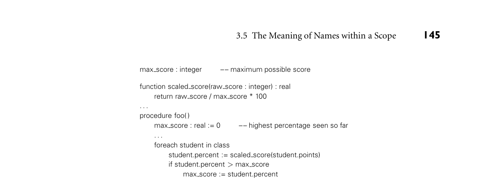
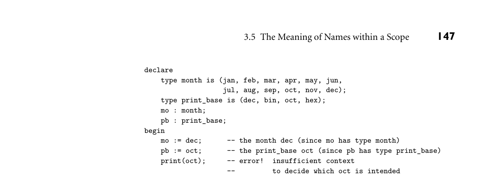

# 3.5 The Meaning of Names within a Scope

*Figure 3.10 The problem with dynamic scoping. Procedure scaled score probably does not do what the programmer intended when dynamic scope rules allow procedure foo to change the meaning of max score.*

3.5 The Meaning of Names within a Scope 145

max score : integer –– maximum possible score

function scaled score(raw score : integer) : real return raw score / max score * 100 . . . procedure foo( ) max score : real := 0 –– highest percentage seen so far . . . foreach student in class student.percent := scaled score(student.points) if student.percent > max score max score := student.percent

An association list (or A-list for short) is simply a list of name/value pairs. When used to implement dynamic scoping it functions as a stack: new declara- tions are pushed as they are encountered, and popped at the end of the scope in which they appeared. Bindings are found by searching down the list from the top. A central reference table avoids the need for linear-time search by maintaining an explicit mapping from names to their current meanings. Lookup is faster, but scope entry and exit are somewhat more complex, and it becomes substantially more difficult to save a referencing environment for future use (we discuss this issue further in Section 3.6.1).

3.5 The Meaning of Names within a Scope

So far in our discussion of naming and scopes we have assumed that there is a one-to-one mapping between names and visible objects at any given point in a program. This need not be the case. Two or more names that refer to the same object at the same point in the program are said to be aliases. A name that can refer to more than one object at a given point in the program is said to be overloaded. Overloading is in turn related to the more general subject of polymorphism, which allows a subroutine or other program fragment to behave in different ways depending on the types of its arguments.

3.5.1 Aliases

Simple examples of aliases occur in the variant records and unions of many pro- gramming languages (we will discuss these features detail in Section C 8.1.3).

146 Chapter 3 Names, Scopes, and Bindings

They also arise naturally in programs that make use of pointer-based data struc- tures. A more subtle way to create aliases in many languages is to pass a variable EXAMPLE 3.20

Aliasing with parameters by reference to a subroutine that also accesses that variable directly. Consider the following code in C++:

double sum, sum_of_squares; ... void accumulate(double& x) { // x is passed by reference sum += x; sum_of_squares += x * x; }

If we pass sum as an argument to accumulate, then sum and x will be aliases for one another inside the called routine, and the program will probably not do what the programmer intended. ■ As a general rule, aliases tend to make programs more confusing than they otherwise would be. They also make it much more difficult for a compiler to perform certain important code improvements. Consider the following EXAMPLE 3.21

Aliases and code improvement C code:

int a, b, *p, *q; ... a = *p; /* read from the variable referred to by p */ *q = 3; /* assign to the variable referred to by q */ b = *p; /* read from the variable referred to by p */

DESIGN & IMPLEMENTATION

3.7 Pointers in C and Fortran The tendency of pointers to introduce aliases is one of the reasons why For- tran compilers tended, historically, to produce faster code than C compilers: pointers are heavily used in C, but missing from Fortran 77 and its predeces- sors. It is only in recent years that sophisticated alias analysis algorithms have allowed C compilers to rival their Fortran counterparts in speed of generated code. Pointer analysis is sufficiently important that the designers of the C99 standard decided to add a new keyword to the language. The restrict qual- ifier, when attached to a pointer declaration, is an assertion on the part of the programmer that the object to which the pointer refers has no alias in the cur- rent scope. It is the programmer’s responsibility to ensure that the assertion is correct; the compiler need not attempt to check it. C99 also introduced strict aliasing. This allows the compiler to assume that pointers of different types will never refer to the same location in memory. Most compilers provide a command-line option to disable optimizations that exploit this rule; other- wise (poorly written) legacy programs may behave incorrectly when compiled at higher optimization levels.

*Figure 3.11 Overloading of enumeration constants in Ada.*

3.5 The Meaning of Names within a Scope 147

declare type month is (jan, feb, mar, apr, may, jun, jul, aug, sep, oct, nov, dec); type print_base is (dec, bin, oct, hex); mo : month; pb : print_base; begin mo := dec; -- the month dec (since mo has type month) pb := oct; -- the print_base oct (since pb has type print_base) print(oct); -- error! insufficient context -- to decide which oct is intended

The initial assignment to a will, on most machines, require that *p be loaded into a register. Since accessing memory is expensive, the compiler will want to hang on to the loaded value and reuse it in the assignment to b. It will be unable to do so, however, unless it can verify that p and q cannot refer to the same object—that is, that *p and *q are not aliases. While compile-time verification of this sort is possible in many common cases, in general it’s undecidable. ■

3.5.2 Overloading

Most programming languages provide at least a limited form of overloading. In C, for example, the plus sign (+) is used to name several different functions, in- cluding signed and unsigned integer and floating-point addition. Most program- mers don’t worry about the distinction between these two functions—both are based on the same mathematical concept, after all—but they take arguments of different types and perform very different operations on the underlying bits. A EXAMPLE 3.22

Overloaded enumeration constants in Ada slightly more sophisticated form of overloading appears in the enumeration con- stants of Ada. In Figure 3.11, the constants oct and dec refer either to months or to numeric bases, depending on the context in which they appear. ■ Within the symbol table of a compiler, overloading must be handled (resolved) by arranging for the lookup routine to return a list of possible meanings for the requested name. The semantic analyzer must then choose from among the ele- ments of the list based on context. When the context is not sufficient to decide, as in the call to print in Figure 3.11, then the semantic analyzer must announce an error. Most languages that allow overloaded enumeration constants allow the EXAMPLE 3.23

Resolving ambiguous overloads programmer to provide appropriate context explicitly. In Ada, for example, one can say

print(month'(oct));

In Modula-3 and C#, every use of an enumeration constant must be prefixed with a type name, even when there is no chance of ambiguity:

*Figure 3.12 Simple example of overloading in C++. In each case the compiler can tell which function is intended by the number and types of arguments.*

148 Chapter 3 Names, Scopes, and Bindings

struct complex { double real, imaginary; }; enum base {dec, bin, oct, hex};

int i; complex x;

void print_num(int n) { ... void print_num(int n, base b) { ... void print_num(complex c) { ...

print_num(i); // uses the first function above print_num(i, hex); // uses the second function above print_num(x); // uses the third function above

mo := month.dec; (* Modula-3 *)

pb = print_base.oct; // C#

In C, one cannot overload enumeration constants at all; every constant visible in a given scope must be distinct. C++11 introduced new syntax to give the program- mer control over this behavior: enum constants must be distinct; enum class constants must be qualified with the class name (e.g., month::oct). ■ Both Ada and C++ have elaborate facilities for overloading subroutine names. EXAMPLE 3.24

Overloading in C++ Many of the C++ facilities carry over to Java and C#. A given name may refer to an arbitrary number of subroutines in the same scope, so long as the subrou- tines differ in the number or types of their arguments. C++ examples appear in Figure 3.12. ■

Redefining Built-in Operators

Many languages also allow the built-in arithmetic operators (+, -, *, etc.) to be overloaded with user-defined functions. Ada, C++, and C# do this by defining EXAMPLE 3.25

Operator overloading in Ada alternative prefix forms of each operator, and defining the usual infix forms to be abbreviations (or “syntactic sugar”) for the prefix forms. In Ada, A + B is short for "+"(A, B). If "+" (the prefix form) is overloaded, then + (the infix form) will work for the new types as well. It must be possible to resolve the overloading (determine which + is intended) from the types of A and B. ■ Fortran 90 provides a special interface construct that can be used to associate an operator with some named binary function. In C++ and C#, EXAMPLE 3.26

Operator overloading in C++ which are object-oriented, A + B may be short for either operator+(A, B) or A.operator+(B). In the latter case, A is an instance of a class (module type) that defines an operator+ function. In C++ one might say

3.5 The Meaning of Names within a Scope 149

class complex { double real, imaginary; ... public: complex operator+(complex other) { return complex(real + other.real, imaginary + other.imaginary); } ... }; ... complex A, B, C; ... C = A + B; // uses user-defined operator+

C# syntax is similar. ■ In Haskell, user-defined infix operators are simply functions whose names EXAMPLE 3.27

Infix operators in Haskell consist of non-alphanumeric characters:

let a @@ b = a * 2 + b

Here we have defined a 2-argument operator named @@. We could also have de- clared it with the usual prefix notation, in which case we would have needed to enclose the name in parentheses:

let (@@) a b = a * 2 + b

Either way, both 3 @@ 4 and (@@) 3 4 will evaluate to 10. (An arbitrary function can also be used as infix operator in Haskell by enclosing its name in backquotes. With an appropriate definition, gcd 8 12 and 8 `gcd` 12 will both evaluate to 4.) Unlike most languages, Haskell allows the programmer to specify both the as- sociativity and the precedence of user-defined operators. We will return to this subject in Section 6.1.1. ■ Both operators and ordinary functions can be overloaded in Haskell, using a EXAMPLE 3.28

Overloading with type classes mechanism known as type classes. Among the simplest of these is the class Eq, declared in the standard library as

DESIGN & IMPLEMENTATION

3.8 User-defined operators in OCaml OCaml does not support overloading, but it does allow the user to create new operators, whose names—as in Haskell—consist of non-alphanumeric char- acters. Each such name must begin with the name of one of the built-in op- erators, from which the new operator inherits its syntactic role (prefix, infix, or postfix) and precedence. So, for example,+.is used for floating-point addi- tion; +/ is used for “bignum” (arbitrary precision) integer addition.

150 Chapter 3 Names, Scopes, and Bindings

class Eq a, where (==) :: a -> a -> Bool

This declaration establishes Eq as the set of types that provide an == operator. Any instance of ==, for some particular type a, must take two arguments (each of type a) and return a Boolean result. In other words, == is an overloaded operator, supported by all types of class Eq; each such type must provide its own equality definition. The definition for integers, again from the standard library, looks like this:

instance Eq Integer where x == y = x `integerEq` y

Here integerEq is the built-in, non-overloaded integer equality operator. ■ Type classes can build upon themselves. The Haskell Ord class, for example, encompasses all Eq types that also support the operators <, >, <=, and >=. The Num class (simplifying a bit) encompasses all Eq types that also support addition, subtraction, and multiplication. In addition to making overloading a bit more explicit than it is in most languages, type classes make it possible to specify that certain polymorphic functions can be used only when their arguments are of a type that supports some particular overloaded function (for more on this subject, see Sidebar 7.7).

Related Concepts

When considering function and subroutine calls, it is important to distinguish overloading from the related concepts of coercion and polymorphism. All three can be used, in certain circumstances, to pass arguments of multiple types to (or return values of multiple types from) what appears to be a single named routine. The syntactic similarity, however, hides significant differences in semantics and pragmatics. Coercion, which we will cover in more detail in Section 7.2.2, is the process by which a compiler automatically converts a value of one type into a value of another type when that second type is required by the surrounding context. Poly- morphism, which we will consider in Sections 7.1.2, 7.3, 10.1.1, and 14.4.4, allows a single subroutine to accept arguments of multiple types. Consider a print routine designed to display its argument on the standard out- EXAMPLE 3.29

Printing objects of multiple types put stream, and suppose that we wish to be able to display objects of multiple types. With overloading, we might write a separate print routine for each type of interest. Then when it sees a call to print(my object), the compiler would choose the appropriate routine based on the type of my object. Now suppose we already have a print routine that accepts a floating-point ar- gument. With coercion, we might be able to print integers by passing them to this existing routine, rather than writing a new one. When it sees a call to print(my integer), the compiler would coerce (convert) the argument automati- cally to floating-point type prior to the call.

3.5 The Meaning of Names within a Scope 151

Finally, suppose we have a language in which many types support a to string operation that will generate a character-string representation of an object of that type. We might then be able to write a polymorphic print routine that accepts an argument of any type for which to string is defined. The to string operation might itself be polymorphic, built in, or simply overloaded; in any of these cases, print could call it and output the result. ■ In short, overloading allows the programmerto give the same name to multiple objects, and to disambiguate (resolve) them based on context—for subroutines, on the number or types of arguments. Coercion allows the compiler to perform an automatic type conversion to make an argument conform to the expected type of some existing routine. Polymorphism allows a single routine to accept argu- ments of multiple types, provided that it attempts to use them only in ways that their types support.

3CHECK YOUR UNDERSTANDING 21. Explain the importance of information hiding.

22. What is an opaque export? 23. Why might it be useful to distinguish between the header and the body of a module? 24. What does it mean for a scope to be closed?

25. Explain the distinction between “modules as managers” and “modules as types.”

26. How do classes differ from modules? 27. Why might it be useful to have modules and classes in the same language?

28. Why does the use of dynamic scoping imply the need for run-time type check- ing?

29. Explain the purpose of a compiler’s symbol table. 30. What are aliases? Why are they considered a problem in language design and implementation? 31. Explain the value of the restrict qualifier in C.

32. What is overloading? How does it differ from coercion and polymorphism? 33. What are type classes in Haskell? What purpose do they serve?

