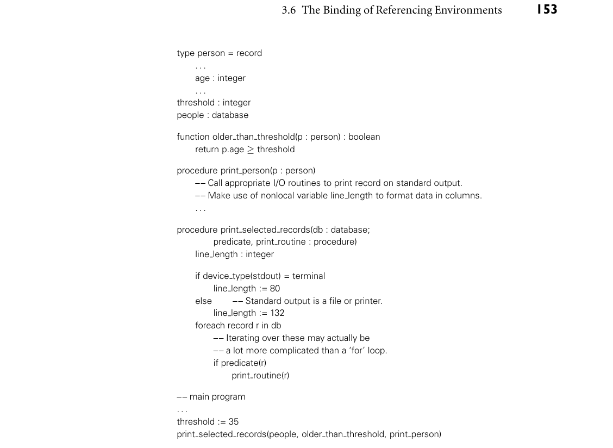
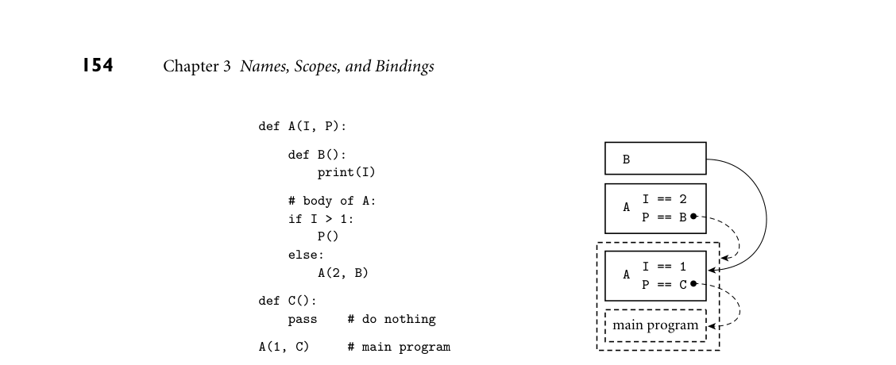

# 3.6 The Binding of Referencing Environments

152 Chapter 3 Names, Scopes, and Bindings

3.6 The Binding of Referencing Environments

We have seen in Section 3.3 how scope rules determine the referencing environ- ment of a given statement in a program. Static scope rules specify that the refer- encing environment depends on the lexical nesting of program blocks in which names are declared. Dynamic scope rules specify that the referencing environ- ment depends on the order in which declarations are encountered at run time. An additional issue that we have not yet considered arises in languages that allow one to create a reference to a subroutine—for example, by passing it as a parame- ter. When should scope rules be applied to such a subroutine: when the reference is first created, or when the routine is finally called? The answer is particularly im- portant for languages with dynamic scoping, though we shall see that it matters even in languages with static scoping. A dynamic scoping example appears as pseudocode in Figure 3.13. Procedure EXAMPLE 3.30

Deep and shallow binding print selected records is assumed to be a general-purpose routine that knows how to traverse the records in a database, regardless of whether they represent people, sprockets, or salads. It takes as parameters a database, a predicate to make print/don’t print decisions, and a subroutine that knows how to format the data in the records of this particular database. We have hypothesized that procedure print person uses the value of nonlocal variable line length to calculate the num- ber and width of columns in its output. In a language with dynamic scoping, it is natural for procedure print selected records to declare and initialize this variable locally, knowing that code inside print routine will pick it up if needed. For this coding technique to work, the referencing environment of print routine must not be created until the routine is actually called by print selected records. This late binding of the referencing environment of a subroutine that has been passed as a parameter is known as shallow binding. It is usually the default in languages with dynamic scoping. For function older than threshold, by contrast, shallow binding may not work well. If, for example, procedure print selected records happens to have a local variable named threshold, then the variable set by the main program to influ- ence the behavior of older than threshold will not be visible when the function is finally called, and the predicate will be unlikely to work correctly. In such a situation, the code that originally passes the function as a parameter has a par- ticular referencing environment (the current one) in mind; it does not want the routine to be called in any other environment. It therefore makes sense to bind the environment at the time the routine is first passed as a parameter, and then restore that environment when the routine is finally called. That is, we arrange for older than threshold to see, when it is eventually called, the same referencing environment it would have seen if it had been called at the point where the refer- ence was created. This early binding of the referencing environment is known as deep binding. It is almost always the default in languages with static scoping, and is sometimes available as an option with dynamic scoping as well. ■

*Figure 3.13 Program (in pseudocode) to illustrate the importance of binding rules. One might argue that deep binding is appropriate for the environment of function older than threshold (for access to threshold), while shallow binding is appropriate for the environment of procedure print person (for access to line length).*

3.6.1 Subroutine Closures

Deep binding is implemented by creating an explicit representation of a refer- encing environment (generally the one in which the subroutine would execute if called at the present time) and bundling it together with a reference to the subroutine. The bundle as a whole is referred to as a closure. Usually the sub- routine itself can be represented in the closure by a pointer to its code. In a lan- guage with dynamic scoping, the representation of the referencing environment depends on whether the language implementation uses an association list or a

*Figure 3.14 Deep binding in Python. At right is a conceptual view of the run-time stack. Referencing environments captured in closures are shown as dashed boxes and arrows. When B is called via formal parameter P, two instances of I exist. Because the closure for P was created in the initial invocation of A, B’s static link (solid arrow) points to the frame of that earlier invocation. B uses that invocation’s instance of I in its print statement, and the output is a 1.*

central reference table for run-time lookup of names; we consider these alterna- tives at the end of Section C 3.4.2. In early dialects of Lisp, which used dynamic scoping, deep binding was avail- able via the built-in primitive function, which took a function as its argument and returned a closure whose referencing environment was the one in which the function would have executed if called at that moment in time. The closure could then be passed as a parameter to another function. If and when it was eventually called, it would execute in the saved environment. (Closures work slightly differ- ently from “bare” functions in most Lisp dialects: they must be called by passing them to the built-in primitives funcall or apply.) At first glance, one might be tempted to think that the binding time of refer- encing environments would not matter in a language with static scoping. After all, the meaning of a statically scoped name depends on its lexical nesting, not on the flow of execution, and this nesting is the same whether it is captured at the time a subroutine is passed as a parameter or at the time the subroutine is called. The catch is that a running program may have more than one instance of an ob- ject that is declared within a recursive subroutine. A closure in a language with static scoping captures the current instance of every object, at the time the closure is created. When the closure’s subroutine is called, it will find these captured in- stances, even if newer instances have subsequently been created by recursive calls. One could imagine combining static scoping with shallow binding [VF82], but the combination does not seem to make much sense, and does not appear to have been adopted in any language. Figure 3.14 contains a Python program that illus- EXAMPLE 3.31

Binding rules with static scoping trates the impact of binding rules in the presence of static scoping. This program prints a 1. With shallow binding it would print a 2. ■

3.6 The Binding of Referencing Environments 155

It should be noted that binding rules matter with static scoping only when accessing objects that are neither local nor global, but are defined at some inter- mediate level of nesting. If an object is local to the currently executing subroutine, then it does not matter whether the subroutine was called directly or through a closure; in either case local objects will have been created when the subroutine started running. If an object is global, there will never be more than one instance, since the main body of the program is not recursive. Binding rules are therefore irrelevant in languages like C, which has no nested subroutines, or Modula-2, which allows only outermost subroutines to be passed as parameters, thus ensur- ing that any variable defined outside the subroutine is global. (Binding rules are also irrelevant in languages like PL/I and Ada 83, which do not permit subroutines to be passed as parameters at all.) Suppose then that we have a language with static scoping in which nested sub- routines can be passed as parameters, with deep binding. To represent a closure for subroutine S, we can simply save a pointer to S’s code together with the static link that S would use if it were called right now, in the current environment. When S is finally called, we temporarily restore the saved static link, rather than creating a new one. When S follows its static chain to access a nonlocal object, it will find the object instance that was current at the time the closure was created. This instance may not have the value it had at the time the closure was created, but its identity, at least, will reflect the intent of the closure’s creator.

3.6.2 First-Class Values and Unlimited Extent

In general, a value in a programming language is said to have first-class status if it can be passed as a parameter, returned from a subroutine, or assigned into a variable. Simple types such as integers and characters are first-class values in most programming languages. By contrast, a “second-class” value can be passed as a parameter, but not returned from a subroutine or assigned into a variable, and a “third-class” value cannot even be passed as a parameter. As we shall see in Section 9.3.2, labels (in languages that have them) are usually third-class val- ues, but they are second-class values in Algol. Subroutines display the most vari- ation. They are first-class values in all functional programming languages and most scripting languages. They are also first-class values in C# and, with some restrictions, in several other imperative languages, including Fortran, Modula-2 and -3, Ada 95, C, and C++.10 They are second-class values in most other imper- ative languages, and third-class values in Ada 83. Our discussion of binding so far has considered only second-class subroutines. First-class subroutines in a language with nested scopes introduce an additional level of complexity: they raise the possibility that a reference to a subroutine may

10 Some authors would say that first-class status requires anonymous function definitions—lambda expressions—that can be embedded in other expressions. C#, several scripting languages, and all functional languages meet this requirement, but many imperative languages do not.

156 Chapter 3 Names, Scopes, and Bindings

outlive the execution of the scope in which that routine was declared. Consider EXAMPLE 3.32

Returning a first-class subroutine in Scheme the following example in Scheme:

1. (define plus-x 2. (lambda (x) 3. (lambda (y) (+ x y)))) 4. ... 5. (let ((f (plus-x 2))) 6. (f 3)) ; returns 5

Here the let construct on line 5 declares a new function, f, which is the result of calling plus-x with argument 2. Function plus-x is defined at line 1. It returns the (unnamed) function declared at line 3. But that function refers to parameter x of plus-x. When f is called at line 6, its referencing environment will include the x in plus-x, despite the fact that plus-x has already returned (see Figure 3.15). Somehow we must ensure that x remains available. ■ If local objects were destroyed (and their space reclaimed) at the end of each scope’s execution, then the referencing environment captured in a long-lived clo- sure might become full of dangling references. To avoid this problem, most func- tional languages specify that local objects have unlimited extent: their lifetimes continue indefinitely. Their space can be reclaimed only when the garbage col- lection system is able to prove that they will never be used again. Local objects (other than own/static variables) in most imperative languages have limited ex- tent: they are destroyed at the end of their scope’s execution. (C# and Smalltalk are exceptions to the rule, as are most scripting languages.) Space for local ob- jects with limited extent can be allocated on a stack. Space for local objects with unlimited extent must generally be allocated on a heap. Given the desire to maintain stack-based allocation for the local variables of subroutines, imperative languages with first-class subroutines must generally adopt alternative mechanisms to avoid the dangling reference problem for clo- sures. C and (pre-Fortran 90) Fortran, of course, do not have nested subrou- tines. Modula-2 allows references to be created only to outermost subroutines (outermost routines are first-class values; nested routines are third-class values). Modula-3 allows nested subroutines to be passed as parameters, but only outer-

DESIGN & IMPLEMENTATION

3.9 Binding rules and extent Binding mechanisms and the notion of extent are closely tied to implementa- tion issues. A-lists make it easy to build closures (Section C 3.4.2), but so do the non-nested subroutines of C and the rule against passing nonglobal sub- routines as parameters in Modula-2. In a similar vein, the lack of first-class subroutines in many imperative languages reflects in large part the desire to avoid heap allocation, which would be needed for local variables with unlim- ited extent.

*Figure 3.15 The need for unlimited extent. When function plus-x is called in Example 3.32, it returns (left side of the figure) a closure containing an anonymous function. The referencing environment of that function encompasses both plus-x and main—including the local variables of plus-x itself. When the anonymous function is subsequently called (right side of the figure), it must be able to access variables in the closure’s environment—in particular, the x inside plus-x—despite the fact that plus-x is no longer active.*

most routines to be returned or stored in variables (outermost routines are first- class values; nested routines are second-class values). Ada 95 allows a nested rou- tine to be returned, but only if the scope in which it was declared is the same as, or larger than, the scope of the declared return type. This containment rule, while more conservative than strictly necessary (it forbids the Ada equivalent of Figure 3.14), makes it impossible to propagate a subroutine reference to a portion of the program in which the routine’s referencing environment is not active.

3.6.3 Object Closures

As noted in Section 3.6.1, the referencing environment in a closure will be non- trivial only when passing a nested subroutine. This means that the implementa- tion of first-class subroutines is trivial in a language without nested subroutines. At the same time, it means that a programmer working in such a language is missing a useful feature: the ability to pass a subroutine with context. In object- oriented languages, there is an alternative way to achieve a similar effect: we can encapsulate our subroutine as a method of a simple object, and let the object’s fields hold context for the method. In Java we might write the equivalent of Ex- EXAMPLE 3.33

An object closure in Java ample 3.32 as follows:

interface IntFunc { public int call(int i); } class PlusX implements IntFunc { final int x; PlusX(int n) { x = n; } public int call(int i) { return i + x; } } ... IntFunc f = new PlusX(2); System.out.println(f.call(3)); // prints 5

158 Chapter 3 Names, Scopes, and Bindings

Here the interface IntFunc defines a static type for objects enclosing a function from integers to integers. Class PlusX is a concrete implementation of this type, and can be instantiated for any integer constant x. Where the Scheme code in Example 3.32 captured x in the subroutine closure returned by (plus-x 2), the Java code here captures x in the object closure returned by new PlusX(2). ■ An object that plays the role of a function and its referencing environment may variously be called an object closure, a function object, or a functor. (This is unrelated to use of the term functor in Prolog, ML, or Haskell.) In C#, a first-class EXAMPLE 3.34

Delegates in C# subroutine is an instance of a delegate type:

delegate int IntFunc(int i);

This type can be instantiated for any subroutine that matches the specified argu- ment and return types. That subroutine may be static, or it may be a method of some object:

static int Plus2(int i) return i + 2; ... IntFunc f = new IntFunc(Plus2); Console.WriteLine(f(3)); // prints 5

class PlusX int x; public PlusX(int n) x = n; public int call(int i) return i + x; ... IntFunc g = new IntFunc(new PlusX(2).call); Console.WriteLine(g(3)); // prints 5 ■

Remarkably, though C# does not permit subroutines to nest in the general EXAMPLE 3.35

Delegates and unlimited extent case, it does allow delegates to be instantiated in-line from anonymous (unnamed) methods. These allow us to mimic the code of Example 3.32:

static IntFunc PlusY(int y) { return delegate(int i) { return i + y; }; } ... IntFunc h = PlusY(2);

Here y has unlimited extent! The compiler arranges to allocate it in the heap, and to refer to it indirectly through a hidden pointer, included in the closure. This implementation incurs the cost of dynamic storage allocation (and eventual garbage collection) only when it is needed; local variables remain in the stack in the common case. ■ Object closures are sufficiently important that some languages support them with special syntax. In C++, an object of a class that overrides operator() can EXAMPLE 3.36

Function objects in C++ be called as if it were a function:

3.6 The Binding of Referencing Environments 159

class int_func { public: virtual int operator()(int i) = 0; }; class plus_x : public int_func { const int x; public: plus_x(int n) : x(n) { } virtual int operator()(int i) { return i + x; } }; ... plus_x f(2); cout << f(3) << "\n"; // prints 5

Object f could also be passed to any function that expected a parameter of class int_func. ■

3.6.4 Lambda Expressions

In most of our examples so far, closures have corresponded to subroutines that were declared—and named—in the usual way. In the Scheme code of Exam- ple 3.32, however, we saw an anonymous function—a lambda expression. Simi- larly, in Example 3.35, we saw an anonymous delegate in C#. That example can EXAMPLE 3.37

A lambda expression in C# be made even simpler using C#’s lambda syntax:

static IntFunc PlusY(int y) { return i => i + y; }

Here the keyword delegate of Example 3.35 has been replaced by an => sign that separates the anonymous function’s parameter list (in this case, just i) from its body (the expression i + y). In a function with more than one parameter, the parameter list would be parenthesized; in a longer, more complicated function, the body could be a code block, with one or more explicit return statements. ■

The term “lambda expression” comes from the lambda calculus, a formal no- tation for functional programming that we will consider in more detail in Chap- ter 11. As one might expect, lambda syntax varies quite a bit from one language EXAMPLE 3.38

Variety of lambda syntax to another:

(lambda (i j) (> i j) i j) ; Scheme

(int i, int j) => i > j ? i : j // C#

fun i j -> if i > j then i else j (* OCaml *)

->(i, j){ i > j ? i : j } # Ruby

Each of these expressions evaluates to the larger of two parameters.

160 Chapter 3 Names, Scopes, and Bindings

In Scheme and OCaml, which are predominately functional languages, a lambda expression simply is a function, and can be called in the same way as any other function:

; Scheme: ((lambda (i j) (> i j) i j) 5 8) ; evaluates to 8

(* OCaml: *) (fun i j -> if i > j then i else j) 5 8 (* likewise *)

In Ruby, which is predominately imperative, a lambda expression must be called explicitly:

print ->(i, j){ i > j ? i : j }.call(5, 8)

In C#, the expression must be assigned into a variable (or passed into a parameter) before it can be invoked:

Func<int, int, int> m = (i, j) => i > j ? i : j; Console.WriteLine(m.Invoke(5, 8));

Here Func<int, int, int> is how one names the type of a function taking two integer parameters and returning an integer result. ■ In functional programming languages, lambda expressions make it easy to ma- nipulate functions as values—to combine them in various ways to create new functions on the fly. This sort of manipulation is less common in imperative lan- guages, but even there, lambda expressions can help encourage code reuse and generality. One particularly common idiom is the callback—a subroutine, passed into a library, that allows the library to “call back” into the main program when appropriate. Examples of callbacks include a comparison operator passed into a sorting routine, a predicate used to filter elements of a collection, or a handler to be called in response to some future event (see Section 9.6.2). With the increasing popularity of first-class subroutines, lambda expressions have even made their way into C++, where the lack of garbage collection and the emphasis on stack-based allocation make it particularly difficult to solve the problem of variable capture. The adopted solution, in keeping with the nature of the language, stresses efficiency and expressiveness more than run-time safety. In the simple case, no capture of nonlocal variables is required. If V is a vector EXAMPLE 3.39

A simple lambda expression in C++11 of integers, the following will print all elements less than 50:

for_each(V.begin(), V.end(), { if (e < 50) cout << e << " "; } );

Here for_each is a standard library routine that applies its third parameter—a function—to every element of a collection in the range specified by its first two

3.6 The Binding of Referencing Environments 161

parameters. In our example, the function is denoted by a lambda expression, introduced by the empty square brackets. The compiler turns the lambda expres- sion into an anonymous function, which is then passed to for_each via C++’s usual mechanism—a simple pointer to the code. ■ Suppose, however, that we wanted to print all elements less than k, where k is EXAMPLE 3.40

Variable capture in C++ lambda expressions a variable outside the scope of the lambda expression. We now have two options in C++:

[=](int e){ if (e < k) cout << e << " "; }

[&](int e){ if (e < k) cout << e << " "; }

Both of these cause the compiler to create an object closure (a function object in C++), which could be passed to (and called from) for_each in the same way as an ordinary function. The difference between the two options is that [=] ar- ranges for a copy of each captured variable to be placed in the object closure; [&] arranges for a reference to be placed there instead. The programmer must choose between these options. Copying can be expensive for large objects, and any changes to the object made after the closure is created will not be seen by the code of the lambda expression when it finally executes. References allow changes to be seen, but will lead to undefined (and presumably incorrect) behavior if the closure’s lifetime exceeds that of the captured object: C++ does not have un- limited extent. In particularly complex situations, the programmer can specify capture on an object-by-object basis:

[j, &k](int e){ ... // capture j's value and a reference to k, // so they can be used in here ■

DESIGN & IMPLEMENTATION

3.10 Functions and function objects The astute reader may be wondering: In Example 3.40, how does for_each manage to “do the right thing” with two different implementations of its third parameter? After all, sometimes that parameter is implemented as a simple pointer; other times it is a pointer to an object with an operator(), which re- quires a different kind of call. The answer is that for_each is a generic routine (a template in C++). The compiler generates customized implementations of for_each on demand. We will discuss generics in more detail in Section 7.3.1. In some situations, it may be difficult to use generics to distinguish among “function-like” parameters. As an alternative, C++ provides a standard function class, with constructors that allow it to be instantiated from a func- tion, a function pointer, a function object, or a manually created object closure. Something like for_each could then be written as an ordinary (nongeneric) subroutine whose third parameter was a object of class function. In any given call, the compiler would coerce the provided argument to be a function object.

