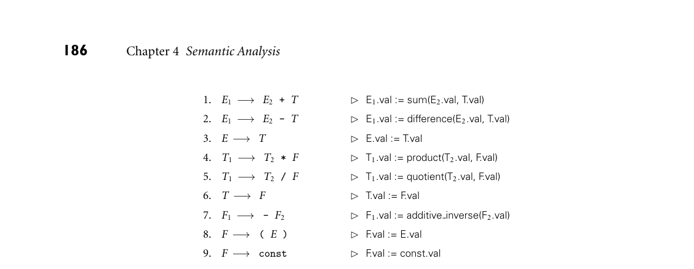

# 4.2 Attribute Grammars

184 Chapter 4 Semantic Analysis

compilers perform extensive static analysis in an attempt to eliminate the need for dynamic checks on array subscripts, variant record tags, or potentially dangling pointers (to be discussed in Chapter 8). If we think of the omission of unnecessary dynamic checks as a performance optimization, it is natural to look for other ways in which static analysis may enable code improvement. We will consider this topic in more detail in Chap- ter 17. Examples include alias analysis, which determines when values can be safely cached in registers, computed “out of order,” or accessed by concurrent threads; escape analysis, which determines when all references to a value will be confined to a given context, allowing the value to be allocated on the stack in- stead of the heap, or to be accessed without locks; and subtype analysis, which determines when a variable in an object-oriented language is guaranteed to have a certain subtype, so that its methods can be called without dynamic dispatch. An optimization is said to be unsafe if it may lead to incorrect code in certain programs. It is said to be speculative if it usually improves performance, but may degrade it in certain cases. A compiler is said to be conservative if it applies op- timizations only when it can guarantee that they will be both safe and effective. By contrast, an optimistic compiler may make liberal use of speculative optimiza- tions. It may also pursue unsafe optimizations by generating two versions of the code, with a dynamic check that chooses between them based on information not available at compile time. Examples of speculative optimization include nonbind- ing prefetches, which try to bring data into the cache before they are needed, and trace scheduling, which rearranges code in hopes of improving the performance of the processor pipeline and the instruction cache. To eliminate dynamic checks, language designers may choose to tighten se- mantic rules, banning programs for which conservative analysis fails. The ML type system, for example (Section 7.2.4), avoids the dynamic type checks of Lisp, but disallows certain useful programming idioms that Lisp supports. Similarly, the definite assignment rules of Java and C# (Section 6.1.3) allow the compiler to ensure that a variable is always given a value before it is used in an expression, but disallow certain programs that are legal (and correct) in C. 4.2 Attribute Grammars

In Chapter 2 we learned how to use a context-free grammar to specify the syntax of a programming language. Here, for example, is an LR (bottom-up) grammar EXAMPLE 4.3

Bottom-up CFG for constant expressions for arithmetic expressions composed of constants, with precedence and associa- tivity:2

2 The addition of semantic rules tends to make attribute grammars quite a bit more verbose than context-free grammars. For the sake of brevity, many of the examples in this chapter use very short symbol names: E instead of expr, TT instead of term tail.

4.2 Attribute Grammars 185

E −→E + T

E −→E - T

E −→T

T −→T * F

T −→T / F

T −→F

F −→- F

F −→( E )

F −→const ■

This grammar will generate all properly formed constant expressions over the basic arithmetic operators, but it says nothing about their meaning. To tie these expressions to mathematical concepts (as opposed to, say, floor tile patterns or dance steps), we need additional notation. The most common is based on at- tributes. In our expression grammar, we can associate a val attribute with each EXAMPLE 4.4

Bottom-up AG for constant expressions E, T, F, and const in the grammar. The intent is that for any symbol S, S.val will be the meaning, as an arithmetic value, of the token string derived from S. We assume that the val of a const is provided to us by the scanner. We must then invent a set of rules for each production, to specify how the vals of different symbols are related. The resulting attribute grammar (AG) is shown in Figure 4.1. In this simple grammar, every production has a single rule. We shall see more complicated grammars later, in which productions can have several rules. The rules come in two forms. Those in productions 3, 6, 8, and 9 are known as copy rules; they specify that one attribute should be a copy of another. The other rules invoke semantic functions (sum, quotient, additive inverse, etc.). In this exam- ple, the semantic functions are all familiar arithmetic operations. In general, they can be arbitrarily complex functions specified by the language designer. Each se- mantic function takes an arbitrary number of arguments (each of which must be an attribute of a symbol in the current production—no global variables are al- lowed), and each computes a single result, which must likewise be assigned into an attribute of a symbol in the current production. When more than one sym- bol of a production has the same name, subscripts are used to distinguish them. These subscripts are solely for the benefit of the semantic functions; they are not part of the context-free grammar itself. ■ In a strict definition of attribute grammars, copy rules and semantic function calls are the only two kinds of permissible rules. In our examples we use a  symbol to introduce each code fragment corresponding to a single rule. In prac- tice, it is common to allow rules to consist of small fragments of code in some well-defined notation (e.g., the language in which a compiler is being written), so that simple semantic functions can be written out “in-line.” In this relaxed notation, the rule for the first production in Figure 4.1 might be simply E1.val := E2.val + T.val. As another example, suppose we wanted to count the elements of a EXAMPLE 4.5

Top-down AG to count the elements of a list comma-separated list:

*Figure 4.1 A simple attribute grammar for constant expressions, using the standard arith- metic operations. Each semantic rule is introduced by a  sign.*

L −→id LT  L.c := 1 + LT.c LT −→, L  LT.c := L.c LT −→ϵ  LT.c := 0

Here the rule on the first production sets the c (count) attribute of the left-hand side to one more than the count of the tail of the right-hand side. Like explicit semantic functions, in-line rules are not allowed to refer to any variables or at- tributes outside the current production. We will relax this restriction when we introduce action routines in Section 4.4. ■ Neither the notation for semantic functions (whether in-line or explicit) nor the types of the attributes themselves is intrinsic to the notion of an attribute grammar. The purpose of the grammar is simply to associate meaning with the nodes of a parse tree or syntax tree. Toward that end, we can use any notation and types whose meanings are already well defined. In Examples 4.4 and 4.5, we associated numeric values with the symbols in a CFG—and thus with parse tree nodes—using semantic functions drawn from ordinary arithmetic. In a compiler or interpreter for a full programming language, the attributes of tree nodes might include

for an identifier, a reference to information about it in the symbol table for an expression, its type for a statement or expression, a reference to corresponding code in the com- piler’s intermediate form for almost any construct, an indication of the file name, line, and column where the corresponding source code begins for any internal node, a list of semantic errors found in the subtree below

For purposes other than translation—e.g., in a theorem prover or machine- independent language definition—attributes might be drawn from the disciplines of denotational, operational, or axiomatic semantics. Interested readers can find references in the Bibliographic Notes at the end of the chapter.

