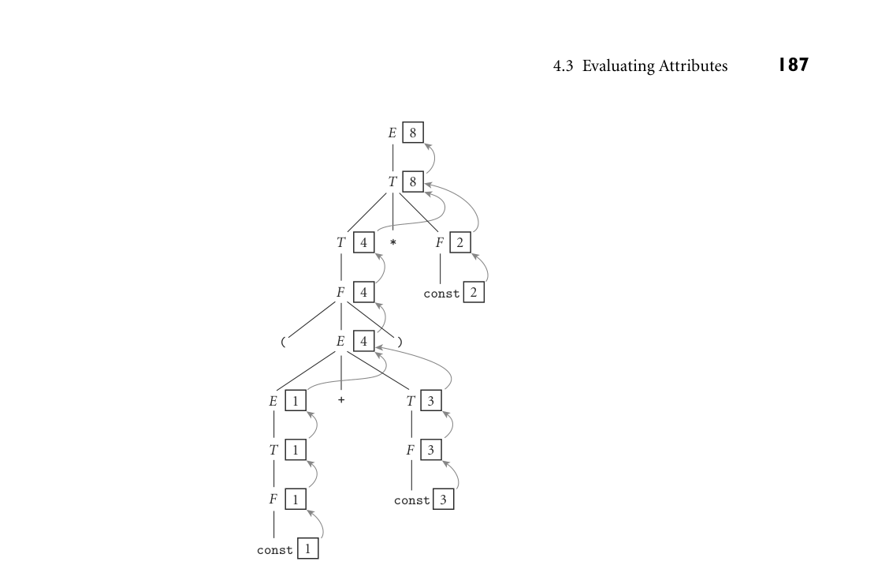
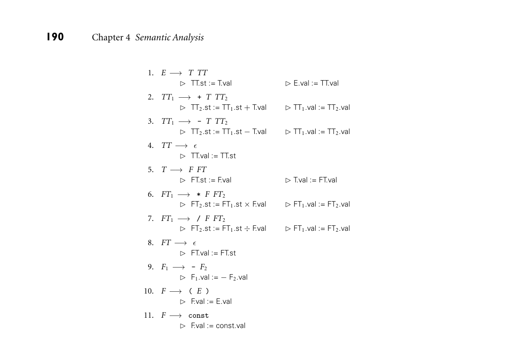
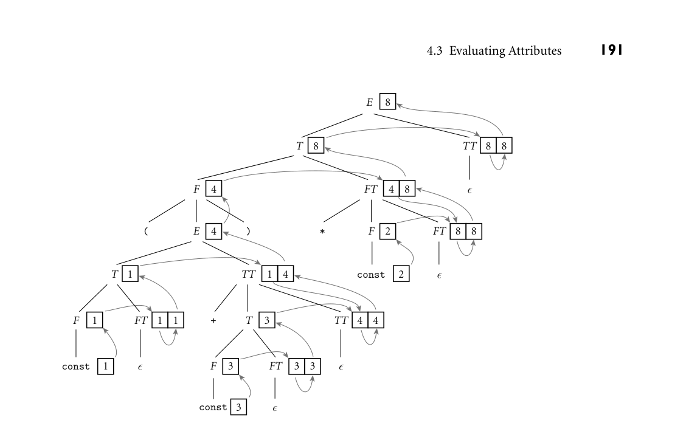
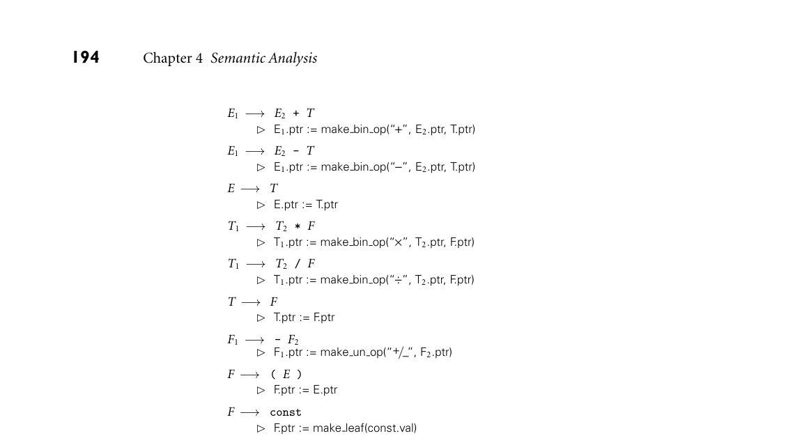

# 4.3 Evaluating Attributes

*Figure 4.2 Decoration of a parse tree for (1 + 3) * 2, using the attribute grammar of Figure 4.1. The val attributes of symbols are shown in boxes. Curving arrows show the attribute flow, which is strictly upward in this case. Each box holds the output of a single semantic rule; the arrow(s) entering the box indicate the input(s) to the rule. At the second level of the tree, for example, the two arrows pointing into the box with the 8 represent application of the rule T1.val := product(T2.val, F.val). 4.3 Evaluating Attributes*

The process of evaluating attributes is called annotation or decoration of the parse tree. Figure 4.2 shows how to decorate the parse tree for the expression (1 + 3) EXAMPLE 4.6

Decoration of a parse tree * 2, using the AG of Figure 4.1. Once decoration is complete, the value of the overall expression can be found in the val attribute of the root of the tree. ■

Synthesized Attributes

The attribute grammar of Figure 4.1 is very simple. Each symbol has at most one attribute (the punctuation marks have none). Moreover, they are all so-called synthesized attributes: their values are calculated (synthesized) only in produc- tions in which their symbol appears on the left-hand side. For annotated parse trees like the one in Figure 4.2, this means that the attribute flow—the pattern in which information moves from node to node—is entirely bottom-up.

188 Chapter 4 Semantic Analysis

An attribute grammar in which all attributes are synthesized is said to be S- attributed. The arguments to semantic functions in an S-attributed grammar are always attributes of symbols on the right-hand side of the current production, and the return value is always placed into an attribute of the left-hand side of the pro- duction. Tokens (terminals) often have intrinsic properties (e.g., the character- string representation of an identifier or the value of a numeric constant); in a compiler these are synthesized attributes initialized by the scanner.

Inherited Attributes

In general, we can imagine (and will in fact have need of) attributes whose values are calculated when their symbol is on the right-hand side of the current produc- tion. Such attributes are said to be inherited. They allow contextual information to flow into a symbol from above or from the side, so that the rules of that produc- tion can be enforced in different ways (or generate different values) depending on surrounding context. Symbol table information is commonly passed from sym- bol to symbol by means of inherited attributes. Inherited attributes of the root of the parse tree can also be used to represent the external environment (character- istics of the target machine, command-line arguments to the compiler, etc.). As a simple example of inherited attributes, consider the following fragment EXAMPLE 4.7

Top-down CFG and parse tree for subtraction of an LL(1) expression grammar (here covering only subtraction):

expr −→const expr tail expr tail −→- const expr tail | ϵ

For the expression 9 - 4 - 3, we obtain the following parse tree:

expr

9

expr_tail

expr_tail -

4

-

3 expr_tail

ϵ

■

If we want to create an attribute grammar that accumulates the value of the overall expression into the root of the tree, we have a problem: because subtrac- tion is left associative, we cannot summarize the right subtree of the root with a single numeric value. If we want to decorate the tree bottom-up, with an S- attributed grammar, we must be prepared to describe an arbitrary number of right operands in the attributes of the top-most expr tail node (see Exercise 4.4). This is indeed possible, but it defeats the purpose of the formalism: in effect, it requires us to embed the entire tree into the attributes of a single node, and do all the real work inside a single semantic function.

4.3 Evaluating Attributes 189

If, however, we are allowed to pass attribute values not only bottom-up but EXAMPLE 4.8

Decoration with left-to-right attribute flow also left-to-right in the tree, then we can pass the 9 into the top-most expr tail node, where it can be combined (in proper left-associative fashion) with the 4. The resulting 5 can then be passed into the middle expr tail node, combined with the 3 to make 2, and then passed upward to the root:

expr

2

const

9

expr_tail

9 2

expr_tail -

4 const

5 2

-

2 2 3 const expr_tail

ϵ

■

To effect this style of decoration, we need the following attribute rules: EXAMPLE 4.9

Top-down AG for subtraction expr −→const expr tail  expr tail.st := const.val  expr.val := expr tail.val

expr tail1 −→- const expr tail2  expr tail2.st := expr tail1.st −const.val  expr tail1.val := expr tail2.val

expr tail −→ϵ  expr tail.val := expr tail.st

In each of the first two productions, the first rule serves to copy the left context (value of the expression so far) into a “subtotal” (st) attribute; the second rule copies the final value from the right-most leaf back up to the root. In the expr tail nodes of the picture in Example 4.8, the left box holds the st attribute; the right holds val. ■ We can flesh out the grammar fragment of Example 4.7 to produce a more EXAMPLE 4.10

Top-down AG for constant expressions complete expression grammar, as shown (with shorter symbol names) in Fig- ure 4.3. The underlying CFG for this grammar accepts the same language as the one in Figure 4.1, but where that one was SLR(1), this one is LL(1). Attribute flow for a parse of (1 + 3) * 2, using the LL(1) grammar, appears in Figure 4.4. As in the grammar fragment of Example 4.9, the value of the left operand of each oper- ator is carried into the TT and FT productions by the st (subtotal) attribute. The relative complexity of the attribute flow arises from the fact that operators are left associative, but the grammar cannot be left recursive: the left and right operands of a given operator are thus found in separate productions. Grammars to perform

*Figure 4.3 An attribute grammar for constant expressions based on an LL(1) CFG. In this grammar several productions have two semantic rules.*

semantic analysis for practical languages generally require some non-S-attributed flow. ■

Attribute Flow

Just as a context-free grammar does not specify how it should be parsed, an at- tribute grammar does not specify the order in which attribute rules should be invoked. Put another way, both notations are declarative: they define a set of valid trees, but they don’t say how to build or decorate them. Among other things, this means that the order in which attribute rules are listed for a given production is immaterial; attribute flow may require them to execute in any order. If, in Fig- ure 4.3, we were to reverse the order in which the rules appear in productions 1, 2, 3, 5, 6, and/or 7 (listing the rule for symbol.val first), it would be a purely cosmetic change; the grammar would not be altered. We say an attribute grammar is well defined if its rules determine a unique set of values for the attributes of every possible parse tree. An attribute grammar is noncircular if it never leads to a parse tree in which there are cycles in the attribute flow graph—that is, if no attribute, in any parse tree, ever depends (transitively)

*Figure 4.4 Decoration of a top-down parse tree for (1 + 3) * 2, using the AG of Figure 4.3. Curving arrows again indicate attribute flow; the arrow(s) entering a given box represent the application of a single semantic rule. Flow in this case is no longer strictly bottom-up, but it is still left-to-right. At FT and TT nodes, the left box holds the st attribute; the right holds val.*

on itself. (A grammar can be circular and still be well defined if attributes are guaranteed to converge to a unique value.) As a general rule, practical attribute grammars tend to be noncircular. An algorithm that decorates parse trees by invoking the rules of an attribute grammar in an order consistent with the tree’s attribute flow is called a translation scheme. Perhaps the simplest scheme is one that makes repeated passes over a tree, invoking any semantic function whose arguments have all been defined, and stopping when it completes a pass in which no values change. Such a scheme is said to be oblivious, in the sense that it exploits no special knowledge of either the parse tree or the grammar. It will halt only if the grammar is well defined. Better performance, at least for noncircular grammars, may be achieved by a dynamic scheme that tailors the evaluation order to the structure of a given parse tree—for example, by constructing a topological sort of the attribute flow graph and then invoking rules in an order consistent with the sort. The fastest translation schemes, however, tend to be static—based on an analy- sis of the structure of the attribute grammar itself, and then applied mechanically to any tree arising from the grammar. Like LL and LR parsers, linear-time static translation schemes can be devised only for certain restricted classes of gram-

192 Chapter 4 Semantic Analysis

mars. S-attributed grammars, such as the one in Figure 4.1, form the simplest such class. Because attribute flow in an S-attributed grammar is strictly bottom- up, attributes can be evaluated by visiting the nodes of the parse tree in exactly the same order that those nodes are generated by an LR-family parser. In fact, the attributes can be evaluated on the fly during a bottom-up parse, thereby inter- leaving parsing and semantic analysis (attribute evaluation). The attribute grammar of Figure 4.3 is a good bit messier than that of Fig- ure 4.1, but it is still L-attributed: its attributes can be evaluated by visiting the nodes of the parse tree in a single left-to-right, depth-first traversal (the same or- der in which they are visited during a top-down parse—see Figure 4.4). If we say that an attribute A.s depends on an attribute B.t if B.t is ever passed to a semantic function that returns a value for A.s, then we can define L-attributed grammars more formally with the following two rules: (1) each synthesized attribute of a left-hand-side symbol depends only on that symbol’s own inherited attributes or on attributes (synthesized or inherited) of the production’s right-hand-side sym- bols, and (2) each inherited attribute of a right-hand-side symbol depends only on inherited attributes of the left-hand-side symbol or on attributes (synthesized or inherited) of symbols to its left in the right-hand side. Because L-attributed grammars permit rules that initialize attributes of the left-hand side of a production using attributes of symbols on the right-hand side, every S-attributed grammar is also an L-attributed grammar. The reverse is not the case: S-attributed grammars do not permit the initialization of at- tributes on the right-hand side, so there are L-attributed grammars that are not S-attributed. S-attributed attribute grammars are the most general class of attribute gram- mars for which evaluation can be implemented on the fly during an LR parse. L-attributed grammars are the most general class for which evaluation can be im- plemented on the fly during an LL parse. If we interleave semantic analysis (and possibly intermediate code generation) with parsing, then a bottom-up parser must in general be paired with an S-attributed translation scheme; a top-down parser must be paired with an L-attributed translation scheme. (Depending on the structure of the grammar, it is often possible for a bottom-up parser to ac- commodate some non-S-attributed attribute flow; we consider this possibility in Section C 4.5.1.) If we choose to separate parsing and semantic analysis into sepa- rate passes, then the code that builds the parse tree or syntax tree must still use an S-attributed or L-attributed translation scheme (as appropriate), but the semantic analyzer can use a more powerful scheme if desired. There are certain tasks, such as the generation of code for “short-circuit” Boolean expressions (to be discussed in Sections 6.1.5 and 6.4.1), that are easiest to accomplish with a non-L-attributed scheme.

4.3 Evaluating Attributes 193

One-Pass Compilers

A compiler that interleaves semantic analysis and code generation with parsing is said to be a one-pass compiler.3 It is unclear whether interleaving semantic analysis with parsing makes a compiler simpler or more complex; it’s mainly a matter of taste. If intermediate code generation is interleaved with parsing, one need not build a syntax tree at all (unless of course the syntax tree is the intermediate code). Moreover, it is often possible to write the intermediate code to an output file on the fly, rather than accumulating it in the attributes of the root of the parse tree. The resulting space savings were important for previous generations of computers, which had very small main memories. On the other hand, semantic analysis is easier to perform during a separate traversal of a syntax tree, because that tree reflects the program’s semantic structure better than the parse tree does, especially with a top-down parser, and because one has the option of traversing the tree in an order other than that chosen by the parser.

Building a Syntax Tree

If we choose not to interleave parsing and semantic analysis, we still need to add attribute rules to the context-free grammar, but they serve only to create the syn- tax tree—not to enforce semantic rules or generate code. Figures 4.5 and 4.6 EXAMPLE 4.11

Bottom-up and top-down AGs to build a syntax tree contain bottom-up and top-down attribute grammars, respectively, to build a syntax tree for constant expressions. The attributes in these grammars hold nei- ther numeric values nor target code fragments; instead they point to nodes of the syntax tree. Function make leaf returns a pointer to a newly allocated syntax tree node containing the value of a constant. Functions make un op and make bin op return pointers to newly allocated syntax tree nodes containing a unary or

DESIGN & IMPLEMENTATION

4.2 Forward references In Sections 3.3.3 and C 3.4.1 we noted that the scope rules of many languages require names to be declared before they are used, and provide special mech- anisms to introduce the forward references needed for recursive definitions. While these rules may help promote the creation of clear, maintainable code, an equally important motivation, at least historically, was to facilitate the con- struction of one-pass compilers. With increases in memory size, processing speed, and programmer expectations regarding the quality of code improve- ment, multipass compilers have become ubiquitous, and language designers have felt free (as, for example, in the class declarations of C++, Java, and C#) to abandon the requirement that declarations precede uses.

3 Most authors use the term one-pass only for compilers that translate all the way from source to target code in a single pass. Some authors insist only that intermediate code be generated in a single pass, and permit additional pass(es) to translate intermediate code to target code.

*Figure 4.5 Bottom-up (S-attributed) attribute grammar to construct a syntax tree. The symbol +/−is used (as it is on calculators) to indicate change of sign.*

binary operator, respectively, and pointers to the supplied operand(s). Figures 4.7 and 4.8 show stages in the decoration of parse trees for (1 + 3) * 2, using the grammars of Figures 4.5 and 4.6, respectively. Note that the final syntax tree is the same in each case. ■

3CHECK YOUR UNDERSTANDING 1. What determines whether a language rule is a matter of syntax or of static semantics? 2. Why is it impossible to detect certain program errors at compile time, even though they can be detected at run time?

3. What is an attribute grammar? 4. What are programming assertions? What is their purpose? 5. What is the difference between synthesized and inherited attributes?

6. Give two examples of information that is typically passed through inherited attributes.

7. What is attribute flow? 8. What is a one-pass compiler?

