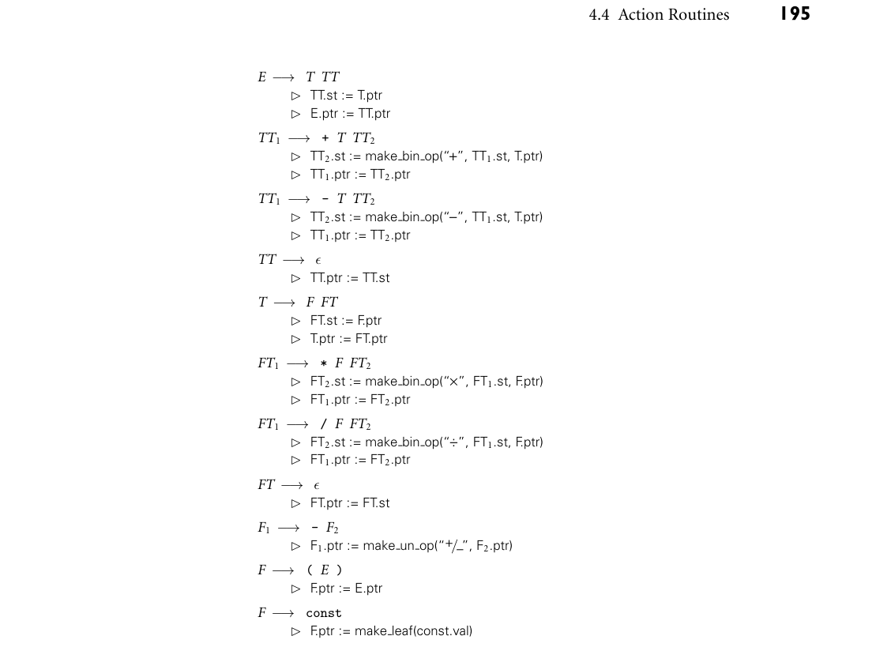
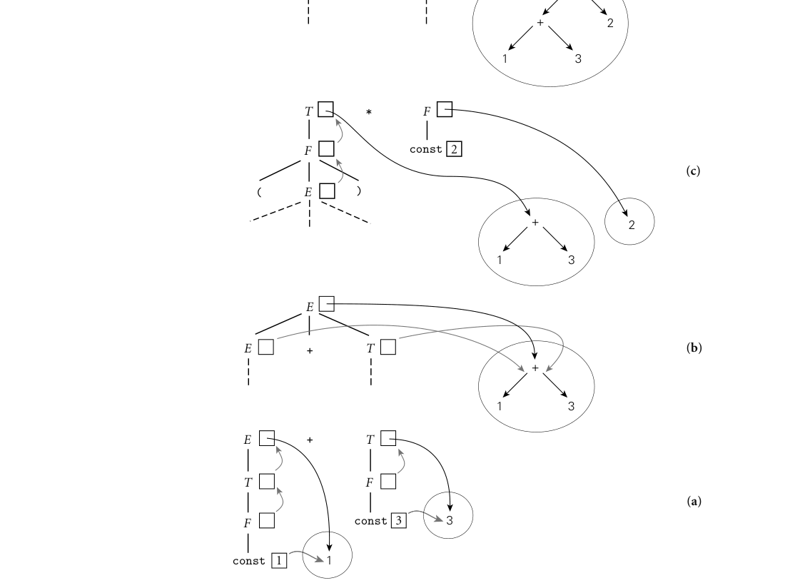
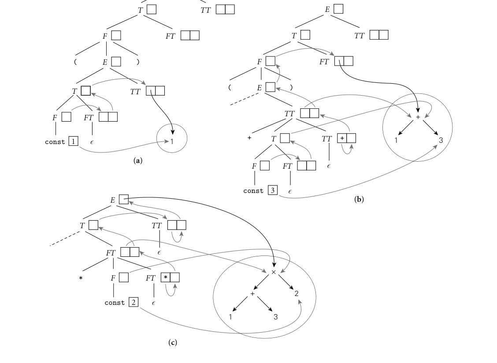
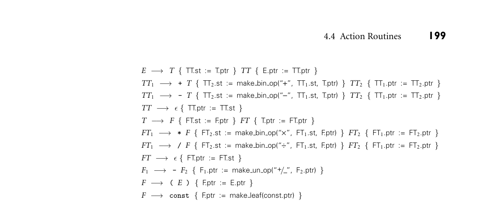
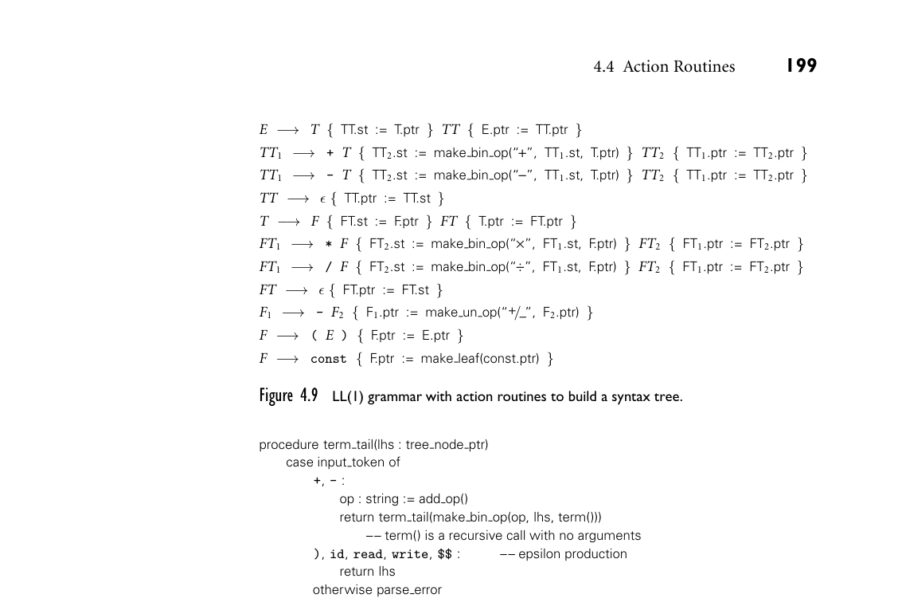

# 4.4 Action Routines

*Figure 4.6 Top-down (L-attributed) attribute grammar to construct a syntax tree. Here the st attribute, like the ptr attribute (and unlike the st attribute of Figure 4.3), is a pointer to a syntax tree node.*

9. What does it mean for an attribute grammar to be S-attributed? L-attributed? Noncircular? What is the significance of these grammar classes?

4.4 Action Routines

Just as there are automatic tools that will construct a parser for a given context- free grammar, there are automatic tools that will construct a semantic analyzer (attribute evaluator) for a given attribute grammar. Attribute evaluator gen-

E

*

T

F *

(d)

×

T

*Figure 4.7 Construction of a syntax tree for (1 + 3) * 2 via decoration of a bottom-up parse tree, using the grammar of Figure 4.5. This figure reads from bottom to top. In diagram (a), the values of the constants 1 and 3 have been placed in new syntax tree leaves. Pointers to these leaves propagate up into the attributes of E and T. In (b), the pointers to these leaves become child pointers of a new internal + node. In (c) the pointer to this node propagates up into the attributes of T, and a new leaf is created for 2. Finally, in (d), the pointers from T and F become child pointers of a new internal × node, and a pointer to this node propagates up into the attributes of E.*

E

*Figure 4.8 Construction of a syntax tree via decoration of a top-down parse tree, using the grammar of Figure 4.6. In the top diagram, (a), the value of the constant 1 has been placed in a new syntax tree leaf. A pointer to this leaf then propagates to the st attribute of TT. In (b), a second leaf has been created to hold the constant 3. Pointers to the two leaves then become child pointers of a new internal + node, a pointer to which propagates from the st attribute of the bottom-most TT, where it was created, all the way up and over to the st attribute of the top-most FT. In (c), a third leaf has been created for the constant 2. Pointers to this leaf and to the + node then become the children of a new × node, a pointer to which propagates from the st of the lower FT, where it was created, all the way to the root of the tree.*

erators have been used in syntax-based editors [RT88], incremental compil- ers [SDB84], web-page layout [MTAB13], and various aspects of programming language research. Most production compilers, however, use an ad hoc, hand- written translation scheme, interleaving parsing with the construction of a syntax tree and, in some cases, other aspects of semantic analysis or intermediate code generation. Because they evaluate the attributes of each production as it is parsed, they do not need to build the full parse tree. An ad hoc translation scheme that is interleaved with parsing takes the form of a set of action routines. An action routine is a semantic function that the pro- grammer (grammar writer) instructs the compiler to execute at a particular point in the parse. Most parser generators allow the programmer to specify action rou- tines. In an LL parser generator, an action routine can appear anywhere within a right-hand side. A routine at the beginning of a right-hand side will be called as soon as the parser predicts the production. A routine embedded in the middle of a right-hand side will be called as soon as the parser has matched (the yield of) the symbol to the left. The implementation mechanism is simple: when it predicts a production, the parser pushes all of the right-hand side onto the stack, including terminals (to be matched), nonterminals (to drive future predictions), and point- ers to action routines. When it finds a pointer to an action routine at the top of the parse stack, the parser simply calls it, passing (pointers to) the appropriate attributes as arguments. To make this process more concrete, consider again our LL(1) grammar for EXAMPLE 4.12

Top-down action routines to build a syntax tree constant expressions. Action routines to build a syntax tree while parsing this grammar appear in Figure 4.9. The only difference between this grammar and the one in Figure 4.6 is that the action routines (delimited here with curly braces) are embedded among the symbols of the right-hand sides; the work performed is the same. The ease with which the attribute grammar can be transformed into the grammar with action routines is due to the fact that the attribute grammar is L-attributed. If it required more complicated flow, we would not be able to cast it as action routines. ■

DESIGN & IMPLEMENTATION

4.3 Attribute evaluators Automatic evaluators based on formal attribute grammars are popular in lan- guage research projects because they save developer time when the language definition changes. They are popular in syntax-based editors and incremental compilers because they save execution time: when a small change is made to a program, the evaluator may be able to “patch up” tree decorations signifi- cantly faster than it could rebuild them from scratch. For the typical compiler, however, semantic analysis based on a formal attribute grammar is overkill: it has higher overhead than action routines, and doesn’t really save the compiler writer that much work.

*Figure 4.9 LL(1) grammar with action routines to build a syntax tree.*

*Figure 4.10 Recursive descent parsing with embedded “action routines.” Compare with the routine of the same name in Figure 2.17, and with productions 2 through 4 in Figure 4.9.*

As in ordinary parsing, there is a strong analogy between recursive descent and table-driven parsing with action routines. Figure 4.10 shows the term tail rou- EXAMPLE 4.13

Recursive descent and action routines tine from Figure 2.17, modified to do its part in constructing a syntax tree. The behavior of this routine mirrors that of productions 2 through 4 in Figure 4.9. The routine accepts as a parameter a pointer to the syntax tree fragment con- tained in the attribute grammar’s TT1. Then, given an upcoming + or - sym- bol on the input, it (1) calls add op to parse that symbol (returning a character string representation); (2) calls term to parse the attribute grammar’s T; (3) calls make bin op to create a new tree node; (4) passes that node to term tail, which parses the attribute grammar’s TT2; and (5) returns the result. ■

Bottom-Up Evaluation

In an LR parser generator, one cannot in general embed action routines at arbi- trary places in a right-hand side, since the parser does not in general know what production it is in until it has seen all or most of the yield. LR parser generators therefore permit action routines only in the portion (suffix) of the right-hand

