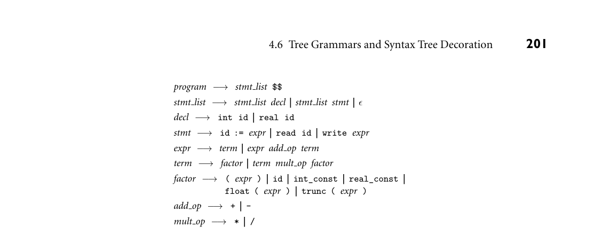
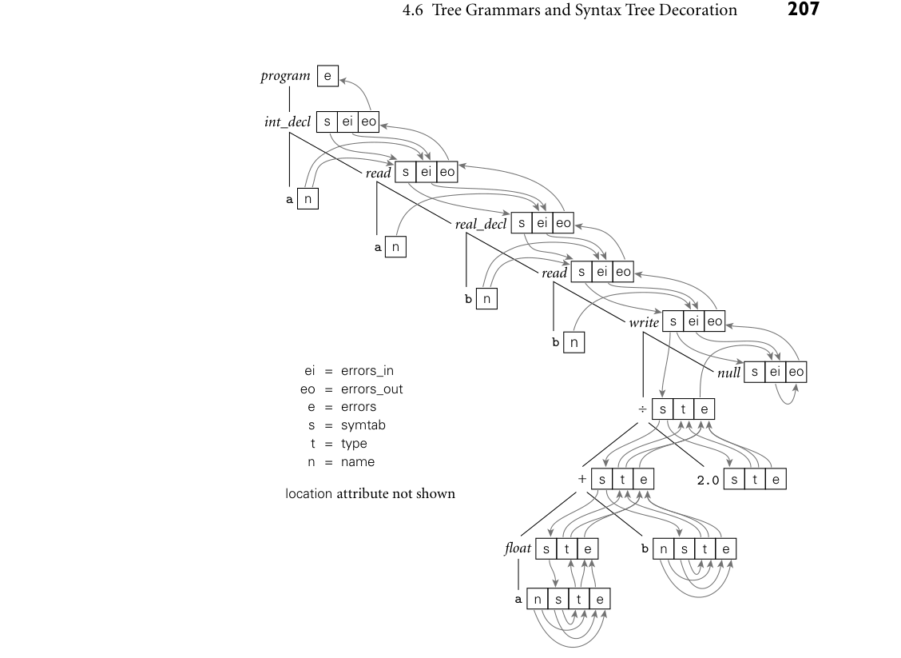

# 4.6 Tree Grammars and Syntax Tree Decoration

4.6 Tree Grammars and Syntax Tree Decoration
### **201**

```
program −→stmt list $$
```

*stmt list** −→**stmt list decl*** |*** stmt list stmt*** |*** ϵ*

```
decl −→int id | real id
```

```
stmt −→id := expr | read id | write expr
```

*expr** −→**term*** |*** expr add op term*

*term** −→**factor*** |*** term mult op factor*

```
factor −→( expr ) | id | int_const | real_const |
float ( expr ) | trunc ( expr )
```

```
add op −→+ | -
```

```
mult op −→* | /
```



*Figure 4.11 Context-free grammar for a calculator language with types and declarations. The intent is that every identifier be declared before use, and that types not be mixed in com- putations.*

**IN MORE DEPTH**

We consider attribute space management in more detail on the companion site.
Using bottom-up and top-down grammars for arithmetic expressions, we illus-
trate automatic management for both bottom-up and top-down parsers, as well
as the ad hoc option for top-down parsers.

## 4.6

### **Tree Grammars and Syntax Tree Decoration**

In our discussion so far we have used attribute grammars solely to decorate parse
trees. As we mentioned in the chapter introduction, attribute grammars can also
be used to decorate syntax trees. If our compiler uses action routines simply to
build a syntax tree, then the bulk of semantic analysis and intermediate code gen-
eration will use the syntax tree as base.
Figure 4.11 contains a bottom-up CFG for a calculator language with types and
**EXAMPLE** 4.14

Bottom-up CFG for
calculator language with
types

declarations. The grammar differs from that of Example 2.37 in three ways: (1) we
allow declarations to be intermixed with statements, (2) we differentiate between
integer and real constants (presumably the latter contain a decimal point), and (3)
we require explicit conversions between integer and real operands. The intended
semantics of our language requires that every identifier be declared before it is
used, and that types not be mixed in computations.
■
Extrapolating from the example in Figure 4.5, it is easy to add semantic func-
**EXAMPLE** 4.15

Syntax tree to average an
integer and a real
tions or action routines to the grammar of Figure 4.11 to construct a syntax tree
for the calculator language (Exercise 4.21). The obvious structure for such a tree
would represent expressions as we did in Figure 4.7, and would represent a pro-
gram as a linked list of declarations and statements. As a concrete example, Fig-
ure 4.12 contains the syntax tree for a simple program to print the average of an
integer and a real.
■

Much as a context-free grammar describes the possible structure of parse trees
**EXAMPLE** 4.16

Tree grammar for the
calculator language with
types

for a given programming language, we can use a* tree grammar* to represent the
possible structure of syntax trees. As in a CFG, each production of a tree grammar
represents a possible relationship between a parent and its children in the tree.
The parent is the symbol on the left-hand side of the production; the children are
the symbols on the right-hand side. The productions used in Figure 4.12 might
look something like the following:

*program** −→**item*

*int decl : item** −→**id item*

*read : item** −→**id item*

*real decl : item** −→**id item*

*write : item** −→**expr item*

*null : item** −→**ϵ*

*‘*÷*’ : expr** −→**expr expr*

*‘*+*’ : expr** −→**expr expr*

*float : expr** −→**expr*

*id : expr** −→**ϵ*

*real const : expr** −→**ϵ*

Here the notation* A : B* on the left-hand side of a production means that* A* is one
variant of* B*, and may appear anywhere a* B* is expected on a right-hand side.
■

s
t
e
s
t
e

s
t
e
s
t
e
n

s
t
e
n



*Figure 4.15 Decoration of the syntax tree of Figure 4.12, using the grammar of Figure 4.14. Location information, which we assume has been initialized in every node by the parser, con- tributes to error messages, but does not otherwise propagate through the tree.*

### tice, however, particularly in a multipass compiler, it makes sense to buffer the

### messages, so they can be interleaved with messages produced by other phases of

### the compiler, and printed in program order at the end of compilation.

### One could convert our attribute grammar into executable code using an au-

### tomatic attribute evaluator generator. Alternatively, one could create an ad hoc

### evaluator in the form of mutually recursive subroutines (Exercise 4.20). In the lat-

### ter case attribute flow would be explicit in the calling sequence of the routines. We

### could then choose if desired to keep the symbol table in global variables, rather

### than passing it from node to node through attributes. Most compilers employ the

### ad hoc approach.

