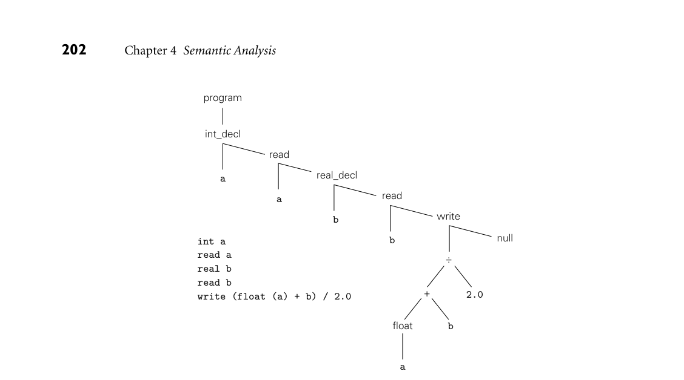
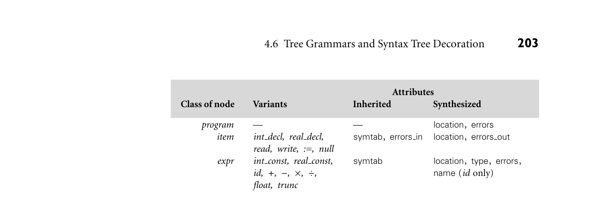
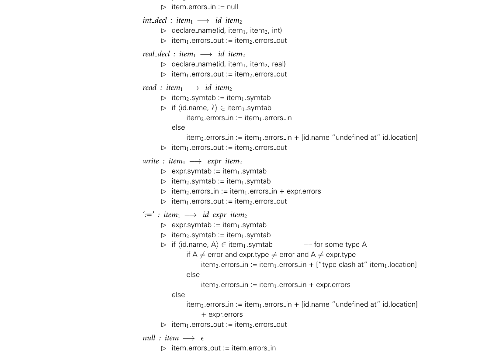
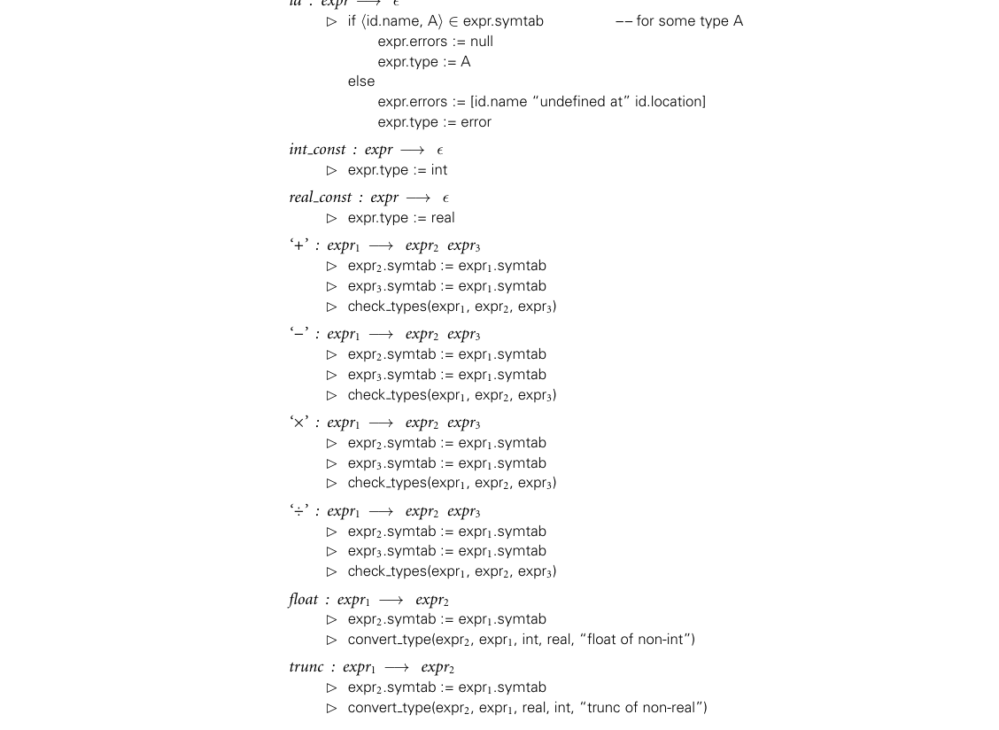
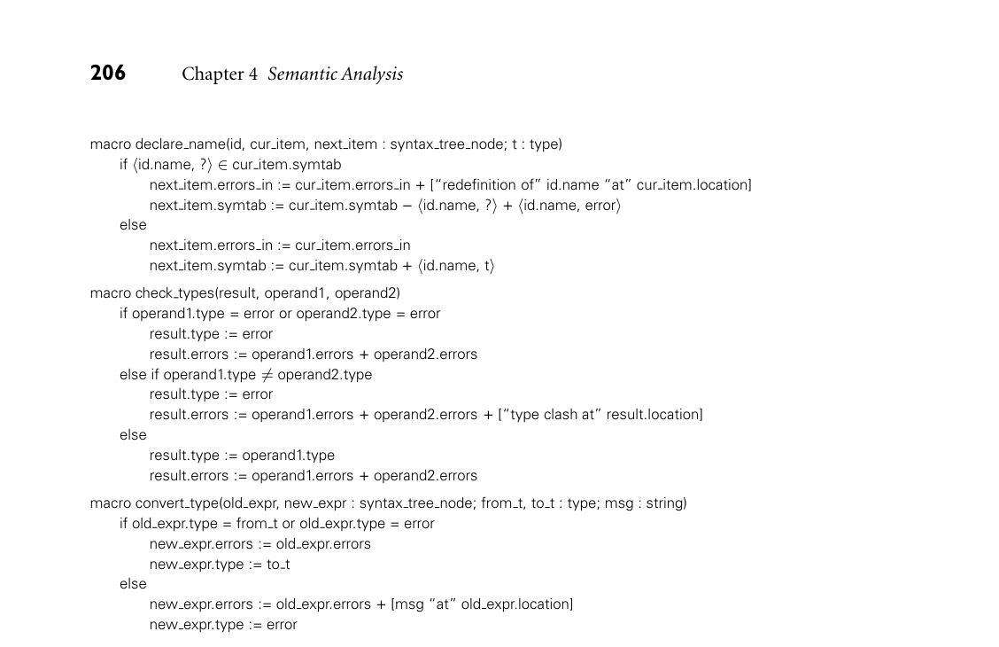

# 4.6 Tree Grammars and Syntax Tree Decoration

*Figure 4.11 Context-free grammar for a calculator language with types and declarations. The intent is that every identifier be declared before use, and that types not be mixed in com- putations.*

4.6 Tree Grammars and Syntax Tree Decoration 201

program −→stmt list $$

stmt list −→stmt list decl | stmt list stmt | ϵ

decl −→int id | real id

stmt −→id := expr | read id | write expr

expr −→term | expr add op term

term −→factor | term mult op factor

factor −→( expr ) | id | int_const | real_const | float ( expr ) | trunc ( expr )

add op −→+ | -

mult op −→* | /

IN MORE DEPTH

We consider attribute space management in more detail on the companion site. Using bottom-up and top-down grammars for arithmetic expressions, we illus- trate automatic management for both bottom-up and top-down parsers, as well as the ad hoc option for top-down parsers.

4.6 Tree Grammars and Syntax Tree Decoration

In our discussion so far we have used attribute grammars solely to decorate parse trees. As we mentioned in the chapter introduction, attribute grammars can also be used to decorate syntax trees. If our compiler uses action routines simply to build a syntax tree, then the bulk of semantic analysis and intermediate code gen- eration will use the syntax tree as base. Figure 4.11 contains a bottom-up CFG for a calculator language with types and EXAMPLE 4.14

declarations. The grammar differs from that of Example 2.37 in three ways: (1) we allow declarations to be intermixed with statements, (2) we differentiate between integer and real constants (presumably the latter contain a decimal point), and (3) we require explicit conversions between integer and real operands. The intended semantics of our language requires that every identifier be declared before it is used, and that types not be mixed in computations. ■ Extrapolating from the example in Figure 4.5, it is easy to add semantic func- EXAMPLE 4.15

Bottom-up CFG for calculator language with types

Syntax tree to average an integer and a real tions or action routines to the grammar of Figure 4.11 to construct a syntax tree for the calculator language (Exercise 4.21). The obvious structure for such a tree would represent expressions as we did in Figure 4.7, and would represent a pro- gram as a linked list of declarations and statements. As a concrete example, Fig- ure 4.12 contains the syntax tree for a simple program to print the average of an integer and a real. ■

*Figure 4.12 Syntax tree for a simple calculator program.*

202 Chapter 4 Semantic Analysis

program

int_decl

read

real_decl

a

read

a

write

b

b null

int a read a real b read b write (float (a) + b) / 2.0 +

÷

2.0

b

float

a

Much as a context-free grammar describes the possible structure of parse trees EXAMPLE 4.16

for a given programming language, we can use a tree grammar to represent the possible structure of syntax trees. As in a CFG, each production of a tree grammar represents a possible relationship between a parent and its children in the tree. The parent is the symbol on the left-hand side of the production; the children are the symbols on the right-hand side. The productions used in Figure 4.12 might look something like the following:

Tree grammar for the calculator language with types

program −→item

int decl : item −→id item

read : item −→id item

real decl : item −→id item

write : item −→expr item

null : item −→ϵ

‘÷’ : expr −→expr expr

‘+’ : expr −→expr expr

float : expr −→expr

id : expr −→ϵ

real const : expr −→ϵ

Here the notation A : B on the left-hand side of a production means that A is one variant of B, and may appear anywhere a B is expected on a right-hand side. ■

*Figure 4.13 Classes of nodes for the syntax tree attribute grammar of Figure 4.14. With the exception of name, all variants of a given class have all the class’s attributes.*

4.6 Tree Grammars and Syntax Tree Decoration 203

Attributes Class of node Variants Inherited Synthesized

program — — location, errors item int decl, real decl, symtab, errors in location, errors out read, write, :=, null expr int const, real const, symtab location, type, errors, id, +, −, ×, ÷, name (id only) float, trunc

Tree grammars and context-free grammars differ in important ways. A context-free grammar is meant to define (generate) a language composed of strings of tokens, where each string is the fringe (yield) of a parse tree. Pars- ing is the process of finding a tree that has a given yield. A tree grammar, as we use it here, is meant to define (or generate) the trees themselves. We have no need for a notion of parsing: we can easily inspect a tree and determine whether (and how) it can be generated by the grammar. Our purpose in introducing tree gram- mars is to provide a framework for the decoration of syntax trees. Semantic rules attached to the productions of a tree grammar can be used to define the attribute flow of a syntax tree in exactly the same way that semantic rules attached to the productions of a context-free grammar are used to define the attribute flow of a parse tree. We will use a tree grammar in the remainder of this section to perform static semantic checking. In Chapter 15 we will show how additional semantic rules can be used to generate intermediate code. A complete tree attribute grammar for our calculator language with types can EXAMPLE 4.17

Tree AG for the calculator language with types be constructed using the node classes, variants, and attributes shown in Fig- ure 4.13. The grammar itself appears in Figure 4.14. Once decorated, the program node at the root of the syntax tree will contain a list, in a synthesized attribute, of all static semantic errors in the program. (The list will be empty if the pro- gram is free of such errors.) Each item or expr node has an inherited attribute symtab that contains a list, with types, of all identifiers declared to the left in the tree. Each item node also has an inherited attribute errors in that lists all static semantic errors found to its left in the tree, and a synthesized attribute errors out to propagate the final error list back to the root. Each expr node has one synthe- sized attribute that indicates its type and another that contains a list of any static semantic errors found inside. Our handling of semantic errors illustrates a common technique. In order to continue looking for other errors, we must provide values for any attributes that would have been set in the absence of an error. To avoid cascading error mes- sages, we choose values for those attributes that will pass quietly through subse- quent checks. In this specific case we employ a pseudotype called error, which

*Figure 4.14 Attribute grammar to decorate an abstract syntax tree for the calculator lan- guage with types. We use square brackets to delimit error messages and pointed brackets to delimit symbol table entries. Juxtaposition indicates concatenation within error messages; the ‘+’ and ‘−’ operators indicate insertion and removal in lists. We assume that every node has been initialized by the scanner or by action routines in the parser to contain an indication of the location (line and column) at which the corresponding construct appears in the source (see Exercise 4.22). The ‘?’ symbol is used as a “wild card”; it matches any type. (continued)*

204 Chapter 4 Semantic Analysis

program −→item  item.symtab := null  program.errors := item.errors out  item.errors in := null

int decl : item1 −→id item2  declare name(id, item1, item2, int)  item1.errors out := item2.errors out

real decl : item1 −→id item2  declare name(id, item1, item2, real)  item1.errors out := item2.errors out

read : item1 −→id item2  item2.symtab := item1.symtab  if ⟨id.name, ?⟩∈item1.symtab item2.errors in := item1.errors in else item2.errors in := item1.errors in + [id.name “undefined at” id.location]  item1.errors out := item2.errors out

write : item1 −→expr item2  expr.symtab := item1.symtab  item2.symtab := item1.symtab  item2.errors in := item1.errors in + expr.errors  item1.errors out := item2.errors out

‘:=’ : item1 −→id expr item2  expr.symtab := item1.symtab  item2.symtab := item1.symtab  if ⟨id.name, A⟩∈item1.symtab –– for some type A if A ̸= error and expr.type ̸= error and A ̸= expr.type item2.errors in := item1.errors in + [“type clash at” item1.location] else item2.errors in := item1.errors in + expr.errors else item2.errors in := item1.errors in + [id.name “undefined at” id.location] + expr.errors  item1.errors out := item2.errors out

null : item −→ϵ  item.errors out := item.errors in

*Figure 4.14 (continued on next page)*

4.6 Tree Grammars and Syntax Tree Decoration 205

id : expr −→ϵ  if ⟨id.name, A⟩∈expr.symtab –– for some type A expr.errors := null expr.type := A else expr.errors := [id.name “undefined at” id.location] expr.type := error

int const : expr −→ϵ  expr.type := int

real const : expr −→ϵ  expr.type := real

‘+’ : expr1 −→expr2 expr3  expr2.symtab := expr1.symtab  expr3.symtab := expr1.symtab  check types(expr1, expr2, expr3)

‘−’ : expr1 −→expr2 expr3  expr2.symtab := expr1.symtab  expr3.symtab := expr1.symtab  check types(expr1, expr2, expr3)

‘×’ : expr1 −→expr2 expr3  expr2.symtab := expr1.symtab  expr3.symtab := expr1.symtab  check types(expr1, expr2, expr3)

‘÷’ : expr1 −→expr2 expr3  expr2.symtab := expr1.symtab  expr3.symtab := expr1.symtab  check types(expr1, expr2, expr3)

float : expr1 −→expr2  expr2.symtab := expr1.symtab  convert type(expr2, expr1, int, real, “float of non-int”)

trunc : expr1 −→expr2  expr2.symtab := expr1.symtab  convert type(expr2, expr1, real, int, “trunc of non-real”)

we associate with any symbol table entry or expression for which we have already generated a message. Though it takes a bit of checking to verify the fact, our attribute grammar is noncircular and well defined. No attribute is ever assigned a value more than once. (The helper routines at the end of Figure 4.14 should be thought of as macros, rather than semantic functions. For the sake of brevity we have passed them entire tree nodes as arguments. Each macro calculates the values of two dif- ferent attributes. Under a strict formulation of attribute grammars each macro

*Figure 4.14 (continued)*

206 Chapter 4 Semantic Analysis

macro declare name(id, cur item, next item : syntax tree node; t : type) if ⟨id.name, ?⟩∈cur item.symtab next item.errors in := cur item.errors in + [“redefinition of” id.name “at” cur item.location] next item.symtab := cur item.symtab −⟨id.name, ?⟩+ ⟨id.name, error⟩ else next item.errors in := cur item.errors in next item.symtab := cur item.symtab + ⟨id.name, t⟩

macro check types(result, operand1, operand2) if operand1.type = error or operand2.type = error result.type := error result.errors := operand1.errors + operand2.errors else if operand1.type ̸= operand2.type result.type := error result.errors := operand1.errors + operand2.errors + [“type clash at” result.location] else result.type := operand1.type result.errors := operand1.errors + operand2.errors

macro convert type(old expr, new expr : syntax tree node; from t, to t : type; msg : string) if old expr.type = from t or old expr.type = error new expr.errors := old expr.errors new expr.type := to t else new expr.errors := old expr.errors + [msg “at” old expr.location] new expr.type := error

would be replaced by two separate semantic functions, one per calculated at- tribute.) ■ Figure 4.15 uses the grammar of Figure 4.14 to decorate the syntax tree of EXAMPLE 4.18

Decorating a tree with the AG of Example 4.17 Figure 4.12. The pattern of attribute flow appears considerably messier than in previous examples in this chapter, but this is simply because type checking is more complicated than calculating constants or building a syntax tree. Symbol table information flows along the chain of items and down into expr trees. The int decl and real decl nodes add new information; other nodes simply pass the table along. Type information is synthesized at id : expr leaves by looking up an identifier’s name in the symbol table. The information then propagates upward within an expression tree, and is used to type-check operators and assignments (the latter don’t appear in this example). Error messages flow along the chain of items via the errors in attributes, and then back to the root via the errors out attributes. Messages also flow up out of expr trees. Wherever a type check is performed, the type attribute may be used to help create a new message to be appended to the growing message list. ■ In our example grammar we accumulate error messages into a synthesized at- tribute of the root of the syntax tree. In an ad hoc attribute evaluator we might be tempted to print these messages on the fly as the errors are discovered. In prac-

*Figure 4.15 Decoration of the syntax tree of Figure 4.12, using the grammar of Figure 4.14. Location information, which we assume has been initialized in every node by the parser, con- tributes to error messages, but does not otherwise propagate through the tree.*

4.6 Tree Grammars and Syntax Tree Decoration 207

program

e

int_decl

s ei eo

s ei eo

read

a

n

s ei eo

real_decl

a

n

s ei eo

read

b

n

s ei eo

write

n

b

=  errors_in =  errors_out =  errors =  symtab =  type =  name

ei eo e s t n

s ei eo

null

÷

s t e

+

s t e s t e

2.0

location attribute not shown

float

b

s t e s t e n

a

s t e n

tice, however, particularly in a multipass compiler, it makes sense to buffer the messages, so they can be interleaved with messages produced by other phases of the compiler, and printed in program order at the end of compilation. One could convert our attribute grammar into executable code using an au- tomatic attribute evaluator generator. Alternatively, one could create an ad hoc evaluator in the form of mutually recursive subroutines (Exercise 4.20). In the lat- ter case attribute flow would be explicit in the calling sequence of the routines. We could then choose if desired to keep the symbol table in global variables, rather than passing it from node to node through attributes. Most compilers employ the ad hoc approach.

