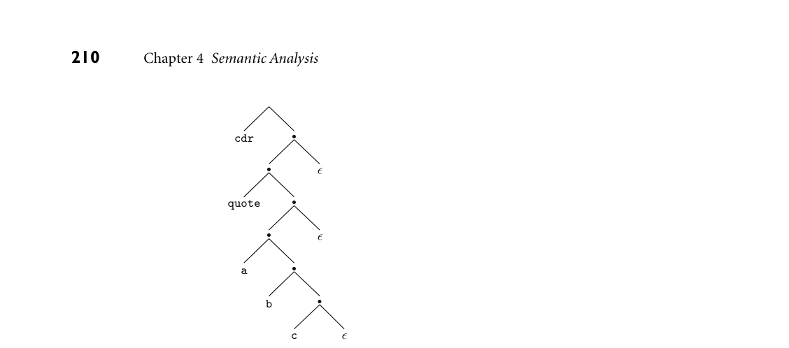

# 4.8 Exercises

Just as context-free grammars can be categorized according to the parsing al- gorithm(s) that can use them, attribute grammars can be categorized according to the complexity of their pattern of attribute flow. S-attributed grammars, in which all attributes are synthesized, can naturally be evaluated in a single bottom-up pass over a parse tree, in precisely the order the tree is discovered by an LR-family parser. L-attributed grammars, in which all attribute flow is depth-first left-to- right, can be evaluated in precisely the order that the parse tree is predicted and matched by an LL-family parser. Attribute grammars with more complex pat- terns of attribute flow are not commonly used for the parse trees of production compilers, but are valuable for syntax-based editors, incremental compilers, and various other tools. While it is possible to construct automatic tools to analyze attribute flow and decorate parse trees, most compilers rely on action routines, which the compiler writer embeds in the right-hand sides of productions to evaluate attribute rules at specific points in a parse. In an LL-family parser, action routines can be embed- ded at arbitrary points in a production’s right-hand side. In an LR-family parser, action routines must follow the production’s left corner. Space for attributes in a bottom-up compiler is naturally allocated in parallel with the parse stack, but this complicates the management of inherited attributes. Space for attributes in a top-down compiler can be allocated automatically, or managed explicitly by the writer of action routines. The automatic approach has the advantage of regularity, and is easier to maintain; the ad hoc approach is slightly faster and more flexible. In a one-pass compiler, which interleaves scanning, parsing, semantic analysis, and code generation in a single traversal of its input, semantic functions or action routines are responsible for all of semantic analysis and code generation. More commonly, action routines simply build a syntax tree, which is then decorated during separate traversal(s) in subsequent pass(es). The code for these traversals is usually written by hand, in the form of mutually recursive subroutines, allowing the compiler to accommodate essentially arbitrary attribute flow on the syntax tree. In subsequent chapters (6–10 in particular) we will consider a wide variety of programming language constructs. Rather than present the actual attribute grammars required to implement these constructs, we will describe their seman- tics informally, and give examples of the target code. We will return to attribute grammars in Chapter 15, when we consider the generation of intermediate code in more detail. 4.8 Exercises

4.1 Basic results from automata theory tell us that the language L = anbncn = ϵ, abc, aabbcc, aaabbbccc, ... is not context free. It can be captured, however, using an attribute grammar. Give an underlying CFG and a set of attribute rules that associates a Boolean attribute ok with the root R of each

*Figure 4.16 Natural syntax tree for the Lisp expression (cdr ‚(a b c)).*

parse tree, such that R.ok = true if and only if the string corresponding to the fringe of the tree is in L. 4.2 Modify the grammar of Figure 2.25 so that it accepts only programs that contain at least one write statement. Make the same change in the solution to Exercise 2.17. Based on your experience, what do you think of the idea of using the CFG to enforce the rule that every function in C must contain at least one return statement? 4.3 Give two examples of reasonable semantic rules that cannot be checked at reasonable cost, either statically or by compiler-generated code at run time. 4.4 Write an S-attributed attribute grammar, based on the CFG of Example 4.7, that accumulates the value of the overall expression into the root of the tree. You will need to use dynamic memory allocation so that individual attributes can hold an arbitrary amount of information. 4.5 Lisp has the unusual property that its programs take the form of parenthe- sized lists. The natural syntax tree for a Lisp program is thus a tree of binary cells (known in Lisp as cons cells), where the first child represents the first element of the list and the second child represents the rest of the list. The syntax tree for (cdr ‚(a b c)) appears in Figure 4.16. (The notation ‚L is syntactic sugar for (quote L).) Extend the CFG of Exercise 2.18 to create an attribute grammar that will build such trees. When a parse tree has been fully decorated, the root should have an attribute v that refers to the syntax tree. You may assume that each atom has a synthesized attribute v that refers to a syntax tree node that holds information from the scanner. In your semantic functions, you may assume the availability of a cons function that takes two references as arguments and returns a reference to a new cons cell containing those references.

4.6 Refer back to the context-free grammar of Exercise 2.13. Add attribute rules to the grammar to accumulate into the root of the tree a count of the max- imum depth to which parentheses are nested in the program string. For example, given the string f1(a, f2(b * (c + (d - (e - f))))), the stmt at the root of the tree should have an attribute with a count of 3 (the paren- theses surrounding argument lists don’t count). 4.7 Suppose that we want to translate constant expressions into the postfix, or “reverse Polish” notation of logician Jan Łukasiewicz. Postfix notation does not require parentheses. It appears in stack-based languages such as Postscript, Forth, and the P-code and Java bytecode intermediate forms mentioned in Section 1.4. It also served, historically, as the input language of certain hand-held calculators made by Hewlett-Packard. When given a number, a postfix calculator would push the number onto an internal stack. When given an operator, it would pop the top two numbers from the stack, apply the operator, and push the result. The display would show the value at the top of the stack. To compute 2 × (15 −3)/4, for example, one would push 2 E 1 5 E 3 E - * 4 E / (here E is the “enter” key, used to end the string of digits that constitute a number). Using the underlying CFG of Figure 4.1, write an attribute grammar that will associate with the root of the parse tree a sequence of postfix calculator button pushes, seq, that will compute the arithmetic value of the tokens derived from that symbol. You may assume the existence of a function buttons(c) that returns a sequence of button pushes (ending with E on a postfix calculator) for the constant c. You may also assume the existence of a concatenation function for sequences of button pushes. 4.8 Repeat the previous exercise using the underlying CFG of Figure 4.3. 4.9 Consider the following grammar for reverse Polish arithmetic expressions:

E −→E E op | id

op −→+ | - | * | /

Assuming that each id has a synthesized attribute name of type string, and that each E and op has an attribute val of type string, write an attribute grammar that arranges for the val attribute of the root of the parse tree to contain a translation of the expression into conventional infix notation. For example, if the leaves of the tree, left to right, were “A A B - * C /,” then the val field of the root would be “( ( A * ( A - B ) ) / C ).” As an extra challenge, write a version of your attribute grammar that exploits the usual arithmetic precedence and associativity rules to use as few parentheses as possible. 4.10 To reduce the likelihood of typographic errors, the digits comprising most credit card numbers are designed to satisfy the so-called Luhn formula, stan- dardized by ANSI in the 1960s, and named for IBM mathematician Hans Peter Luhn. Starting at the right, we double every other digit (the second- to-last, fourth-to-last, etc.). If the doubled value is 10 or more, we add the

resulting digits. We then sum together all the digits. In any valid number the result will be a multiple of 10. For example, 1234 5678 9012 3456 becomes 2264 1658 9022 6416, which sums to 64, so this is not a valid number. If the last digit had been 2, however, the sum would have been 60, so the number would potentially be valid. Give an attribute grammar for strings of digits that accumulates into the root of the parse tree a Boolean value indicating whether the string is valid according to Luhn’s formula. Your grammar should accommodate strings of arbitrary length. 4.11 Consider the following CFG for floating-point constants, without exponen- tial notation. (Note that this exercise is somewhat artificial: the language in question is regular, and would be handled by the scanner of a typical com- piler.)

C −→digits . digits

digits −→digit more digits

more digits −→digits | ϵ

digit −→0 | 1 | 2 | 3 | 4 | 5 | 6 | 7 | 8 | 9

Augment this grammar with attribute rules that will accumulate the value of the constant into a val attribute of the root of the parse tree. Your answer should be S-attributed. 4.12 One potential criticism of the obvious solution to the previous problem is that the values in internal nodes of the parse tree do not reflect the value, in context, of the fringe below them. Create an alternative solution that addresses this criticism. More specifically, create your grammar in such a way that the val of an internal node is the sum of the vals of its chil- dren. Illustrate your solution by drawing the parse tree and attribute flow for 12.34. (Hint: You will probably want a different underlying CFG, and non-L-attributed flow.) 4.13 Consider the following attribute grammar for variable declarations, based on the CFG of Exercise 2.11:

decl −→ID decl tail  decl.t := decl tail.t  decl tail.in tab := insert (decl.in tab, ID.n, decl tail.t)  decl.out tab := decl tail.out tab decl tail −→, decl  decl tail.t := decl.t  decl.in tab := decl tail.in tab  decl tail.out tab := decl.out tab decl tail −→: ID ;  decl tail.t := ID.n  decl tail.out tab := decl tail.in tab

Show a parse tree for the string A, B : C;. Then, using arrows and textual description, specify the attribute flow required to fully decorate the tree. (Hint: Note that the grammar is not L-attributed.) 4.14 A CFG-based attribute evaluator capable of handling non-L-attributed at- tribute flow needs to take a parse tree as input. Explain how to build a parse tree automatically during a top-down or bottom-up parse (i.e., without ex- plicit action routines). 4.15 Building on Example 4.13, modify the remainder of the recursive descent parser of Figure 2.17 to build syntax trees for programs in the calculator language. 4.16 Write an LL(1) grammar with action routines and automatic attribute space management that generates the reverse Polish translation described in Ex- ercise 4.7. 4.17 (a) Write a context-free grammar for polynomials in x. Add semantic func- tions to produce an attribute grammar that will accumulate the poly- nomial’s derivative (as a string) in a synthesized attribute of the root of the parse tree. (b) Replace your semantic functions with action routines that can be eval- uated during parsing. 4.18 (a) Write a context-free grammar for case or switch statements in the style of Pascal or C. Add semantic functions to ensure that the same label does not appear on two different arms of the construct. (b) Replace your semantic functions with action routines that can be eval- uated during parsing. 4.19 Write an algorithm to determine whether the rules of an arbitrary attribute grammar are noncircular. (Your algorithm will require exponential time in the worst case [JOR75].) 4.20 Rewrite the attribute grammar of Figure 4.14 in the form of an ad hoc tree traversal consisting of mutually recursive subroutines in your favorite pro- gramming language. Keep the symbol table in a global variable, rather than passing it through arguments. 4.21 Write an attribute grammar based on the CFG of Figure 4.11 that will build a syntax tree with the structure described in Figure 4.14. 4.22 Augment the attribute grammar of Figure 4.5, Figure 4.6, or Exercise 4.21 to initialize a synthesized attribute in every syntax tree node that indicates the location (line and column) at which the corresponding construct appears in the source program. You may assume that the scanner initializes the location of every token. 4.23 Modify the CFG and attribute grammar of Figures 4.11 and 4.14 to permit mixed integer and real expressions, without the need for float and trunc. You will want to add an annotation to any node that must be coerced to the opposite type, so that the code generator will know to generate code to do

