# Part I: Foundations

I Foundations

A central premise of Programming Language Pragmatics is that language design and implemen­ tation are intimately connected; it’s hard to study one without the other.

The bulk of the text—Parts II and III—is organized around topics in language design,  but with detailed coverage throughout of the many ways in which design decisions have been  shaped by implementation concerns.

The frst fve chapters—Part I—set the stage by covering foundational material in both  design and implementation. Chapter 1 motivates the study of programming languages, in­ troduces the major language families, and provides an overview of the compilation process.  Chapter 3 covers the high-level structure of programs, with an emphasis on names, the  bind­ ing of names to objects, and the scope rules that govern which bindings are active at any given  time. In the process it touches on storage management; subroutines, modules, and classes;  polymorphism; and separate compilation.

Chapters 2, 4, and 5 are more implementation oriented. They provide the background  needed to understand the implementation issues mentioned in Parts II and III. Chapter 2  discusses the syntax, or textual structure, of programs. It introduces regular expressions and  context-free grammars, which designers use to describe program syntax, together with the scan­ ning and parsing algorithms that a compiler or interpreter uses to recognize that syntax. Given  an understanding of syntax, Chapter 4 explains how a compiler (or interpreter) determines  the semantics, or meaning of a program. The discussion is organized around the notion of at­ tribute grammars, which serve to map a program onto something else that has meaning, such  as mathematics or some other existing language. Finally, Chapter 5 (entirely on the companion  site) provides an overview of assembly-level computer architecture, focusing on the features of  modern microprocessors most relevant to compilers. Programmers who understand these fea­ tures have a better chance not only of understanding why the languages they use were designed  the way they were, but also of using those languages as fully and effectively as possible.

1 Introduction

The first electronic computers were monstrous contraptions, flling  several rooms, consuming as much electricity as a good-size factory, and costing  millions of 1940s dollars (but with much less computing power than even the sim­ plest modern cell phone). The programmers who used these machines believed  that the computer’s time was more valuable than theirs. They programmed in  machine language. Machine language is the sequence of bits that directly controls  a processor, causing it to add, compare, move data from one place to another,  and so forth at appropriate times. Specifying programs at this level of detail is an

EXAMPLE 1.1  enormously tedious task. The following program calculates the greatest common  GCD program in x86  divisor (GCD) of two integers, using Euclid’s algorithm. It is written in machine  machine language  language, expressed here as hexadecimal (base 16) numbers, for the x86 instruc­ tion set.

55 89 e5 53  83 ec 04 83  e4 f0 e8 31  00 00 00 89  c3 e8 2a 00  00 00 39 c3  74 10 8d b6  00 00 00 00  39 c3 7e 13  29 c3 39 c3  75 f6 89 1c  24 e8 6e 00  00 00 8b 5d  fc c9 c3 29  d8 eb eb 90  ■

As people began to write larger programs, it quickly became apparent that a  less error-prone notation was required. Assembly languages were invented to al-

EXAMPLE 1.2  low operations to be expressed with mnemonic abbreviations. Our GCD program  GCD program in x86  looks like this in x86 assembly language:  assembler

pushl  %ebp  jle  D  movl  %esp, %ebp  subl  %eax, %ebx  pushl  %ebx  B:  cmpl  %eax, %ebx  subl  $4, %esp  jne  A  andl  $-16, %esp  C:  movl  %ebx, (%esp)  call  getint  call  putint  movl  %eax, %ebx  movl  -4(%ebp), %ebx  call  getint  leave  cmpl  %eax, %ebx  ret  je  C  D:  subl  %ebx, %eax  A:  cmpl  %eax, %ebx  jmp  B  ■

Assembly languages were originally designed with a one-to-one correspon­ dence between mnemonics and machine language instructions, as shown in this  example.1 Translating from mnemonics to machine language became the job  of a systems program known as an assembler. Assemblers were eventually aug­ mented with elaborate “macro expansion” facilities to permit programmers to  defne parameterized abbreviations for common sequences of instructions. The  correspondence between assembly language and machine language remained ob­ vious and explicit, however. Programming continued to be a machine-centered  enterprise: each different kind of computer had to be programmed in its own as­ sembly language, and programmers thought in terms of the instructions that the  machine would actually execute.

As computers evolved, and as competing designs developed, it became increas­ ingly frustrating to have to rewrite programs for every new machine. It also be­ came increasingly diffcult for human beings to keep track of the wealth of de­ tail in large assembly language programs. People began to wish for a machine- independent language, particularly one in which numerical computations (the  most common type of program in those days) could be expressed in something  more closely resembling mathematical formulae. These wishes led in the mid­ 1950s to the development of the original dialect of Fortran, the frst arguably  high-level programming language. Other high-level languages soon followed, no­ tably Lisp and Algol.

Translating from a high-level language to assembly or machine language is the  job of a systems program known as a compiler.2 Compilers are substantially more  complicated than assemblers because the one-to-one correspondence between  source and target operations no longer exists when the source is a high-level  language. Fortran was slow to catch on at frst, because human programmers,  with some effort, could almost always write assembly language programs that  would run faster than what a compiler could produce. Over time, however, the  performance gap has narrowed, and eventually reversed. Increases in hardware  complexity (due to pipelining, multiple functional units, etc.) and continuing  improvements in compiler technology have led to a situation in which a state- of-the-art compiler will usually generate better code than a human being will.  Even in cases in which human beings can do better, increases in computer speed  and program size have made it increasingly important to economize on program­ mer effort, not only in the original construction of programs, but in subsequent

1  The 22 lines of assembly code in the example are encoded in varying numbers of bytes in ma­ chine language. The three cmp (compare) instructions, for example, all happen to have the same  register operands, and are encoded in the two-byte sequence (39 c3). The four mov (move) in­ structions have different operands and lengths, and begin with 89 or 8b. The chosen syntax is  that of the GNU gcc compiler suite, in which results overwrite the last operand, not the frst.

2  High-level languages may also be interpreted directly, without the translation step. We will return  to this option in Section 1.4. It is the principal way in which scripting languages like Python and  JavaScript are implemented.

program maintenance—enhancement and correction. Labor costs now heavily  outweigh the cost of computing hardware.

## 1.1  The Art of Language Design

Today there are thousands of high-level programming languages, and new ones  continue to emerge. Why are there so many? There are several possible answers:

Evolution. Computer science is a young discipline; we’re constantly fnding bet­

ter ways to do things. The late 1960s and early 1970s saw a revolution in  “structured programming,” in which the goto-based control fow of languages  like Fortran, Cobol, and Basic3 gave way to while loops, case (switch)  statements, and similar higher-level constructs. In the late 1980s the nested  block structure of languages like Algol, Pascal, and Ada began to give way to  the object-oriented structure of languages like Smalltalk, C++, Eiffel, and—a  decade later—Java and C#. More recently, scripting languages like Python and  Ruby have begun to displace more traditional compiled languages, at least for  rapid development.  Special Purposes. Some languages were designed for a specifc problem domain.  The various Lisp dialects are good for manipulating symbolic data and com­ plex data structures.  Icon and Awk are good for manipulating character  strings. C is good for low-level systems programming. Prolog is good for rea­ soning about logical relationships among data. Each of these languages can be  used successfully for a wider range of tasks, but the emphasis is clearly on the  specialty.  Personal Preference. Different people like different things. Much of the parochi­

alism of programming is simply a matter of taste. Some people love the terse­ ness of C; some hate it. Some people fnd it natural to think recursively; others  prefer iteration. Some people like to work with pointers; others prefer the im­ plicit dereferencing of Lisp, Java, and ML. The strength and variety of personal  preference make it unlikely that anyone will ever develop a universally accept­ able programming language.

Of course, some languages are more successful than others. Of the many that  have been designed, only a few dozen are widely used. What makes a language  successful? Again there are several answers:

Expressive Power. One commonly hears arguments that one language is more  “powerful” than another, though in a formal mathematical sense they are all

3  The names of these languages are sometimes written entirely in uppercase letters and sometimes  in mixed case. For consistency’s sake, I adopt the convention in this book of using mixed case for  languages whose names are pronounced as words (e.g., Fortran, Cobol, Basic), and uppercase for  those pronounced as a series of letters (e.g., APL, PL/I, ML).

Turing complete—each can be used, if awkwardly, to implement arbitrary algo­ rithms. Still, language features clearly have a huge impact on the programmer’s  ability to write clear, concise, and maintainable code, especially for very large  systems. There is no comparison, for example, between early versions of Basic  on the one hand, and C++ on the other. The factors that contribute to ex­ pressive power—abstraction facilities in particular—are a major focus of this  book.  Ease of Use for the Novice. While it is easy to pick on Basic, one cannot deny its  success. Part of that success was due to its very low “learning curve.” Pascal was  taught for many years in introductory programming language courses because,  at least in comparison to other “serious” languages, it was compact and easy  to learn. Shortly after the turn of the century, Java came to play a similar role;  though substantially more complex than Pascal, it is simpler than, say, C++. In  a renewed quest for simplicity, some introductory courses in recent years have  turned to scripting languages like Python.  Ease of Implementation. In addition to its low learning curve, Basic was success­

ful because it could be implemented easily on tiny machines, with limited re­ sources. Forth had a small but dedicated following for similar reasons. Ar­ guably the single most important factor in the success of Pascal was that its de­ signer, Niklaus Wirth, developed a simple, portable implementation of the lan­ guage, and shipped it free to universities all over the world (see Example 1.15).4  The Java and Python designers took similar steps to make their language avail­ able for free to almost anyone who wants it.  Standardization. Almost every widely used language has an offcial international  standard or (in the case of several scripting languages) a single canonical im­ plementation; and in the latter case the canonical implementation is almost  invariably written in a language that has a standard.  Standardization—of  both the language and a broad set of libraries—is the only truly effective way  to ensure the portability of code across platforms. The relatively impover­ ished standard for Pascal, which was missing several features considered essen­ tial by many programmers (separate compilation, strings, static initialization,  random-access I/O), was at least partially responsible for the language’s drop  from favor in the 1980s. Many of these features were implemented in different  ways by different vendors.  Open Source. Most programming languages today have at least one open-source  compiler or interpreter, but some languages—C in particular—are much  more closely associated than others with freely distributed, peer-reviewed,  community-supported computing. C was originally developed in the early

4  Niklaus Wirth (1934–), Professor Emeritus of Informatics at ETH in Zürich, Switzerland, is  responsible for a long line of infuential languages, including Euler, Algol W, Pascal, Modula,  Modula-2, and Oberon. Among other things, his languages introduced the notions of enumera­ tion, subrange, and set types, and unifed the concepts of records (structs) and variants (unions).  He received the annual ACM Turing Award, computing’s highest honor, in 1984.

1970s by Dennis Ritchie and Ken Thompson at Bell Labs,5 in conjunction  with the design of the original Unix operating system. Over the years Unix  evolved into the world’s most portable operating system—the OS of choice for  academic computer science—and C was closely associated with it. With the  standardization of C, the language became available on an enormous variety  of additional platforms. Linux, the leading open-source operating system, is  written in C. As of June 2015, C and its descendants account for well over half  of a variety of language-related on-line content, including web page references,  book sales, employment listings, and open-source repository updates.  Excellent Compilers. Fortran owes much of its success to extremely good com­

pilers. In part this is a matter of historical accident. Fortran has been around  longer than anything else, and companies have invested huge amounts of time  and money in making compilers that generate very fast code. It is also a matter  of language design, however: Fortran dialects prior to Fortran 90 lacked recur­ sion and pointers, features that greatly complicate the task of generating fast  code (at least for programs that can be written in a reasonable fashion with­ out them!). In a similar vein, some languages (e.g., Common Lisp) have been  successful in part because they have compilers and supporting tools that do an  unusually good job of helping the programmer manage very large projects.  Economics, Patronage, and Inertia. Finally, there are factors other than technical  merit that greatly infuence success. The backing of a powerful sponsor is one.  PL/I, at least to frst approximation, owed its life to IBM. Cobol and Ada owe  their life to the U. S. Department of Defense. C# owes its life to Microsoft. In  recent years, Objective-C has enjoyed an enormous surge in popularity as the  offcial language for iPhone and iPad apps. At the other end of the life cycle,  some languages remain widely used long after “better” alternatives are avail­ able, because of a huge base of installed software and programmer expertise,  which would cost too much to replace. Much of the world’s fnancial infras­ tructure, for example, still functions primarily in Cobol.

Clearly no single factor determines whether a language is “good.” As we study  programming languages, we shall need to consider issues from several points of  view. In particular, we shall need to consider the viewpoints of both the pro­ grammer and the language implementor. Sometimes these points of view will be  in harmony, as in the desire for execution speed. Often, however, there will be  conficts and tradeoffs, as the conceptual appeal of a feature is balanced against  the cost of its implementation. The tradeoff becomes particularly thorny when  the implementation imposes costs not only on programs that use the feature, but  also on programs that do not.

5  Ken Thompson (1943–) led the team that developed Unix. He also designed the B programming  language, a child of BCPL and the parent of C. Dennis Ritchie (1941–2011) was the principal  force behind the development of C itself. Thompson and Ritchie together formed the core of an  incredibly productive and infuential group. They shared the ACM Turing Award in 1983.

In the early days of computing the implementor’s viewpoint was predominant.  Programming languages evolved as a means of telling a computer what to do. For  programmers, however, a language is more aptly defned as a means of expressing  algorithms. Just as natural languages constrain exposition and discourse, so pro­ gramming languages constrain what can and cannot easily be expressed, and have  both profound and subtle infuence over what the programmer can think. Donald   Knuth has suggested that programming be regarded as the art of telling another  human being what one wants the computer to do [Knu84].6 This defnition per­ haps strikes the best sort of compromise. It acknowledges that both conceptual  clarity and implementation effciency are fundamental concerns. This book at­ tempts to capture this spirit of compromise, by simultaneously considering the  conceptual and implementation aspects of each of the topics it covers.

DESIGN & IMPLEMENTATION

1.1 Introduction

Throughout the book, sidebars like this one will highlight the interplay of  language design and language implementation. Among other things, we will  consider

Cases (such as those mentioned in this section) in which ease or diffculty  of implementation signifcantly affected the success of a language  Language features that many designers now believe were mistakes, at least  in part because of implementation diffculties  Potentially useful features omitted from some languages because of concern  that they might be too diffcult or slow to implement  Language features introduced at least in part to facilitate effcient or elegant  implementations  Cases in which a machine architecture makes reasonable features unreason­ ably expensive  Various other tradeoffs in which implementation plays a signifcant role

A complete list of sidebars appears in Appendix B.

6  Donald E. Knuth (1938–), Professor Emeritus at Stanford University and one of the foremost  fgures in the design and analysis of algorithms, is also widely known as the inventor of the TEX  typesetting system (with which this book was produced) and of the literate programming method­ ology with which TEX was constructed. His multivolume The Art of Computer Programming has  an honored place on the shelf of most professional computer scientists. He received the ACM  Turing Award in 1974.

*Figure 1.1  Classification of programming languages. Note that the categories are fuzzy, and  open to debate. In particular, it is possible for a functional language to be object-oriented, and  many authors do not consider functional programming to be declarative.  1.2  The Programming Language Spectrum*

EXAMPLE 1.3  The many existing languages can be classifed into families based on their model  Classification of  of computation. Figure 1.1 shows a common set of families. The top-level di­ programming languages  vision distinguishes between the declarative languages, in which the focus is on  what the computer is to do, and the imperative languages, in which the focus is  on how the computer should do it.  ■  Declarative languages are in some sense “higher level”; they are more in tune  with the programmer’s point of view, and less with the implementor’s point of  view. Imperative languages predominate, however, mainly for performance rea­ sons. There is a tension in the design of declarative languages between the desire  to get away from “irrelevant” implementation details and the need to remain close  enough to the details to at least control the outline of an algorithm. The design of  effcient algorithms, after all, is what much of computer science is about. It is not  yet clear to what extent, and in what problem domains, we can expect compilers  to discover good algorithms for problems stated at a very high level of abstrac­ tion. In any domain in which the compiler cannot fnd a good algorithm, the  programmer  needs  to be  able  to specify  one  explicitly.

Within the declarative and imperative families, there are several important  subfamilies:

Functional languages employ a computational model based on the recursive  defnition of functions. They take their inspiration from the lambda calculus,  a formal computational model developed by Alonzo Church in the 1930s. In  essence, a program is considered a function from inputs to outputs, defned in  terms of simpler functions through a process of refnement. Languages in this  category include Lisp, ML, and Haskell.  Dataflow languages model computation as the fow of information (tokens)  among primitive functional nodes. They provide an inherently parallel model:  nodes are triggered by the arrival of input tokens, and can operate concur­ rently. Id and Val are examples of datafow languages. Sisal, a descendant of  Val, is more often described as a functional language.

Logic or constraint-based languages take their inspiration from predicate logic.  They model computation as an attempt to fnd values that satisfy certain spec­ ifed relationships, using goal-directed search through a list of logical rules.  Prolog is the best-known logic language. The term is also sometimes applied  to the SQL database language, the XSLT scripting language, and programmable  aspects of spreadsheets such as Excel and its predecessors.  The von Neumann languages are probably the most familiar and widely used.  They include Fortran, Ada, C, and all of the others in which the basic means of  computation is the modifcation of variables.7 Whereas functional languages  are based on expressions that have values, von Neumann languages are based  on statements (assignments in particular) that infuence subsequent computa­ tion via the side effect of changing the value of memory.  Object-oriented languages trace their roots to Simula 67.  Most are closely  related to the von Neumann languages, but have a much more structured  and distributed model of both memory and computation. Rather than pic­ ture computation as the operation of a monolithic processor on a monolithic  memory, object-oriented languages picture it as interactions among semi- independent objects, each of which has both its own internal state and sub­ routines to manage that state. Smalltalk is the purest of the object-oriented  languages; C++ and Java are probably the most widely used. It is also possi­ ble to devise object-oriented functional languages (the best known of these are  CLOS [Kee89] and OCaml), but they tend to have a strong imperative favor.  Scripting languages are distinguished by their emphasis on coordinating or  “gluing together” components drawn from some surrounding context. Sev­ eral scripting languages were originally developed for specifc purposes: csh  and bash are the input languages of job control (shell) programs; PHP and  JavaScript are primarily intended for the generation of dynamic web content;  Lua is widely used to control computer games. Other languages, including  Perl, Python, and Ruby, are more deliberately general purpose. Most place  an emphasis on rapid prototyping, with a bias toward ease of expression over  speed of execution.

One might suspect that concurrent (parallel) languages would form a separate  family (and indeed this book devotes a chapter to such languages), but the dis­ tinction between concurrent and sequential execution is mostly independent of  the classifcations above. Most concurrent programs are currently written using  special library packages or compilers in conjunction with a sequential language  such as Fortran or C. A few widely used languages, including Java, C#, and Ada,  have explicitly concurrent features. Researchers are investigating concurrency in  each of the language families mentioned here.

7  John von Neumann (1903–1957) was a mathematician and computer pioneer who helped to  develop the concept of stored program computing, which underlies most computer hardware. In  a stored program computer, both programs and data are represented as bits in memory, which  the processor repeatedly fetches, interprets, and updates.

As a simple example of the contrast among language families, consider the  greatest common divisor (GCD) problem introduced at the beginning of this  chapter. The choice among, say, von Neumann, functional, or logic program­ ming for this problem infuences not only the appearance of the code, but how

EXAMPLE 1.4  the programmer thinks. The von Neumann algorithm version of the algorithm is  GCD function in C  very imperative:

To compute the gcd of a and b, check  to  see  if  a and b are equal. If so, print one of  them and stop. Otherwise, replace the larger one by their difference and repeat.

C code for this algorithm appears at the top of Figure 1.2.  ■

EXAMPLE 1.5  In a functional language, the emphasis is on the mathematical relationship of  GCD function in OCaml  outputs to inputs:

The gcd of a and b is defned to be (1) a when a and b are equal, (2) the gcd of b and  a - b  when a > b, and  (3)  the  gcd of a and b - a  when b > a. To  compute  the  gcd of  a given pair of numbers, expand and simplify this defnition until it terminates.

An OCaml version of this algorithm appears in the middle of Figure 1.2. The key­ word let introduces a defnition; rec indicates that it is permitted to be recursive  (self-referential); arguments for a function come between the name (in this case,  gcd) and the equals sign.  ■

EXAMPLE 1.6  In a logic language, the programmer specifes a set of axioms and proof rules  GCD rules in Prolog  that allows the system to fnd desired values:

The proposition gcd(a, b, g) is true if (1) a, b, and  g are all equal; (2) a is greater  than b and there exists a number c such that c is a - b  and gcd(c, b, g) is true; or  (3) a is less than b and there exists a number c such that c is b - a  and gcd(c, a,  g) is true. To compute the gcd of a given pair of numbers, search for a number g (and  various numbers c) for which these rules allow one to prove that gcd(a, b, g) is true.

A Prolog version of this algorithm appears at the bottom of Figure 1.2. It may be  easier to understand if one reads “if” for :- and “and” for commas.  ■  It should be emphasized that the distinctions among language families are not  clear-cut. The division between the von Neumann and object-oriented languages,  for example, is often very fuzzy, and many scripting languages are also object- oriented. Most of the functional and logic languages include some imperative  features, and several recent imperative languages have added functional features.  The descriptions above are meant to capture the general favor of the families,  without providing formal defnitions.

Imperative languages—von Neumann and object-oriented—receive the bulk  of the attention in this book. Many issues cut across family lines, however, and  the interested reader will discover much that is applicable to alternative compu­ tational models in most chapters of the book. Chapters 11 through 14 contain  additional material on functional, logic, concurrent, and scripting languages.

*Figure 1.2  The GCD algorithm in C (top), OCaml (middle), and Prolog (bottom). All three  versions assume (without checking) that their inputs are positive integers.  1.3  Why Study Programming Languages?*

Programming languages are central to computer science, and to the typical com­ puter science curriculum. Like most car owners, students who have become fa­ miliar with one or more high-level languages are generally curious to learn about  other languages, and to know what is going on “under the hood.” Learning about  languages is interesting. It’s also practical.

For one thing, a good understanding of language design and implementation  can help one choose the most appropriate language for any given task. Most lan­ guages are better for some things than for others. Few programmers are likely to  choose Fortran for symbolic computing or string processing, but other choices  are not nearly so clear-cut. Should one choose C, C++, or C# for systems pro­ gramming? Fortran or C for scientifc computations? PHP or Ruby for a web- based application? Ada or C for embedded systems? Visual Basic or Java for a  graphical user interface? This book should help equip you to make such deci­ sions.

Similarly, this book should make it easier to learn new languages. Many lan­ guages are closely related. Java and C# are easier to learn if you already know  C++; Common Lisp if you already know Scheme; Haskell if you already know  ML. More importantly, there are basic concepts that underlie all programming  languages. Most of these concepts are the subject of chapters in this book: types,  control (iteration, selection, recursion, nondeterminacy, concurrency), abstrac­ tion, and naming. Thinking in terms of these concepts makes it easier to assim­ ilate the syntax (form) and semantics (meaning) of new languages, compared to  picking them up in a vacuum. The situation is analogous to what happens in nat­

ural languages: a good knowledge of grammatical forms makes it easier to learn a  foreign language.  Whatever language you learn, understanding the decisions that went into its  design and implementation will help you use it better. This book should help  you:

Understand obscure features. The typical C++ programmer rarely uses unions,  multiple inheritance, variable numbers of arguments, or the .* operator. (If  you don’t know what these are, don’t worry!)  Just as it simplifes the  assimi­ lation of new languages, an understanding of basic concepts makes it easier to  understand these features when you look up the details in the manual.  Choose among alternative ways to express things, based on a knowledge of imple­

mentation costs. In C++, for example, programmers may need to avoid un­ necessary temporary variables, and use copy constructors whenever possible,  to minimize the cost of initialization. In Java they may wish to use Executor  objects rather than explicit thread creation. With certain (poor) compilers,  they may need to adopt special programming idioms to get the fastest code:  pointers for array traversal; x*x instead of x**2. In any language, they need  to be able to evaluate the tradeoffs among alternative implementations of ab­ stractions—for example between computation and table lookup for functions  like bit set cardinality, which can be implemented either way.  Make good use of debuggers, assemblers, linkers, and related tools. In general, the  high-level language programmer should not need to bother with implementa­ tion details. There are times, however, when an understanding of those details  is virtually essential. The tenacious bug or unusual system-building problem  may be dramatically easier to handle if one is willing to peek at the bits.  Simulate useful features in languages that lack them. Certain very useful features  are missing in older languages, but can be emulated by following a deliberate  (if unenforced) programming style. In older dialects of Fortran, for exam­ ple, programmers familiar with modern control constructs can use comments  and self-discipline to write well-structured code. Similarly, in languages with  poor abstraction facilities, comments and naming conventions can help imi­ tate modular structure, and the extremely useful iterators of Clu, C#, Python,  and Ruby (which we will study in Section 6.5.3) can be imitated with subrou­ tines and static variables.  Make better use of language technology wherever it appears. Most programmers  will never design or implement a conventional programming language, but  most will need language technology for other programming tasks. The typ­ ical personal computer contains fles in dozens of structured formats, en­ compassing word processing, spreadsheets, presentations, raster and vector  graphics, music, video, databases, and a wide variety of other application do­ mains. Web content is increasingly represented in XML, a text-based format  designed for easy manipulation in the XSLT scripting language (discussed in  Section C 14.3.5). Code to parse, analyze, generate, optimize, and otherwise

manipulate structured data can thus be found in almost any sophisticated pro­ gram, and all of this code is based on language technology. Programmers with  a strong grasp of this technology will be in a better position to write well- structured, maintainable tools.

In a similar vein, most tools themselves can be customized, via start-up con­ fguration fles, command-line arguments, input commands, or built-in exten­ sion languages (considered in more detail in Chapter 14). My home directory  holds more than 250 separate confguration (“preference”) fles. My personal  confguration fles for the emacs text editor comprise more than 1200 lines  of Lisp code. The user of almost any sophisticated program today will need  to make good use of confguration or extension languages. The designers of  such a program will need either to adopt (and adapt) some existing extension  language, or to invent new notation of their own. Programmers with a strong  grasp of language theory will be in a better position to design elegant, well- structured notation that meets the needs of current users and facilitates future  development.

Finally, this book should help prepare you for further study in language de­ sign or implementation, should you be so inclined. It will also equip you to un­ derstand the interactions of languages with operating systems and architectures,  should those areas draw your interest.

3CHECK YOUR UNDERSTANDING  1.  What is the difference between machine language and assembly language?  2.  In what way(s) are high-level languages an improvement on assembly lan­ guage? Are there circumstances in which it still make sense to program in  assembler?  3.  Why are there so many programming languages?

  4.
  What makes a programming language successful?
  5.
  Name three languages in each of the following categories: von Neumann,
  functional, object-oriented. Name two logic languages. Name two widely
  used concurrent languages.

  6.
  What distinguishes declarative languages from imperative languages?
  7.
  What organization spearheaded the development of Ada?

  8.
  What is generally considered the frst high-level programming language?
  9.
  What was the frst functional language?
* Why aren’t concurrent languages listed as a separate family in Figure 1.1?

## 1.4  Compilation and Interpretation

EXAMPLE 1.7  At the highest level of abstraction, the compilation and execution of a program in  Pure compilation  a high-level language look something like this:

Source program

Compiler

Input  Target program  Output

The compiler translates the high-level source program into an equivalent target  program (typically in machine language), and then goes away. At some arbitrary  later time, the user tells the operating system to run the target program. The com­ piler is the locus of control during compilation; the target program is the locus of  control during its own execution. The compiler is itself a machine language pro­ gram, presumably created by compiling some other high-level program. When  written to a fle in a format understood by the operating system, machine lan­ guage is commonly known as object code.  ■

EXAMPLE 1.8  An alternative style of implementation for high-level languages is known as  Pure interpretation  interpretation:

Interpreter  Source program

Output

Input

Unlike a compiler, an interpreter stays around for the execution of the appli­ cation. In fact, the interpreter is the locus of control during that execution. In  effect, the interpreter implements a virtual machine whose “machine language”  is the high-level programming language. The interpreter reads statements in that  language more or less one at a time, executing them as it goes along.  ■  In general, interpretation leads to greater fexibility and better diagnostics (er­ ror messages) than does compilation. Because the source code is being executed  directly, the interpreter can include an excellent source-level debugger. It can also  cope with languages in which fundamental characteristics of the program, such as  the sizes and types of variables, or even which names refer to which variables, can  depend on the input data. Some language features are almost impossible to im­ plement without interpretation: in Lisp and Prolog, for example, a program can  write new pieces of itself and execute them on the fy. (Several scripting languages  also provide this capability.) Delaying decisions about program implementation  until run time is known as late binding; we will discuss it at greater length in  Section 3.1.

Compilation, by contrast, generally leads to better performance. In general,  a decision made at compile time is a decision that does not need to be made at  run time. For example, if the compiler can guarantee that variable x will always  lie at location 49378, it can generate machine language instructions that access  this location whenever the source program refers to x. By contrast, an interpreter  may need to look x up in a table every time it is accessed, in order to fnd its loca­ tion. Since the (fnal version of a) program is compiled only once, but generally  executed many times, the savings can be substantial, particularly if the interpreter  is doing unnecessary work in every iteration of a loop.

EXAMPLE 1.9  While the conceptual difference between compilation and interpretation is  Mixing compilation and  clear, most language implementations include a mixture of both. They typically  interpretation  look like this:

Source program

Translator

Intermediate program

Input  Output Virtual machine

We generally say that a language is “interpreted” when the initial translator is  simple. If the translator is complicated, we say that the language is “compiled.”  The distinction can be confusing because “simple” and “complicated” are sub­ jective terms, and because it is possible for a compiler (complicated translator)  to produce code that is then executed by a complicated virtual machine (inter­ preter); this is in fact precisely what happens by default in Java. We still say that a  language is compiled if the translator analyzes it thoroughly (rather than effecting  some “mechanical” transformation), and if the intermediate program does not  bear a strong resemblance to the source. These two characteristics—thorough  analysis and nontrivial transformation—are the hallmarks of compilation.  ■

DESIGN & IMPLEMENTATION

1.2 Compiled and interpreted languages  Certain languages (e.g., Smalltalk and Python) are sometimes referred to as  “interpreted languages” because most of their semantic error checking must  be performed at run time.  Certain other languages (e.g., Fortran and C)  are sometimes referred to as “compiled languages” because almost all of their  semantic error checking can be performed statically. This terminology isn’t  strictly correct: interpreters for C and Fortran can be built easily, and a com­ piler can generate code to perform even the most extensive dynamic semantic  checks. That said, language design has a profound effect on “compilability.”

In practice one sees a broad spectrum of implementation strategies:

EXAMPLE 1.10

Most interpreted languages employ an initial translator (a preprocessor) that re­ moves comments and white space, and groups characters together into tokens  such as keywords, identifers, numbers, and symbols. The translator may also  expand abbreviations in the style of a macro assembler. Finally, it may identify  higher-level syntactic structures, such as loops and subroutines. The goal is to  produce an intermediate form that mirrors the structure of the source, but can  be interpreted more effciently.  ■  In some very early implementations of Basic, the manual actually suggested  removing comments from a program in order to improve its performance.  These implementations were pure interpreters; they would re-read (and then  ignore) the comments every time they executed a given part of the program.  They had no initial translator.  The typical Fortran implementation comes close to pure compilation. The  compiler translates Fortran source into machine language. Usually, however,  it counts on the existence of a library of subroutines that are not part of the  original program. Examples include mathematical functions (sin, cos, log,  etc.) and I/O. The compiler relies on a separate program, known as a linker, to   merge the appropriate library routines into the fnal program:

Preprocessing

EXAMPLE 1.11

Library routines and linking

Fortran program

Compiler

Incomplete machine language  Library routines

Linker

Machine language program

In some sense, one may think of the library routines as extensions to the  hardware instruction set. The compiler can then be thought of as generating  code for a virtual machine that includes the capabilities of both the hardware  and the library.

In a more literal sense, one can fnd interpretation in the Fortran routines  for formatted output. Fortran permits the use of format statements that con­ trol the alignment of output in columns, the number of signifcant digits and  type of scientifc notation for foating-point numbers, inclusion/suppression  of leading zeros, and so on. Programs can compute their own formats on the  fy. The output library routines include a format interpreter. A similar inter­ preter can be found in the printf routine of C and its descendants.  ■

EXAMPLE 1.12  Many compilers generate assembly language instead of machine language. This  Post-compilation assembly  convention facilitates debugging, since assembly language is easier for people  to read, and isolates the compiler from changes in the format of machine lan­ guage fles that may be mandated by new releases of the operating system (only  the assembler must be changed, and it is shared by many compilers):

Source program

Compiler

Assembly language

Assembler

Machine language  ■

EXAMPLE 1.13

Compilers for C (and for many other languages running under Unix) begin  with a preprocessor that removes comments and expands macros. The pre­ processor can also be instructed to delete portions of the code itself, providing  a conditional compilation facility that allows several versions of a program to  be built from the same source:

The C preprocessor

Source program

Preprocessor

Modified source program

Compiler

Assembly language  ■

EXAMPLE 1.14

A surprising number of compilers generate output in some high-level  language—commonly C or some simplifed version of the input language.  Such source-to-source translation is particularly common in research languages  and during the early stages of language development. One famous example was  AT&T’s original compiler for C++. This was indeed a true compiler, though  it generated C instead of assembler: it performed a complete analysis of the  syntax and semantics of the C++ source program, and with very few excep­

Source-to-source  translation

tions generated all of the error messages that a programmer would see prior  to running the program. In fact, programmers were generally unaware that  the C compiler was being used behind the scenes. The C++ compiler did not  invoke the C compiler unless it had generated C code that would pass through  the second round of compilation without producing any error messages:

Source program

Compiler 1

Alternative source program (e.g., in C)

Compiler 2

Assembly language  ■

Occasionally one would hear the C++ compiler referred to as a preproces­ sor, presumably because it generated high-level output that was in turn com­ piled. I consider this a misuse of the term: compilers attempt to “understand”  their source; preprocessors do not. Preprocessors perform transformations  based on simple pattern matching, and may well produce output that will gen­ erate error messages when run through a subsequent stage of translation.

EXAMPLE 1.15  Many compilers are self-hosting:  they are  written in the  language  they   Bootstrapping  compile—Ada compilers in Ada, C compilers in C. This raises an obvious  question: how does one compile the compiler in the frst place? The answer  is to use a technique known as bootstrapping, a term derived from the inten­ tionally ridiculous notion of lifting oneself off the ground by pulling on one’s  bootstraps. In a nutshell, one starts with a simple implementation—often an  interpreter—and uses it to build progressively more sophisticated versions. We  can illustrate the idea with an historical example.  Many early Pascal compilers were built around a set of tools distributed by  Niklaus Wirth. These included the following:

– A Pascal compiler, written in Pascal, that would generate output in P-code,  a stack-based language similar to the bytecode of modern Java compilers  – The same compiler, already translated into P-code  – A P-code interpreter, written in Pascal

To get Pascal up and running on a local machine, the user of the tool set  needed only to translate the P-code interpreter (by hand) into some locally  available language. This translation was not a diffcult task; the interpreter was  small. By running the P-code version of the compiler on top of the P-code

interpreter, one could then compile arbitrary Pascal programs into P-code,  which could in turn be run on the interpreter. To get a faster implementa­ tion, one could modify the Pascal version of the Pascal compiler to generate  a locally available variety of assembly or machine language, instead of gen­ erating P-code (a somewhat more diffcult task). This compiler could then  be bootstrapped—run through itself—to yield a machine-code version of the  compiler:

Pascal to machine  language compiler,  in Pascal

Pascal to P-code  compiler, in P-code

Pascal to machine  language compiler,  in P-code

Pascal to machine  language compiler,  in machine language

In a more general context, suppose we were building one of the frst compil­ ers for a new programming language. Assuming we have a C compiler on our  target system, we might start by writing, in a simple subset of C, a compiler  for an equally simple subset of our new programming language. Once this  compiler was working, we could hand-translate the C code into (the subset of)  our new language, and then run the new source through the compiler itself.  After that, we could repeatedly extend the compiler to accept a larger subset

DESIGN & IMPLEMENTATION

1.3 The early success of Pascal  The P-code-based implementation of Pascal, and its use of bootstrapping, are  largely responsible for the language’s remarkable success in academic circles  in the 1970s. No single hardware platform or operating system of that era  dominated the computer landscape the way the x86, Linux, and Windows do  today.8 Wirth’s toolkit made it possible to get an implementation of Pascal up  and running on almost any platform in a week or so. It was one of the frst  great successes in system portability.

8  Throughout this book we will use the term “x86” to refer to the instruction set architecture of the  Intel 8086 and its descendants, including the various Pentium, “Core,” and Xeon processors. Intel  calls this architecture the IA-32, but x86 is a more generic term that encompasses the offerings of  competitors such as AMD as well.

of the new programming language, bootstrap it again, and use the extended  language to implement an even larger subset. “Self-hosting” implementations  of this sort are actually quite common.  ■  One will sometimes fnd compilers for languages (e.g., Lisp, Prolog, Smalltalk)  that permit a lot of late binding, and are traditionally interpreted. These com­ pilers must be prepared, in the general case, to generate code that performs  much of the work of an interpreter, or that makes calls into a library that does  that work instead. In important special cases, however, the compiler can gen­ erate code that makes reasonable assumptions about decisions that won’t be  fnalized until run time. If these assumptions prove to be valid the code will  run very fast. If the assumptions are not correct, a dynamic check will discover  the inconsistency, and revert to the interpreter.  ■  In some cases a programming system may deliberately delay compilation until  the last possible moment. One example occurs in language implementations  (e.g., for Lisp  or Prolog)  that  invoke  the  compiler on the  fy, to  translate  newly   created source into machine language, or to optimize the code for a particu­ lar input set. Another example occurs in implementations of Java. The Java  language defnition defnes a machine-independent intermediate form known  as Java bytecode. Bytecode is the standard format for distribution of Java pro­ grams; it allows programs to be transferred easily over the Internet, and then  run on any platform. The frst Java implementations were based on byte-code  interpreters, but modern implementations obtain signifcantly better perfor­ mance with a just-in-time compiler that translates bytecode into machine lan­ guage immediately before each execution of the program:

EXAMPLE 1.16

Compiling interpreted  languages

EXAMPLE 1.17

Dynamic and just-in-time  compilation

Java program

Java compiler  Input

Java byte code

Bytecode interpreter

JIT compiler

Output

Input  Machine language  Output

C#, similarly, is intended for just-in-time translation. The main C# com­ piler produces Common Intermediate Language (CIL), which is then translated  into machine language immediately prior to execution. CIL is deliberately lan­ guage independent, so it can be used for code produced by a variety of front- end compilers. We will explore the Java and C# implementations in detail in  Section 16.1.  ■

EXAMPLE 1.18  On some machines (particularly those designed before the mid-1980s), the  Microcode (firmware)  assembly-level instruction set is not actually implemented in hardware, but in  fact runs on an interpreter. The interpreter is written in low-level instructions  called microcode (or firmware), which is stored in read-only memory and ex­ ecuted by the hardware. Microcode and microprogramming are considered  further in Section C 5.4.1.  ■

As some of these examples make clear, a compiler does not necessarily translate  from a high-level programming language into machine language. Some compil­ ers, in fact, accept inputs that we might not immediately think of as programs at  all. Text formatters like TEX, for example, compile high-level document descrip­ tions into commands for a laser printer or phototypesetter. (Many laser printers  themselves contain pre-installed interpreters for the Postscript page-description  language.) Query language processors for database systems translate languages  like SQL into primitive operations on fles. There are even compilers that trans­ late logic-level circuit specifcations into photographic masks for computer chips.  Though the focus in this book is on imperative programming languages, the term  “compilation” applies whenever we translate automatically from one nontrivial  language to another, with full analysis of the meaning of the input.

## 1.5  Programming Environments

Compilers and interpreters do not exist in isolation. Programmers are assisted in  their work by a host of other tools. Assemblers, debuggers, preprocessors, and  linkers were mentioned earlier. Editors are familiar to every programmer. They  may be augmented with cross-referencing facilities that allow the programmer to  fnd the point at which an object is defned, given a point at which it is used. Pretty  printers help enforce formatting conventions. Style checkers enforce syntactic or  semantic conventions that may be tighter than those enforced by the compiler  (see Exploration 1.14). Confguration management tools help keep track of de­ pendences among the (many versions of) separately compiled modules in a large  software system. Perusal tools exist not only for text but also for intermediate  languages that may be stored in binary. Proflers and other performance analysis  tools often work in conjunction with debuggers to help identify the pieces of a  program that consume the bulk of its computation time.

In older programming environments, tools may be executed individually, at  the explicit request of the user. If a running program terminates abnormally with  a “bus error” (invalid address) message, for example, the user may choose to in­ voke a debugger to examine the “core” fle dumped by the operating system. He  or she may then attempt to identify the program bug by setting breakpoints, en­ abling tracing and so on, and running the program again under the control of the  debugger. Once the bug is found, the user will invoke the editor to make an ap­ propriate change. He or she will then recompile the modifed program, possibly  with the help of a confguration manager.

Modern environments provide more integrated tools. When an invalid address  error occurs in an integrated development environment (IDE), a new window is  likely to appear on the user’s screen, with the line of source code at which the  error occurred highlighted. Breakpoints and tracing can then be set in this win­ dow without explicitly invoking a debugger. Changes to the source can be made  without explicitly invoking an editor. If the user asks to rerun the program af­ ter making changes, a new version may be built without explicitly invoking the  compiler or confguration manager.

The editor for an IDE may incorporate knowledge of language syntax, provid­ ing templates for all the standard control structures, and checking syntax as it is  typed in. Internally, the IDE is likely to maintain not only a program’s source  and object code, but also a partially compiled internal representation. When the  source is edited, the internal representation will be updated automatically—often  incrementally (without reparsing large portions of the source). In some cases,  structural changes to the program may be implemented frst in the internal rep­ resentation, and then automatically refected in the source.

IDEs are fundamental to Smalltalk—it is nearly impossible to separate the lan­ guage from its graphical environment—and have been routinely used for Com­ mon Lisp since the 1980s. With the ubiquity of graphical interfaces, integrated  environments have largely displaced command-line tools for many languages and  systems. Popular open-source IDEs include Eclipse and NetBeans. Commercial  systems include the Visual Studio environment from Microsoft and the XCode  environment from Apple. Much of the appearance of integration can also be  achieved within sophisticated editors such as emacs.

3CHECK YOUR UNDERSTANDING  11. Explain the distinction between interpretation and compilation. What are the  comparative advantages and disadvantages of the two approaches?

* Is Java compiled or interpreted (or both)? How do you know?
* What is the difference between a compiler and a preprocessor?

* What was the intermediate form employed by the original AT&T C++ com­

piler?

DESIGN & IMPLEMENTATION

1.4 Powerful development environments  Sophisticated development environments can be a two-edged sword.  The  quality of the Common Lisp environment has arguably contributed to its  widespread acceptance. On the other hand, the particularity of the graphi­ cal environment for Smalltalk (with its insistence on specifc fonts, window  styles, etc.) made it diffcult to port the language to systems accessed through  a textual interface, or to graphical systems with a different “look and feel.”

* What  is  P-code?

* What is bootstrapping?
* What is a just-in-time compiler?

* Name two languages in which a program can write new pieces of itself “on
  the fy.”

* Briefy describe three “unconventional” compilers—compilers whose pur­

pose is not to prepare a high-level program for execution on a general- purpose processor.  20. List six kinds of tools that commonly support the work of a compiler within  a larger programming environment.  21. Explain how an integrated development environment (IDE) differs from a  collection of command-line tools.

## 1.6  An Overview of Compilation

Compilers are among the most well-studied computer programs. We will con­ sider them repeatedly throughout the rest of the book, and in chapters 2, 4, 15,  and 17 in particular. The remainder of this section provides an introductory  overview.

EXAMPLE 1.19  In a typical compiler, compilation proceeds through a series of well-defned  Phases of compilation and  phases, shown in Figure 1.3. Each phase discovers information of use to later  interpretation  phases, or transforms the program into a form that is more useful to the subse­ quent phase.

The frst few phases (up through semantic analysis) serve to fgure out the  meaning of the source program. They are sometimes called the front end of the  compiler. The last few phases serve to construct an equivalent target program.  They are sometimes called the back end of the compiler.

An interpreter (Figure 1.4) shares the compiler’s front-end structure, but  “executes” (interprets) the intermediate form directly, rather than translating  it into machine language. The execution typically takes the form of a set of  mutually recursive subroutines that traverse (“walk”) the syntax tree, “execut­ ing” its nodes in program order. Many compiler and interpreter phases can  be created automatically from a formal description of the source and/or target  languages.  ■  One will sometimes hear compilation described as a series of passes. A  pass   is a phase or set of phases that is serialized with respect to the rest of compila­ tion: it does not start until previous phases have completed, and it fnishes before  any subsequent phases start. If desired, a pass may be written as a separate pro­ gram, reading its input from a fle and writing its output to a fle. Compilers are  commonly divided into passes so that the front end may be shared by compilers

*Figure 1.3  Phases of compilation.  Phases are listed on the right and the forms in which  information is passed between phases are listed on the left. The symbol table serves throughout  compilation as a repository for information about identifers.*

*Figure 1.4  Phases of interpretation. The front end is essentially the same as that of a compiler.  The fnal phase “executes” the intermediate form, typically using a set of mutually recursive  subroutines that walk the syntax tree.*

for more than one machine (target language), and so that the back end may be  shared by compilers for more than one source language. In some implementa­ tions  the  front end  and the  back  end may be  separated by  a “middle  end”  that   is responsible for language- and machine-independent code improvement. Prior

to the dramatic increases in memory sizes of the mid to late 1980s, compilers  were also sometimes divided into passes to minimize memory usage: as each pass  completed, the next could reuse its code space.

1.6.1 Lexical and Syntax Analysis

EXAMPLE 1.20  Consider the greatest common divisor (GCD) problem introduced at the begin- GCD program in C  ning of this chapter, and shown as a function in Figure 1.2. Hypothesizing trivial  I/O routines and recasting the function as a stand-alone program, our code might  look like this in C:

int main() {  int i = getint(), j = getint();  while (i != j) {

if (i >  j) i  = i - j;   else j =  j - i;   }  putint(i);  }  ■

EXAMPLE 1.21  Scanning and parsing serve to recognize the structure of the program, without  GCD program tokens  regard to its meaning. The scanner reads characters (‘i’, ‘n’, ‘t’, ‘ ’, ‘m’, ‘a’, ‘i’, ‘n’,  ‘(’, ‘)’, etc.) and groups them into tokens, which are the smallest meaningful units  of the program. In our example, the tokens are

int main (  )  {  int i  =  getint (  )  ,  j  =  getint (  )  ;  while (  i  != j  )  {  if  (  i  >  j  )  i   =  i  - j  ;  else   j  =   j  - i  ;  }  putint (  i  ) ; }  ■

Scanning is also known as lexical analysis. The principal purpose of the scanner  is to simplify the task of the parser, by reducing the size of the input (there are  many more characters than tokens) and by removing extraneous characters like  white space. The scanner also typically removes comments and tags tokens with  line and column numbers, to make it easier to generate good diagnostics in later  phases. One could design a parser to take characters instead of tokens as input—  dispensing with the scanner—but the result would be awkward and slow.

EXAMPLE 1.22  Parsing organizes tokens into a parse tree that represents higher-level con­ Context-free grammar and  structs (statements, expressions, subroutines, and so on) in terms of their con- parsing  stituents. Each construct is a node in the tree; its constituents are its children. The  root of the tree is simply “program”; the leaves, from left to right, are the tokens  received from the scanner. Taken as a whole, the tree shows how the tokens ft

together to make a valid program. The structure relies on a set of potentially re­ cursive rules known as a context-free grammar. Each rule has an arrow sign (−→ )  with the construct name on the left and a possible expansion on the right.9 In C,  for example, a while loop consists of the keyword while followed by a parenthe­ sized Boolean expression and a statement:

iteration-statement −→ while ( expression ) statement

The statement, in turn, is often a list enclosed in braces:

statement −→ compound-statement

compound-statement −→ { block-item-list opt }

where

block-item-list opt −→ block-item-list

or

block-item-list opt −→

ϵ

and

block-item-list −→ block-item

block-item-list −→ block-item-list block-item

block-item −→ declaration

block-item −→ statement

Here  represents the empty string; it indicates that block-item-list opt can simply  be deleted. Many more grammar rules are needed, of course, to explain the full  structure of a program.  ■  A context-free grammar is said to defne the syntax of the language; parsing  is therefore known as syntax analysis. There are many possible grammars for C  (an infnite number, in fact); the fragment shown above is taken from the sam-

ϵ

EXAMPLE 1.23  ple grammar contained in the offcial language defnition [Int99]. A full parse  GCD program parse tree  tree for our GCD program (based on a full grammar not shown here) appears in  Figure 1.5. While the size of the tree may seem daunting, its details aren’t par­ ticularly important at this point in the text. What is important is that (1) each  individual branching point represents the application of a single grammar rule,  and (2) the resulting complexity is more a refection of the grammar than it is  of the input program. Much of the bulk stems from (a) the use of such artifcial  “constructs” as block item-list and block item-list opt to generate lists of arbitrary

9  Theorists also study context-sensitive grammars, in which  the allowable expansions  of a  construct   (the applicable rules) depend on the context in which the construct appears (i.e., on constructs  to the left and right). Context sensitivity is important for natural languages like English, but it is  almost never used in programming language design.

postfix-expression  (  )  ident(getint)  argument-expression-list_opt

ϵ  ident(i)  postfix-expression  postfix-expression  ( )

ident(getint)  argument-expression-list_opt  ϵ

declarator  =  initializer  pointer_opt  direct-declarator  assignment-expression

pointer_opt  direct-declarator  assignment-expression  ϵ  ident(j)  postfix-expression

type-specifier  declaration-specifiers_opt  block-item-list  block-item  B

init-declarator  declarator  =  initializer

13

declaration-specifiers  ident(main)  ϵ  block-item-list block-item

int  ϵ  declaration  A

1

} {  block-item-list_opt

declarator  compound-statement

block-item-list

int  ϵ  init-declarator-list  ,  init-declarator

declaration-specifiers  init-declarator-list_opt  ;

type-specifier  declaration-specifiers_opt  init-declarator-list

) (

declaration-list_opt

direct-declarator  identifier-list_opt

1

pointer_opt  ϵ

ϵ

function-definition

translation-unit

direct-declarator

1

13

1

ϵ

*Figure 1.5 Parse tree for the GCD program. The symbol  represents the empty string. Dotted lines indicate a chain of one-for-one replacements,  elided to save space; the adjacent number indicates the number of omitted nodes. While the details of the tree aren’t important to the current chapter,  the sheer amount of detail is: it comes from having to ft the (much simpler) source code into the hierarchical structure of a context-free grammar.*

additive-expression  - multiplicative-expression  additive-expression  - multiplicative-expression

ident(i)  ident(j)  selection-statement  ident(putint)  argument-expression-list_opt

ident(i)  ident(j)  ident(j)  ident(i)

unary-expression  assignment-operator  assignment-expression  unary-expression  assignment-operator  assignment-expression

ident(i)  =  additive-expression  ident(j)  =  additive-expression

5  4  5  4

if  (  expression  )  statement  else  statement  ident(i)

17

equality-expression  !=  relational-expression  {  block-item-list_opt  }  postfix-expression  ( )

iteration-statement  expression-statement

2  10  2  10

while ( expression )  statement  expression_opt  ;

statement  statement

equality-expression  compound-statement  postfix-expression

A B

7  15

8  7  3  1

relational-expression > shift-expression  expression_opt  ;  expression_opt  ;

ident(i)  ident(j)  assignment-expression  assignment-expression

relational-expression  expression-statement  expression-statement

1 1 7  6

ϵ

8

length, and (b) the use of the equally artifcial assignment-expression, additive- expression, multiplicative-expression, and so on, to capture precedence and asso­ ciativity in arithmetic expressions. We shall see in the following subsection that  much of this complexity can be discarded once parsing is complete.  ■  In the process of scanning and parsing, the compiler or interpreter checks to  see that all of the program’s tokens are well formed, and that the sequence of  tokens conforms to the syntax defned by the context-free grammar. Any mal­ formed tokens (e.g., 123abc or $@foo in C) should cause the scanner to produce  an error message. Any syntactically invalid token sequence (e.g., A = X Y Z  in C)  should lead to an error message from the parser.

1.6.2 Semantic Analysis and Intermediate Code Generation

Semantic analysis is the discovery of meaning in a program. Among other things,  the semantic analyzer recognizes when multiple occurrences of the same identi­ fer are meant to refer to the same program entity, and ensures that the uses are  consistent. In most languages it also tracks the types of both identifers and ex­ pressions, both to verify consistent usage and to guide the generation of code in  the back end of a compiler.

To assist in its work, the semantic analyzer typically builds and maintains a  symbol table data structure that maps each identifer to the information known  about it. Among other things, this information includes the identifer’s type, in­ ternal structure (if any), and scope (the portion of the program in which it is  valid).

Using the symbol table, the semantic analyzer enforces a large variety of rules  that are not captured by the hierarchical structure of the context-free grammar  and the parse tree. In C, for example, it checks to make sure that

Every identifer is declared before it is used.  No identifer is used in an inappropriate context (calling an integer as a sub­ routine, adding a string to an integer, referencing a feld of the wrong type of  struct, etc.).   Subroutine calls provide the correct number and types of arguments.  Labels on the arms of a switch statement are distinct constants.  Any function with a non-void return type returns a value explicitly.

In many front ends, the work of the semantic analyzer takes the form of semantic  action routines, invoked by the parser when it realizes that it has reached a partic­ ular point within a grammar rule.

Of course, not all semantic rules can be checked at compile time (or in the  front end of an interpreter). Those that can are referred to as the static semantics  of the language. Those that must be checked at run time (or in the later phases  of an interpreter) are referred to as the dynamic semantics of the language. C has  very little in the way of dynamic checks (its designers opted for performance over  safety). Examples of rules that other languages enforce at run time include:

Variables are never used in an expression unless they have been given a value.10

Pointers are never dereferenced unless they refer to a valid object.  Array subscript expressions lie within the bounds of the array.  Arithmetic operations do not overfow.

When it cannot enforce rules statically, a compiler will often produce code to  perform appropriate checks at run time, aborting the program or generating an  exception if one of the checks then fails. (Exceptions will be discussed in Sec­ tion 9.4.) Some rules, unfortunately, may be unacceptably expensive or impossi­ ble to enforce, and the language implementation may simply fail to check them.  In Ada, a program that breaks such a rule is said to be erroneous; in  C  its behavior   is said to be undefined.

A parse tree is sometimes known as a concrete syntax tree, because  it  demon­ strates, completely and concretely, how a particular sequence of tokens can be  derived under the rules of the context-free grammar. Once we know that a token  sequence is valid, however, much of the information in the parse tree is irrele-

EXAMPLE 1.24  vant to further phases of compilation. In the process of checking static semantic  GCD program abstract  rules, the semantic analyzer typically transforms the parse tree into an abstract  syntax tree  syntax tree (otherwise known as an AST, or simply a  syntax tree) by removing   most of the “artifcial” nodes in the tree’s interior. The semantic analyzer also  annotates the remaining nodes with useful information, such as pointers from  identifers to their symbol table entries. The annotations attached to a particular  node are known as its attributes. A syntax tree for our GCD program is shown in  Figure 1.6.  ■  Many interpreters use an annotated syntax tree to represent the running pro-

EXAMPLE 1.25  gram: “execution” then amounts to tree traversal. In our GCD program, an inter- Interpreting the syntax  preter would start at the root of Figure 1.6 and visit, in order, the statements on  tree  the main spine of the tree. At the frst “:=” node, the interpreter would notice that  the right child is a call: it would therefore call the getint routine (found in slot  3 of the symbol table) and assign the result into i (found in slot 5 of the symbol  table). At the second “:=” node the interpreter would similarly assign the result  of getint into j. At  the  while node it would repeatedly evaluate the left (“∗=”)  child and, if the result was true, recursively walk the tree under the right (if) child.   Finally, once the while node’s left child evaluated to false, the interpreter would  move on to the fnal call node, and output its result.  ■  In many compilers, the annotated syntax tree constitutes the intermediate  form that is passed from the front end to the back end. In other compilers, se­ mantic analysis ends with a traversal of the tree (typically single pass) that gener­ ates some other intermediate form. One common such form consists of a control  flow graph whose nodes resemble fragments of assembly language for a simple

10 As we shall see in Section 6.1.3, Java and C# actually do enforce initialization at compile time,  but only by adopting a conservative set of rules for “defnite assignment,” outlawing programs  for which correctness is diffcult or impossible to verify at compile time.

*Figure 1.6  Syntax tree and symbol table for the GCD program. Note the contrast to Fig­ ure 1.5: the syntax tree retains just the essential structure of the program, omitting details that  were needed only to drive the parsing algorithm.*

idealized machine. We will consider this option further in Chapter 15, where a  control fow graph for our GCD program appears in Figure 15.3. In a suite of re­ lated compilers, the front ends for several languages and the back ends for several  machines would share a common intermediate form.

1.6.3 Target Code Generation

The code generation phase of a compiler translates the intermediate form into  the target language. Given the information contained in the syntax tree, gener­ ating correct code is usually not a diffcult task (generating good code is harder,

EXAMPLE 1.26  as we shall see in Section 1.6.4). To generate assembly or machine language, the  GCD program assembly  code generator traverses the symbol table to assign locations to variables, and  code  then traverses the intermediate representation of the program, generating loads  and stores for variable references, interspersed with appropriate arithmetic opera­ tions, tests, and branches. Naive code for our GCD example appears in Figure 1.7,  in x86 assembly language. It was generated automatically by a simple pedagogical  compiler.  The assembly language mnemonics may appear a bit cryptic, but the com­ ments on each line (not generated by the compiler!) should make the correspon­

*Figure 1.7  Naive x86 assembly language for the GCD program.*

dence between Figures 1.6 and 1.7 generally apparent. A few hints: esp, ebp,  eax, ebx, and  edi are registers (special storage locations, limited in number, that  can be accessed very quickly). -8(%ebp) refers to the memory location 8 bytes  before the location whose address is in register ebp; in  this  program,  ebp serves  as a base from which we can fnd variables i and j. The argument to a subroutine  call instruction is passed by pushing it onto a stack, for which esp is the top-of­ stack pointer. The return value comes back in register eax. Arithmetic operations  overwrite their second argument with the result of the operation.11  ■

11 As noted in footnote 1, these are GNU assembler conventions; Microsoft and Intel assemblers  specify arguments in the opposite order.

Often a code generator will save the symbol table for later use by a symbolic  debugger, by including it in a nonexecutable part of the target code.

1.6.4 Code Improvement

Code improvement is often referred to as optimization, though it seldom makes  anything optimal in any absolute sense. It is an optional phase of compilation  whose goal is to transform a program into a new version that computes the same  result more effciently—more quickly or using less memory, or both.

Some improvements are machine independent. These can be performed as  transformations on the intermediate form. Other improvements require an un­ derstanding of the target machine (or of whatever will execute the program in the  target language). These must be performed as transformations on the target pro­ gram. Thus code improvement often appears twice in the list of compiler phases:  once immediately after semantic analysis and intermediate code generation, and  again immediately after target code generation.

EXAMPLE 1.27  Applying a good code improver to the code in Figure 1.7 produces the code  GCD program  shown in Example  1.2.  Comparing the two  programs,  we can see  that  the im­ optimization  proved version is quite a lot shorter. Conspicuously absent are most of the loads  and stores. The machine-independent code improver is able to verify that i and j  can be kept in registers throughout the execution of the main loop. (This would  not have been the case if, for example, the loop contained a call to a subrou­ tine that might reuse those registers, or that might try to modify i or j.) The  machine-specifc code improver is then able to assign i and j to actual regis­ ters of the target machine. For modern microprocessors, with complex internal  behavior, compilers can usually generate better code than can human assembly  language programmers.  ■

3CHECK YOUR UNDERSTANDING  22. List the principal phases of compilation, and describe the work performed by  each.  23. List the phases that are also executed as part of interpretation.

* Describe the form in which a program is passed from the scanner to the
  parser; from the parser to the semantic analyzer; from the semantic analyzer
  to the intermediate code generator.
* What distinguishes the front end of a compiler from the back end?

* What is the difference between a phase and a pass of compilation? Under what
  circumstances does it make sense for a compiler to have multiple passes?
* What is the purpose of the compiler’s symbol table?
* What is the difference between static and dynamic semantics?

* On modern machines, do assembly language programmers still tend to write
  better code than a good compiler can? Why or why not?

## 1.7  Summary and Concluding Remarks

In this chapter we introduced the study of programming language design and  implementation. We considered why there are so many languages, what makes  them successful or unsuccessful, how they may be categorized for study, and what  benefts the reader is likely to gain from that study. We noted that language design  and language implementation are intimately tied to one another. Obviously an  implementation must conform to the rules of the language. At the same time,  a language designer must consider how easy or diffcult it will be to implement  various features, and what sort of performance is likely to result.

Language implementations are commonly differentiated into those based on  interpretation and those based on compilation. We noted, however, that the dif­ ference between these approaches is fuzzy, and that most implementations in­ clude a bit of each. As a general rule, we say that a language is compiled if exe­ cution is preceded by a translation step that (1) fully analyzes both the structure  (syntax) and meaning (semantics) of the program, and (2) produces an equiva­ lent program in a signifcantly different form. The bulk of the implementation  material in this book pertains to compilation.

Compilers are generally structured as a series of phases. The frst few phases—  scanning, parsing, and semantic analysis—serve to analyze the source program.  Collectively these phases are known as the compiler’s front end. The  fnal  few   phases—target code generation and machine-specifc code improvement—are  known as the back end. They serve to build a target program—preferably a fast  one—whose semantics match those of the source. Between the front end and the  back end, a good compiler performs extensive machine-independent code im­ provement; the phases of this “middle end” typically comprise the bulk of the  code of the compiler, and account for most of its execution time.

Chapters 3, 6, 7, 8, 9, and 10 form the core of the rest of this book. They cover  fundamental issues of language design, both from the point of view of the pro­ grammer and from the point of view of the language implementor. To support  the discussion of implementations, Chapters 2 and 4 describe compiler front ends  in more detail than has been possible in this introduction. Chapter 5 provides an  overview of assembly-level architecture. Chapters 15 through 17 discuss com­ piler back ends, including assemblers and linkers, run-time systems, and code  improvement techniques. Additional language paradigms are covered in Chap­ ters 11 through 14. Appendix A lists the principal programming languages men­ tioned in the text, together with a genealogical chart and bibliographic references.  Appendix B contains a list of “Design & Implementation” sidebars; Appendix C  contains a list of numbered examples.

## 1.8  Exercises

1.1  Errors in a computer program can be classifed according to when they are  detected and, if they are detected at compile time, what part of the compiler  detects them. Using your favorite imperative language, give an example of  each of the following.  (a) A lexical error, detected by the scanner  (b) A syntax error, detected by the parser  (c)  A static semantic error, detected by semantic analysis  (d) A dynamic semantic error, detected by code generated by the compiler  (e) An error that the compiler can neither catch nor easily generate code to  catch (this should be a violation of the language defnition, not just a  program bug)

1.2  Consider again the Pascal tool set distributed by Niklaus Wirth (Exam­ ple 1.15). After successfully building a machine language version of the  Pascal compiler, one could in principle discard the P-code interpreter and  the P-code version of the compiler. Why might one choose not to do so?

1.3  Imperative languages like Fortran and C are typically compiled, while  scripting languages, in which many issues cannot be settled until run time,  are typically interpreted. Is interpretation simply what one “has to do” when  compilation is infeasible, or are there actually some advantages to interpret­ ing a language, even when a compiler is available?

1.4  The gcd program of Example 1.20 might also be written

int main() {  int i = getint(), j = getint();  while (i != j) {

if (i > j) i = i % j;  else j = j % i;  }  putint(i);  }

Does this program compute the same result? If not, can you fx it? Under  what circumstances would you expect one or the other to be faster?

1.5  Expanding on Example 1.25, trace an interpretation of the gcd program on  the inputs 12 and 8. Which syntax tree nodes are visited, in which order?

1.6  Both interpretation and code generation can be performed by traversal of a  syntax tree. Compare these two kinds of traversals. In what ways are they  similar/different?

1.7  In your local implementation of C, what is the limit on the size of inte­ gers? What happens in the event of arithmetic overfow? What are the

implications of size limits on the portability of programs from one ma­ chine/compiler to another? How do the answers to these questions differ  for  Java?  For  Ada? For  Pascal? For  Scheme? (You  may  need  to  fnd  a  man­ ual.)

1.8  The Unix make utility allows the programmer to specify dependences among  the separately compiled pieces of a program. If fle A depends on fle B and  fle B is modifed, make deduces that A must be recompiled, in case any of  the changes to B would affect the code produced for A. How  accurate  is  this   sort of dependence management? Under what circumstances will it lead  to unnecessary work? Under what circumstances will it fail to recompile  something that needs to be recompiled?

1.9  Why is it diffcult to tell whether a program is correct? How do you go about  fnding bugs in your code? What kinds of bugs are revealed by testing? What  kinds of bugs are not? (For more formal notions of program correctness,  see the bibliographic notes at the end of Chapter 4.)

## 1.9  Explorations

1.10 (a) What was the frst programming language you learned? If you chose it,  why did you do so? If it was chosen for you by others, why do you think  they chose it? What parts of the language did you fnd the most diffcult  to learn?  (b) For the language with which you are most familiar (this may or may  not be the frst one you learned), list three things you wish had been  differently designed. Why do you think they were designed the way  they were? How would you fx them if you had the chance to do it  over? Would there be any negative consequences, for example in terms  of compiler complexity or program execution speed?

1.11 Get together with a classmate whose principal programming experience is  with a language in a different category of Figure 1.1. (If your experience is  mostly in C, for example, you might search out someone with experience  in Lisp.) Compare notes. What are the easiest and most diffcult aspects  of programming, in each of your experiences? Pick a simple problem (e.g.,  sorting, or identifcation of connected components in a graph) and solve it  using each of your favorite languages. Which solution is more elegant (do  the two of you agree)? Which is faster? Why?  1.12 (a) If you have access to a Unix system, compile a simple program with  the -S command-line fag. Add comments to the resulting assembly  language fle to explain the purpose of each instruction.  (b) Now use the -o command-line fag to generate a relocatable object file.  Using appropriate local tools (look in particular for nm, objdump, or

a symbolic debugger like gdb or dbx), identify the machine language  corresponding to each line of assembler.  (c)  Using nm, objdump,  or a  similar tool,  identify  the  undefined external  symbols in your object fle. Now run the compiler to completion, to  produce an executable fle. Finally, run nm or objdump again to see  what has happened to the symbols in part (b). Where did they come  from—how did the linker resolve them?  (d) Run the compiler to completion one more time, using the -v command- line fag. You should see messages describing the various subprograms  invoked during the compilation process (some compilers use a dif­ ferent letter for this option; check the man page). The subprograms  may include a preprocessor, separate passes of the compiler itself (of­ ten two), probably an assembler, and the linker. If possible, run these  subprograms yourself, individually. Which of them produce the fles  described in the previous subquestions? Explain the purpose of the  various command-line fags with which the subprograms were invoked.

1.13 Write a program that commits a dynamic semantic error (e.g., division by  zero, access off the end of an array, dereference of a null pointer). What  happens when you run this program? Does the compiler give you options  to control what happens? Devise an experiment to evaluate the cost of run­ time semantic checks. If possible, try this exercise with more than one lan­ guage or compiler.

1.14 C has a reputation for being a relatively “unsafe” high-level language. For  example: it allows the programmer to mix operands of different sizes and  types in many more ways than its “safer” cousins. The Unix lint utility can  be used to search for potentially unsafe constructs in C programs. In effect,  many of the rules that are enforced by the compiler in other languages are  optional in C, and are enforced (if desired) by a separate program. What do  you think of this approach? Is it a good idea? Why or why not?

1.15 Using an Internet search engine or magazine indexing service, read up on  the history of Java and C#, including the confict between Sun and Microsoft  over Java standardization. Some have claimed that C# was, at least in part,  an attempt by Microsoft to undermine the spread of Java. Others point to  philosophical and practical differences between the languages, and argue  that C# more than stands on its merits. In hindsight, how would you char­ acterize Microsoft’s decision to pursue an alternative to Java?

## 1.10  Bibliographic Notes

The compiler-oriented chapters of this book attempt to convey a sense of what  the compiler does, rather than explaining how to build one. A much greater level  of detail can be found in other texts. Leading options include the work of Aho

et al. [ALSU07], Cooper and Torczon [CT04], and Fischer et al. [FCL10]. Other  excellent, though less current texts include those of Appel [App97] and Grune et  al. [GBJ+12]. Popular texts on programming language design include those of  Louden [LL12], Sebesta [Seb15], and Sethi [Set96].

Some of the best information on the history of programming languages can be  found in the proceedings of conferences sponsored by the Association for Com­ puting Machinery in 1978, 1993, and 2007 [Wex78, Ass93, Ass07]. Another excel­ lent referenceis Horowitz’s 1987 text [Hor87]. A broader range of historical mate­ rial  can be found  in the quarterly  IEEE Annals of the History of Computing. Given   the importance of personal taste in programming language design, it is inevitable  that some language comparisons should be marked by strongly worded opin­ ions. Early examples include the writings of Dijkstra [Dij82], Hoare [Hoa81],  Kernighan [Ker81], and Wirth [Wir85a].

Much modern software development takes place in integrated programming  environments. Infuential precursors to these environments include the Genera  Common Lisp environment from Symbolics Corp. [WMWM87] and the Small­ talk [Gol84], Interlisp [TM81], and Cedar [SZBH86] environments at the Xerox  Palo Alto Research Center.

2 Programming Language Syntax

Unlike natural languages such as English or Chinese, computer languages  must be precise. Both their form (syntax) and meaning (semantics) must be spec­ ifed without ambiguity, so that both programmers and computers can tell what  a program is supposed to do. To provide the needed degree of precision, lan­ guage designers and implementors use formal syntactic and semantic notation.  To facilitate the discussion of language features in later chapters, we will cover  this notation frst: syntax in the current chapter and semantics in Chapter 4.

EXAMPLE 2.1

As a motivating example, consider the Arabic numerals with which we repre­ sent numbers. These numerals are composed of digits, which we can enumerate  as follows (‘ | ’ means  “or”):

Syntax of Arabic numerals

digit −→ 0 | 1 | 2 | 3 | 4 | 5 | 6 | 7 | 8 | 9

Digits are the syntactic building blocks for numbers. In the usual notation, we say  that a natural number is represented by an arbitrary-length (nonempty) string of  digits, beginning with a nonzero digit:

non zero digit −→ 1 | 2 | 3 | 4 | 5 | 6 | 7 | 8 | 9

natural number −→ non zero digit digit *

Here the “Kleene1 star” metasymbol (*) is used to indicate zero or more repeti­ tions of the symbol to its left.  ■  Of course, digits are only symbols: ink blobs on paper or pixels on a screen.  They carry no meaning in and of themselves. We add semantics to digits when  we say that they represent the natural numbers from zero to nine, as defned by  mathematicians. Alternatively, we could say that they represent colors, or the  days of the week in a decimal calendar. These would constitute alternative se­ mantics for the same syntax. In a similar fashion, we defne the semantics of  natural numbers by associating a base-10, place-value interpretation with each

1  Stephen Kleene (1909–1994), a mathematician at the University of Wisconsin, was responsible  for much of the early development of the theory of computation, including much of the material  in Section C 2.4.

string of digits. Similar syntax rules and semantic interpretations can be devised  for rational numbers, (limited-precision) real numbers, arithmetic, assignments,  control fow, declarations, and indeed all of programming languages.

Distinguishing between syntax and semantics is useful for at least two reasons.  First, different programming languages often provide features with very similar  semantics but very different syntax. It is generally much easier to learn a new lan­ guage if one is able to identify the common (and presumably familiar) semantic  ideas beneath the unfamiliar syntax. Second, there are some very effcient and  elegant algorithms that a compiler or interpreter can use to discover the syntactic  structure (but not the semantics!) of a computer program, and these algorithms  can be used to drive the rest of the compilation or interpretation process.

In the current chapter we focus on syntax: how we specify the structural rules  of a programming language, and how a compiler identifes the structure of a  given input program. These two tasks—specifying syntax rules and fguring out  how (and whether) a given program was built according to those rules—are dis­ tinct. The frst is of interest mainly to programmers, who want to write valid  programs. The second is of interest mainly to compilers, which need to analyze  those programs.  The frst  task  relies  on  regular expressions and context-free gram­ mars, which specify how to generate valid programs. The second task relies on  scanners and parsers, which recognize program structure. We address the frst of  these tasks in Section 2.1, the second in Sections 2.2 and 2.3.

In Section 2.4 (largely on the companion site) we take a deeper look at the for­ mal theory underlying scanning and parsing. In theoretical parlance, a scanner is  a deterministic finite automaton (DFA) that recognizes the tokens of a program­ ming language. A parser is a deterministic push-down automaton (PDA) that  recognizes the language’s context-free syntax. It turns out that one can gener­ ate scanners and parsers automatically from regular expressions and context-free  grammars.  This task is performed  by  tools  like  Unix’s  lex and yacc,2 among oth­ ers. Possibly nowhere else in computer science is the connection between theory  and practice so clear and so compelling.

2.1  Specifying Syntax: Regular Expressions and  Context-Free Grammars

Formal specifcation of syntax requires a set of rules. How complicated (expres­ sive)  the  syntax  can be depends  on  the kinds  of  rules we are  allowed  to  use.  It   turns out that what we intuitively think of as tokens can be constructed from  individual characters using just three kinds of formal rules: concatenation, alter­ nation (choice among a fnite set of alternatives), and so-called “Kleene closure”

2  At many sites, lex and yacc have been superseded by the GNU flex and bison tools, which  provide a superset of the original functionality.

(repetition an arbitrary number of times). Specifying most of the rest of what  we intuitively think of as syntax requires one additional kind of rule: recursion  (creation of a construct from simpler instances of the same construct). Any set of  strings that can be defned in terms of the frst three rules is called a regular set,  or sometimes a regular language. Regular sets are generated by regular expressions  and recognized by scanners. Any set of strings that can be defned if we add recur­ sion is called a context-free language (CFL). Context-free languages are generated  by context-free grammars (CFGs) and recognized by parsers. (Terminology can  be confusing here. The meaning of the word “language” varies greatly, depending  on whether we’re talking about “formal” languages [e.g., regular or context-free],  or programming languages. A formal language is just a set of strings, with no  accompanying semantics.)

2.1.1 Tokens and Regular Expressions

Tokens are the basic building blocks of programs—the shortest strings of char­ acters with individual meaning. Tokens come in many kinds, including key­ words, identifers, symbols, and constants of various types. Some kinds of token  (e.g., the increment operator) correspond to only one string of characters. Oth­ ers (e.g., identifier) correspond to a set of strings that share some common form.  (In most languages, keywords are special strings of characters that have the right  form to be identifers, but are reserved for special purposes.) We will use the word  “token” informally to refer to both the generic kind (an identifer, the increment  operator) and the specifc string (foo, ++); the distinction between these should  be clear from context.

Some languages have only a few kinds of token, of fairly simple form. Other

EXAMPLE 2.2  languages are more complex.  C, for example, has more than 100 kinds of  Lexical structure of C11  tokens, including 44 keywords (double, if, return, struct, etc.); identifers   (my_variable, your_type, sizeof, printf, etc.); integer (0765, 0x1f5, 501),  ‚ ‚\‚‚ foating-point (6.022e23), and character (‚x , , ‚\0170‚) constants; string   literals ("snerk", "say \"hi\"\n"); 54 “punctuators” (+, ], ->, *=, :, ||, etc.),   and two different forms of comments. There are provisions for international  character sets, string literals that span multiple lines of source code, constants  of varying precision (width), alternative “spellings” for symbols that are missing  on certain input devices, and preprocessor macros that build tokens from smaller  pieces. Other large, modern languages (Java, Ada) are similarly complex.  ■  To specify tokens, we use the notation of regular expressions. A regular expres­ sion is one of the following:

* A character
* The empty string, denoted
* Two regular expressions next to each other, meaning any string generated by
  the frst one followed by (concatenated with) any string generated by the sec­
  ond one

ϵ

* Two regular expressions separated by a vertical bar ( |), meaning any string
  generated by the frst one or any string generated by the second one
* A regular expression followed by a Kleene star, meaning the concatenation of
  zero or more strings generated by the expression in front of the star

Parentheses are used to avoid ambiguity about where the various subexpres­ sions start and end.3

EXAMPLE 2.3  Consider, for example, the syntax of numeric constants accepted by a simple  Syntax of numeric  hand-held calculator:  constants

number −→ integer | real

integer −→ digit digit *

real −→ integer exponent | decimal ( exponent | )

ϵ

decimal −→ digit * ( . digit | digit . ) digit *

exponent −→ ( e | E ) ( + | - | ) integer

ϵ

digit −→ 0 | 1 | 2 | 3 | 4 | 5 | 6 | 7 | 8 | 9

The symbols  to  the left  of the  −→ signs provide names for the regular expres­ sions. One of these (number) will serve as a token name; the others are simply

DESIGN & IMPLEMENTATION

2.1 Contextual keywords  In addition to distinguishing between keywords and identifers, some lan­ guages defne so-called contextual keywords, which function as keywords in  certain specifc places in a program, but as identifers elsewhere. In C#, for ex­ ample, the word yield can appear immediately before return or break—a  place where an identifer can never appear. In this context, it is interpreted as  a keyword; anywhere else it is an identifer. It is therefore perfectly acceptable  to have a local variable named yield: the compiler can distinguish it from the  keyword by where it appears in the program.

C++11 has a small handful of contextual keywords. C# 4.0 has 26. Most  were introduced in the course of revising the language to create a new stan­ dard version. Given a large user community, any short, intuitively appealing  word is likely to have been used as an identifer by someone, in some existing  program. Making that word a contextual keyword in the new version of the  language, rather than a full keyword, reduces the risk that existing programs  will suddenly fail to compile.

3  Some authors use λ to represent the empty string. Some use a period (.), rather than juxtaposi­ tion, to indicate concatenation. Some use a plus sign (+), rather than a vertical bar, to indicate  alternation.

for convenience in building larger expressions.4 Note  that  while  we have allowed   defnitions to build on one another, nothing is ever defned in terms of itself,  even indirectly. Such recursive defnitions are the distinguishing characteristic of  context-free grammars, described in Section 2.1.2. To generate a valid number,  we expand out the sub-defnitions and then scan the resulting expression from left  to right, choosing among alternatives at each vertical bar, and choosing a number  of repetitions at each Kleene star. Within each repetition we may make different  choices at vertical bars, generating different substrings.  ■

Character Sets and Formatting Issues

Upper- and lowercase letters in identifers and keywords are considered distinct in  some languages (e.g., Perl, Python, and Ruby; C and its descendants), and identi­ cal in others (e.g., Ada, Common Lisp, and Fortran). Thus foo, Foo, and  FOO all  represent the same identifer in Ada, but different identifers in C. Modula-2 and  Modula-3 require keywords and predefned (built-in) identifers to be written in  uppercase; C and its descendants require them to be written in lowercase. A few  languages allow only letters and digits in identifers. Most allow underscores. A  few (notably Lisp) allow a variety of additional characters. Some languages (e.g.,  Java and C#) have standard (but optional) conventions on the use of upper- and

5 lowercase letters in names.

With the globalization of computing, non-Latin character sets have become  increasingly important. Many modern languages, including C, C++, Ada 95,  Java, C#, and Fortran 2003 have introduced explicit support for multibyte char­ acter sets, generally based on the Unicode and ISO/IEC 10646 international stan­ dards. Most modern programming languages allow non-Latin characters to ap­ pear within comments and character strings; an increasing number allow them  in identifers as well. Conventions for portability across character sets and for lo­ calization to a given character set can be surprisingly complex, particularly when  various forms of backward compatibility are required (the C99 Rationale devotes  fve full pages to this subject [Int03a, pp. 19–23]); for the most part we ignore  such issues here.

Some language implementations impose limits on the maximum length of  identifers, but most avoid such unnecessary restrictions. Most modern languages  are also more or less free format, meaning that a program is simply a sequence of  tokens: what matters is their order with respect to one another, not their physical  position within a printed line or page. “White space” (blanks, tabs, carriage re­ turns, and line and page feed characters) between tokens is usually ignored, except  to the extent that it is needed to separate one token from the next.

4  We have assumed here that all numeric constants are simply “numbers.” In many programming  languages, integer and real constants are separate kinds of token. Their syntax may also be more  complex than indicated here, to support such features are multiple lengths or nondecimal bases.  5  For the sake of consistency we do not always obey such conventions in this book: most examples  follow the common practice of C programmers, in which underscores, rather than capital letters,  separate the “subwords” of names.

There are a few noteworthy exceptions to these rules. Some language imple­ mentations limit the maximum length of a line, to allow the compiler to store the  current line in a fxed-length buffer. Dialects of Fortran prior to Fortran 90 use  a fixed format, with 72 characters per line (the width of a paper punch card, on  which programs were once stored), and with different columns within the line re­ served for different purposes. Line breaks serve to separate statements in several  other languages, including Go, Haskell, Python, and Swift. Haskell and Python  also give special signifcance to indentation. The body of a loop, for example, con­ sists of precisely those subsequent lines that are indented farther than the header  of the loop.

Other Uses of Regular Expressions

Many readers will be familiar with regular expressions from the grep family of  tools in Unix, the search facilities of various text editors, or such scripting lan­ guages and tools as Perl, Python, Ruby, awk, and  sed. Most  of  these  provide  a  rich   set of extensions to the notation of regular expressions. Some extensions, such as  shorthand for “zero or one occurrences” or “anything other than white space,”  do not change the power of the notation. Others, such as the ability to require a  second occurrence, later in the input string, of the same character sequence that  matched an earlier part of the expression, increase the power of the notation, so  that it is no longer restricted to generating regular sets. Still other extensions are  designed not to increase the expressiveness of the notation but rather to tie it to  other language facilities. In many tools, for example, one can bracket portions of  a regular expression in such a way that when a string is matched against it the con­ tents of the corresponding substrings are assigned into named local variables. We  will return to these issues in Section 14.4.2, in the context of scripting languages.

2.1.2 Context-Free Grammars

Regular expressions work well for defning tokens. They are unable, however, to

EXAMPLE 2.4  specify nested constructs, which are central to programming languages. Consider  Syntactic nesting in  for example the structure of an arithmetic expression:  expressions

DESIGN & IMPLEMENTATION

2.2 Formatting restrictions  Formatting limitations inspired by implementation concerns—as in the  punch-card-oriented rules of Fortran 77 and its predecessors—have a ten­ dency to become unwanted anachronisms as implementation techniques im­ prove. Given the tendency of certain word processors to “fll” or auto-format  text, the line break and indentation rules of languages like Haskell, Occam, and  Python are somewhat controversial.

expr −→ id | number | - expr | ( expr )  | expr op expr  op −→ + | - | * | /

Here the ability to defne a construct in terms of itself is crucial. Among other  things, it allows us to ensure that left and right parentheses are matched, some­ thing that cannot be accomplished with regular expressions (see Section C  for more details). The arrow symbol (−→ ) means “can have the form”; for brevity  it is sometimes pronounced “goes to.”  ■  Each of the rules in a context-free grammar is known as a production. The   symbols on the left-hand sides of the productions are known as variables, or  non­ terminals. There may be any number of productions with the same left-hand side.  Symbols that are to make up the strings derived from the grammar are known as  terminals (shown here in typewriter font). They cannot appear on the left-hand  side of any production. In a programming language, the terminals of the context- free grammar are the language’s tokens. One of the nonterminals, usually the one  on the left-hand side of the frst production, is called the start symbol. It  names   the construct defned by the overall grammar.

2.4.3

The notation for context-free grammars is sometimes called Backus-Naur  Form (BNF), in honor of John Backus and Peter Naur, who devised it for the  defnition of the Algol-60 programming language [NBB+63].6 Strictly speaking,  the Kleene star and meta-level parentheses of regular expressions are not allowed  in BNF, but they do not change the expressive power of the notation, and are  commonly included for convenience. Sometimes one sees a “Kleene plus” (+) as   well; it indicates one or more instances of the symbol or group of symbols in front  of it.7 When augmented with these extra operators, the notation is often called

EXAMPLE 2.5  extended BNF (EBNF). The construct  Extended BNF (EBNF)  id list −→ id ( , id  )*

is shorthand for

id list −→ id  id list −→ id list , id

“Kleene plus” is analogous. Note that the parentheses here are metasymbols. In  Example 2.4 they were part of the language being defned, and were written in  fxed-width font.8

6  John Backus (1924–2007) was also the inventor of Fortran. He spent most of his professional  career at IBM Corporation, and was named an IBM Fellow in 1987. He received the ACM Turing  Award in 1977.

7  Some  authors use  curly  braces ({ }) to indicate zero or more instances of the symbols inside.  Some use square brackets ([ ]) to indicate zero or one instances of the symbols inside—that is, to  indicate that those symbols are optional.

8  To avoid confusion, some authors place quote marks around any single character that is part of  the language being defned: id list −→ id ( ‘,’ id )* ; expr −→ ‘(’ expr  ‘  )’. In  both  regular   and extended BNF, many authors use ::= instead of −→ .

Like the Kleene star and parentheses, the vertical bar is in some sense superfu­ ous, though it was provided in the original BNF. The construct

op −→ + | - | * | /

can be considered shorthand for

op −→ +

op −→ ­

op −→ *

op −→ /

which is also sometimes written

op −→ +

−→ ­

−→ *

−→ /  ■

Many tokens, such as id and number above, have many possible spellings (i.e.,  may be represented by many possible strings of characters). The parser is obliv­ ious to these; it does not distinguish one identifer from another. The semantic  analyzer does distinguish them, however; the scanner must save the spelling of  each such “interesting” token for later use.

2.1.3 Derivations and Parse Trees

A context-free grammar shows us how to generate a syntactically valid string of  terminals: Begin with the start symbol. Choose a production with the start sym­ bol on the left-hand side; replace the start symbol with the right-hand side of that  production. Now choose a nonterminal A in the resulting string, choose a pro­ duction P with A on its left-hand side, and replace A with the right-hand side of

P. Repeat this process until no nonterminals remain.

EXAMPLE 2.6  As an example, we can use our grammar for expressions to generate the string  Derivation of slope * x +  “slope * x + intercept”:  intercept

expr =⇒ expr op expr

=⇒ expr op id

=⇒ expr + id

=⇒ expr op expr + id

=⇒ expr op id + id

=⇒ expr * id +  id

=⇒  id  * id  +  id   (slope) (x) (intercept)

*Figure 2.1  Parse tree for slope * x + intercept (grammar in Example 2.4).*

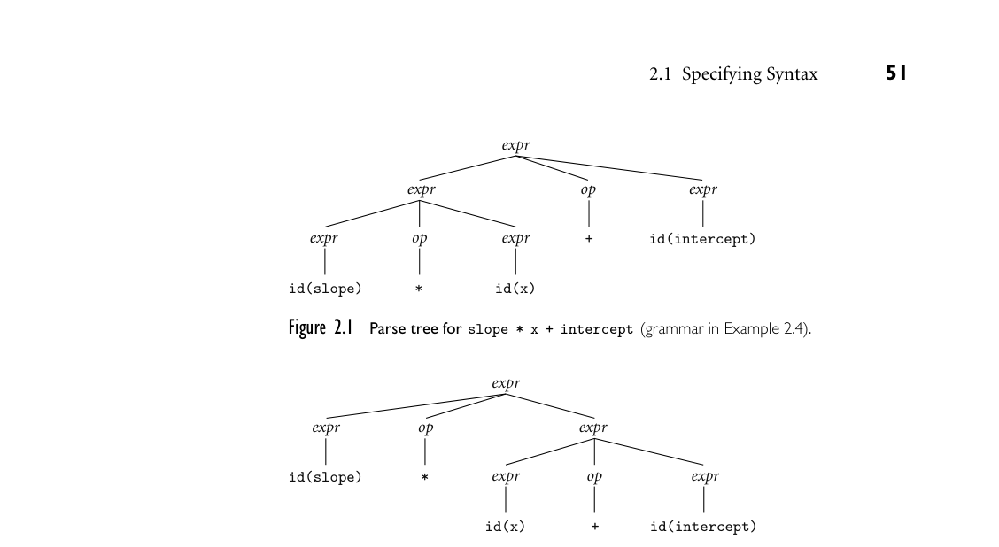
*Figure 2.2  Alternative (less desirable) parse tree for slope * x + intercept (grammar in  Example 2.4). The fact that more than one tree exists implies that our grammar is ambiguous.*

The =⇒ metasymbol is often pronounced “derives.” It indicates that the right- hand side was obtained by using a production to replace some nonterminal in the  left-hand side. At each line we have underlined the symbol A that is replaced in  the following line.  ■  A series of replacement operations that shows how to derive a string of termi­ nals from the start symbol is called a derivation. Each string of symbols along the  way is called a sentential form. The fnal sentential form, consisting of only ter­ minals, is called the yield of the derivation. We sometimes elide the intermediate  steps and write expr =⇒∗ slope * x + intercept, where  the  metasymbol  =⇒∗  means “derives after zero or more replacements.” In this particular derivation, we  have chosen at each step to replace the right-most nonterminal with the right- hand side of some production. This replacement strategy leads to a right-most  derivation. There are many other possible derivations, including left-most and  options in-between.

We saw in Chapter 1 that we can represent a derivation graphically as a parse  tree. The root of the parse tree is the start symbol of the grammar. The leaves of  the tree are its yield. Each internal node, together with its children, represents the  use of a production.

EXAMPLE 2.7

A parse tree for our example expression appears in Figure 2.1. This tree is  not unique. At the second level of the tree, we could have chosen to turn the  operator into a * instead of a +, and to further expand the expression on the  right, rather than the one on the left (see Figure 2.2). A grammar that allows the

Parse trees for slope * x  + intercept

construction of more than one parse tree for some string of terminals is said to be  ambiguous. Ambiguity turns out to be a problem when trying to build a parser:  it requires some extra mechanism to drive a choice between equally acceptable  alternatives.  ■  A moment’s refection will reveal that there are infnitely many context-free  grammars for any given context-free language.9 Some grammars, however, are  much more useful than others. In this text we will avoid the use of ambiguous  grammars (though most parser generators allow them, by means of disambiguat­ ing rules). We will also avoid the use of so-called useless symbols: nonterminals  that cannot generate any string of terminals, or terminals that cannot appear in  the yield of any derivation.

When designing the grammar for a programming language, we generally try  to fnd one that refects the internal structure of programs in a way that is useful  to the rest of the compiler. (We shall see in Section 2.3.2 that we also try to fnd  one that can be parsed effciently, which can be a bit of a challenge.) One place  in which structure is particularly important is in arithmetic expressions, where  we can use productions to capture the associativity and precedence of the various  operators. Associativity tells us that the operators in most languages group left  to right, so that 10  - 4 - 3 means (10 - 4) - 3 rather than 10 - (4 - 3).  Precedence tells us that multiplication and division in most languages group more  tightly than addition and subtraction, so that 3 + 4 * 5 means 3 + (4 * 5) rather  than (3 + 4) * 5. (These rules are not universal; we will consider them again in  Section 6.1.1.)

EXAMPLE 2.8  Here is a better version of our expression grammar:  Expression grammar with  1.  term | expr add op term  precedence and  expr −→  associativity  2.  term −→ factor | term mult op factor

  3.
  factor −→ id | number | - factor | ( expr )

  4.
  add op −→ + | ­

  5.
  mult op −→ * | /

This grammar is unambiguous. It captures precedence in the way factor, term,  and expr build on one another, with different operators appearing at each level.  It captures associativity in the second halves of lines 1 and 2, which build subexprs  and subterms to the left of the operator, rather than to the right. In Figure 2.3, we  can see how building the notion of precedence into the grammar makes it clear  that multiplication groups more tightly than addition in 3 + 4 * 5, even without  parentheses. In Figure 2.4, we can see that subtraction groups more tightly to the  left, so that 10 - 4 - 3 would evaluate to 3, rather than to 9.  ■

9  Given a specifc grammar, there are many ways to create other equivalent grammars. We could,  for example, replace A with some new symbol B everywhere it appears in the right-hand side of  a production, and then create a new production B −→ A.

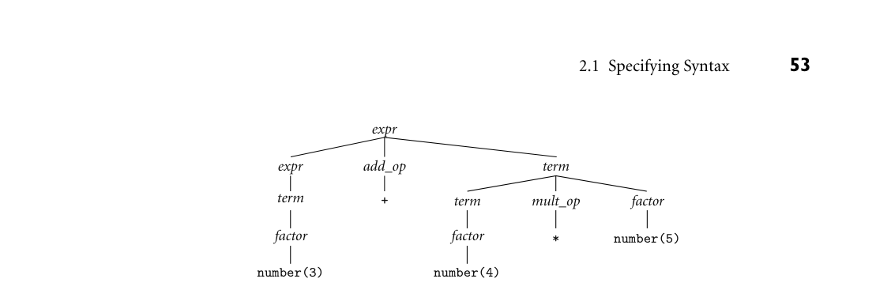
*Figure 2.3  Parse tree for 3 + 4 * 5, with precedence (grammar in Example 2.8).*

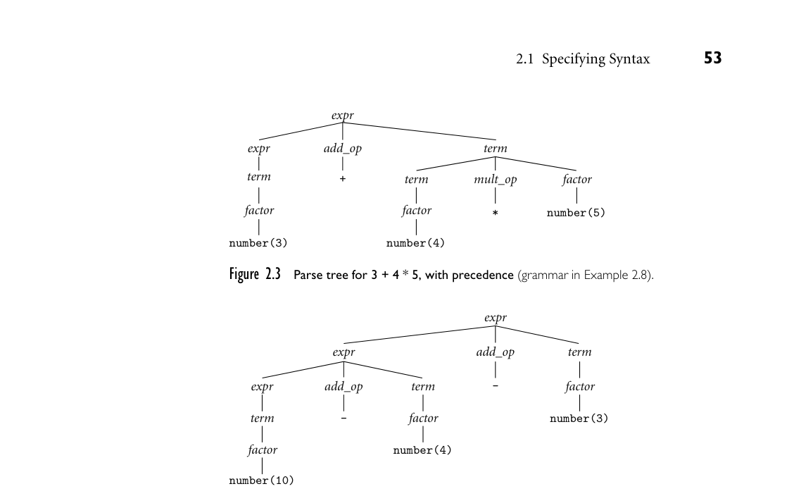
*Figure 2.4  Parse tree for 10 – 4 – 3, with left associativity (grammar in Example 2.8).*

3CHECK YOUR UNDERSTANDING 1.  What is the difference between syntax and semantics?  2.  What are the three basic operations that can be used to build complex regular  expressions from simpler regular expressions?  3.  What additional operation (beyond the three of regular expressions) is pro­ vided in context-free grammars?  4. What  is  Backus-Naur form? When and why was it devised?

  5.
  Name a language in which indentation affects program syntax.
  6.
  When discussing context-free languages, what is a derivation? What  is  a  sen­
  tential form?
  7.
  What is the difference between a right-most derivation and a left-most deriva­
  tion?

  8.
  What does it mean for a context-free grammar to be ambiguous?
  9.
  What
  are
  associativity and precedence? Why are they signifcant in parse trees?

## 2.2  Scanning

Together, the scanner and parser for a programming language are responsible for  discovering the syntactic structure of a program. This process of discovery, or  syntax analysis, is a necessary frst step toward translating the program into an  equivalent program in the target language. (It’s also the frst step toward inter­ preting the program directly. In general, we will focus on compilation, rather  than interpretation, for the remainder of the book. Most of what we shall dis­ cuss either has an obvious application to interpretation, or is obviously irrelevant  to it.)

By grouping input characters into tokens, the scanner dramatically reduces the  number of individual items that must be inspected by the more computationally  intensive parser. In addition, the scanner typically removes comments (so the  parser doesn’t have to worry about them appearing throughout the context-free  grammar—see Exercise 2.20); saves the text of “interesting” tokens like identifers,  strings, and numeric literals; and tags tokens with line and column numbers, to  make it easier to generate high-quality error messages in subsequent phases.

EXAMPLE 2.9  In Examples 2.4 and 2.8 we considered a simple language for arithmetic expres- Tokens for a calculator  sions. In Section 2.3.1 we will extend this to create a simple “calculator language”  language  with input, output, variables, and assignment. For this language we will use the  following set of tokens:

assign −→ :=

plus −→ +

minus −→ ­

times −→ *

div −→ /

lparen −→ (

rparen −→ )

id −→ letter ( letter | digit )*

except for read and write

number −→ digit digit * |  digit * (  . digit | digit . ) digit *

In keeping with Algol and its descendants (and in contrast to the C-family lan­ guages), we have used := rather than = for assignment. For simplicity, we have  omitted the exponential notation found in Example 2.3. We have also listed the  tokens read and write as exceptions to the rule for id (more on this in Sec­ tion 2.2.2). To make the task of the scanner a little more realistic, we borrow the  two styles of comment from C:

comment −→ /* ( non-* | * non-/ )* *+ /  | // ( non-newline )* newline

Here we have used non-*, non-/, and  non-newline as shorthand for the alterna­ tion of all characters other than *, /, and  newline, respectively.  ■

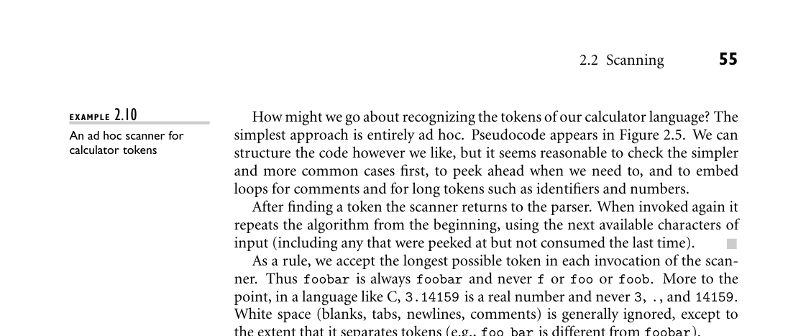
*Figure 2.5 could be extended fairly easily to outline a scanner for some larger  programming language. The result could then be feshed out, by hand, to create  code in some implementation language. Production compilers often use such  ad hoc scanners; the code is fast and compact. During language development,  however, it is usually preferable to build a scanner in a more structured way, as  an explicit representation of a finite automaton. Finite automata can be generated  automatically from a set of regular expressions, making it easy to regenerate a  scanner when token defnitions change.*

EXAMPLE 2.11

An automaton for the tokens of our calculator language appears in pictorial  form in Figure 2.6. The automaton starts in a distinguished initial state. It then  moves from state to state based on the next available character of input. When  it reaches one of a designated set of fnal states it recognizes the token associated  with that state. The “longest possible token” rule means that the scanner returns  to the parser only when the next character cannot be used to continue the current  token.  ■

Finite automaton for a  calculator scanner

DESIGN & IMPLEMENTATION

2.3 Nested comments  Nested comments can be handy for the programmer (e.g., for temporarily  “commenting out” large blocks of code). Scanners normally deal only with  nonrecursive constructs, however, so nested comments require special treat­ ment. Some languages disallow them. Others require the language implemen­ tor to augment the scanner with special-purpose comment-handling code. C  and C++ strike a compromise: /* ... */ style comments are not allowed to  nest, but /* ... */ and //... style comments can appear inside each other.  The programmer can thus use one style for “normal” comments and the other  for “commenting out.” (The C99 designers note, however, that conditional  compilation (#if) is preferable [Int03a, p. 58].)

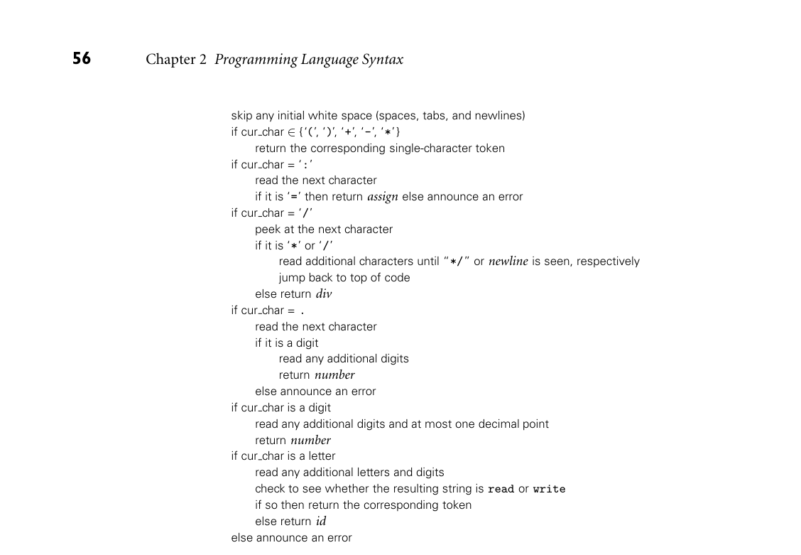
*Figure 2.5  Outline of an ad hoc scanner for tokens in our calculator language.*

2.2.1 Generating a Finite Automaton

While a fnite automaton can in principle be written by hand, it is more com­ mon to build one automatically from a set of regular expressions, using a scanner  generator tool. For our calculator language, we should like to covert the regular  expressions of Example 2.9 into the automaton of Figure 2.6. That automaton has  the desirable property that its actions are deterministic: in any given state with a  given input character there is never more than one possible outgoing transition  (arrow) labeled by that character. As it turns out, however, there is no obvious  one-step algorithm to convert a set of regular expressions into an equivalent de­ terministic fnite automaton (DFA). The typical scanner generator implements  the conversion as a series of three separate steps.

The frst step converts the regular expressions into a nondeterministic fnite  automaton (NFA). An NFA is like a DFA except that (1) there may be more than  one transition out of a given state labeled by a given character, and (2) there may  be so-called epsilon transitions: arrows labeled by the empty string symbol, . The   NFA is said to accept an input string (token) if there exists a path from the start

ϵ

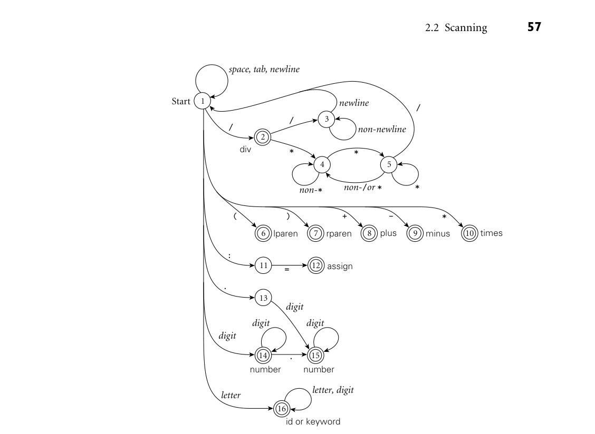
*Figure 2.6  Pictorial representation of a scanner for calculator tokens, in the form of a  finite automaton. This fgure roughly parallels the code in Figure 2.5. States are numbered  for reference in Figure 2.12. Scanning for each token begins in the state marked “Start.” The  final states, in which a token is recognized, are indicated by double circles. Comments, when  recognized, send the scanner back to its start state, rather than a fnal state.*

state to a fnal state whose non-epsilon transitions are labeled, in order, by the  characters of the token.

To avoid the need to search all possible paths for one that “works,” the second  step of a scanner generator translates the NFA into an equivalentDFA: an automa­ ton that accepts the same language, but in which there are no epsilon transitions,  and no states with more than one outgoing transition labeled by the same char­ acter. The third step is a space optimization that generates a fnal DFA with the  minimum possible number of states.

*Figure 2.7  Construction of an NFA equivalent to a given regular expression. Part (a) shows  the base case: the automaton for the single letter c. Parts (b), (c), and (d), respectively, show  the constructions for concatenation, alternation, and Kleene closure. Each construction retains a  unique start state and a single fnal state. Internal detail is hidden in the diamond-shaped center  regions.*

From a Regular Expression to an NFA

EXAMPLE 2.12  A trivial regular expression consisting of a single character c is equivalent to a  Constructing an NFA for a  simple two-state NFA (in fact, a DFA), illustrated in part (a) of Figure 2.7. Simi­ given regular expression  larly, the regular expression is equivalent to a two-state NFA whose arc is labeled  by . Starting with this base we can use three subconstructions, illustrated in parts  (b) through (d) of the same fgure, to build larger NFAs to represent the concate­ nation, alternation, or Kleene closure of the regular expressions represented by  smaller NFAs. Each step preserves three invariants: there are no transitions into  the initial state, there is a single fnal state, and there are no transitions out of  the fnal state. These invariants allow smaller automata to be joined into larger

ϵ ϵ

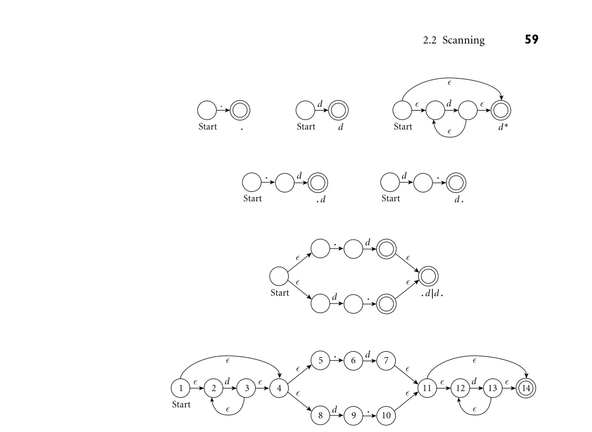
*Figure 2.8  Construction of an NFA equivalent to the regular expression d *( .d | d. ) d *.  In the top row are the primitive automata for . and d, and the Kleene closure construction for  d *. In the second and third rows we have used the concatenation and alternation constructions  to build .d, d., and  ( .d | d. ) . The fourth row uses concatenation again to complete the  NFA. We have labeled the states in the fnal automaton for reference in subsequent fgures.*

ones without any ambiguity about where to create the connections, and without  creating any unexpected paths.  ■  To make these constructions concrete, we consider a small but nontrivial  example—the decimal strings of Example 2.3. These consist of a string of decimal  digits containing a single decimal point. With only one digit, the point can come  at the beginning or the end: ( .d | d. ), where for brevity we use d to represent  any decimal digit. Arbitrary numbers of digits can then be added at the beginning  or the end: d *( .d | d. ) d *. Starting with this regular expression and using the  constructions of Figure 2.7, we illustrate the construction of an equivalent NFA  in Figure 2.8.  ■

EXAMPLE 2.13

NFA for d*( .d | d. ) d*

From an NFA to a DFA

EXAMPLE 2.14  With no way to “guess” the right transition to take from any given state, any prac- DFA for d*( .d | d. ) d*  tical implementation of an NFA would need to explore all possible transitions,  concurrently or via backtracking. To avoid such a complex and time-consuming  strategy, we can use a “set of subsets” construction to transform the NFA into an  equivalent DFA. The key idea is for the state of the DFA after reading a given  input to represent the set of states that the NFA might have reached on the same  input. We illustrate the construction in Figure 2.9 using the NFA from Figure 2.8.  Initially, before it consumes any input, the NFA may be in State 1, or it may make  epsilon transitions to States 2, 4, 5, or 8. We thus create an initial State A for our  DFA to represent this set. On an input of d, our NFA may move from State 2  to State 3, or from State 8 to State 9. It has no other transitions on this input  from any of the states in A. From State 3, however, the NFA may make epsilon  transitions to any of States 2, 4, 5, or 8. We therefore create DFA State B as shown.  On a ., our NFA may move from State 5 to State 6. There are no other transi­ tions on this input from any of the states in A, and there are no epsilon transitions  out of State 6. We therefore create the singleton DFA State C as shown. None of  States A, B, or  C is marked as fnal, because none contains a fnal state of the  original NFA.  Returning to State B of the growing DFA, we note that on an input of d the  original NFA may move from State 2 to State 3, or from State 8 to State 9. From  State  3, in  turn, it may  move  to  States 2, 4, 5, or 8 via epsilon  transitions.  As  these   are exactly the states already in B,  we create  a  self-loop  in  the DFA.  Given  a  .,  on the other hand, the original NFA may move from State 5 to State 6, or from  State 9 to State 10. From State 10, in turn, it may move to States 11, 12, or 14 via  epsilon transitions. We therefore create DFA State D as shown, with a transition  on . from B to D. State  D is marked as fnal because it contains state 14 of the  original NFA. That is, given input d., there exists a path from the start state to  the end state of the original NFA. Continuing our enumeration of state sets, we  end up creating three more, labeled E, F, and  G in Figure 2.9. Like State D, these   all contain State 14 of the original NFA, and thus are marked as fnal.  ■  In our example, the DFA ends up being smaller than the NFA, but this is only  because our regular language is so simple. In theory, the number of states in the  DFA may be exponential in the number of states in the NFA, but this extreme is  also uncommon in practice. For a programming language scanner, the DFA tends  to be larger than the NFA, but not outlandishly so. We consider space complexity  in more detail in Section C 2.4.1.

Minimizing the DFA

Starting from a regular expression, we have now constructed an equivalent DFA.

EXAMPLE 2.15  Though this DFA has seven states, a bit of thought suggests that a smaller one  Minimal DFA for  should exist. In particular, once we have seen both a d and a ., the only valid  d*( .d | d. ) d*  transitions are on d, and we ought to be able to make do with a single fnal state.

*Figure 2.9  A DFA equivalent to the NFA at the bottom of Figure 2.8. Each state of the DFA  represents the set of states that the NFA could be in after seeing the same input.*

We can formalize this intuition, allowing us to apply it to any DFA, via the fol­ lowing inductive construction.

Initially we place the states of the (not necessarily minimal) DFA into two  equivalence classes: fnal states and nonfnal states. We then repeatedly search for  an equivalence class X and an input symbol c such that when given c as input,  the states in X make transitions to states in k > 1 different equivalence classes.  We then partition X into k classes in such a way that all states in a given new class  would move to a member of the same old class on c. When  we  are  unable  to  fnd   a class to partition in this fashion we are done.

In our example, the original placement puts States D, E, F, and  G in one class  (fnal states) and States A, B, and  C in another, as shown in the upper left of  Figure 2.10. Unfortunately, the start state has ambiguous transitions on both d  and .. To address the d ambiguity, we split ABC into AB and C, as  shown  in  the   upper right. New State AB has a self-loop on d; new  State  C moves to State DEFG.  State AB still has an ambiguity on ., however, which we resolve by splitting it into  States A and B, as shown at the bottom of the fgure. At this point there are no  further ambiguities, and we are left with a four-state minimal DFA.  ■

2.2.2 Scanner Code

We can implement a scanner that explicitly captures the “circles-and-arrows”  structure of a DFA in either of two main ways. One embeds the automaton in  the control fow of the program using gotos or  nested  case (switch) statements;   the other, described in the following subsection, uses a table and a driver. As  a general rule, handwritten automata tend to use nested case statements, while

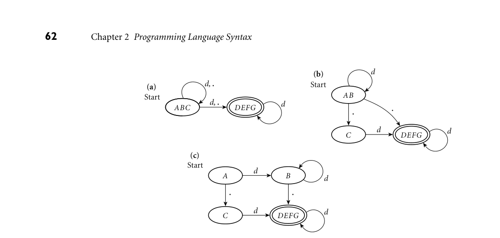
*Figure 2.10  Minimization of the DFA of Figure 2.9. In each step we split a set of states to  eliminate a transition ambiguity.*

most automatically generated automata use tables. Tables are hard to create by  hand, but easier than code to create from within a program. Likewise, nested  case statements are easier to write and to debug than the ad hoc approach of Fig­ ure 2.5, if not quite as effcient. Unix’s lex/flex tool produces C language output  containing tables and a customized driver.

EXAMPLE 2.16

The nested case statement style of automaton has the following general struc­ ture:

Nested case statement  automaton

state := 1  –– start state  loop

read cur char  case state of

1 : case cur char of  ‘ ’,  ‘\t’, ‘\n’  :  . . .   ‘a’. . . ‘z’  :   . . .   ‘0’. . . ‘9’ :  . . .  ‘>’  :   . . .   . . .   2 : case cur char of

. . .   . . .   n: case cur char of  . . .

The outer case statement covers the states of the fnite automaton. The inner  case statements cover the transitions out of each state. Most of the inner clauses  simply set a new state. Some return from the scanner with the current token. (If

the current character should not be part of that token, it is pushed back onto the  input stream before returning.)  ■  Two aspects of the code typically deviate from the strict form of a formal fnite  automaton. One is the handling of keywords. The other is the need to peek ahead  when a token can validly be extended by two or more additional characters, but  not by only one.

As noted at the beginning of Section 2.1.1, keywords in most languages look  just like identifers, but are reserved for a special purpose (some authors use the  term reserved word instead of keyword). It is possible to write a fnite automaton  that distinguishes between keywords and identifers, but it requires a lot of states  (see Exercise 2.3). Most scanners, both handwritten and automatically generated,  therefore treat keywords as “exceptions” to the rule for identifers. Before return-

DESIGN & IMPLEMENTATION

2.4 Recognizing multiple kinds of token  One of the chief ways in which a scanner differs from a formal DFA is that it  identifies tokens in addition to recognizing them. That is, it not only deter­ mines whether characters constitute a valid token; it also indicates which one.  In practice, this means that it must have separate fnal states for every kind of  token. We glossed over this issue in our RE-to-DFA constructions.

To build a scanner for a language with  n different kinds of tokens, we begin with  an NFA of the sort suggested in the fgure  here.  Given NFAs Mi, 1 ≤ i ≤ n (one au­ tomaton for each kind of token), we cre­ ate a new start state with epsilon transi­ tions to the start states of the Mis. In con­ trast to the alternation construction of Fig­ ure 2.7(c), however, we do not create a single  fnal state; we keep the existing ones, each  labeled by the token for which it is fnal.  We then apply the NFA-to-DFA construction as before. (If fnal states for dif­ ferent tokens in the NFA ever end up in the same state of the DFA, then we  have ambiguous token defnitions. These may be resolved by changing the reg­ ular expressions from which the NFAs were derived, or by wrapping additional  logic around the DFA.)

M1

ϵ

Start

M2

ϵ

Mn  ...

ϵ

In the DFA minimization construction, instead of starting with two equiv­ alence classes (fnal and nonfnal states), we begin with n + 1, including a sep­ arate class for fnal states for each of the kinds of token. Exercise 2.5 explores  this construction for a scanner that recognizes both the integer and decimal  types of Example 2.3.

ing an identifer  to  the parser,  the scanner looks it  up in  a  hash  table or trie (a  tree   of branching paths) to make sure it isn’t really a keyword.10

Whenever one legitimate token is a prefx of another, the “longest possible to­ ken” rule says that we should continue scanning. If some of the intermediate  strings are not valid tokens, however, we can’t tell whether a longer token is pos-

EXAMPLE 2.17  sible without looking more than one character ahead. This problem arises with  The nontrivial prefix  dot characters (periods) in C. Suppose the scanner has just seen a 3 and has a dot  problem  coming up in the input. It needs to peek at characters beyond the dot in order  to distinguish between 3.14 (a single token designating a real number), 3 . foo  (three tokens that the scanner should accept, even though the parser will object  to seeing them in that order), and 3 ... foo (again not syntactically valid, but  three separate tokens nonetheless). In general, upcoming characters that a scan­ ner must examine in order to make a decision are known as its look-ahead. In   Section 2.3 we will see a similar notion of look-ahead tokens in parsing.  ■  In messier languages, a scanner may need to look an arbitrary distance ahead.

EXAMPLE 2.18  In Fortran IV, for example, DO 5 I = 1,25 is the header of a loop (it executes the  Look-ahead in Fortran  statements up to the one labeled 5 for values of I from 1 to 25), while DO 5 I  scanning  = 1.25 is an assignment statement that places the value 1.25 into the variable  DO5I. Spaces are ignored in (pre-Fortran 90) Fortran input, even in the middle  of variable names. Moreover, variables need not be declared, and the terminator  for a DO loop is simply a label, which the parser can ignore. After seeing DO,  the scanner cannot tell whether the 5 is part of the current token until it reaches  the comma or dot. It has been widely (but apparently incorrectly) claimed that  NASA’s Mariner 1 space probe was lost due to accidental replacement of a comma  with a dot in a case similar to this one in fight control software.11 Dialects of  Fortran starting with Fortran 77 allow (in fact encourage) the use of alternative

DESIGN & IMPLEMENTATION

2.5 Longest possible tokens  A little care in syntax design—avoiding tokens that are nontrivial prefxes of  other tokens—can dramatically simplify scanning. In straightforward cases  of prefx ambiguity, the scanner can enforce the “longest possible token” rule  automatically. In Fortran, however, the rules are suffciently complex that no  purely lexical solution suffces. Some of the problems, and a possible solution,  are discussed in an article  by  Dyadkin [Dya95].

10 Many languages include predefined identifers (e.g., for standard library functions), but these are  not keywords. The programmer can redefne them, so the scanner must treat them the same as  other identifers. Contextual keywords, similarly, must be treated by the scanner as identifers.

11 In actuality, the faulty software for Mariner 1 appears to have stemmed from a missing “bar”  punctuation mark (indicating an average) in handwritten notes from which the software was  derived [Cer89, pp. 202–203]. The Fortran DO loop error does appear to have occurred in at least  one piece of NASA software, but no serious harm resulted [Web89].

syntax for loop headers, in which an extra comma makes misinterpretation less  likely: DO 5,I = 1,25.  ■  In C, the dot character problem can easily be handled as a special case. In  languages requiring larger amounts of look-ahead, the scanner can take a more  general approach. In any case of ambiguity, it assumes that a longer token will  be possible, but remembers that a shorter token could have been recognized at  some point in the past. It also buffers all characters read beyond the end of the  shorter token. If the optimistic assumption leads the scanner into an error state, it  “unreads” the buffered characters so that they will be seen again later, and returns  the shorter token.

## 2.2.3 Table-Driven Scanning

In the preceding subsection we sketched how control fow—a loop and nested

EXAMPLE 2.19  case statements—can be used to represent a fnite automaton. An alternative ap­ Table-driven scanning  proach represents the automaton as a data structure: a two-dimensional transition  table. A driver program (Figure 2.11) uses the current state and input character  to index into the table. Each entry in the table specifes whether to move to a new  state (and if so, which one), return a token, or announce an error. A second table  indicates, for each state, whether we might be at the end of a token (and if so,  which one). Separating this second table from the frst allows us to notice when  we pass a state that might have been the end of a token, so we can back up if we  hit an error state. Example tables for our calculator tokens appear in Figure 2.12.  Like a handwritten scanner, the table-driven code of Figure 2.11 looks tokens  up in a table of keywords immediately before returning. An outer loop serves to  flter out comments and “white space”—spaces, tabs, and newlines.  ■

2.2.4 Lexical Errors

The code in Figure 2.11 explicitly recognizes the possibility of lexical errors. In   some cases the next character of input may be neither an acceptable continuation  of the current token nor the start of another token. In such cases the scanner must  print an error message and perform some sort of recovery so that compilation can  continue, if only to look for additional errors. Fortunately, lexical errors are rel­ atively rare—most character sequences do correspond to token sequences—and  relatively easy to handle. The most common approach is simply to (1) throw away  the current, invalid token; (2) skip forward until a character is found that can le­ gitimately begin a new token; (3) restart the scanning algorithm; and (4) count  on the error-recovery mechanism of the parser to cope with any cases in which  the resulting sequence of tokens is not syntactically valid. Of course the need for  error recovery is not unique to table-driven scanners; any scanner must cope with  errors. We did not show the code in Figure 2.5, but it would have to be there in  practice.

state = 0 . . number of states  token = 0 . . number of tokens  scan tab : array [char, state] of record

action : (move, recognize, error)  new state : state  token tab : array [state] of token  –– what to recognize  keyword tab : set of record

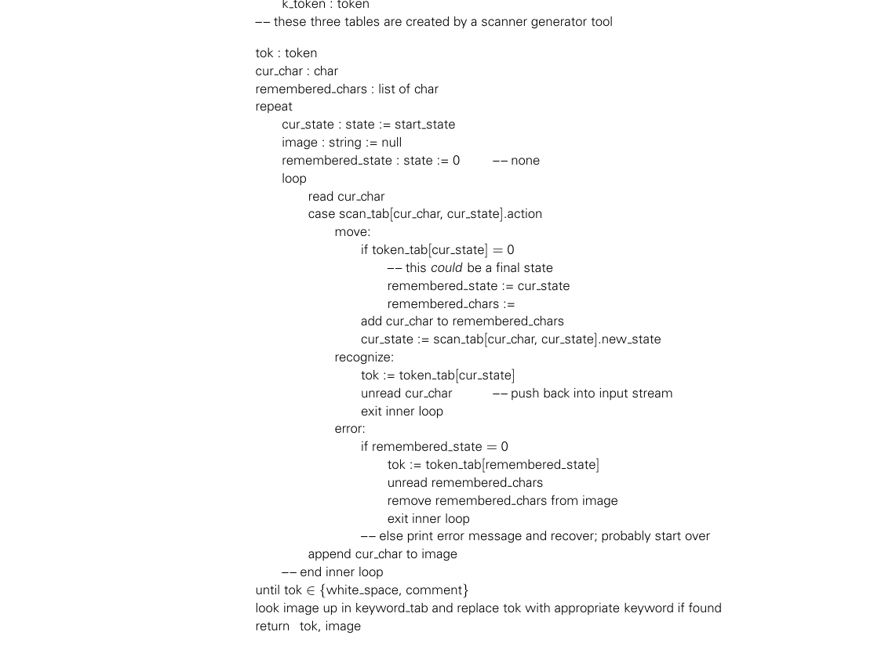
*Figure 2.11  Driver for a table-driven scanner, with code to handle the ambiguous case in  which one valid token is a prefx of another, but some intermediate string is not.*

*Figure 2.12  Scanner tables for the calculator language. These could  be  used  by  the code  of  Figure 2.11.  States  are  numbered   as in Figure 2.6, except for the addition of two states—17 and 18—to “recognize” white space and comments. The right-hand  column represents table token tab; the rest of the fgure is scan tab. Numbers in the table indicate an entry for which the  corresponding action is move. Dashes appear where there is no way to extend the current token: if the corresponding entry  in token tab is nonempty, then action is recognize; otherwise,  action is error. Table  keyword tab (not shown) contains the  strings read and write.*

The code in Figure 2.11 also shows that the scanner must return both the kind  of token found and its character-string image (spelling); again this requirement  applies to all types of scanners. For some tokens the character-string image is  redundant: all semicolons look the same, after all, as do all while keywords. For  other tokens, however (e.g., identifers, character strings, and numeric constants),  the image is needed for semantic analysis. It is also useful for error messages:  “undeclared identifer” is not as nice as “foo has not been declared.”

2.2.5 Pragmas

Some languages and language implementations allow a program to contain con­ structs called pragmas that provide directives or hints to the compiler. Prag­ mas that do not change program semantics—only the compilation process—are  sometimes called significant comments. In some languages the name is also ap­ propriate because, like comments, pragmas can appear anywhere in the source  program. In this case they are usually processed by the scanner: allowing them  anywhere in the grammar would greatly complicate the parser. In most languages,

however, pragmas are permitted only at certain well-defned places in the gram­ mar. In this case they are best processed by the parser or semantic analyzer.  Pragmas that serve as directives may

Turn various kinds of run-time checks (e.g., pointer or subscript checking) on  or off  Turn certain code improvements on or off (e.g., on in inner loops to improve  performance; off otherwise to improve compilation speed)  Enable or disable performance profling (statistics gathering to identify pro­ gram bottlenecks)

Some directives “cross the line” and change program semantics. In Ada, for ex­ ample, the unchecked pragma can be used to disable type checking. In OpenMP,  which we will consider in Chapter 13, pragmas specify signifcant parallel exten­ sions to Fortran, C and C++: creating, scheduling, and synchronizing threads. In  this case the principal rationale for expressing the extensions as pragmas rather  than more deeply integrated changes is to sharply delineate the boundary between  the core language and the extensions, and to share a common set of extensions  across languages.

Pragmas that serve (merely) as hints provide the compiler with information  about the source program that may allow it to do a better job:

Variable x is very heavily used (it may be a good idea to keep it in a register).  Subroutine F is a pure function: its only effect on the rest of the program is the  value it returns.  Subroutine S is not (indirectly) recursive (its storage may be statically allo­ cated).  32 bits of precision (instead of 64) suffce for foating-point variable x.

The compiler may ignore these in the interest of simplicity, or in the face of con­ tradictory information.

Standard syntax for pragmas was introduced in C++11 (where they are known  as “attributes”). A function that prints an error message and terminates execu­ tion, for example, can be labeled [[noreturn]], to allow the compiler to opti­ mize code around calls, or to issue more helpful error or warning messages. As  of this writing, the set of supported attributes can be extended by vendors (by  modifying the compiler), but not by ordinary programmers. The extent to which  these attributes should be limited to hints (rather than directives) has been some­ what controversial. New pragmas in Java (which calls them “annotations”) and  C# (which calls them “attributes”) can be defned by the programmer; we will  return to these in Section 16.3.1.

3CHECK YOUR UNDERSTANDING  10. List the tasks performed by the typical scanner.  11. What are the advantages of an automatically generated scanner, in compari­

son to a handwritten one? Why do many commercial compilers use a hand­ written scanner anyway?

* Explain the difference between deterministic and nondeterministic fnite au­

tomata. Why do we prefer the deterministic variety for scanning?

* Outline the constructions used to turn a set of regular expressions into a min­

imal DFA.  14. What is the “longest possible token” rule?  15. Why must a scanner sometimes “peek” at upcoming characters?

* What is the difference between a keyword and an identifier?
* Why must a scanner save the text of tokens?

* How does a scanner identify lexical errors? How does it respond?
* What  is  a  pragma?

## 2.3  Parsing

The parser is the heart of a typical compiler. It calls the scanner to obtain the  tokens of the input program, assembles the tokens together into a syntax tree,  and passes the tree (perhaps one subroutine at a time) to the later phases of the  compiler, which perform semantic analysis and code generation and improve­ ment. In effect, the parser is “in charge” of the entire compilation process; this  style of compilation is sometimes referred to as syntax-directed translation.

As noted in the introduction to this chapter, a context-free grammar (CFG) is  a generator for a CF language. A parser is a language recognizer. It  can  be  shown   that for any CFG we can create a parser that runs in O(n3) time, where n is the  length of the input program.12 There are two well-known parsing algorithms that  achieve this bound: Earley’s algorithm [Ear70] and the Cocke-Younger-Kasami  (CYK) algorithm [Kas65, You67]. Cubic time is much too slow for parsing siz­ able programs, but fortunately not all grammars require such a general and slow  parsing algorithm. There are large classes of grammars for which we can build  parsers that run in linear time. The two most important of these classes are called  LL and LR (Figure 2.13).

12 In general, an algorithm is said to run in time O(f (n)), where  n is the length of the input, if  its running time t(n) is proportional to f (n) in the worst case. More precisely, we say t(n) =   O(f (n)) ⇐⇒ ∃ c, m [n > m −→ t(n) < c f  (n)].

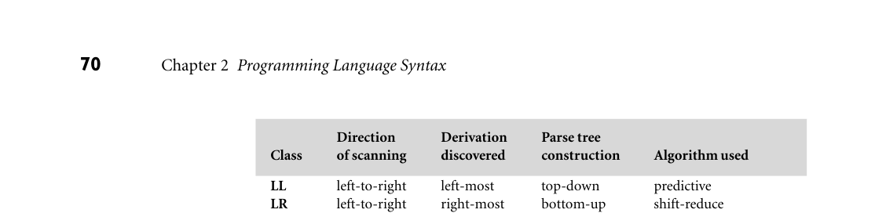
*Figure 2.13  Principal classes of linear-time parsing algorithms.*

LL stands for “Left-to-right, Left-most derivation.” LR stands for “Left-to­ right, Right-most derivation.” In both classes the input is read left-to-right, and  the parser attempts to discover (construct) a derivation of that input. For LL  parsers, the derivation will be left-most; for LR parsers, right-most. We will cover  LL parsers frst. They are generally considered to be simpler and easier to under­ stand. They can be written by hand or generated automatically from an appropri­ ate grammar by a parser-generating tool. The class of LR grammars is larger (i.e.,  more grammars are LR than LL), and some people fnd the structure of the LR  grammars more intuitive, especially in the handling of arithmetic expressions. LR  parsers are almost always constructed by a parser-generating tool. Both classes of  parsers are used in production compilers, though LR parsers are more common.

LL parsers are also called “top-down,” or “predictive” parsers. They construct  a parse tree from the root down, predicting at each step which production will be  used to expand the current node, based on the next available token of input. LR  parsers are also called “bottom-up” parsers. They construct a parse tree from the  leaves up, recognizing when a collection of leaves or other nodes can be joined  together as the children of a single parent.

EXAMPLE 2.20  We can illustrate the difference between top-down and bottom-up parsing  Top-down and bottom-up  by means of a simple example. Consider the following grammar for a comma- parsing  separated list of identifers, terminated by a semicolon:

id list −→ id id list tail

id list tail −→ , id  id list tail

id list tail −→ ;

These are the productions that would normally be used for an identifer list in a  top-down parser. They can also be parsed bottom-up (most top-down grammars  can be). In practice they would not be used in a bottom-up parser, for reasons  that will become clear in a moment, but the ability to handle them either way  makes them good for this example.

Progressive stages in the top-down and bottom-up construction of a parse tree  for the string A, B, C; appear in Figure 2.14. The top-down parser begins by  predicting that the root of the tree (id list) will expand  to  id id list tail. It  then   matches the id against a token obtained from the scanner. (If the scanner pro­ duced something different, the parser would announce a syntax error.) The parser  then moves down into the frst (in this case only) nonterminal child and predicts  that id list tail will expand to , id  id list tail. To make this prediction it needs

id_list

id(A)

id(A) ,

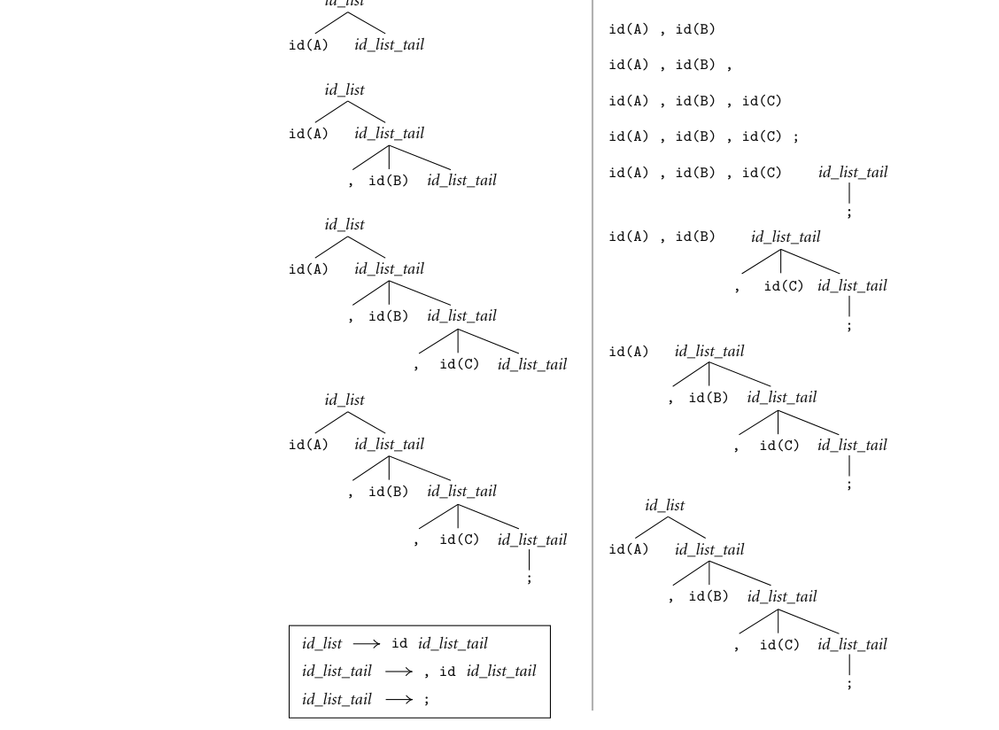
*Figure 2.14  Top-down (left) and bottom-up parsing (right) of the input string A, B, C;.  Grammar appears at lower left.*

to peek at the upcoming token (a comma), which allows it to choose between the  two possible expansions for id list tail. It then matches the comma and the id  and moves down into the next id list tail. In a similar, recursive fashion, the top- down parser works down the tree, left-to-right, predicting and expanding nodes  and tracing out a left-most derivation of the fringe of the tree.

The bottom-up parser, by contrast, begins by noting that the left-most leaf of  the tree is an id. The next leaf is a comma and the one after that is another id.  The parser continues in this fashion, shifting new leaves from the scanner into  a forest of partially completed parse tree fragments, until it realizes that some  of those fragments constitute a complete right-hand side. In this grammar, that  doesn’t occur until the parser has seen the semicolon—the right-hand side of  id list tail −→ ;. With this right-hand side in hand, the parser reduces the semi­ colon to an id list tail. It then reduces , id  id list tail into another id list tail.  After  doing  this  one more time it  is  able to  reduce  id id list tail into the root of  the parse tree, id list.

At no point does the bottom-up parser predict what it will see next. Rather,  it shifts tokens into its forest until it recognizes a right-hand side, which it then  reduces to a left-hand side. Because of this behavior, bottom-up parsers are some­ times called shift-reduce parsers. Moving up the fgure, from bottom to top, we  can see that the shift-reduce parser traces out a right-most derivation, in reverse.  Because bottom-up parsers were the frst to receive careful formal study, right­ most derivations are sometimes called canonical.  ■  There are several important subclasses of LR parsers, including SLR, LALR,  and “full LR.” SLR and LALR are important for their ease of implementation,  full LR for its generality. LL parsers can also be grouped into SLL and “full LL”  subclasses. We will cover the differences among them only briefy here; for fur­ ther information see any of the standard compiler-construction or parsing theory  textbooks [App97, ALSU07, AU72, CT04, FCL10, GBJ+12].

One commonly sees LL or LR (or whatever) written with a number in paren­ theses after it: LL(2) or LALR(1), for example. This number indicates how many  tokens of look-ahead are required in order to parse. Most real compilers use just  one token of look-ahead, though more can sometimes be helpful. The open- source ANTLR tool, in particular, uses multitoken look-ahead to enlarge the class  of languages amenable to top-down parsing [PQ95]. In Section 2.3.1 we will  look at LL(1) grammars and handwritten parsers in more detail. In Sections

2.3.3 and 2.3.4 we will consider automatically generated LL(1) and LR(1) (ac­ tually SLR(1)) parsers.

EXAMPLE 2.21  The problem with our example grammar, for the purposes of bottom-up pars- Bounding space with a  ing, is that it forces the compiler to shift all the tokens of an id list into its forest  bottom-up grammar  before it can reduce any of them. In a very large program we might run out of  space. Sometimes there is nothing that can be done to avoid a lot of shifting. In  this case, however, we can use an alternative grammar that allows the parser to  reduce prefxes of the id list into nonterminals as it goes along:

id list −→ id list prefix ;

id list prefix −→ id list prefix , id

−→ id

This grammar cannot be parsed top-down, because when we see an id on the  input and we’re expecting an id list prefix, we have no way to tell which of the two

*Figure 2.15  Bottom-up parse of A, B, C; using a grammar (lower left) that allows lists to be  collapsed incrementally.*

possible productions we should predict (more on this dilemma in Section 2.3.2).  As shown in Figure 2.15, however, the grammar works well bottom-up.  ■

2.3.1 Recursive Descent

EXAMPLE 2.22

To illustrate top-down (predictive) parsing, let us consider the grammar for a sim­ ple “calculator” language, shown in Figure 2.16. The calculator allows values to  be read into named variables, which may then be used in expressions. Expressions  in turn may be written to the output. Control fow is strictly linear (no loops, if  statements, or other jumps). In a pattern that will repeat in many of our examples,  we have included an initial augmenting production, program −→ stmt list $$,

Top-down grammar for a  calculator language

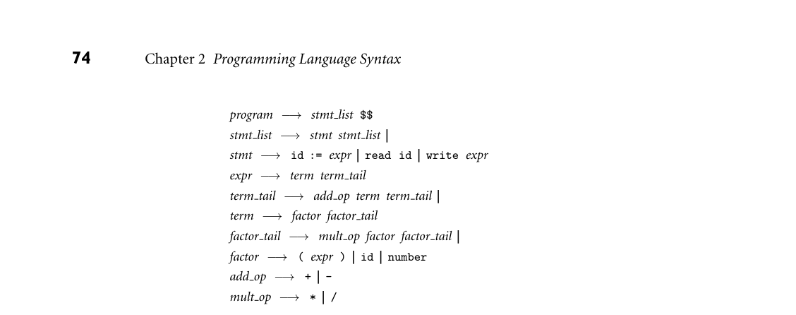
*Figure 2.16  LL(1) grammar for a simple calculator language.*

which arranges for the “real” body of the program (stmt list) to be followed by a  special end marker token, $$. The end marker is produced by the scanner at the  end of the input. Its presence allows the parser to terminate cleanly once it has  seen the entire program, and to decline to accept programs with extra garbage  tokens at the end. As in regular expressions, we use the symbol  to denote the  empty string. A production with  on the right-hand side is sometimes called an  epsilon production.

ϵ ϵ

It may be helpful to compare the expr portion of Figure 2.16 to the expression  grammar of Example 2.8. Most people fnd that previous, LR grammar to be  signifcantly more intuitive. It suffers, however, from a problem similar to that of  the id list grammar of Example 2.21: if we see an id on the input when expecting  an expr, we have no way to tell which of the two possible productions to predict.  The grammar of Figure 2.16 avoids this problem by merging the common prefxes  of right-hand sides into a single production, and by using new symbols (term tail  and factor tail) to generate additional operators and operands as required. The  transformation has the unfortunate side effect of placing the operands of a given  operator in separate right-hand sides. In effect, we have sacrifced grammatical  elegance in order to be able to parse predictively.  ■  So how do we parse a string with our calculator grammar? We saw the basic  idea in Figure 2.14. We start at the top of the tree and predict needed productions  on the basis of the current left-most nonterminal in the tree and the current in­ put token. We can formalize this process in one of two ways. The frst, described  in the remainder of this subsection, is to build a recursive descent parser whose  subroutines correspond, one-one, to the nonterminals of the grammar. Recur­ sive descent parsers are typically constructed by hand, though the ANTLR parser  generator constructs them automatically from an input grammar. The second  approach, described in Section 2.3.3, is to build an LL parse table which is then  read by a driver program. Table-driven parsers are almost always constructed  automatically by a parser generator. These two options—recursive descent and  table-driven—are reminiscent of the nested case statements and table-driven ap­

proaches to building a scanner that we saw in Sections 2.2.2 and 2.2.3. It should  be emphasized that they implement the same basic parsing algorithm.

Handwritten recursive descent parsers are most often used when the language  to be parsed is relatively simple, or when a parser-generator tool is not available.  There are exceptions, however. In particular, recursive descent appears in recent  versions of the GNU compiler collection (gcc). Earlier versions used bison to  create a bottom-up parser automatically. The change was made in part for perfor­ mance reasons and in part to enable the generation of higher-quality syntax error  messages. (The bison code was easier to write, and arguably easier to maintain.)

EXAMPLE 2.23

Pseudocode for a recursive descent parser for our calculator language appears  in Figure 2.17. It has a subroutine for every nonterminal in the grammar. It also  has a mechanism input token to inspect the next token available from the scanner  and a subroutine (match) to consume and update this token, and in the process  verify that it is the one that was expected (as specifed by an argument). If match  or any of the other subroutines sees an unexpected token, then a syntax error has  occurred. For the time being let us assume that the parse error subroutine simply  prints a message and terminates the parse. In Section 2.3.5 we will consider how  to recover from such errors and continue to parse the remainder of the input. ■

Recursive descent parser  for the calculator language

EXAMPLE 2.24

Suppose now that we are to parse a simple program to read two numbers and  print their sum and average:

Recursive descent parse of  a “sum and average”  program

read A  read B  sum := A  + B   write sum  write sum / 2

The parse tree for this program appears in Figure 2.18. The parser begins by  calling the subroutine program. After noting that the initial token is a read,  program calls stmt list and then attempts to match the end-of-fle pseudoto­ ken. (In the parse tree, the root, program, has  two  children,  stmt list and $$.)  Procedure stmt list again notes that the upcoming token is a read. This  ob­ servation allows it to determine that the current node (stmt list) generates stmt  stmt list (rather than ). It therefore calls stmt and stmt list before returning.  Continuing in this fashion, the execution path of the parser traces out a left-to­ right depth-frst traversal of the parse tree. This correspondence between the dy­ namic execution trace and the structure of the parse tree is the distinguishing  characteristic of recursive descent parsing. Note that because the stmt list non­ terminal appears in the right-hand side of a stmt list production, the stmt list  subroutine must call itself. This recursion accounts for the name of the parsing  technique.  ■  Without additional code (not shown in Figure 2.17), the parser merely ver­ ifes that the program is syntactically correct (i.e., that none of the otherwise  parse error clauses in the case statements are executed and that match always  sees what it expects to see). To be of use to the rest of the compiler—which must  produce an equivalent target program in some other language—the parser must

ϵ

procedure match(expected)  if input token = expected then consume input token()  else parse error

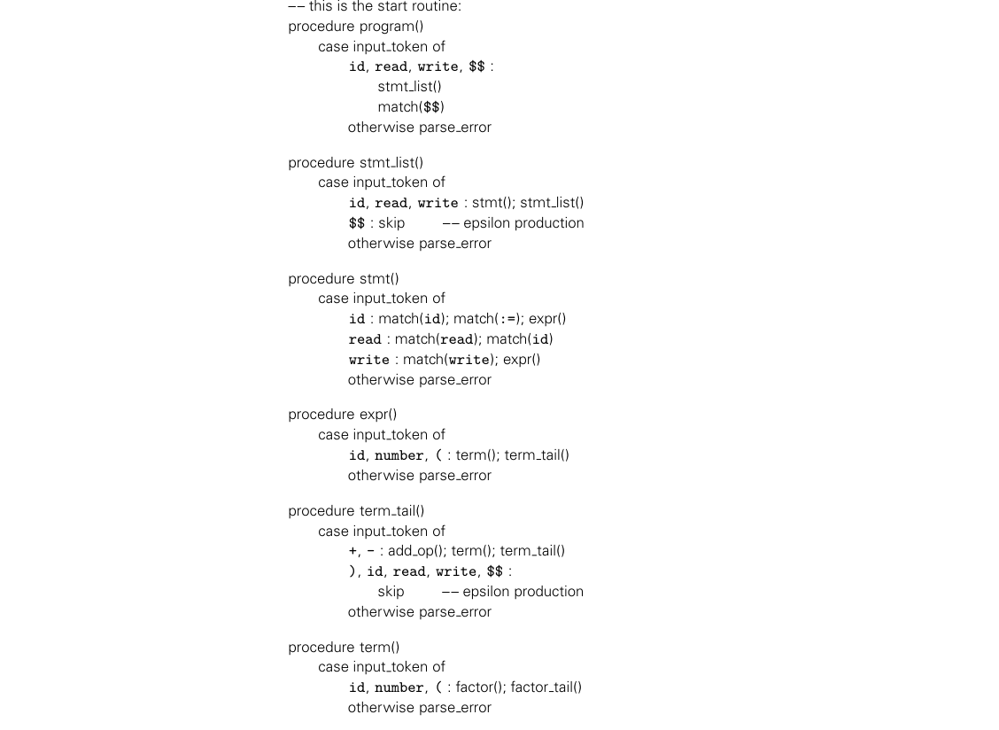
*Figure 2.17  Recursive descent parser for the calculator language. Execution begins in proce­ dure program. The recursive calls trace out a traversal of the parse tree. Not shown is code to  save this tree (or some similar structure) for use by later phases of the compiler. (continued)*

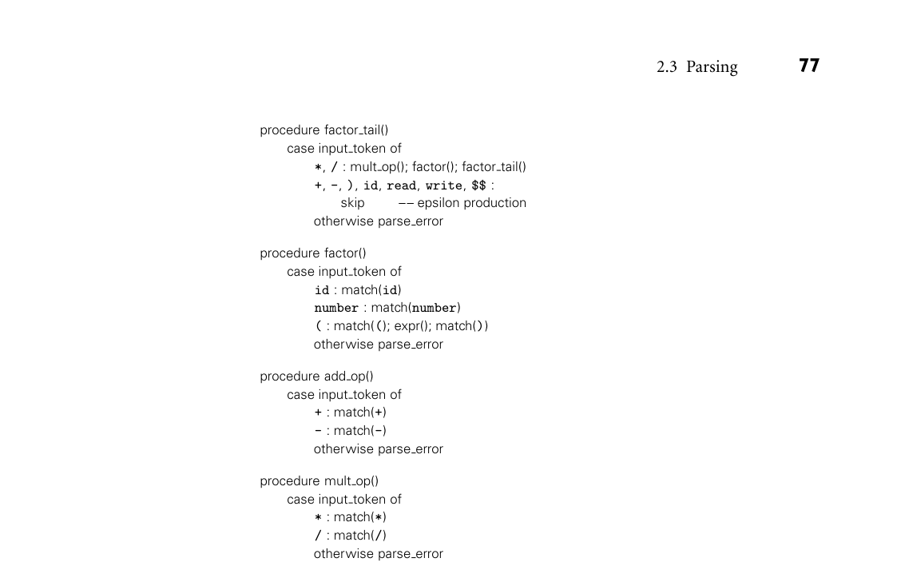
*Figure 2.17  (continued)*

save the parse tree or some other representation of program fragments as an ex­ plicit data structure. To save the parse tree itself, we can allocate and link together  records to represent the children of a node immediately before executing the re­ cursive subroutines and match invocations that represent those children. We shall  need to pass each recursive routine an argument that points to the record that is  to be expanded (i.e., whose children are to be discovered). Procedure match will  also need to save information about certain tokens (e.g., character-string repre­ sentations of identifers and literals) in the leaves of the tree.

As we saw in Chapter 1, the parse tree contains a great deal of irrelevant detail  that need not be saved for the rest of the compiler. It is therefore rare for a parser  to construct a full parse tree explicitly. More often it produces an abstract syntax  tree or some other more terse representation. In a recursive descent compiler,  a syntax tree can be created by allocating and linking together records in only a  subset of the recursive calls.

The trickiest part of writing a recursive descent parser is fguring out which  tokens should label the arms of the case statements. Each arm represents one  production: one possible expansion of the symbol for which the subroutine was  named. The tokens that label a given arm are those that predict the production.  A token  X may predict a production for either of two reasons: (1) the right-hand

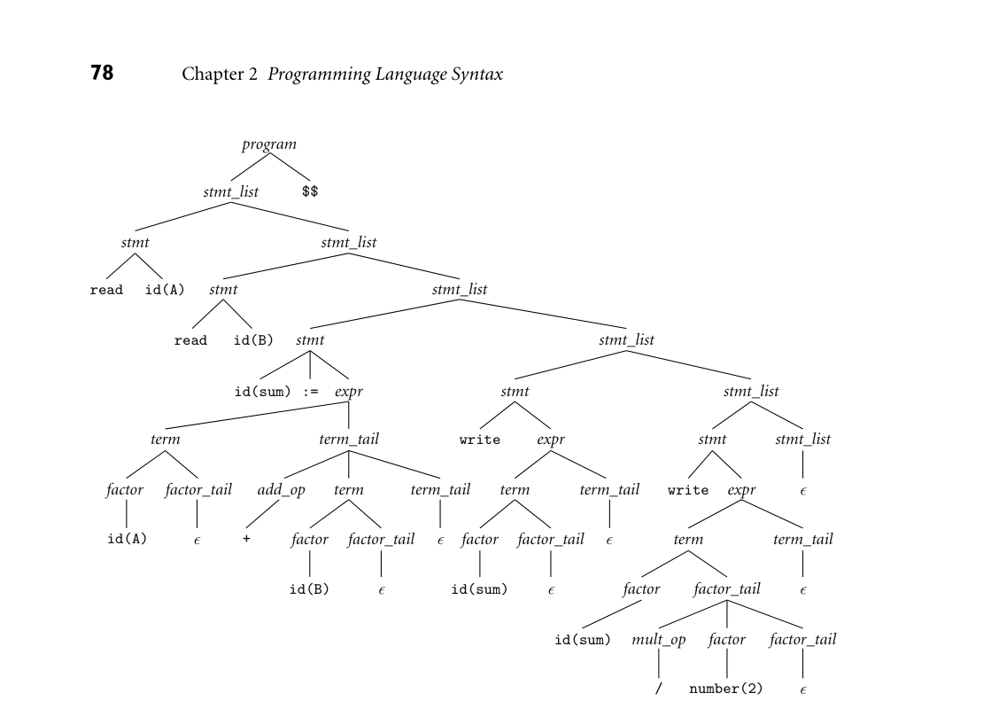
*Figure 2.18  Parse tree for the sum-and-average program of Example 2.24, using the grammar of Figure 2.16.*

side of the production, when recursively expanded, may yield a string beginning  with X, or (2) the right-hand side may yield nothing (i.e., it is , or  a  string  of   nonterminals that may recursively yield ), and X may begin the yield of what  comes next. We will formalize this notion of prediction in Section 2.3.3, using  sets called FIRST and FOLLOW, and show how to derive them automatically from  an LL(1) CFG.

ϵ ϵ

3CHECK YOUR UNDERSTANDING  20. What is the inherent “big-O” complexity of parsing? What is the complexity  of parsers used in real compilers?

* Summarize the difference between LL and LR parsing. Which one of them is
  also called “bottom-up”? “Top-down”? Which one is also called “predictive”?
  “Shift-reduce”? What do “LL” and “LR” stand for?

* What kind of parser (top-down or bottom-up) is most common in produc­

tion compilers?  23. Why are right-most derivations sometimes called canonical?

* What is the signifcance of the “1” in LR(1)?
* Why might we want (or need) different grammars for different parsing algo­

rithms?  26. What  is  an  epsilon production?

* What  are  recursive descent parsers? Why are they used mostly for small lan­

guages?

* How might a parser construct an explicit parse tree or syntax tree?

2.3.2 Writing an LL(1) Grammar

When designing a recursive-descent parser, one has to acquire a certain facility  in writing and modifying LL(1) grammars. The two most common obstacles to  “LL(1)-ness” are left recursion and common prefixes.

EXAMPLE 2.25  A grammar is said to be left recursive if there is a nonterminal A such that A  Left recursion  =⇒+ A α for some α.13 The trivial case occurs when the frst symbol on the right- hand side of a production is the same as the symbol on the left-hand side. Here  again is the grammar from Example 2.21, which cannot be parsed top-down:

id list −→ id list prefix ;

id list prefix −→ id list prefix , id

−→ id

The problem is in the second and third productions; in the id list prefix pars­ ing routine, with id on the input, a predictive parser cannot tell which of the  productions it should use. (Recall that left recursion is desirable in bottom-up  grammars, because it allows recursive constructs to be discovered incrementally,  as in Figure 2.15.)  ■

EXAMPLE 2.26  Common prefxes occur when two different productions with the same left- Common prefixes  hand side begin with the same symbol or symbols. Here is an example that com­ monly appears in languages descended from Algol:

13 Following conventional notation, we use uppercase Roman letters near the beginning of the al­

phabet to represent nonterminals, uppercase Roman letters near the end of the alphabet to rep­ resent arbitrary grammar symbols (terminals or nonterminals), lowercase Roman letters near  the beginning of the alphabet to represent terminals (tokens), lowercase Roman letters near the  end of the alphabet to represent token strings, and lowercase Greek letters to represent strings of  arbitrary symbols.

stmt −→ id := expr

−→ id ( argument list )  –– procedure call

With id at the beginning of both right-hand sides, we cannot choose between  them on the basis of the upcoming token.  ■  Both left recursion and common prefxes can be removed from a grammar me­ chanically. The general case is a little tricky (Exercise 2.25), because the prediction  problem may be an indirect one (e.g., S −→ A α and A −→ S β, or  S −→ A α,  S −→ B β, A =⇒∗ c γ, and  B =⇒∗ c δ). We can see the general idea in the  examples above, however.

EXAMPLE 2.27  Our left-recursive defnition of id list can be replaced by the right-recursive  Eliminating left recursion  variant we saw in Example 2.20:

id list −→ id id list tail

id list tail −→ , id  id list tail

id list tail −→ ;  ■

EXAMPLE 2.28  Our common-prefx defnition of stmt can be made LL(1) by a technique called  Left factoring  left factoring:

stmt −→ id stmt list tail

stmt list tail −→ := expr | ( argument list )  ■

Of course, simply eliminating left recursion and common prefxes is not guar­ anteed to make a grammar LL(1). There are infnitely many non-LL languages—  languages for which no LL grammar exists—and the mechanical transformations  to eliminate left recursion and common prefxes work on their grammars just  fne. Fortunately, the few non-LL languages that arise in practice can generally be  handled by augmenting the parsing algorithm with one or two simple heuristics.

EXAMPLE 2.29  The best  known  example of a “not  quite LL”  construct arises in languages  like   Parsing a “dangling else”  Pascal, in which the else part of an if statement is optional. The natural gram­ mar fragment

stmt −→ if condition then clause else clause | other stmt

then clause −→ then stmt

else clause −→ else stmt |

ϵ

is ambiguous (and thus neither LL nor LR); it allows the else in if C1 then if  C2 then S1 else S2 to be paired with either then. The less natural grammar  fragment

stmt −→ balanced stmt | unbalanced stmt

balanced stmt −→ if condition then balanced stmt else balanced stmt  | other stmt

unbalanced stmt −→ if condition then stmt  | if condition then balanced stmt else unbalanced stmt

can be parsed bottom-up but not top-down (there is no pure top-down grammar  for Pascal else statements). A balanced stmt is one with the same number of  thens and  elses. An unbalanced stmt has more thens.  ■  The usual approach, whether parsing top-down or bottom-up, is to use the  ambiguous grammar together with a “disambiguating rule,” which says that in  the  case of a confict  between  two  possible productions,  the  one to  use  is  the one   that occurs frst, textually, in the grammar. In the ambiguous fragment above,  the fact that else clause −→ else stmt comes before else clause −→  ends up  pairing the else with the nearest then.

ϵ

Better yet, a language designer can avoid this sort of problem by choosing dif-

EXAMPLE 2.30  ferent syntax. The ambiguity of the dangling else problem in Pascal leads to prob­ “Dangling else” program  lems not only in parsing, but in writing and maintaining correct programs. Most  bug  Pascal programmers at one time or another ended up writing a program like this  one:

if P <> nil then  if P^.val = goal then  foundIt := true  else  endOfList := true

Indentation notwithstanding, the Pascal manual states that an else clause  matches the closest unmatched then—in this case the inner one—which is clearly  not what the programmer intended. To get the desired effect, the Pascal program­ mer needed to write

if P <> nil then begin  if P^.val = goal then

foundIt := true  end  else

endOfList := true  ■

Many other Algol-family languages (including Modula, Modula-2, and Oberon,  all more recent inventions of Pascal’s designer, Niklaus Wirth) require explicit end

EXAMPLE 2.31  markers on all structured statements. The grammar fragment for if statements  End markers for structured  in Modula-2 looks something like this:  statements

DESIGN & IMPLEMENTATION

2.6 The dangling else  A simple change in language syntax—eliminating the dangling else—not  only reduces the chance of programming errors, but also signifcantly sim­ plifes parsing. For more on the dangling else problem, see Exercise 2.24 and  Section 6.4.

stmt −→ IF condition then clause else clause END | other stmt  then clause −→ THEN stmt list  else clause −→ ELSE stmt list |

ϵ

The addition of the END eliminates the ambiguity.  ■  Modula-2 uses END to terminate all its structured statements. Ada and For­ tran 77 end an if with end if (and a while with end while, etc.).  Al­ gol 68 creates its terminators by spelling the initial keyword backward (if... fi,  case... esac, do... od, etc.).   One problem with end markers is that they tend to bunch up. In Pascal one  could write

EXAMPLE 2.32

The need for elsif

if A = B then ...   else if A = C then ...   else if A = D then ...   else if A = E then ...   else ...

With end markers this becomes

if A = B then ...   else if A = C then ...   else if A = D then ...   else if A = E then ...   else ...  end end end end

To avoid this awkwardness, languages with end markers generally provide an  elsif keyword (sometimes spelled elif):

if A = B then ...   elsif A = C then ...   elsif A = D then ...   elsif A = E then ...   else ...  end  ■

## 2.3.3 Table-Driven Top-Down Parsing

EXAMPLE 2.33

In a recursive descent parser, each arm of a case statement corresponds to a  production, and contains parsing routine and match calls corresponding to the  symbols on the right-hand side of that production. At any given point in the  parse, if we consider the calls beyond the program counter (the ones that have yet  to occur) in the parsing routine invocations currently in the call stack, we obtain  a list of the symbols that the parser expects to see between here and the end of the  program. A table-driven top-down parser maintains an explicit stack containing  this same list of symbols.

Driver and table for  top-down parsing

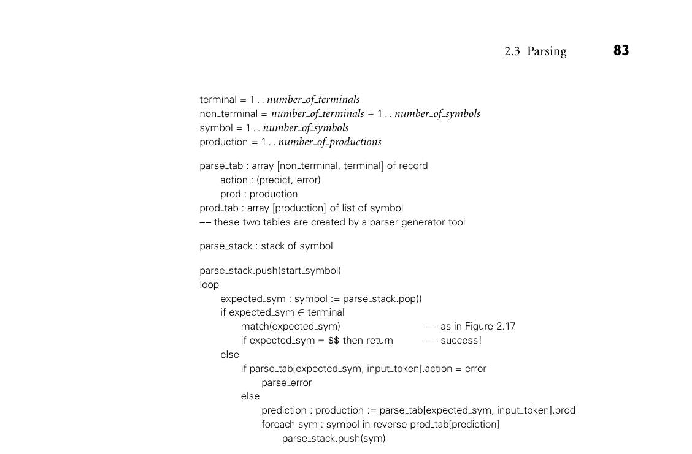
*Figure 2.19  Driver for a table-driven LL(1) parser.*

Pseudocode for such a parser appears in Figure 2.19. The code is language  independent. It requires a language-dependent parsing table, generally produced  by an automatic tool. For the calculator grammar of Figure 2.16, the table appears  in Figure 2.20.  ■  To illustrate the algorithm, Figure 2.21 shows a trace of the stack and the input  over time, for the sum-and-average program of Example 2.24. The parser iter­ ates around a loop in which it pops the top symbol off the stack and performs  the following actions: If the popped symbol is a terminal, the parser attempts  to match it against an incoming token from the scanner. If the match fails, the  parser announces a syntax error and initiates some sort of error recovery (see Sec­ tion 2.3.5). If the popped symbol is a nonterminal, the parser uses that nontermi­ nal together with the next available input token to index into a two-dimensional  table that tells it which production to predict (or whether to announce a syntax  error and initiate recovery).

EXAMPLE 2.34

Table-driven parse of the  “sum and average”  program

Initially, the parse stack contains the start symbol of the grammar (in our case,  program). When it predicts a production, the parser pushes the right-hand-side  symbols onto the parse stack in reverse order, so the frst of those symbols ends up  at top-of-stack. The parse completes successfully when we match the end marker

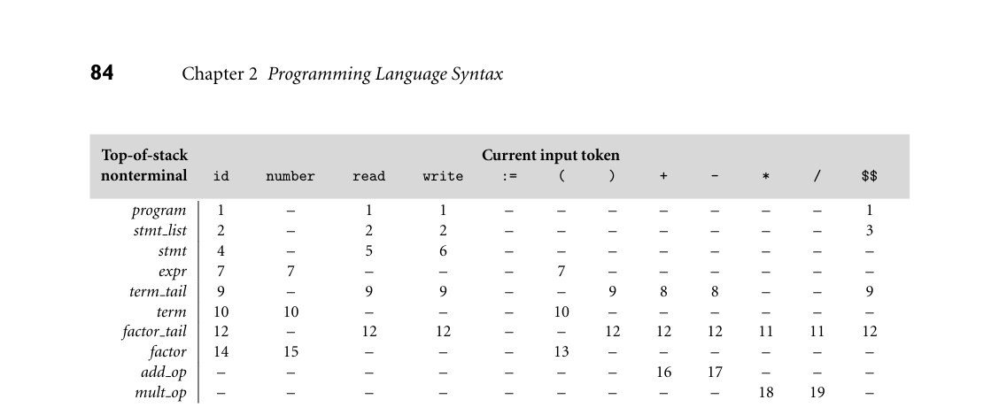
*Figure 2.20  LL(1) parse table for the calculator language. Table entries indicate the production to predict (as numbered in  Figure 2.23). A dash indicates an error. When the top-of-stack symbol is a terminal, the appropriate action is always to match  it against an incoming token from the scanner. An auxiliary table, not shown here, gives the right-hand-side symbols for each  production.*

token, $$. Assuming that $$ appears only once in the grammar, at the end of the  frst production, and that the scanner returns this token only at end-of-fle, any  syntax error is guaranteed to manifest itself either as a failed match or as an error  entry in the table.  ■  As we hinted at the end of Section 2.3.1, predict sets are defned in terms of  simpler sets called FIRST and FOLLOW, where  FIRST(A) is  the  set  of  all  tokens  that   could be the start of an A and FOLLOW(A) is the set of all tokens that could come  after an A in some valid program. If we extend the domain of FIRST in the obvious  way to include strings of symbols, we then say that the predict set of a production  A −→ β is FIRST(β), plus  FOLLOW(A) if  β =⇒∗ . For notational convenience,  we defne the predicate EPS such that EPS(β)   β =⇒∗ .

ϵ ϵ

EXAMPLE 2.35  We can illustrate the algorithm to construct these sets using our calculator  Predict sets for the  grammar (Figure 2.16). We begin with “obvious” facts about the grammar and  calculator language  build on them inductively. If we recast the grammar in plain BNF (no EBNF  ‘ | ’ constructs), then it has 19 productions. The “obvious” facts arise from ad­ jacent pairs of symbols in right-hand sides. In the frst production, we can see  that $$ ∈ FOLLOW(stmt list).  In the third (stmt list −→ ), EPS(stmt list) =   true. In the fourth production (stmt −→ id := expr), id ∈ FIRST(stmt) (also   := ∈ FOLLOW(id),  but it turns  out we  don’t need  FOLLOW sets for nontermi­ nals).  In the ffth and sixth productions (stmt −→ read id | write expr),  { read, write} ⊂ FIRST(stmt). The complete set of “obvious” facts appears in  Figure 2.22.

ϵ

From the “obvious” facts we can deduce a larger set of facts during a second  pass over the grammar. For example, in the second production (stmt list −→  stmt stmt list) we can deduce that { id, read, write} ⊂ FIRST(stmt list), be­ cause we already  know  that  { id, read, write} ⊂ FIRST(stmt), and a stmt list can

Parse stack  Input stream  Comment

*Figure 2.21  Trace of a table-driven LL(1) parse of the sum-and-average program of Example 2.24.*

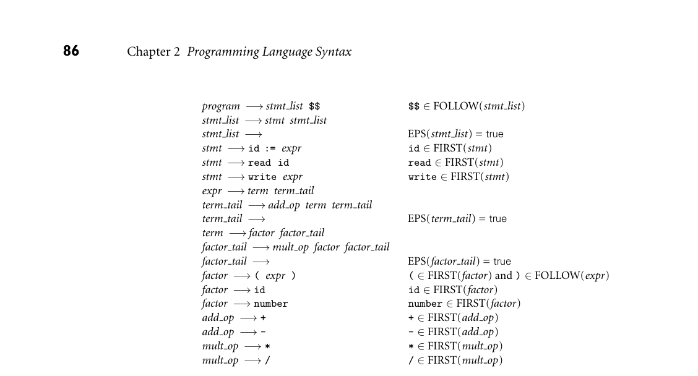
*Figure 2.22  “Obvious” facts (right) about the LL(1) calculator grammar (left).*

DESIGN & IMPLEMENTATION

2.7 Recursive descent and table-driven LL parsing  When trying to understand the connection between recursive descent and  table-driven LL parsing, it is tempting to imagine that the explicit stack of  the table-driven parser mirrors the implicit call stack of the recursive descent  parser, but this is not the case.

A better way to visualize the two implementa­ tions of top-down parsing is to remember that both  are discovering a parse tree via depth-frst left-to­ right traversal. When we are at a given point in  the parse—say the circled node in the tree shown  here—the implicit call stack of a recursive descent  parser holds a frame for each of the nodes on the  path back to the root, created when the routine cor­ responding to that node was called. (This path is  shown in grey.)

But these nodes are immaterial. What matters for the rest of the parse—as  shown on the white path here—are the upcoming calls on the case statement  arms of the recursive descent routines. Those calls—those parse tree nodes—  are precisely the contents of the explicit stack of a table-driven LL parser.

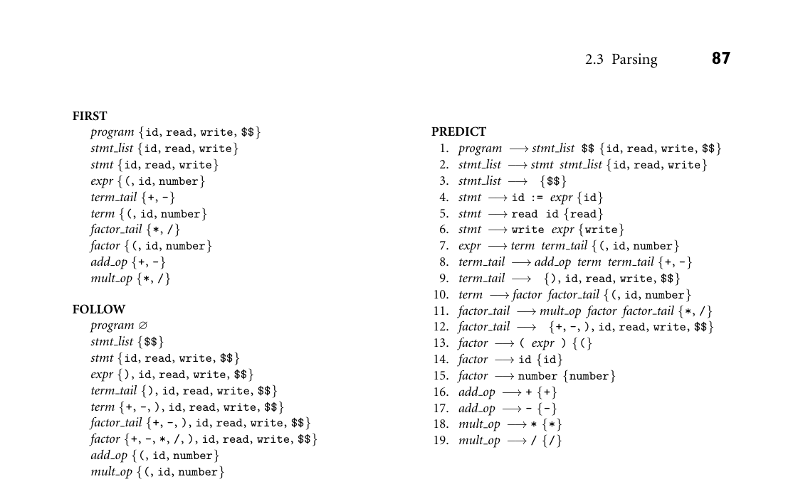
*Figure 2.23  FIRST, FOLLOW, and PREDICT sets for the calculator language. FIRST(c) =  { c} ∀ tokens c. EPS(A) is  true iff A  ∈ {stmt list, term tail, factor tail}.*

begin with a stmt. Similarly, in the frst production, we can deduce that $$ ∈  FIRST(program),  because we already  know  that  EPS(stmt list) =  true.

In the eleventh production (factor tail −→ mult op factor factor tail), we can  deduce that { (, id, number} ⊂ FOLLOW(mult op), because we already know  that { (, id, number} ⊂ FIRST(factor), and factor follows mult op in the right- hand side. In the production expr −→ term term tail, we can deduce that )  ∈ FOLLOW(term tail), because we already know that ) ∈ FOLLOW(expr), and a  term tail can be the last part of an expr. In this same production, we can also de­ duce that ) ∈ FOLLOW(term), because the term tail can generate (EPS(term tail)  = true), allowing a term to be the last part of an expr.

ϵ

There is more that we can learn from our second pass through the grammar,  but the examples above cover all the different kinds of cases. To complete our  calculation, we continue with additional passes over the grammar until we don’t  learn any more (i.e., we don’t add anything to any of the FIRST and FOLLOW sets).  We then construct the PREDICT sets. Final versions of all three sets appear in  Figure 2.23. The parse table of Figure 2.20 follows directly from PREDICT.  ■  The algorithm to compute EPS, FIRST, FOLLOW, and  PREDICT sets appears, a  bit more formally, in Figure 2.24. It relies on the following defnitions:

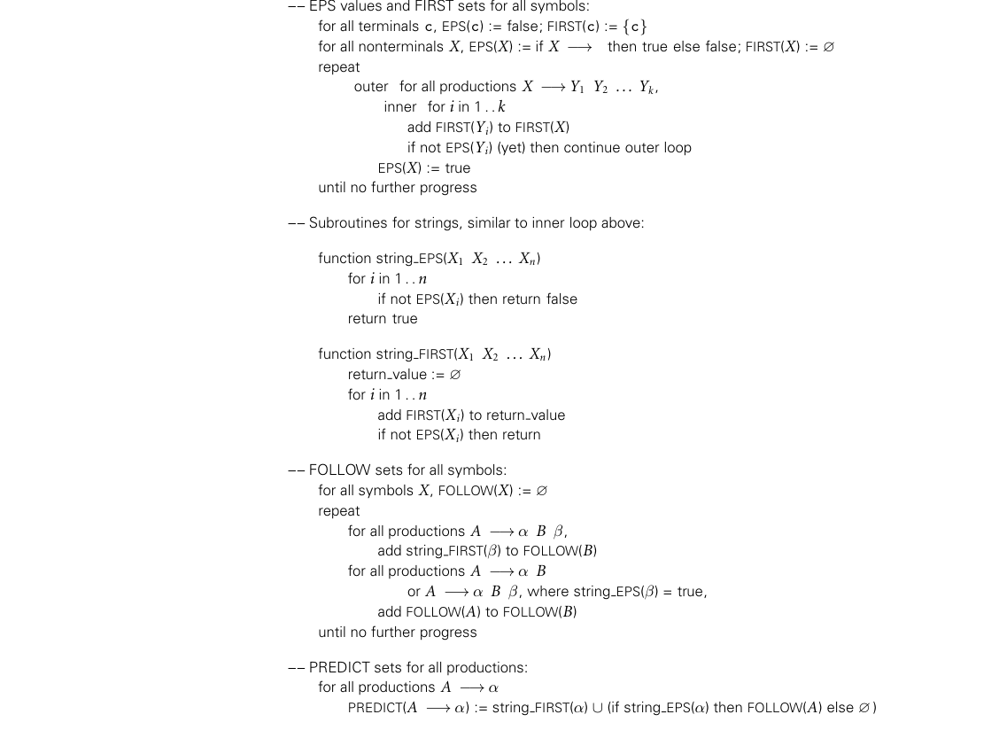
*Figure 2.24  Algorithm to calculate FIRST, FOLLOW, and PREDICT sets. The grammar is LL(1)  if and only if all PREDICT sets for productions with the same left-hand side are disjoint.*

∗  EPS(α)  if α =⇒  then true else false

ϵ

FIRST(α)  {c : α =⇒∗ c β }

FOLLOW(A)  {c : S  =⇒+ α A c β }

PREDICT(A −→α)  FIRST(α) ∪ ( if EPS(α) then  FOLLOW(A) else  ∅ )

The defnition of PREDICT assumes that the language has been augmented with  an end marker—that is, that FOLLOW(S) =  {$$}. Note  that  FIRST sets and EPS  values for strings of length greater than one are calculated on demand; they are

not stored explicitly. The algorithm is guaranteed to terminate (i.e., converge on  a solution), because the sizes of the FIRST and FOLLOW sets are bounded by the  number of terminals in the grammar.

If in the process of calculating PREDICT sets we fnd that some token belongs to  the PREDICT set of more than one production with the same left-hand side, then  the grammar is not LL(1), because we will not be able to choose which of the  productions to employ when the left-hand side is at the top of the parse stack (or  we are in the left-hand side’s subroutine in a recursive descent parser) and we see  the token coming up in the input. This sort of ambiguity is known as a predict- predict conflict; it can arise either because the same token can begin more than one  right-hand side, or because it can begin one right-hand side and can also appear  after the left-hand side in some valid program, and one possible right-hand side  can generate .

ϵ

3CHECK YOUR UNDERSTANDING  29. Describe two common idioms in context-free grammars that cannot be  parsed top-down.  30. What is the “dangling else” problem? How is it avoided in modern lan­

guages?  31. Discuss the similarities and differences between recursive descent and table- driven top-down parsing.  32. What  are  FIRST and FOLLOW sets? What are they used for?

* Under what circumstances does a top-down parser predict the production

A −→ α?

* What sorts of “obvious” facts form the basis of FIRST set and FOLLOW set
  construction?

* Outline the algorithm used to complete the construction of FIRST and
  FOLLOW sets. How do we know when we are done?

* How do we know when a grammar is not LL(1)?

## 2.3.4 Bottom-Up Parsing

Conceptually, as we saw at the beginning of Section 2.3, a bottom-up parser works  by maintaining a forest of partially completed subtrees of the parse tree, which it  joins together whenever it recognizes the symbols on the right-hand side of some  production used in the right-most derivation of the input string. It creates a new  internal node and makes the roots of the joined-together trees the children of  that node.

In practice, a bottom-up parser is almost always table-driven. It keeps the roots  of its partially completed subtrees on a stack. When it accepts a new token from

the scanner, it shifts the token into the stack. When it recognizes that the top  few symbols on the stack constitute a right-hand side, it reduces those symbols  to their left-hand side by popping them off the stack and pushing the left-hand  side in their place. The role of the stack is the frst important difference between  top-down and bottom-up parsing: a top-down parser’s stack contains a list of  what the parser expects to see in the future; a bottom-up parser’s stack contains a  record of what the parser has already seen in the past.

Canonical Derivations

We also noted earlier that the actions of a bottom-up parser trace out a right­ most (canonical) derivation in reverse. The roots of the partial subtrees, left- to-right, together with the remaining input, constitute a sentential form of the

EXAMPLE 2.36  right-most derivation. On the right-hand side of Figure 2.14, for example, we  Derivation of an id list  have the following series of steps:

Stack contents (roots of partial trees)  Remaining input

A, B, C;  id (A)  id (A) ,  id (A) , id (B)  id (A) , id (B) ,  id (A) , id (B) , id (C)  id (A) , id (B) , id (C) ;  id (A) , id (B) , id (C) id list tail  id (A) , id (B) id list tail  id (A) id list tail

ϵ

, B, C;  B, C;  , C;  C;  ;

id list

The last four lines (the ones that don’t just shift tokens into the forest) correspond  to the right-most derivation:

id list =⇒ id id list tail

=⇒ id , id id list tail

=⇒ id , id , id id list tail

=⇒ id , id , id ;

The symbols that need to be joined together at each step of the parse to represent  the next step of the backward derivation are called the handle of the sentential  form. In the parse trace above, the handles are underlined.  ■

EXAMPLE 2.37  In our id list example, no handles were found until the entire input had been  Bottom-up grammar for  shifted onto the stack. In general this will not be the case. We can obtain a more  the calculator language  realistic example by examining an LR version of our calculator language, shown  in Figure 2.25. While the LL grammar of Figure 2.16 can be parsed bottom- up, the version in Figure 2.25 is preferable for two reasons. First, it uses a left- recursive production for stmt list. Left recursion allows the parser to collapse  long statement lists as it goes along, rather than waiting until the entire list is

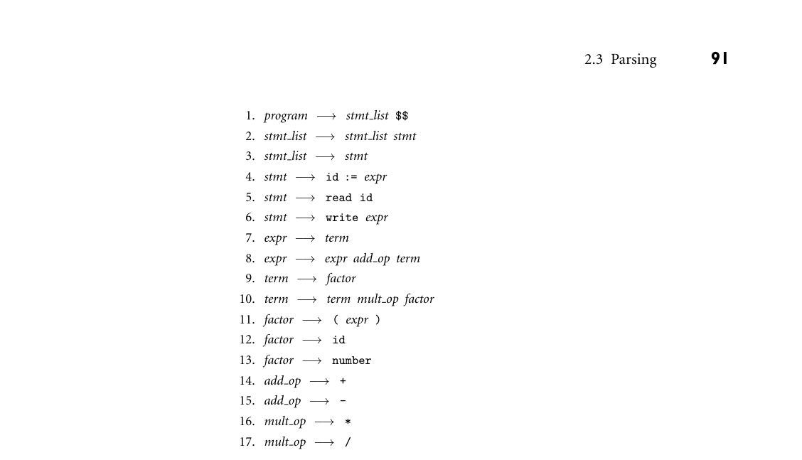
*Figure 2.25  LR(1) grammar for the calculator language. Productions have been numbered for  reference in future fgures.*

on the stack and then collapsing it from the end. Second, it uses left-recursive  productions for expr and term. These productions capture left associativity while  still keeping an operator and its operands together in the same right-hand side,  something we were unable to do in a top-down grammar.  ■

Modeling a Parse with LR Items

EXAMPLE 2.38  Suppose we are to parse the sum-and-average program from Example 2.24:  Bottom-up parse of the  “sum and average”  read A  program  read B  sum := A  + B   write sum  write sum / 2

The key to success will be to fgure out when we have reached the end of a right- hand side—that is, when we have a handle at the top of the parse stack. The trick  is to keep track of the set of productions we might be “in the middle of” at any  particular time, together with an indication of where in those productions we  might be.

When we begin execution, the parse stack is empty and we are at the begin­ ning of the production for program. (In general, we can assume that there is only  one production with the start symbol on the left-hand side; it is easy to modify

any grammar to make this the case.) We can represent our location—more spe­ cifcally, the location represented by the top of the parse stack—with a. in the  right-hand side of the production:

program −→ . stmt list $$

When augmented with a ., a production is called an LR item. Since  the  . in  this item is immediately in front of a nonterminal—namely stmt list—we may be  about to see the yield of that nonterminal coming up on the input. This possibility  implies that we may be at the beginning of some production with stmt list on the  left-hand side:

program −→ . stmt list $$

stmt list −→ . stmt list stmt

stmt list −→ . stmt

And, since stmt is a nonterminal, we may also be at the beginning of any produc­ tion whose left-hand side is stmt:

program −→ . stmt list $$  (State 0)

stmt list −→ . stmt list stmt

stmt list −→ . stmt

stmt −→ . id := expr

stmt −→ . read id

stmt −→ . write expr

Since all of these last productions begin with a terminal, no additional items need  to be added to our list. The original item (program −→ . stmt list $$) is called  the basis of the list. The additional items are its closure. The list represents the ini­ tial state of the parser. As we shift and reduce, the set of items will change, always  indicating which productions may be the right one to use next in the derivation  of the input string. If we reach a state in which some item has the. at the end  of the right-hand side, we can reduce by that production. Otherwise, as in the  current situation, we must shift. Note that if we need to shift, but the incoming  token cannot follow the . in any item of the current state, then a syntax error has  occurred. We will consider error recovery in more detail in Section C 2.3.5.  Our upcoming token is a read.  Once we shift  it  onto  the stack,  we  know  we   are in the following state:

stmt −→ read . id  (State 1)

This state has a single basis item and an empty closure—the . precedes a terminal.  After shifting the A, we  have

stmt −→ read id .  (State 1 )

′

We now know that read id is the handle, and we must reduce. The reduction  pops two symbols off the parse stack and pushes a stmt in their place, but what  should the new state be? We can see the answer if we imagine moving back in  time to the point at which we shifted the read—the frst symbol of the right-hand  side. At that time we were in the state labeled “State 0” above, and the upcoming  tokens on the input (though we didn’t look at them at the time) were read id. We   have now consumed these tokens, and we know that they constituted a stmt. By   pushing a stmt onto the stack, we have in essence replaced read id with stmt on  the input stream, and have then “shifted” the nonterminal, rather than its yield,  into the stack. Since one of the items in State 0 was

stmt list −→ . stmt

we now have

stmt list −→ stmt .  (State 0 )

′

Again we must reduce. We remove the stmt from the stack and push a stmt list in  its place. Again we can see this as “shifting” a stmt list when in State 0. Since two  of  the items  in  State 0 have  a  stmt list after the ., we don’t know (without looking  ahead) which of the productions will be the next to be used in the derivation, but  we don’t have to know. The key advantage of bottom-up parsing over top-down  parsing is that we don’t need to predict ahead of time which production we shall  be expanding.

Our new state is as follows:

program −→ stmt list . $$  (State 2)

stmt list −→ stmt list . stmt

stmt −→ . id := expr

stmt −→ . read id

stmt −→ . write expr

The frst two productions are the basis; the others are the closure. Since no item  has a. at the end, we shift the next token, which happens again to be a read,  taking us back to State 1. Shifting the B takes us to State 1 again, at which point  we reduce. This time however, we go back to State 2 rather than State 0 before  shifting the left-hand-side stmt. Why? Because we were in State 2 when we began  to read the right-hand side.  ■

′

The Characteristic Finite-State Machine and LR Parsing Variants

An LR-family parser keeps track of the states it has traversed by pushing them into  the parse stack, along with the grammar symbols. It is in fact the states (rather  than the symbols) that drive the parsing algorithm: they tell us what state we  were in at the beginning of a right-hand side. Specifcally, when the combina­ tion of state and input tells us we need to reduce using production A −→ α, we   pop length(α) symbols off the stack, together with the record of states we moved

through while shifting those symbols. These pops expose the state we were in im­ mediately prior to the shifts, allowing us to return to that state and proceed as if  we had seen A in the frst place.

We can think of the shift rules of an LR-family parser as the transition function  of a fnite automaton, much like the automata we used to model scanners. Each  state of the automaton corresponds to a list of items that indicate where the parser  might be at some specifc point in the parse. The transition for input symbol X  (which may be either a terminal or a nonterminal) moves to a state whose basis  consists of items in which the. has been moved across an X in the right-hand  side, plus whatever items need to be added as closure. The lists are constructed  by a bottom-up parser generator in order to build the automaton, but are not  needed during parsing.

It turns out that the simpler members of the LR family of parsers—LR(0),  SLR(1), and LALR(1)—all use the same automaton, called the characteristic finite- state machine, or CFSM. Full LR parsers use a machine with (for most grammars)  a much larger number of states. The differences between the algorithms lie in how  they deal with states that contain a shift-reduce conflict—one item with the . in  front of a terminal (suggesting the need for a shift) and another with the . at  the end of the right-hand side (suggesting the need for a reduction). An LR(0)  parser works only when there are no such states. It can be proven that with the  addition of an end-marker (i.e., $$), any language that can be deterministically  parsed bottom-up has an LR(0) grammar. Unfortunately, the LR(0) grammars  for real programming languages tend to be prohibitively large and unintuitive.

SLR (simple LR) parsers peek at upcoming input and use FOLLOW sets to re­ solve conficts. An SLR parser will call for a reduction via A −→ α only if the  upcoming token(s) are in FOLLOW(α). It will still see a confict, however, if the  tokens are also in the FIRST set of any of the symbols that follow a. in other  items of the state. As it turns out, there are important cases in which a token  may follow a given nonterminal somewhere in a valid program, but never in a  context described by the current state. For these cases global FOLLOW sets are  too crude. LALR (look-ahead LR) parsers improve on SLR by using local (state- specifc) look-ahead instead.

Conficts  can still  arise in an LALR parser  when  the same set of  items  can occur   on two different paths through the CFSM. Both paths will end up in the same  state, at which point state-specifc look-ahead can no longer distinguish between  them. A full LR parser duplicates states in order to keep paths disjoint when their  local look-aheads are different.

LALR parsers are the most common bottom-up parsers in practice. They are  the same size and speed as SLR parsers, but are able to resolve more conficts.  Full LR parsers for real programming languages tend to be very large. Several  researchers have developed techniques to reduce the size of full-LR tables, but  LALR works suffciently well in practice that the extra complexity of full LR is  usually not required. Yacc/bison produces C code for an LALR parser.

## Bottom-Up Parsing Tables

Like a table-driven LL(1) parser, an SLR(1), LALR(1), or LR(1) parser executes  a loop in which it repeatedly inspects a two-dimensional table to fnd out what  action to take. However, instead of using the current input token and top-of­ stack nonterminal to index into the table, an LR-family parser uses the current  input token and the current parser state (which can be found at the top of the  stack). “Shift” table entries indicate the state that should be pushed. “Reduce”  table entries indicate the number of states that should be popped and the non­ terminal that should be pushed back onto the input stream, to be shifted by the  state uncovered by the pops. There is always one popped state for every symbol  on the right-hand side of the reducing production. The state to be pushed next  can be found by indexing into the table using the uncovered state and the newly  recognized nonterminal.

EXAMPLE 2.39

The CFSM for our bottom-up version of the calculator grammar appears in  Figure 2.26. States 6, 7, 9, and 13 contain potential shift-reduce conficts, but all  of these can be resolved with global FOLLOW sets. SLR parsing therefore suffces.  In State 6, for example, FIRST(add op) ∩ FOLLOW(stmt) = ∅. In addition to shift  and reduce rules, we allow the parse table as an optimization to contain rules of  the form “shift and then reduce.” This optimization serves to eliminate trivial  states such as 1 and 0 in Example 2.38, which had only a single item, with the .  at the end.

CFSM for the bottom-up  calculator grammar

′ ′

A pictorial representation of the CFSM appears in Figure 2.27. A tabular rep­ resentation, suitable for use in a table-driven parser, appears in Figure 2.28. Pseu­ docode for the (language-independent) parser driver appears in Figure 2.29. A  trace of the parser’s actions on the sum-and-average program appears in Fig­ ure 2.30.  ■

Handling Epsilon Productions

EXAMPLE 2.40

The careful reader may have noticed that the grammar of Figure 2.25, in addition  to using left-recursive rules for stmt list, expr, and  term, differsfrom the grammar  of Figure 2.16 in one other way: it defnes a stmt list to be a sequence of one or  more stmts, rather than zero or more. (This means, of course, that it defnes a  different language.) To capture the same language as Figure 2.16, production 3 in  Figure 2.25,

Epsilon productions in the  bottom-up calculator  grammar

stmt list −→ stmt

would need to be replaced with

stmt list −→  ■

ϵ

Note that it does in general make sense to have an empty statement list. In the cal­ culator language it simply permits an empty program, which is admittedly silly. In  real languages, however, it allows the body of a structured statement to be empty,  which can be very useful. One frequently wants one arm of a case or multi- way if... then ... else statement to be empty, and an empty while loop allows

State  Transitions

  0.
  program −→ . stmt list $$

on stmt list shift and goto 2

stmt list −→ . stmt list stmt  stmt list −→ . stmt  stmt −→ . id := expr  stmt −→ . read id  stmt −→ . write expr

on stmt shift and reduce (pop 1 state, push stmt list on input)  on id shift and goto 3  on read shift and goto 1  on write shift and goto 4

*Figure 2.26  CFSM for the calculator grammar (Figure 2.25). Basis and closure items in each state are separated by a  horizontal rule. Trivial reduce-only states have been eliminated by use of “shift and reduce” transitions. (continued)*

State  Transitions

  7.
  expr −→ term .
  term −→ term . mult op factor

on FOLLOW(expr) =  { id, read, write, $$, ), +, -} reduce  (pop 1 state, push expr on input)  on mult op shift and goto 11  on * shift and reduce (pop 1 state, push mult op on input)  on / shift and reduce (pop 1 state, push mult op on input)

mult op −→ . *  mult op −→ . /

  8.
  factor −→ ( . expr )
  on expr shift and goto 12

on term shift and goto 7

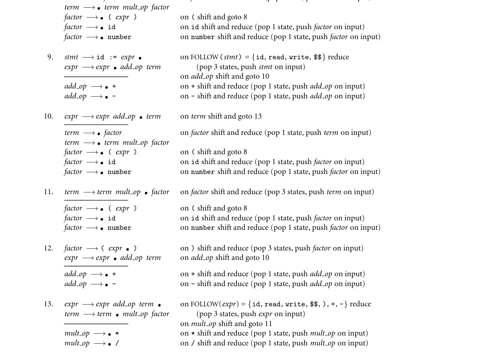
*Figure 2.26  (continued)*

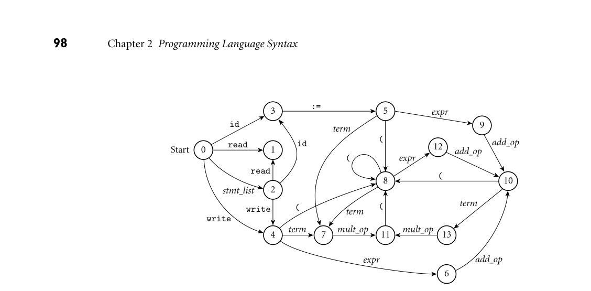
*Figure 2.27  Pictorial representation of the CFSM of Figure 2.26. Reduce actions are not  shown.*

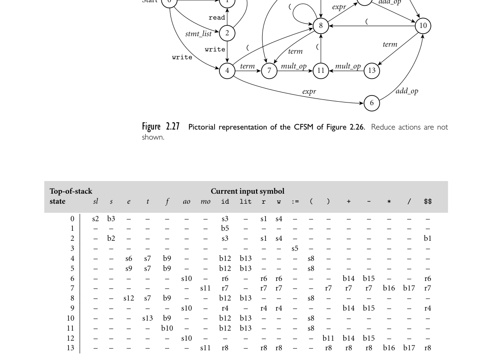
*Figure 2.28  SLR(1) parse table for the calculator language. Table entries indicate whether to shift (s), reduce (r), or shift  and then reduce (b). The accompanying number is the new state when shifting, or the production that has been recognized  when (shifting and) reducing. Production numbers are given in Figure 2.25. Symbol names have been abbreviated for the sake  of formatting. A dash indicates an error. An auxiliary table, not shown here, gives the left-hand-side symbol and right-hand-side  length for each production.*

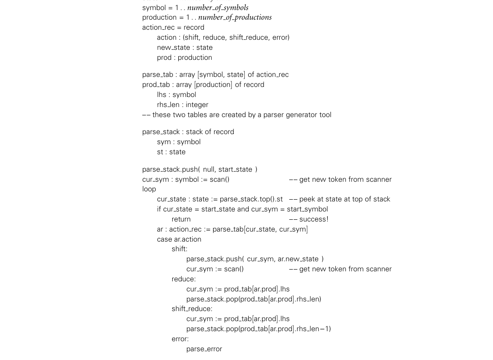
*Figure 2.29  Driver for a table-driven SLR(1) parser. We call the scanner directly, rather  than using the global input token of Figures 2.17 and 2.19, so that we can set cur sym to be  an arbitrary symbol. We pass to the pop() routine a parameter that indicates the number of  symbols to remove from the stack.*

Parse stack  Input stream  Comment

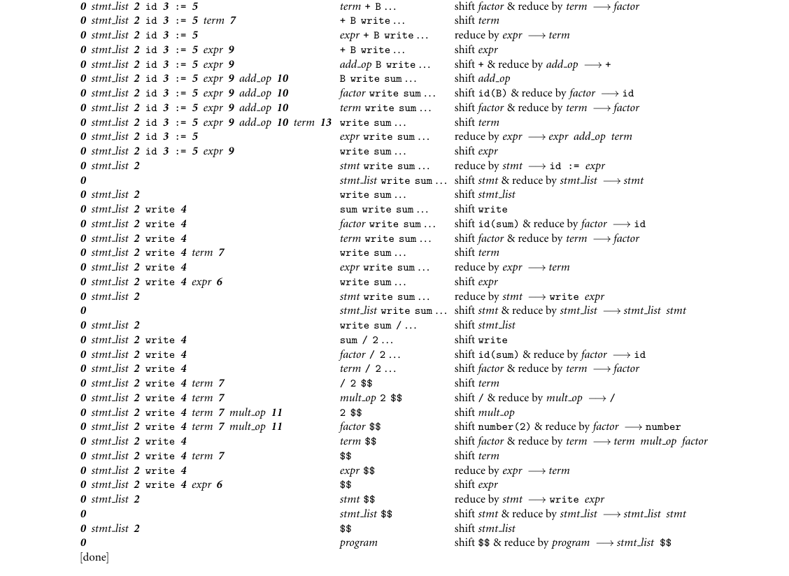
*Figure 2.30  Trace of a table-driven SLR(1) parse of the sum-and-average program. States in the parse stack are shown in  boldface type. Symbols in the parse stack are for clarity only; they are not needed by the parsing algorithm. Parsing begins with  the initial state of the CFSM (State 0) in the stack. It ends when we reduce by program −→ stmt list $$, uncovering State 0  again and pushing program onto the input stream.*

a parallel program (or the operating system) to wait for a signal from another  process or an I/O device.

EXAMPLE 2.41  If we look at the CFSM for the calculator language, we discover that State 0 is  CFSM with epsilon  the only state that needs to be changed in order to allow empty statement lists.  productions  The item

stmt list −→ . stmt

stmt list −→ .

becomes

ϵ

stmt list −→ .

which is equivalent to

ϵ

stmt list −→ .

or simply

The entire state is then

program −→ . stmt list $$  on stmt list shift and goto 2

stmt list −→ . stmt list stmt  stmt list −→ .  on $$ reduce (pop 0 states, push stmt list on input)  stmt −→ . id := expr  on id shift and goto 3  stmt −→ . read id  on read shift and goto 1  stmt −→ . write expr  on write shift and goto 4

stmt list −→ .

The look-ahead for item

is FOLLOW(stmt list), which is the end-marker, $$. Since  $$ does not appear in  the look-aheads for any other item in this state, our grammar is still SLR(1). It is  worth noting that epsilon productions commonly prevent a grammar from being  LR(0): if such a production shares a state with an item in which the dot precedes  a terminal, we won’t be able to tell whether to “recognize”  without peeking  ahead.  ■

ϵ

3CHECK YOUR UNDERSTANDING  37. What is the handle of a right sentential form?  38. Explain the signifcance of the characteristic fnite-state machine in LR pars­

ing.  39. What is the signifcance of the dot (.) in  an  LR  item?

* What distinguishes the basis from the closure of an LR state?
* What  is  a  shift-reduce conflict? How is it resolved in the various kinds of LR-
  family parsers?

* Outline the steps performed by the driver of a bottom-up parser.

* What kind of parser  is produced by  yacc/bison? By  ANTLR?
* Why are there never any epsilon productions in an LR(0) grammar?

2.3.5 Syntax Errors

EXAMPLE 2.42  Suppose we are parsing a C program and see the following code fragment in a  A syntax error in C  context where a statement is expected:

A = B : C + D;

We will detect a syntax error immediately after the B, when the colon appears  from the scanner. At this point the simplest thing to do is just to print an error  message and halt. This naive approach is generally not acceptable, however: it  would mean that every run of the compiler reveals no more than one syntax er­ ror. Since most programs, at least at frst, contain numerous such errors, we really  need to fnd as many as possible now (we’d also like to continue looking for se­ mantic errors). To do so, we must modify the state of the parser and/or the input  stream so that the upcoming token(s) are acceptable. We shall probably want to  turn off code generation, disabling the back end of the compiler: since the input is  not a valid program, the code will not be of use, and there’s no point in spending  time creating it.  ■  In general, the term syntax error recovery is applied to any technique that al­ lows the compiler, in the face of a syntax error, to continue looking for other  errors later in the program. High-quality syntax error recovery is essential in any  production-quality compiler. The better the recovery technique, the more likely  the compiler will be to recognize additional errors (especially nearby errors) cor­ rectly, and the less likely it will be to become confused and announce spurious  cascading errors later in the program.

IN MORE DEPTH

On the companion site we explore several possible approaches to syntax error re­ covery. In panic mode, the compiler writer defnes a small set of “safe symbols”  that delimit clean points in the input. Semicolons, which typically end a state­ ment, are a good choice in many languages. When an error occurs, the compiler  deletes input tokens until it fnds a safe symbol, and then “backs the parser out”  (e.g., returns from recursive descent subroutines) until it fnds a context in which  that symbol might appear. Phrase-level recovery improves on this technique by  employing different sets of “safe” symbols in different productions of the gram­ mar (right parentheses when in an expression; semicolons when in a declara­ tion). Context-specific look-ahead obtains additional improvements by differenti­ ating among the various contexts in which a given production might appear in a

syntax tree. To respond gracefully to certain common programming errors, the  compiler writer may augment the grammar with error productions that capture  language-specifc idioms that are incorrect but are often written by mistake.

Niklaus Wirth published an elegant implementation of phrase-level and  context-specifc recovery for recursive descent parsers in 1976 [Wir76, Sec. 5.9].  Exceptions (to be discussed further in Section 9.4) provide a simpler alternative  if supported by the language in which the compiler is written. For table-driven  top-down parsers, Fischer, Milton, and Quiring published an algorithm in 1980  that automatically implements a well-defned notion of locally least-cost syntax  repair. Locally least-cost repair is also possible in bottom-up parsers, but it is sig­ nifcantly more diffcult. Most bottom-up parsers rely on more straightforward  phrase-level recovery; a typical example can be found in yacc/bison.

## 2.4  Theoretical Foundations

Our understanding of the relative roles and computational power of scanners,  parsers, regular expressions, and context-free grammars is based on the formal­ isms of automata theory. In automata theory, a formal language is a set of strings  of symbols drawn from a fnite alphabet. A formal language can be specifed ei­ ther by a set of rules (such as regular expressions or a context-free grammar) that  generates the language, or by a formal machine that accepts (recognizes) the  lan­ guage. A formal machine takes strings of symbols as input and outputs either  “yes” or “no.” A machine is said to accept a language if it says “yes” to all and only  those strings that are in the language. Alternatively, a language can be defned as  the set of strings for which a particular machine says “yes.”

Formal languages can be grouped into a series of successively larger classes

14 known as the Chomsky hierarchy.  Most of the classes can be characterized in  two ways: by the types of rules that can be used to generate the set of strings,  or by the type of formal machine that is capable of recognizing the language. As  we have seen, regular languages are defned by using concatenation, alternation,  and Kleene closure, and are recognized by a scanner. Context-free languages are  a proper superset of the regular languages. They are defned by using concatena­ tion, alternation, and recursion (which subsumes Kleene closure), and are recog­ nized by a parser. A scanner is a concrete realization of a finite automaton, a type   of formal machine. A parser is a concrete realization of a push-down automaton.  Just as context-free grammars add recursion to regular expressions, push-down  automata add a stack to the memory of a fnite automaton. There are additional  levels in the Chomsky hierarchy, but they are less directly applicable to compiler  construction, and are not covered here.

14 Noam Chomsky (1928–), a linguist and social philosopher at the Massachusetts Institute of Tech­

nology, developed much of the early theory of formal languages.

It can be proven, constructively, that regular expressions and fnite automata  are equivalent: one can construct a fnite automaton that accepts the language  defned by a given regular expression, and vice versa. Similarly, it is possible to  construct a push-down automaton that accepts the language defned by a given  context-free grammar, and vice versa. The grammar-to-automaton constructions  are in fact performed by scanner and parser generators such as lex and yacc.  Of course, a real scanner does not accept just one token; it is called in a loop  so that it keeps accepting tokens repeatedly. As noted in Sidebar 2.4, this detail  is accommodated by having the scanner accept the alternation of all the tokens  in the language (with distinguished fnal states), and by having it continue to  consume characters until no longer token can be constructed.

IN MORE DEPTH

On the companion site we consider fnite and pushdown automata in more detail.  We give an algorithm to convert a DFA into an equivalent regular expression.  Combined with the constructions in Section 2.2.1, this algorithm demonstrates  the equivalence of regular expressions and fnite automata. We also consider the  sets of grammars and languages that can and cannot be parsed by the various  linear-time parsing algorithms.

## 2.5  Summary and Concluding Remarks

In this chapter we have introduced the formalisms of regular expressions and  context-free grammars, and the algorithms that underlie scanning and parsing  in practical compilers. We also mentioned syntax error recovery, and presented a  quick overview of relevant parts of automata theory. Regular expressions and  context-free grammars are language generators: they specify how to construct  valid strings of characters or tokens. Scanners and parsers are language recogniz­ ers: they indicate whether a given string is valid. The principal job of the scanner  is to reduce the quantity of information that must be processed by the parser, by  grouping characters together into tokens, and by removing comments and white  space. Scanner and parser generators automatically translate regular expressions  and context-free grammars into scanners and parsers.

Practical parsers for programming languages (parsers that run in linear time)  fall into two principal groups: top-down (also called LL or predictive) and  bottom-up (also called LR or shift-reduce). A top-down parser constructs a parse  tree starting from the root and proceeding in a left-to-right depth-frst traversal.  A bottom-up parser constructs a parse tree starting from the leaves, again working  left-to-right, and combining partial trees together when it recognizes the children  of an internal node. The stack of a top-down parser contains a prediction of what  will be seen in the future; the stack of a bottom-up parser contains a record of  what has been seen in the past.

Top-down parsers tend to be simple, both in the parsing of valid strings and in  the recovery from errors in invalid strings. Bottom-up parsers are more power­ ful, and in some cases lend themselves to more intuitively structured grammars,  though they suffer from the inability to embed action routines at arbitrary points  in a right-hand side (we discuss this point in more detail in Section C 4.5.1). Both  varieties of parser are used in real compilers, though bottom-up parsers are more  common. Top-down parsers tend to be smaller in terms of code and data size, but  modern machines provide ample memory for either.

Both scanners and parsers can be built by hand if an automatic tool is not  available. Handbuilt scanners are simple enough to be relatively common. Hand- built parsers are generally limited to top-down recursive descent, and are most  commonly used for comparatively simple languages. Automatic generation of  the scanner and parser has the advantage of increased reliability, reduced devel­ opment time, and easy modifcation and enhancement.

Various features of language design can have a major impact on the complex­ ity of syntax analysis. In many cases, features that make it diffcult for a compiler  to scan or parse also make it diffcult for a human being to write correct, main­ tainable code. Examples include the lexical structure of Fortran and the if...  then ... else statement of languages like Pascal. This interplay among language  design, implementation, and use will be a recurring theme throughout the re­ mainder of the book.

## 2.6  Exercises

2.1  Write regular expressions to capture the following.  (a) Strings in C. These are delimited by double quotes ("), and may not  contain newline characters. They may contain double-quote or back­ slash characters if and only if those characters are “escaped” by a pre­ ceding backslash. You may fnd it helpful to introduce shorthand nota­ tion to represent any character that is not a member  of a  small specifed   set.  (b) Comments in Pascal. These are delimited by (* and *) or by { and }.  They are not permitted to nest.  (c)  Numeric constants in C. These are octal, decimal, or hexadecimal inte­ gers, or decimal or hexadecimal foating-point values. An octal integer  begins with 0, and may contain only the digits 0–7. A  hexadecimal   integer begins with 0x or 0X, and may contain the digits 0–9 and a/A–  f/F. A decimal foating-point value has a fractional portion (beginning  with a dot) or an exponent (beginning with E or e). Unlike a decimal  integer, it is allowed to start with 0. A hexadecimal foating-point value  has an optional fractional portion and a mandatory exponent (begin­ ning with P or p). In either decimal or hexadecimal, there may be digits

to the left of the dot, the right of the dot, or both, and the exponent it­ self is given in decimal, with an optional leading + or - sign. An integer  may end with an optional U or u (indicating “unsigned”), and/or L or  l (indicating “long”) or LL or ll (indicating “long long”). A foating- point value may end with an optional F or f (indicating “foat”—single  precision) or L or l (indicating “long”—double precision).  (d) Floating-point constants in Ada. These match the defnition of real in  Example 2.3, except that (1) a digit is required on both sides of the dec­ imal point, (2) an underscore is permitted between digits, and (3) an  alternative numeric base may be specifed by surrounding the nonex­ ponent part of the number with pound signs, preceded by a base in  decimal (e.g., 16#6.a7#e+2). In this latter case, the letters a . .  f (both  upper- and lowercase) are permitted as digits. Use of these letters in  an inappropriate (e.g., decimal) number is an error, but need not be  caught by the scanner.  (e) Inexact constants in Scheme. Scheme allows real numbers to be ex­

plicitly inexact (imprecise). A programmer who wants to express all  constants using the same number of characters can use sharp signs (#)  in place of any lower-signifcance digits whose values are not known. A  base-10 constant without exponent consists of one or more digits fol­ lowed by zero of more sharp signs. An optional decimal point can be  placed at the beginning, the end, or anywhere in-between. (For the  record, numbers in Scheme are actually a good bit more complicated  than this. For the purposes of this exercise, please ignore anything you  may know about sign, exponent, radix, exactness and length specifers,  and complex or rational values.)  (f)  Financial quantities in American notation. These have a leading dollar  sign ($), an optional string of asterisks (*—used on checks to discour­ age fraud), a string of decimal digits, and an optional fractional part  consisting of a decimal point (.) and two decimal digits. The string of  digits to the left of the decimal point may consist of a single zero (0).  Otherwise it must not start with a zero. If there are more than three  digits to the left of the decimal point, groups of three (counting from  the right)  must be separated  by  commas (,). Example: $**2,345.67.  (Feel free to use “productions” to defne abbreviations, so long as the  language remains regular.)

2.2  Show (as “circles-and-arrows” diagrams) the fnite automata for Exer­ cise 2.1.

2.3  Build a regular expression that captures all nonempty sequences of letters  other than file, for, and  from. For notational convenience, you may  assume the existence of a not operator that takes a set of letters as argument  and matches any other letter. Comment on the practicality of constructing  a regular expression for all sequences of letters other than the keywords of a  large programming language.

2.4  (a) Show the NFA that results from applying the construction of Figure 2.7  to the regular expression letter ( letter | digit )*.  (b) Apply the transformation illustrated by Example 2.14 to create an  equivalent DFA.  (c)  Apply the transformation illustrated by Example 2.15 to minimize the  DFA.

2.5  Starting with the regular expressions for integer and decimal in Exam­ ple 2.3, construct an equivalent NFA, the set-of-subsets DFA, and the min­ imal equivalent DFA. Be sure to keep separate the fnal states for the two  different kinds of token (see Sidebar 2.4). You may fnd the exercise easier if  you undertake it by modifying the machines in Examples 2.13 through 2.15.

2.6  Build an ad hoc scanner for the calculator language. As output, have it print  a list, in order, of the input tokens. For simplicity, feel free to simply halt in  the event of a lexical error.

2.7  Write a program in your favorite scripting language to remove comments  from programs in the calculator language (Example 2.9).

2.8  Build a nested-case-statements fnite automaton that converts all letters in  its input to lower case, except within Pascal-style comments and strings. A  Pascal comment is delimited by { and }, or  by  (* and *). Comments do  ‚ not nest. A Pascal string is delimited by single quotes (‚ ... ). A quote  character can be placed in a string by doubling it (‚Madam, I‚‚m Adam.‚).  This upper-to-lower mapping can be useful if feeding a program written  in standard Pascal (which ignores case) to a compiler that considers upper- and lowercase letters to be distinct.  2.9  (a) Describe in English the language defned by the regular expression a*  ( b a* b a* )*. Your description should be a high-level characteriza­ tion—one that would still make sense if we were using a different regu­ lar expression for the same language.  (b) Write an unambiguous context-free grammar that generates the same  language.  (c)  Using your grammar from part (b), give a canonical (right-most)  derivation of the string b a a b a a a b b.

2.10 Give an example of a grammar that captures right associativity for an expo­

nentiation operator (e.g., ** in Fortran).

2.11 Prove that the following grammar is LL(1):

decl −→ ID decl tail

decl tail −→ , decl

−→ : ID  ;

(The fnal ID is meant to be a type name.)

2.12 Consider the following grammar:

G −→ S $$

S −→ A M

M −→ S |

ϵ

A −→ a E | b A A

E −→ a B | b A |

ϵ

B −→ b E | a B B

(a) Describe in English the language that the grammar generates.  (b) Show a parse tree for the string a b a a.  (c)  Is the grammar LL(1)? If so, show the parse table; if not, identify a  prediction confict.

2.13 Consider the following grammar:

stmt −→ assignment

−→ subr call

assignment −→ id := expr

subr call −→ id ( arg list )

expr −→ primary expr tail

expr tail −→ op expr

−→

ϵ

primary −→ id

−→ subr call

−→ ( expr )

op −→ + | - | * | /

arg list −→ expr args tail

args tail −→ , arg list

−→

ϵ

(a) Construct a parse tree for the input string  foo(a, b).  (b) Give a canonical (right-most) derivation of this same string.  (c)  Prove that the grammar is not LL(1).  (d) Modify the grammar so that it is LL(1).

2.14 Consider the language consisting of all strings of properly balanced paren­

theses and brackets.  (a) Give LL(1) and SLR(1) grammars for this language.  (b) Give the corresponding LL(1) and SLR(1) parsing tables.  (c)  For each grammar, show the parse tree for ()).  (d) Give a trace of the actions of the parsers in constructing these trees.

2.15 Consider the following context-free grammar.

G −→ G B

−→ G N

−→

ϵ

B −→ ( E )

E −→ E ( E )

−→

ϵ

N −→ ( L ]

L −→ L E

−→ L (

−→

ϵ

(a) Describe, in English, the language generated by this grammar. (Hint:  B stands for “balanced”; N stands for “nonbalanced”.) (Your descrip­ tion should be a high-level characterization of the language—one that  is independent of the particular grammar chosen.)  (b) Give a parse tree for the string (( ]( ).  (c)  Give a canonical (right-most) derivation of this same string.  (d) What is FIRST(E) in our grammar? What is FOLLOW(E)? (Recall that  FIRST and FOLLOW sets are defned for symbols in an arbitrary CFG,  regardless of parsing algorithm.)  (e) Given its use of left recursion, our grammar is clearly not LL(1). Does  this language have an LL(1) grammar? Explain.

2.16 Give a grammar that captures all levels of precedence for arithmetic expres­

sions in C, as shown in Figure 6.1. (Hint: This exercise is somewhat tedious.  You’ll probably want to attack it with a text editor rather than a pencil.)

2.17 Extend  the grammar  of Figure 2.25 to  include  if statements and while  loops, along the lines suggested by the following examples:

abs := n   if n < 0 then abs := 0 - abs fi

sum := 0   read count  while count > 0 do

read n  sum := sum + n  count := count - 1  od  write sum

Your grammar should support the six standard comparison operations in  conditions, with arbitrary expressions as operands. It should also allow an  arbitrary number of statements in the body of an if or while statement.

2.18 Consider the following LL(1) grammar for a simplifed subset of Lisp:

P −→ E $$

E −→ atom

−→ ’ E

−→ ( E Es  )

Es −→ E Es

−→

(a) What is FIRST(Es)? FOLLOW(E)? PREDICT(Es −→ )?  (b) Give a parse tree for the string (cdr ‚(a b c)) $$.  (c)  Show the left-most derivation of (cdr ‚(a b c)) $$.  (d) Show a trace, in the style of Figure 2.21, of a table-driven top-down  parse of  this  same input.   (e) Now consider a recursive descent parser running on the same input.  At the point where the quote token (’) is matched, which recursive  descent routines will be active (i.e., what routines will have a frame on  the parser’s run-time stack)?

ϵ

2.19 Write top-down and bottom-up grammars for the language consisting of  all well-formed regular expressions. Arrange for all operators to be left- associative. Give Kleene closure the highest precedence and alternation the  lowest precedence.

2.20 Suppose that the expression grammar in Example 2.8 were to be used in  conjunction with a scanner that did not remove comments from the input,  but rather returned them as tokens. How would the grammar need to be  modifed to allow comments to appear at arbitrary places in the input?

2.21 Build a complete recursive descent parser for the calculator language. As  output, have it print a trace of its matches and predictions.

2.22 Extend your solution to Exercise 2.21 to build an explicit parse tree.

2.23 Extend your solution to Exercise 2.21 to build an abstract syntax tree di­

rectly, without constructing a parse tree frst.

2.24 The dangling else problem of Pascal was not shared by its predecessor Al­

gol 60. To avoid ambiguity regarding which then is matched by an else,  Algol 60 prohibited if statements immediately inside a then clause. The  Pascal fragment

if C1 then if C2 then S1 else S2

had to be written as either

if C1 then begin if C2 then S1 end else S2

or

if C1 then begin if C2 then S1 else S2 end

in Algol 60. Show how to write a grammar for conditional statements that  enforces this rule. (Hint: You will want to distinguish in your grammar  between conditional statements and nonconditional statements; some con­ texts will accept either, some only the latter.)

2.25 Flesh out the details of an algorithm to eliminate left recursion and common  prefxes  in an arbitrary  context-free  grammar.

2.26 In some languages an assignment can appear in any context in which an  expression is expected: the value of the expression is the right-hand side  of the assignment, which is placed into the left-hand side as a side effect.  Consider the following grammar fragment for such a language. Explain  why it is not LL(1), and discuss what might be done to make it so.

expr −→ id := expr

−→ term term tail

term tail −→ + term term tail |

ϵ

term −→ factor factor tail

factor tail −→ * factor factor tail |

ϵ

factor −→ ( expr ) | id

2.27 Construct the CFSM for the id list grammar in Example 2.20 and verify that  it can be parsed bottom-up with zero tokens of look-ahead.

2.28 Modify the grammar in Exercise 2.27 to allow an id list to be empty. Is the  grammar still LR(0)?

2.29 Repeat  Example 2.36  using  the grammar  of  Figure 2.15.

2.30 Consider the following grammar for a declaration list:

decl list −→ decl list decl ; | decl ;

decl −→ id : type

type −→ int | real | char

−→ array const .. const of type

−→ record decl list end

Construct the CFSM for this grammar. Use it to trace out a parse (as in  Figure 2.30) for the following input program:

foo : record

a : char;  b : array 1 .. 2 of real;  end;

2.31–2.37 In More Depth.

## 2.7  Explorations

2.38 Some languages (e.g., C) distinguish between upper- and lowercase letters  in identifers. Others (e.g., Ada) do not. Which convention do you prefer?  Why?

2.39 The syntax for type casts in C and its descendants introduces potential am­

biguity: is (x)-y a subtraction, or the unary negation of y, cast to  type  x?  Find out how C, C++, Java, and C# answer this question. Discuss how you  would implement the answer(s).

2.40 What do you think of Haskell, Occam, and Python’s use of indentation  to delimit control constructs (Section 2.1.1)? Would you expect this con­ vention to make program construction and maintenance easier or harder?  Why?

2.41 Skip ahead to Section 14.4.2 and learn about the “regular expressions” used  in scripting languages, editors, search tools, and so on. Are these really  regular? What can they express that cannot be expressed in the notation  introduced in Section 2.1.1?

2.42 Rebuild the automaton of Exercise 2.8 using lex/flex.

2.43 Find a manual for yacc/bison, or consult a compiler textbook [ALSU07,  Secs. 4.8.1 and 4.9.2] to learn about operator precedence parsing. Explain   how it could be used to simplify the grammar of Exercise 2.16.

2.44 Use lex/flex and yacc/bison to construct a parser for the calculator lan­

guage. Have it output a trace of its shifts and reductions.

2.45 Repeat the previous exercise using ANTLR.

2.46–2.47 In More Depth.

## 2.8  Bibliographic Notes

Our coverage of scanning and parsing in this chapter has of necessity been  brief. Considerably more detail can be found in texts on parsing theory [AU72]  and compiler construction [ALSU07, FCL10, App97, GBJ+12, CT04].  Many  compilers of the early 1960s employed recursive descent parsers.  Lewis and  Stearns [LS68] and Rosenkrantz and Stearns [RS70] published early formal stud­ ies of LL grammars and parsing. The original formulation of LR parsing is due to  Knuth [Knu65]. Bottom-up parsing became practical with DeRemer’s discovery  of the SLR and LALR algorithms [DeR71]. W. L. Johnson et al. [JPAR68] describe  an early scanner generator. The Unix lex tool is due to Lesk [Les75]. Yacc is due  to S. C. Johnson [Joh75].

Further details on formal language theory can be found in a variety of  textbooks, including those of Hopcroft, Motwani, and Ullman [HMU07] and

Sipser [Sip13]. Kleene [Kle56] and Rabin and Scott [RS59] proved the equiva­ lence of regular expressions and fnite automata.15 The proof that fnite automata  are unable to recognize nested constructs is based on a theorem known as the  pumping lemma, due to Bar-Hillel, Perles, and Shamir [BHPS61]. Context-free  grammars were frst explored by Chomsky [Cho56] in the context of natural lan­ guage. Independently, Backus and Naur developed BNF for the syntactic descrip­ tion of Algol 60 [NBB+63]. Ginsburg and Rice [GR62] recognized the equiva­ lence of the two notations. Chomsky [Cho62] and Evey [Eve63] demonstrated  the equivalence of context-free grammars and push-down automata.

Fischer et al.’s text [FCL10] contains an excellent survey of error recovery  and repair techniques, with references to other work. The phrase-level recov­ ery mechanism for recursive descent parsers described in Section C 2.3.5 is due  to Wirth [Wir76, Sec. 5.9]. The locally least-cost recovery mechanism for table- driven LL parsers described in Section C 2.3.5 is due to Fischer, Milton, and Quir­ ing [FMQ80]. Dion published a locally least-cost bottom-up repair algorithm in  1978 [Dio78]. It is quite complex, and requires very large precomputed tables.  McKenzie, Yeatman, and De Vere subsequently showed how to effect the same  repairs without the precomputed tables, at a higher but still acceptable cost in  time [MYD95].

15 Dana Scott (1932–), Professor Emeritus at Carnegie Mellon University, is known principally for  inventing domain theory and launching the feld of denotational semantics, which provides a  mathematically rigorous way to formalize the meaning of programming languages. Michael Ra­ bin (1931–), of Harvard University, has made seminal contributions to the concepts of nondeter­ minism and randomization in computer science. Scott and Rabin shared the ACM Turing Award  in 1976.

3 Names, Scopes, and Bindings

Early languages such as Fortran, Algol, and Lisp were termed “high level”  because their syntax and semantics were signifcantly more abstract—farther  from the hardware—than those of the assembly languages they were intended  to supplant. Abstraction made it possible to write programs that would run well  on a wide variety of machines. It also made programs signifcantly easier for hu­ man beings to understand. While machine independence remains important, it  is primarily ease of programming that continues to drive the design of modern  languages. This chapter is the frst of six to address core issues in language de­ sign. (The others are Chapters 6 through 10.) Much of the current discussion will  revolve around the notion of names.

A name is a mnemonic character string used to represent something else.  Names in most languages are identifers (alphanumeric tokens), though certain  other symbols, such as + or :=, can also be names. Names allow us to refer to  variables, constants, operations, types, and so on using symbolic identifers rather  than low-level concepts like addresses. Names are also essential in the context of  a second meaning of the word abstraction. In this second meaning, abstraction is  a process by which the programmer associates a name with a potentially compli­ cated program fragment, which can then be thought of in terms of its purpose or  function, rather than in terms of how that function is achieved. By hiding irrel­ evant details, abstraction reduces conceptual complexity, making it possible for  the programmer to focus on a manageable subset of the program text at any par­ ticular time. Subroutines are control abstractions: they allow the programmer to  hide arbitrarily complicated code behind a simple interface. Classes are data ab­ stractions: they allow the programmer to hide data representation details behind  a (comparatively) simple set of operations.

We will look at several major issues related to names. Section 3.1 introduces the  notion of binding time, which refers not only to the binding of a name to the thing  it represents, but also in general to the notion of resolving any design decision in  a language implementation. Section 3.2 outlines the various mechanisms used  to allocate and deallocate storage space for objects, and distinguishes between

the lifetime of an object and the lifetime of a binding of a name to that object.1  Most name-to-object bindings are usable only within a limited region of a given  high-level program. Section 3.3 explores the scope rules that defne this region;  Section 3.4 (mostly on the companion site) considers their implementation.

The complete set of bindings in effect at a given point in a program is known as  the current referencing environment. Section 3.5 discusses aliasing, in which more  than one name may refer to a given object in a given scope, and overloading, in  which a name may refer to more than one object in a given scope, depending on  the context of the reference. Section 3.6 expands on the notion of scope rules  by considering the ways in which a referencing environment may be bound to a  subroutine that is passed as a parameter, returned from a function, or stored in a  variable. Section 3.7 discusses macro expansion, which can introduce new names  via textual substitution, sometimes in ways that are at odds with the rest of the  language. Finally, Section 3.8 (mostly on the companion site) discusses separate  compilation.

## 3.1  The Notion of Binding Time

A binding is an association between two things, such as a name and the thing it  names. Binding time is the time at which a binding is created or, more generally,  the time at which any implementation decision is made (we can think of this  as binding an answer to a question). There are many different times at which  decisions may be bound:

Language design time: In most languages, the control-fow constructs, the set of  fundamental (primitive) types, the available constructors for creating complex  types, and many other aspects of language semantics are chosen when the lan­ guage is designed.  Language implementation time: Most language manuals leave a variety of issues  to the discretion of the language implementor. Typical (though by no means  universal) examples include the precision (number of bits) of the fundamental  types, the coupling of I/O to the operating system’s notion of fles, and the  organization and maximum sizes of the stack and heap.  Program writing time: Programmers, of course, choose algorithms, data struc­

tures, and names.  Compile time: Compilers choose the mapping of high-level constructs to ma­

chine code, including the layout of statically defned data in memory.

1  For want of a better term, we will use the term “object” throughout Chapters 3–9 to refer to  anything that might have a name: variables, constants, types, subroutines, modules, and oth­ ers. In many modern languages “object” has a more formal meaning, which we will consider in  Chapter 10.

Link time: Since most compilers support separate compilation—compiling dif­

ferent modules of a program at different times—and depend on the availability  of a library of standard subroutines, a program is usually not complete until  the various modules are joined together by a linker. The linker chooses the  overall layout of the modules with respect to one another, and resolves inter­ module references. When a name in one module refers to an object in another  module, the binding between the two is not fnalized until link time.  Load time: Load time refers to the point at which the operating system loads the  program into memory so that it can run. In primitive operating systems, the  choice of machine addresses for objects within the program was not fnalized  until load time. Most modern operating systems distinguish between virtual  and physical addresses. Virtual addresses are  chosen  at  link  time;  physical  ad­ dresses can actually change at run time. The processor’s memory management  hardware translates virtual addresses into physical addresses during each indi­ vidual instruction at run time.  Run time: Run time is actually a very broad term that covers the entire span from  the beginning to the end of execution. Bindings of values to variables occur at  run time, as do a host of other decisions that vary from language to language.  Run time subsumes program start-up time, module entry time, elaboration  time (the point at which a declaration is frst “seen”), subroutine call time,  block entry time, and expression evaluation time/statement execution.

The terms static and dynamic are generally used to refer to things bound before  run time and at run time, respectively. Clearly “static” is a coarse term. So is  “dynamic.”

Compiler-based language implementations tend to be more effcient than  interpreter-based implementations because they  make earlier  decisions.  For  ex­ ample, a compiler analyzes the syntax and semantics of global variable declara­ tions once, before the program ever runs. It decides on a layout for those variables  in memory and generates effcient code to access them wherever they appear in  the program. A pure interpreter, by contrast, must analyze the declarations every  time the program begins execution. In the worst case, an interpreter may reana­ lyze the local declarations within a subroutine each time that subroutine is called.  If a call appears in a deeply nested loop, the savings achieved by a compiler that  is able to analyze the declarations only once  may be very  large.  As  we  shall  see in

DESIGN & IMPLEMENTATION

3.1 Binding time  It is diffcult to overemphasize the importance of binding times in the design  and implementation of programming languages. In general, early binding  times are associated with greater effciency, while later binding times are as­ sociated with greater fexibility. The tension between these goals provides a  recurring theme for later chapters of this book.

the following section, a compiler will not usually be able to predict the address of  a local variable at compile time, since space for the variable will be allocated dy­ namically on a stack, but it can arrange for the variable to appear at a fxed offset  from the location pointed to by a certain register at run time.

Some languages are diffcult to compile because their semantics require funda­ mental decisions to be postponed until run time, generally in order to increase the  fexibility or expressiveness of the language. Most scripting languages, for exam­ ple, delay all type checking until run time. References to objects of arbitrary types  (classes) can be assigned into arbitrary named variables, as long as the program  never ends up applying an operator to (invoking a method of) an object that is  not prepared to handle it. This form of polymorphism—applicability to objects or  expressions of multiple types—allows the programmer to write unusually fexi­ ble and general-purpose code. We will mention polymorphism again in several  future sections, including 7.1.2, 7.3, 10.1.1, and 14.4.4.

## 3.2  Object Lifetime and Storage Management

In any discussion of names and bindings, it is important to distinguish between  names and the objects to which they refer, and to identify several key events:

Creation and destruction of objects  Creation and destruction of bindings  Deactivation and reactivation of bindings that may be temporarily unusable  References to variables, subroutines, types, and so on, all of which use bindings

The period of time between the creation and the destruction of a name-to­ object binding is called the binding’s lifetime. Similarly, the time between the  creation and destruction of an object is the object’s lifetime. These lifetimes need  not necessarily coincide. In particular, an object may retain its value and the po­ tential to be accessed even when a given name can no longer be used to access it.  When a variable is passed to a subroutine by reference, for example (as it typically  is in Fortran or with ‘&’ parameters in C++), the binding between the parame­ ter name and the variable that was passed has a lifetime shorter than that of the  variable itself. It is also possible, though generally a sign of a program bug, for a  name-to-object binding to have a lifetime longer than that of the object. This can  happen, for example, if an object created via the C++ new operator is passed as a  & parameter and then deallocated (delete-ed) before the subroutine returns. A  binding to an object that is no longer live is called a dangling reference. Dangling   references will be discussed further in Sections 3.6 and 8.5.2.

Object lifetimes generally correspond to one of three principal storage alloca­ tion mechanisms, used to manage the object’s space:

* Static objects are given an absolute address that is retained throughout the
  program’s execution.

* Stack objects are allocated and deallocated in last-in, frst-out order, usually in
  conjunction with subroutine calls and returns.
* Heap objects may be allocated and deallocated at arbitrary times. They require
  a more general (and expensive) storage management algorithm.

3.2.1 Static Allocation

Global variables are the obvious example of static objects, but not the only one.  The instructions that constitute a program’s machine code can also be thought  of as statically allocated objects. We shall see examples in Section 3.3.1 of vari­ ables that are local to a single subroutine, but retain their values from one invo­ cation to the next; their space is statically allocated. Numeric and string-valued  constant literals are also statically allocated, for statements such as A = B/14.7  or printf("hello, world\n"). (Small constants are often stored within the  instruction itself; larger ones are assigned a separate location.) Finally, most  compilers produce a variety of tables that are used by run-time support routines  for debugging, dynamic type checking, garbage collection, exception handling,  and other purposes; these are also statically allocated. Statically allocated ob­ jects whose value should not change during program execution (e.g., instructions,  constants, and certain run-time tables) are often allocated in protected, read-only  memory, so that any inadvertent attempt to write to them will cause a processor  interrupt, allowing the operating system to announce a run-time error.

Logically speaking, local variables are created when their subroutine is called,  and destroyed when it returns. If the subroutine is called repeatedly, each invo­ cation is said to create and destroy a separate instance of each local variable. It is  not always the case, however, that a language implementation must perform work

EXAMPLE 3.1  at run time corresponding to these create and destroy operations. Recursion was  Static allocation of local  not originally supported in Fortran (it was added in Fortran 90). As a result, there  variables  can never be more than one invocation of a subroutine active in an older Fortran  program at any given time, and a compiler may choose to use static allocation  for local variables, effectively arranging for the variables of different invocations  to share the same locations, and thereby avoiding any run-time overhead for cre­ ation and destruction.  ■

DESIGN & IMPLEMENTATION

3.2 Recursion in Fortran  The lack of recursion in (pre-Fortran 90) Fortran is generally attributed to the  expense of stack manipulation on the IBM 704, on which the language was  frst implemented. Many (perhaps most) Fortran implementations choose to  use a stack for local variables, but because the language defnition permits the  use of static allocation instead, Fortran programmers were denied the benefts  of language-supported recursion for over 30 years.

In many languages a named constant is required to have a value that can be  determined at compile time. Usually the expression that specifes the constant’s  value is permitted to include only other known constants and built-in functions  and arithmetic operators. Named constants of this sort, together with constant  literals, are sometimes called manifest constants or compile-time constants. Mani­ fest constants can always be allocated statically, even if they are local to a recursive  subroutine: multiple instances can share the same location.

In other languages (e.g., C and Ada), constants are simply variables that cannot  be changed after elaboration (initialization) time. Their values, though unchang­ ing, can sometimes depend on other values that are not known until run time.  Such elaboration-time constants, when local to a recursive subroutine, must be  allocated on the stack. C# distinguishes between compile-time and elaboration- time constants using the const and readonly keywords, respectively.

3.2.2 Stack-Based Allocation

If a language permits recursion, static allocation of local variables is no longer an  option, since the number of instances of a variable that may need to exist at the  same time is conceptually unbounded. Fortunately, the natural nesting of sub-

EXAMPLE 3.2  routine calls makes it easy to allocate space for locals on a stack. A simplifed  Layout of the run-time  picture of a typical stack appears in Figure 3.1. Each instance of a subroutine at  stack  run time has its own frame (also called an activation record) on the stack, contain­ ing arguments and return values, local variables, temporaries, and bookkeeping  information. Temporaries are typically intermediate values produced in complex  calculations. Bookkeeping information typically includes the subroutine’s return  address, a reference to the stack frame of the caller (also called the dynamic link),  saved values of registers needed by both the caller and the callee, and various other  values that we will study later. Arguments to be passed to subsequent routines lie  at the top of the frame, where the callee can easily fnd them. The organization  of the remaining information is implementation-dependent: it varies from one  language, machine, and compiler to another.  ■  Maintenance of the stack is the responsibility of the subroutine calling se­ quence—the code executed by the caller immediately before and after the call—  and of the prologue (code executed at the beginning) and epilogue (code executed  at the end) of the subroutine itself. Sometimes the term “calling sequence” is used  to refer to the combined operations of the caller, the prologue, and the epilogue.  We will study calling sequences in more detail in Section 9.2.

While the location of a stack frame cannot be predicted at compile time (the  compiler cannot in general tell what other frames may already be on the stack),  the offsets of objects within a frame usually can be statically determined. More­ over, the compiler can arrange (in the calling sequence or prologue) for a par­ ticular register, known as the frame pointer to always point to a known location  within the frame of the current subroutine. Code that needs to access a local vari­ able within the current frame, or an argument near the top of the calling frame,

*Figure 3.1  Stack-based allocation of space for subroutines. We assume here that subroutines have been called as shown  in the upper right. In particular, B has called itself once, recursively, before calling C. If  D returns and C calls E, E’s frame  (activation record) will occupy the same space previously used for D’s frame. At any given time, the stack pointer (sp) register   points to the frst unused location on the stack (or the last used location on some machines), and the frame pointer (fp)  register points to a known location within the frame of the current subroutine. The relative order of felds within a frame may  vary from machine to machine and compiler to compiler.*

can do so by adding a predetermined offset to the value in the frame pointer.  As we discuss in Section C 5.3.1, almost every processor provides a displacement  addressing mechanism that allows this addition to be specifed implicitly as part  of an ordinary load or store instruction. The stack grows “downward” toward  lower addresses in most language implementations. Some machines provide spe­ cial push and pop instructions that assume this direction of growth. Local vari­ ables, temporaries, and bookkeeping information typically have negative offsets  from the frame pointer. Arguments and returns typically have positive offsets;  they reside in the caller’s frame.

Even in a language without recursion, it can be advantageous to use a stack for  local variables, rather than allocating them statically. In most programs the pat­ tern of potential calls among subroutines does not permit all of those subroutines  to be active at the same time. As a result, the total space needed for local vari­ ables of currently active subroutines is seldom as large as the total space across all

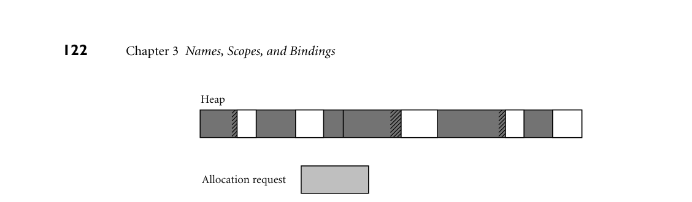
*Figure 3.2  Fragmentation. The shaded blocks are in use; the clear blocks are free. Cross­ hatched space at the ends of in-use blocks represents internal fragmentation. The discontiguous  free blocks indicate external fragmentation. While there is more than enough total free space  remaining to satisfy an allocation request of the illustrated size, no single remaining block is large  enough.*

subroutines, active or not. A stack may therefore require substantially less mem­ ory at run time than would be required for static allocation.

3.2.3 Heap-Based Allocation

A heap is a region of storage in which subblocks can be allocated and deallocated  at arbitrary times.2 Heaps are required for the dynamically allocated pieces of  linked data structures, and for objects such as fully general character strings, lists,  and sets, whose size may change as a result of an assignment statement or other  update operation.

There are many possible strategies to manage space in a heap. We review the  major alternatives here; details can be found in any data-structures textbook. The  principal concerns are speed and space, and as usual there are tradeoffs between  them. Space concerns can be further subdivided into issues of internal and ex­ ternal fragmentation. Internal fragmentation occurs when a storage-management  algorithm allocates a block that is larger than required to hold a given object; the

EXAMPLE 3.3  extra space is then unused. External fragmentation occurs when the blocks that  External fragmentation in  have been assigned to active objects are scattered through the heap in such a way  the heap  that the remaining, unused space is composed of multiple blocks: there may be  quite a lot of free space, but no one piece of it may be large enough to satisfy some  future request (see Figure 3.2).  ■  Many storage-management algorithms maintain a single linked list—the free  list—of heap blocks not currently in use. Initially the list consists of a single block  comprising the entire heap. At each allocation request the algorithm searches the  list for a block of appropriate size. With a first fit algorithm we select the frst block  on the list that is large enough to satisfy the request. With a best fit algorithm we  search the entire list to fnd the smallest block that is large enough to satisfy the

2  Unfortunately, the term “heap” is also used for the common tree-based implementation of a  priority queue. These two uses of the term have nothing to do with one another.

request. In either case, if the chosen block is signifcantly larger than required,  then we divide it into two and return the unneeded portion to the free list as a  smaller block. (If the unneeded portion is below some minimum threshold in  size, we may leave it in the allocated block as internal fragmentation.) When a  block is deallocated and returned to the free list, we check to see whether either  or both of the physically adjacent blocks are free; if so, we coalesce them.

Intuitively, one would expect a best ft algorithm to do a better job of reserving  large blocks for large requests. At the same time, it has higher allocation cost than  a frst ft algorithm, because it must always search the entire list, and it tends to  result in a larger number of very small “left-over” blocks. Which approach—frst  ft or best ft—results in lower external fragmentation depends on the distribution  of size requests.

In any algorithm that maintains a single free list, the cost of allocation is lin­ ear in the number of free blocks. To reduce this cost to a constant, some stor­ age management algorithms maintain separate free lists for blocks of different  sizes. Each request is rounded up to the next standard size (at the cost of inter­ nal fragmentation) and allocated from the appropriate list. In effect, the heap is  divided into “pools,” one for each standard size. The division may be static or  dynamic. Two common mechanisms for dynamic pool adjustment are known as  the buddy system and the Fibonacci heap. In the buddy system, the standard block  sizes are powers of two. If a block of size 2k is needed, but none is available, a  block of size 2k+1 is split in two. One of the halves is used to satisfy the request;  the other is placed on the kth free list. When a block is deallocated, it is coa­ lesced with its “buddy”—the other half of the split that created it—if that buddy  is free. Fibonacci heaps are similar, but use Fibonacci numbers for the standard  sizes, instead of powers of two. The algorithm is slightly more complex, but leads  to slightly lower internal fragmentation, because the Fibonacci sequence grows  more slowly than 2k .

The problem with external fragmentation is that the ability of the heap to sat­ isfy requests may degrade over time. Multiple free lists may help, by clustering  small blocks in relatively close physical proximity, but they do not eliminate the  problem. It is always possible to devise a sequence of requests that cannot be  satisfed, even though the total space required is less than the size of the heap. If  memory is partitioned among size pools statically, one need only exceed the maxi­ mum number of requests of a given size. If pools are dynamically readjusted, one  can “checkerboard” the heap by allocating a large number of small blocks and  then deallocating every other one, in order of physical address, leaving an alter­ nating pattern of small free and allocated blocks. To eliminate external fragmen­ tation, we must be prepared to compact the heap, by moving already-allocated  blocks. This task is complicated by the need to fnd and update all outstanding  references to a block that is being moved. We will discuss compaction further in  Section 8.5.3.

3.2.4 Garbage Collection

Allocation of heap-based objects is always triggered by some specifc operation in  a program: instantiating an object, appending to the end of a list, assigning a long  value into a previously short string, and so on. Deallocation is also explicit in  some languages (e.g., C, C++, and Rust). As we shall see in Section 8.5, however,  many languages specify that objects are to be deallocated implicitly when it is no  longer possible to reach them from any program variable. The run-time library  for such a language must then provide a garbage collection mechanism to identify  and reclaim unreachable objects. Most functional and scripting languages require  garbage collection, as do many more recent imperative languages, including Java  and C#.

The traditional arguments in favor of explicit deallocation are implementa­ tion simplicity and execution speed. Even naive implementations of automatic  garbage collection add signifcant complexity to the implementation of a lan­ guage with a rich type system, and even the most sophisticated garbage collector  can consume nontrivial amounts of time in certain programs. If the programmer  can correctly identify the end of an object’s lifetime, without too much run-time  bookkeeping, the result is likely to be faster execution.

The argument in favor of automatic garbage collection, however, is compel­ ling: manual deallocation errors are among the most common and costly bugs in  real-world programs. If an object is deallocated too soon, the program may follow  a dangling reference, accessing memory now used by another object. If an object  is not deallocated at the end of its lifetime, then the program may “leak memory,”  eventually running out of heap space. Deallocation errors are notoriously diff­ cult to identify and fx. Over time, many language designers and programmers  have come to consider automatic garbage collection an essential language feature.  Garbage-collection algorithms have improved, reducing their run-time overhead;  language implementations have become more complex in general, reducing the  marginal complexity of automatic collection; and leading-edge applications have  become larger and more complex, making the benefts of automatic collection  ever more compelling.

3CHECK YOUR UNDERSTANDING  1. What  is  binding time?  2.  Explain the distinction between decisions that are bound statically and those  that are bound dynamically.  3.  What is the advantage of binding things as early as possible? What is the  advantage of delaying bindings?  4.  Explain the distinction between the lifetime of a name-to-object binding and  its visibility.

  5.
  What determines whether an object is allocated statically, on the stack, or in
  the heap?
  6.
  List the objects and information commonly found in a stack frame.

  7.
  What
  is
  a
  frame pointer? What  is  it  used  for?
  8.
  What
  is
  a
  calling sequence?

  9.
  What are internal and external fragmentation?
* What  is  garbage collection?

* What  is  a  dangling reference?

## 3.3  Scope Rules

The textual region of the program in which a binding is active is its scope. In   most modern languages, the scope of a binding is determined statically, that is,  at  compile time.  In  C,  for  example,  we introduce  a new  scope upon entry  to  a   subroutine. We create bindings for local objects and deactivate bindings for global  objects that are hidden (made invisible) by local objects of the same name. On  subroutine exit, we destroy bindings for local variables and reactivate bindings for  any global objects that were hidden. These manipulations of bindings may at frst  glance appear to be run-time operations, but they do not require the execution of  any code: the portions of the program in which a binding is active are completely  determined at compile time. We can look at a C program and know which names  refer to which objects at which points in the program based on purely textual  rules. For this reason, C is said to be statically scoped (some authors say lexically  scoped 3). Other languages, including APL, Snobol, Tcl, and early dialects of Lisp,  are dynamically scoped: their bindings depend on the fow of execution at run  time. We will examine static and dynamic scoping in more detail in Sections 3.3.1  and 3.3.6.

In addition to talking about the “scope of a binding,” we sometimes use the  word “scope” as a noun all by itself, without a specifc binding in mind. Infor­ mally, a scope is a program region of maximal size in which no bindings change  (or at least none are destroyed—more on this in Section 3.3.3). Typically, a scope  is the body of a module, class, subroutine, or structured control-fow statement,  sometimes called a block. In C family languages it would be delimited with {...}  braces.

3  Lexical scope is actually a better term than static scope, because scope rules based on nesting can  be enforced at run time instead of compile time if desired. In fact, in Common Lisp and Scheme  it is possible to pass the unevaluated text of a subroutine declaration into some other subroutine  as a parameter, and then use the text to create a lexically nested declaration at run time.

Algol 68 and Ada use the term elaboration to refer to the process by which  declarations become active when control frst enters a scope. Elaboration entails  the creation of bindings. In many languages, it also entails the allocation of stack  space for local objects, and possibly the assignment of initial values. In Ada it  can entail a host of other things, including the execution of error-checking or  heap-space-allocating code, the propagation of exceptions, and the creation of  concurrently executing tasks (to be discussed in Chapter 13).

At any given point in a program’s execution, the set of active bindings is called  the current referencing environment. The set is principally determined by static  or dynamic scope rules. We shall see that a referencing environment generally  corresponds to a sequence of scopes that can be examined (in order) to fnd the  current binding for a given name.

In some cases, referencing environments also depend on what are (in a con­ fusing use of terminology) called binding rules. Specifcally, when a reference to a  subroutine S is stored in a variable, passed as a parameter to another subroutine,  or returned as a function value, one needs to determine when the referencing en­ vironment for S is chosen—that is, when the binding between the reference to  S and the referencing environment of S is made. The two principal options are  deep binding, in which the choice is made when the reference is frst created, and  shallow binding, in which the choice is made when the reference is fnally used.  We will examine these options in more detail in Section 3.6.

3.3.1 Static Scoping

In a language with static (lexical) scoping, the bindings between names and ob­ jects can be determined at compile time by examining the text of the program,  without consideration of the fow of control at run time. Typically, the “current”  binding for a given name is found in the matching declaration whose block most  closely surrounds a given point in the program, though as we shall see there are  many variants on this basic theme.

The simplest static scope rule is probably that of early versions of Basic, in  which there was only a single, global scope. In fact, there were only a few hundred  possible names, each of which consisted of a letter optionally followed by a digit.  There were no explicit declarations; variables were declared implicitly by virtue  of being used.

Scope rules are somewhat more complex in (pre-Fortran 90) Fortran, though  not much more. Fortran distinguishes between global and local variables. The  scope of a local variable is limited to the subroutine in which it appears; it is not  visible elsewhere. Variable declarations are optional. If a variable is not declared,  it is assumed to be local to the current subroutine and to be of type integer if its  name begins with the letters I–N, or real otherwise. (Different conventions for  implicit declarations can be specifed by the programmer. In Fortran 90 and its  successors, the programmer can also turn off implicit declarations, so that use of  an undeclared variable becomes a compile-time error.)

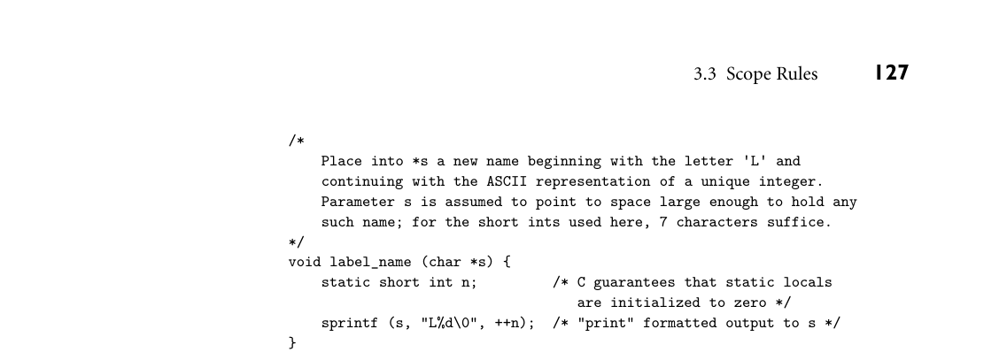
*Figure 3.3  C code to illustrate the use of static variables.*

Semantically, the lifetime of a local Fortran variable (both the object itself and  the name-to-object binding) encompasses a single execution of the variable’s sub­ routine. Programmers can override this rule by using an explicit save statement.  (Similar mechanisms appear in many other languages: in C one declares the vari­ able static; in Algol one declares it own.) A save-ed (static, own) variable has  a lifetime that encompasses the entire execution of the program. Instead of a log­ ically separate object for every invocation of the subroutine, the compiler creates  a single object that retains its value from one invocation of the subroutine to the  next. (The name-to-variable binding, of course, is inactive when the subroutine  is not executing, because the name is out of scope.)

EXAMPLE 3.4  As an example of the use of static variables, consider the code in Figure 3.3.  Static variables in C  The subroutine label_name can be used to generate a series of distinct character- string names: L1, L2, .... A compiler might use these names in its assembly  language output.  ■

3.3.2 Nested Subroutines

The ability to nest subroutines inside each other, introduced in Algol 60, is a fea­ ture of many subsequent languages, including Ada, ML, Common Lisp, Python,  Scheme, Swift, and (to a limited extent) Fortran 90. Other languages, including C  and its descendants, allow classes or other scopes to nest. Just as the local variables  of a Fortran subroutine are not visible to other subroutines, any constants, types,  variables, or subroutines declared within a scope are not visible outside that scope  in Algol-family languages. More formally, Algol-style nesting gives rise to the clos­ est nested scope rule for bindings from names to objects: a name that is introduced  in a declaration is known in the scope in which it is declared, and in each inter­ nally nested scope, unless it is hidden by another declaration of the same name in  one or more nested scopes. To fnd the object corresponding to a given use of a  name, we look for a declaration with that name in the current, innermost scope.  If there is one, it defnes the active binding for the name. Otherwise, we look  for a declaration in the immediately surrounding scope. We continue outward,

examining successively surrounding scopes, until we reach the outer nesting level  of the program, where global objects are declared. If no declaration is found at  any level, then the program is in error.

Many languages provide a collection of built-in, or  predefined objects, such  as   I/O routines, mathematical functions, and in some cases types such as integer  and char. It is common to consider these to be declared in an extra, invisible,  outermost scope, which surrounds the scope in which global objects are declared.  The search for bindings described in the previous paragraph terminates at this ex­ tra, outermost scope, if it exists, rather than at the scope in which global objects  are declared. This outermost scope convention makes it possible for a program­ mer to defne a global object whose name is the same as that of some predefned  object (whose “declaration” is thereby hidden, making it invisible).

EXAMPLE 3.5  An example of nested scopes appears in Figure 3.4.4 In this example, procedure  Nested scopes  P2 is called only by P1, and need not be visible outside. It is therefore declared  inside P1, limiting its scope (its region of visibility) to the portion of the program  shown here. In a similar fashion, P4 is visible only within P1, P3 is visible only  within P2, and  F1 is visible only within P4. Under the standard rules for nested  scopes, F1 could call P2 and P4 could call F1, but  P2 could not call F1.  Though they are hidden from the rest of the program, nested subroutines are  able to access the parameters and local variables (and other local objects) of the  surrounding scope(s). In our example, P3 can name (and modify) A1, X, and  A2,  in addition to A3. Because  P1 and F1 both declare local variables named X, the   inner declaration hides the outer one within a portion of its scope. Uses of X in F1  refer to the inner X; uses  of  X in other regions of the code refer to the outer X. ■

A name-to-object binding that is hidden by a nested declaration of the same  name is said to have a hole in its scope. In some languages, the object whose name  is hidden is simply inaccessible in the nested scope (unless it has more than one  name). In others, the programmer can access the outer meaning of a name by  applying a qualifier or scope resolution operator. In Ada, for example, a name may  be prefxed by the name of the scope in which it is declared, using syntax that  resembles the specifcation of felds in a record. My_proc.X, for  example,  refers   to the declaration of X in subroutine My_proc, regardless of whether some other  X has been declared in a lexically closer scope. In C++, which does not allow  subroutines to nest, ::X refers to a global declaration of X, regardless of whether  the current subroutine also has an X.5

Access to Nonlocal Objects

We have already seen (Section 3.2.2) that the compiler can arrange for a frame  pointer register to point to the frame of the currently executing subroutine at run

4  This code is not contrived; it was extracted from an implementation (originally in Pascal) of the  FMQ error repair algorithm described in Section C 2.3.5.

5  The C++ :: operator is also used to name members (felds or methods) of a base class that are  hidden by members of a derived class; we will consider this use in Section 10.2.2.

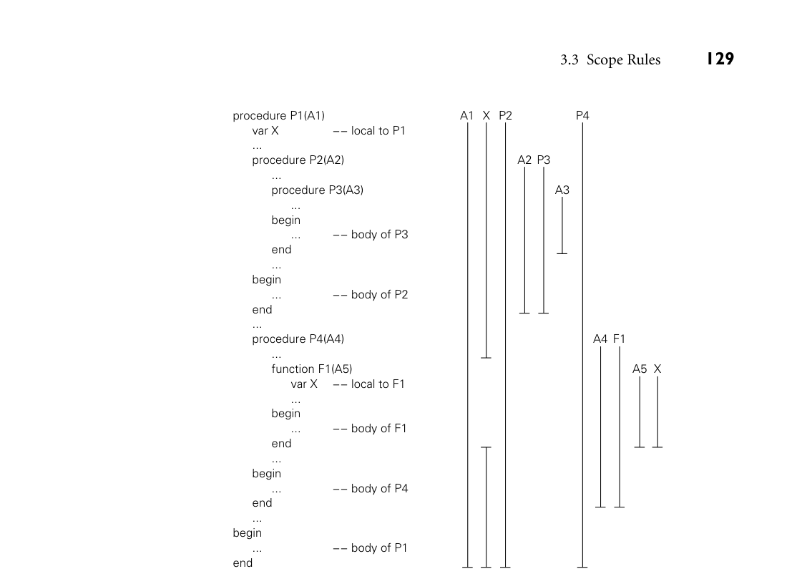
*Figure 3.4  Example of nested subroutines, shown in pseudocode. Vertical bars indicate the  scope of each name, for a language in which declarations are visible throughout their subroutine.  Note the hole in the scope of the outer X.*

time. Using this register as a base for displacement (register plus offset) address­ ing, target code can access objects within the current subroutine. But what about  objects in lexically surrounding subroutines? To fnd these we need a way to fnd  the frames corresponding to those scopes at run time. Since a nested subroutine  may call a routine in an outer scope, the order of stack frames at run time may not  necessarily correspond to the order of lexical nesting. Nonetheless, we can be sure  that there is some frame for the surrounding scope already in the stack, since the  current subroutine could not have been called unless it was visible, and it could  not have been visible unless the surrounding scope was active. (It is actually pos­ sible in some languages to save a reference to a nested subroutine, and then call  it when the surrounding scope is no longer active. We defer this possibility to  Section 3.6.2.)

The simplest way in which to fnd the frames of surrounding scopes is to main­ tain a static link in each frame that points to the “parent” frame: the frame of the

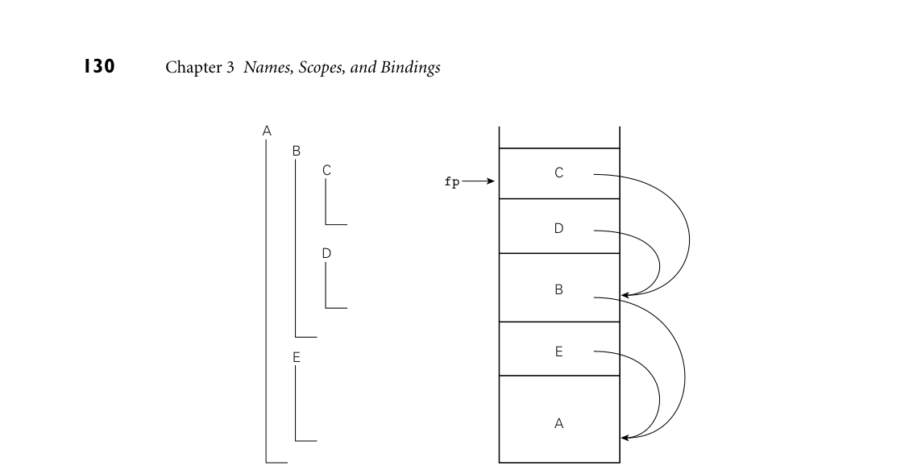
*Figure 3.5  Static chains. Subroutines A, B, C, D, and  E are nested as shown on the left. If the  sequence of nested calls at run time is A, E, B, D, and  C, then the static links in the stack will  look as shown on the right. The code for subroutine C can fnd local objects at known offsets  from the frame pointer. It can fnd local objects of the surrounding scope, B, by dereferencing its  static chain once and then applying an offset. It can fnd local objects in B’s surrounding scope,  A, by dereferencing its static chain twice and then applying an offset.*

most recent invocation of the lexically surrounding subroutine. If a subroutine is  declared at the outermost nesting level of the program, then its frame will have a  null static link at run time. If a subroutine is nested k levels deep, then its frame’s  static link, and those of its parent, grandparent, and so on, will form a static chain  of length k at run time. To fnd a variable or parameter declared j subroutine  scopes outward, target code at run time can dereference the static chain j times,

EXAMPLE 3.6  and then add the appropriate offset. Static chains are illustrated in Figure 3.5. We  Static chains  will discuss the code required to maintain them in Section 9.2.  ■

## 3.3.3 Declaration Order

In our discussion so far we have glossed over an important subtlety: suppose an  object x is declared somewhere within block B. Does the scope of x include the  portion of B before the declaration, and if so can x actually be used in that portion  of the code? Put another way, can an expression E refer to any name declared in  the current scope, or only to names that are declared before E in the scope?

Several early languages, including Algol 60 and Lisp, required that all declara­ tions appear at the beginning of their scope. One might at frst think that this rule

would avoid the questions in the preceding paragraph, but it does not, because  declarations may refer to one another.6

EXAMPLE 3.7

In an apparent attempt to simplify the implementation of the compiler, Pas­ cal modifed the requirement to say that names must be declared before they are  used. There are special mechanisms to accommodate recursive types and sub­ routines, but in general, a forward reference (an attempt to use a name before its  declaration) is a static semantic error. At the same time, however, Pascal retained  the notion that the scope of a declaration is the entire surrounding block. Taken  together, whole-block scope and declare-before-use rules can interact in surpris­ ing ways:

A “gotcha” in  declare-before-use

  1.
  const N = 10;
  2.
  ...
  3.
  procedure foo;
  4.
  const
  5.
  M = N;
  (* static semantic error! *)
  6.
  ...
  7.
  N = 20;
  (* local constant declaration; hides the outer N *)

Pascal says that the second declaration of N covers all of foo, so  the  semantic   analyzer should complain on line 5 that N is being used before its declaration.  The error has the potential to be highly confusing, particularly if the programmer  meant to use the outer N:

const N = 10;   ...  procedure foo;  const

M = N;  (* static semantic error! *)  var

A : array [1..M] of integer;  N : real;  (* hiding declaration *)

Here the pair of messages “N used before declaration” and “N is not a constant”  are almost certainly not helpful.

DESIGN & IMPLEMENTATION

3.3 Mutual recursion  Some Algol 60 compilers were known to process the declarations of a scope in  program order. This strategy had the unfortunate effect of implicitly outlawing  mutually recursive subroutines and types, something the language designers  clearly did not intend [Atk73].

6  We saw an example of mutually recursive subroutines in the recursive descent parsing of Sec­ tion 2.3.1. Mutually recursive types frequently arise in linked data structures, where nodes of two  types may need to point to each other.

In order to determine the validity of any declaration that appears to use a  name from a surrounding scope, a Pascal compiler must scan the remainder of  the scope’s declarations to see if the name is hidden. To avoid this complication,  most Pascal successors (and some dialects of Pascal itself) specify that the scope of  an identifer is not the entire block in which it is declared (excluding holes), but  rather the portion of that block from the declaration to the end (again excluding  holes). If our program fragment had been written in Ada, for example, or in C,  C++, or Java, no semantic errors would be reported. The declaration of M would  refer to the frst (outer) declaration of N.  ■  C++ and Java further relax the rules by dispensing with the defne-before-use  requirement in many cases. In both languages, members of a class (including  those that are not defned until later in the program text) are visible inside all  of the class’s methods. In Java, classes themselves can be declared in any order.

EXAMPLE 3.8  Interestingly, while C# echos Java in requiring declaration before use for local  Whole-block scope in C#  variables (but not for classes and members), it returns to the Pascal notion of  whole-block scope. Thus the following is invalid in C#:

class A {  const int N = 10;  void foo() {

const int M = N;  // uses inner N before it is declared  const int N = 20;  ■

Perhaps the simplest approach to declaration order, from a conceptual point  of view, is that of Modula-3, which says that the scope of a declaration is the en­ tire block in which it appears (minus any holes created by nested declarations),  and that the order of declarations doesn’t matter. The principal objection to this  approach is that programmers may fnd it counterintuitive to use a local variable

EXAMPLE 3.9  before it is declared. Python takes the “whole block” scope rule one step further  “Local if written” in Python  by dispensing with variable declarations altogether. In their place it adopts the  unusual convention that the local variables of subroutine S are precisely those  variables that are written by some statement in the (static) body of S. If  S is  nested inside of T, and  the  name  x appears on the left-hand side of assignment  statements in both S and T, then the x’s are distinct: there is one in S and one  in T. Non-local variables are read-only unless explicitly imported (using Python’s  global statement). We will consider these conventions in more detail in Sec­ tion 14.4.1, as part of a general discussion of scoping in scripting languages.  ■

EXAMPLE 3.10  In the interest of fexibility, modern Lisp dialects tend to provide several op- Declaration order in  tions for declaration order. In Scheme, for example, the letrec and let* con- Scheme  structs defne scopes with, respectively, whole-block and declaration-to-end-of­ block semantics. The most frequently used construct, let, provides  yet  another   option:

(let ((A 1))  ; outer scope, with A defined to be 1  (let ((A 2)  ; inner scope, with A defined to be 2  (B A))  ;  and B defined to be A  B))  ; return the value of B

Here the nested declarations of A and B don’t take effect until after the end of the  declaration list. Thus when B is defned, the redefnition of A has not yet taken  effect. B is defned to be the outer A, and the code as a whole returns 1.  ■

Declarations and Definitions

Recursive types and subroutines introduce a problem for languages that require  names to be declared before they can be used: how can two declarations each  appear before the other? C and C++ handle the problem by distinguishing be­ tween the declaration of an object and its definition. A declaration introduces a  name and indicates its scope, but may omit certain implementation details. A  defnition describes the object in suffcient detail for the compiler to determine  its implementation. If a declaration is not complete enough to be a defnition,  then a separate defnition must appear somewhere else in the scope. In C we can  write

EXAMPLE 3.11

Declarations vs definitions  in C

struct manager;  /* declaration only */  struct employee {

struct manager *boss;  struct employee *next_employee;  ...  };  struct manager {  /* definition */  struct employee *first_employee;  ...  };

and

void list_tail(follow_set fs);  /* declaration only */  void list(follow_set fs)  {

switch (input_token) {

case id : match(id); list_tail(fs);  ...  }  void list_tail(follow_set fs)  /* definition */  {

switch (input_token) {

case comma : match(comma); list(fs);  ...  }

The initial declaration of manager needed only to introduce a name: since point­ ers are generally all the same size, the compiler can determine the implementa­ tion of employee without knowing any manager details. The initial declaration  of list_tail, however, must include the return type and parameter list, so the  compiler can tell that the call in list is correct.  ■

Nested Blocks

In many languages, including Algol 60, C89, and Ada, local variables can be de­ clared not only at the beginning of any subroutine, but also at the top of any  begin... end ({...}) block. Other languages, including Algol 68, C, and all of  C’s descendants, are even more fexible, allowing declarations wherever a state­ ment may appear. In most languages a nested declaration hides any outer dec­ laration with the same name (Java and C# make it a static semantic error if the  outer declaration is local to the current subroutine).

DESIGN & IMPLEMENTATION

3.4 Redeclarations  Some languages, particularly those that are intended for interactive use, permit  the programmer to redeclare an object: to create a new binding for a given  name in a given scope. Interactive programmers commonly use redeclarations  to experiment with alternative implementations or to fx bugs during early  development. In most interactive languages, the new meaning of the name  replaces the old in all contexts. In ML dialects, however, the old meaning of  the name may remain accessible to functions that were elaborated before the  name was redeclared. This design choice can sometimes be counterintuitive.  Here’s an example in OCaml (the lines beginning with # are user input; the  others are printed by the interpreter):

# let x = 1;;   val x : int = 1   # let f y = x + y;;   val f : int -> int = <fun>  # let x = 2;;   val x : int = 2   # f 3;;   - : int = 4

The second line of  user input  defnes  f to be a function of one argument (y)  that returns the sum of that argument and the previously defned value x.  When we redefne x to be 2, however, the function does not notice: it still  returns y plus 1. This behavior refects the fact that OCaml is usually com­ piled, bit by bit on the fy, rather than interpreted. When x is redefned, f  has already been compiled into a form (bytecode or machine code) that ac­ cesses the old meaning of x directly. By comparison, a language like Scheme,  which is lexically scoped but usually interpreted, stores the bindings for names  in known locations. Programs always access the meanings of names indirectly  through those locations: if the meaning of a name changes, all accesses to the  name will use the new meaning.

EXAMPLE 3.12  Variables declared in nested blocks can be very useful, as for example in the  Inner declarations in C  following C code:

{  int temp = a;   a =  b;   b = temp;  }

Keeping the declaration of temp lexically adjacent to the code that uses it makes  the program easier to read, and eliminates any possibility that this code will in­ terfere with another variable named temp.  ■  No run-time work is needed to allocate or deallocate space for variables de­ clared in nested blocks; their space can be included in the total space for local  variables allocated in the subroutine prologue and deallocated in the epilogue.  Exercise 3.9 considers how to minimize the total space required.

3CHECK YOUR UNDERSTANDING  12. What do we mean by the scope of a name-to-object binding?

* Describe the difference between static and dynamic scoping.
* What  is  elaboration?

* What  is  a  referencing environment?
* Explain  the  closest nested scope rule.
* What is the purpose of a scope resolution operator?

* What  is  a  static chain? What  is  it  used  for?
* What  are  forward references? Why are they prohibited or restricted in many

programming languages?  20. Explain the difference between a declaration and a definition. Why is the dis­

tinction important?

3.3.4 Modules

An important challenge in the construction of any large body of software is to  divide the effort among programmers in such a way that work can proceed on  multiple fronts simultaneously. This modularization of effort depends critically  on the notion of information hiding, which makes objects and algorithms invisi­ ble, whenever possible, to portions of the system that do not need them. Properly  modularized code reduces the “cognitive load” on the programmer by minimiz­ ing the amount of information required to understand any given portion of the

system. In a well-designed program the interfaces among modules are as “nar­ row” (i.e., simple) as possible, and any design decision that is likely to change is  hidden inside a single module.

Information hiding is crucial for software maintenance (bug fxes and en­ hancement), which tends to signifcantly outweigh the cost of initial development  for most commercial software. In addition to reducing cognitive load, hiding re­ duces the risk of name conficts: with fewer visible names, there is less chance  that a newly introduced name will be the same as one already in use. It also safe­ guards the integrity of data abstractions: any attempt to access an object outside  of the module to which it belongs will cause the compiler to issue an “undefned  symbol” error message. Finally, it helps to compartmentalize run-time errors: if a  variable takes on an unexpected value, we can generally be sure that the code that  modifed it is in the variable’s scope.

Encapsulating Data and Subroutines

Unfortunately, the information hiding provided by nested subroutines is limited  to objects whose lifetime is the same as that of the subroutine in which they are  hidden. When control returns from a subroutine, its local variables will no longer  be live: their values will be discarded. We have seen a partial solution to this  problem in the form of the save statement in Fortran and the static and own  variables of C and Algol.

Static variables allow a subroutine to have “memory”—to retain information  from one invocation to the next—while protecting that memory from acciden­ tal access or modifcation by other parts of the program. Put another way, static  variables allow programmers to build single-subroutine abstractions. Unfortu­ nately, they do not allow the construction of abstractions whose interface needs

EXAMPLE 3.13  to consist of more than one subroutine. Consider, for example, a simple pseudo- Pseudorandom numbers as  random number generator. In addition to the main rand_int routine, we might  a motivation for modules  want a set_seed routine that primes the generator for a specifc pseudorandom  sequence (e.g., for deterministic testing). We should like to make the state of  the generator, which determines the next pseudorandom number, visible to both  rand_int and set_seed, but hide it from the rest of the program. We can  achieve this goal in many languages through use of a module construct.  ■

Modules as Abstractions

A module allows a collection of objects—subroutines, variables, types, and so  on—to be encapsulated in such a way that (1) objects inside are visible to each  other, but (2) objects on the inside may not be visible on the outside unless they  are exported, and (3) objects on the outside may not be visible on the inside un­ less they are imported. Import and export conventions vary signifcantly from  one language to another, but in all cases, only the visibility of objects is affected;  modules do not affect the lifetime of the objects they contain.

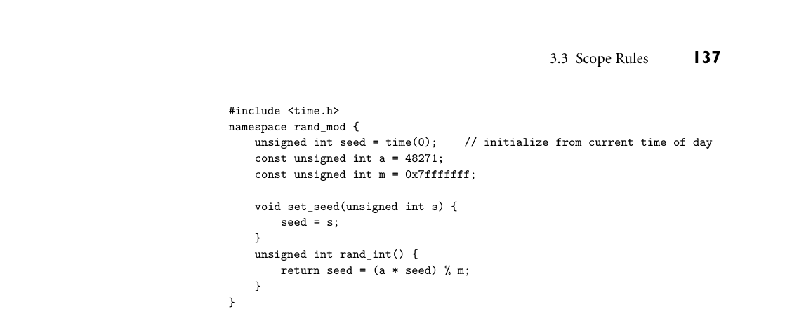
*Figure 3.6  Pseudorandom number generator module in C++. Uses the linear congruential  method, with a default seed taken from the current time of day. While there exist much better  (more random) generators, this one is simple, and acceptable for many purposes.*

Modules were one of the principal language innovations of the late 1970s and  early 1980s; they appeared in Clu7 (which called them clusters), Modula (1, 2,  and 3), Turing, and Ada 83, among others. In more modern form, they also  appear in Haskell, C++, Java, C#, and all the major scripting languages. Several  languages, including Ada, Java, and Perl, use the term package instead of module.  Others, including C++, C#, and PHP, use namespace. Modules can be emulated  to some degree through use of the separate compilation facilities of C; we discuss  this possibility in Section C 3.8.

EXAMPLE 3.14  As an example of the use of modules, consider the pseudorandom number  Pseudorandom number  generator shown in Figure 3.6. As discussed in Sidebar 3.5, this module (names­ generator in C++  pace) would typically be placed in its own fle, and then imported wherever it is  needed in a C++ program.

Bindings of names made inside the namespace may be partially or totally hid­ den (inactive) on the outside—but not destroyed. In C++, where namespaces can  appear only at the outermost level of lexical nesting, integer seed would retain its  value throughout the execution of the program, even though it is visible only to  set_seed and rand_int.

Outside the rand_mod namespace, C++ allows set_seed and rand_int to be  accessed as rand_mod::set_seed and rand_mod::rand_int. The  seed variable  could also be accessed as rand_mod::seed, but this is probably not a good idea,  and the need for the rand_mod prefx means it’s unlikely to happen by accident.

7  Barbara Liskov (1939–), the principal designer of Clu, is one of the leading fgures in the history  of abstraction mechanisms. A faculty member at MIT since 1971, she was also the principal de­ signer of the Argus programming language, which combined language and database technology  to improve the reliability and programmability of distributed systems. She received the ACM  Turing Award in 2008.

The need for the prefx can be eliminated, on a name-by-name basis, with a using  directive:

using rand_mod::rand_int;  ...  int r = rand_int();

Alternatively, the full set of names declared in a namespace can be made available  at once:

using namespace rand_mod;  ...  set_seed(12345);  int r = rand_int();

Unfortunately, such wholesale exposure of a module’s names increases both the  likelihood of confict with names in the importing context and the likelihood  that objects like seed,  which  are logically  private to  the  module, will  be accessed   accidentally.  ■

Imports and Exports

Some languages allow the programmer to specify that names exported from mod­ ules be usable only in restricted ways. Variables may be exported read-only, for  example, or types may be exported opaquely, meaning that variables of that type  may be declared, passed as arguments to the module’s subroutines, and possibly  compared or assigned to one another, but not manipulated in any other way.

Modules into which names must be explicitly imported are said to be closed  scopes. By extension, modules that do not require imports are said to be open  scopes. Imports serve to document the program: they increase modularity by  requiring a module to specify the ways in which it depends on the rest of the pro­ gram. They also reduce name conficts by refraining from importing anything  that isn’t needed. Modules are closed in Modula (1, 2, and 3) and Haskell. C++  is representative of an increasingly common option, in which names are auto­ matically exported, but are available on the outside only when qualified with the  module name—unless they are explicitly “imported” by another scope (e.g., with  the C++ using directive), at which point they are available unqualifed. This op­ tion, which we might call selectively open modules, also appears in Ada, Java, C#,  and Python, among others.

Modules as Managers

Modules facilitate the construction of abstractions by allowing data to be made  private to the subroutines that use them. When used as in Figure 3.6, however,

EXAMPLE 3.15  each module defnes a single abstraction. Continuing our previous example, there  Module as “manager” for a  are times when it may be desirable to have more than one pseudorandom num­ type  ber generator. When debugging a game, for example, we might want to obtain  deterministic (repeatable) behavior in one particular game module (a particular

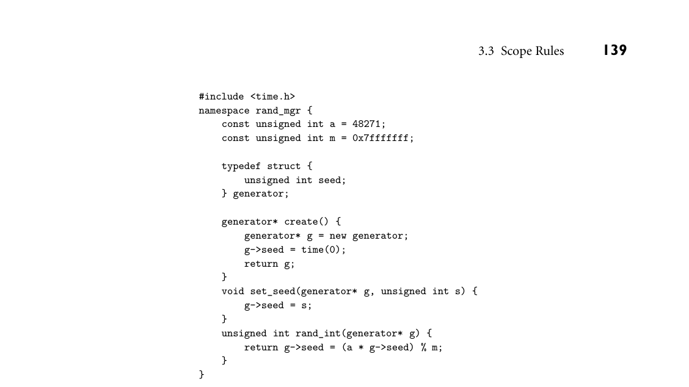
*Figure 3.7  Manager module for pseudorandom numbers in C++.*

character, perhaps), regardless of uses of pseudorandom numbers elsewhere in  the program. If we want to have several generators, we can make our namespace  a “manager” for instances of a generator type, which is then exported from the  module, as shown in Figure 3.7. The manager idiom requires additional subrou­ tines to create/initialize and possibly destroy generator instances, and it requires  that every subroutine (set_seed, rand_int, create) take an extra parameter,  to specify the generator in question.

Given the declarations in Figure 3.7, we could create and use an arbitrary num­ ber of generators:

using rand_mgr::generator;  generator *g1 = rand_mgr::create();  generator *g2 = rand_mgr::create();  ...  using rand_mgr::rand_int;  int r1 = rand_int(g1);  int r2 = rand_int(g2);

In more complex programs, it may make sense for a module to export several  related types, instances of which can then be passed to its subroutines.  ■

## 3.3.5 Module Types and Classes

An alternative solution to the multiple instance problem appeared in Eu­ clid, which treated each module as a type, rather than a simple encapsulation

construct. Given a module type, the programmer could declare an arbitrary  number of similar module objects. As it turns out, the classes of modern object- oriented languages are an extension of module types. Access to a module instance  typically looks like access to an object, and we can illustrate the ideas in any

EXAMPLE 3.16  object-oriented language. For our C++ pseudorandom number example, the  A pseudorandom number  syntax  generator type

generator *g = rand_mgr::create();  ...  int r = rand_int(g);

might be replaced by

rand_gen *g = new rand_gen();  ...  int r = g->rand_int();

where the rand_gen class is declared as in Figure 3.8. Module types or classes  allow the programmer to think of the rand_int routine as “belonging to” the  generator, rather than as a separate entity to which the generator must be passed

DESIGN & IMPLEMENTATION

3.5 Modules and separate compilation  One of the hallmarks of a good abstraction is that it tends to be useful in multi­ ple contexts. To facilitate code reuse, many languages make modules the basis  of separate compilation. Modula-2 actually provided two different kinds of  modules: one (external modules) for separate compilation, the other (internal  modules) for textual nesting within a larger scope. Experience with these op­ tions eventually led Niklaus Wirth, the designer of Modula-2, to conclude that  external  modules were  by far  the more useful  variety;  he omitted  the internal   version from his subsequent language, Oberon. Many would argue, however,  that internal modules fnd their real utility only when extended with instan­ tiation and inheritance. Indeed, as noted near the end of this section, many  object-oriented languages provide both modules and classes. The former sup­ port separate compilation and serve to minimize name conficts; the latter are  for data abstraction.

To facilitate separate compilation, modules in many languages (Modula-2  and Oberon among them) can be divided into a declaration part (header) and   an implementation part (body), each of which occupies a separate fle. Code  that uses the exports of a given module can be compiled as soon as the header  exists; it is not dependent on the body. In particular, work on the bodies of  cooperating modules can proceed concurrently once the headers exist. We will  return to the subjects of separate compilation and code reuse in Sections C  and 10.1, respectively.

3.8

*Figure 3.8  Pseudorandom number generator class in C++.*

as an argument. Conceptually, there is a dedicated rand_int routine for every  generator (rand_gen object). In practice, of course, it would be highly wasteful  to create multiple copies of the code. As we shall see in Chapter 10, rand_gen  instances really share a single pair of set_seed and rand_int routines, and the  compiler arranges for a pointer to the relevant instance to be passed to the routine  as an extra, hidden parameter. The implementation turns out to be very similar  to that of Figure 3.7, but the programmer need not think of it that way.  ■

Object Orientation

The difference between module types and classes is a powerful pair of features  found together in the latter but not the former—namely, inheritance and dynamic

8 method dispatch.  Inheritance allows new classes to be defned as extensions or  refnements of existing classes. Dynamic method dispatch allows a refned class  to override the defnition of an operation in its parent class, and for the choice  among defnitions to be made at run time, on the basis of whether a particular  object belongs to the child class or merely to the parent.

Inheritance facilitates a programming style in which all or most operations are  thought of as belonging to objects, and in which new objects can inherit many of  their operations from existing objects, without the need to rewrite code. Classes  have their roots in Simula-67, and were further developed in Smalltalk. They ap­ pear in many modern languages, including Eiffel, OCaml, C++, Java, C#, and sev­ eral scripting languages, notably Python and Ruby. Inheritance mechanisms can  also be found in certain languages that are not usually considered object-oriented,  including Modula-3, Ada 95, and Oberon. We will examine inheritance, dynamic  dispatch, and their impact on scope rules in Chapter 10 and in Section 14.4.4.

8  A few languages—notablymembers of the ML family—havemodule types with inheritance—but  still without dynamic method dispatch. Modules in most languages are missing both features.

Module types and classes (ignoring issues related to inheritance) require only  simple changes to the scope rules defned for modules in Section 3.3.4. Every  instance A of a module type or class (e.g., every rand_gen) has a separate copy  of the module or class’s variables. These variables are then visible when executing  one of A’s operations. They may also be indirectly visible to the operations of  some other instance B if A is passed as a parameter to one of those operations.  This rule makes it possible in most object-oriented languages to construct binary  (or more-ary) operations that can manipulate the variables (felds) of more than  one instance of a class.

Modules Containing Classes

While there is a clear progression from modules to module types to classes, it is  not necessarily the case that classes are an adequate replacement for modules in

EXAMPLE 3.17  all cases. Suppose we are developing an interactive “frst person” game. Class  Modules and classes in a  hierarchies may be just what we need to represent characters, possessions, build- large application  ings, goals, and a host of other data abstractions. At the same time, especially on  a project with a large team of programmers, we will probably want to divide the  functionality of the game into large-scale subsystems such as graphics and ren­ dering, physics, and strategy. These subsystems are really not data abstractions,  and we probably don’t want the option to create multiple instances of them. They  are naturally captured with traditional modules, particularly if those modules are  designed for separate compilation (Section 3.8). Recognizing the need for both  multi-instance abstractions and functional subdivision, many languages, includ­ ing  C++,  Java, C#,  Python, and  Ruby, provide  separate  class  and  module  mecha­ nisms.  ■

## 3.3.6 Dynamic Scoping

In a language with dynamic scoping, the bindings between names and objects  depend on the fow of control at run time, and in particular on the order in which  subroutines are called. In comparison to the static scope rules discussed in the  previous section, dynamic scope rules are generally quite simple: the “current”  binding for a given name is the one encountered most recently during execution,  and not yet destroyed by returning from its scope.

Languages with dynamic scoping include APL, Snobol, Tcl, TEX (the  type­ setting language with which this book was created), and early dialects of Lisp  [MAE+65, Moo78, TM81] and Perl.9 Because the fow of control cannot in gen­ eral be predicted in advance, the bindings between names and objects in a lan­ guage with dynamic scoping cannot in general be determined by a compiler. As a

9  Scheme and Common Lisp are statically scoped, though the latter allows the programmer to  specify dynamic scoping for individual variables. Static scoping was added to Perl in version 5;  the programmer now chooses static or dynamic scoping explicitly in each variable declaration.  (We consider this choice in more detail in Section 14.4.1.)

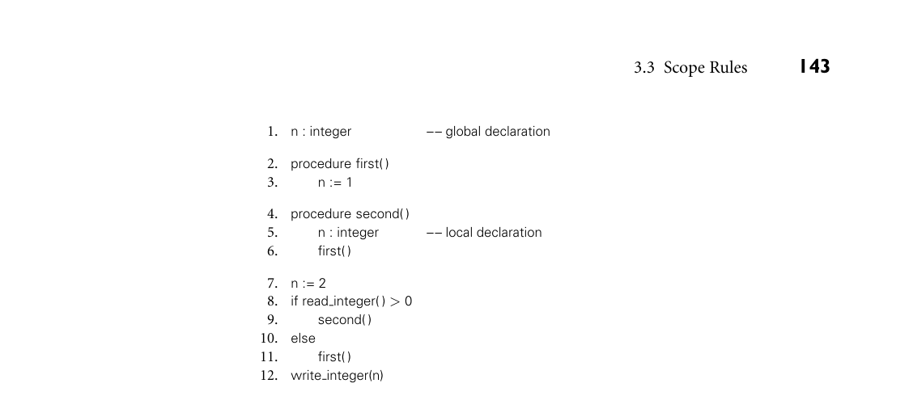
*Figure 3.9  Static versus dynamic scoping. Program output depends on both scope rules and,  in the case of dynamic scoping, a value read at run time.*

result, many semantic rules in a language with dynamic scoping become a matter  of dynamic semantics rather than static semantics. Type checking in expressions  and argument checking in subroutine calls, for example, must in general be de­ ferred until run time. To accommodate all these checks, languages with dynamic  scoping tend to be interpreted, rather than compiled.

EXAMPLE 3.18  Consider the program in Figure 3.9. If static scoping is in effect, this program  Static vs dynamic scoping  prints a 1. If dynamic scoping is in effect, the output depends on the value read  at line 8 at run time: if the input is positive, the program prints a 2; otherwise it  prints a 1. Why the difference? At issue is whether the assignment to the variable  n at line 3 refers to the global variable declared at line 1 or to the local variable  declared at line 5. Static scope rules require that the reference resolve to the closest  lexically enclosing declaration, namely the global n. Procedure frst changes n to  1, and line 12 prints this value. Dynamic scope rules, on the other hand, require  that we choose the most recent, active binding for n at run time.

DESIGN & IMPLEMENTATION

3.6 Dynamic scoping  It is not entirely clear whether the use of dynamic scoping in Lisp and other  early interpreted languages was deliberate or accidental. One reason to think  that it may have been deliberate is that it makes it very easy for an interpreter to  look up the meaning of a name: all that is required is a stack of declarations (we  examine this stack more closely in Section C 3.4.2). Unfortunately, this simple  implementation has a very high run-time cost, and experience indicates that  dynamic scoping makes programs harder to understand. The modern consen­ sus seems to be that dynamic scoping is usually a bad idea (see Exercise 3.17  and Exploration 3.36 for two exceptions).

We create a binding for n when we enter the main program. We create another  when and if we enter procedure second. When we execute the assignment state­ ment at line 3, the n to which we are referring will depend on whether we entered  frst through second or directly from the main program. If we entered through  second,  we will  assign  the value  1 to  second’s local n. If we entered from the  main program, we will assign the value 1 to the global n. In  either  case,  the  write   at line 12 will refer to the global n, since  second’s local n will be destroyed, along  with its binding, when control returns to the main program.  ■

EXAMPLE 3.19  With dynamic scoping, errors associated with the referencing environment  Run-time errors with  may not be detected until run time. In Figure 3.10, for example, the declara­ dynamic scoping  tion of local variable max score in procedure foo accidentally redefnes a global  variable used by function scaled score, which is then called from foo. Since  the   global max score is an integer, while the local max score is a foating-point num­ ber, dynamic semantic checks in at least some languages will result in a type clash  message at run time. If the local max score had been an integer, no error would  have been detected, but the program would almost certainly have produced in­ correct results. This sort of error can be very hard to fnd.  ■

## 3.4  Implementing Scope

To keep track of the names in a statically scoped program, a compiler relies on a  data abstraction called a symbol table. In essence, the symbol table is a dictionary:  it maps names to the information the compiler knows about them. The most ba­ sic operations are to insert a new mapping (a name-to-object binding) or to look  up the information that is already present for a given name. Static scope rules add  complexity by allowing a given name to correspond to differentobjects—and thus  to different information—in different parts of the program. Most variations on  static scoping can be handled by augmenting a basic dictionary-style symbol table  with enter scope and leave scope operations to keep track of visibility. Nothing  is ever deleted from the table; the entire structure is retained throughout compi­ lation, and then saved for use by debuggers or run-time refection (type lookup)  mechanisms.

In a language with dynamic scoping, an interpreter (or the output of a com­ piler) must perform operations analogous to symbol table insert and lookup at  run time. In principle, any organization used for a symbol table in a compiler  could be used to track name-to-object bindings in an interpreter, and vice versa.  In practice, implementations of dynamic scoping tend to adopt one of two spe­ cifc organizations: an association list or a central reference table.

IN MORE DEPTH

A symbol table with visibility support can be implemented in several different  ways. One appealing approach, due to LeBlanc and Cook [CL83], is described on  the companion site, along with both association lists and central reference tables.

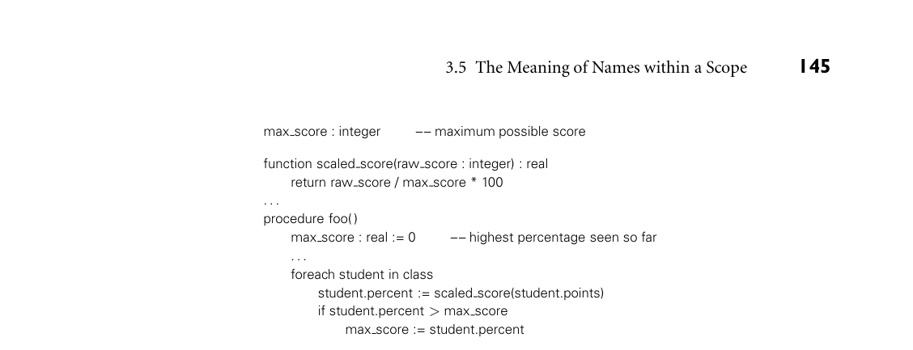
*Figure 3.10  The problem with dynamic scoping. Procedure scaled score probably does not  do what the programmer intended when dynamic scope rules allow procedure foo to change  the meaning of max score.*

An association list (or A-list for short) is simply a list of name/value pairs.  When used to implement dynamic scoping it functions as a stack: new declara­ tions are pushed as they are encountered, and popped at the end of the scope in  which they appeared. Bindings are found by searching down the list from the top.  A central reference table avoids the need for linear-time search by maintaining  an explicit mapping from names to their current meanings. Lookup is faster, but  scope entry and exit are somewhat more complex, and it becomes substantially  more diffcult to save a referencing environment for future use (we discuss this  issue further in Section 3.6.1).

## 3.5  The Meaning of Names within a Scope

So far in our discussion of naming and scopes we have assumed that there is  a one-to-one mapping between names and visible objects at any given point in  a program. This need not be the case. Two or more names that refer to the  same object at the same point in the program are said to be aliases. A  name   that can refer to more than one object at a given point in the program is said  to be overloaded. Overloading is in turn related to the more general subject of  polymorphism, which allows a subroutine or other program fragment to behave  in different ways depending on the  types of  its  arguments.

3.5.1 Aliases

Simple examples of aliases occur in the variant records and unions of many pro­ gramming languages (we will discuss these features detail in Section C 8.1.3).

They also arise naturally in programs that make use of pointer-based data struc-

EXAMPLE 3.20  tures. A more subtle way to create aliases in many languages is to pass a variable  Aliasing with parameters  by reference to a subroutine that also accesses that variable directly. Consider the  following code in C++:

double sum, sum_of_squares;  ...  void accumulate(double& x) {  // x is passed by reference  sum += x;   sum_of_squares += x * x;  }

If we pass sum as an argument to accumulate, then  sum and x will be aliases for  one another inside the called routine, and the program will probably not do what  the programmer intended.  ■  As a general rule, aliases tend to make programs more confusing than they  otherwise would be.  They also make it much more diffcult for a compiler

EXAMPLE 3.21  to perform certain important code improvements.  Consider the following  Aliases and code  C code:   improvement

int a, b, *p, *q;   ...  a = *p;  /* read from the variable referred to by p */  *q = 3;  /* assign to the variable referred to by q */  b = *p;  /* read from the variable referred to by p */

DESIGN & IMPLEMENTATION

3.7 Pointers in C and Fortran  The tendency of pointers to introduce aliases is one of the reasons why For­ tran compilers tended, historically, to produce faster code than C compilers:  pointers are heavily used in C, but missing from Fortran 77 and its predeces­ sors. It is only in recent years that sophisticated alias analysis algorithms have  allowed C compilers to rival their Fortran counterparts in speed of generated  code. Pointer analysis is suffciently important that the designers of the C99  standard decided to add a new keyword to the language. The restrict qual­ ifer, when attached to a pointer declaration, is an assertion on the part of the  programmer that the object to which the pointer refers has no alias in the cur­ rent scope. It is the programmer’s responsibility to ensure that the assertion is  correct; the compiler need not attempt to check it. C99 also introduced strict  aliasing. This allows the compiler to assume that pointers of different types  will never refer to the same location in memory. Most compilers provide a  command-line option to disable optimizations that exploit this rule; other­ wise (poorly written) legacy programs may behave incorrectly when compiled  at higher optimization levels.

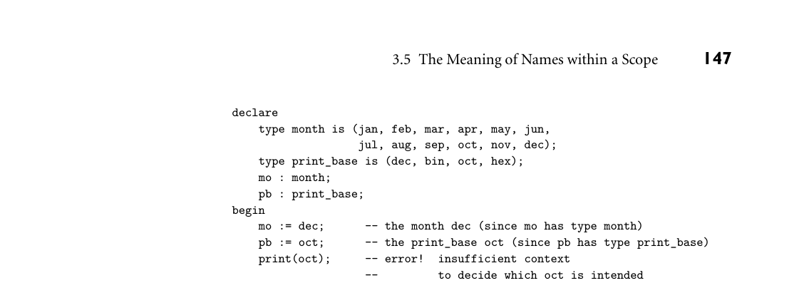
*Figure 3.11  Overloading of enumeration constants in Ada.*

The initial assignment to a will, on most machines, require that *p be loaded into  a register. Since accessing memory is expensive, the compiler will want to hang on  to the loaded value and reuse it in the assignment to b.  It will  be unable to  do  so,   however, unless it can verify that p and q cannot refer to the same object—that  is, that *p and *q are not aliases. While compile-time verifcation of this sort is  possible in many common cases, in general it’s undecidable.  ■

3.5.2 Overloading

Most programming languages provide at least a limited form of overloading. In  C, for example, the plus sign (+) is used to name several different functions, in­ cluding signed and unsigned integer and foating-point addition. Most program­ mers don’t worry about the distinction between these two functions—both are  based on the same mathematical concept, after all—but they take arguments of

EXAMPLE 3.22  different types and perform very different operations on the underlying bits. A  Overloaded enumeration  slightly more sophisticated form of overloading appears in the enumeration con- constants in Ada  stants of Ada. In Figure 3.11, the constants oct and dec refer either to months or  to numeric bases, depending on the context in which they appear.  ■  Within the symbol table of a compiler, overloading must be handled (resolved)  by arranging for the lookup routine to return a list of possible meanings for the  requested name. The semantic analyzer must then choose from among the ele­ ments of the list based on context. When the context is not suffcient to decide,  as in the call to print in Figure 3.11, then the semantic analyzer must announce

EXAMPLE 3.23  an error. Most languages that allow overloaded enumeration constants allow the  Resolving ambiguous  programmer to provide appropriate context explicitly. In Ada, for example, one  overloads  can say

print(month'(oct));

In Modula-3 and C#, every use of an enumeration constant must be prefxed with  a type name, even when there is no chance of ambiguity:

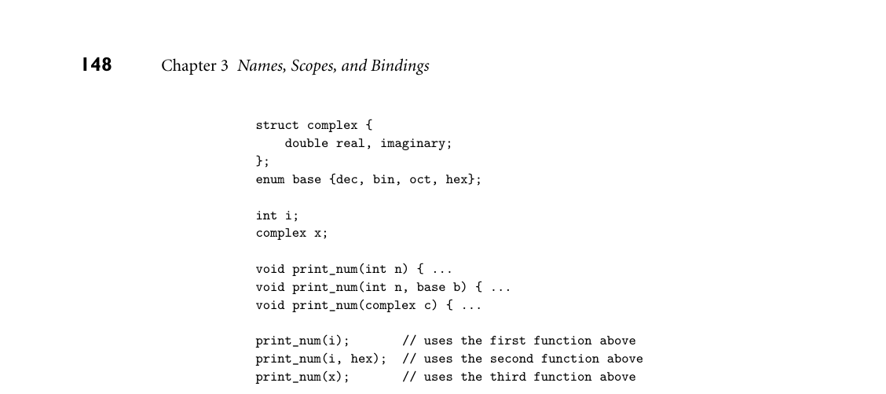
*Figure 3.12  Simple example of overloading in C++. In each case the compiler can tell which  function is intended by the number and types of arguments.*

mo := month.dec;  (* Modula-3 *)

pb = print_base.oct;  // C#

In C, one cannot overload enumeration constants at all; every constant visible in a  given scope must be distinct. C++11 introduced new syntax to give the program­ mer control over this behavior: enum constants must be distinct; enum class  constants must be qualifed with the class name (e.g., month::oct).  ■

EXAMPLE 3.24  Both Ada and C++ have elaborate facilities for overloading subroutine names.  Overloading in C++  Many of the C++ facilities carry over to Java and C#. A given name may refer  to an arbitrary number of subroutines in the same scope, so long as the subrou­ tines differ in the number or types of their arguments. C++ examples appear in  Figure 3.12.  ■

Redefining Built-in Operators

Many languages also allow the built-in arithmetic operators (+, -, *, etc.) to be

EXAMPLE 3.25  overloaded with user-defned functions. Ada, C++, and C# do this by defning  Operator overloading  alternative prefix forms of each operator, and defning the usual infx forms to be  in Ada  abbreviations (or “syntactic sugar”) for the prefx forms. In Ada, A + B  is short  for "+"(A, B). If  "+" (the prefx form) is overloaded, then + (the infx form)  will work for the new types as well. It must be possible to resolve the overloading  (determine which + is intended) from the types of A and B.  ■  Fortran 90 provides a special interface construct that can be used to

EXAMPLE 3.26  associate an operator with some named binary function.  In C++ and C#,  Operator overloading  which are object-oriented, A + B  may be short for either operator+(A, B) or  in C++  A.operator+(B). In  the  latter  case,  A is an instance of a class (module type) that  defnes an operator+ function. In C++ one might say

class complex {  double real, imaginary;  ...  public:  complex operator+(complex other) {

return complex(real + other.real, imaginary + other.imaginary);  }  ...  };  ...  complex A, B, C;  ...  C = A + B;  // uses user-defined operator+

C# syntax is similar.  ■

EXAMPLE 3.27  In Haskell, user-defned infx operators are simply functions whose names  Infix operators in Haskell  consist of non-alphanumeric characters:

let a  @@ b =  a *  2 +  b

Here we have defned a 2-argument operator named @@. We could also have de­ clared it with the usual prefx notation, in which case we would have needed to  enclose the name in parentheses:

let (@@) a b  = a  * 2  + b

Either way, both 3 @@ 4  and (@@) 3 4 will evaluate to 10. (An arbitrary function  can also be used as infx operator in Haskell by enclosing its name in backquotes.  With an appropriate defnition, gcd 8 12  and 8 `gcd` 12 will both evaluate  to 4.)

Unlike most languages, Haskell allows the programmer to specify both the as­ sociativity and the precedence of user-defned operators. We will return to this  subject in Section 6.1.1.  ■

EXAMPLE 3.28  Both operators and ordinary functions can be overloaded in Haskell, using a  Overloading with type  mechanism known as type classes. Among the simplest of these is the class Eq,  classes  declared in the standard library as

DESIGN & IMPLEMENTATION

3.8 User-defned operators in OCaml  OCaml does not support overloading, but it does allow the user to create new  operators, whose names—as in Haskell—consist of non-alphanumeric char­ acters. Each such name must begin with the name of one of the built-in op­ erators, from which the new operator inherits its syntactic role (prefx, infx,  or postfx) and precedence. So, for example,+.is used for foating-point addi­ tion; +/ is used for “bignum” (arbitrary precision) integer addition.

class Eq a, where   (==) :: a -> a -> Bool

This declaration establishes Eq as the set of types that provide an == operator.  Any instance of ==, for some particular type a, must take two arguments (each of  type a) and return a Boolean result. In other words, == is an overloaded operator,  supported by all types of class Eq; each such type must provide its own equality  defnition. The defnition for integers, again from the standard library, looks like  this:

instance Eq Integer where  x == y  = x  `integerEq` y

Here integerEq is the built-in, non-overloaded integer equality operator.  ■  Type classes can build upon themselves. The Haskell Ord class, for example,  encompasses all Eq types that also support the operators <, >, <=, and  >=. The   Num class (simplifying a bit) encompasses all Eq types that also support addition,  subtraction, and multiplication. In addition to making overloading a bit more  explicit than it is in most languages, type classes make it possible to specify that  certain polymorphic functions can be used only when their arguments are of a  type that supports some particular overloaded function (for more on this subject,  see Sidebar 7.7).

Related Concepts

When considering function and subroutine calls, it is important to distinguish  overloading from the related concepts of coercion and polymorphism. All  three   can be used, in certain circumstances, to pass arguments of multiple types to (or  return values of multiple types from) what appears to be a single named routine.  The syntactic similarity, however, hides signifcant differences in semantics and  pragmatics.

Coercion, which we will cover in more detail in Section 7.2.2, is the process  by which a compiler automatically converts a value of one type into a value of  another type when that second type is required by the surrounding context. Poly­ morphism, which we will consider in Sections 7.1.2, 7.3, 10.1.1, and 14.4.4, allows  a single subroutine to accept arguments of multiple types.

EXAMPLE 3.29  Consider a print routine designed to display its argument on the standard out- Printing objects of multiple  put stream, and suppose that we wish to be able to display objects of multiple  types  types. With overloading, we might write a separate print routine for each type of  interest. Then when it sees a call to print(my object), the compiler would choose  the appropriate routine based on the type of my object.

Now suppose we already have a print routine that accepts a foating-point ar­ gument. With coercion, we might be able to print integers by passing them  to this existing routine, rather than writing a new one. When it sees a call to  print(my integer), the compiler would coerce (convert) the argument automati­ cally to foating-point type prior to the call.

Finally, suppose we have a language in which many types support a to string  operation that will generate a character-string representation of an object of that  type. We might then be able to write a polymorphic print routine that accepts  an argument of any type for which to string is defned. The to string operation  might itself be polymorphic, built in, or simply overloaded; in any of these cases,  print could call it and output the result.  ■  In short, overloading allows the programmer to give the same name to multiple  objects, and to disambiguate (resolve) them based on context—for subroutines,  on the number or types of arguments. Coercion allows the compiler to perform  an automatic type conversion to make an argument conform to the expected type  of some existing routine. Polymorphism allows a single routine to accept argu­ ments of multiple types, provided that it attempts to use them only in ways that  their types support.

3CHECK YOUR UNDERSTANDING  21. Explain the importance of information hiding.

* What  is  an  opaque export?
* Why might it be useful to distinguish between the header and the body of a
  module?
* What does it mean  for a scope  to  be  closed?

* Explain the distinction between “modules as managers” and “modules as
  types.”

* How do classes differ from modules?
* Why might it be useful to have modules and classes in the same language?

* Why does the use of dynamic scoping imply the need for run-time type check­

ing?

* Explain the purpose of a compiler’s symbol table.
* What  are  aliases? Why are they considered a problem in language design and
  implementation?
* Explain the value of the restrict qualifer in C.

* What  is  overloading? How does it differ from coercion and polymorphism?
* What  are  type classes in Haskell? What purpose do they serve?

## 3.6  The Binding of Referencing Environments

We have seen in Section 3.3 how scope rules determine the referencing environ­ ment of a given statement in a program. Static scope rules specify that the refer­ encing environment depends on the lexical nesting of program blocks in which  names are declared. Dynamic scope rules specify that the referencing environ­ ment depends on the order in which declarations are encountered at run time.  An additional issue that we have not yet considered arises in languages that allow  one to  create a  reference to a subroutine—for example, by passing it as a parame­ ter. When should scope rules be applied to such a subroutine: when the reference  is frst created, or when the routine is fnally called? The answer is particularly im­ portant for languages with dynamic scoping, though we shall see that it matters  even in languages with static scoping.

EXAMPLE 3.30  A dynamic scoping example appears as pseudocode in Figure 3.13. Procedure  Deep and shallow binding  print selected records is assumed to be a general-purpose routine that knows  how to traverse the records in a database, regardless of whether they represent  people, sprockets, or salads. It takes as parameters a database, a predicate to make  print/don’t print decisions, and a subroutine that knows how to format the data  in the records of this particular database. We have hypothesized that procedure  print person uses the value of nonlocal variable line length to calculate the num­ ber and width of columns in its output. In a language with dynamic scoping, it is  natural for procedure print selected records to declare and initialize this variable  locally, knowing that code inside print routine will pick it up if needed. For this  coding technique to work, the referencing environment of print routine must not  be created until the routine is actually called by print selected records. This  late   binding of the referencing environment of a subroutine that has been passed as a  parameter is known as shallow binding. It is usually the default in languages with  dynamic scoping.  For function older than threshold, by contrast, shallow binding may not work  well. If, for example, procedure print selected records happens to have a local  variable named threshold, then the variable set by the main program to infu­ ence the behavior of older than threshold will not be visible when the function  is fnally called, and the predicate will be unlikely to work correctly. In such a  situation, the code that originally passes the function as a parameter has a par­ ticular referencing environment (the current one) in mind; it does not want the  routine to be called in any other environment. It therefore makes sense to bind  the environment  at  the time the  routine  is frst passed as a parameter,  and then   restore that environment when the routine is fnally called. That is, we arrange  for older than threshold to see, when it is eventually called, the same referencing  environment it would have seen if it had been called at the point where the refer­ ence was created. This early binding of the referencing environment is known as  deep binding. It is almost always the default in languages with static scoping, and  is sometimes available as an option with dynamic scoping as well.  ■

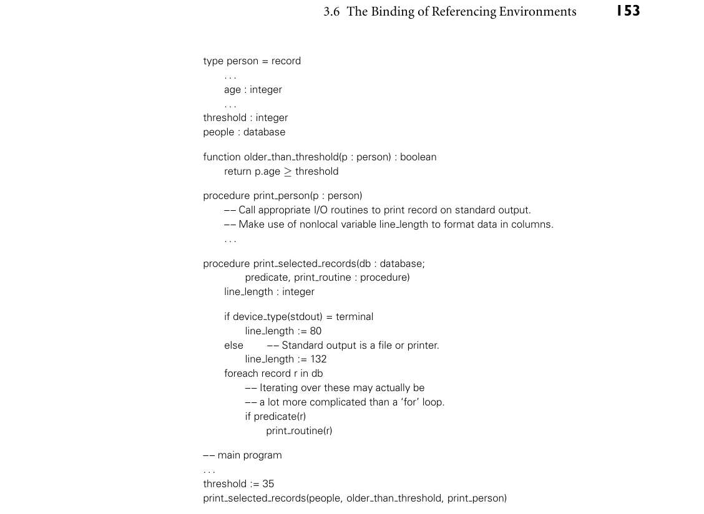
*Figure 3.13  Program (in pseudocode) to illustrate the importance of binding rules. One  might argue that deep binding is appropriate for the environment of function older than  threshold (for access to threshold), while shallow binding is appropriate for the environment  of procedure print person (for access to line length).*

3.6.1 Subroutine Closures

Deep binding is implemented by creating an explicit representation of a refer­ encing environment (generally the one in which the subroutine would execute  if called at the present time) and bundling it together with a reference to the  subroutine. The bundle as a whole is referred to as a closure. Usually the sub­ routine itself can be represented in the closure by a pointer to its code. In a lan­ guage with dynamic scoping, the representation of the referencing environment  depends on whether the language implementation uses an association list or a

*Figure 3.14  Deep binding in Python. At right is a conceptual view of the run-time stack.  Referencing environments captured in closures are shown as dashed boxes and arrows. When  B is called via formal parameter P, two  instances of  I exist. Because the closure for P was  created in the initial invocation of A, B’s static link (solid arrow) points to the frame of that earlier  invocation. B uses that invocation’s instance of I in its print statement, and the output is a 1.*

central reference table for run-time lookup of names; we consider these alterna­ tives at the end of Section C 3.4.2.

In early dialects of Lisp, which used dynamic scoping, deep binding was avail­ able via the built-in primitive function, which took a function as its argument  and returned a closure whose referencing environment was the one in which the  function would have executed if called at that moment in time. The closure could  then be passed as a parameter to another function. If and when it was eventually  called, it would execute in the saved environment. (Closures work slightly differ­ ently from “bare” functions in most Lisp dialects: they must be called by passing  them to the built-in primitives funcall or apply.)

At frst glance, one might be tempted to think that the binding time of refer­ encing environments would not matter in a language with static scoping. After  all, the meaning of a statically scoped name depends on its lexical nesting, not on  the fow of execution, and this nesting is the same whether it is captured at the  time a subroutine is passed as a parameter or at the time the subroutine is called.  The catch is that a running program may have more than one instance of an ob­ ject that is declared within a recursive subroutine. A closure in a language with  static scoping captures the current instance of every object, at the time the closure  is created. When the closure’s subroutine is called, it will fnd these captured in­ stances, even if newer instances have subsequently been created by recursive calls.

One could imagine combining static scoping with shallow binding [VF82], but  the combination does not seem to make much sense, and does not appear to have

EXAMPLE 3.31  been adopted in any language. Figure 3.14 contains a Python program that illus- Binding rules with static  trates the impact of binding rules in the presence of static scoping. This program  scoping  prints a 1. With shallow binding it would print a 2.  ■

It should be noted that binding rules matter with static scoping only when  accessing objects that are neither local nor global, but are defned at some inter­ mediate level of nesting. If an object is local to the currently executing subroutine,  then it does not matter whether the subroutine was called directly or through a  closure; in either case local objects will have been created when the subroutine  started running. If an object is global, there will never be more than one instance,  since the main body of the program is not recursive. Binding rules are therefore  irrelevant in languages like C, which has no nested subroutines, or Modula-2,  which allows only outermost subroutines to be passed as parameters, thus ensur­ ing that any variable defned outside the subroutine is global. (Binding rules are  also irrelevant in languages like PL/I and Ada 83, which do not permit subroutines  to be passed as parameters at all.)

Suppose then that we have a language with static scoping in which nested sub­ routines can be passed as parameters, with deep binding. To represent a closure  for subroutine S, we can simply save a pointer to S’s code together with the static  link that S would use if it were called right now, in the current environment.  When S is fnally called, we temporarily restore the saved static link, rather than  creating a new one. When S follows its static chain to access a nonlocal object, it  will fnd the object instance that was current at the time the closure was created.  This instance may not have the value it had at the time the closure was created,  but its identity, at least, will refect the intent of the closure’s creator.

3.6.2 First-Class Values and Unlimited Extent

In general, a value in a programming language is said to have first-class status  if it can be passed as a parameter, returned from a subroutine, or assigned into  a variable. Simple types such as integers and characters are frst-class values in  most programming languages. By contrast, a “second-class” value can be passed  as a parameter, but not returned from a subroutine or assigned into a variable,  and a “third-class” value cannot even be passed as a parameter. As we shall see  in Section 9.3.2, labels (in languages that have them) are usually third-class val­ ues, but they are second-class values in Algol. Subroutines display the most vari­ ation. They are frst-class values in all functional programming languages and  most scripting languages. They are also frst-class values in C# and, with some  restrictions, in several other imperative languages, including Fortran, Modula-2  and -3, Ada 95, C, and C++.10 They are second-class values in most other imper­ ative languages, and third-class values in Ada 83.

Our discussion of binding so far has considered only second-class subroutines.  First-class subroutines in a language with nested scopes introduce an additional  level of complexity: they raise the possibility that a reference to a subroutine may

10 Some authors would say that frst-class status requires anonymous function defnitions—lambda  expressions—that can be embedded in other expressions. C#, several scripting languages, and all  functional languages meet this requirement, but many imperative languages do not.

EXAMPLE 3.32

outlive the execution of the scope in which that routine was declared. Consider  the following example in Scheme:

Returning a first-class  subroutine in Scheme

  1.
  (define plus-x
  2.
  (lambda (x)
  3.
  (lambda (y) (+ x y))))
  4.
  ...
  5.
  (let ((f (plus-x 2)))
  6.
  (f 3))
  ; returns 5

Here the let construct on line 5 declares a new function, f, which  is  the  result  of   calling plus-x with argument 2. Function  plus-x is defned at line 1. It returns  the (unnamed) function declared at line 3. But that function refers to parameter x  of plus-x. When  f is called at line 6, its referencing environment will include the  x in plus-x, despite  the  fact  that  plus-x has already returned (see Figure 3.15).  Somehow we must ensure that x remains available.  ■  If local objects were destroyed (and their space reclaimed) at the end of each  scope’s execution, then the referencing environment captured in a long-lived clo­ sure might become full of dangling references. To avoid this problem, most func­ tional languages specify that local objects have unlimited extent: their  lifetimes   continue indefnitely. Their space can be reclaimed only when the garbage col­ lection system is able to prove that they will never be used again. Local objects  (other than own/static variables) in most imperative languages have limited ex­ tent: they are destroyed at the end of their scope’s execution. (C# and Smalltalk  are exceptions to the rule, as are most scripting languages.) Space for local ob­ jects with limited extent can be allocated on a stack. Space for local objects with  unlimited extent must generally be allocated on a heap.

Given the desire to maintain stack-based allocation for the local variables  of subroutines, imperative languages with frst-class subroutines must generally  adopt alternative mechanisms to avoid the dangling reference problem for clo­ sures. C and (pre-Fortran 90) Fortran, of course, do not have nested subrou­ tines. Modula-2 allows references to be created only to outermost subroutines  (outermost routines are frst-class values; nested routines are third-class values).  Modula-3 allows nested subroutines to be passed as parameters, but only outer-

DESIGN & IMPLEMENTATION

3.9 Binding rules and extent  Binding mechanisms and the notion of extent are closely tied to implementa­ tion issues. A-lists make it easy to build closures (Section C 3.4.2), but so do  the non-nested subroutines of C and the rule against passing nonglobal sub­ routines as parameters in Modula-2. In a similar vein, the lack of frst-class  subroutines in many imperative languages refects in large part the desire to  avoid heap allocation, which would be needed for local variables with unlim­ ited extent.

*Figure 3.15  The need for unlimited extent. When function plus-x is called in Example 3.32,  it returns (left side of the fgure) a closure containing an anonymous function. The referencing  environment of that function encompasses both plus-x and main—including the local variables  of plus-x itself. When the anonymous function is subsequently called (right side of the fgure),  it must be able to access variables in the closure’s environment—in particular, the x inside  plus-x—despite the fact that plus-x is no longer active.*

most routines to be returned or stored in variables (outermost routines are frst- class values; nested routines are second-class values). Ada 95 allows a nested rou­ tine to be returned, but only if the scope in which it was declared is the same as,  or larger than, the scope of the declared return type. This containment rule, while  more conservative than strictly necessary (it forbids the Ada equivalent of Figure  3.14), makes it impossible to propagate a subroutine reference to a portion of the  program in which the routine’s referencing environment is not active.

3.6.3 Object Closures

As noted in Section 3.6.1, the referencing environment in a closure will be non­ trivial only when passing a nested subroutine. This means that the implementa­ tion of frst-class subroutines is trivial in a language without nested subroutines.  At the same time, it means that a programmer working in such a language is  missing a useful feature: the ability to pass a subroutine with context. In  object- oriented languages, there is an alternative way to achieve a similar effect: we can  encapsulate our subroutine as a method of a simple object, and let the object’s

EXAMPLE 3.33  felds hold context for the method. In Java we might write the equivalent of Ex- An object closure in Java  ample 3.32 as follows:

interface IntFunc {

public int call(int i);  }  class PlusX implements IntFunc {

final int x;  PlusX(int n) { x = n; }  public int call(int i) { return i + x;  }  }  ...  IntFunc f = new PlusX(2);  System.out.println(f.call(3));  // prints 5

Here the interface IntFunc defnes a static type for objects enclosing a function  from integers to integers. Class PlusX is a concrete implementation of this type,  and can be instantiated for any integer  constant  x.  Where  the Scheme code in   Example 3.32 captured x in the subroutine closure returned by (plus-x 2), the   Java code here captures x in the object closure returned by new PlusX(2).  ■  An object that plays the role of a function and its referencing environment  may variously be called an object closure, a  function object, or  a  functor. (This is

EXAMPLE 3.34  unrelated to use of the term functor in Prolog, ML, or Haskell.) In C#, a frst-class  Delegates in C#  subroutine is an instance of a delegate type:

delegate int IntFunc(int i);

This type can be instantiated for any subroutine that matches the specifed argu­ ment and return types. That subroutine may be static, or it may be a method of  some object:

static int Plus2(int i)  return i + 2;  ...  IntFunc f = new IntFunc(Plus2);  Console.WriteLine(f(3));  // prints 5

class PlusX  int x;  public PlusX(int n)  x = n;  public int call(int i)  return i + x;  ...  IntFunc g = new IntFunc(new PlusX(2).call);  Console.WriteLine(g(3));  // prints 5  ■

EXAMPLE 3.35  Remarkably, though C# does not permit subroutines to nest in the general  Delegates and unlimited  case, it does allow delegates to be instantiated in-line from anonymous (unnamed)  extent  methods.  These allow  us to  mimic  the code of Example  3.32:

static IntFunc PlusY(int y) {

return delegate(int i) { return i + y;  };   }  ...  IntFunc h = PlusY(2);

Here y has unlimited extent! The compiler arranges to allocate it in the heap,  and to refer to it indirectly through a hidden pointer, included in the closure.  This implementation incurs the cost of dynamic storage allocation (and eventual  garbage collection) only when it is needed; local variables remain in the stack in  the common case.  ■  Object closures are suffciently important that some languages support them

EXAMPLE 3.36  with special syntax. In C++, an object of a class that overrides operator() can  Function objects in C++  be called as if it were a function:

class int_func {  public:

virtual int operator()(int i) = 0;  };  class plus_x : public int_func {

const int x;  public:  plus_x(int n) : x(n) { }  virtual int operator()(int i) { return i + x; }  };  ...  plus_x f(2);  cout << f(3) << "\n";  // prints 5

Object f could also be passed to any function that expected a parameter of class  int_func.  ■

3.6.4 Lambda Expressions

In most of our examples so far, closures have corresponded to subroutines that  were declared—and  named—in the usual  way.  In the Scheme  code of Exam­ ple 3.32, however, we saw an anonymous function—a lambda expression. Simi-

EXAMPLE 3.37  larly, in Example 3.35, we saw an anonymous delegate in C#. That example can  A lambda expression in C#  be made even simpler using C#’s lambda syntax:

static IntFunc PlusY(int y) {  return i => i + y;  }

Here the keyword delegate of Example 3.35 has been replaced by an => sign  that separates the anonymous function’s parameter list (in this case, just i) from   its body (the expression i + y). In a function with more than one parameter, the  parameter list would be parenthesized; in a longer, more complicated function,  the body could be a code block, with one or more explicit return statements. ■

The term “lambda expression” comes from the lambda calculus, a  formal  no­ tation for functional programming that we will consider in more detail in Chap-

EXAMPLE 3.38  ter 11. As one might expect, lambda syntax varies quite a bit from one language  Variety of lambda syntax  to another:

(lambda (i j) (> i j) i j)  ; Scheme

(int i, int j) => i > j ? i : j  // C#

fun i  j -> if i  > j then  i else j  (* OCaml  *)

->(i,  j){  i > j ? i : j }   # Ruby

Each of these expressions evaluates to the larger of two parameters.

In Scheme and OCaml, which are predominately functional languages, a  lambda expression simply is a function, and can be called in the same way as  any other function:

; Scheme:  ((lambda (i j) (> i j) i j) 5 8)  ; evaluates to 8

(* OCaml: *)  (fun i j -> if i > j then i else j) 5 8  (* likewise *)

In Ruby, which is predominately imperative, a lambda expression must be called  explicitly:

print ->(i,  j){ i >  j ?  i :  j }.call(5,  8)

In C#, the expression must be assigned into a variable (or passed into a parameter)  before it can be invoked:

Func<int, int, int> m = (i, j) => i > j ? i : j;  Console.WriteLine(m.Invoke(5, 8));

Here Func<int, int, int> is how one names the type of a function taking two  integer parameters and returning an integer result.  ■  In functional programming languages, lambda expressions make it easy to ma­ nipulate functions as values—to combine them in various ways to create new  functions  on the  fy.  This  sort  of manipulation is  less common in imperative lan­ guages, but even there, lambda expressions can help encourage code reuse and  generality. One particularly common idiom is the callback—a subroutine, passed  into a library, that allows the library to “call back” into the main program when  appropriate. Examples of callbacks include a comparison operator passed into a  sorting routine, a predicate used to flter elements of a collection, or a handler to  be called in response to some future event (see Section 9.6.2).

With the increasing popularity of frst-class subroutines, lambda expressions  have even made their way into C++, where the lack of garbage collection and  the emphasis on stack-based allocation make it particularly diffcult to solve the  problem of variable capture. The adopted solution, in keeping with the nature of  the language, stresses effciency and expressiveness more than run-time safety.

EXAMPLE 3.39  In the simple case, no capture of nonlocal variables is required. If V is a vector  A simple lambda  of integers, the following will print all elements less than 50:  expression in C++11

for_each(V.begin(), V.end(),

{ if (e < 50) cout << e << " "; }  );

Here for_each is a standard library routine that applies its third parameter—a  function—to every element of a collection in the range specifed by its frst two

parameters. In our example, the function is denoted by a lambda expression,  introduced by the empty square brackets. The compiler turns the lambda expres­ sion into an anonymous function, which is then passed to for_each via C++’s  usual mechanism—a simple pointer to the code.  ■

EXAMPLE 3.40  Suppose, however, that we wanted to print all elements less than k, where  k is  Variable capture in C++  a variable outside the scope of the lambda expression. We now have two options  lambda expressions  in C++:

[=](int e){ if (e < k) cout << e << " "; }

[&](int e){ if (e < k) cout << e << " "; }

Both of these cause the compiler to create an object closure (a function object in  C++),  which  could be passed to (and called  from)  for_each in  the same way   as an ordinary function. The difference between the two options is that [=] ar­ ranges for a copy of each captured variable to be placed in the object closure;  [&] arranges for a reference to be placed there instead. The programmer must  choose between these options. Copying can be expensive for large objects, and  any changes to the object made after the closure is created will not be seen by the  code of the lambda expression when it fnally executes. References allow changes  to be seen, but will lead to undefned (and presumably incorrect) behavior if the  closure’s lifetime exceeds that of the captured object: C++ does not have un­ limited extent. In particularly complex situations, the programmer can specify  capture on an object-by-object basis:

[j, &k](int e){ ...  // capture j's value and a reference to k,  // so they can be used in here  ■

DESIGN & IMPLEMENTATION

3.10 Functions and function objects  The astute reader may be wondering: In Example 3.40, how does for_each  manage to “do the right thing” with two different implementations of its third  parameter? After all, sometimes that parameter is implemented as a simple  pointer; other times it is a pointer to an object with an operator(), which  re­ quires a different kind of call. The answer is that for_each is a generic routine  (a template in C++). The compiler generates customized implementations of  for_each on demand. We will discuss generics in more detail in Section 7.3.1.

In some situations, it may be diffcult to use generics to distinguish among  “function-like” parameters.  As an alternative, C++ provides a standard  function class, with constructors that allow it to be instantiated from a func­ tion, a function pointer, a function object, or a manually created object closure.  Something like for_each could then be written as an ordinary (nongeneric)  subroutine whose third parameter was a object of class function. In  any  given   call, the compiler would coerce the provided argument to be a function object.

Lambda expressions appear in Java 8 as well, but in a restricted form. In situa­ tions where they might be useful, Java has traditionally relied on an idiom known  as a functional interface. The  Arrays.sort routine, for example, expects a pa­ rameter of type Comparator. To sort an array of personnel records by age, we  would (traditionally) have written

EXAMPLE 3.41

Lambda expressions in  Java 8

class AgeComparator implements Comparator<Person> {

public int compare(Person p1, Person p2) {

return Integer.compare(p1.age, p2.age);  }  }  Person[] People = ...  ...  Arrays.sort(People, new AgeComparator());

Signifcantly, Comparator has only a single abstract method: the compare rou­ tine provided by our AgeComparator class. With lambda expressions in Java 8, we  can omit the declaration of AgeComparator and simply write

Arrays.sort(People, (p1, p2) -> Integer.compare(p1.age, p2.age));

The key to the simpler syntax is that Comparator is a functional interface, and  thus has only a single abstract method. When a variable or formal parameter  is declared to be of some functional interface type, Java 8 allows a lambda ex­ pression whose parameter and return types match those of the interface’s single  method to be assigned into the variable or passed as the parameter. In effect, the  compiler uses the lambda expression to create an instance of an anonymous class  that implements the interface.  ■  As it turns out, coercion to functional interface types is the only use of lambda  expressions in Java. In particular, lambda expressions have no types of their own:  they are not really objects, and cannot be directly manipulated. Their behav­ ior with respect to variable capture is entirely determined by the usual rules for  nested classes. We will consider these rules in more detail in Section 10.2.3;  for now, suffce it to note that Java, like C++, does not support unlimited  extent.

## 3.7  Macro Expansion

Prior to the development of high-level programming languages, assembly lan­ guage programmers could fnd themselves writing highly repetitive code. To ease  the burden, many assemblers provided sophisticated macro expansion facilities.  Consider the task of loading an element of a two-dimensional array from memory  into a register. As we shall see in Section 8.2.3, this operation can easily require

EXAMPLE 3.42

A simple assembly macro

half a dozen instructions, with details depending on the hardware instruction  set; the size of the array elements; and whether the indices are constants, values  in memory, or values in registers. In many early assemblers, one could defne a  macro that would replace an expression like ld2d(target reg, array name, row, col­ umn, row size, element size) with the appropriate multi-instruction sequence. In  a numeric program containing hundreds or thousands of array access operations,  this macro could prove extremely useful.  ■

EXAMPLE 3.43  When C was created in the early 1970s, it was natural to include a macro pre- Preprocessor macros in C  processing facility:

#define LINE_LEN 80  #define DIVIDES(a,n) (!((n) % (a)))

/* true iff n has zero remainder modulo a */  #define SWAP(a,b) {int t = (a); (a) = (b); (b) = t;}  #define MAX(a,b) ((a) > (b) ? (a) : (b))

Macros like LINE_LEN avoided the need (in early versions of C) to support named  constants in the language itself. Perhaps more important, parameterized macros  like DIVIDES, MAX, and  SWAP were much more effcient than equivalent C func­ tions. They avoided the overhead of the subroutine call mechanism (including  register saves and restores), and the code they generated could be integrated into  any code improvements that the compiler was able to effect in the code surround­ ing the call.  ■

EXAMPLE 3.44  Unfortunately, C macros suffer from several limitations, all of which stem from  “Gotchas” in C macros  the fact that they are implemented by textual substitution, and are not understood  by the rest of the compiler. Put another way, they provide a naming and binding  mechanism that is separate from—and often at odds with—the rest of the pro­ gramming language.  In the defnition of DIVIDES, the parentheses around the occurrences of a and  n are essential. Without them, DIVIDES(y + z, x) would be replaced by  (!(x %  y + z)),  which  is  the same as  (!((x % y) + z)), according to the rules of prece­ dence. In a similar vein, SWAP may behave unexpectedly if the programmer writes  SWAP(x, t): textual substitution of arguments allows the macro’s declaration of  t to capture the t that was passed. MAX(x++, y++) may also behave unexpect­ edly, since the increment side effects will happen more than once. Unfortunately,

DESIGN & IMPLEMENTATION

3.11 Generics as macros  In some sense, the ability to import names into an ordinary module provides a  primitive sort of generic facility. A stack module that imports its element type,  for example, can be inserted (with a text editor) into any context in which the  appropriate type name has been declared, and will produce a “customized”  stack for that context when compiled. Early versions of C++ formalized this  mechanism by using macros to implement templates. Later versions of C++  have made templates (generics) a fully supported language feature, giving them  much of the favor of hygienic macros. (More on templates and on template  metaprogramming can be found in Section C 7.3.2.)

in standard C we cannot avoid the extra side effects by assigning the parameters  into temporary variables: a C macro that “returns” a value must be an expression,  and declarations are one of many language constructs that cannot appear inside  (see also Exercise 3.23).  ■  Modern languages and compilers have, for the most part, abandoned macros  as an anachronism. Named constants are type-safe and easy to implement, and  in-line subroutines (to be discussed in Section 9.2.4) provide almost all the per­ formance of parameterized macros without their limitations. A few languages  (notably Scheme and Common Lisp) take an alternative approach, and integrate  macros into the language in a safe and consistent way. So-called hygienic macros  implicitly encapsulate their arguments, avoiding unexpected interactions with as­ sociativity and precedence. They rename variables when necessary to avoid the  capture problem, and they can be used in any expression context. Unlike subrou­ tines, however, they are expanded during semantic analysis, making them gen­ erally unsuitable for unbounded recursion. Their appeal is that, like all macros,  they take unevaluated arguments, which they evaluate lazily on demand. Among  other things, this means that they preserve the multiple side effect “gotcha” of our  MAX example. Delayed evaluation was a bug in this context, but can sometimes  be a feature. We will return to it in Sections 6.1.5 (short-circuit Boolean eval­ uation), 9.3.2 (call-by-name parameters), and 11.5 (normal-order evaluation in  functional programming languages).

3CHECK YOUR UNDERSTANDING  34. Describe the difference between deep and shallow binding of referencing en­

vironments.  35. Why are binding rules particularly important for languages with dynamic  scoping?  36. What  are  first-class subroutines? What languages support them?  37. What  is  a  subroutine closure? What is it used for? How is it implemented?

* What  is  an  object closure? How is it related to a subroutine closure?
* Describe  how  the  delegates of C# extend and unify both subroutine and object
  closures.
* Explain the distinction between limited and unlimited extent of objects in a
  local scope.
* What  is  a  lambda expression? How does the support for lambda expressions in
  functional languages compare to that of C# or Ruby? To that of C++ or Java?

* What  are  macros? What was the motivation for including them in C? What
  problems may they cause?

## 3.8  Separate Compilation

Since most large programs are constructed and tested incrementally, and since the  compilation of a very large program can be a multihour operation, any language  designed to support large programs must provide for separate compilation.

IN MORE DEPTH

On the companion site we consider the relationship between modules and sepa­ rate compilation. Because they are designed for encapsulation and provide a nar­ row interface, modules are the natural choice for the “compilation units” of many  programming languages. The separate module headers and bodies of Modula-3  and Ada, for example, are explicitly intended for separate compilation, and refect  experience gained with more primitive facilities in other languages. C and C++,  by contrast, must maintain backward compatibility with mechanisms designed in  the early 1970s. Modern versions of C and C++ include a namespace mechanism  that provides module-like data hiding, but names must still be declared before  they are used in every compilation unit, and the mechanisms used to accom­ modate this rule are purely a matter of convention. Java and C# break with the  C tradition by requiring the compiler to infer header information automatically  from separately compiled class defnitions; no header fles are required.

## 3.9  Summary and Concluding Remarks

This chapter has addressed the subject of names, and the binding of names to ob­ jects (in a broad sense of the word). We began with a general discussion of the  notion of binding time—the time at which a name is associated with a particular  object or, more generally, the time at which an answer is associated with any open  question in language or program design or implementation. We defned the no­ tion of lifetime for both objects and name-to-object bindings, and noted that they  need not be the same. We then introduced the three principal storage allocation  mechanisms—static, stack, and heap—used to manage space for objects.

In Section 3.3 we described how the binding of names to objects is governed by  scope rules. In some languages, scope rules are dynamic: the meaning of a name is  found in the most recently entered scope that contains a declaration and that has  not yet been exited. In most modern languages, however, scope rules are static, or  lexical: the meaning of a name is found in the closest lexically surrounding scope  that contains a declaration. We found that lexical scope rules vary in important  but sometimes subtle ways from one language to another. We considered what  sorts of scopes are allowed to nest, whether scopes are open or closed, whether the  scope of a name encompasses the entire block in which it is declared, and whether

a name must be declared before it is used. We explored the implementation of  scope rules in Section 3.4.

In Section 3.5 we examined several ways in which bindings relate to one an­ other. Aliases arise when two or more names in a given scope are bound to the  same object. Overloading arises when one name is bound to multiple objects. We  noted that while behavior reminiscent of overloading can sometimes be achieved  through coercion or polymorphism, the underlying mechanisms are really very  different. In Section 3.6 we considered the question of when to bind a referencing  environment to a subroutine that is passed as a parameter, returned from a func­ tion, or stored in a variable. Our discussion touched on the notions of closures  and lambda expressions, both of which will appear repeatedly in later chapters. In  Sections 3.7 and 3.8 we considered macros and separate compilation.

Some of the more complicated aspects of lexical scoping illustrate the evolu­ tion of language support for data abstraction, a subject to which we will return  in Chapter 10. We began by describing the own or static variables of languages  like Fortran, Algol 60, and C, which allow a variable that is local to a subroutine  to retain its value from one invocation to the next. We then noted that simple  modules can be seen as a way to make long-lived objects local to a group of sub­ routines, in such a way that they are not visible to other parts of the program.  By selectively exporting names, a module may serve as the “manager” for one or  more abstract data types. At the next level of complexity, we noted that some  languages treat modules as types, allowing the programmer to create an arbitrary  number of instances of the abstraction defned by a module. Finally, we noted  that object-oriented languages extend the module-as-type approach (as well as  the notion of lexical scope) by providing an inheritance mechanism that allows  new abstractions (classes) to be defned as extensions or refnements of existing  classes.

Among the topics considered in this chapter, we saw several examples of useful  features (recursion, static scoping, forward references, frst-class subroutines, un­ limited extent) that have been omitted from certain languages because of concern  for their implementation complexity or run-time cost. We also saw an example  of a feature (the private part of a module specifcation) introduced expressly to  facilitate a language’s implementation, and another (separate compilation in C)  whose design was clearly intended to mirror a particular implementation. In sev­ eral additional aspects of language design (late vs early binding, static vs dynamic  scoping, support for coercions and conversions, toleration of pointers and other  aliases), we saw that implementation issues play a major role.

In a similar vein, apparently simple language rules can have surprising implica­ tions. In Section 3.3.3, for example, we considered the interaction of whole-block  scope with the requirement that names be declared before they can be used. Like  the do loop syntax and white space rules of Fortran (Section 2.2.2) or the if...  then ... else syntax of Pascal (Section 2.3.2), poorly chosen scoping rules can  make program analysis diffcult not only for the compiler, but for human beings  as well. In future chapters we shall see several additional examples of features that  are both confusing and hard to compile. Of course, semantic utility and ease of

implementation do not always go together. Many easy-to-compile features (e.g.,  goto statements) are of questionable value at best. We will also see several ex­ amples of highly useful and (conceptually) simple features, such as garbage col­ lection (Section 8.5.3) and unifcation (Sections 7.2.4, C 7.3.2, and 12.2.1), whose  implementations are quite complex.

## 3.10  Exercises

3.1  Indicate the binding time (when the language is designed, when the pro­ gram is linked, when the program begins execution, etc.) for each of the  following decisions in your favorite programming language and implemen­ tation. Explain any answers you think are open to interpretation.

The number of built-in functions (math, type queries, etc.)  The variable declaration that corresponds to a particular variable refer­ ence (use)  The maximum length allowed for a constant (literal) character string  The referencing environment for a subroutine that is passed as a pa­ rameter  The address of a particular library routine  The total amount of space occupied by program code and data

3.2  In Fortran 77, local variables were typically allocated statically. In Algol  and its descendants (e.g., Ada and C), they are typically allocated in the  stack. In Lisp they are typically allocated at least partially in the heap. What  accounts for these differences? Give an example of a program in Ada or  C that would not work correctly if local variables were allocated statically.  Give an example of a program in Scheme or Common Lisp that would not  work correctly if local variables were allocated on the stack.

3.3  Give two examples in which it might make sense to delay the binding of an  implementation decision, even though suffcient information exists to bind  it early.

3.4  Give three concrete examples drawn from programming languages with  which you are familiar in which a variable is live but not in scope.

3.5  Consider the following pseudocode:

  1.
  procedure main()
  2.
  a : integer := 1
  3.
  b : integer := 2

  4.
  procedure middle()
  5.
  b : integer := a

  6.
  procedure inner()
  7.
  print a, b

  8.
  a : integer := 3

  9.
  –– body of middle
  10.
  inner()
  11.
  print a, b

  12.
  –– body of main
  13.
  middle()
  14.
  print a, b

Suppose this was code for a language with the declaration-order rules of C  (but with nested subroutines)—that is, names must be declared before use,  and the scope of a name extends from its declaration through the end of  the block. At each print statement, indicate which declarations of a and b  are in the referencing environment. What does the program print (or will  the compiler identify static semantic errors)? Repeat the exercise for the  declaration-order rules of C# (names must be declared before use, but the  scope of a name is the entire block in which it is declared) and of Modula-3  (names can be declared in any order, and their scope is the entire block in  which they are declared).

3.6  Consider the following pseudocode, assuming nested subroutines and static  scope:

procedure main()

g : integer

procedure B(a : integer)

x : integer

procedure A(n : integer)  g :=  n

procedure R(m : integer)  write integer(x)  x /:= 2 –– integer division  if x > 1

R(m + 1)  else  A(m)

–– body of B  x := a  × a  R(1)

–– body of main  B(3)  write integer(g)

(a) What does this program print?

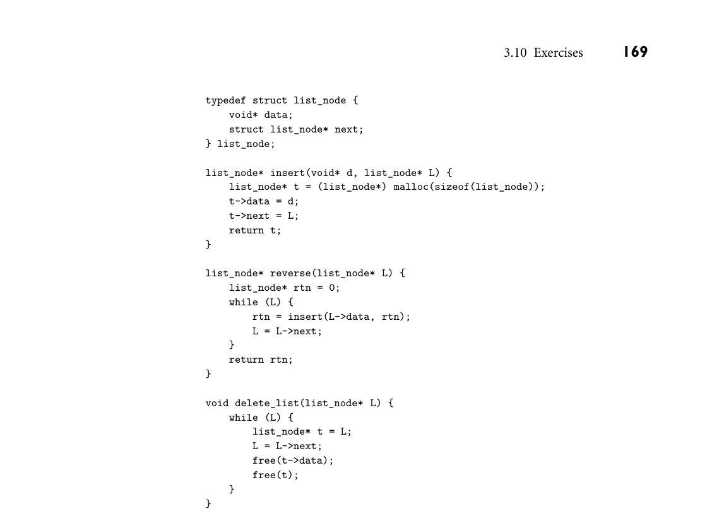
*Figure 3.16  List management routines for Exercise 3.7.*

(b) Show the frames on the stack when A has just been called. For each  frame, show the static and dynamic links.  (c)  Explain how A fnds g.

3.7  As part of the development team at MumbleTech.com, Janet has written a  list manipulation library for C that contains, among other things, the code  in Figure 3.16.

(a) Accustomed to Java, new team member Brad includes the following  code in the main loop of his program:

list_node* L = 0;  while (more_widgets()) {

L = insert(next_widget(), L);  }  L = reverse(L);

Sadly, after running for a while, Brad’s program always runs out of  memory and crashes. Explain what’s going wrong.  (b) After Janet patiently explains the problem to him, Brad gives it another  try:

list_node* L = 0;  while (more_widgets()) {

L = insert(next_widget(), L);  }  list_node* T = reverse(L);  delete_list(L);  L =  T;

This seems to solve the insuffcient memory problem, but where the  program used to produce correct results (before running out of mem­ ory), now its output is strangely corrupted, and Brad goes back to Janet  for advice. What will she tell him this time?

3.8  Rewrite Figures 3.6 and 3.7 in C. You will need to use separate compilation  for name hiding.

3.9  Consider the following fragment of code in C:

{  int a, b, c;  ...  {  int d, e;  ...  {  int f;  ...  }  ...  }  ...  {  int g, h, i;  ...  }  ...  }

(a) Assume that each integer variable occupies four bytes. How much total  space is required for the variables in this code?  (b) Describe an algorithm that a compiler could use to assign stack frame  offsets to the variables of arbitrary nested blocks, in a way that mini­ mizes the total space required.

3.10 Consider the design of a Fortran 77 compiler that uses static allocation for  the local variables of subroutines. Expanding on the solution to the pre­ vious question, describe an algorithm to minimize the total space required  for these variables. You may fnd it helpful to construct a call graph data

structure in which each node represents a subroutine, and each directed arc  indicates that the subroutine at the tail may sometimes call the subroutine  at the head.

3.11 Consider the following pseudocode:

procedure P(A, B : real)

X :  real

procedure Q(B, C : real)

Y :  real   . . .

procedure R(A, C : real)

Z :  real   . . .   –– (*)   . . .

Assuming static scope, what is the referencing environment at the location  marked by (*)?

3.12 Write a simple program in Scheme that displays three different behaviors,  depending on whether we use let, let*, or  letrec to declare a given set  of names. (Hint: To make good use of letrec, you will probably want your  names to be functions [lambda expressions].)

3.13 Consider the following program in Scheme:

(define A  (lambda()  (let* ((x 2)  (C (lambda (P)  (let ((x 4))  (P))))  (D (lambda ()  x))  (B (lambda ()

(let ((x 3))  (C D)))))  (B))))

What does this program print? What would it print if Scheme used dynamic  scoping and shallow binding? Dynamic scoping and deep binding? Explain  your answers.

3.14 Consider the following pseudocode:

x : integer  –– global

procedure set x(n : integer)  x := n

procedure print x()  write integer(x)

procedure frst()  set x(1)  print x()

procedure second()

x : integer  set x(2)  print x()

set x(0)  frst()  print x()  second()  print x()

What does this program print if the language uses static scoping? What does  it print with dynamic scoping? Why?

3.15 The principal argument in favor of dynamic scoping is that it facilitates  the customization of subroutines. Suppose, for example, that we have a  library routine print integer that is capable of printing its argument in any  of several bases (decimal, binary, hexadecimal, etc.). Suppose further that  we want the routine to use decimal notation most of the time, and to use  other bases only in a few special cases: we do not want to have to specify  a base explicitly on each individual call. We can achieve this result with  dynamic scoping by having print integer obtain its base from a nonlocal  variable print base. We can establish the default behavior by declaring a  variable print base and setting its value to 10 in a scope encountered early  in execution. Then, any time we want to change the base temporarily, we  can write

begin  –– nested block  print base : integer := 16  –– use hexadecimal  print integer(n)

The problem with this argument is that there are usually other ways to  achieve the same effect, without dynamic scoping. Describe at least two  for the print integer example.

3.16 As noted in Section 3.6.3, C# has unusually sophisticated support for frst- class subroutines. Among other things, it allows delegates to be instantiated  from anonymous nested methods, and gives local variables and parameters  unlimited extent when they may be needed by such a delegate. Consider the  implications of these features in the following C# program:

using System;  public delegate int UnaryOp(int n);  // type declaration: UnaryOp is a function from ints to ints

public class Foo {  static int a = 2;  static UnaryOp b(int c) {

int d =  a + c;   Console.WriteLine(d);  return delegate(int n) { return c + n; };  }  public static void Main(string[] args) {  Console.WriteLine(b(3)(4));  }  }

What does this program print? Which of a, b, c, and  d, if  any,  is  likely  to  be   statically allocated? Which could be allocated on the stack? Which would  need to be allocated in the heap? Explain.

3.17 If you are familiar with structured exception handling, as provided in Ada,  C++, Java, C#,  ML, Python, or  Ruby, consider  how  this mechanism  relates   to the issue of scoping. Conventionally, a raise or throw statement is  thought of as referring to an exception, which it passes as a parameter to  a handler-fnding library routine. In each of the languages mentioned, the  exception itself must be declared in some surrounding scope, and is sub­ ject to the usual static scope rules. Describe an alternative point of view, in  which the raise or throw is actually a reference to a handler, to  which  it   transfers control directly. Assuming this point of view, what are the scope  rules for handlers? Are these rules consistent with the rest of the language?  Explain. (For further information on exceptions, see Section 9.4.)

3.18 Consider the following pseudocode:

x : integer  –– global

procedure set x(n : integer)  x := n

procedure print x()  write integer(x)

procedure foo(S, P : function; n : integer)

x : integer := 5  if n in  {1, 3} set x(n)  else  S(n)

if n in  {1, 2} print x()  else  P

set x(0); foo(set x, print x, 1); print x()  set x(0); foo(set x, print x, 2); print x()  set x(0); foo(set x, print x, 3); print x()  set x(0); foo(set x, print x, 4); print x()

Assume that the language uses dynamic scoping. What does the program  print if the language uses shallow binding? What does it print with deep  binding? Why?

3.19 Consider the following pseudocode:

x : integer := 1  y : integer := 2

procedure add()  x := x + y

procedure second(P : procedure)

x : integer := 2  P()

procedure frst

y : integer := 3  second(add)

frst()  write integer(x)  (a) What does this program print if the language uses static scoping?  (b) What does it print if the language uses dynamic scoping with deep bind­

ing?  (c)  What does it print if the language uses dynamic scoping with shallow  binding?

3.20 Consider mathematical operations in a language like C++, which supports  both overloading and coercion. In many cases, it may make sense to pro­ vide multiple, overloaded versions of a function, one for each numeric type  or combination of types. In other cases, we might use a single version—  probably defned for double-precision foating point arguments—and rely  on coercion to allow that function to be used for other numeric types (e.g.,  integers). Give an example in which overloading is clearly the preferable  approach. Give another in which coercion is almost certainly better.

3.21 In a language that supports operator overloading, build support for ration­

al numbers. Each number should be represented internally as a (numera­ tor, denominator) pair in simplest form, with a positive denominator. Your

code should support unary negation and the four standard arithmetic oper­ ators. For extra credit, create a conversion routine that accepts two foating- point parameters—a value and a error bound—and returns the simplest  (smallest denominator) rational number within the given error bound of  the given value.

3.22 In an imperative language with lambda expressions (e.g., C#, Ruby, C++, or  Java), write the following higher-level functions. (A higher-level function,  as we shall see in Chapter 11, takes other functions as argument and/or  returns a function as a result.)

compose(g, f)—returns a function h such that h(x) == g(f(x)).  map(f, L)—given a function f and a list L returns a list M such that  the ith element of M is f(e), where  e is the ith element of L.  filter(L, P)—given a list L and a predicate (Boolean-returning  function) P, returns a list containing all and only those elements of L  for which P is true.

Ideally, your code should work for any argument or list element type.

3.23 Can you write a macro in standard C that “returns” the greatest common  divisor of a pair of arguments, without calling a subroutine? Why or why  not?  3.24–3.31 In More Depth.

## 3.11  Explorations

3.32 Experiment with naming rules in your favorite programming language.  Read the manual, and write and compile some test programs. Does the  language use lexical or dynamic scoping? Can scopes nest? Are they open  or closed? Does the scope of a name encompass the entire block in which it  is declared, or only the portion after the declaration? How does one declare  mutually recursive types or subroutines? Can subroutines be passed as pa­ rameters, returned from functions, or stored in variables? If so, when are  referencing environments bound?

3.33 List the keywords (reserved words) of one or more programming languages.  List the predefned identifers. (Recall that every keyword is a separate to­ ken. An identifer cannot have the same spelling as a keyword.) What cri­ teria do  you  think were used to  decide which  names  should  be keywords   and which should be predefned identifers? Do you agree with the choices?  Why or why not?

3.34 If you have experience with a language like C, C++, or Rust, in which dy­

namically allocated space must be manually reclaimed, describe your ex­ perience with dangling references or memory leaks. How often do these

bugs arise? How do you fnd them? How much effort does it take? Learn  about open-source or commercial tools for fnding storage bugs (Valgrind  is a popular open-source example). Do such tools weaken the argument for  automatic garbage collection?

3.35 A few languages—notably Euclid and Turing, make every subroutine a  closed scope, and require it to explicitly import any nonlocal names it uses.  The import lists can be thought of as explicit, mandatory documentation of  a part of the subroutine interface that is usually implicit. The use of import  lists also makes it easy for Euclid and Turing to prohibit passing a variable,  by reference, to a subroutine that also accesses that variable directly, thereby  avoiding the errors alluded to in Example 3.20.

In programs you have written, how hard would it have been to document  every use of a nonlocal variable? Would the effort be worth the improve­ ment in the quality of documentation and error rates?

3.36 We learned in Section 3.3.6 that modern languages have generally aban­

doned dynamic scoping. One place it can still be found is in the so-called  environment variables of the Unix programming environment. If you are  not familiar with these, read the manual page for your favorite shell (com­ mand interpreter—ksh/bash, csh/tcsh, etc.) to learn how these behave.  Explain why the usual alternatives to dynamic scoping (default parameters  and static variables) are not appropriate in this case.

3.37 Compare the mechanisms for overloading of enumeration names in Ada  and in Modula-3 or C# (Section 3.5.2). One might argue that the (histor­ ically more recent) Modula-3/C# approach moves responsibility from the  compiler to the programmer: it requires even an unambiguous use of an  enumeration constant to be annotated with its type. Why do you think this  approach was chosen by the language designers? Do you agree with the  choice? Why or why not?

3.38 Learn about tied variables in Perl. These allow the programmer to asso­

ciate an ordinary variable with an (object-oriented) object in such a way  that operations on the variable are automatically interpreted as method in­ vocations on the object. As an example, suppose we write tie $my_var,  "my_class";. The interpreter will create a new object of class my_class,  which it will associate with scalar variable $my_var. For purposes of dis­ cussion, call that object O. Now, any attempt to read the value of $my_var  will be interpreted as a call to method O->FETCH(). Similarly, the assign­ ment $my_var = value will be interpreted as a call to O->STORE(value).  Array, hash, and flehandle variables, which support a larger set of built-in  operations, provide access to a larger set of methods when tied.

Compare Perl’s tying mechanism to the operator overloading of C++.  Which features of each language can be convenientlyemulated by the other?

3.39 Do you think coercion is a good idea? Why or why not?

3.40 The syntax for lambda expressions in Ruby evolved over time, with the re­

sult that there are now four ways to pass a block into a method as a closure:

by placing it after the end of the argument list (in which case it become an  extra, fnal parameter); by passing it to Proc.new; or, within the argument  list, by prefxing it with the keyword lambda or by writing it in -> lambda  notation. Investigate these options. Which came frst? Which came later?  What are their comparative advantages? Are their any minor differences in  their behavior?

3.41 Lambda expressions were a late addition to the Java programming language:  they were strongly resisted for many years. Research the controversy sur­ rounding them. Where do your sympathies lie? What alternative proposals  were rejected? Do you fnd any of them appealing?

3.42 Give three examples of features that are not provided in some language with  which you are familiar, but that are common in other languages. Why do  you think these features are missing? Would they complicate the implemen­ tation of the language? If so, would the complication (in your judgment) be  justifed?

3.43–3.47 In More Depth.

## 3.12  Bibliographic Notes

This chapter has traced the evolution of naming and scoping mechanisms  through a very large number of languages, including Fortran (several versions),  Basic, Algol 60 and 68, Pascal, Simula, C and C++, Euclid, Turing, Modula (1, 2,  and 3),  Ada (83  and 95), Oberon, Eiffel, Perl, Tcl, Python, Ruby, Rust,  Java, and   C#. Bibliographic references for all of these can be found in Appendix A.

Both modules and objects trace their roots to Simula, which was developed  by Dahl, Nygaard, Myhrhaug, and others at the Norwegian Computing Center  in the mid-1960s. (Simula I was implemented in 1964; descriptions in this book  pertain to Simula 67.) The encapsulation mechanisms of Simula were refned in  the 1970s by the developers of Clu, Modula, Euclid, and related languages. Other  Simula innovations—inheritance and dynamic method binding in particular—  provided the inspiration for Smalltalk, the original and arguably purest of the  object-oriented languages. Modern object-oriented languages, including Eiffel,  C++, Java, C#, Python, and Ruby, represent to a large extent a reintegration of the  evolutionary lines of encapsulation on the one hand and inheritance and dynamic  method binding on the other.

The notion of information hiding originates in Parnas’s classic paper, “On the  Criteria to be Used in Decomposing Systems into Modules” [Par72]. Compara­ tive discussions of naming, scoping, and abstraction mechanisms can be found,  among other places, in Liskov et al.’s discussion of Clu [LSAS77], Liskov and Gut­ tag’s text [LG86, Chap. 4], the Ada Rationale [IBFW91, Chaps. 9–12], Harbison’s  text on Modula-3 [Har92, Chaps. 8–9], Wirth’s early work on modules [Wir80],  and his later discussion of Modula and Oberon [Wir88a, Wir07]. Further infor­ mation on object-oriented languages can be found in Chapter 10.

For a detailed discussion of overloading and polymorphism, see the survey by  Cardelli and Wegner [CW85]. Cailliau [Cai82] provides a lighthearted discus­ sion of many of the scoping pitfalls noted in Section 3.3.3. Abelson and Suss- man [AS96, p. 11n] attribute the term “syntactic sugar” to Peter Landin.

Lambda expressions for C++ are described in the paper of Järvi and Free­ man [JF10]. Lambda expressions for Java were developed under JSR 335 of the  Java Community Process (documentation at jcp.org).

4 Semantic Analysis

In Chapter 2 we considered the topic of programming language syntax.  In the current chapter we turn to the topic of semantics. Informally, syntax con­ cerns the form of a valid program, while semantics concerns its meaning. Meaning  is important for at least two reasons: it allows us to enforce rules (e.g., type con­ sistency) that go beyond mere form, and it provides the information we need in  order to generate an equivalent output program.

It is conventional to say that the syntax of a language is precisely that portion  of the language defnition that can be described conveniently by a context-free  grammar, while the semantics is that portion of the defnition that cannot. This  convention is useful in practice, though it does not always agree with intuition.  When we require, for example, that the number of arguments contained in a call  to a subroutine match the number of formal parameters in the subroutine defni­ tion, it is tempting to say that this requirement is a matter of syntax. After all, we  can count arguments without knowing what they mean. Unfortunately, we can­ not count them with context-free rules. Similarly, while it is possible to write a  context-free grammar in which every function must contain at least one return  statement, the required complexity makes this strategy very unattractive. In gen­ eral, any rule that requires the compiler to compare things that are separated by  long distances, or to count things that are not properly nested, ends up being a  matter of semantics.

Semantic rules are further divided into static and dynamic semantics, though  again the line between the two is somewhat fuzzy. The compiler enforces static  semantic rules at compile time. It generates code to enforce dynamic semantic  rules at run time (or to call library routines that do so). Certain errors, such as  division by zero, or attempting to index into an array with an out-of-bounds sub­ script, cannot in general be caught at compile time, since they may occur only for  certain input values, or certain behaviors of arbitrarily complex code. In special  cases, a compiler may be able to tell that a certain error will always or never occur,  regardless of run-time input. In these cases, the compiler can generate an error  message at compile time, or refrain from generating code to perform the check at  run time, as appropriate. Basic results from computability theory, however, tell  us that no algorithm can make these predictions correctly for arbitrary programs:

there will inevitably be cases in which an error will always occur, but the compiler  cannot tell, and must delay the error message until run time; there will also be  cases in which an error can never occur, but the compiler cannot tell, and must  incur the cost of unnecessary run-time checks.

Both semantic analysis and intermediate code generation can be described in  terms of annotation, or decoration of a parse tree or syntax tree. The annotations  themselves are known as attributes. Numerous examples of static and dynamic  semantic rules will appear in subsequent chapters. In this current chapter we  focus primarily on the mechanisms a compiler uses to enforce the static rules. We  will consider intermediate code generation (including the generation of code for  dynamic semantic checks) in Chapter 15.

In Section 4.1 we consider the role of the semantic analyzer in more detail,  considering both the rules it needs to enforce and its relationship to other phases  of compilation. Most of the rest of the chapter is then devoted to the subject  of attribute grammars. Attribute grammars provide a formal framework for the  decoration of a tree. This framework is a useful conceptual tool even in compilers  that do not build a parse tree or syntax tree as an explicit data structure. We  introduce the notion of an attribute grammar in Section 4.2. We then consider  various ways in which such grammars can be applied in practice. Section 4.3  discusses the issue of attribute flow, which constrains the order(s) in which nodes  of a tree can be decorated. In practice, most compilers require decoration of the  parse tree  (or  the evaluation  of attributes that would  reside in a  parse  tree if there   were one) to occur in the process of an LL or LR parse. Section 4.4 presents action  routines as an ad hoc mechanism for such “on-the-fy” evaluation. In Section 4.5  (mostly on the companion site) we consider the management of space for parse  tree attributes.

Because they have to refect the structure of the CFG, parse trees tend to be  very complicated (recall the example in Figure 1.5). Once parsing is complete, we  typically want to replace the parse tree with a syntax tree that refects the input  program in a more straightforward way (Figure 1.6). One particularly common  compiler organization uses action routines during parsing solely for the purpose  of constructing the syntax tree. The syntax tree is then decorated during a sepa­ rate traversal, which can be formalized, if desired, with a separate attribute gram­ mar. We consider the decoration of syntax trees in Section 4.6.

## 4.1  The Role of the Semantic Analyzer

Programming languages vary dramatically in their choice of semantic rules. Lisp  dialects, for example, allow “mixed-mode” arithmetic on arbitrary numeric types,  which they will automatically promote from integer to rational to foating-point  or “bignum” (extended) precision, as required to maintain precision. Ada, by  contract, assigns a specifc type to every numeric variable, and requires the pro­ grammer to convert among these explicitly when combining them in expressions.

Languages also vary in the extent to which they require their implementations to  perform dynamic checks. At one extreme, C requires no checks at all, beyond  those that come “free” with the hardware (e.g., division by zero, or attempted  access to memory outside the bounds of the program). At the other extreme,  Java  takes great  pains to  check  as  many  rules as  possible,  in  part  to  ensure  that   an untrusted program cannot do anything to damage the memory or fles of the  machine on which it runs. The role of the semantic analyzer is to enforce all static  semantic rules and to annotate the program with information needed by the in­ termediate code generator. This information includes both clarifcations (this is  foating-point addition, not integer; this is a reference to the global variable x)  and requirements for dynamic semantic checks.

In the typical compiler, analysis and intermediate code generation mark the  end of front end computation. The exact division of labor between the front end  and the back end, however, may vary from compiler to compiler: it can be hard  to say exactly where analysis (fguring out what the program means) ends and  synthesis (expressing that meaning in some new form) begins (and as noted in  Section 1.6 there may be a “middle end” in between). Many compilers also carry  a program through more than one intermediate form. In one common orga­ nization, described in more detail in Chapter 15, the semantic analyzer creates  an annotated syntax tree, which the intermediate code generator then translates  into a linear form reminiscent of the assembly language for some idealized ma­ chine. After machine-independent code improvement, this linear form is then  translated into yet another form, patterned more closely on the assembly lan­ guage of the target machine. That form may undergo machine-specifc code  improvement.

Compilers also vary in the extent to which semantic analysis and intermedi­ ate code generation are interleaved with parsing. With fully separated phases, the  parser passes a full parse tree on to the semantic analyzer, which converts it to  a syntax tree, flls in the symbol table, performs semantic checks, and passes it  on to the code generator. With fully interleaved phases, there may be no need  to build either the parse tree or the syntax tree in its entirety: the parser can call  semantic check and code generation routines on the fy as it parses each expres­ sion, statement, or subroutine of the source. We will focus on an organization in  which construction of the syntax tree is interleaved with parsing (and the parse  tree is not built), but semantic analysis occurs during a separate traversal of the  syntax tree.

Dynamic Checks

Many compilers that generate code for dynamic checks provide the option of dis­ abling them if desired. It is customary in some organizations to enable dynamic  checks during program development and testing, and then disable them for pro­ duction use, to increase execution speed. The wisdom of this practice is ques­

tionable: Tony Hoare, one of the key fgures in programming language design,1  has likened the programmer who disables semantic checks to a sailing enthusiast  who wears a life jacket when training on dry land, but removes it when going to  sea [Hoa89, p. 198]. Errors may be less likely in production use than they are  in testing, but the consequences of an undetected error are signifcantly worse.  Moreover, on modern processors it is often possible for dynamic checks to exe­ cute in pipeline slots that would otherwise go unused, making them virtually free.  On the other hand, some dynamic checks (e.g., ensuring that pointer arithmetic  in C remains within the bounds of an array) are suffciently expensive that they  are rarely implemented.

Assertions

When reasoning about the correctness of their algorithms (or when formally  proving properties of programs via axiomatic semantics) programmers fre­ quently write logical assertions regarding the values of program data. Some pro­ gramming languages make these assertions a part of the language syntax. The

EXAMPLE 4.1  compiler then generates code to check the assertions at run time. An assertion  Assertions in Java  is a statement that a specifed condition is expected to be true when execution  reaches a certain point in the code. In Java one can write

DESIGN & IMPLEMENTATION

4.1 Dynamic semantic checks  In the past, language theorists and researchers in programming methodology  and software engineering tended to argue for more extensive semantic checks,  while “real-world” programmers “voted with their feet” for languages like C  and Fortran, which omitted those checks in the interest of execution speed. As  computers have become more powerful, and as companies have come to ap­ preciate the enormous costs of software maintenance, the “real-world” camp  has become much more sympathetic to checking. Languages like Ada and Java  have been designed from the outset with safety in mind, and languages like C  and C++ have evolved (to the extent possible) toward increasingly strict def­ nitions. In scripting languages, where many semantic checks are deferred until  run time in order to avoid the need for explicit types and variable declarations,  there has been a similar trend toward stricter rules. Perl, for example (one of  the older scripting languages), will typically attempt to infer a possible mean­ ing for expressions (e.g., 3 + "four") that newer languages (e.g., Python or  Ruby) will fag as run-time errors.

1  Among other things, C. A. R. Hoare (1934–) invented the quicksort algorithm and the case  statement, contributed to the design of Algol W, and was one of the leaders in the development  of axiomatic semantics. In the area of concurrent programming, he refned and formalized the  monitor construct (to be described in Section 13.4.1), and designed the CSP programming model  and notation. He received the ACM Turing Award in 1980.

assert denominator != 0;

An AssertionError exception will be thrown if the semantic check fails at run  time.  ■  Some languages (e.g., Euclid, Eiffel, and Ada 2012) also provide explicit sup­ port for invariants, preconditions, and  postconditions. These are essentially struc­ tured assertions. An invariant is expected to be true at all “clean points” of a given  body of code. In Eiffel, the programmer can specify an invariant on the data in­ side a class: the invariant will be checked, automatically, at the beginning and  end of each of the class’s methods (subroutines). Similar invariants for loops are  expected to be true before and after every iteration. Pre- and postconditions are  expected to be true at the beginning and end of subroutines, respectively. In Eu­ clid, a postcondition, specifed once in the header of a subroutine, will be checked  not only at the  end  of the  subroutine’s text,  but at every  return statement as well.

EXAMPLE 4.2  Many languages support assertions via standard library routines or macros. In  Assertions in C  C, for example, one can write

assert(denominator != 0);

If the assertion fails, the program will terminate abruptly with the message

myprog.c:42: failed assertion `denominator != 0'

The C manual requires assert to be implemented as a macro (or built into the  compiler) so that it has access to the textual representation of its argument, and  to the fle name and line number on which the call appears.  ■  Assertions, of course, could be used to cover the other three sorts of checks,  but not as clearly or succinctly. Invariants, preconditions, and postconditions are  a prominent part of the header of the code to which they apply, and can cover  a potentially large number of places where an assertion would otherwise be re­ quired. Euclid and Eiffel implementations allow the programmer to disable as­ sertions and related constructs when desired, to eliminate their run-time cost.

Static Analysis

In general, compile-time algorithms that predict run-time behavior are known  as static analysis. Such analysis is said to be precise if it allows the compiler to  determine whether a given program will always follow the rules. Type checking,  for example, is static and precise in languages like Ada and ML: the compiler  ensures that no variable will ever be used at run time in a way that is inappropriate  for its type. By contrast, languages like Lisp, Smalltalk, Python, and Ruby obtain  greater fexibility, while remaining completely type-safe, by accepting the run­ time overhead of dynamic type checks. (We will cover type checking in more  detail in Chapter 7.)

Static analysis can also be useful when it isn’t precise. Compilers will often  check what they can at compile time and then generate code to check the rest  dynamically. In Java, for example, type checking is mostly static, but dynamically  loaded classes and type casts may require run-time checks. In a similar vein, many

compilers perform extensive static analysis in an attempt to eliminate the need for  dynamic checks on array subscripts, variant record tags, or potentially dangling  pointers (to be discussed in Chapter 8).

If we think of the omission of unnecessary dynamic checks as a performance  optimization, it is natural to look for other ways in which static analysis may  enable code improvement. We will consider this topic in more detail in Chap­ ter 17. Examples include alias analysis, which determines when values can be  safely cached in registers, computed “out of order,” or accessed by concurrent  threads; escape analysis, which determines when all references to a value will be  confned to a given context, allowing the value to be allocated on the stack in­ stead of the heap, or to be accessed without locks; and subtype analysis, which   determines when a variable in an object-oriented language is guaranteed to have  a certain subtype, so that its methods can be called without dynamic dispatch.

An optimization is said to be unsafe if it may lead to incorrect code in certain  programs. It is said to be speculative if it usually improves performance, but may  degrade it in certain cases. A compiler is said to be conservative if it applies op­ timizations only when it can guarantee that they will be both safe and effective.  By contrast, an optimistic compiler may make liberal use of speculative optimiza­ tions. It may also pursue unsafe optimizations by generating two versions of the  code, with a dynamic check that chooses between them based on information not  available at compile time. Examples of speculative optimization include nonbind­ ing prefetches, which try to bring data into the cache before they are needed, and  trace scheduling, which rearranges code in hopes of improving the performance  of the processor pipeline and the instruction cache.

To eliminate dynamic checks, language designers may choose to tighten se­ mantic rules, banning programs for which conservative analysis fails. The ML  type system, for example (Section 7.2.4), avoids the dynamic type checks of Lisp,  but disallows certain useful programming idioms that Lisp supports. Similarly,  the definite assignment rules of Java and C# (Section 6.1.3) allow the compiler to  ensure that a variable is always given a value before it is used in an expression, but  disallow certain programs that are legal (and correct) in C.

## 4.2  Attribute Grammars

In Chapter 2 we learned how to use a context-free grammar to specify the syntax

EXAMPLE 4.3  of a programming language. Here, for example, is an LR (bottom-up) grammar  Bottom-up CFG for  for arithmetic expressions composed of constants, with precedence and associa­ constant expressions  tivity:2

2  The addition of semantic rules tends to make attribute grammars quite a bit more verbose than  context-free grammars. For the sake of brevity, many of the examples in this chapter use very  short symbol names: E instead of expr, TT instead of term tail.

E −→ E + T

E −→ E - T

E −→ T

T −→ T * F

T −→ T / F

T −→ F

F −→ - F

F −→ ( E )

F −→ const  ■

This grammar will generate all properly formed constant expressions over the  basic arithmetic operators, but it says nothing about their meaning. To tie these  expressions to mathematical concepts (as opposed to, say, foor tile patterns or  dance steps), we need additional notation. The most common is based on at­ tributes. In our expression grammar, we can associate a val attribute with each  E, T, F, and  const in  the grammar.  The intent  is  that for  any  symbol  S, S.val  will be the meaning, as an arithmetic value, of the token string derived from S.  We assume that the val of a const is provided to us by the scanner. We must  then invent a set of rules for each production, to specify how the vals of different  symbols are related. The resulting attribute grammar (AG) is shown in Figure 4.1.

EXAMPLE 4.4

Bottom-up AG for  constant expressions

In this simple grammar, every production has a single rule. We shall see more  complicated grammars later, in which productions can have several rules. The  rules come in two forms. Those in productions 3, 6, 8, and 9 are known as copy  rules; they specify that one attribute should be a copy of another. The other rules  invoke semantic functions (sum, quotient, additive inverse, etc.).  In  this  exam­ ple, the semantic functions are all familiar arithmetic operations. In general, they  can be arbitrarily complex functions specifed by the language designer. Each se­ mantic function takes an arbitrary number of arguments (each of which must be  an attribute of a symbol in the current production—no global variables are al­ lowed), and each computes a single result, which must likewise be assigned into  an attribute of a symbol in the current production. When more than one sym­ bol of a production has the same name, subscripts are used to distinguish them.  These subscripts are solely for the beneft of the semantic functions; they are not  part of the context-free grammar itself.  ■  In a strict defnition of attribute grammars, copy rules and semantic function  calls are the only two kinds of permissible rules. In our examples we use a   symbol to introduce each code fragment corresponding to a single rule. In prac­ tice, it is common to allow rules to consist of small fragments of code in some  well-defned notation (e.g., the language in which a compiler is being written),  so that simple semantic functions can be written out “in-line.” In this relaxed  notation, the rule for the frst production in Figure 4.1 might be simply E1.val :=  E2.val + T.val. As another example, suppose we wanted to count the elements of a  comma-separated list:

EXAMPLE 4.5

Top-down AG to count the  elements of a list

*Figure 4.1  A simple attribute grammar for constant expressions, using the standard arith­ metic operations. Each semantic rule is introduced by a  sign.*

L −→ id LT   L.c  := 1 + LT.c   LT −→ , L   LT.c := L.c  LT −→   LT.c := 0

ϵ

Here the rule on the frst production sets the c (count) attribute of the left-hand  side to one more than the count of the tail of the right-hand side. Like explicit  semantic functions, in-line rules are not allowed to refer to any variables or at­ tributes outside the current production. We will relax this restriction when we  introduce action routines in Section 4.4.  ■  Neither the notation for semantic functions (whether in-line or explicit) nor  the types of the attributes themselves is intrinsic to the notion of an attribute  grammar. The purpose of the grammar is simply to associate meaning with the  nodes of a parse tree or syntax tree. Toward that end, we can use any notation  and types whose meanings are already well defned. In Examples 4.4 and 4.5, we  associated numeric values with the symbols in a CFG—and thus with parse tree  nodes—using semantic functions drawn from ordinary arithmetic. In a compiler  or interpreter for a full programming language, the attributes of tree nodes might  include

for an identifer, a reference to information about it in the symbol table  for an expression, its type  for a statement or expression, a reference to corresponding code in the com­ piler’s intermediate form  for almost any construct, an indication of the fle name, line, and column  where the corresponding source code begins  for any internal node, a list of semantic errors found in the subtree below

For purposes other than translation—e.g., in a theorem prover or machine- independent language defnition—attributes might be drawn from the disciplines  of denotational, operational, or  axiomatic semantics. Interested readers can fnd  references in the Bibliographic Notes at the end of the chapter.

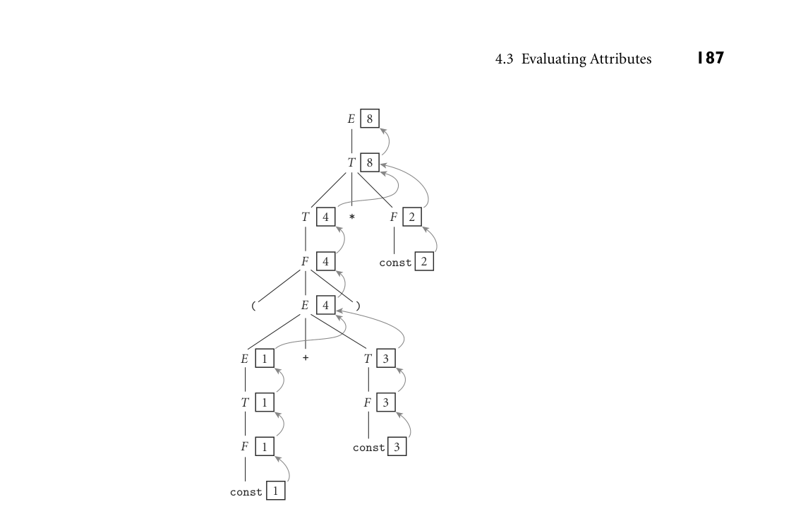
*Figure 4.2  Decoration of a parse tree for (1 + 3) * 2, using the attribute grammar of  Figure 4.1. The val attributes of symbols are shown in boxes. Curving arrows show the attribute  fow, which is strictly upward in this case. Each box holds the output of a single semantic rule;  the arrow(s) entering the box indicate the input(s) to the rule. At the second level of the tree,  for example, the two arrows pointing into the box with the 8 represent application of the rule  T1.val := product(T2 .val, F.val).  4.3  Evaluating Attributes*

The process of evaluating attributes is called annotation or decoration of the parse

EXAMPLE 4.6  tree. Figure 4.2 shows how to decorate the parse tree for the expression (1 + 3)   Decoration of a parse tree  * 2, using the AG of Figure 4.1. Once decoration is complete, the value of the  overall expression can be found in the val attribute of the root of the tree.  ■

Synthesized Attributes

The attribute grammar of Figure 4.1 is very simple. Each symbol has at most one  attribute (the punctuation marks have none). Moreover, they are all so-called  synthesized attributes: their values are calculated (synthesized) only in produc­ tions in which their symbol appears on the left-hand side. For annotated parse  trees like the one in Figure 4.2, this means that the attribute flow—the pattern in  which information moves from node to node—is entirely bottom-up.

An attribute grammar in which all attributes are synthesized is said to be S- attributed. The arguments to semantic functions in an S-attributed grammar are  always attributes of symbols on the right-hand side of the current production, and  the return value is always placed into an attribute of the left-hand side of the pro­ duction. Tokens (terminals) often have intrinsic properties (e.g., the character- string representation of an identifer or the value of a numeric constant); in a  compiler these are synthesized attributes initialized by the scanner.

Inherited Attributes

In general, we can imagine (and will in fact have need of) attributes whose values  are calculated when their symbol is on the right-hand side of the current produc­ tion. Such attributes are said to be inherited. They allow contextual information  to fow into a symbol from above or from the side, so that the rules of that produc­ tion can be enforced in different ways (or generate different values) depending on  surrounding context. Symbol table information is commonly passed from sym­ bol to symbol by means of inherited attributes. Inherited attributes of the root of  the parse tree can also be used to represent the external environment (character­ istics of the target machine, command-line arguments to the compiler, etc.).

EXAMPLE 4.7  As a simple example of inherited attributes, consider the following fragment  Top-down CFG and parse  of an LL(1) expression grammar (here covering only subtraction):  tree for subtraction

expr −→ const expr tail  expr tail −→ - const expr tail |

ϵ

For the expression 9 - 4 - 3, we obtain the following parse tree:

expr

9  expr_tail

  -
  4
  expr_tail

3  expr_tail  -

ϵ  ■

If we want to create an attribute grammar that accumulates the value of the  overall expression into the root of the tree, we have a problem: because subtrac­ tion is left associative, we cannot summarize the right subtree of the root with  a single numeric value. If we want to decorate the tree bottom-up, with an S- attributed grammar, we must be prepared to describe an arbitrary number of  right operands in the attributes of the top-most expr tail node (see Exercise 4.4).  This is indeed possible, but it defeats the purpose of the formalism: in effect, it  requires us to embed the entire tree into the attributes of a single node, and do all  the real work inside a single semantic function.

EXAMPLE 4.8

If, however, we are allowed to pass attribute values not only bottom-up but  also left-to-right in the tree, then we can pass the 9 into the top-most expr tail  node, where it can be combined (in proper left-associative fashion) with the 4.  The resulting 5 can then be passed into the middle expr tail node, combined with  the 3 to  make  2,  and then  passed upward to the  root:

Decoration with  left-to-right attribute flow

expr 2

const 9  expr_tail

9 2

  -
  const 4
  expr_tail

5 2

  -
  const 3
  expr_tail

2 2

ϵ  ■

EXAMPLE 4.9

To effect this style of decoration, we need the following attribute rules:

Top-down AG for  subtraction

expr −→ const expr tail

 expr tail.st := const.val   expr.val := expr tail.val

expr tail1 −→ - const expr tail2

 expr tail2.st := expr tail1.st − const.val   expr tail1.val := expr tail2.val

expr tail −→

ϵ

 expr tail.val := expr tail.st

In each of the frst two productions, the frst rule serves to copy the left context  (value of the expression so far) into a “subtotal” (st) attribute; the second rule  copies the fnal value from the right-most leaf back up to the root. In the expr tail  nodes of the picture in Example 4.8, the left box holds the st attribute; the right  holds val.  ■  We can fesh out the grammar fragment of Example 4.7 to produce a more  complete expression grammar, as shown (with shorter symbol names) in Fig­ ure 4.3. The underlying CFG for this grammar accepts the same language as the  one in Figure 4.1, but where that one was SLR(1), this one is LL(1). Attribute fow  for a parse of (1 + 3) * 2, using the LL(1) grammar, appears in Figure 4.4. As in  the grammar fragment of Example 4.9, the value of the left operand of each oper­ ator is carried into the TT and FT productions by the st (subtotal) attribute. The  relative complexity of the attribute fow arises from the fact that operators are left  associative, but the grammar cannot be left recursive: the left and right operands  of a given operator are thus found in separate productions. Grammars to perform

EXAMPLE 4.10

Top-down AG for constant  expressions

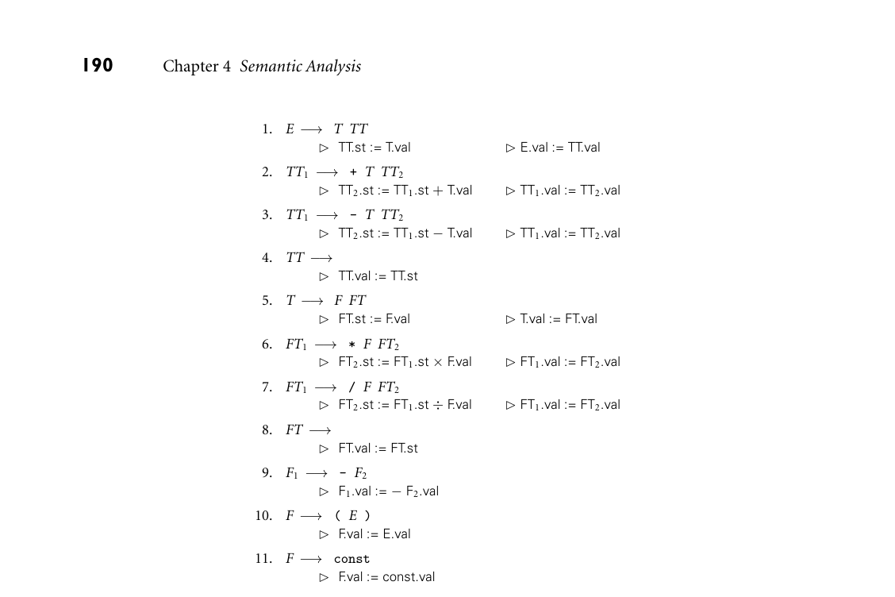
*Figure 4.3  An attribute grammar for constant expressions based on an LL(1) CFG. In this  grammar several productions have two semantic rules.*

semantic analysis for practical languages generally require some non-S-attributed  fow.  ■

Attribute Flow

Just as a context-free grammar does not specify how it should be parsed, an at­ tribute grammar does not specify the order in which attribute rules should be  invoked. Put another way, both notations are declarative: they defne a set of valid  trees, but they don’t say how to build or decorate them. Among other things, this  means that the order in which attribute rules are listed for a given production is  immaterial; attribute fow may require them to execute in any order. If, in Fig­ ure 4.3, we were to reverse the order in which the rules appear in productions  1, 2, 3, 5, 6, and/or 7 (listing the rule for symbol.val frst), it would be a purely  cosmetic change; the grammar would not be altered.

We say an attribute grammar is well defined if its rules determine a unique set  of values for the attributes of every possible parse tree. An attribute grammar is  noncircular if it never leads to a parse tree in which there are cycles in the attribute  fow graph—that is, if no attribute, in any parse tree, ever depends (transitively)

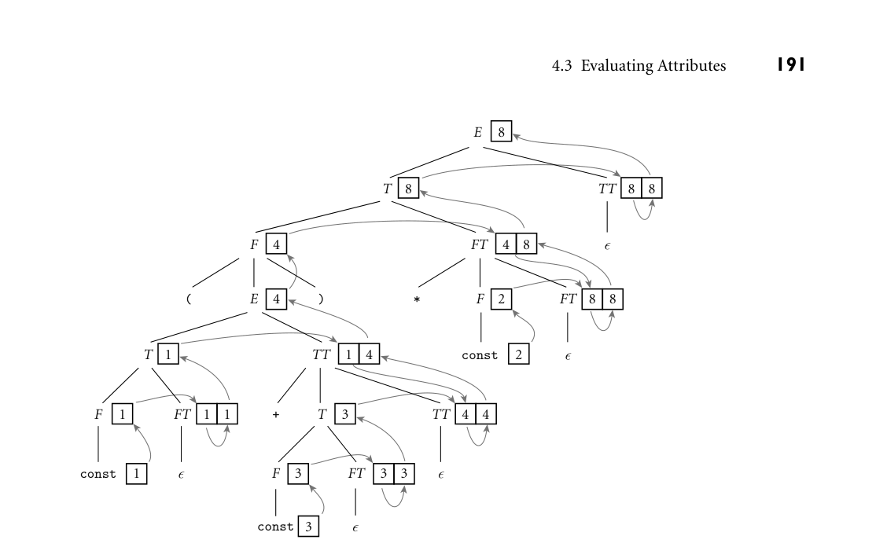
*Figure 4.4  Decoration of a top-down parse tree for (1 + 3) * 2, using the AG of Figure 4.3. Curving arrows again indicate  attribute fow; the arrow(s) entering a given box represent the application of a single semantic rule. Flow in this case is no  longer strictly bottom-up, but it is still left-to-right. At FT and TT nodes, the left box holds the st attribute; the right holds val.*

on itself. (A grammar can be circular and still be well defned if attributes are  guaranteed to converge to a unique value.) As a general rule, practical attribute  grammars tend to be noncircular.

An algorithm that decorates parse trees by invoking the rules of an attribute  grammar in an order consistent with the tree’s attribute fow is called a translation  scheme. Perhaps the simplest scheme is one that makes repeated passes over a  tree, invoking any semantic function whose arguments have all been defned, and  stopping when it completes a pass in which no values change. Such a scheme is  said to be oblivious, in the sense that it exploits no special knowledge of either the  parse tree or the grammar. It will halt only if the grammar is well defned. Better  performance, at least for noncircular grammars, may be achieved by a dynamic  scheme that tailors the evaluation order to the structure of a given parse tree—for  example, by constructing a topological sort of the attribute fow graph and then  invoking rules in an order consistent with the sort.

The fastest translation schemes, however, tend to be static—based on an analy­ sis of the structure of the attribute grammar itself, and then applied mechanically  to any tree arising from the grammar. Like LL and LR parsers, linear-time static  translation schemes can be devised only for certain restricted classes of gram­

mars. S-attributed grammars, such as the one in Figure 4.1, form the simplest  such class. Because attribute fow in an S-attributed grammar is strictly bottom- up, attributes can be evaluated by visiting the nodes of the parse tree in exactly  the same order that those nodes are generated by an LR-family parser. In fact, the  attributes can be evaluated on the fy during a bottom-up parse, thereby inter­ leaving parsing and semantic analysis (attribute evaluation).

The attribute grammar  of Figure 4.3  is a good bit messier than that of Fig­ ure 4.1, but it is still L-attributed: its attributes can be evaluated by visiting the  nodes of the parse tree in a single left-to-right, depth-frst traversal (the same or­ der in which they are visited during a top-down parse—see Figure 4.4). If we say  that an attribute A.s depends on an attribute B.t if B.t is ever passed to a semantic  function that returns a value for A.s, then we can defne L-attributed grammars  more formally with the following two rules: (1) each synthesized attribute of a  left-hand-side symbol depends only on that symbol’s own inherited attributes or  on attributes (synthesized or inherited) of the production’s right-hand-side sym­ bols, and (2) each inherited attribute of a right-hand-side symbol depends only  on inherited attributes of the left-hand-side symbol or on attributes (synthesized  or inherited) of symbols to its left in the right-hand side.

Because L-attributed grammars permit rules that initialize attributes of the  left-hand side of a production using attributes of symbols on the right-hand  side, every S-attributed grammar is also an L-attributed grammar. The reverse  is not the case: S-attributed grammars do not permit the initialization of at­ tributes on the right-hand side, so there are L-attributed grammars that are not  S-attributed.

S-attributed attribute grammars are the most general class of attribute gram­ mars for which evaluation can be implemented on the fy during an LR parse.  L-attributed grammars are the most general class for which evaluation can be im­ plemented on the fy during an LL parse. If we interleave semantic analysis (and  possibly intermediate code generation) with parsing, then a bottom-up parser  must in general be paired with an S-attributed translation scheme; a top-down  parser must be paired with an L-attributed translation scheme. (Depending on  the structure of the grammar, it is often possible for a bottom-up parser to ac­ commodate some non-S-attributed attribute fow; we consider this possibility in  Section C 4.5.1.) If we choose to separate parsing and semantic analysis into sepa­ rate passes, then the code that builds the parse tree or syntax tree must still use an  S-attributed or L-attributed translation scheme (as appropriate), but the semantic  analyzer can use a more powerful scheme if desired. There are certain tasks, such  as the generation of code for “short-circuit” Boolean expressions (to be discussed  in Sections 6.1.5 and 6.4.1), that are easiest to accomplish with a non-L-attributed  scheme.

One-Pass Compilers

A compiler that interleaves semantic analysis and code generation with parsing is  said to be a one-pass compiler.3 It is unclear whether interleaving semantic analysis  with parsing makes a compiler simpler or more complex; it’s mainly a matter  of taste. If intermediate code generation is interleaved with parsing, one need  not build a syntax tree at all (unless of course the syntax tree is the intermediate  code). Moreover, it is often possible to write the intermediate code to an output  fle on the fy, rather than accumulating it in the attributes of the root of the  parse tree. The resulting space savings were important for previous generations  of computers, which had very small main memories. On the other hand, semantic  analysis is easier to perform during a separate traversal of a syntax tree, because  that tree refects the program’s semantic structure better than the parse tree does,  especially with a top-down parser, and because one has the option of traversing  the tree in an order other than that chosen by the parser.

Building a Syntax Tree

If we choose not to interleave parsing and semantic analysis, we still need to add  attribute rules to the context-free grammar, but they serve only to create the syn-

EXAMPLE 4.11  tax tree—not to enforce semantic rules or generate code. Figures 4.5 and 4.6  Bottom-up and top-down  contain bottom-up and top-down attribute grammars, respectively, to build a  AGs to build a syntax tree  syntax tree for constant expressions. The attributes in these grammars hold nei­ ther numeric values nor target code fragments; instead they point to nodes of  the syntax tree. Function make leaf returns a pointer to a newly allocated syntax  tree node containing the value of a constant. Functions make un op and make  bin op return pointers to newly allocated syntax tree nodes containing a unary or

DESIGN & IMPLEMENTATION

4.2 Forward references  In Sections 3.3.3 and C 3.4.1 we noted that the scope rules of many languages  require names to be declared before they are used, and provide special mech­ anisms to introduce the forward references needed for recursive defnitions.  While these rules may help promote the creation of clear, maintainable code,  an equally important motivation, at least historically, was to facilitate the con­ struction of one-pass compilers. With increases in memory size, processing  speed, and programmer expectations regarding the quality of code improve­ ment, multipass compilers have become ubiquitous, and language designers  have felt free (as, for example, in the class declarations of C++, Java, and C#)  to abandon the requirement that declarations precede uses.

3  Most authors use the term one-pass only for compilers that translate all the way from source to  target code in a single pass. Some authors insist only that intermediate code be generated in a  single pass, and permit additional pass(es) to translate intermediate code to target code.

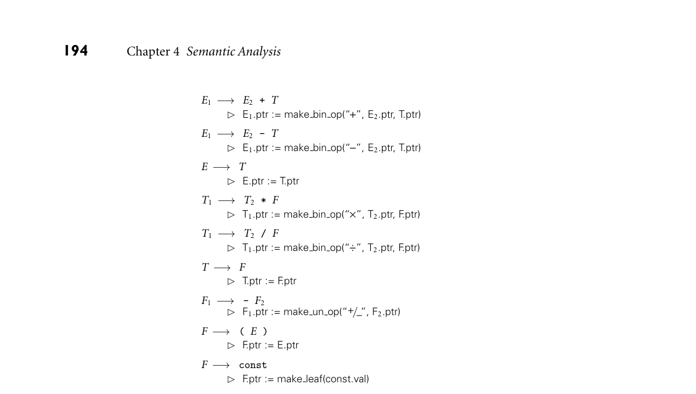
*Figure 4.5  Bottom-up (S-attributed) attribute grammar to construct a syntax tree. The  symbol +/− is used (as it is on calculators) to indicate change of sign.*

binary operator, respectively, and pointers to the supplied operand(s). Figures 4.7  and 4.8 show stages in the decoration of parse trees for (1 + 3) * 2, using  the   grammars of Figures 4.5 and 4.6, respectively. Note that the fnal syntax tree is the  same in each case.  ■

3CHECK YOUR UNDERSTANDING  1.  What determines whether a language rule is a matter of syntax or of static  semantics?  2.  Why is it impossible to detect certain program errors at compile time, even  though they can be detected at run time?

  3.
  What
  is
  an
  attribute grammar?
  4.
  What are programming assertions? What is their purpose?
  5.
  What is the difference between synthesized and inherited attributes?

  6.
  Give two examples of information that is typically passed through inherited
  attributes.

  7.
  What
  is
  attribute flow?
  8.
  What
  is
  a
  one-pass compiler?

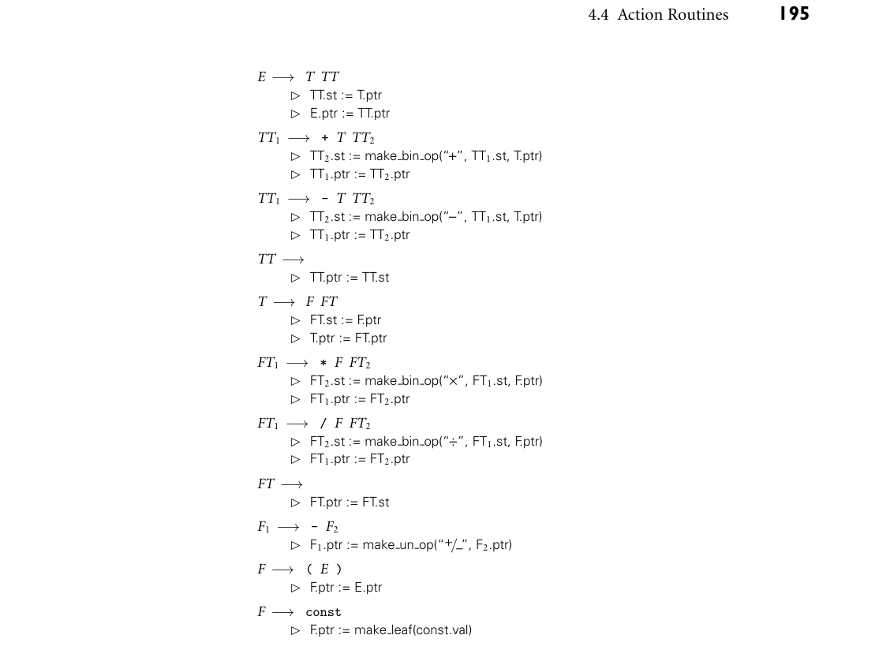
*Figure 4.6  Top-down (L-attributed) attribute grammar to construct a syntax tree. Here the  st attribute, like the ptr attribute (and unlike the st attribute of Figure 4.3), is a pointer to a  syntax tree node.*

  9.
  What does it mean for an attribute grammar to be S-attributed? L-attributed?
  Noncircular? What is the signifcance of these grammar classes?

## 4.4  Action Routines

Just as there are automatic tools that will construct a parser for a given context- free grammar, there are automatic tools that will construct a semantic analyzer  (attribute evaluator) for a given attribute grammar. Attribute evaluator gen­

E

T

*

×

T  (d) F *

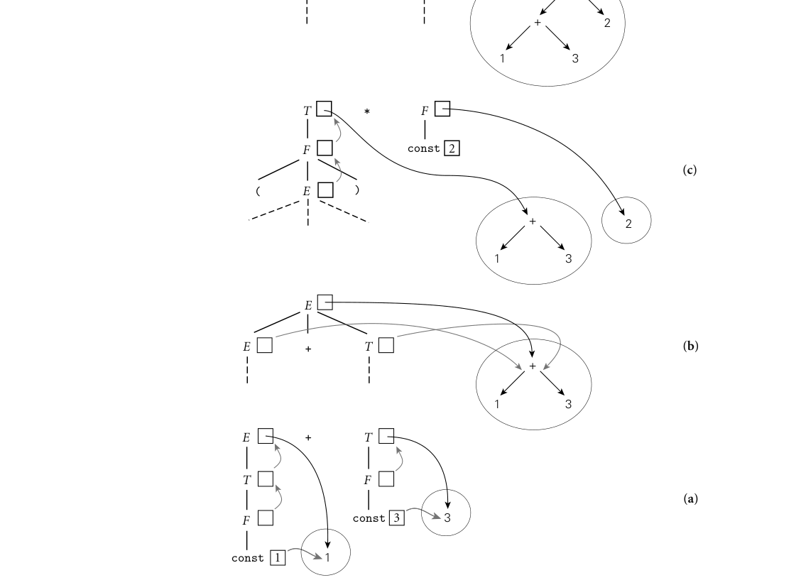
*Figure 4.7  Construction of a syntax tree for (1 + 3) * 2 via decoration of a bottom-up  parse tree, using the grammar of Figure 4.5. This fgure reads from bottom to top. In diagram  (a), the values of the constants 1 and 3 have been placed in new syntax tree leaves. Pointers  to these leaves propagate up into the attributes of E and T. In (b), the pointers to these leaves  become child pointers of a new internal + node. In (c) the pointer to this node propagates up  into the attributes of T, and a new leaf is created for 2. Finally, in (d), the pointers from T and F  become child pointers of a new internal × node, and a pointer to this node propagates up into  the attributes of E.*

E

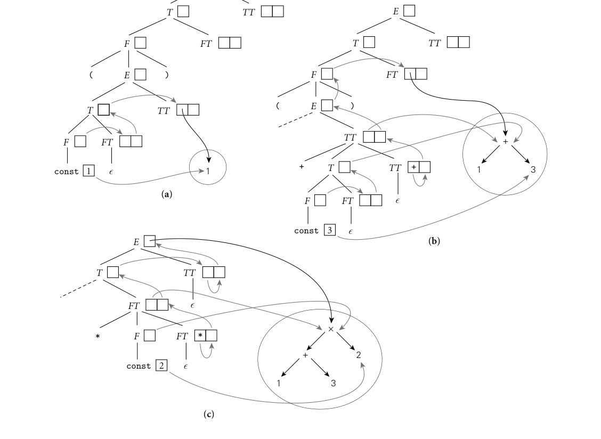
*Figure 4.8  Construction of a syntax tree via decoration of a top-down parse tree, using the grammar of Figure 4.6. In the  top diagram, (a), the value of the constant 1 has been placed in a new syntax tree leaf. A pointer to this leaf then propagates to  the st attribute of TT. In (b), a second leaf has been created to hold the constant 3. Pointers to the two leaves then become  child pointers of a new internal + node, a pointer to which propagates from the st attribute of the bottom-most TT, where   it was created, all the way up and over to the st attribute of the top-most FT. In (c), a third leaf has been created for the  constant 2. Pointers to this leaf and to the + node then become the children of a new × node, a pointer to which propagates  from the st of the lower FT, where it was created, all the way to the root of the tree.*

erators have been used in syntax-based editors [RT88], incremental compil­ ers [SDB84], web-page layout [MTAB13], and various aspects of programming  language research. Most production compilers, however, use an ad hoc, hand­ written translation scheme, interleaving parsing with the construction of a syntax  tree and, in some cases, other aspects of semantic analysis or intermediate code  generation. Because they evaluate the attributes of each production as it is parsed,  they do not need to build the full parse tree.

An ad hoc translation scheme that is interleaved with parsing takes the form  of a set of action routines. An action routine is a semantic function that the pro­ grammer (grammar writer) instructs the compiler to execute at a particular point  in the parse. Most parser generators allow the programmer to specify action rou­ tines. In an LL parser generator, an action routine can appear anywhere within a  right-hand side. A routine at the beginning of a right-hand side will be called as  soon as the parser predicts the production. A routine embedded in the middle of  a right-hand side will be called as soon as the parser has matched (the yield of) the  symbol to the left. The implementation mechanism is simple: when it predicts a  production, the parser pushes all of the right-hand side onto the stack, including  terminals (to be matched), nonterminals (to drive future predictions), and point­ ers to action routines. When it fnds a pointer to an action routine at the top of  the parse stack, the parser simply calls it, passing (pointers to) the appropriate  attributes as arguments.

EXAMPLE 4.12  To make this process more concrete, consider again our LL(1) grammar for  Top-down action routines  constant expressions. Action routines to build a syntax tree while parsing this  to build a syntax tree  grammar appear in Figure 4.9. The only difference between this grammar and  the one in Figure 4.6 is that the action routines (delimited here with curly braces)  are embedded  among  the symbols  of  the right-hand  sides;  the work  performed   is the same. The ease with which the attribute grammar can be transformed into  the grammar with action routines is due to the fact that the attribute grammar is  L-attributed. If it required more complicated fow, we would not be able to cast it  as action routines.  ■

DESIGN & IMPLEMENTATION

4.3 Attribute evaluators  Automatic evaluators based on formal attribute grammars are popular in lan­ guage research projects because they save developer time when the language  defnition changes. They are popular in syntax-based editors  and incremental   compilers because they save execution time: when a small change is made to  a program, the evaluator may be able to “patch up” tree decorations signif­ cantly faster than it could rebuild them from scratch. For the typical compiler,  however, semantic analysis based on a formal attribute grammar is overkill: it  has higher overhead than action routines, and doesn’t really save the compiler  writer that much work.

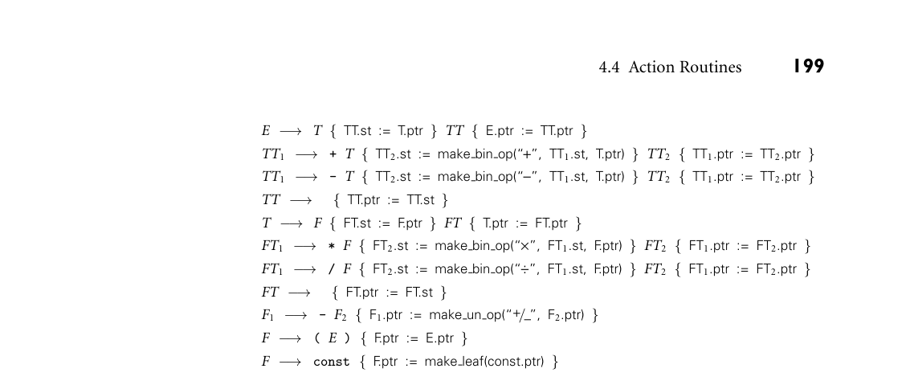
*Figure 4.9  LL(1) grammar with action routines to build a syntax tree.*

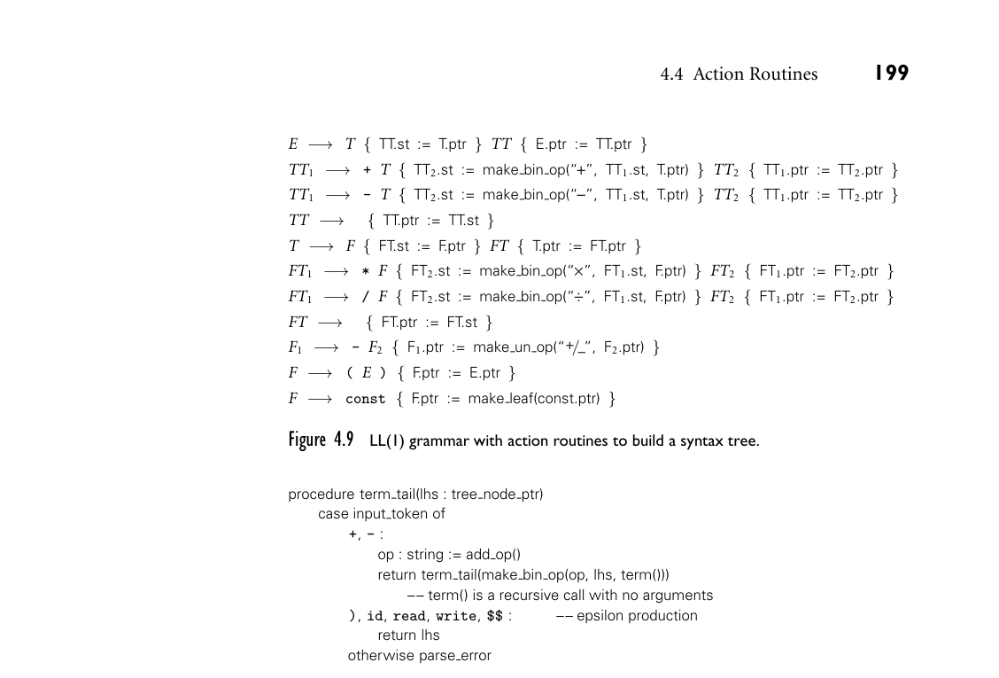
*Figure 4.10  Recursive descent parsing with embedded “action routines.” Compare with the  routine of the same name in Figure 2.17, and with productions 2 through 4 in Figure 4.9.*

As in ordinary parsing, there is a strong analogy between recursive descent and

EXAMPLE 4.13  table-driven parsing with action routines. Figure 4.10 shows the term tail rou- Recursive descent and  tine from Figure 2.17, modifed to do its part in constructing a syntax tree. The  action routines  behavior of this routine mirrors that of productions 2 through 4 in Figure 4.9.  The routine accepts as a parameter a pointer to the syntax tree fragment con­ tained in the attribute grammar’s TT1. Then,  given  an  upcoming  + or - sym­ bol on the input, it (1) calls add op to parse that symbol (returning a character  string representation); (2) calls term to  parse the  attribute grammar’s  T; (3) calls  make bin op to create a new tree node; (4) passes that node to term tail, which   parses the attribute grammar’s TT2; and (5) returns the result.  ■

Bottom-Up Evaluation

In an LR parser generator, one cannot in general embed action routines at arbi­ trary places in a right-hand side, since the parser does not in general know what  production it is in until it has seen all or most of the yield. LR parser generators  therefore permit action routines only in the portion (suffx) of the right-hand

side in which the production being parsed can be identifed unambiguously (this  is known as the trailing part; the ambiguous prefx is the left corner). If the at­ tribute fow of the action routines is strictly bottom-up (as it is in an S-attributed  attribute grammar), then execution at the end of right-hand sides is all that is  needed. The attribute grammars of Figures 4.1 and 4.5, in fact, are essentially  identical to the action routine versions. If the action routines are responsible for  a signifcant part of semantic analysis, however (as opposed to simply building  a syntax tree), then they will often need contextual information in order to do  their job. To obtain and use this information in an LR parse, they will need some  (necessarily limited) access to inherited attributes or to information outside the  current production. We consider this issue further in Section C 4.5.1.

## 4.5  Space Management for Attributes

Any attribute evaluation method requires space to hold the attributes of the gram­ mar symbols. If we are building an explicit parse tree, then the obvious approach  is to store attributes in the nodes of the tree themselves. If we are not building a  parse tree, then we need to fnd a way to keep track of the attributes for the sym­ bols we have seen (or predicted) but not yet fnished parsing. The details differ in  bottom-up and top-down parsers.

For a bottom-up parser with an S-attributed grammar, the obvious approach  is to maintain an attribute stack that directly mirrors the parse stack: next to every  state number on the parse stack is an attribute record for the symbol we shifted  when we entered that state. Entries in the attribute stack are pushed and popped  automatically by the parser driver; space management is not an issue for the writer  of action routines. Complications arise if we try to achieve the effect of inherited  attributes, but these can be accommodated within the basic attribute-stack frame­ work.

For a top-down parser with an L-attributed grammar, we have two principal  options. The frst option is automatic, but more complex than for bottom-up  grammars. It still uses an attribute stack, but one that does not mirror the parse  stack. The second option has lower space overhead, and saves time by “short­ cutting” copy rules, but requires action routines to allocate and deallocate space  for attributes explicitly.

In both families of parsers, it is common for some of the contextual infor­ mation for action routines to be kept in global variables. The symbol table in  particular is usually global. Rather than pass its full contents through attributes  from one production to the next, we pass an indication of the currently active  scope. Lookups in the global table then use this scope information to obtain the  right referencing environment.

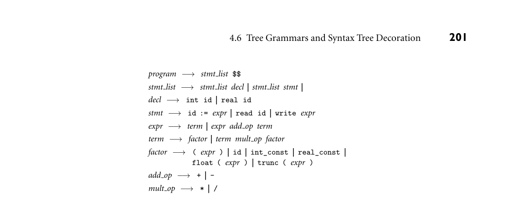
*Figure 4.11  Context-free grammar for a calculator language with types and declarations.  The intent is that every identifer be declared before use, and that types not be mixed in com­ putations.*

IN MORE DEPTH

We consider attribute space management in more detail on the companion site.  Using bottom-up and top-down grammars for arithmetic expressions, we illus­ trate automatic management for both bottom-up and top-down parsers, as well  as the ad hoc option for top-down parsers.

## 4.6  Tree Grammars and Syntax Tree Decoration

In our discussion so far we have used attribute grammars solely to decorate parse  trees. As we mentioned in the chapter introduction, attribute grammars can also  be used to decorate syntax trees. If our compiler uses action routines simply to  build a syntax tree, then the bulk of semantic analysis and intermediate code gen­ eration will use the syntax tree as base.

EXAMPLE 4.14  Figure 4.11 contains a bottom-up CFG for a calculator language with types and  Bottom-up CFG for  declarations. The grammar differs from that of Example 2.37 in three ways: (1) we  calculator language with  allow declarations to be intermixed with statements, (2) we differentiate between  types  integer and real constants (presumably the latter contain a decimal point), and (3)  we require explicit conversions between integer and real operands. The intended  semantics of our language requires that every identifer be declared before it is  used, and that types not be mixed in computations.  ■

EXAMPLE 4.15  Extrapolating from the example in Figure 4.5, it is easy to add semantic func- Syntax tree to average an  tions or action routines to the grammar of Figure 4.11 to construct a syntax tree  integer and a real  for the calculator language (Exercise 4.21). The obvious structure for such a tree  would represent expressions as we did in Figure 4.7, and would represent a pro­ gram as a linked list of declarations and statements. As a concrete example, Fig­ ure 4.12 contains the syntax tree for a simple program to print the average of an  integer and a real.  ■

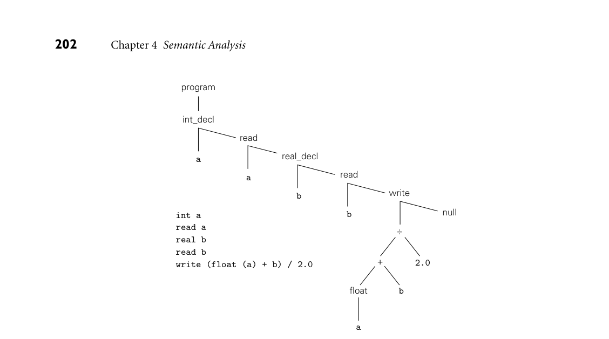
*Figure 4.12  Syntax tree for a simple calculator program.*

EXAMPLE 4.16  Much as a context-free grammar describes the possible structure of parse trees  Tree grammar for the  for a given programming language, we can use a tree grammar to represent the  calculator language with  possible structure of syntax trees. As in a CFG, each production of a tree grammar  types  represents a possible relationship between a parent and its children in the tree.  The parent is the symbol on the left-hand side of the production; the children are  the symbols  on  the right-hand side.  The productions used in Figure 4.12 might  look something like the following:

program −→ item

int decl : item −→ id item

read : item −→ id item

real decl : item −→ id item

write : item −→ expr item

null : item −→

ϵ

‘÷’ :  expr  −→ expr expr

‘+’ :  expr  −→ expr expr

float : expr −→ expr

id : expr −→

ϵ

real const : expr −→

ϵ

Here the notation A : B  on the left-hand side of a production means that A is one  variant of B, and may appear anywhere a B is expected on a right-hand side.  ■

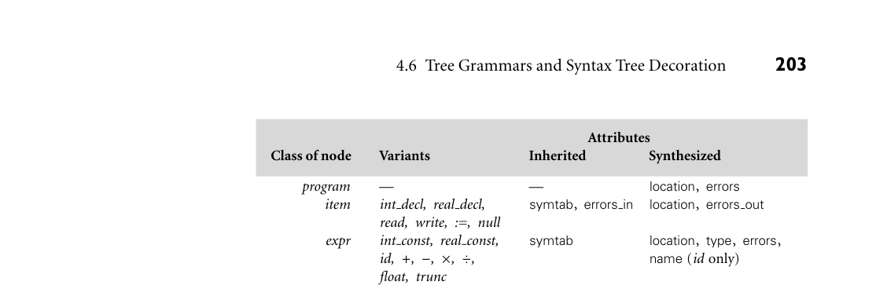
*Figure 4.13  Classes of nodes for the syntax tree attribute grammar of Figure 4.14. With the  exception of name, all variants of a given class have all the class’s attributes.*

Tree grammars and context-free grammars differ in important ways.  A  context-free grammar is meant to defne (generate) a language composed of  strings of tokens, where each string is the fringe (yield) of a parse tree. Pars­ ing is the process of fnding a tree that has a given yield. A tree grammar, as we  use it here, is meant to defne (or generate) the trees themselves. We have no need  for a notion of parsing: we can easily inspect a tree and determine whether (and  how) it can be generated by the grammar. Our purpose in introducing tree gram­ mars is to provide a framework for the decoration of syntax trees. Semantic rules  attached to the productions of a tree grammar can be used to defne the attribute  fow of a syntax tree in exactly the same way that semantic rules attached to the  productions of a context-free grammar are used to defne the attribute fow of a  parse tree. We will use a tree grammar in the remainder of this section to perform  static semantic checking. In Chapter 15 we will show how additional semantic  rules can be used to generate intermediate code.

EXAMPLE 4.17  A complete tree attribute grammar for our calculator language with types can  Tree AG for the calculator  be constructed using the node classes, variants, and attributes shown in Fig- language with types  ure 4.13. The grammar itself appears in Figure 4.14. Once decorated, the program  node at the root of the syntax tree will contain a list, in a synthesized attribute,  of all static semantic errors in the program. (The list will be empty if the pro­ gram is free of such errors.) Each item or expr node has an inherited attribute  symtab that contains a list, with types, of all identifers declared to the left in the  tree. Each item node also has an inherited attribute errors in that lists all static  semantic errors found to its left in the tree, and a synthesized attribute errors out  to propagate the fnal error list back to the root. Each expr node has one synthe­ sized attribute that indicates its type and another that contains a list of any static  semantic errors found inside.

Our handling of semantic errors illustrates a common technique. In order to  continue looking for other errors, we must provide values for any attributes that  would have been set in the absence of an error. To avoid cascading error mes­ sages, we choose values for those attributes that will pass quietly through subse­ quent checks. In this specifc case we employ a pseudotype called error, which

program −→ item

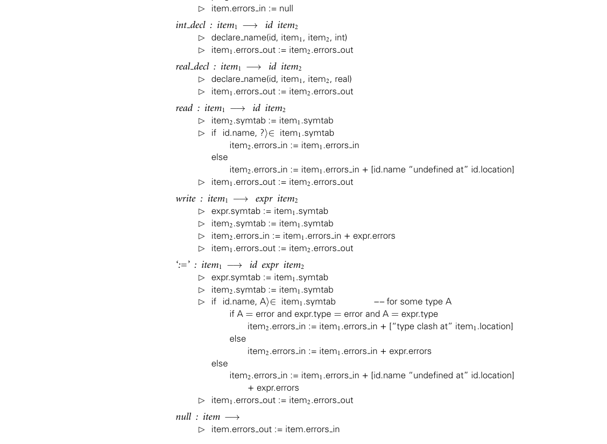
*Figure 4.14  Attribute grammar to decorate an abstract syntax tree for the calculator lan­ guage with types. We use square brackets to delimit error messages and pointed brackets to  delimit symbol table entries. Juxtaposition indicates concatenation within error messages; the  ‘+’ and  ‘−’ operators indicate insertion and removal in lists. We assume that every node has  been initialized by the scanner or by action routines in the parser to contain an indication of  the location (line and column) at which the corresponding construct appears in the source (see  Exercise 4.22). The ‘?’ symbol is used as a “wild card”; it matches any type. (continued)*

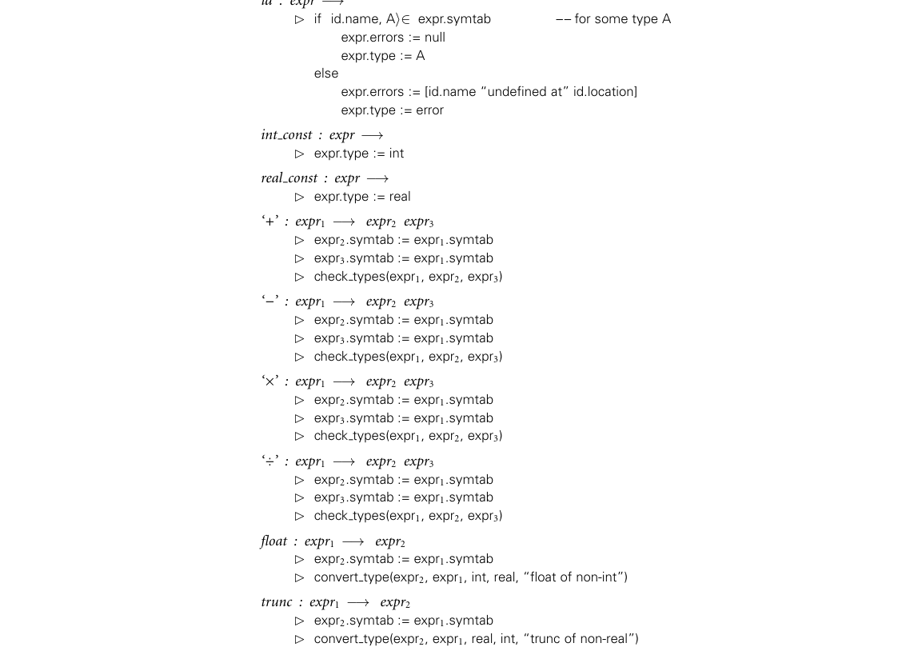
*Figure 4.14  (continued on next page)*

we associate with any symbol table entry or expression for which we have already  generated a message.

Though it takes a bit of checking to verify the fact, our attribute grammar is  noncircular and well defned. No attribute is ever assigned a value more than  once. (The helper routines at the end of Figure 4.14 should be thought of as  macros, rather than semantic functions. For the sake of brevity we have passed  them entire tree nodes as arguments. Each macro calculates the values of two dif­ ferent attributes. Under a strict formulation of attribute grammars each macro

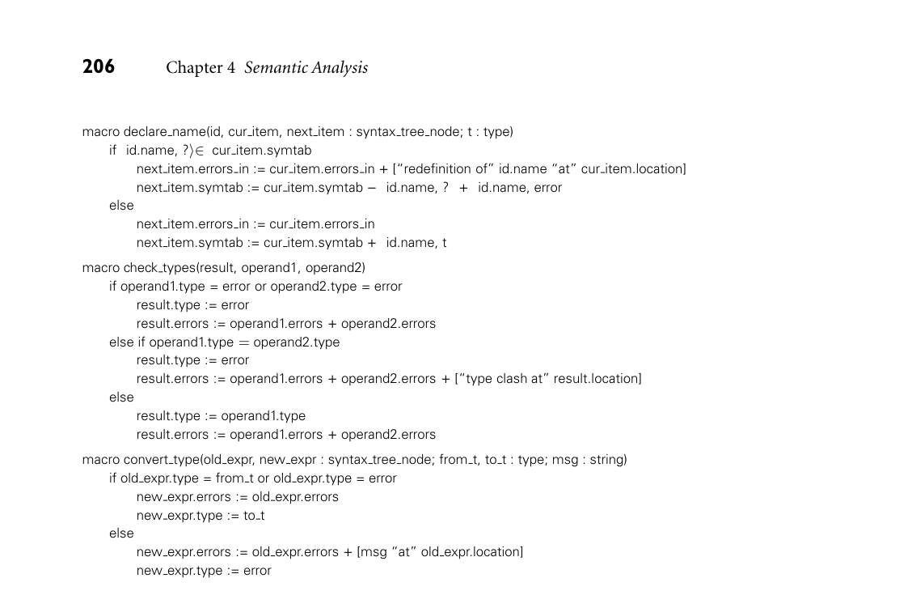
*Figure 4.14  (continued)*

would be replaced by two separate semantic functions, one per calculated at­ tribute.)  ■

EXAMPLE 4.18  Figure 4.15 uses the grammar of Figure 4.14 to decorate the syntax tree of  Decorating a tree with the  Figure 4.12. The pattern of attribute fow appears considerably messier than in  AG of Example 4.17  previous examples in this chapter, but this is simply because type checking is more  complicated than calculating constants or building a syntax tree. Symbol table  information fows along the chain of items and  down  into  expr trees. The int decl  and real decl nodes add new information; other nodes simply pass the table along.  Type information is synthesized at id : expr leaves by looking up an identifer’s  name in the symbol table. The information then propagates upward within an  expression tree, and is used to type-check operators and assignments (the latter  don’t appear in this example). Error messages fow along the chain of items via   the errors in attributes, and then back to the root via the errors out attributes.  Messages also fow up out of expr trees. Wherever a type check is performed, the  type attribute may be used to help create a new message to be appended to the  growing message list.  ■  In our example grammar we accumulate error messages into a synthesized at­ tribute of the root of the syntax tree. In an ad hoc attribute evaluator we might be  tempted to print these messages on the fy as the errors are discovered. In prac­

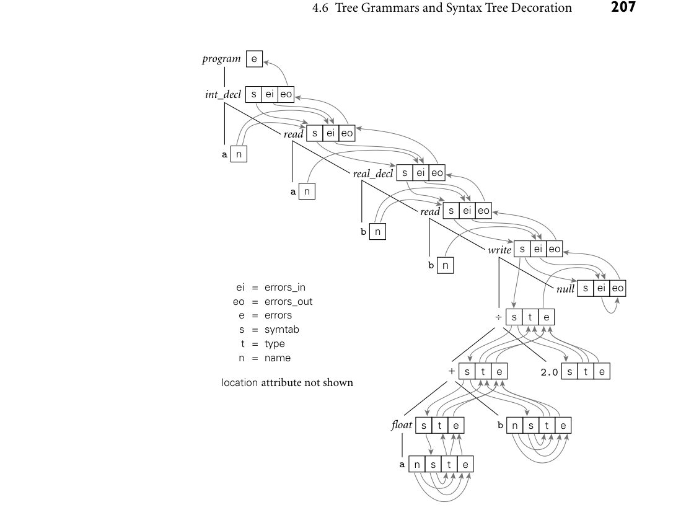
*Figure 4.15  Decoration of the syntax tree of Figure 4.12, using the grammar of Figure 4.14.  Location information, which we assume has been initialized in every node by the parser, con­ tributes to error messages, but does not otherwise propagate through the tree.*

tice, however, particularly in a multipass compiler, it makes sense to buffer the  messages, so they can be interleaved with messages produced by other phases of  the compiler, and printed in program order at the end of compilation.

One could convert our attribute grammar into executable code using an au­ tomatic attribute evaluator generator. Alternatively, one could create an ad hoc  evaluator in the form of mutually recursive subroutines (Exercise 4.20). In the lat­ ter case attribute fow would be explicit in the calling sequence of the routines. We  could then choose if desired to keep the symbol table in global variables, rather  than passing it from node to node through attributes. Most compilers employ the  ad hoc approach.

3CHECK YOUR UNDERSTANDING  10. What is the difference between a semantic function and an action routine?  11. Why can’t action routines be placed at arbitrary locations within the right- hand side of productions in an LR CFG?  12. What patterns of attribute fow can be captured easily with action routines?

* Some compilers perform all semantic checks and intermediate code genera­

tion in action routines. Others use action routines to build a syntax tree and  then perform semantic checks and intermediate code generation in separate  traversals of the syntax tree. Discuss the tradeoffs between these two strate­ gies.

* What sort of information do action routines typically keep in global variables,
  rather than in attributes?

* Describe the similarities and differences between context-free grammars and
  tree grammars.

* How can a semantic analyzer avoid the generation of cascading error mes­

sages?

## 4.7  Summary and Concluding Remarks

This chapter has discussed the task of semantic analysis. We reviewed the sorts of  language rules that can be classifed as syntax, static semantics, and dynamic se­ mantics, and discussed the issue of whether to generate code to perform dynamic  semantic checks. We also considered the role that the semantic analyzer plays in  a typical compiler. We noted that both the enforcement of static semantic rules  and the generation of intermediate code can be cast in terms of annotation, or  decoration, of a parse tree or syntax tree. We then presented attribute grammars  as a formal framework for this decoration process.

An attribute grammar associates attributes with each symbol in a context-free  grammar or tree grammar, and attribute rules with each production. In a CFG,  synthesized attributes are calculated only in productions in which their symbol  appears on the left-hand side. The synthesized attributes of tokens are initialized  by the scanner. Inherited attributes are calculated in productions in which their  symbol appears within the right-hand side; they allow calculations in the subtree  below a symbol to depend on the context in which the symbol appears. Inher­ ited attributes of the start symbol (goal) can represent the external environment  of the compiler. Strictly speaking, attribute grammars allow only copy rules (as­ signments of one attribute to another) and simple calls to semantic functions, but   we usually relax this restriction to allow more or less arbitrary code fragments in  some existing programming language.

Just as context-free grammars can be categorized according to the parsing al­ gorithm(s) that can use them, attribute grammars can be categorized according to  the complexity of their pattern of attribute flow. S-attributed grammars, in which  all attributes are synthesized, can naturally be evaluated in a single bottom-up  pass over a parse tree, in precisely the order the tree is discovered by an LR-family  parser. L-attributed grammars, in which all attribute fow is depth-frst left-to­ right, can be evaluated in precisely the order that the parse tree is predicted and  matched by an LL-family parser. Attribute grammars with more complex pat­ terns of attribute fow are not commonly used for the parse trees of production  compilers, but are valuable for syntax-based editors, incremental compilers, and  various other tools.

While it is possible to construct automatic tools to analyze attribute fow and  decorate parse trees, most compilers rely on action routines, which  the compiler   writer embeds in the right-hand sides of productions to evaluate attribute rules at  specifc points in a parse. In an LL-family parser, action routines can be embed­ ded at arbitrary points in a production’s right-hand side. In an LR-family parser,  action routines must follow the production’s left corner. Space  for  attributes  in   a bottom-up compiler is naturally allocated in parallel with the parse stack, but  this complicates the management of inherited attributes. Space for attributes in a  top-down compiler can be allocated automatically, or managed explicitly by the  writer of action routines. The automatic approach has the advantage of regularity,  and is easier to maintain; the ad hoc approach is slightly faster and more fexible.

In a one-pass compiler, which interleaves scanning, parsing, semantic analysis,  and code generation in a single traversal of its input, semantic functions or action  routines are responsible for all of semantic analysis and code generation. More  commonly, action routines simply build a syntax tree, which is then decorated  during separate traversal(s) in subsequent pass(es). The code for these traversals  is usually written by hand, in the form of mutually recursive subroutines, allowing  the compiler to accommodate essentially arbitrary attribute fow on the syntax  tree.

In subsequent chapters (6–10 in particular) we will consider a wide variety  of programming language constructs. Rather than present the actual attribute  grammars required to implement these constructs, we will describe their seman­ tics informally, and give examples of the target code. We will return to attribute  grammars in Chapter 15, when we consider the generation of intermediate code  in more detail.

## 4.8  Exercises

4.1  Basic results from automata theory tell us that the language L = an bn cn =

ϵ

, abc, aabbcc, aaabbbccc, ... is not context free. It can be captured,  however, using an attribute grammar. Give an underlying CFG and a set of  attribute rules that associates a Boolean attribute ok with the root R of each

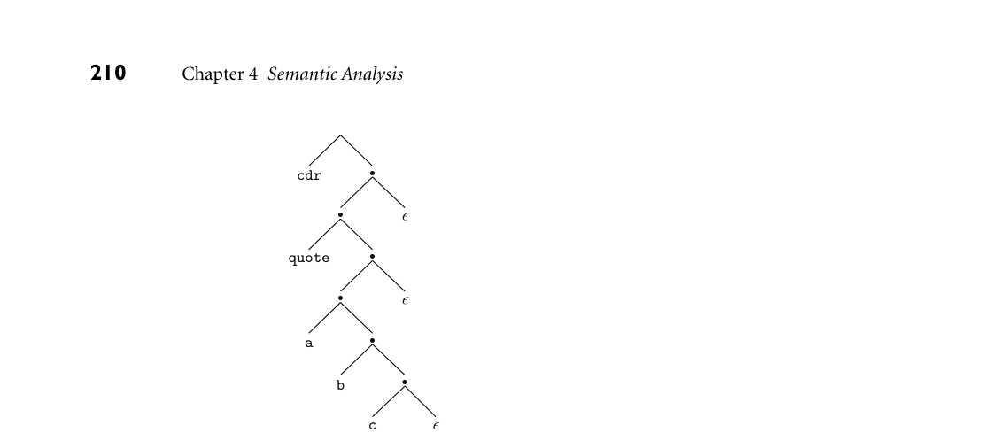
*Figure 4.16  Natural syntax tree for the Lisp expression (cdr ‚(a b c)).*

parse tree, such that R.ok = true if and only if the string corresponding to  the fringe of the tree is in L.

4.2  Modify  the grammar  of Figure  2.25 so that it accepts  only  programs  that   contain at least one write statement. Make the same change in the solution  to Exercise 2.17. Based on your experience, what do you think of the idea of  using the CFG to enforce the rule that every function in C must contain at  least one return statement?

4.3  Give two examples of reasonable semantic rules that cannot be checked at  reasonable cost, either statically or by compiler-generated code at run time.

4.4  Write an S-attributed attribute grammar, based on the CFG of Example 4.7,  that accumulates the value of the overall expression into the root of the  tree. You will need to use dynamic memory allocation so that individual  attributes can hold an arbitrary amount of information.

4.5  Lisp has the unusual property that its programs take the form of parenthe­ sized lists. The natural syntax tree for a Lisp program is thus a tree of binary  cells (known in Lisp as cons cells), where the frst child represents the frst  element of the list and the second child represents the rest of the list. The  syntax tree for (cdr ‚(a b c)) appears in Figure 4.16. (The notation ‚L is  syntactic sugar for (quote L).)

Extend the CFG of Exercise 2.18 to create an attribute grammar that will  build such trees. When a parse tree has been fully decorated, the root should  have an attribute v that refers to the syntax tree. You may assume that each  atom has a synthesized attribute v that refers to a syntax tree node that holds  information from the scanner. In your semantic functions, you may assume  the availability of a cons function that takes two references as arguments  and returns a reference to a new cons cell containing those references.

4.6  Refer back to the context-free grammar of Exercise 2.13. Add attribute rules  to the grammar to accumulate into the root of the tree a count of the max­ imum depth to which parentheses are nested in the program string. For  example, given the string f1(a, f2(b * (c + (d - (e - f))))), the  stmt  at the root of the tree should have an attribute with a count of 3 (the paren­ theses surrounding argument lists don’t count).

4.7  Suppose that we want to translate constant expressions into the postfx,  or “reverse Polish” notation of logician Jan Łukasiewicz. Postfx notation  does not require parentheses. It appears in stack-based languages such as  Postscript, Forth, and the P-code and Java bytecode intermediate forms  mentioned in Section 1.4. It also served, historically, as the input language  of certain hand-held calculators made by Hewlett-Packard. When given a  number, a postfx calculator would push the number onto an internal stack.  When given an operator, it would pop the top two numbers from the stack,  apply the operator, and push the result. The display would show the value  at the top of the stack. To compute 2 × (15 − 3)/4, for example, one would  push 2 E  E  E  E  E 1 5 3 - * 4 / (here  is the “enter” key, used to end the  string of digits that constitute a number).

Using the underlying CFG of Figure 4.1, write an attribute grammar that  will associate with the root of the parse tree a sequence of postfx calculator  button pushes, seq, that will compute the arithmetic value of the tokens  derived from that symbol. You may assume the existence of a function  buttons(c) that returns a sequence of button pushes (ending with E on a  postfx calculator) for the constant c. You may also assume the existence of  a concatenation function for sequences of button pushes.

4.8  Repeat the previous exercise using the underlying CFG of Figure 4.3.

4.9  Consider the following grammar for reverse Polish arithmetic expressions:

E −→ E E op  | id

op −→ + | - | * | /

Assuming that each id has a synthesized attribute name of type string, and  that each E and op has an attribute val of type string, write an attribute  grammar that arranges for the val attribute of the root of the parse tree to  contain a translation of the expression into conventional infx notation. For  example, if the leaves of the tree, left to right, were “A A B - * C /,” then  the val feld of the root would be “( ( A * ( A - B ) ) / C ).” As an extra  challenge, write a version of your attribute grammar that exploits the usual  arithmetic precedence and associativity rules to use as few parentheses as  possible.

4.10 To reduce the likelihood of typographic errors, the digits comprising most  credit card numbers are designed to satisfy the so-called Luhn formula, stan­ dardized by ANSI in the 1960s, and named for IBM mathematician Hans  Peter Luhn. Starting at the right, we double every other digit (the second- to-last, fourth-to-last, etc.). If the doubled value is 10 or more, we add the

resulting digits. We then sum together all the digits. In any valid number  the result will be a multiple of 10. For example, 1234 5678 9012 3456  becomes 2264 1658 9022 6416, which sums to 64, so this is not a valid  number. If the last digit had been 2, however, the sum would have been 60,  so the number would potentially be valid.

Give an attribute grammar for strings of digits that accumulates into the  root of the parse tree a Boolean value indicating whether the string is valid  according to Luhn’s formula. Your grammar should accommodate strings  of arbitrary length.

4.11 Consider the following CFG for foating-point constants, without exponen­

tial notation. (Note that this exercise is somewhat artifcial: the language in  question is regular, and would be handled by the scanner of a typical com­ piler.)

C −→ digits . digits

digits −→ digit more digits

more digits −→ digits |

ϵ

digit −→ 0 | 1 | 2 | 3 | 4 | 5 | 6 | 7 | 8 | 9

Augment this grammar with attribute rules that will accumulate the value  of the constant into a val attribute of the root of the parse tree. Your answer  should be S-attributed.

4.12 One potential criticism of the obvious solution to the previous problem is  that the values in internal nodes of the parse tree do not refect the value,  in context, of the fringe below them. Create an alternative solution that  addresses this criticism. More specifcally, create your grammar in such  a way that the val of an internal node is the sum of the vals of  its  chil­ dren. Illustrate your solution by drawing the parse tree and attribute fow  for 12.34. (Hint: You will probably want a different underlying CFG, and  non-L-attributed fow.)

4.13 Consider the following attribute grammar for variable declarations, based  on the CFG of Exercise 2.11:

decl −→ ID decl tail

 decl.t := decl tail.t   decl tail.in tab := insert (decl.in tab, ID.n, decl tail.t)   decl.out tab := decl tail.out tab  decl tail −→ , decl

 decl tail.t := decl.t   decl.in tab := decl tail.in tab   decl tail.out tab := decl.out tab  decl tail −→ : ID ;

 decl tail.t := ID.n   decl tail.out tab := decl tail.in tab

Show a parse tree for the string A, B : C;. Then, using arrows and textual  description, specify the attribute fow required to fully decorate the tree.  (Hint: Note that the grammar is not L-attributed.)

4.14 A CFG-based attribute evaluator capable of handling non-L-attributed at­

tribute fow needs to take a parse tree as input. Explain how to build a parse  tree automatically during a top-down or bottom-up parse (i.e., without ex­ plicit action routines).

4.15 Building on Example 4.13, modify the remainder of the recursive descent  parser of Figure 2.17 to build syntax trees for programs in the calculator  language.

4.16 Write an LL(1) grammar with action routines and automatic attribute space  management that generates the reverse Polish translation described in Ex­ ercise 4.7.  4.17 (a) Write a context-free grammar for polynomials in x. Add semantic func­

tions to produce an attribute grammar that will accumulate the poly­ nomial’s derivative (as a string) in a synthesized attribute of the root of  the parse tree.  (b) Replace your semantic functions with action routines that can be eval­

uated during parsing.  4.18 (a) Write a context-free grammar for case or switch statements in the  style of Pascal or C. Add semantic functions to ensure that the same  label does not appear on two different arms of the construct.  (b) Replace your semantic functions with action routines that can be eval­

## uated during parsing.

4.19 Write an algorithm to determine whether the rules of an arbitrary attribute  grammar are noncircular. (Your algorithm will require exponential time in  the worst case [JOR75].)

4.20 Rewrite the attribute grammar of Figure 4.14 in the form of an ad hoc tree  traversal consisting of mutually recursive subroutines in your favorite pro­ gramming language. Keep the symbol table in a global variable, rather than  passing it through arguments.

4.21 Write an attribute grammar based on the CFG of Figure 4.11 that will build  a syntax tree with the structure described in Figure 4.14.

4.22 Augment the attribute grammar of Figure 4.5, Figure 4.6, or Exercise 4.21 to  initialize a synthesized attribute in every syntax tree node that indicates the  location (line and column) at which the corresponding construct appears  in the source program. You may assume that the scanner initializes the  location of every token.

4.23 Modify the CFG and attribute grammar of Figures 4.11 and 4.14 to permit  mixed integer and real expressions, without the need for float and trunc.  You will want to add an annotation to any node that must be coerced to the  opposite type, so that the code generator will know to generate code to do

so. Be sure to think carefully about your coercion rules. In the expression  my_int + my_real, for example, how will you know whether to coerce the  integer to be a real, or to coerce the real to be an integer?

4.24 Explain the need for the A : B  notation on the left-hand sides of produc­

tions in a tree grammar. Why isn’t similar notation required for context-free  grammars?

4.25 A potential objection to the tree attribute grammar of Example 4.17 is that it  repeatedly copies the entire symbol table from one node to another. In this  particular tiny language, it is easy to see that the referencing environment  never shrinks: the symbol table changes only with the addition of new iden­ tifers. Exploiting this observation, show how to modify the pseudocode of  Figure 4.14 so that it copies only pointers, rather than the entire symbol  table.

4.26 Your solution to the previous exercise probably doesn’t generalize to lan­

guages with nontrivial scoping rules. Explain how an AG such as that in  Figure 4.14 might be modifed to use a global symbol table similar to the  one described in Section C 3.4.1. Among other things, you should consider  nested scopes, the hiding of names in outer scopes, and the requirement  (not enforced by the table of Section C 3.4.1) that variables be declared be­ fore they are used.

4.27–4.31 In More Depth.

## 4.9  Explorations

4.32 One of the most infuential applications of attribute grammars was the Cor­

nell Synthesizer Generator [Rep84, RT88]. Learn how the Generator used  attribute grammars not only for incremental update of semantic informa­ tion in a program under edit, but also for automatic creation of language  based editors from formal language specifcations. How general is this tech­ nique? What applications might it have beyond syntax-directed editing of  computer programs?

4.33 The attribute grammars used in this chapter are all quite simple. Most are  S- or L-attributed. All are noncircular. Are there any practical uses for  more complex attribute grammars? How about automatic attribute eval­ uators? Using the Bibliographic Notes as a starting point, conduct a survey  of attribute evaluation techniques. Where is the line between practical tech­ niques and intellectual curiosities?

4.34 The frst validated Ada implementation was the Ada/Ed interpreter from  New York University [DGAFS+80]. The interpreter was written in the set- based language SETL [SDDS86] using a denotational semantics defnition  of Ada. Learn about the Ada/Ed project, SETL, and denotational semantics.  Discuss how the use of a formal defnition aided the development process.

Also discuss the limitations of Ada/Ed, and expand on the potential role of  formal semantics in language design, development, and prototype imple­ mentation.

4.35 Version 5 of the Scheme language manual [KCR+98] included a formal def­

inition of Scheme in denotational semantics. How long is this defnition,  compared to the more conventional defnition in English? How readable is  it? What do the length and the level of readability say about Scheme? About  denotational semantics? (For more on denotational semantics, see the texts  of Stoy [Sto77] or Gordon [Gor79].)

Version 6 of the manual [SDF+07] switched to operational semantics.  How does this compare to the denotational version? Why do you suppose  the standards committee made the change? (For more information, see the  paper by Matthews and Findler [MF08].)

4.36–4.37 In More Depth.

## 4.10  Bibliographic Notes

Much of the early theory of attribute grammars was developed by Knuth [Knu68].  Lewis, Rosenkrantz, and Stearns [LRS74] introduced the notion of an L- attributed grammar. Watt [Wat77] showed how to use marker symbols to em­ ulate inherited attributes in a bottom-up parser. Jazayeri, Ogden, and Rounds  [JOR75] showed that exponential time may be required in the worst case to dec­ orate a parse tree with arbitrary attribute fow. Articles by Courcelle [Cou84] and  Engelfriet [Eng84] survey the theory and practice of attribute evaluation.

Language-based program editing based on attribute grammars was pioneered  by the Synthesizer Generator [RT88] (a follow-on to the language-specifc Cor­ nell Program Synthesizer [TR81]) of Reps and Teitelbaum. Magpie [SDB84] was  an early incremental compiler, again based on attribute grammars. Meyerovich  et al. [MTAB13] have recently used attribute grammars to parallelize a variety of  tree-traversal tasks—notably for web page rendering and GPU-accelerated ani­ mation.

Action routines to implement many language features can be found in the  texts of Fischer et al. or Appel [App97]. Further notes on attribute grammars  can be found in the texts of Cooper and Torczon [CT04, pp. 171–188] or Aho et  al. [ALSU07, Chap. 5].

Marcotty, Ledgard, and Bochmann [MLB76] provide an early survey of formal  notations for programming language semantics. More detailed but still somewhat  dated treatment can be found in the texts of Winskel [Win93] and Slonneger and  Kurtz [SK95]. Nipkow and Klein cover the topic from a modern and mathe­ matically rigorous perspective, integrating their text with an executable theorem- proving system [NK15].

The seminal paper on axiomatic semantics is by Hoare [Hoa69]. An excellent  book on the subject is Gries’s The Science of Programming [Gri81]. The seminal  paper on denotational semantics is by Scott and Strachey [SS71]. Early texts on  the subject include those of Stoy [Sto77] and Gordon [Gor79].

5 Target Machine Architecture

As described in Chapter 1, a compiler is simply a translator. It translates  programs  written in one  language  into  programs  written in another  language.   This second language can be almost anything—some other high-level language,  phototypesetting commands, VLSI (chip) layouts—but most of the time it’s the  machine language for some available computer.

Just as there are many different programming languages, there are many differ­ ent machine languages, though the latter tend to display considerably less diver­ sity than the former. Each machine language corresponds to a different processor  architecture. Formally, an architecture is the interface between the hardware and  the software—that is, the language generated by a compiler, or by a programmer  writing for the bare machine. The implementation of the processor is a concrete  realization of the architecture, generally in hardware. To generate correct code, it  suffces for a compiler writer to understand the target architecture. To generate  fast code, it is generally necessary to understand the implementation as well, be­ cause it is the implementation that determines the relative speeds of alternative  translations of a given language construct.

IN MORE DEPTH

Chapter 5 can be found in its entirety on the companion site. It provides a brief  overview of those aspects of processor architecture and implementation of partic­ ular importance to compiler writers, and may be worth reviewing even by readers  who have seen the material before. Principal topics include data representation,  instruction set architecture, the evolution of implementation techniques, and the  challenges of compiling for modern processors. Examples are drawn largely from  the x86, a legacy CISC (complex instruction set) architecture that dominates the  desktop/laptop market, and the ARM, a more modern RISC (reduced instruction  set) design that dominates the embedded, smart phone, and tablet markets.

DESIGN & IMPLEMENTATION

5.1 Pseudo-assembly notation  At various times throughout the remainder of this book, we shall need to con­ sider sequences of machine instructions corresponding to some high-level lan­ guage construct. Rather than present these sequences in the assembly language  of some particular processor architecture, we will (in most cases) rely on a sim­ ple notation designed to represent a generic RISC machine. The following is  a brief example that sums the elements of an n-element foating-point vector,  V, and places the results in s:

r1 = &V  r2 := n  f1 := 0  goto L2  L1: f2 := *r1  –– load  f1 +:= f2  r1 +:= 8  –– foating-point numbers are 8 bytes long  r2 −:= 1  L2: if r2 > 0 goto L1

s :=  f1

The notation should in most cases be self-explanatory. It uses “assignment  statements” and operators reminiscent of high-level languages, but each line  of code corresponds to a single machine instruction, and registers are named  explicitly (the names of integer registers begin with ‘r’; those of foating-point  registers begin with ‘f’). Control fow is based entirely on gotos and subroutine  calls (not shown). Conditional tests assume that the hardware can perform a  comparison and branch in a single instruction, where the comparison tests  the contents of a register against a small constant or the contents of another  register.

Main memory in our notation can be accessed only by load and store in­ structions, which look like assignments to or from a register, with no arith­ metic. We do, however, assume the availability of displacement addressing,  which allows us to access memory at some constant offset from the address  held in a register. For example, to store register r1 to a local variable at an offset  of 12 bytes from the frame pointer (fp) register, we could say *(fp−12) := r1.

