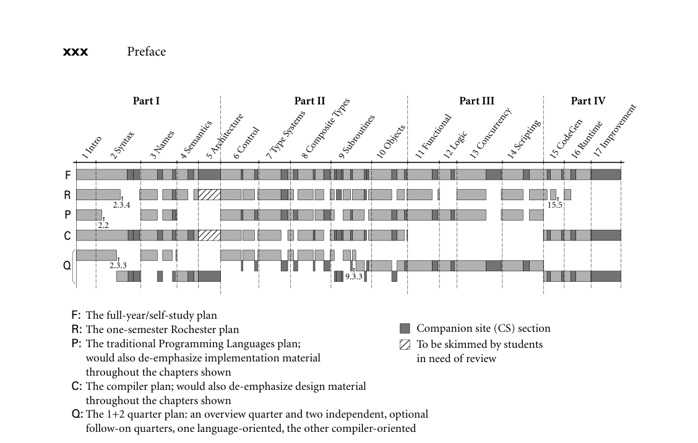

# Preface

## **Preface**

**A course in computer programming** provides the typical student’s first ex-
posure to the field of computer science. Most students in such a course will have
used computers all their lives, for social networking, email, games, web brows-
ing, word processing, and a host of other tasks, but it is not until they write their
first programs that they begin to appreciate how applications* work*. After gaining
a certain level of facility as programmers (presumably with the help of a good
course in data structures and algorithms), the natural next step is to wonder how
*programming languages* work. This book provides an explanation. It aims, quite
simply, to be the most comprehensive and accurate languages text available, in a
style that is engaging and accessible to the typical undergraduate. This aim re-
flects my conviction that students will understand more, and enjoy the material
more, if we explain what is really going on.
In the conventional “systems” curriculum, the material beyond data struc-
tures (and possibly computer organization) tends to be compartmentalized into a
host of separate subjects, including programming languages, compiler construc-
tion, computer architecture, operating systems, networks, parallel and distributed
computing, database management systems, and possibly software engineering,
object-oriented design, graphics, or user interface systems. One problem with
this compartmentalization is that the list of subjects keeps growing, but the num-
ber of semesters in a Bachelor’s program does not. More important, perhaps,
many of the most interesting discoveries in computer science occur at the bound-
aries* between* subjects. Computer architecture and compiler construction, for
example, have inspired each other for over 50 years, through generations of su-
percomputers, pipelined microprocessors, multicore chips, and modern GPUs.
Over the past decade, advances in virtualization have blurred boundaries among
the hardware, operating system, compiler, and language run-time system, and
have spurred the explosion in cloud computing. Programming language tech-
nology is now routinely embedded in everything from dynamic web content, to
gaming and entertainment, to security and finance.
Increasingly, both educators and practitioners have come to emphasize these
sorts of interactions. Within higher education in particular, there is a growing
trend toward integration in the core curriculum. Rather than give the typical stu-
dent an in-depth look at two or three narrow subjects, leaving holes in all the
others, many schools have revised the programming languages and computer or-
ganization courses to cover a wider range of topics, with follow-on electives in

**xxv**

On the specific subject of this text, they write

Programminglanguages are the medium through which programmers precisely describe
concepts, formulate algorithms, and reason about solutions. In the course of a career,
a computer scientist will work with many different languages, separately or together.
Software developers must understand the programming models underlying different
languages and make informed design choices in languages supporting multiple com-
plementary approaches. Computer scientists will often need to learn new languages
and programming constructs, and must understand the principles underlying how pro-
gramming language features are defined, composed, and implemented. The effective
use of programming languages, and appreciation of their limitations, also requires a ba-
sic knowledge of programming language translation and static program analysis, as well
as run-time components such as memory management [p. 155].

The first three editions of* Programming Language Pragmatics* (PLP) had the
good fortune of riding the trend toward integrated understanding. This fourth
edition continues and strengthens the “systems perspective” while preserving the
central focus on programming language design.
At its core, PLP is a book about* how programming languages work*. Rather
than enumerate the details of many different languages, it focuses on concepts
that underlie all the languages the student is likely to encounter, illustrating those
concepts with a variety of concrete examples, and exploring the tradeoffs that ex-
plain* why* different languages were designed in different ways. Similarly, rather
than explain how to build a compiler or interpreter (a task few programmers will
undertake in its entirety), PLP focuses on what a compiler does to an input pro-
gram, and why. Language design and implementation are thus explored together,
with an emphasis on the ways in which they interact.

**Changes in the Fourth Edition**

In comparison to the third edition, PLP-4e includes

**1.** New chapters devoted to type systems and composite types, in place of the
older single chapter on types

9 Subroutines

15 CodeGen

10 Objects

12 Logic

11 Functional

13 Concurrency

14 Scripting

17 Improvement

16 Runtime

F

R

P

Q

C

2.3.4

2.3.3
9.3.3

2.2

**Part I**
**Part II**
**Part III**
**Part IV**

15.5

The full-year/self-study plan
The one-semester Rochester plan
The traditional Programming Languages plan;
would also de-emphasize implementation material
throughout the chapters shown
The compiler plan; would also de-emphasize design material
throughout the chapters shown
The 1+2 quarter plan: an overview quarter and two independent, optional
follow-on quarters, one language-oriented, the other compiler-oriented

Companion site (CS) section
To be skimmed by students
in need of review

F:
R:
P:

C:

Q:

*Figure 1 Paths through the text. Darker shaded regions indicate supplemental “In More Depth” sections on the companion site. Section numbers are shown for breaks that do not correspond to supplemental material.*

sections, as well as bottom-up parsing (2.3.4), logic languages (Chapter 12), and
the second halves of Chapters 15 (Building a Runnable Program) and 16 (Run-
time Program Management). Note that the material on functional programming
(Chapter 11 in particular) can be taught in either OCaml or Scheme.
Some chapters (2, 4, 5, 15, 16, 17) have a heavier emphasis than others on im-
plementation issues. These can be reordered to a certain extent with respect to the
more design-oriented chapters. Many students will already be familiar with much
of the material in Chapter 5, most likely from a course on computer organization;
hence the placement of the chapter on the companion site. Some students may
also be familiar with some of the material in Chapter 2, perhaps from a course on
automata theory. Much of this chapter can then be read quickly as well, pausing
perhaps to dwell on such practical issues as recovery from syntax errors, or the
ways in which a scanner differs from a classical finite automaton.
A traditional programming languages course (track P in Figure 1) might leave
out all of scanning and parsing, plus all of Chapter 4. It would also de-emphasize
the more implementation-oriented material throughout. In place of these, it
could add such design-oriented CS sections as multiple inheritance (10.6), Small-
talk (10.7.1), lambda calculus (11.7), and predicate calculus (12.3).

