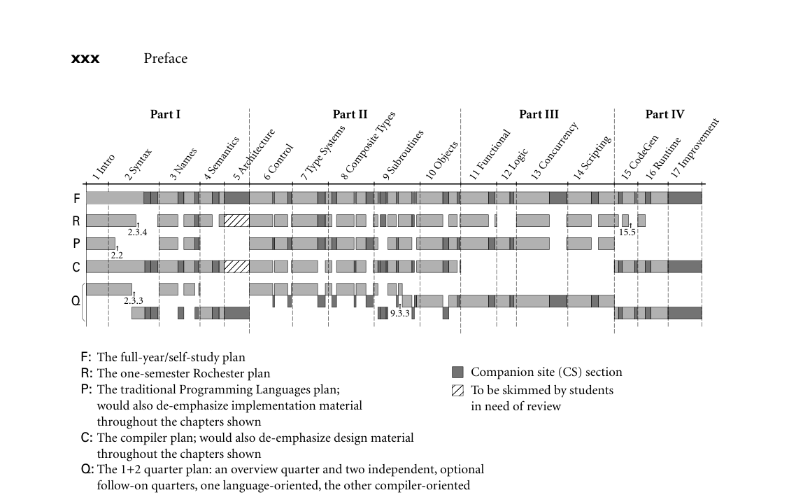

# Preface

## Preface

A course in computer programming provides the typical student’s frst exposure to the feld of computer science. Most students in such a course will have  used computers all their lives, for social networking, email, games, web browsing, word processing, and a host of other tasks, but it is not until they write their  frst programs that they begin to appreciate how applications work. After gaining  a certain level of facility as programmers (presumably with the help of a good  course in data structures and algorithms), the natural next step is to wonder how  programming languages work. This book provides an explanation. It aims, quite  simply, to be the most comprehensive and accurate languages text available, in a  style that is engaging and accessible to the typical undergraduate. This aim refects my conviction that students will understand more, and enjoy the material  more, if we explain what is really going on.

In the conventional “systems” curriculum, the material beyond data structures (and possibly computer organization) tends to be compartmentalized into a  host of separate subjects, including programming languages, compiler construction, computer architecture, operating systems, networks, parallel and distributed  computing, database management systems, and possibly software engineering,  object-oriented design, graphics, or user interface systems. One problem with  this compartmentalization is that the list of subjects keeps growing, but the number of semesters in a Bachelor’s program does not. More important, perhaps,  many of the most interesting discoveries in computer science occur at the boundaries between subjects. Computer architecture and compiler construction, for  example, have inspired each other for over 50 years, through generations of supercomputers, pipelined microprocessors, multicore chips, and modern GPUs.  Over the past decade, advances in virtualization have blurred boundaries among  the hardware, operating system, compiler, and language run-time system, and  have spurred the explosion in cloud computing. Programming language technology is now routinely embedded in everything from dynamic web content, to  gaming and entertainment, to security and fnance.

Increasingly, both educators and practitioners have come to emphasize these  sorts of interactions. Within higher education in particular, there is a growing  trend toward integration in the core curriculum. Rather than give the typical student an in-depth look at two or three narrow subjects, leaving holes in all the  others, many schools have revised the programming languages and computer organization courses to cover a wider range of topics, with follow-on electives in

various specializations. This trend is very much in keeping with the ACM/IEEECS Computer Science Curricula 2013 guidelines [SR13], which emphasize the need  to manage the size of the curriculum and to cultivate both a “system-level perspective” and an appreciation of the interplay between theory and practice. In  particular, the authors write,

Graduates of a computer science program need to think at multiple levels of detail and  abstraction. This understanding should transcend the implementation details of the  various components to encompass an appreciation for the structure of computer systems  and the processes involved in their construction and analysis [p. 24].

On the specifc subject of this text, they write

Programming languages are the medium through which programmers precisely describe  concepts, formulate algorithms, and reason about solutions. In the course of a career,  a computer scientist will work with many different languages, separately or together.  Software developers must understand the programming models underlying different  languages and make informed design choices in languages supporting multiple complementary approaches. Computer scientists will often need to learn new languages  and programming constructs, and must understand the principles underlying how programming language features are defned, composed, and implemented. The effective  use of programming languages, and appreciation of their limitations, also requires a basic knowledge of programming language translation and static program analysis, as well  as run-time components such as memory management [p. 155].

The frst three editions of Programming Language Pragmatics (PLP) had the  good fortune of riding the trend toward integrated understanding. This fourth  edition continues and strengthens the “systems perspective” while preserving the  central focus on programming language design.

```
At its core, PLP is a book about how programming languages work. Rather  
than enumerate the details of many different languages, it focuses on concepts 
that underlie all the languages the student is likely to encounter, illustrating those 
concepts with a variety of concrete examples, and exploring the tradeoffs that explain why different languages were designed in different ways. Similarly, rather 
than explain how to build a compiler or interpreter (a task few programmers will 
undertake in its entirety), PLP focuses on what a compiler does to an input program, and why. Language design and implementation are thus explored together, 
with an emphasis on the ways in which they interact.
```

Changes in the Fourth Edition

In comparison to the third edition, PLP-4e includes

* New chapters devoted to type systems and composite types, in place of the
  older single chapter on types

* Updated treatment of functional programming, with extensive coverage of
  OCaml
* Numerous other refections of changes in the feld
* Improvements inspired by instructor feedback or a fresh consideration of fa­

miliar topics

Item 1 in this list is perhaps the most visible change. Chapter 7 was the longest  in previous editions, and there is a natural split in the subject material. Reorganization of this material for PLP-4e afforded an opportunity to devote more explicit  attention to the subject of type inference, and of its role in ML-family languages  in particular. It also facilitated an update and reorganization of the material on  parametric polymorphism, which was previously scattered across several different chapters and sections.

Item 2 refects the increasing adoption of functional techniques into mainstream imperative languages, as well as the increasing prominence of SML,  OCaml, and Haskell in both education and industry.  Throughout the text,  OCaml is now co-equal with Scheme as a source of functional programming  examples. As noted in the previous paragraph, there is an expanded section  (7.2.4) on the ML type system, and Section 11.4 includes an OCaml overview,  with coverage of equality and ordering, bindings and lambda expressions, type  constructors, pattern matching, and control fow and side effects. The choice of  OCaml, rather than Haskell, as the ML-family exemplar refects its prominence in  industry, together with classroom experience suggesting that—at least for many  students—the initial exposure to functional thinking is easier in the context of  eager evaluation. To colleagues who wish I’d chosen Haskell, my apologies!

Other new material (Item 3) appears throughout the text. Wherever appropriate, reference has been made to features of the latest languages and standards,  including C & C++11, Java 8, C# 5, Scala, Go, Swift, Python 3, and HTML 5.  Section 3.6.4 pulls together previously scattered coverage of lambda expressions,  and shows how these have been added to various imperative languages. Complementary coverage of object closures, including C++11’s std::function and  std::bind, appears in Section 10.4.4. Section c-5.4.5 introduces the x86-64 and  ARM architectures in place of the x86-32 and MIPS used in previous editions. Examples using these same two architectures subsequently appear in the sections on  calling sequences (9.2) and linking (15.6). Coverage of the x86 calling sequence  continues to rely on gcc; the ARM case study uses LLVM. Section 8.5.3 introduces smart pointers. R-value references appear in Section 9.3.1. JavaFX replaces  Swing in the graphics examples of Section 9.6.2. Appendix A has new entries for  Go, Lua, Rust, Scala, and Swift.

Finally, Item 4 encompasses improvements to almost every section of the  text. Among the more heavily updated topics are FOLLOW and PREDICT sets  (Section 2.3.3); Wirth’s error recovery algorithm for recursive descent (Section c-2.3.5); overloading (Section 3.5.2); modules (Section 3.3.4); duck typing  (Section 7.3); records and variants (Section 8.1); intrusive lists (removed from  the running example of Chapter 10); static felds and methods (Section 10.2.2);

mix-in inheritance (moved from the companion site back into the main text,  and updated to cover Scala traits and Java 8 default methods); multicore processors (pervasive changes to Chapter 13); phasers (Section 13.3.1); memory models  (Section 13.3.3); semaphores (Section 13.3.5); futures (Section 13.4.5); GIMPLE  and RTL (Section c-15.2.1); QEMU (Section 16.2.2); DWARF (Section 16.3.2);  and language genealogy (Figure A.1).

To accommodate new material, coverage of some topics has been condensed  or even removed.  Examples include modules (Chapters 3 and 10), variant  records and with statements (Chapter 8), and metacircular interpretation (Chapter 11). Additional material—the Common Language Infrastructure (CLI) in  particular—has moved to the companion site. Throughout the text, examples  drawn from languages no longer in widespread use have been replaced with more  recent equivalents wherever appropriate. Almost all remaining references to Pascal and Modula are merely historical. Most coverage of Occam and Tcl has also  been dropped.

Overall, the printed text has grown by roughly 40 pages. There are 5 more  “Design & Implementation” sidebars, 35 more numbered examples, and about  25 new end-of-chapter exercises and explorations. Considerable effort has been  invested in creating a consistent and comprehensive index. As in earlier editions,  Morgan Kaufmann has maintained its commitment to providing defnitive texts  at reasonable cost: PLP-4e is far less expensive than competing alternatives, but  larger and more comprehensive.

The Companion Site

To minimize the physical size of the text, make way for new material, and allow students to focus on the fundamentals when browsing, over 350 pages of  more advanced or peripheral material can be found on a companion web site:  booksite.elsevier.com/web/9780124104099. Each companion-site (CS) section is  represented in the main text by a brief introduction to the subject and an “In  More Depth” paragraph that summarizes the elided material.

Note that placement of material on the companion site does not constitute a  judgment about its technical importance. It simply refects the fact that there is  more material worth covering than will ft in a single volume or a single-semester  course. Since preferences and syllabi vary, most instructors will probably want to  assign reading from the CS, and most will refrain from assigning certain sections  of the printed text. My intent has been to retain in print the material that is likely  to be covered in the largest number of courses.

Also included on the CS are pointers to on-line resources and compilable  copies of all signifcant code fragments found in the text (in more than two dozen  languages).

Design & Implementation Sidebars

Like its predecessors, PLP-4e places heavy emphasis on the ways in which  language design constrains implementation options, and the ways in which anticipated implementations have infuenced language design. Many of these connections and interactions are highlighted in some 140 “Design & Implementation”  sidebars. A more detailed introduction appears in Sidebar 1.1. A numbered list  appears in Appendix B.

Numbered and Titled Examples

Examples in PLP-4e are intimately woven into the fow of the presentation. To  make it easier to fnd specifc examples, to remember their content, and to refer  to them in other contexts, a number and a title for each is displayed in a marginal  note. There are over 1000 such examples across the main text and the CS. A  detailed list appears in Appendix C.

Exercise Plan

```
Review questions appear throughout the text at roughly  10-page  intervals,  at  the  
ends of major sections. These are based directly on the preceding material, and 
have short, straightforward answers.
```

More detailed questions appear at the end of each chapter. These are divided  into Exercises and Explorations. The former are generally more challenging than  the per-section review questions, and should be suitable for homework or brief  projects. The latter are more open-ended, requiring web or library research, substantial time commitment, or the development of subjective opinion. Solutions  to many of the exercises (but not the explorations) are available to registered instructors from a password-protected web site: visit textbooks.elsevier.com/web/  9780124104099.

How to Use the Book

Programming Language Pragmatics covers almost all of the material in the PL  “knowledge units” of the Computing Curricula 2013 report [SR13]. The languages  course at the University of Rochester, for which this book was designed, is in fact  one of the featured “course exemplars” in the report (pp. 369–371). Figure 1 illustrates several possible paths through the text.

For self-study, or for a full-year course (track F in Figure 1), I recommend  working through the book from start to fnish, turning to the companion site  as each “In More Depth” section is encountered. The one-semester course at  Rochester (track R) also covers most of the book, but leaves out most of the CS

Part I  Part II  Part III  Part IV

8 Composite Types

17 Improvement

13 Concurrency

7 Type Systems

5 Architecture

9 Subroutines

11 Functional

15 CodeGen

16 Runtime

14 Scripting

4 Semantics

10 Objects

6 Control

12 Logic

3 Names

2 Syntax

1 Intro

F

R

2.3.4

15.5

P

2.2

C

Q

2.3.3  9.3.3

F: The full-year/self-study plan  R: The one-semester Rochester plan  Companion site (CS) section  P: The traditional Programming Languages plan;  To be skimmed by students  would also de-emphasize implementation material  in need of review  throughout the chapters shown  C: The compiler plan; would also de-emphasize design material

throughout the chapters shown  Q: The 1+2 quarter plan: an overview quarter and two independent, optional  follow-on quarters, one language-oriented, the other compiler-oriented


*Figure 1  Paths through the text. Darker shaded regions indicate supplemental “In More Depth” sections on the companion  site. Section numbers are shown for breaks that do not correspond to supplemental material.*

sections, as well as bottom-up parsing (2.3.4), logic languages (Chapter 12), and  the second halves of Chapters 15 (Building a Runnable Program) and 16 (Runtime Program Management). Note that the material on functional programming  (Chapter 11 in particular) can be taught in either OCaml or Scheme.

Some chapters (2, 4, 5, 15, 16, 17) have a heavier emphasis than others on implementation issues. These can be reordered to a certain extent with respect to the  more design-oriented chapters. Many students will already be familiar with much  of the material in Chapter 5, most likely from a course on computer organization;  hence the placement of the chapter on the companion site. Some students may  also be familiar with some of the material in Chapter 2, perhaps from a course on  automata theory. Much of this chapter can then be read quickly as well, pausing  perhaps to dwell on such practical issues as recovery from syntax errors, or the  ways in which a scanner differs from a classical fnite automaton.

A traditional programming languages course (track P in Figure 1) might leave  out all of scanning and parsing, plus all of Chapter 4. It would also de-emphasize  the more implementation-oriented material throughout. In place of these, it  could add such design-oriented CS sections as multiple inheritance (10.6), Smalltalk (10.7.1), lambda calculus (11.7), and predicate calculus (12.3).

PLP has also been used at some schools for an introductory compiler course  (track C in Figure 1). The typical syllabus leaves out most of Part III (Chapters 11  through 14), and de-emphasizes the more design-oriented material throughout.  In place of these, it includes all of scanning and parsing, Chapters 15 through 17,  and a slightly different mix of other CS sections.

For a school on the quarter system, an appealing option is to offer an introductory one-quarter course and two optional follow-on courses (track Q in Figure 1).  The introductory quarter might cover the main (non-CS) sections of Chapters 1,  3, 6, 7, and 8, plus the frst halves of Chapters 2 and 9. A language-oriented followon quarter might cover the rest of Chapter 9, all of Part III, CS sections from  Chapters 6 through 9, and possibly supplemental material on formal semantics,  type theory, or other related topics. A compiler-oriented follow-on quarter might  cover the rest of Chapter 2; Chapters 4–5 and 15–17, CS sections from Chapters 3  and 9–10, and possibly supplemental material on automatic code generation, aggressive code improvement, programming tools, and so on.

Whatever the path through the text, I assume that the typical reader has already  acquired signifcant experience with at least one imperative language. Exactly  which language it is shouldn’t matter. Examples are drawn from a wide variety of  languages, but always with enough comments and other discussion that readers  without prior experience should be able to understand easily. Single-paragraph  introductions to more than 60 different languages appear in Appendix A. Algorithms, when needed, are presented in an informal pseudocode that should be  self-explanatory. Real programming language code is set in "typewriter" font.  Pseudocode is set in a sans-serif font.

Supplemental Materials

In addition to supplemental sections, the companion site contains complete  source code for all nontrivial examples, and a list of all known errors in the  book. Additional resources are available on-line at textbooks.elsevier.com/web/  9780124104099. For instructors who have adopted the text, a password-protected  page provides access to

Editable PDF source for all the fgures in the book  Editable PowerPoint slides  Solutions to most of the exercises  Suggestions for larger projects

Acknowledgments for the Fourth Edition

In preparing the fourth edition, I have been blessed with the generous assistance of a very large number of people. Many provided errata or other feedback on the third edition, among them Yacine Belkadi, Björn Brandenburg,

Bob Cochran, Daniel Crisman, Marcelino Debajo, Chen Ding, Peter Drake,  Michael Edgar, Michael Glass, Sérgio Gomes, Allan Gottlieb, Hossein Hadavi,  Chris Hart, Thomas Helmuth, Wayne Heym, Scott Hoge, Kelly Jones, Ahmed  Khademzadeh, Eleazar Enrique Leal, Kyle Liddell, Annie Liu, Hao Luo, Dirk  Müller, Holger Peine, Andreas Priesnitz, Mikhail Prokharau, Harsh Raju, and  Jingguo Yao. I also remain indebted to the many individuals acknowledged in  previous editions, and to the reviewers, adopters, and readers who made those  editions a success.

Anonymous reviewers for the fourth edition provided a wealth of useful suggestions; my thanks to all of you! Special thanks to Adam Chlipala of MIT for his  detailed and insightful suggestions on the coverage of functional programming.  My thanks as well to Nelson Beebe (University of Utah) for pointing out that compilers cannot safely use integer comparisons for foating-point numbers that may  be NaNs; to Dan Scarafoni for prompting me to distinguish between FIRST/EPS  of symbols and FIRST/EPS of strings in the algorithm to generate PREDICT sets; to  Dave Musicant for suggested improvements to the description of deep binding; to  Allan Gottlieb (NYU) for several key clarifcations regarding Ada semantics; and  to Benjamin Kowarsch for similar clarifcations regarding Objective-C. Problems  that remain in all these areas are entirely my own.

In preparing the fourth edition, I have drawn on 25 years of experience teaching this material to upper-level undergraduates at the University of Rochester. I  am grateful to all my students for their enthusiasm and feedback. My thanks as  well to my colleagues and graduate students, and to the department’s administrative, secretarial, and technical staff for providing such a supportive and productive work environment. Finally, my thanks to David Padua, whose work I have  admired since I was in graduate school; I am deeply honored to have him as the  author of the Foreword.

As they were on previous editions, the staff at Morgan Kaufmann has been a  genuine pleasure to work with, on both a professional and a personal level. My  thanks in particular to Nate McFadden, Senior Development Editor, who shepherded both this and the previous two editions with unfailing patience, good humor, and a fne eye for detail; to Mohana Natarajan, who managed the book’s  production; and to Todd Green, Publisher, who upholds the personal touch of  the Morgan Kauffman imprint within the larger Elsevier universe.

Most important, I am indebted to my wife, Kelly, for her patience and support  through endless months of writing and revising. Computing is a fne profession,  but family is what really matters.

Michael L. Scott  Rochester, NY  August 2015

