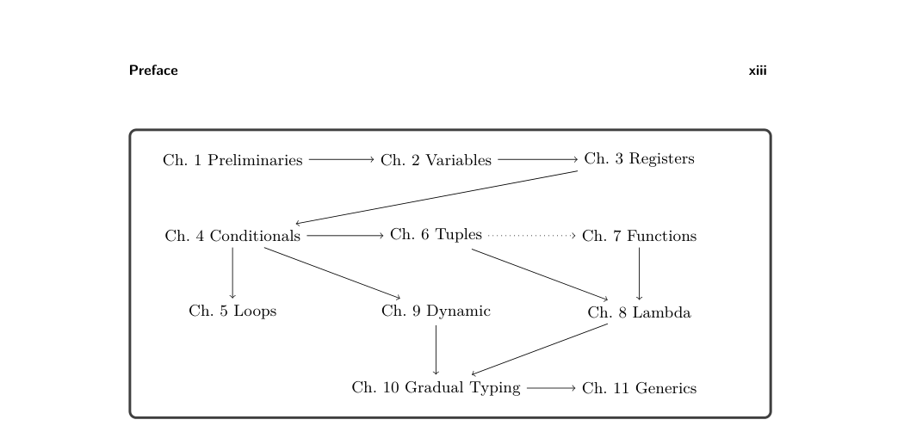

# Preface

Preface

There is a magical moment when a programmer presses the run button and the software begins to execute. Somehow a program written in a high-level language is running on a computer that is capable only of shuffling bits. Here we reveal the wiz- ardry that makes that moment possible. Beginning with the groundbreaking work of Backus and colleagues in the 1950s, computer scientists developed techniques for constructing programs called compilers that automatically translate high-level programs into machine code. We take you on a journey through constructing your own compiler for a small but powerful language. Along the way we explain the essential concepts, algorithms, and data structures that underlie compilers. We develop your understanding of how programs are mapped onto computer hardware, which is helpful in reasoning about properties at the junction of hardware and software, such as execution time, soft- ware errors, and security vulnerabilities. For those interested in pursuing compiler construction as a career, our goal is to provide a stepping-stone to advanced topics such as just-in-time compilation, program analysis, and program optimization. For those interested in designing and implementing programming languages, we connect language design choices to their impact on the compiler and the generated code. A compiler is typically organized as a sequence of stages that progressively trans- late a program to the code that runs on hardware. We take this approach to the extreme by partitioning our compiler into a large number of nanopasses, each of which performs a single task. This enables the testing of each pass in isolation and focuses our attention, making the compiler far easier to understand. The most familiar approach to describing compilers is to dedicate each chapter to one pass. The problem with that approach is that it obfuscates how language features motivate design choices in a compiler. We instead take an incremental approach in which we build a complete compiler in each chapter, starting with a small input language that includes only arithmetic and variables. We add new language features in subsequent chapters, extending the compiler as necessary. Our choice of language features is designed to elicit fundamental concepts and algorithms used in compilers.

* We begin with integer arithmetic and local variables in chapters 1 and 2, where
  we introduce the fundamental tools of compiler construction: abstract syntax trees
  and recursive functions.

* In chapter 3 we apply graph coloring to assign variables to machine registers.

* Chapter 4 adds conditional expressions, which motivates an elegant recursive
  algorithm for translating them into conditional goto statements.

* Chapter 5 adds loops and mutable variables. This elicits the need for dataflow
  analysis in the register allocator.

* Chapter 6 adds heap-allocated tuples, motivating garbage collection.

* Chapter 7 adds functions as first-class values without lexical scoping, similar to
  functions in the C programming language (Kernighan and Ritchie 1988). The
  reader learns about the procedure call stack and calling conventions and how
  they interact with register allocation and garbage collection. The chapter also
  describes how to generate efficient tail calls.

* Chapter 8 adds anonymous functions with lexical scoping, that is, lambda
  expressions. The reader learns about closure conversion, in which lambdas are
  translated into a combination of functions and tuples.

* Chapter 9 adds dynamic typing. Prior to this point the input languages are stat-
  ically typed. The reader extends the statically typed language with an Any type
  that serves as a target for compiling the dynamically typed language.

* Chapter 10 uses the Any type introduced in chapter 9 to implement a gradually
  typed language in which different regions of a program may be static or dynami-
  cally typed. The reader implements runtime support for proxies that allow values
  to safely move between regions.

* Chapter 11 adds generics with autoboxing, leveraging the Any type and type
  casts developed in chapters 9 and 10.

There are many language features that we do not include. Our choices balance the incidental complexity of a feature versus the fundamental concepts that it exposes. For example, we include tuples and not records because although they both elicit the study of heap allocation and garbage collection, records come with more incidental complexity. Since 2009, drafts of this book have served as the textbook for sixteen-week compiler courses for upper-level undergraduates and first-year graduate students at the University of Colorado and Indiana University. Students come into the course having learned the basics of programming, data structures and algorithms, and discrete mathematics. At the beginning of the course, students form groups of two to four people. The groups complete approximately one chapter every two weeks, starting with chapter 2 and including chapters according to the students interests while respecting the dependencies between chapters shown in figure 0.1. Chapter 7 (functions) depends on chapter 6 (tuples) only in the implementation of efficient tail calls. The last two weeks of the course involve a final project in which students design and implement a compiler extension of their choosing. The last few chapters can be used in support of these projects. Many chapters include a challenge problem that we assign to the graduate students. For compiler courses at universities on the quarter system (about ten weeks in length), we recommend completing the course through chapter 6 or chapter 7 and providing some scaffolding code to the students for each compiler pass. The course

*Figure 0.1*

can be adapted to emphasize functional languages by skipping chapter 5 (loops) and including chapter 8 (lambda). The course can be adapted to dynamically typed languages by including chapter 9. This book has been used in compiler courses at California Polytechnic State Uni- versity, Portland State University, Rose–Hulman Institute of Technology, University of Freiburg, University of Massachusetts Lowell, and the University of Vermont. We use the Racket language both for the implementation of the compiler and for the input language, so the reader should be proficient with Racket or Scheme. There are many excellent resources for learning Scheme and Racket (Dybvig 1987a; Abelson and Sussman 1996; Friedman and Felleisen 1996; Felleisen et al. 2001; Felleisen et al. 2013; Flatt, Findler, and PLT 2014). The support code for this book is in the GitHub repository at the following location:

https://github.com/IUCompilerCourse/

The compiler targets x86 assembly language (Intel 2015), so it is helpful but not necessary for the reader to have taken a computer systems course (Bryant and O’Hallaron 2010). We introduce the parts of x86-64 assembly language that are needed in the compiler. We follow the System V calling conventions (Bryant and O’Hallaron 2005; Matz et al. 2013), so the assembly code that we gener- ate works with the runtime system (written in C) when it is compiled using the GNU C compiler (gcc) on Linux and MacOS operating systems on Intel hardware. On the Windows operating system, gcc uses the Microsoft x64 calling conven- tion (Microsoft 2018, 2020). So the assembly code that we generate does not work with the runtime system on Windows. One workaround is to use a virtual machine with Linux as the guest operating system.

Acknowledgments

The tradition of compiler construction at Indiana University goes back to research and courses on programming languages by Daniel Friedman in the 1970s and 1980s. One of his students, Kent Dybvig, implemented Chez Scheme (Dybvig 2006), an efficient, production-quality compiler for Scheme. Throughout the 1990s and 2000s, Dybvig taught the compiler course and continued the development of Chez Scheme. The compiler course evolved to incorporate novel pedagogical ideas while also including elements of real-world compilers. One of Friedman’s ideas was to split the compiler into many small passes. Another idea, called “the game,” was to test the code generated by each pass using interpreters. Dybvig, with help from his students Dipanwita Sarkar and Andrew Keep, devel- oped infrastructure to support this approach and evolved the course to use even smaller nanopasses (Sarkar, Waddell, and Dybvig 2004; Keep 2012). Many of the compiler design decisions in this book are inspired by the assignment descriptions of Dybvig and Keep (2010). In the mid 2000s, a student of Dybvig named Abdu- laziz Ghuloum observed that the front-to-back organization of the course made it difficult for students to understand the rationale for the compiler design. Ghuloum proposed the incremental approach (Ghuloum 2006) on which this book is based. I thank the many students who served as teaching assistants for the compiler course at IU including Carl Factora, Ryan Scott, Cameron Swords, and Chris Wailes. I thank Andre Kuhlenschmidt for work on the garbage collector and x86 interpreter, Michael Vollmer for work on efficient tail calls, and Michael Vitousek for help with the first offering of the incremental compiler course at IU. I thank professors Bor-Yuh Chang, John Clements, Jay McCarthy, Joseph Near, Ryan Newton, Nate Nystrom, Peter Thiemann, Andrew Tolmach, and Michael Wollowski for teaching courses based on drafts of this book and for their feedback. I thank the National Science Foundation for the grants that helped to support this work: Grant Numbers 1518844, 1763922, and 1814460. I thank Ronald Garcia for helping me survive Dybvig’s compiler course in the early 2000s and especially for finding the bug that sent our garbage collector on a wild goose chase!

Jeremy G. Siek Bloomington, Indiana

