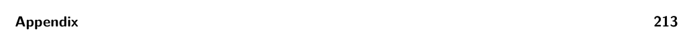

# References

*Table A.1*

Instruction Operation addq A, B A + B →B negq A −A →A subq A, B B −A →B imulq A, B A × B →B (B must be a register). callq L Pushes the return address and jumps to label L. callq *A Pushes the return address and jumps to the address in A. retq Pops the return address and jumps to it. popq A ∗rsp →A; rsp + 8 →rsp pushq A rsp −8 →rsp; A →∗rsp leaq A, B A →B (B must be a register.) cmpq A, B Compare A and B and set the flag register (B must not be an immediate). je L Jump to label L if the flag register matches the condition code of the instruction; otherwise go to the next instructions. The condition codes are e for equal, l for less, le for less or equal, g for greater, and ge for greater or equal.

jl L jle L jg L jge L jmp L Jump to label L. movq A, B A →B movzbq A, B A →B, where A is a single-byte register (e.g., al or cl), B is an 8-byte register, and the extra bytes of B are set to zero.

notq A ∼A →A (bitwise complement) orq A, B A | B →B (bitwise-or) andq A, B A&B →B (bitwise-and) salq A, B B « A →B (arithmetic shift left, where A is a constant) sarq A, B B » A →B (arithmetic shift right, where A is a constant) sete A

setl A setle A setg A setge A

If the flag matches the condition code, then 1 →A; else 0 →A. Refer to je for the description of the condition codes. A must be a single byte register (e.g., al or cl).

(such as %rax), or memory references (such as -4(%ebp)). Most x86 instructions allow at most one memory reference per instruction. Other operands must be immediates or registers.

## References

Abelson, Harold, and Gerald J. Sussman. 1996. Structure and Interpretation of Computer Programs. 2nd edition. MIT Press.

Aho, Alfred V., Monica S. Lam, Ravi Sethi, and Jeffrey D. Ullman. 2006. Compilers: Principles, Techniques, and Tools. 2nd edition. Addison-Wesley Longman.

Allen, Frances E. 1970. “Control Flow Analysis.” In Proceedings of a Symposium on Compiler Optimization, 1–19. Association for Computing Machinery.

Anderson, Christopher, and Sophia Drossopoulou. 2003. “BabyJ: From Object Based to Class Based Programming via Types.” Electron. Notes Theor. Comput. Sci. 82 (8): 53–81.

Appel, Andrew W. 1989. “Runtime Tags Aren’t Necessary.” LISP and Symbolic Computation 2 (2): 153–162.

Appel, Andrew W. 1990. “A Runtime System.” LISP and Symbolic Computation 3 (4): 343–380.

Appel, Andrew W. 1991. Compiling with Continuations. Cambridge University Press.

Appel, Andrew W., and David B. MacQueen. 1987. “A Standard ML Compiler.” In Functional Programming Languages and Computer Architecture, 301–324. Springer.

Appel, Andrew W., and Jens Palsberg. 2003. Modern Compiler Implementation in Java. Cambridge University Press.

Backus, J. W., F. L. Bauer, J. Green, C. Katz, J. McCarthy, A. J. Perlis, H. Rutishauser, et al. 1960. “Report on the Algorithmic Language ALGOL 60.” Edited by Peter Naur. Commun. ACM 3 (5): 299–314.

Backus, John. 1978. “The History of Fortran I, II, and III.” In History of Programming Languages, 25–74. Association for Computing Machinery.

Baker, J., A. Cunei, T. Kalibera, F. Pizlo, and J. Vitek. 2009. “Accurate Garbage Collection in Uncooperative Environments Revisited.” Concurr. Comput.: Pract. Exper. 21 (12): 1572–1606.

Balakrishnan, V. K. 1996. Introductory Discrete Mathematics. Dover.

Blackburn, Stephen M., Perry Cheng, and Kathryn S. McKinley. 2004. “Myths and Realities: The Performance Impact of Garbage Collection.” In Proceedings of the Joint International Conference on Measurement and Modeling of Computer Systems, SIGMETRICS ’04/Performance ’04, 25– 36. Association for Computing Machinery.

Blelloch, Guy E., Jonathan C. Hardwick, Siddhartha Chatterjee, Jay Sipelstein, and Marco Zagha. 1993. “Implementation of a Portable Nested Data-Parallel Language.” In Proceedings of the Fourth ACM SIGPLAN Symposium on Principles and Practice of Parallel Programming, PPOPP ’93, 102–111. Association for Computing Machinery.

Bracha, Gilad, Martin Odersky, David Stoutamire, and Philip Wadler. 1998. “Making the Future Safe for the Past: Adding Genericity to the Java Programming Language.” In Proceedings of the 13th ACM SIGPLAN Conference on Object-Oriented Programming, Systems, Languages, and Applications, OOPSLA ’98, 183–200. Association for Computing Machinery.

Brélaz, Daniel. 1979. “New Methods to Color the Vertices of a Graph.” Commun. ACM 22 (4): 251–256.

Briggs, Preston, Keith D. Cooper, and Linda Torczon. 1994. “Improvements to Graph Coloring Register Allocation.” ACM Trans. Program. Lang. Syst. 16 (3): 428–455.

Bryant, Randal, and David O’Hallaron. 2005. x86-64 Machine-Level Programming. Carnegie Mellon University.

Bryant, Randal, and David O’Hallaron. 2010. Computer Systems: A Programmer’s Perspective. 2nd edition. Addison-Wesley.

Cardelli, Luca. 1983. The Functional Abstract Machine. Technical report TR-107. AT&T Bell Laboratories.

Cardelli, Luca. 1984. “Compiling a Functional Language.” In ACM Symposium on LISP and Functional Programming, LFP ’84, 208–221. Association for Computing Machinery.

Cardelli, Luca, and Peter Wegner. 1985. “On Understanding Types, Data Abstraction, and Polymorphism.” ACM Comput. Surv. 17 (4): 471–523.

Chaitin, G. J. 1982. “Register Allocation & Spilling via Graph Coloring.” In SIGPLAN ’82: Proceedings of the 1982 SIGPLAN Symposium on Compiler Construction, 98–105. Association for Computing Machinery.

Chaitin, Gregory J., Marc A. Auslander, Ashok K. Chandra, John Cocke, Martin E. Hopkins, and Peter W. Markstein. 1981. “Register Allocation via Coloring.” Computer Languages 6:47–57.

Cheney, C. J. 1970. “A Nonrecursive List Compacting Algorithm.” Commun. of the ACM 13 (11).

Chow, Frederick, and John Hennessy. 1984. “Register Allocation by Priority-Based Coloring.” In Proceedings of the 1984 SIGPLAN Symposium on Compiler Construction, 222–232. Association for Computing Machinery.

Church, Alonzo. 1932. “A Set of Postulates for the Foundation of Logic.” Ann. Math., Second Series, 33 (2): 346–366.

Clarke, Keith. 1989. “One-Pass Code Generation Using Continuations.” Softw. Pract. Exper. 19 (12): 1175–1192.

Collins, George E. 1960. “A Method for Overlapping and Erasure of Lists.” Commun. ACM 3 (12): 655–657.

Cooper, Keith, and Linda Torczon. 2011. Engineering a Compiler. 2nd edition. Morgan Kaufmann.

Cooper, Keith D., and L. Taylor Simpson. 1998. “Live Range Splitting in a Graph Coloring Register Allocator.” In Compiler Construction: Proceedings of the 7th International Conference, CC ’98, Held as Part of the Joint European Conferences on Theory and Practice of Software, ETAPS ’98. Lecture Notes in Computer Science 1383. Springer.

Cormen, Thomas H., Clifford Stein, Ronald L. Rivest, and Charles E. Leiserson. 2001. Introduction to Algorithms. McGraw-Hill Higher Education.

Cutler, Cody, and Robert Morris. 2015. “Reducing Pause Times with Clustered Collection.” In Proceedings of the 2015 International Symposium on Memory Management, ISMM ’15, 131–142. Association for Computing Machinery.

Danvy, Olivier. 1991. Three Steps for the CPS Transformation. Technical report CIS-92-02. Kansas State University.

Danvy, Olivier. 2003. “A New One-Pass Transformation into Monadic Normal Form.” In Compiler Construction: Proceedings of the 12th International Conference, CC ’03, Held as Part of the Joint European Conferences on Theory and Practice of Software, ETAPS ’03. Lecture Notes in Computer Science 2622, 77–89. Springer.

Detlefs, David, Christine Flood, Steve Heller, and Tony Printezis. 2004. “Garbage-First Garbage Collection.” In Proceedings of the 4th International Symposium on Memory Management, ISMM ’04, 37–48. Association for Computing Machinery.

Dijkstra, E. W. 1982. Why Numbering Should Start at Zero. Technical report EWD831. University of Texas at Austin.

Diwan, Amer, Eliot Moss, and Richard Hudson. 1992. “Compiler Support for Garbage Collection in a Statically Typed Language.” In Proceedings of the ACM SIGPLAN 1992 Conference on Pro- gramming Language Design and Implementation, PLDI ’92, 273–282. Association for Computing Machinery.

Dybvig, R. Kent. 1987a. The Scheme Programming Language. Prentice Hall.

Dybvig, R. Kent. 1987b. “Three Implementation Models for Scheme.” PhD diss., University of North Carolina at Chapel Hill.

Dybvig, R. Kent. 2006. “The Development of Chez Scheme.” In Proceedings of the Eleventh ACM SIGPLAN International Conference on Functional Programming, ICFP ’06, 1–12. Association for Computing Machinery.

Dybvig, R. Kent, and Andrew Keep. 2010. P523 Compiler Assignments. Technical report. Indiana University.

Felleisen, Matthias, M.D. Barski Conrad, David Van Horn, and Eight Students of Northeastern University. 2013. Realm of Racket: Learn to Program, One Game at a Time! No Starch Press.

Felleisen, Matthias, Robert Bruce Findler, Matthew Flatt, and Shriram Krishnamurthi. 2001. How to Design Programs: An Introduction to Programming and Computing. MIT Press.

Fischer, Michael J. 1972. “Lambda Calculus Schemata.” In Proceedings of ACM Conference on Proving Assertions about Programs, 104–109. Association for Computing Machinery.

Flanagan, Cormac. 2006. “Hybrid Type Checking.” In Proceedings of the 33rd ACM SIGPLAN- SIGACT Symposium on Principles of Programming Languages, POPL ’06, 245–256. Association for Computing Machinery.

Flanagan, Cormac, Amr Sabry, Bruce F. Duba, and Matthias Felleisen. 1993. “The Essence of Compiling with Continuations.” In Proceedings of the ACM SIGPLAN 1993 Conference on Pro- gramming Language Design and Implementation, PLDI ’93, 502–514. Association for Computing Machinery.

Flatt, Matthew, Caner Derici, R. Kent Dybvig, Andrew W. Keep, Gustavo E. Massaccesi, Sarah Spall, Sam Tobin-Hochstadt, and Jon Zeppieri. 2019. “Rebuilding Racket on Chez Scheme (Experience Report).” Proc. ACM Program. Lang., ICFP (August) 3:1–15.

Flatt, Matthew, Robert Bruce Findler, and PLT. 2014. The Racket Guide. Technical report 6.0. PLT.

Flatt, Matthew, and PLT. 2014. The Racket Reference 6.0. Technical report. PLT. https://docs .racket-lang.org/reference/index.html.

Friedman, Daniel P., and Matthias Felleisen. 1996. The Little Schemer. 4th edition. MIT Press.

Friedman, Daniel P., Mitchell Wand, and Christopher T. Haynes. 2001. Essentials of Programming Languages. 2nd edition. MIT Press.

Friedman, Daniel P., and David S. Wise. 1976. Cons Should Not Evaluate Its Arguments. Technical report TR44. Indiana University.

Gamari, Ben, and Laura Dietz. 2020. “Alligator Collector: A Latency-Optimized Garbage Collector for Functional Programming Languages.” In Proceedings of the 2020 ACM SIGPLAN Inter- national Symposium on Memory Management, ISMM ’20, 87–99. Association for Computing Machinery.

George, Lal, and Andrew W. Appel. 1996. “Iterated Register Coalescing.” ACM Trans. Program. Lang. Syst. 18 (3): 300–324.

Ghuloum, Abdulaziz. 2006. “An Incremental Approach to Compiler Construction.” In Scheme ’06: Proceedings of the Workshop on Scheme and Functional Programming. http://www.schemework shop.org/2006/.

Gilray, Thomas, Steven Lyde, Michael D. Adams, Matthew Might, and David Van Horn. 2016. “Pushdown Control-Flow Analysis for Free.” In Proceedings of the 43rd Annual ACM SIGPLAN- SIGACT Symposium on Principles of Programming Languages, POPL ’16, 691–704. Association for Computing Machinery.

Goldberg, Benjamin. 1991. “Tag-free Garbage Collection for Strongly Typed Programming Lan- guages.” In Proceedings of the ACM SIGPLAN 1991 Conference on Programming Language Design and Implementation, PLDI ’91, 165–176. Association for Computing Machinery.

Gordon, M., R. Milner, L. Morris, M. Newey, and C. Wadsworth. 1978. “A Metalanguage for Interactive Proof in LCF.” In Proceedings of the 5th ACM SIGACT-SIGPLAN Sympo- sium on Principles of Programming Languages, POPL ’78, 119–130. Association for Computing Machinery.

Gronski, Jessica, Kenneth Knowles, Aaron Tomb, Stephen N. Freund, and Cormac Flanagan. 2006. “Sage: Hybrid Checking for Flexible Specifications.” In Scheme ’06: Proceedings of the Workshop on Scheme and Functional Programming, 93–104. http://www.schemeworkshop.org/2006/.

Harper, Robert. 2016. Practical Foundations for Programming Languages. 2nd edition. Cambridge University Press.

Harper, Robert, and Greg Morrisett. 1995. “Compiling Polymorphism Using Intensional Type Analysis.” In Proceedings of the 22nd ACM SIGPLAN-SIGACT Symposium on Principles of Programming Languages, POPL ’95, 130–141. Association for Computing Machinery.

Hatcliff, John, and Olivier Danvy. 1994. “A Generic Account of Continuation-Passing Styles.” In Proceedings of the 21st ACM SIGPLAN-SIGACT Symposium on Principles of Programming Languages, POPL ’94, 458–471. Association for Computing Machinery.

Henderson, Fergus. 2002. “Accurate Garbage Collection in an Uncooperative Environment.” In Proceedings of the 3rd International Symposium on Memory Management, ISMM ’02, 150–156. Association for Computing Machinery.

Henglein, Fritz. 1994. “Dynamic Typing: Syntax and Proof Theory.” Science of Computer Programming 22 (3): 197–230.

Herman, David, Aaron Tomb, and Cormac Flanagan. 2007. “Space-Efficient Gradual Typing.” In Trends in Functional Programming, TFP ’07.

Herman, David, Aaron Tomb, and Cormac Flanagan. 2010. “Space-Efficient Gradual Typing.” Higher-Order and Symbolic Computation 23 (2): 167–189.

Horwitz, L. P., R. M. Karp, R. E. Miller, and S. Winograd. 1966. “Index Register Allocation.” J. ACM 13 (1): 43–61.

Intel. 2015. Intel 64 and IA-32 Architectures Software Developer’s Manual Combined Volumes: 1, 2A, 2B, 2C, 3A, 3B, 3C and 3D.

Jacek, Nicholas, and J. Eliot B. Moss. 2019. “Learning When to Garbage Collect with Ran- dom Forests.” In Proceedings of the 2019 ACM SIGPLAN International Symposium on Memory Management, ISMM ’19, 53–63. Association for Computing Machinery.

Jones, Neil D., Carsten K. Gomard, and Peter Sestoft. 1993. Partial Evaluation and Automatic Program Generation. Prentice Hall.

Jones, Richard, Antony Hosking, and Eliot Moss. 2011. The Garbage Collection Handbook: The Art of Automatic Memory Management. Chapman & Hall/CRC.

Jones, Richard, and Rafael Lins. 1996. Garbage Collection: Algorithms for Automatic Dynamic Memory Management. John Wiley & Sons.

Keep, Andrew W. 2012. “A Nanopass Framework for Commercial Compiler Development.” PhD diss., Indiana University.

Keep, Andrew W., Alex Hearn, and R. Kent Dybvig. 2012. “Optimizing Closures in O(0)-time.” In Scheme ’12: Proceedings of the Workshop on Scheme and Functional Programming. Association for Computing Machinery.

Kelsey, R., W. Clinger, and J. Rees, eds. 1998. “Revised5 Report on the Algorithmic Language Scheme.” Higher-Order and Symbolic Computation 11 (1).

Kempe, A. B. 1879. “On the Geographical Problem of the Four Colours.” American Journal of Mathematics 2 (3): 193–200.

Kernighan, Brian W., and Dennis M. Ritchie. 1988. The C Programming Language. Prentice Hall.

Kildall, Gary A. 1973. “A Unified Approach to Global Program Optimization.” In Proceedings of the 1st Annual ACM SIGACT-SIGPLAN Symposium on Principles of Programming Languages, POPL ’73, 194–206. Association for Computing Machinery.

Kleene, S. 1952. Introduction to Metamathematics. Van Nostrand.

Knuth, Donald E. 1964. “Backus Normal Form vs. Backus Naur Form.” Commun. ACM 7 (12): 735–736.

Kuhlenschmidt, Andre, Deyaaeldeen Almahallawi, and Jeremy G. Siek. 2019. “Toward Efficient Gradual Typing for Structural Types via Coercions.” In Proceedings of the ACM SIGPLAN 2019 Conference on Programming Language Design and Implementation, PLDI ’19. Association for Computing Machinery.

Lawall, Julia L., and Olivier Danvy. 1993. “Separating Stages in the Continuation-Passing Style Transformation.” In Proceedings of the 20th ACM SIGPLAN-SIGACT Symposium on Principles of Programming Languages, POPL ’93, 124–136. Association for Computing Machinery.

Leroy, Xavier. 1992. “Unboxed Objects and Polymorphic Typing.” In Proceedings of the 19th ACM SIGPLAN-SIGACT Symposium on Principles of Programming Languages, POPL ’92, 177–188. Association for Computing Machinery.

Lieberman, Henry, and Carl Hewitt. 1983. “A Real-Time Garbage Collector Based on the Lifetimes of Objects.” Commun. ACM 26 (6): 419–429.

Liskov, Barbara. 1993. “A History of CLU.” In The Second ACM SIGPLAN Conference on History of Programming Languages, HOPL-II, 133–147. Association for Computing Machinery.

Liskov, Barbara, Russ Atkinson, Toby Bloom, Eliot Moss, Craig Schaffert, Bob Scheifler, and Alan Snyder. 1979. CLU Reference Manual. Technical report LCS-TR-225. MIT.

Logothetis, George, and Prateek Mishra. 1981. “Compiling Short-Circuit Boolean Expressions in One Pass.” Software: Practice and Experience 11 (11): 1197–1214.

Matthews, Jacob, and Robert Bruce Findler. 2007. “Operational Semantics for Multi-Language Programs.” In Proceedings of the 34th ACM SIGPLAN-SIGACT Symposium on Principles of Programming Languages, POPL ’07. Association for Computing Machinery.

Matula, David W., George Marble, and Joel D. Isaacson. 1972. “Graph Coloring Algorithms.” In Graph Theory and Computing, 109–122. Academic Press.

Matz, Michael, Jan Hubicka, Andreas Jaeger, and Mark Mitchell. 2013. System V Application Binary Interface, AMD64 Architecture Processor Supplement. Linux Foundation.

McCarthy, John. 1960. “Recursive Functions of Symbolic Expressions and their Computation by Machine, Part I.” Commun. ACM 3 (4): 184–195.

Microsoft. 2018. x64 Architecture. https://docs.microsoft.com/en-us/windows-hardware/drivers /debugger/x64-architecture.

Microsoft. 2020. x64 Calling Convention. https://docs.microsoft.com/en-us/cpp/build/x64-calli ng-convention.

Milner, Robin, Mads Tofte, and Robert Harper. 1990. The Definition of Standard ML. MIT Press.

Minamide, Yasuhiko, Greg Morrisett, and Robert Harper. 1996. “Typed Closure Conversion.” In Proceedings of the 23rd ACM SIGPLAN-SIGACT Symposium on Principles of Programming Languages, POPL ’96, 271–283. Association for Computing Machinery.

Moggi, Eugenio. 1991. “Notions of Computation and Monads.” Inf. Comput. 93 (1): 55–92.

Moore, E.F. 1959. “The Shortest Path Through a Maze.” In Proceedings of an International Symposium on the Theory of Switching. Harvard University Press.

Morrison, R., A. Dearle, R. C. H. Connor, and A. L. Brown. 1991. “An Ad Hoc Approach to the Implementation of Polymorphism.” ACM Trans. Program. Lang. Syst. 13 (3): 342–371.

Österlund, Erik, and Welf Löwe. 2016. “Block-Free Concurrent GC: Stack Scanning and Copying.” In Proceedings of the 2016 ACM SIGPLAN International Symposium on Memory Management, ISMM ’16, 1–12. Association for Computing Machinery.

Palsberg, Jens. 2007. “Register Allocation via Coloring of Chordal Graphs.” In Proceedings of the Thirteenth Australasian Symposium on Theory of Computing, 3–3. Australian Computer Society.

Peyton Jones, Simon L., and André L. M. Santos. 1998. “A Transformation-Based Optimiser for Haskell.” Science of Computer Programming 32 (1): 3–47.

Pierce, Benjamin C. 2002. Types and Programming Languages. MIT Press.

Pierce, Benjamin C., ed. 2004. Advanced Topics in Types and Programming Languages. MIT Press.

Pierce, Benjamin C., Arthur Azevedo de Amorim, Chris Casinghino, Marco Gaboardi, Michael Greenberg, Cˇatˇalin Hriţcu, Vilhelm Sjöberg, Andrew Tolmach, and Brent Yorgey. 2018. Pro- gramming Language Foundations. Vol. 2. Software Foundations. Electronic textbook. https : / /softwarefoundations.cis.upenn.edu/plf-current/index.html.

Plotkin, G. D. 1975. “Call-by-Name, Call-by-Value and the Lambda-Calculus.” Theoretical Computer Science 1 (2): 125–159.

Poletto, Massimiliano, and Vivek Sarkar. 1999. “Linear Scan Register Allocation.” ACM Trans. Program. Lang. Syst. 21 (5): 895–913.

Reynolds, John C. 1972. “Definitional Interpreters for Higher-Order Programming Languages.” In ACM ’72: Proceedings of the ACM Annual Conference, 717–740. Association for Computing Machinery.

Rosen, Kenneth H. 2002. Discrete Mathematics and Its Applications. McGraw-Hill Higher Education.

Russell, Stuart J., and Peter Norvig. 2003. Artificial Intelligence: A Modern Approach. 2nd ed. Pearson Education.

Sarkar, Dipanwita, Oscar Waddell, and R. Kent Dybvig. 2004. “A Nanopass Infrastructure for Compiler Education.” In Proceedings of the Ninth ACM SIGPLAN International Conference on Functional Programming, ICFP ’04, 201–212. Association for Computing Machinery.

Shahriyar, Rifat, Stephen M. Blackburn, Xi Yang, and Kathryn M. McKinley. 2013. “Taking Off the Gloves with Reference Counting Immix.” In Proceedings of the 24th ACM SIGPLAN Conference on Object Oriented Programming Systems Languages and Applications, OOPSLA ’13. Association for Computing Machinery.

Shidal, Jonathan, Ari J. Spilo, Paul T. Scheid, Ron K. Cytron, and Krishna M. Kavi. 2015. “Recycling Trash in Cache.” In Proceedings of the 2015 International Symposium on Memory Management, ISMM ’15, 118–130. Association for Computing Machinery.

Shivers, O. 1988. “Control Flow Analysis in Scheme.” In Proceedings of the ACM SIGPLAN 1988 Conference on Programming Language Design and Implementation, PLDI ’88, 164–174. Association for Computing Machinery.

Siebert, Fridtjof. 2001. “Constant-Time Root Scanning for Deterministic Garbage Collection.” In Proceedings of Compiler Construction: 10th International Conference, CC 2001, Held as Part of the Joint European Conferences on Theory and Practice of Software, ETAPS ’01, edited by Reinhard Wilhelm, 304–318. Springer.

Siek, Jeremy G., and Walid Taha. 2006. “Gradual Typing for Functional Languages.” In Scheme ’06: Proceedings of the Workshop on Scheme and Functional Programming, 81–92. http://www .schemeworkshop.org/2006/.

Siek, Jeremy G., Peter Thiemann, and Philip Wadler. 2015. “Blame and Coercion: Together Again for the First Time.” In Proceedings of the ACM SIGPLAN 2015 Conference on Programming Language Design and Implementation, PLDI ’15. Association for Computing Machinery.

Sperber, Michael, R. Kent Dybvig, Matthew Flatt, Anton van Straaten, Robby Findler, and Jacob Matthews. 2009. “Revised6 Report on the Algorithmic Language Scheme.” Journal of Functional Programming 19:1–301.

Steele, Guy L. 1977. Data Representations in PDP-10 MacLISP. AI Memo 420. MIT Artificial Intelligence Lab.

Steele, Guy L. 1978. Rabbit: A Compiler for Scheme. Technical report. MIT.

Stroustrup, Bjarne. 1988. “Parameterized Types for C++.” In Proceedings of the USENIX C++ Conference. USENIX.

Tene, Gil, Balaji Iyengar, and Michael Wolf. 2011. “C4: The Continuously Concurrent Compacting Collector.” In Proceedings of the International Symposium on Memory Management, ISMM ’11, 79–88. Association for Computing Machinery.

Tobin-Hochstadt, Sam, and Matthias Felleisen. 2006. “Interlanguage Migration: From Scripts to Programs.” In Companion to the 21st ACM SIGPLAN Conference on Object Oriented Pro- gramming Systems Languages and Applications (Dynamic Languages Symposium), DLS ’06. Association for Computing Machinery.

Ungar, David. 1984. “Generation Scavenging: A Non-Disruptive High Performance Storage Recla- mation Algorithm.” In Proceedings of the First ACM SIGSOFT/SIGPLAN Software Engineering Symposium on Practical Software Development Environments, SDE 1, 157–167. Association for Computing Machinery.

van Wijngaarden, Adriaan. 1966. “Recursive Definition of Syntax and Semantics.” In Formal Language Description Languages for Computer Programming, edited by T. B. Steel Jr., 13–24. North-Holland.

Wadler, Philip, and Robert Bruce Findler. 2009. “Well-Typed Programs Can’t Be Blamed.” In Proceedings of Programming Languages and Systems, 31st European Symposium on Program- ming, ESOP ’09, Held as Part of the Joint European Conferences on Theory and Practice of Software, ETAPS ’09, edited by Giuseppe Castagna, 1–16. Springer.

Weeks, Stephen. 2006. “Whole-Program Compilation in MLton.” In Proceedings of the 2006 Workshop on ML ’06, 1. Association for Computing Machinery.

Wilson, Paul. 1992. “Uniprocessor Garbage Collection Techniques. Lecture Notes in Computer Science 637.” In Memory Management, edited by Yves Bekkers and Jacques Cohen, 1–42. Springer.

